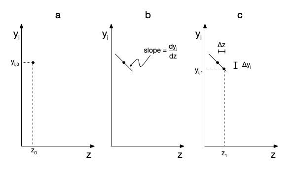

# Numerical Methods {#sec-apxd}

*Reaction Engineering Basics* assumes that most equations will be solved and parameters will be estimated numerically. This appendix briefly describes how numerical methods for accomplishing these tasks work, the input typically required by the numerical methods, and the quantities they return.

## Parameter Estimation {#sec-apxd_par_est}

Parameter estimation involves using statistical methods and experimental data to find the best values for unknown quantities appearing in a mathematical model. This is sometimes called fitting the model to the data. In this context, the unknown quantities are referred to as *model parameters*.

In each experiment, the values of one or more *adjusted experimental input variables* are set by the person doing the experiments, and then the value of an *experimental response* is measured. *Reaction Engineering Basics* only considers parameter estimation using data where the adjusted experimental input variables are the same in every experiment, where only one reaponse is measured in each experiment, and where the measured experimental response variable is the same in every experiment. The values of the experimental input variables and the response variable will change from one experiment to the next, but the variables are the same.

The difference between a measured experimental response and the corresponding model-predicted response is called the experiment residual. Generally, to find the best values for the parameters, the experiment residuals are squared to prevent positive and negative residuals from offsetting each other. The best values for the parameters are then taken to be those that minimize the sum of the squares of all of the experiment residuals. Thus, this is sometimes called least-squares fitting or least-squares parameter estimation.

### Linear Model Parameter Estimation

A model where the response is linearly dependent upon the adjusted experimental inputs is called a linear model. The linear models encountered in *Reaction Engineering Basics* always have either the form shown in @eq-y_equals_mx_plus_b or @eq-y_equals_mx. In both linear models $y$ is the response and $x$ is the adjusted input. @eq-y_equals_mx_plus_b has two parameters: the slope, $m$, and the intercept, $b$, while @eq-y_equals_mx has only one parameter, the slope.

$$
y=mx+b
$$ {#eq-y_equals_mx_plus_b}

$$
y=mx
$$ {#eq-y_equals_mx}

The sum of the squares of the experiment residuals, $\Psi$, is given in @eq-sum_squares_resids, where $y_{expt,i}$ is the measured experimental response in experiment $i$, and $y_{model,i}$ is the model-predicted response for experiment $i$. Substituting @eq-y_equals_mx_plus_b results in @eq-sum_squares_y_mx_b where $x_i$ is the value of the experimental input for experiment $i$.

$$
\Psi = \sum_i \left( y_{expt,i} - y_{model,i} \right)^2
$$ {#eq-sum_squares_resids}

$$
\Psi = \sum_i \left( y_{expt,i} - mx_i - b \right)^2
$$ {#eq-sum_squares_y_mx_b}

Equations for calculating the best values for $m$ and $b$ can be generated by taking the derivatives of $\Psi$ in @eq-sum_squares_y_mx_b with respect to $m$ and $b$ and setting them equal to zero. Analogous approach can be used to generate an expression for the best value for $m$ in  @eq-y_equals_mx.

Assuming that the experiment residuals conform to a Normal distribution, statistical methods can be used to calculate the upper and lower limits of the 95% confidence intervals for $m$ and $b$ and the coefficient of determination, $R^2$, among other statistical metrics.

#### Linear Model Assessment

The objective of parameter estimation is twofold: to find the best values for the model parameters and to assess the accuracy of the resulting model. Several criteria can be used to assess accuracy. First, if the model has perfect predictive power, the coefficient of determination will equal 1.0, and if it has absolutely no predictive power, $R^2$ will equal zero. Hence the closer $R^2$ is to zero, the greater the accuracy of the model.

Second, if lower and upper limits of the 95% confidence intervals for $m$ and $b$ are very close to the values of $m$ and $b$, that also indicates that the model is accurate. In other words, when the model is accurate, the 95% confidence interval for each parameter will be very small compared to the estimated value of that parameter value.

A graphical assessment is also possible when both the experimental $y_{expt,i}$ *vs.* $x_i$ data points and the $y_{model}$ *vs.* $x$ line are plotted on the same axes. When the model is accurate, the data points will all lie close to the line there will be no systematic trends in deviations.

Ultimately, assessing the accuracy of a fitted model involves a judgement call.

#### Linear Model Parameter Estimation Functions

Many mathematics software packages include a function that performs linear model parameter estimation. Linear least squares analysis can also be performed using many spreadsheet programs or handheld calculators. The required input consists of the set of experimental inputs, $\underline{x}$, and the corresponding set of measured experimental responses, $\underline{y}_{expt}$.

*Reaction Engineering Basics* assumes that whatever tool is used returns the best estimates for the slope, $m$, and intercept, $b$, the 95% confidence intervals for $m$ and $b$, and the coefficient of determination, $R^2$. At the minimum, every linear least-squares fitting tool will return the best estimates for $m$ and $b$. Often they can be configured to additionally return specific statistics. The more common statistics include the coefficient of determination, $R^2$, the correlation coefficient, $r$, the standard errors for each estimated parameter, and the 95% confidence interval for each estimated parameter. If the tool can't be configured to return a specific statistic, that statistic can usually be computed using the results that are returned.

### Non-Linear Model Parameter Estimation

to be added

## Solving Algebraic-Transcendental Equations {#sec-apxd_ates}

Algebraic-transcendental equations (ATEs) are one of the equation types that must be solved when performing reaction engineering tasks. (The acronym ATE is used in this book, but it is not generally used in other books or online.) In the context of *Reaction Engineering Basics,* ATEs are easily identifiable because they are the only equation type that does not contain derivatives. Slightly more specifically, a set of ATEs is a group of 1 or more mathematical equations that may involve or contain math operations (addition, subtraction, multiplication, and division). Terms in ATEs can be exponents or bases that are raised to some power, and they can appear in transcendental functions. Exponential functions are the most common transcendental functions appearing in the ATEs found in *Reaction Engineering Basics*. They arise any time an equation includes a rate coefficient that displays Arrhenius temperature dependence, @eq-arrhenius.

A set of $N$ ATEs can be solved to find the values of the $N$ variables appearing in them. A set of ATEs can have more than one solution. An ATE solver is a computer function that solves a set of ATEs numerically. This sub-appendix describes the input required by ATE solvers, how they work, the results they return, and potential issues that can arise when using them.

### ATE Solver Input 

Typically, an ATE solver must be provided with two inputs. The first is an initial guess for the solution, and the second is a residuals function. Depending upon the mathematics software being used, the solver may accept other input. The order and formatting of the arguments also vary between mathematics software packages.

#### The Initial Guess for the ATE Variables

As just noted, when an ATE solver is first called, it must be provided with an initial guess for a solution. Providing an acceptable guess is not usually difficult. In reaction engineering analyses, the ATE variables have a physical meaning. That, together with a qualitative understanding of reactor performance, provides guidance for making an initial guess. In this book, examples that involve solution of sets of ATEs will have "Click Here to See What an Expert Might be Thinking at this Point" callouts that discuss the choice of the initial guess for that set of equations. Similarly, some of the ATEs that are solved in *Reaction Engineering Basics* have multiple solutions. The initial guess determines which solution the solver will find, and a callout will describe how the initial guesses leading to each solution were generated.

#### The Residuals Function {#sec-apndx_residuals_fcn}

In preparation for numerically solving a set of ATEs, each equation must be rewritten as a residual expression. Doing so is trivially simple. If there is a zero on either side of the equals sign, no rearrangement is necessary. If not, everything on one side of the equals sign should be subtracted from both sides of the equation. This will result in an equation with a zero on one side of the equals sign. The nonzero side of that equation is called a residual. A residual expression is created by choosing a variable to represent the residual and setting it equal to the nonzero side of the equation. In *Reaction Engineering Basics,* $\epsilon$ is usually used to represent residuals.

As an example, consider the typical ATE mole balance shown in @eq-ate_not_as_residual. It does not have a zero on either side of the equals sign, so the right side of the equation, $\dot{n}_{A,1} + rV$, is subtracted from both sides, leading to @eq-ate_with_zero. Letting $\epsilon$ represent the residual, the corresponding residual expression, @eq-ate_as_residual, is written by setting $\epsilon$ equal to the non-zero side of @eq-ate_with_zero

$$
\dot{V}C_{A,0} = \dot{n}_{A,1} + rV
$$ {#eq-ate_not_as_residual}

$$
\dot{V}C_{A,0} - \dot{n}_{A,1} - rV =0
$${#eq-ate_with_zero}

$$
\epsilon = \dot{V}C_{A,0} - \dot{n}_{A,1} - rV
$${#eq-ate_as_residual}

If a set of $N$ ATEs is being solved, each of them must be converted into a residual expressions. In general each residual can be a function of all of the ATE variables. Substitution of a solution will cause all of the residuals to evaluate to zero.

The purpose of the residuals function is to evaluate the residuals, given a guess for the solution. The engineer solving the ATEs must write the residuals function, but because it will be called by the ATE solver, the arguments passed to it and the values it returns are specified by the ATE solver. The arguments to the residuals function are guesses for the ATE variables, and it always returns the corresponding values of the ATE residuals.

If additional input is needed to evaluate the residuals, that input must be made available to the residuals function by some means other than passing them as arguments. The documentation for the solver may suggest a preferred way to do this, but in *Reaction Engineering Basics* quantities that cannot be passed to the resdiuals function as arguments are assumed to be made available to it as global variables.

### How ATE Solvers Work

Effectively, the ATE solver uses an iterative, trial and error process to find a solution.

1. The ATE residuals corresponding to the initial guess are calculated and retained as the best solution so far.
2. The ATE solver generates a new guess and calculates the corresponding ATE residuals.
3. The residuals corresponding to the new guess and the best solution so far are compared.
4. Whichever guess gave residuals that are closer to zero is retained as the best solution so far
5. Steps 2 through 4 are repeated until the solver determines that either
    a. the best solution so far is acceptably close to the exact solution, or
    b. it cannot find a solution that is acceptably close to the exact solution.

For details on how the solver generates guesses, how it determines which set of residuals is closer to zero, and the criteria for the determinations in step 5, one can consult the documentation for the solver being used and reference works on numerical methods.

### Convergence and Solver Issues {#sec-ate_solver_issues}

Ideally, the ATE residuals should get closer and closer to zero with each iteration. This is called convergence to a solution. The solution returned by the solver will not be exact, but it will be "very close" to the exact solution. Put differently, when a converged solution is found, the difference between the solution returned by the solver and the exact solution is negligible. If the solver is unable to converge to the point where the residuals are "very close" to zero, it will print an error message and/or return a flag variable indicating that it did not converge and why.

ATE solvers can fail to converge for different reasons, and for each reason, there are corrective actions that can be taken. Nonetheless, if the initial guess provided to the solver is "close enough" to a solution, the solver will converge. When the ATE solver fails to converge it is a good idea to check the inaccurate solution it returned. If an ATE variable in that solution is absurdly large or small, it often indicates that these is an error in the computer code or that the units being used in the calculations are not consistent. Otherwise, the inaccurate solution, together with a qualitative understanding of reactor performance, may suggest a way to revise the initial guess so that the solver does converge. 

Finally, as already noted, sets of ATEs can have more than one solution. If a set of ATEs has multiple solutions, most ATE solvers will only find one of them. To find other solutions, the solver should be called again using a different initial guess.

### ATE Solver Return Values

Even if it fails to converge, an ATE solver typically will return two things. The first is the best solution it was able to find and the second is some indicator of whether it converged. The latter might be a boolean variable or an integer where the value of the integer indicates convergence or the reason why the solver stopped iterating. Some solvers also return a text string that provides a brief explanation of the reason why it stopped trying to improve the solution.

## Solving Initial-Value Ordinary Differential Equations {#sec-apxd_ivodes}

The design equations for many ideal reactors are linear, first-order, initial-value, ordinary differential equations (IVODEs). Most generally, a set of IVODEs will take the form shown in Equations [-@eq-example-ode-1] through [-@eq-example-ode-4]. In those equations $z$ is the independent variable; $y_1$, $y_2$, $y_3$, and $y_4$ are the dependent variables; and $m_{1,1}$ through $m_{4,4}$ and $g_1$ through $g_4$ can be constants (including zero) or functions of the independent and dependent variables. While four equations are being used here for illustration purposes, there can be any number of ordinary differential equations in the set as long as the number of ordinary differential equations is equal to the number of dependent variables, and there is only one independent variable. In reactor design equations the dependent variables ($y_i$'s) will be molar amounts or molar flow rates, temperature, pressure, and volumes or volumetric flow rates. The independent variable is either the distance from the reactor inlet ($z$) or time ($t$).

$$
m_{1,1}\frac{dy_1}{dz} + m_{1,2}\frac{dy_2}{dz} + m_{1,3}\frac{dy_3}{dz} + m_{1,4}\frac{dy_4}{dz} = g_1 
$$ {#eq-example-ode-1}

$$
m_{2,1}\frac{dy_1}{dz} + m_{2,2}\frac{dy_2}{dz} + m_{2,3}\frac{dy_3}{dz} + m_{2,4}\frac{dy_4}{dz} = g_2 
$$ {#eq-example-ode-2}

$$
m_{3,1}\frac{dy_1}{dz} + m_{3,2}\frac{dy_2}{dz} + m_{3,3}\frac{dy_3}{dz} + m_{3,4}\frac{dy_4}{dz} = g_3 
$$ {#eq-example-ode-3}

$$
m_{4,1}\frac{dy_1}{dz} + m_{4,2}\frac{dy_2}{dz} + m_{4,3}\frac{dy_3}{dz}  + m_{4,4}\frac{dy_4}{dz} = g_4 
$$ {#eq-example-ode-4}

A set of IVODEs applies in an interval of the independent variable, beginning at its initial value and ending at its final value. The numerical solution of a set of IVODEs consists of a set of values (i. e. a vector) of the independent variable and corresponding sets of values of each dependent variable spanning the range from their initial to their final values. An IVODE solver is a computer function that solves a set of IVODEs numerically. This sub-appendix describes the input required by IVODE solvers, how they work, the results they return, and potential issues that can arise when using them.

### IVODE Solver Input

Typically an IVODE solver must be provided with three inputs. The first is the initial values of the independent and dependent variables. The second is a stopping criterion, and the third is a derivatives function. Depending on the mathematics software package being used, the solver may accept other input. The order and formatting of the arguments and return values will vary from one software packge to another.

#### Initial Values and Stopping Criterion

The engineer solving the IVODEs can usually define the initial value of the independent variable. Most commonly it is difined to equal zero. The value of each dependent variable when the independent variables is at its initial value are their initial values. At the time when a set of IVODEs is solved, all of the initial values will be known. Typically either the final value of the independent variable or the final value of one of the dependent variables will also be knowny. In this situation, the identity of the variable for which the final value is known, along with that final value, make up the stopping criterion that must be provided as the second argument to the IVODE solver. Other types of stopping criteria are possible, but they are not encountered in *Reaction Engineering Basics*.

#### The Derivatives Function {#sec-apndx_derivatives_fcn}

In preparation for solving a set of $N$ IVODEs, they should be rearranged into a set of derivative expressions if they aren't already in that form. For example, Equations [-@eq-example-ode-1] through [-@eq-example-ode-4] need to be converted to derivative expressions of the form shown in Equations [-@eq-example-vector-ode-1] through [-@eq-example-vector-ode-4] where $f_1$, $f_2$, $f_3$, and $f_4$ each may be a function of $z$, $y_1$, $y_2$, $y_3$, and $y_4$, but not of their derivatives.

$$
\frac{dy_1}{dz}  = f_1 
$$ {#eq-example-vector-ode-1}

$$
\frac{dy_2}{dz} = f_2 
$$ {#eq-example-vector-ode-2}

$$
\frac{dy_3}{dz} = f_3 
$$ {#eq-example-vector-ode-3}

$$
\frac{dy_4}{dz} = f_4 
$$ {#eq-example-vector-ode-4}

That can be accomplished by algebraic manipulation of Equations [-@eq-example-ode-1] through [-@eq-example-ode-4], but it is particularly straightforward if the original IVODEs are written as a matrix equation. The coefficients in Equations [-@eq-example-ode-1] through [-@eq-example-ode-4], $m_{1,1}$, $m_{1,2}$, etc., can be used to construct a so-called mass matrix, $\boldsymbol{M}$, as shown in @eq-mass-matrix, the dependent variables can be used to construct a column vector, $\underline{y}$, as in equation @eq-dependent-var-vector, and the functions, $g_1$, $g_2$, $g_3$, and $g_4$, can be used to construct a column vector, $\underline{g}$, as in equation @eq-function-vector.

$$
\boldsymbol{M} = \begin{bmatrix} m_{1,1} \ m_{1,2} \ m_{1,3} \ m_{1,4} \\m_{2,1} \ m_{2,2} \ m_{2,3} \ m_{2,4} \\m_{3,1} \ m_{3,2} \ m_{3,3} \ m_{3,4} \\ m_{4,1} \ m_{4,2} \ m_{4,3} \ m_{4,4}  \end{bmatrix}
$$ {#eq-mass-matrix}

$$
\underline{y} = \begin{bmatrix} y_1 \\ y_2 \\ y_3 \\ y_4 \end{bmatrix}
$$ {#eq-dependent-var-vector}

$$
\underline{g} = \begin{bmatrix} g_1 \\ g_2 \\ g_3 \\ g_4 \end{bmatrix}
$$ {#eq-function-vector}

Equations [-@eq-example-ode-1] through [-@eq-example-ode-4] then can be written as a matrix equation, @eq-matrix-form-ivode. Pre-multiplying each side of @eq-matrix-form-ivode by the inverse of the mass matrix yields the desired derivative expressions, @eq-matrix-form-of-vector-ivodes. That is, comparing @eq-matrix-form-of-vector-ivodes to Equations [-@eq-example-vector-ode-1] through [-@eq-example-vector-ode-4], it is apparent that they are equivalent with  $f_1$, $f_2$, $f_3$, and $f_4$ given by @eq-g-in-terms-of-f.

$$
\boldsymbol{M}\frac{d}{dz}\underline{y} = \underline{g}
$$ {#eq-matrix-form-ivode}

$$
\frac{d}{dz}\underline{y} = \boldsymbol{M}^{-1} \underline{g}
$$ {#eq-matrix-form-of-vector-ivodes}

$$
\begin{bmatrix} f_1 \\ f_2 \\ f_3 \\ f_4 \end{bmatrix} = \underline{f} = \boldsymbol{M}^{-1} \underline{g}
$$ {#eq-g-in-terms-of-f}

The final argument that must be provided to an IVODE solver is a derivatives function. The purpose of the derivatives function is to evaluate the derivative of each dependent variable with respect to the independent variable, given values for the independent and dependent variables. It is written by the engineer who needs to solve the IVODEs, but is called by the IVODE solver. For that reason, the solver specifies the arguments and return values. Typically, the only arguments to the derivatives function are the independent and dependent variables and the only return values are the corresponding values of the derivatives. The solver sets how those quantities are formatted and the order in which they are passed or returned. If additional input variables are needed for evaluating the derivatives, that input must be made available to the derivatives function by some other means than passing them as arguments. In *Reaction Engineering Basics* quantities that cannot be passed to the derivatives function as arguments are assumed to be made available to it as global variables.

### How IVODE Solvers Work

An IVODE solver starts from the initial values, as illustrated graphically in panel (a) of @fig-ivode-integration-step for any one of the dependent variables, $y_i$. It isn't possible to plot $y_i$ *vs.* $z$ at that point because $y_i\left(z\right)$ is not known. (Indeed, $y_i\left(z\right)$ is the solution to the IVODE.) Instead, the solver uses the derivatives function to calculate the value of each of the derivatives at $\left(z_0,y_{i,0}\right)$. The derivative, $\frac{dy_i}{dz}$, at that point is the slope of the unknown function at $\left(z_0,y_{i,0}\right)$. This is shown graphically in panel (b) of @fig-ivode-integration-step.

{#fig-ivode-integration-step}

The solver then approximates $y_i$ *vs.* $z$ as a straight line with that slope. It only does that over a small increment in the independent variable known as the integration step size and indicated in the figure as $\Delta z$. The resulting point, $\left(z_1,y_{i,1}\right)$, is shown in panel (c) of @fig-ivode-integration-step. This process is sometimes referred to as taking an integration step. Effectively, the solver uses the small straight line segment between $\left(z_0,y_{i,0}\right)$ and $\left(z_1,y_{i,1}\right)$ to approximate the true solution, $y_i\left(z\right)$, in that interval. The accuracy of this approximation increases as $\Delta z$ decreases, so typically the solver uses small steps. A new integration step is then taken starting from $\left(z_1,y_{i,1}\right)$.

Of course, the solver eventually must stop taking integration steps. After completing each step, the solver checks to determine whether making that step resulted in the stopping criterion being satisfied. If not, the solver takes another integration step. If the stopping criterion has been exceeded, the step size is adjusted to that the stopping criterion is satisfied exactly. The solver then returns the values of the dependent variables and the independent variable for all of the steps it took while solving the IVODEs, including those final interpolated values.

That was a simplified summary of how an IVODE solver works. For details on how the solver chooses the step size and other variations on how it works, one can consult the documentation for the solver being used and reference works on numerical methods.

### IVODE Solver Issues

Generally IVODE solvers are quite robust when solving the kinds of ODEs encountered in introductory reaction engineering courses. However, there are three issues to be aware of. The first is failure to reach the known final value of a dependent variable. When the final value of a *dependent* variable is being used as the stopping criterion, many solvers require the user to provide *both* that final value *and* a final value for the independent variable. The solver then takes steps as described above, and after each step it checks to see whether either variable has reached its specified final value. If the final value of the *independent* variable is too small, the solver may reach that value first and stop. As a consequence, the known final value of the *dependent* variable will not have been reached, and the result that is returned will not span the full interval wherein IVODEs apply. Therefore it is important to check the solution and verify that the dependent variable reached its known final value.

To avoid having the solver stop because it reached the stopping criterion for the *independent* variable, it is tempting to specify a very large final value for that independent variable. This could result in the second solver issue. The initial step size used by the solver often increases when the final value of the independent variable is increased. In some extreme cases, if the initial step size becomes too large, the linear approximation indicated in @fig-ivode-integration-step is not valid, resulting in an inaccurate solution. Therefore, it is important to check that the step size was not too large. The solution that is returned will include the final value of the independent variable. If it is orders of magnitude smaller than the guess provided to the solver, the solution can be repeated using a final value for the independent variable that is only slightly greater than the value returned the first time the IVODEs were solved.

The third possible issue arises when solving sets of IVODEs where one of the dependent variables changes very abruptly over a very small range of the independent variable. The abrupt changes in that dependent variable may significantly affect the other dependent variables over a much broader range of the independent variable. Equations like this are called [stiff ODEs]{.underline}, and they require special treatment of the step size. Therefore, when solving sets of ODEs, one should pay attention to whether any of the dependent variables change very abruptly as the independent variable changes. If they do, it is advisable to repeat the solution using a solver that is specifically tailored to stiff ODEs.

### IVODE Solver Return Values

As noted above, the solution of a set of IVODEs is a set of corresponding values of the independent and dependent variables spanning the range from their initial to their final values. The first value in each set will be the initial value of that variable. The rest of the values in the set will be the values at the end of each integration step, ending with the variable's final value.

### Coupled ATEs and IVODEs

Sometimes a set of IVODEs will include unknown constants or initial values that aslo appear in a set of implicit or explicit ATEs. These unknowns are "coupled" in the sense that both the IVODEs and the ATEs they appear in must be satisfied. When this situation is encountered, the ATEs are solved first. To do so, an ATE solver is used, and it calls the residuals function for the ATEs passing a guess for the coupled unknowns as the argument. Within the residuals function an IVODE solver can then be used to solve the IVODEs using the guess for the coupled constants. Assuming the ATE solver converges, it will return the values of the coupled constants, after which an IVODE solver can then be used to solve the IVODEs using the returned values of the coupled constants.

## Solving Boundary-Value Ordinary Differential Equations {#sec-apxd_bvodes}