# BSTR Analysis {#sec-ch7} 

@sec-ch6 examined ideal continuous stirred tank reactors (CSTRs). This chapter introduces ideal batch stirred tank reactors (BSTRs) and considers their analysis. It may prove helpful to keep the learning objectives in @sec-ch7_learning_objectives in mind while reading it.

## Ideal Batch Stirred Tank Reactors (BSTRs)

Ideal stirred tanks are vessels that contain a perfectly mixed fluid. The distinguishing characteristic of a [batch]{.underline} stirred tank reactor is that no reagents flow into or out of a BSTR while the reaction is taking place. Apart from that distinction, they are very similar to CSTRs. For example, @fig-bstr_heat_exchange_schematics shows a BSTR with the same heat exchange configurations as used with CSTRs. Heat can be added to or removed from the reacting fluid in a variety of other ways, but *Reaction Engineering Basics* only considers heat exchange involving an external fluid that exchanges either its sensible heat or its latent heat, but not both.

::: {#fig-bstr_heat_exchange_schematics layout-ncol=3 layout-valign="center"}

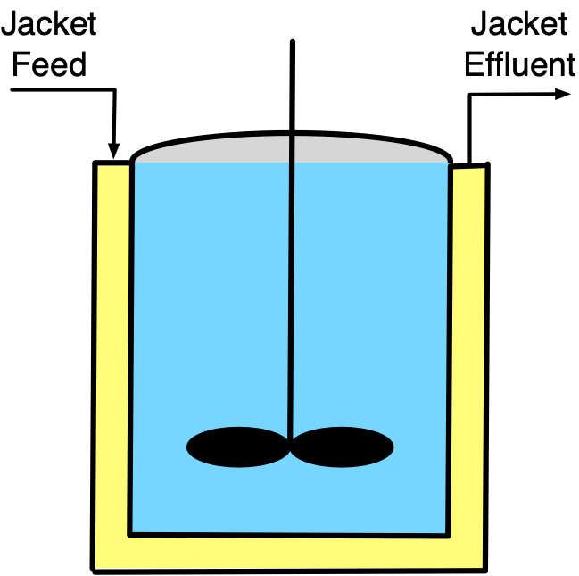{width="100%"}

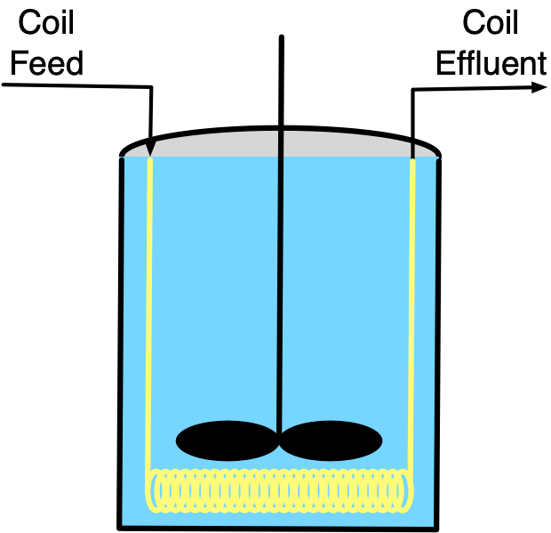{width="100%"}

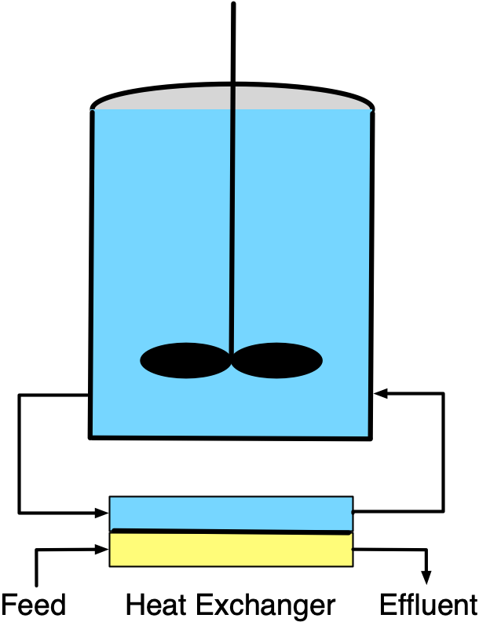{width="100%"}

Schematic representations of a batch stirred tank reactor where heat is exchanged with an external fluid through the walls of (a) a jacket, (b) a submerged coil, and (c) an external heat exchanger.
:::

For chemical processing, the most common physical form of BSTRs is a cylindrical tank with rigid walls. A reacting fluid (indicated by blue shading in @fig-bstr_heat_exchange_schematics) that is gaseous will completely fill the reactor volume, but when processing liquids, there may be some headspace (indicated by gray shading) at the top of the reactor that does not contain reacting fluid. There must be some means of thoroughly and rapidly mixing the reacting fluid which commonly involves an agitator that is immersed in the reacting fluid.

The full set of assumptions used in the ideal BSTR model is provided in [Appendix -@sec-apxc_BSTR_balances]. While stirred tanks are most common, they are not often used for the processing of gases or when a solid catalyst is being used because stirring gases or small solid particles is difficult. Other configurations may be used and they can be modeled as BSTRs as long as they conform to the assumptions used when deriving the BSTR design equations. For example, @sec-ch11 describes a few laboratory BSTRs that are not stirred tanks.

There are advantages to using a BSTR, as opposed to the other types of ideal reactors, particularly the flow reactors. BSTRs offer flexibility both in terms of the reactions being run and in the details of operating the process. In a situation where the demand for products is too small to warrant continuous production, a batch reactor might be used to make one product for a few weeks, and then be used to make a different product for the next few weeks. This kind of flexibility avoids having the reactor sit idle for extended periods of time. Similarly, if the production of a product involves heating to and holding at two or more different temperatures during processing, it may be easier to produce it in a batch reactor than to set up a chain of continuous reactors operating at the necessary temperatures. Similarly, if the addition of one reagent needs to be delayed, it *may* be possible to do so using a BSTR as described below under BSTR Operation. Again, this may be preferred over two continuous reactors operating in series with that reagent added to the second reactor. In contrast to plug flow reactors (@sec-ch9), a much broader range of heat transfer area per volume of reacting fluid is possible. Even after the reactor has been constructed, the length of a submerged coil or the area of an external heat exchanger can be altered if additional heat transfer capability is needed.

There are also disadvantages to using BSTRs. As described below, the operation of a BSTR includes periods of time during which no reaction is taking place. Compared to reactors that run continuously, this can lead to a lower net rate of production. Additionally, the operation of a BSTR is more labor intensive than operation of a continuous reactor. This adds to the cost of production, meaning a higher product selling price is necessary in order to make a profit. Another issue with batch processes is that of batch-to-batch consistency. As an example, consider the batch production of an expensive perfume. It is critically important that every batch smells the same. Consequently, in addition to being labor intensive, batch processing requires well-trained operators who are careful to precisely follow the specified operational procedure and not deviate from it. Food and beverage production similarly demand high batch-to-batch consistency. This can be even more challenging if, as an example, the process utilizes agricultural reagents that can vary from season to season or year to year.

In light of their advantages and disadvantages, BSTRs are often used to produce value-added products. These are products for which the market demand is smaller, but the price, and therefore the profit per pound, is greater. This is in contrast to commodity products where the demand for large quantities is high, but the price per pound is relatively small. High volume production is usually performed in a continuous reactor.

## BSTR Operation

By its nature, there are times during which reaction is not taking place in a batch reactor. Before reaction can take place, the reactor must first be cleaned (or, in some cases, sterilized) to remove anything “left behind” by the last reaction that was run. Then the reactants must be prepared and charged into the reactor. From this point on, the operation is much like a cooking recipe. A prescribed series of heating and cooling steps is followed, with reaction taking place during every step. A simple example might be that after the reactants are charged, the reactor is heated to a specified temperature, held at that temperature for a specified length of time, and then cooled back to room temperature. In almost all situations, the reaction has ceased by the end of the last step, either because one of the reactants has been fully consumed or because the temperature has been lowered to the point where the rate is effectively zero. The last step in the operating protocol then is to remove the product from the reactor. Often it is transferred to a holding tank from which it can be sent elsewhere for further processing, purification, or longer term storage.

Of course, the operational protocol, i. e. the “recipe,” could be more complicated, requiring any number of steps (also called stages). In some cases an intermediate stage in the operational protocol might call for the addition of a reagent. As long as that reagent is added instantaneously, the reactor can be analyzed as a BSTR. However, if the reagent is added over time as reactions continue to occur, the reactor is no longer a BSTR and that phase of processing must be analyzed as a semi-batch reactor (@sec-ch8).

### Turnaround and Net Rate {#sec-ch7_net_rate}

It is very important to recognize that the productivity of the reactor, that is the amount of product it produces per hour, must be calculated taking the so-called *turnaround time* into account. That is, one must include the time needed to clean, fill and drain the reactor, not just the duration of the operating protocol. Doing so permits the definition of the net rate of generation of reagent $i$ given in @eq-bstr_net_rate.

$$
r_{i,net} = \frac{n_{i,f} - n_{i,0}}{t_{op} + t_{turn}}
$$ {#eq-bstr_net_rate}

Even if the turnaround time approaches zero, the net rate can be defined using this equation. The net rate is useful for characterizing the overall process. As the reaction is progressing, the rate of reaction is continually changing because the temperature and composition are changing. The rate of reaction at any one time during the processing is referred to as the instantaneous rate at that time. The net rate defined in @eq-bstr_net_rate is a kind of average of the instantaneous rate over the processing time. Similarly, it is sometimes useful to differentiate between overall and instantaneous values of other quantities such as yields, conversions, selectivities, etc.

## BSTR Design Equations {#sec-ch7_bstr_design_eqns}

The reactor design equations for BSTRs are derived in [Appendix -@sec-apxc_BSTR_balances]. The general form of the BSTR mole balances is presented in @eq-bstr_mole_balance, and the energy balance on the reacting fluid in a BSTR is given in @eq-bstr_energy_balance. The energy balances for a heat exchange fluid that exchanges only sensible heat, @eq-exchange_energy_bal_sensible, and for one that only exchanges latent heat, @eq-exchange_energy_bal_latent, are also reproduced below.

$$
\frac{dn_i}{dt} = V \sum_j \nu_{i,j}r_j
$${#eq-bstr_mole_balance}

$$
\left(\sum_i n_i \hat C_{p,i} \right) \frac{dT}{dt} - V\frac{dP}{dt}  - P  \frac{dV}{dt}  = \dot Q - \dot W - V \sum_j \left(r_j \Delta H_j \right)
$${#eq-bstr_energy_balance}

$$
\rho_{ex} V_{ex} \tilde C_{p,ex}\frac{dT_{ex}}{dt} = -\dot Q - \dot m_{ex} \int_{T_{ex,in}}^{T_{ex}} \tilde C_{p,ex}dT
$$

$$
\frac{\rho_{ex} V_{ex} \Delta H_{\text{latent},ex}^0}{M_{ex}} \frac{d \gamma}{dt} = - \dot Q - \gamma \dot m_{ex} \frac{\Delta H_{\text{latent},ex}^0}{M_{ex}}
$$

As noted in @sec-ch5_ideal_reactor_analysis, when the condensation of a vapor, such as saturated steam, is used to heat a reactor, the steam pressure in the jacket, coil, or external heat exchanger may be held constant, removing only the condensed water as it forms. In this mode of operation, the exchange fluid temperature is known, so the mole and reacting fluid energy balances can be solved independently. The exchange fluid energy balance is then given by @eq-latent_heat_removing_only_liquid, where $\dot{m}_{ex}$ is the instantaneous mass flow rate of the condensed water leaving the jacket, coil, or external heat exchanger.

$$
0 = \dot Q + \dot m_{ex} \frac{\Delta H_{\text{latent},ex}^0}{M_{ex}}
$${#eq-latent_heat_removing_only_liquid}

:::{.callout-note collapse="false"}
## Note

It is important to notice that the $V\frac{dP}{dt}$ and $P\frac{dV}{dt}$ terms in the reacting fluid energy balance will have units of pressure $\times$ volume $\div$ time. Most of the other terms will have units of energy $\div$ time. This means that a unit conversion is needed. One easy way to do this is to multiply the $V\frac{dP}{dt}$ and $P\frac{dV}{dt}$ terms by the ideal gas constant in units of energy $\div$ mol $\div$ temperature and divide by the ideal gas constant in units of pressure $\times$ volume $\div$ mol $\div$ temperature. The moles and temperatures cancel out giving the necessary conversion factor. This works even for a liquid phase system because the ideal gas law is not being used as the equation of state (i. e. to convert from pressure volume to mol temperature). In *Reaction Engineering Basics* the rate of doing work, $\dot{W}$, is almost always negligible. However, if it is non-zero, it will likely have units of power (e. g. hp) or pressure $\times$ volume $\div$ time, and again a unit conversion is needed.

:::

[Chapter -@sec-ch5_quant_analysis] described how to determine which reactor design equations are needed for a given analysis. Once the necessary BSTR design equations have been identified, they can often be simplified. 

* If the reactor walls are rigid (or if an ideal, incompressible liquid is being processed) then the volume, $V$, will be constant and its time derivative, $\frac{dV}{dt}$, will equal zero.
* If the work associated with agitation is negligible (it usually is) and there are no other shafts or moving boundaries, then the rate at which the reacting fluid performs work, $\dot W$, on its surroundings is also equal to zero.
* When an ideal, incompressible liquid is being processed, the pressure, $P$, is constant and its time derivative, $\frac{dP}{dt}$, is equal to zero. (The pressure gradient within the reacting fluid due to the hydrostatic head is neglibible.) 
* For liquids, the sensible heat term in @eq-bstr_energy_balance can be expressed in terms of the mass-specific or volume-specific heat capacity of the solution as a whole instead of the individual molar heat capacities.

$$
\left(\sum_i n_i \hat C_{p,i} \right) \frac{dT}{dt}\ \Leftrightarrow\ \rho V \tilde C_p \frac{dT}{dt}\ \Leftrightarrow\ V \breve C_p \frac{dT}{dt}
$${#eq-equiv_bstr_sens_heat_terms}

The BSTR design equations are initial value ordinary differential equations (IVODEs, see [Appendix -@sec-apxd_ivodes]). When the reacting fluid is an ideal, incompressible liquid mixture, the $\frac{dP}{dt}$ and $\frac{dV}{dt}$ terms equal zero, as noted above. This will cause the number of IVODEs and the number of dependent variables appearing in them to be equal, so that the design equations can be solved. However, when the reacting fluid is an ideal gas, and the reactor walls are rigid, the $\frac{dV}{dt}$ term will equal zero, but generally the $\frac{dP}{dt}$ term will not. In this situation, the differential form of the ideal gas law for a closed system (with $\frac{dV}{dt}$ set equal to zero), @eq-differential_closed_ideal_gas_law, must be added to the other BSTR design equations before they can be solved.

$$
V \frac{dP}{dt} = R\left(\sum_i{n_i} \frac{dT}{dt} + T \sum_i{\frac{dn_i}{dt}}\right)
$${#eq-differential_closed_ideal_gas_law}

Often the operational protocol for a BSTR has multiple stages. When this is true, each stage of the protocol *may* need to be analyzed separately from the other stages because terms in the reactor design equations may change. The reactor design equations for BSTRs are ordinary differential equations with elapsed time, $t$, as the independent variable. The stages occur sequentially, and consequently the values of $t$ and the dependent variables at the end of one stage in the operating protocol become the initial values for the next stage. The one exception to this is if a reagent is *instantaneously* added at the end of a stage. In that situation, the initial values for the next stage are the result of mixing the added reagent with the reagents in the BSTR at the end of the previous stage.

When rate expressions are substituted into the BSTR mole and energy balances, they typically introduce concentrations or partial pressures of reagents. When the design equations are solved, those concentrations and partial pressures must be expressed in terms of the molar amounts of the reagents (see [Appendix -@sec-apxd_ivodes]). By definition, the concentration is simply the molar amount divided by the volume, @eq-concentration_closed.

$$
C_i = \frac{n_i}{V}
$$

For ideal gases, the partial pressure is related to the molar amount through the ideal gas law, @eq-partial_pressure.

$$
P_i = \frac{n_iRT}{V}
$$

When heat transfer involves an exchange fluid as shown in @fig-bstr_heat_exchange_schematics, the rate of heat exchange in the energy balances can be calculated using @eq-heat_transfer_rate, reproduced below. If the reactor operates adiabatically (i. e. it is perfectly insulated and does not have a shell, coil or external heat exchanger), $\dot{Q}$ is equal to zero.

$$
\dot Q = UA\left( T_{ex} - T \right)
$$

## Learning Objectives and Examples {#sec-ch7_learning_objectives}

The numbers in parentheses in the following list of learning objectives refer to the examples that follow in this section. Upon completion of this chapter, readers should

* know the definition and/or defining equation for BSTR mole balance, BSTR energy balance, headspace, turnaround time, and net rate
* understand that
	* the ideal BSTR model assumes that the reacting fluid is a perfectly mixed, single-phase fluid
    * while reactions are taking place in a BSTR, reagents do not flow into or out of the reactor
    * heat exchange fluid may flow through the reactor shell, coil, or external heat exchanger while reactions are taking place 
    * generally, for gas phase systems, the differential form of the ideal gas law for a closed system must be added to the other BSTR design equations before they can be solved.
* be able to
	* select, modify, and simplify the design equations for modeling a given BSTR (-@sec-ch7_ex1, -@sec-ch7_ex2, -@sec-ch7_ex4, -@sec-ch7_ex3, -@sec-ch7_ex5)
	* use the BSTR design equations, together with any other necessary equations, to complete a reaction engineering assignment involving
        * operational protocols with one (-@sec-ch7_ex1, -@sec-ch7_ex2, -@sec-ch7_ex4, -@sec-ch7_ex5) or more (-@sec-ch7_ex3) stages
		* gas (-@sec-ch7_ex4) or liquid (-@sec-ch7_ex1, -@sec-ch7_ex2, -@sec-ch7_ex3, -@sec-ch7_ex5) phase reacting systems
		* non-isothermal (-@sec-ch7_ex2, -@sec-ch7_ex4, -@sec-ch7_ex3, -@sec-ch7_ex5) or adiabatic operation (-@sec-ch7_ex1)
		* heat exchange fluids that transfer latent (-@sec-ch7_ex3, -@sec-ch7_ex5) or sensible (-@sec-ch7_ex2, -@sec-ch7_ex3) heat
		* single (-@sec-ch7_ex1, -@sec-ch7_ex3) or multiple (-@sec-ch7_ex2, -@sec-ch7_ex4, -@sec-ch7_ex5) reactions
		* response (-@sec-ch7_ex1, -@sec-ch7_ex2, -@sec-ch7_ex5) or optimization (-@sec-ch7_ex4, -@sec-ch7_ex3) tasks
	* use qualitative analysis to assess and explain results from a quantitative analysis (-@sec-ch7_ex1, -@sec-ch7_ex2, -@sec-ch7_ex4, -@sec-ch7_ex3, -@sec-ch7_ex5)

::: {.callout-important collapse="true"}
## Computer Code for Performing Calculations

The examples presented in *REB, The Book* describe how to perform the necessary calculations numerically, but they do not provide computer code for doing so. This is intentional so that readers can use whatever programming language and development environment they choose.

For readers who are interested, the Assignments by Topic Section of [*REB, The Course*]() describes and discusses performing the calculations for each example using Python, and includes links to the source code.

:::

### Concentration, Temperature and Rate Profiles during Adiabatic Operation of a BSTR {#sec-ch7_ex1}

The liquid-phase reaction between A and B, equation (1), is irreversible. At the conditions of interest, the heat of reaction is constant and equal to -101.2 kJ mol^-1^. The rate expression is given in equation (2), where the rate coefficient exhibits Arrhenius temperature dependence with a pre-exponential factor of 5.11 x 10^4^ L mol^-1^ s^-1^ and an activation energy of 74.8 kJ mol^-1^.

Two solutions, one containing only reagent A at 180 °C and one containing only reagent B at 180 °C, are charged to an adiabatic BSTR producing 1900 L of solution initially containing 2.9 mol A L^-1^ and 3.2 mol B L^-1^ at 180 °C. The solution is ideal and has a constant heat capacity of 1.23 cal g^-1^ K^-1^ and a constant density of 1.02 g cm^-3^. Plot the concentrations of A, B, Y, and Z, the reacting fluid temperature, and the instantaneous reaction rate for the first 2 h of reaction, and comment upon the shapes of the graphs.

$$
A + B \rightarrow Y + Z \tag{1}
$$

$$
r = kC_AC_B \tag{2}
$$

---

:::{.callout-tip collapse="true"}
## Click Here to See What an Expert Might be Thinking at this Point

This assignment describes a single BSTR that operates adiabatically. At least one extensive quantity (the volume) is known so a basis cannot be chosen. The assignment requests final concentrations and temperatures, so it will be necessary to generate, simplify and solve the BSTR design equations. Doing so will yield the moles and temperature as functions of time, so I don't need to use time as a parameter.

I'll start by summarizing the information provided in the assignment narrative. I will use a subscripted "0" to denote initial values and a subscripted "f" to denote final values. I'll use underlined variable symbols, e. g. $\underline{t}$, to represent arrays containing more than one value of the variable.

:::

**Assignment Summary**

[Reaction]{.underline}:

$$
A + B \rightarrow Y + Z \tag{1}
$$

[Rate Expression]{.underline}:

$$
r = kC_AC_B \tag{2}
$$

[Reactor]{.underline}: liquid-phase, adiabatic BSTR with a one-stage operating protocol

[Given Constants]{.underline}: $\Delta H_1$ = -101.2 kJ mol^-1^, $k_{0,1}$ = 5.11 x 10^4^ L mol^-1^ s^-1^, $E_1$ = 74.8 kJ mol^-1^, $V$ = 1900 L, $T_0$ = (180 + 273.15) K, $C_{A,0}$ = 2.9 mol L^-1^, $C_{B,0}$ = 3.2 mol L^-1^, $\tilde{C}_p$ = 1.23 cal g^-1^ K^-1^, $\rho$ = 1.02 g cm^-3^, and $t_f$ = 2 h.

[Deliverables]{.underline}: $\underline{C}_A$, $\underline{C}_B$, $\underline{C}_Y$, $\underline{C}_Z$, $\underline{T}$, and $\underline{r}_1$ *vs.* $\underline{t}$ as graphs.

**Formulation of the Equations**

:::{.callout-tip collapse="true"}
## Click Here to See What an Expert Might be Thinking at this Point

I'll follow the computational strategy described in [Chapter -@sec-ch5_workflow] which begins with generation and simplification of the reactor design equations for modeling the reactor. Mole balances are always needed, and I'll write a BSTR mole balance, @eq-bstr_mole_balance, on each of the reagents. In this assignment, only one reaction is taking place, so the summation reduces to a single term.

$$
\frac{dn_i}{dt} = V \sum_j \nu_{i,j}r_j \qquad \Rightarrow \qquad \frac{dn_i}{dt} = V \nu_i r_1
$$

This BSTR is not isothermal, so the mole balances cannot be solved independently of an energy balance on the reacting fluid, @eq-bstr_energy_balance. Here the reacting fluid is a liquid which I will assume to be an incompressible ideal solution. Consequently, the reacting fluid volume and the total pressure are constant, and their time derivatives are equal to zero. The reactor is adiabatic, so the rate of heat input, $\dot{Q}$, is equal to zero. There are no shafts or moving boundaries other than the agitator, and the rate at which it performs work is negligible, so $\dot{W}$ is also equal to zero. With only one reaction taking place, the summation over the reactions reduces to a single term. The mass-specific heat capacity of the entire solution is provided, so the sensible heat term can be re-written using that heat capacity, @eq-equiv_bstr_sens_heat_terms. Finally, the energy balance can be put in the form of a derivative expression by dividing both sides by $\rho V \tilde{C}_p$.

$$
\cancelto{\rho V \tilde{C}_p}{\left(\sum_i n_i \hat C_{p,i} \right)} \frac{dT}{dt} - \cancelto{0}{V\frac{dP}{dt}}  - \cancelto{0}{P\frac{dV}{dt}}  = \cancelto{0}{\dot Q} - \cancelto{0}{\dot W} - V \cancelto{r \Delta H}{\sum_j \left(r_j \Delta H_j \right)}
$$

$$
\rho V \tilde{C}_p \frac{dT}{dt} = - V r_1 \Delta H_1
$$

$$
\frac{dT}{dt} = -\frac{V r_1 \Delta H_1}{\rho V \tilde{C}_p}
$$

In this assignment the BSTR operates adiabatically, so there isn't an exchange fluid, and an exchange fluid energy balance cannot be written. Momentum balances are not used with stirred tank reactors. This gives five reactor design equations that contain five dependent variables, and consequently it is not necessary to add an IVODE or eliminate a dependent variable. So for this reactor, the design equation consist of mole balances on A, B, Y, and Z and an energy balance on the reacting fluid.

:::

[Reactor Model Equations]{.underline}

$$
\frac{dn_A}{dt} = -r_1V \tag{3}
$$

$$
\frac{dn_B}{dt} = -r_1V \tag{4}
$$

$$
\frac{dn_B}{dt} = -r_1V \tag{5}
$$

$$
\frac{dn_Z}{dt} = r_1V \tag{6}
$$

$$
\frac{dT}{dt} = -\frac{r_1 \Delta H_1}{\rho \tilde{C}_p} \tag{7}
$$

:::{.callout-tip collapse="true"}
## Click Here to See What an Expert Might be Thinking at this Point

For a BSTR, the design equations are IVODEs, and they are solved numerically to find corresponding sets of values of the independent and dependent variables.

The only additional unknown appearing in the design equations is the rate which can be calculated using the given rate expression. That introduces three other additional unknowns, the rate coefficient and the concentrations of A and B. The former can be calculated using the Arrhenius expression and the concentrations, using their defining equations for a closed system.

:::

[Reactor Model Variables]{.underline}: $\underline{t}$, $\underline{n}_A$, $\underline{n}_B$, $\underline{n}_Y$, $\underline{n}_Z$, and $\underline{T}$

[Additional Computable Unknowns]{.underline}: $r_1$, $k_1$, $C_A$, and $C_B$

$$
k_1 = k_{0,1}\exp{\left( \frac{-E_1}{RT} \right)} \tag{8}
$$

$$
C_i = \frac{n_i}{V} \quad i = A \text{ and } B \tag{9}
$$

:::{.callout-tip collapse="true"}
## Click Here to See What an Expert Might be Thinking at this Point

To solve the design equations numerically (see [Appendix -@sec-apxd_ivodes]) I must provide initial values for all of the variables, a stopping criterion, and a derivatives function. I can define $t=0$ to be the instant that the two solutions are mixed into the reactor. The initial values of the dependent variables are then equal to the molar amounts added to the reactor and the temperature at that instant. The assignment narrative provides the initial concentrations and the reacting fluid volume, so calculating the initial molar amounts is straightforward.

The assignment requests graphs of the concentrations, temperature and instantaneous reaction rate over the first two hours of operation. As such, the stopping criterion is that $t = t_f$ (2 h).

The derivatives function must accept values of the independent and dependent variables at the start of an integration step as its only arguments and return the values of the derivatives. To do so, the values of the independent and dependent variables at the start of an integration step can be used to calculate the additional computable unknowns using the equations given above. Then the derivatives can be evaluated using the reactor design equations and returned.

Solving the design equations will yield corresponding sets of values of the molar amounts and reacting fluid temperature spanning times from $t=0$ to $t=t_f$. The reacting fluid temperature can be plotted directly *vs.* time. The concentrations over time can be calculated using the defining equation for concentration in a flow system, and then plotted. Finally, the temperature, concentration of A, and concentration of B can be used to calculate the instantaneous rate *vs.* time.

:::

[IVODE Solver Inputs]{.underline}: 

1. Initial values of the reactor model variables shown in @tbl-ch7_ex1_initial_values.
2. Stopping criterion that $t$ equals the final value shown in @tbl-ch7_ex1_initial_values.
3. Derivatives function that
	a. receives the BSTR model variables ($t$, $n_A$, $n_B$, $n_Y$, $n_Z$, and $T$) at the start of an integration step and
	b. calculates and returns the corresponding values of the BSTR model derivatives, equations (3) through (7).

| Variable | Initial Value | Final Value |
|:------:|:-------:|:-------:|
| $t$ | $0$ | $t_f$ |
| $n_A$ | $n_{A,0} = C_{A,0}V$ | |
| $n_B$ | $n_{B,0} = C_{B,0}V$ | |
| $n_Y$ | 0 | |
| $n_Z$ | 0 | |
| $T$ | $T_0$ | |
  
: Initial and final values of the design equation variables. {#tbl-ch7_ex1_initial_values}

[Deliverables Equations]{.underline}:

$$
\underline{C}_i = \frac{\underline{n}_i}{V} \qquad i = A, B, Y, \text{ and } Z \tag{10}
$$

$$
\underline{r}_1 = k_{0,1} \exp{\left(\frac{-E_1}{R\underline{T}}\right)}\underline{C}_A\underline{C}_B \tag{11}
$$

**Implementation of the Calculations**

Computer code to perform the calculations can be written using a variety of programming languages and environments, and the actual code can be structured in a variety of ways. Referring to the preceding assignment summary and formulation of the equations, here are the essential things it must do, irrespective of the programming language and environment that is used.

1. Make the given and known constants available wherever they are needed.
2. Define the derivatives function.
3. Define the initial values and stopping criterion.
4. Call an IVODE solver
	a. pass the initial values, stopping criterion, and derivatives function as arguments, and
	b. receive the reactor model variables which will consist of corresponding sets of values of the elapsed time, molar amounts of A, B, Y, and Z, and the reacting fluid temperature.
5. Calculate corresponding sets of values of the concentrations of A, B, Y, Z, and the reaction rate.
6. Generate the requested graphs.

**Results and Discussion**

The calculations were performed as described above. The variation of concentrations of reagents, A, B, Y, and Z, during the first two hours of operation of the BSTR are shown in  @fig-example_7_4_1_concentrations. The variation of the reacting fluid temperature during that period is shown in @fig-example_7_4_1_temperatures, and the variation of the instantaneous rate is shown in @fig-example_7_4_1_rates.

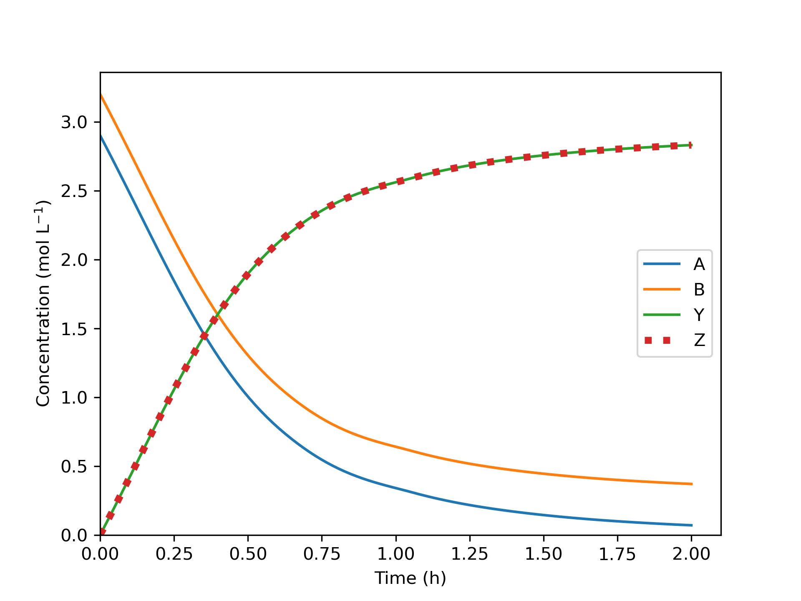{#fig-example_7_4_1_concentrations width="60%"}

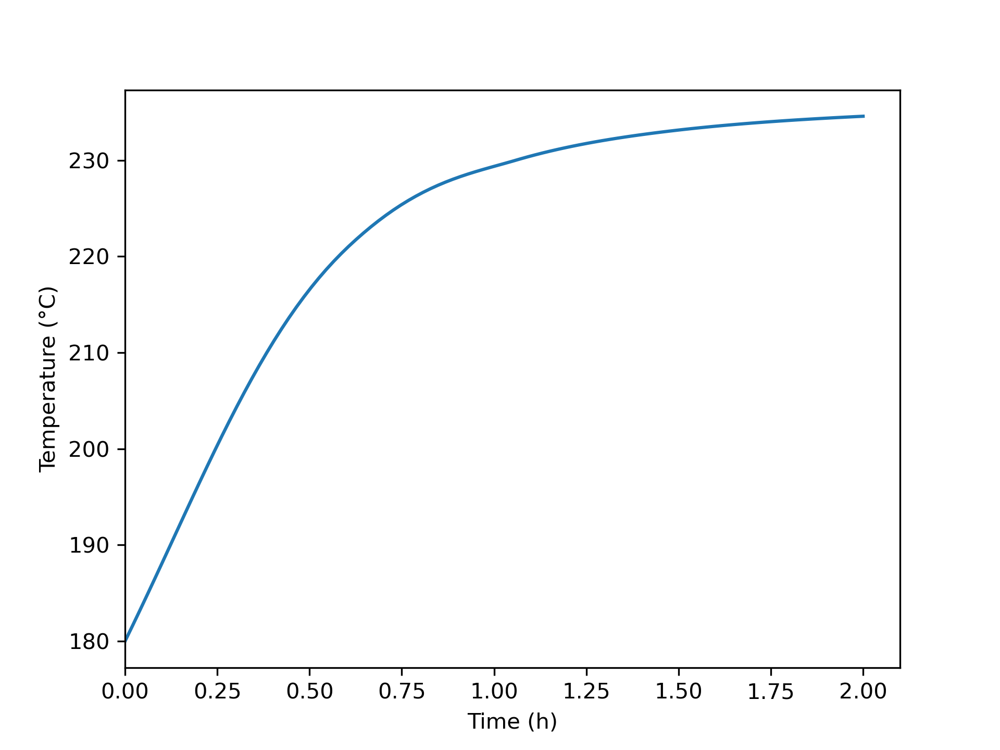{#fig-example_7_4_1_temperatures width="60%"}

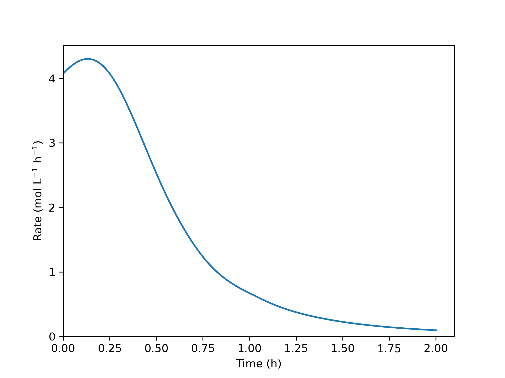{#fig-example_7_4_1_rates width="60%"}

The concentrations of the reactants, A and B, decrease monotonically during the first two hours of operation while the concentrations of the products, Y and Z, increase. The temperature increases steadily, too. The variation of the reaction rate is different. Initially it increases, but then it passes through a maximum after which it steadily decreases. A qualitative analysis shows that the variations in the concentrations, temperature and rate seen in Figures [-@fig-example_7_4_1_concentrations], [-@fig-example_7_4_1_temperatures], and [-@fig-example_7_4_1_rates] are expected.

At $t=0$, the concentrations of the reagents and the temperature are all at their initial values. At that point the rate is positive, so *after a short interval of time* the concentrations of A and B will have decreased slightly and the concentrations of Y and Z will have increased slightly due to the occurrence of the reaction. Because the reaction is exothermic and the reactor operates adiabatically, the temperature will have increased due to the heat released by the reaction.

The rate could either increase or decrease during this short interval. The concentrations of the reactants, A and B, are decreasing, and this alone would cause the rate to decrease. However, at the same time the temperature is increasing, and that alone would cause the rate to increase. Generally, at the start of the reaction the exponential dependence of the rate upon the temperature will be stronger than its dependence upon the reactant concentrations, and the rate will increase. This is seen to be the case in @fig-example_7_4_1_rates. (Had the heat of reaction been very small, leading to a small increase in the temperature, it is possible that the rate would have decreased, especially if the activation was also small).

To summarize, *during that initial short interval of time*, the concentrations of Y and Z, the temperature, and the rate all have positive slopes while the concentrations of A and B have negative slopes. During the *next* short interval of time, the rate is larger than during the first interval of time. As a consequence, the concentrations and temperature will change more during the second interval. That means that the curvature of the temperature, Y concentration, and Z concentration profiles is initially concave upward and the curvature of the A and B concentration profiles is initially concave downward. Again during this second short interval, opposing effects on the rate are associated with the decreasing reactant concentrations and the increasing temperature.

It is hard to see in @fig-example_7_4_1_concentrations and @fig-example_7_4_1_temperatures, but because initially the rate is increasing, the concentrations of A and B are decreasing faster and faster and the concentrations of Y and Z and the temperature are increasing faster and faster. These trends cannot continue indefinitely, if they did, $C_Y$, $C_Z$, and $T$ would approach positive infinity and $C_A$ and $C_B$ would approach negative infinity.

In fact, the curvature does change because *at some point the effect of decreasing reactant concentrations upon the rate becomes stronger than the effect of increasing temperature*. At the point where the two effects become equal, the rate reaches a maximum. Beyond the maximum, the effect of decreasing reactant concentration dominates and the rate decreases. This is seen in @fig-example_7_4_1_rates where the instantaneous rate passes through a maximum.

At the point where the rate reaches its maximum value, the concentration and temperature profiles exhibit an inflection point. (Again, in this example this is very, very subtle and cannot be discerned in the figures.) Beyond that point, the $C_Y$, $C_Z$, and $T$ profiles are concave downward and the $C_A$ and $C_B$ are concave upward. That is, the changes over time become smaller and smaller. This behavior can continue indefinitely. Eventually the concentrations and temperature will stop changing and become constant. In this example, A is the limiting reactant, and the reaction is irreversible, so the concentrations and temperature will become constant when $C_A$ becomes equal to zero.

**Deliverables**

The concentration, temperature and instantaneous rate profiles during the first 2 h of reaction are shown in [Figures -@fig-example_7_4_1_concentrations], -@fig-example_7_4_1_temperatures, and -@fig-example_7_4_1_rates.

---

### Parallel Reaction Selectivity in a Cooled BSTR with an Unknown Initial Temperature {#sec-ch7_ex2}

A jacketed, 10 L BSTR is going to be used to process an aqueous solution of A and B. The reactor jacket is perfectly mixed with a volume of 1400 cm^3^, a heat transfer coefficient of 138 cal ft^−2^ min^−1^ K^−1^ and a heat transfer area of 1200 cm^2^. Cooling water at 40 °C flows into the jacket at a rate of 100 g min^-1^. Both the reacting fluid and the cooling water may be taken to have a density of 1 g cm^−3^ and a heat capacity of 1 cal g^−1^ K^−1^. 

Solutions containing A, B, X, Y, and Z are ideal, and there is no heat of mixing. The reactor will be charged by mixing two separate solutions, one containing only reagent A and the other containing only reagent B, giving a 10 L charge with initial concentrations of 5 mol A L^-1^ and 7 mol B L^-1^. At the time the reactor is charged, the cooling water temperature is 40 °C. Reactions (1) and (2) will occur in the reactor. The heat of reaction (1) is −16.7 kcal mol^−1^, and that for reaction (2) is −14.3 kcal mol^−1^. The rate expression for reaction (1) is given in equation (3) where the pre-exponential factor for the rate coefficient is 9.74 x 10^9^ L mol^−1^ min^−1^ and the activation energy is 20.1 kcal mol^−1^. The rate expression for reaction (2) is given in equation (4) where the pre-exponential factor for the rate coefficient is 2.38 x 10^13^ min^−1^ and the activation energy is 25.3 kcal mol^−1^.

What initial temperature is needed in order to convert 45% of the A in 30 min, and with that initial temperature what will the final temperature, the outlet exchange fluid temperature, and the selectivity for X over Z equal? Discuss ways to increase the selectivity.

$$
A + B \rightarrow X + Y \tag{1}
$$

$$
A \rightarrow Z \tag{2}
$$

$$
r_1 = k_1C_AC_B \tag{3}
$$

$$
r_2 = k_2C_A \tag{4}
$$

---

:::{.callout-tip collapse="true"}
## Click Here to See What an Expert Might be Thinking at this Point

The assignment narrative describes a liquid-phase, non-isothermal BSTR.  Extensive quantities are given, so a basis cannot be chosen. The deliverables depend upon final molar amounts and temperatures, so I'll need to generate and solve the BSTR design equations.

I'll begin by summarizing the assignment. I'll use appropriate variable symbols to represent the given constants. For initial values I'll add a subscripted "0" and for final values a subscripted "f". Cooling water flows into the jacket continuously, so I'll denote the temperature of the cooling water entering the jacket as $T_{ex,in}$ and the temperature leaving the jacket as $T_{ex}$. Because the jacket is perfectly mixed, the temperature of the exchange fluid leaving the jacket initially, $T_{ex,0}$, is the given initial temperature of the cooling water in the jacket.

:::

**Assignment Summary**

[Reactions]{.underline}:

$$
A + B \rightarrow X + Y \tag{1}
$$

$$
A \rightarrow Z \tag{2}
$$

[Rate Expressions]{.underline}:

$$
r_1 = k_1C_AC_B \tag{3}
$$

$$
r_2 = k_2C_A \tag{4}
$$

[Reactor]{.underline}: liquid-phase, non-isothermal BSTR

[Given Constants]{.underline}: $V$ = 10 L, $V_{ex}$ = 1.4 L, $U$ = 138 cal ft^-2^ min^-1^ K^-1^, $A$ = 1200 cm^2^, $T_{ex,in}$ = 40 °C, $\dot{m}_{ex}$ = 100 g min^-1^, $\rho$ = 1.0 g cm^-3^, $\rho_{ex}$ = 1.0 g cm^-3^, $\tilde{C}_p$ = 1.0 cal g^-1^ K^-1^, $\tilde{C}_{p,ex}$ = 1.0 cal g^-1^ K^-1^, $C_{A,0}$ = 5.0 M, $C_{B,0}$ = 7.0 M, $T_{ex,0}$ = 40 °C, $\Delta H_1$ = -16.7 kcal mol^-1^, $\Delta H_2$ = -14.3 kcal mol^-1^, $k_{0,1}$ = 9.74 x 10^9^ L mol^-1^ min^-1^, $E_1$ = 20.1 kcal mol^-1^, $k_{0,2}$ = 2.38 x 10^13^ min^-1^, $E_2$ = 25.3 kcal mol^-1^, $f_{A,f}$ = 0.45, and $t_f$ = 30 min.

[Deliverables]{.underline}: $T_0$, $T_f$, $T_{ex,f}$, and $S_{X/Z,f}$

**Formulation of the Equations**

:::{.callout-tip collapse="true"}
## Click Here to See What an Expert Might be Thinking at this Point

I'll follow the computational strategy described in [Chapter -@sec-ch5_workflow]. Mole balances are always needed, and for a BSTR the mole balance is @eq-bstr_mole_balance. In this system, there are two reactions taking place, so the summation expands to two terms.

$$
\frac{dn_i}{dt} = V \sum_j \nu_{i,j}r_j = \nu_{i,1}r_1V + \nu_{i,2}r_2V
$$

The BSTR is not isothermal, so an energy balance on the reacting fluid, @eq-bstr_energy_balance, is required. There are no shafts or moving boundaries (other than the agitator which is assumed to do negligible work), so the rate of doing work, $\dot{W}$, is zero. The reacting fluid is a liquid, so the pressure is constant and its time-derivative is zero. Assuming it to be an incompressible ideal mixture means that the volume also is constant, and the time-derivative of the volume is equal to zero. The assignment provides a mass-specific heat capacity, so the sensible heat term can be written in terms of that instead of molar heat capacities. Since there are two reactions, the final summation expands to two terms. After making all those substitutions, both sides of the the reacting fluid energy balance can be divided by $\rho V \tilde{C}_p$ to put it in the form of a derivative expression.

$$
\cancelto{\rho V \tilde{C}_p}{\left(\sum_i n_i \hat C_{p,i} \right)} \frac{dT}{dt} - \cancelto{0}{V\frac{dP}{dt}}  - \cancelto{0}{P  \frac{dV}{dt}}  = \dot Q - \cancelto{0}{\dot W} - V \cancelto{\left(r_1 \Delta H_1 +  r_2 \Delta H_2\right)}{\sum_j \left(r_j \Delta H_j \right)}
$$

$$
\rho V \tilde{C}_p \frac{dT}{dt} = \dot Q - V \left(r_1 \Delta H_1 +  r_2 \Delta H_2\right)
$$

The reactor is cooled with chilled water which gains sensible heat from the reacting fluid, so an energy balance on that exchange fluid is necessary and is given by @eq-exchange_energy_bal_sensible.

$$
\rho_{ex} V_{ex} \tilde C_{p,ex}\frac{dT_{ex}}{dt} = -\dot Q - \dot m_{ex} \int_{T_{ex,in}}^{T_{ex}} \tilde C_{p,ex}dT
$$

The exchange fluid heat capacity is constant, making the evaluation of the integral trivial. 

$$
\dot m_{ex}\int_{T_{ex,in}}^{T_{ex}} \tilde C_{p,ex}dT \Rightarrow \dot m_{ex}\tilde C_{p,ex}\left( T_{ex} - T_{ex,in} \right)
$$

Dividing both sides of the exchange fluid energy balance by $\rho_{ex} V_{ex} \tilde C_{p,ex}$ then puts it in the form of a derivative expression. Momentum balances are not used with BSTRs so the full set of design equations includes mole balances on each of the reagents, A, B, X, Y, and Z, an energy balance on the reacting fluid, and an energy balance on the exchange fluid. They consist of seven ODEs containing seven dependent variables, so it isn't necessary to add an ODE or eliminate a dependent variable.

:::

[Reactor Model Equations]{.underline} 
$$
\frac{dn_A}{dt} = \left(-r_1 -r_2 \right)V \tag{5}
$$

$$
\frac{dn_B}{dt} = -r_1 V \tag{6}
$$

$$
\frac{dn_X}{dt} = r_1 V \tag{7}
$$

$$
\frac{dn_Y}{dt} = r_1 V \tag{8}
$$

$$
\frac{dn_Z}{dt} = r_2 V \tag{9}
$$

$$
\frac{dT}{dt}  = \frac{\dot Q - V \left(r_1 \Delta H_1 +  r_2 \Delta H_2\right)}{\tilde{C}_p \rho V} \tag{10}
$$

$$
\frac{dT_{ex}}{dt} = \frac{-\dot Q - \dot m_{ex} \tilde C_{p,ex}\left(T_{ex} - T_{ex,in}\right)}{\rho_{ex} V_{ex} \tilde C_{p,ex}} \tag{11}
$$

:::{.callout-tip collapse="true"}
## Click Here to See What an Expert Might be Thinking at this Point

The reactor design equations are IVODEs which will be solved to get corresponding sets of values of the independent and dependent variables. To solve them, any additional unknowns appearing in them must first be calculated. Examination of the design equations shows that the reaction rates are additional unknowns. They can be calculated using the given rate expressions, but they introduce the rate coefficients and the concentrations of A and B as additional unknowns. The rate coefficients can be calculated using the Arrhenius expression, and the concentrations can be calculated using the defining equation for concentration in a closed system. The rate of heat exchange can be calculated using the given heat transfer area and heat transfer coefficient.

:::

[Reactor Model Variables]{.underline}: $\underline{t}$, $\underline{n}_A$, $\underline{n}_B$, $\underline{n}_X$, $\underline{n}_Y$, $\underline{n}_Z$, $\underline{T}$, and $\underline{T}_{ex}$.

[Additional Computable Unknowns]{.underline}: 

$$
k_i = k_{0,i}\exp{\left( \frac{-E_i}{RT} \right) } \quad i = 1 \text{ and } 2 \tag{12}
$$

$$
C_i = \frac{n_i}{V} \quad i = A \text{ and } B \tag{13}
$$

$$
\dot{Q} = UA\left(T_{ex} - T \right) \tag{14}
$$

:::{.callout-tip collapse="true"}
## Click Here to See What an Expert Might be Thinking at this Point

The BSTR design equations are IVODEs and I'll solve them numerically. To do that I must provide initial values for all of the variables, a stopping criterion, and a derivatives function. The instant the fluids are mixed in the reactor can be defined as $t=0$. The molar amounts of A, B, X, Y, and Z, the reacting fluid temperature, and the exhhange fluid temperature at that moment are then the initial values. The initial values of $n_A$ and $n_B$ can be calculated directly from their known initial concentrations and the fluid volume, using the defining equation for concentration in a closed system, @eq-concentration_closed. No X, Y or Z is present initially, so their initial values are zero. The initial value of the exchange fluid is also given, but the initial value of the reacting fluid temperature is not known. Indeed, the initial reacting fluid temperature is one of the quantities requested in the assignment narrative.

There is no way to calculate the initial reacting fluid temperature directly. However, two final values are given. The first is the final time, $t_f$, which I will use to define the stopping criterion. The other is the final value of $n_A$ which can be calculated using its initial value and the given final conversion. I can use the known final value of $n_A$ to calculate the initial temperature, but to do so, I need to solve the IVODEs, and to solve the IVODEs, I need the initial temperature. For this reason, I refer to $T_0$ as an additional coupled unknown. The equation for calculating it is an implicit ATE. Basically it says that $T_0$ is the value that results in the known final moles of A, $n_{A,f}$. Since the ATE will be solved numerically, I will write it in the form of a residual expression. I'll also need to provide a guess for it, and here I'll simply guess that it is 5 K larger than the inlet exchange fluid temperature. If the ATE solver doesn't converge, I'll need to adjust this guess. I'll also need to provide a residual function that accepts a guess for the initial temperature and returns the residual. To do that, the residual function will need to solve the BSTR design equations.

Returning to solving the IVODE design equations, that completes the initial values, and as I said, I'll use the known final time to set the stopping criterion. I'll also need to provide a derivatives function that receives the independent and dependent variables at the start of an integration step and returns the corresponding values of the design equation derivatives.

:::

[Additional Coupled Unknown]{.underline}: $T_0$

$$
T_0 \, : \, n_A\big\vert_{t = t_f} = n_{A,f} \qquad \Rightarrow \qquad 0 = n_A\big\vert_{t = t_f} - n_{A,f} = \epsilon_{T_0} \tag{15}
$$

[ATE Solver Inputs]{.underline}:

1. Initial guess for the coupled unknown, $T_0$

$$
T_{0,guess} = T_{ex,in} + 5\,K \tag{16}
$$

2. Residuals function that
	a. receives a guess for $T_0$
	b. uses it to solve the BSTR design equations
	c. returns the residual, $\epsilon_{T_0}$

[IVODE Solver Inputs]{.underline}: 

1. Initial values of the reactor model variables given in @tbl-ch7_ex2_initial_values.
2. Stopping criterion that $t$ equals the final value shown in @tbl-ch7_ex2_initial_values.
3. Derivatives function that
	a. receives the BSTR model variables ($t$, $n_A$, $n_B$, $n_X$, $n_Y$, $n_Z$, $T$, and $T_{ex}$) at the start of an integration step
	b. returns the corresponding values of the BSTR design equation derivatives.

| Variable | Initial Value | Stopping Criterion |
|:------:|:-------:|:-------:|
| $t$ | $0$ | $t_f$ |
| $n_A$ | $n_{A,0} = C_{A,0}V$ | $n_{A,f} = n_{A,0} \left(1 - f_{A,f}\right)$ |
| $n_B$ | $n_{B,0} = C_{B,0}V$ | |
| $n_X$ | $0$ | |
| $n_Y$ | $0$ | |
| $n_Z$ | $0$ | |
| $T$ | $T_0$ | |
| $T_{ex}$ | $T_{ex,0}$ | |
  
: Initial values and stopping criterion for solving design equations, (5) through (11). {#tbl-ch7_ex2_initial_values}

:::{.callout-tip collapse="true"}
## Click Here to See What an Expert Might be Thinking at this Point

The initial temperature of the reacting fluid will be found by solving the BSTR design equations. The other deliverables can then be calculated using the results.

:::

[Deliverables Equations]{.underline}:

$$
T_f = \underline{T}\big\vert_{t_f} \tag{17}
$$

$$
T_{ex,f} = \underline{T}_{ex}\big\vert_{t_f} \tag{18}
$$

$$
S_{X/Z,f} = \left(\frac{\underline{n}_X}{\underline{n}_Z}\right)\Bigg|_{t_f} \tag{19}
$$

**Implementation of the Calculations**

Computer code to perform the calculations can be written using a variety of programming languages and environments, and the actual code can be structured in a variety of ways. Referring to the preceding assignment summary, computational strategy and formulation of the equations, here are the essential things it must do.

1. Make the given and known constants available wherever they are needed.
2. Define the residual function.
3. Define the derivatives function.
4. Define a guess for the initial reacting fluid temperature.
5. Call an ATE solver
	a. pass the guess and the residual function as arguments
	b. receive the initial reacting fluid temperature
6. Define the initial values and stopping criterion.
7. Call an IVODE solver
	a. pass the initial values, stopping criterion, and derivatives function as arguments
	b. receive the BSTR model variables
8. Calculate the final reacting fluid temperature, outlet exchange fluid temperature, and selectivity for X over Z.

**Results and Discussion**

The calculations were performed as described above. The initial temperature must be 65 °C for the conversion to equal 45% after 30 min of reaction. At that time, the temperature of the reacting fluid will be 92.5 °C, the exit temperature of the exchange fluid will be 68.2 °C, and the selectivity will equal 4.2 mol X per mol Z.

When two reactions are taking place, it is quite common for the product of one reaction to be desired and the product of the other reaction to be undesired. That raises the question, "what can a reaction engineer do to change the selectivity?" There isn't a single, universal answer to that question. However, for parallel reactions it is often useful to write an expression for the instantaneous selectivity using @eq-def_inst_select. In this system, the instantaneous selectivity for X over Z is given by the net rate of generation of X divided by the net rate of generation of Z as shown in equation (20).

$$
\begin{align}
S_{X/Z,inst} &= \frac{\displaystyle \sum _j r_{X,j}}{\displaystyle \sum _j r_{Z,j}} = \frac{r_1}{r_2} = \frac{k_1C_AC_B}{k_2C_A} = \frac{k_{0,1}\exp{\left(\frac{-E_1}{RT}\right)}}{k_{0,2}\exp{\left(\frac{-E_2}{RT}\right)}}C_B \\ S_{X/Z,inst} &= \frac{k_{0,1}}{k_{0,2}}\exp{\left(\frac{E_2 - E_1}{RT}\right)}C_B
\end{align} \tag{20}
$$

The final selectivity will equal the integral of the instantaneous selectivity from $t_0$ to $t_f$. Noting that $E_2$ is greater than $E_1$, equation (20) suggests two ways to increase the instantantous selectivity for X over Z. The first is to maintain a high concentration of B. The second is to decrease the mean temperature during the reaction. In a batch reactor, the only way to increase the average concentration of B is to increase the initial amount. The average temperature could be decreased by using a lower initial temperature or by changing the exchange fluid flow rate or inlet temperature. One point to bear in mind is that decreasing the mean temperature will decrease both reaction rates, not just the undesired rate. As a consequence, to keep the conversion the same, a longer reaction time would be necessary.

To test these predictions, a simulation was performed where the initial temperature was reduced to 55 °C, keeping the conversion the same at 45%. The results showed that the selectivity will increase to 5.5 mol X per mol Z, but the reaction time will increase to 87 min. Given economic data and other operating constraints, an engineer could optimize the performance of this reactor through simulation of this kind.

**Deliverables**

In order to convert 45% of the A in 30 min, an initial temperature of 65 °C is required. With that initial temperature, the temperature of the reacting fluid will be 92.5 °C, the exit temperature of the exchange fluid will be 68.2 °C, and the selectivity will equal 4.2 mol X per mol Z.

:::{.callout-note collapse="false"}
## Note

This example specified two final values: the reaction time and the fractional conversion. In the solution presented above, the reaction time was used as the stopping criterion when solving the IVODEs and the fractional conversion was used in the implicit equation for $T_0$.

The roles of the reaction time and conversion could have been reversed. The specified conversion could have been used to calculate the corresponding final moles of A, which then could have been used as the stopping criterion. Then the reaction time would have been used in the implicit equation for $T_0$. The results would be the same.

:::

### Optimization of Net Production Rate {#sec-ch7_ex3}

The rate expression for liquid-phase reaction (1) is given in equation (2). The rate coefficient displays Arrhenius temperature dependence with a pre-exponential factor of 2.59 x 10^9^ min^-1^ and an activation energy of 16.5 kcal mol^-1^. The heat of reaction (1) may be taken to be constant and equal to -22,200 cal mol^-1^. A solution containing only A at a concentration of 2 M and a temperature of 23 °C is going to be processed in a BSTR. The heat capacity of the solution is approximately constant and equal to 440 cal L^-1^ K^-1^, and its density is constant.

$$
A \rightarrow Z \tag{1}
$$

$$
r_1 = k_1C_A \tag{2}
$$

The 4.0 L BSTR has a perfectly mixed jacket with a volume of 0.5 L, a heat transfer area of 0.6 ft^2^, and a heat transfer coefficient of 1.13 x 10^4^ cal ft^-2^ h^-1^ K^-1^. Cooling water at 20 °C can be fed to the jacket. The water may be taken to have a constant density of 1 g cm^-3^ and a constant heat capacity of 1 cal g^-1^ K^-1^. A heating coil with a heat transfer coefficient of 3.8 x 10^4^ cal ft^-2^ h^-1^ K^-1^ and a heat transfer area of 0.23 ft^2^ can be submerged in and extracted from the reacting solution. Saturated steam at 120 °C can be admitted to the coil.

The BSTR is charged with 4 L of a 2 M solution of A at 23 °C. Initially there is no flow to the jacket, but it is filled with water, also at 23 °C. To start the batch process, the steam is admitted to the coil, and the coil is immersed in the solution. When the reacting fluid reaches 50 °C, the coil is extracted from the reacting fluid and cooling water flow to the jacket is started. When the reacting fluid reaches a temperature of 25 °C the cooling water flow is stopped, the reactor is drained and preparations for processing the next batch begin. The BSTR pressure is constant throughout all stages of processing. If the turnaround time for the reactor is 25 min, what coolant flow rate will maximize the net rate of production of Z? Plot the conversion of A and the reacting fluid temperature *vs*. reaction time corresponding to the coolant flow rate that maximizes the net rate and comment on the results.

---

:::{.callout-tip collapse="true"}
## Click Here to See What an Expert Might be Thinking at this Point

This is an isolated reactor analysis problem. The reacting fluid is a liquid. The reactor is a BSTR that has both a coil for heating and a jacket for cooling, so its operation is non-isothermal. The operational protocol has two stages. In the first stage heat from the condenstation of saturated steam is transferred to the reacting fluid (and indirectly to the water in the jacket). In the second stage heat is transferred from the reacting fluid to the water flowing in the jacket.

At least one extensive quantity (the BSTR volume) is provided, so a basis cannot be chosen. In summarizing the assignment, I'll use a subscripted "0" to denote initial conditions, a subscripted "1" to denote values at the end of the first stage in the protocol (which is also the start of the second stage), and a subscripted "f" to denote final values.

The assignment requests the coolant flow rate that maximizes the net rate. Than means I'm going to need to use the coolant flow rate as a parameter. I'll choose a range of values for it, solve the design equations for each of them, and determine which one results in the maximum net rate. Then I'll solve the design equations using that coolant flow rate and use the results to calculate the requested graphs of conversion and reacting fluid temperature versus reaction time.

:::

**Assignment Summary**

[Reaction]{.underline}:

$$
A \rightarrow Z \tag{1}
$$

[Rate Expression]{.underline}:

$$
r_1 = k_1C_A \tag{2}
$$

[Reactor]{.underline}: non-isothermal, liquid-phase BSTR with a 2 stage operational protocol

[Given Constants]{.underline}: $k_{0,1}$ = 2.59 x 10^9^ min^-1^, $E_1$ = 16.5 kcal mol^-1^, $\Delta H_1$ = -22,200 cal mol^-1^, $C_{A,0}$ = 2 M, $T_0$ = 23 °C, $\breve{C}_p$ = 440 cal L^-1^ K^-1^, $V$ = 4.0 L, $V_{ex}$ = 0.5 L, $A_{ex}$ = 0.6 ft^2^, $U_{ex}$ = 1.13 x 10^4^ cal ft^-2^ h^-1^ K^-1^, $T_{ex,in}$ = 20 °C, $\rho_{ex}$ = 1 g cm^-3^, $\tilde{C}_{p,ex}$ = 1 cal g^-1^ K^-1^, $U_{coil}$ = 3.8 x 10^4^ cal ft^-2^ h^-1^ K^-1^, $A_{coil}$ =  0.23 ft^2^, $T_{coil}$ = 120 °C, $T_{ex,0}$ = 23 °C, $T_1$ = 50 °C, $T_f$ = 25 °C, and $t_{turn}$ = 25 min.

[Parameter]{.underline}: $\dot{V}_{ex}$

[Deliverables]{.underline}: $\dot{V}_{ex,opt} = \underset{\dot{V}_{ex}}{\arg\max} \left(r_{Z,net}\right)$, $\underline{f}_A\big\vert_{\dot{V}_{ex,opt}}$ *vs.* $\underline{t}$, and $\underline{T}\big\vert_{\dot{V}_{ex,opt}}$ *vs.* $\underline{t}$ as graphs.

**Formulation of the Equations**

:::{.callout-tip collapse="true"}
## Click Here to See What an Expert Might be Thinking at this Point

I'll use the workflow described in [Chapter -@sec-ch5_workflow]. The first thing I need to do is to generate the reactor design equations. The operational protocol for this reactor has two stages, so I need to write and simplify the reactor design equations needed to model each stage. The reactor design equations always include at least one mole balance. The general BSTR mole balance is given in @eq-bstr_mole_balance.  I'll write a mole balance for both of the reagents in this system, noting that the sum reduces to a single term since only one reaction is taking place.

$$
\frac{dn_i}{dt} = V \cancelto{\nu_{i,1}r_1}{\sum_j \nu_{i,j}r_j}
$$

The BSTR is not isothermal, so I must include an energy balance on the reacting fluid among the design equations. The general BSTR mole balance is given in @eq-bstr_energy_balance. Assuming the liquid to be incompressible and the reactor walls to be rigid, both the pressure and volume will be constant, so their time-derivatives will equal zero. The work associated with mixing the reactor can also be assumed to be negligible. There is only one reaction occurring, so the final sum will reduce to a single term. In addition, the assignment provides the volumetric heat capacity of the entire solution, so the sensible heat term can be written in terms of that heat capacity, @eq-equiv_bstr_sens_heat_terms. During the first stage of the operating protocol, heat is exchanged with both the cooling water and the steam, so the rate of heat exchange must be split into two terms. During the second stage the coil is not present.

$$
\cancelto{V \breve{C}_p}{\left(\sum_i n_i \hat C_{p,i} \right)} \frac{dT}{dt} - V\cancelto{0}{\frac{dP}{dt}}  - P  \cancelto{0}{\frac{dV}{dt}}  = \cancelto{\dot{Q}_{ex} + \dot{Q}_{coil}}{\dot Q} - \cancelto{0}{\dot W} - V \cancelto{r_1 \Delta H_1}{\sum_j \left(r_j \Delta H_j \right)}
$$

$$
V \breve{C}_p \frac{dT}{dt} = \dot{Q}_{ex} + \dot{Q}_{coil} - V r_1 \Delta H_1
$$

There are two heat exchange fluids in this system. The cooling water in the jacket exchanges sensible heat so the energy balance on it is given by @eq-exchange_energy_bal_sensible. Noting that the heat capacity is constant, the integral is easily evaluated. During the first stage of the operating protocol, the coolant is not flowing, so $\dot{m}_{ex} = 0$. During the second stage, the cooling water is flowing.

$$
\rho_{ex} V_{ex} \tilde C_{p,ex}\frac{dT_{ex}}{dt} = -\dot{Q}_{ex} - \dot m_{ex} \int_{T_{ex,in}}^{T_{ex}} \tilde C_{p,ex}dT
$$

$$
\rho_{ex} V_{ex} \tilde C_{p,ex}\frac{dT_{ex}}{dt} = -\dot{Q}_{ex} - \dot m_{ex}\tilde C_{p,ex} \left(T_{ex}-T_{ex,in}\right)
$$

The steam in the coil exchanges latent heat, so its temperature is known and constant. As a consequence, the mole balances, energy balance on the reacting fluid and energy balance on the cooling water can be solved independently of the energy balance on the steam. The problem does not ask any questions about the steam flow rate or how much of it condenses, so an energy balance on the steam is not needed.

Momentum balances are not used for stirred tank reactors, so the full set of reactor design equations consists of mole balances on A and Z, an energy balance on the reacting fluid and an energy balance on the cooling water. The mole balances are the same for both stages of operation, but both energy balances change from one stage to the other. For each stage there are four IVODEs and four dependent variables, so it is not necessary to add an IVODE or eliminate a dependent variable.

:::

[Reactor Model Equations]{.underline}

$$
\frac{dn_A}{dt} = -Vr_1 \qquad 0 \le t \le t_f \tag{3}
$$

$$
\frac{dn_Z}{dt} = Vr_1 \qquad 0 \le t \le t_f \tag{4}
$$

$$
\frac{dT}{dt} = \frac{\dot{Q}_{ex} + \dot{Q}_{coil}  - Vr _1\Delta H_1}{V \breve C_p} \qquad 0 \le t \le t_1 \tag{5}
$$

$$
\frac{dT_{ex}}{dt} = -\left(\frac{\dot{Q}_{ex}}{\rho_{ex} V_{ex} \tilde C_{p,ex}}\right) \qquad 0 \le t \le t_1 \tag{6}
$$

$$
\frac{dT}{dt} = \frac{\dot{Q}_{ex}  - Vr_1 \Delta H_1}{V \breve C_p} \qquad t_1 \le t \le t_f\tag{7}
$$

$$
\frac{dT_{ex}}{dt} = -\left(\frac{\dot{Q}_{ex} + \dot{V}_{ex}\rho_{ex} \tilde{C}_{p,ex} \left(T_{ex} - T_{ex,in}\right)}{\rho_{ex} V_{ex} \tilde C_{p,ex}}\right) \qquad t_1 \le t \le t_f \tag{8}
$$

:::{.callout-tip collapse="true"}
## Click Here to See What an Expert Might be Thinking at this Point

The BSTR design equations are IVODEs so they will be solved to find corresponding sets of values of the independent ($\underline{t}$) and dependent ($\underline{n}_A$, $\underline{n}_Z$, $\underline{T}$, and $\underline{T}_{ex}$) variables. To solve them, any additional unknowns will first need to be calculated. Examining the design equations variable by variable reveals the rate, the rate of heat exchange with the cooling water, the rate of heat exchange with the steam, and the volumetric coolant flow rate as additional unknowns.

The rate can be calculated using the given rate expression, but that introduces the rate coefficient and concentration of A as additional unknowns. The former can be calculated using the Arrhenius expression and the latter using the defining equation for concentration in a closed system. The two heat transfer rates can be calculated using the given heat transfer areas and coefficients.

The coolant volumetric flow rate is uncomputable. Instead, I'll choose a range of values for it and solve the design equations for each value to find the one that maximizes the net rate. I have no clues to what coolant flow rate might be needed. The jacket volume is 500 cm^3^, so I'm arbitrarily going to choose a range between replacing 20% of the jacket volume per minute (100 cm^3^ min^-1^) and replacing all of it (500 cm^3^ mn^-1^). If the net rate doesn't pass through a maximum over that range, I'll need to shift it. Once I've found the maximum, I can narrow the range around it to get a more precise flow rate.

:::

[Reactor Model Variables]{.underline}: $\underline{t}$, $\underline{n}_A$, $\underline{n}_Z$, $\underline{T}$, and $\underline{T}_{ex}$

[Additional Computable Unknowns]{.underline}: 

$$
k_1 = k_{0,1}\exp{\left( \frac{-E_1}{RT} \right)} \tag{9}
$$

$$
C_A = \frac{n_A}{V} \tag{10}
$$

$$
\dot{Q}_{ex} = U_{ex} A_{ex} \left(T_{ex} - T\right) \tag{11}
$$

$$
\dot{Q}_{coil} = U_{coil} A_{coil} \left(T_{coil} - T\right) \tag{12}
$$

[Additional Uncomputable Unknowns]{.underline}: $\dot{V}_{ex}$

$$
\underline{\dot{V}}_{ex} = \left[100, \cdots, 500\right] \tag{13}
$$

:::{.callout-tip collapse="true"}
## Click Here to See What an Expert Might be Thinking at this Point

Being IVODEs, initial values and a stopping criterion are needed to solve the BSTR design equations. For this system, two sets of initial values and stopping criteria will be needed because the ODEs need to be solved for each of the two operational stages.

The instant the solution is added to the reactor can be defined as $t=0$. This marks the start of the heating phase. The molar amount of A, $n_{A,0}$, can be calculated directly using its known initial concentration and the fluid volume. Only A is present initially, so the initial amount of Z is zero. The reacting fluid temperature, $T_0$, and the cooling water temperature, $T_{ex,0}$, at that time are also known. The heating stage ends when the reacting fluid reaches $T_1$, which is also known.

The cooling phase begins the instant the heating phase ends, so the initial values for the cooling phase are the final values from the heating phase. Assuming that the BSTR design equations for the first stage will be solved before those for the second stage, the initial values for the second stage are all known. The cooling phase ends when the reacting fluid cools down to $T_f$, so that is the stopping criterion for the cooling phase. Again, the BSTR design equations for the second stage are IVODEs.

:::

[IVODE Solver Inputs]{.underline}: 

1. Stage 1
	a. Initial values of the reactor model variables shown in @tbl-ch7_ex3_stage_1_initial_values
	b. Stopping criterion that $T$ equals the final value shown in @tbl-ch7_ex3_stage_1_initial_values
	c. Derivatives function that
		i. receives the BSTR model variables ($t$, $n_A$, $n_Z$, $T$, and $T_{ex}$) at the start of an integration step
		ii. returns the corresponding BSTR model derivatives (equations (3), (4), (5), and (6))

| Variable | Initial Value | Stopping Criterion |
|:-------|:-------:|:-------:|
| $t$ | $0$ | |
| $n_A$ | $n_{A,0} = C_{A,0}V$ | |
| $n_Z$ | 0 | |
| $T$ | $T_0$ | $T_1$ |
| $T_{ex}$ | $T_{ex,0}$ | |
  
: Initial values and stopping criterion for solving the design equations, (3) through (6), for the heating stage of the operating protocol. {#tbl-ch7_ex3_stage_1_initial_values}

2. Stage 2
	a. Initial values of the reactor model variables shown in @tbl-ch7_ex3_stage_2_initial_values
	b. Stopping criterion that $T$ equals the final value shown in @tbl-ch7_ex3_stage_2_initial_values
	c. Derivatives function that
		i. receives the BSTR model variables ($t$, $n_A$, $n_Z$, $T$, and $T_{ex}$) at the start of an integration step
		ii. returns the corresponding BSTR model derivatives (equations (3), (4), (7), and (8))

| Variable | Initial Value | Stopping Criterion |
|:-------|:-------:|:-------:|
| $t$ | $t_1$ | $t_f$ |
| $n_A$ | $n_{A,1}$ | |
| $n_Z$ | $n_{Z,1}$ | |
| $T$ | $T_1$ | $T_f$ |
| $T_{ex}$ | $T_{ex,1}$ | |
  
: Initial values and stopping criterion for solving the design equations, (3), (4), (7) and (8), for the cooling stage of the operating protocol. {#tbl-ch7_ex3_stage_2_initial_values}

:::{.callout-tip collapse="true"}
## Click Here to See What an Expert Might be Thinking at this Point

At this point, the design equations for the first stage can be solved to find corresponding sets of values of $t$, $n_A$, $n_Z$, $T$, and $T_{ex}$ that span the range from their first-stage initial values to their first-stage final values. Then, given a value of $\dot{V}_{ex}$, the design equations for the second stage can be solved to find corresponding sets of values of $t$, $n_A$, $n_Z$, $T$, and $T_{ex}$ that span the range from their second-stage initial values to their second-stage final values. Using the final molar amount of Z, the net rate of production of Z can then be calculated from its definition, @eq-def_net_gen_rate. 

That can be repeated for each value of $\dot{V}_{ex}$ in the chosen range. The optimum volumetric coolant flow rate is then just the value where the net rate reaches a maximum. The design equations for the second stage of the protocol can be solved using the optimum volumetric coolant flow rate. Then, using the molar amount of A, the conversion can be calculated at each time using its definition, @eq-conversion_def_closed. Finally, the conversion and the temperature can be plotted versus time.

:::

[Deliverables Equations]{.underline}:

$$
\forall \dot{V}_{ex,n} \in \underline{\dot{V}}_{ex} \qquad r_{Z,net,n} = \left(\frac{\underline{n}_Z\big\vert_{t_f}}{t_f + t_{turn}}\right)\Bigg|_{\dot{V}_{ex,n}} \tag{14}
$$

$$
\dot{V}_{ex,opt} = \underset{\dot{V}_{ex}}{\arg\max}\left( \underline{r}_{Z,net} \right) \tag{15}
$$

$$
\underline{f}_A\big\vert_{\dot{V}_{ex,opt}} = \left(\frac{n_{A,0} - \underline{n}_A}{n_{A,0}}\right)\Bigg|_{\dot{V}_{ex,opt}} \tag{16}
$$

$$
\underline{T}\big\vert_{\dot{V}_{ex,opt}} = \left(\underline{T}\right)\big|_{\dot{V}_{ex,opt}} \tag{17}
$$

**Implementation of the Calculations**

Computer code to perform the calculations can be written using a variety of programming languages and environments, and the actual code can be structured in a variety of ways. Referring to the preceding assignment summary and formulation of the equations, here are the essential things it must do.

1. Make the given and known constants available wherever they are needed.
2. Define the derivatives function for each of the two stages in the operating protocol.
3. Define initial values and a stopping criterion for the first stage of the protocol
4. Call an IVODE solver
	a. pass the initial values, stopping criterion, and derivatives function for the first stage as arguments.
	b. receive the BSTR model variables for the first stage
5. Define the initial values for the second stage as being equal to the final values from the first stage, and define the stopping criterion for the second stage.
6. Loop through the range of coolant volumetric flow rates
	a. making the current value available to the second stage derivatives function
	b. calling an IVODE solver
		i. passing the initial values, stopping criterion, and derivatives function for the second stage as arguments.
		ii. receive the BSTR model variables for the second stage
	c. calculating and saving the net rate
7. Find the coolant volumetric flow rate where the net rate was maximized
8. Call an IVODE solver as in 6b above using that optimum coolant volumetric flow rate
9. Calculate the conversion versus time and make the requested graphs.

**Results and Discussion**

The calculations were performed as described above to find the optimum coolant volumetric flow rate. To improve precision, the range of flow rates was narrowed about that optimum value and the calculations were repeated. The net rate of production of Z is plotted as a function of the cooling water flow rate in @fig-ch7_ex3_net_rate_plot. The maximum net rate, 0.063 g min^-1^, occurs at a coolant flow rate of 183 cm^3^ min^-1^. The conversion and reacting fluid temperature profiles at that coolant flow rate are shown in @fig-ch7_ex3_conversion_profile and @fig-ch7_ex3_temperature_profile. Knowing the initial concentration of A and the Arrhenius parameters, the conversion and temperature profiles were used to calculate the instantaneous reaction rate profile shown in @fig-ch7_ex3_rate_profile. It shows that the rate is close to zero when the reactant is charged to the BSTR.

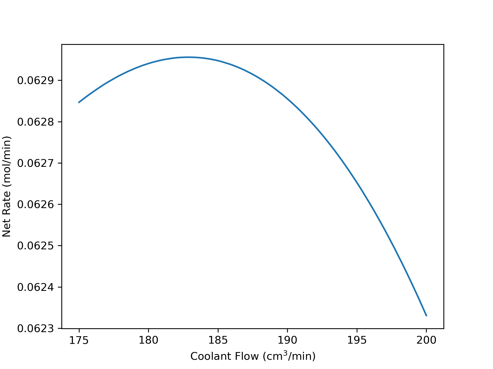{#fig-ch7_ex3_net_rate_plot width="80%"}

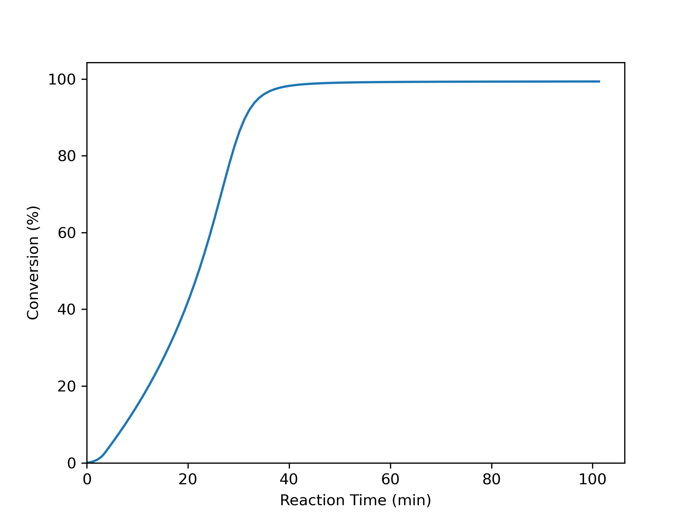{#fig-ch7_ex3_conversion_profile width="80%"}

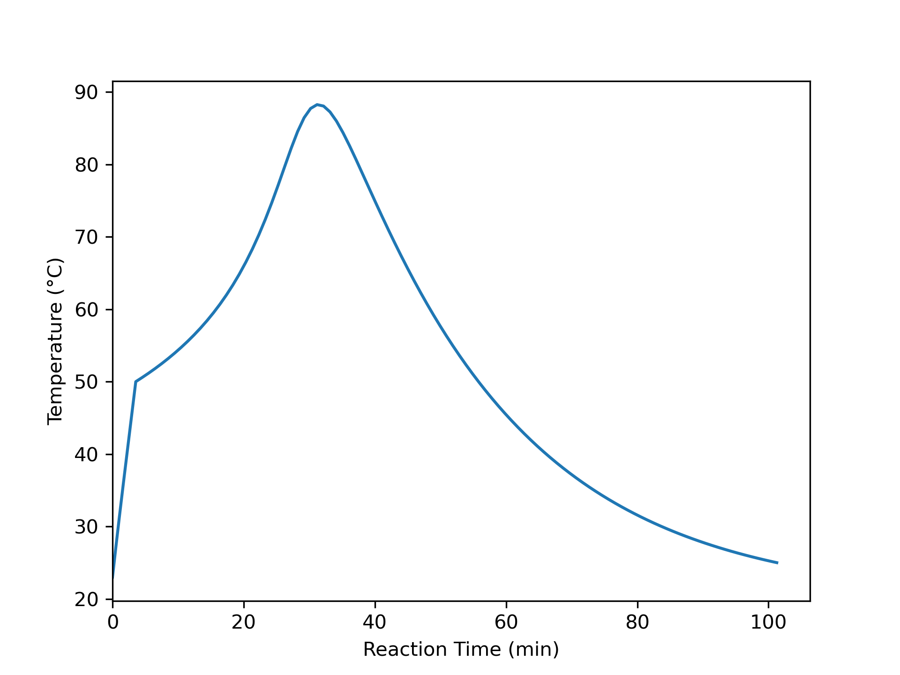{#fig-ch7_ex3_temperature_profile width="80%"}

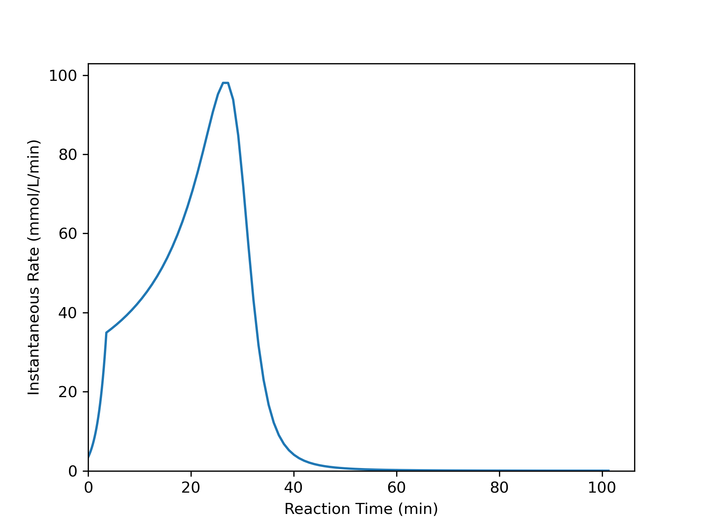{#fig-ch7_ex3_rate_profile width="80%"}

Four interesting features of Figures [-@fig-ch7_ex3_conversion_profile] through [-@fig-ch7_ex3_rate_profile] can be rationalized quatitatively. First, @fig-ch7_ex3_temperature_profile shows a kink at approximately 2.5 min. The temperature at that point is 50 °C, and that is the point where the heating stage ends and the cooling stage begins. Just prior to the kink, the temperature was rising rapidly and nearly linearly. That indicates that the temperature rise was primarily due to the heat from the coil. After the kink, the temperature continues to rise, but not as rapidly, because the rate has become large enough that heat is being released by reaction faster than it is being removed by the coolant. The kink in @fig-ch7_ex3_rate_profile occurs for the same reason.

The second interesting observation is that the instantaneous rate (@fig-ch7_ex3_rate_profile) reaches a maximum before the temperature (@fig-ch7_ex3_temperature_profile) does. The reason for the maximum in the instantaneous rate is similar to [Example -@sec-ch7_ex1]. Before the maximum rate is attained, two opposing factors are affecting the change in the reaction rate. The reactant concentrations are decreasing, which tends to decrease the rate, while the temperature is increasing, which tends to increase the rate. Before the maximum is reached, the temperature effect is greater than the concentration effect. When the two effects become equal, the maximum rate occurs. 

In [Example -@sec-ch7_ex1] the temperature rose continually because the reactor was adiabatic, but here @fig-ch7_ex3_temperature_profile shows that the temperature does eventually reach a maximum and then decrease. This is due to heat removal by the cooling jacket. The third interesting feature of the graphs is that the temperature continues to rise for a short period of time after the rate has reached its maximum value. Even though the rate has begun to decrease due to depletion of the reactants, the reaction is still releasing heat faster than the cooling fluid can remove it. When the temperature maximum is reached, the release of heat by reaction has become equal to the removal of heat by the coolant. After the maximum, the coolant removes heat faster than it is generated, so that after ca. 100 min the temperature reaches 25 °C and processing ends.

The conversion at this point is over 99%, but the fourth interesting feature is that the conversion is well over 90% after approximately 30 min. Put differently approximately 90% conversion occurs in the first 30 minutes, but it only increases 9% in the final 70 minutes. This suggests that it might be possible to optimize the system further.

In this assignment, the net rate was maximized with respect to the coolant flow rate. The net rate will also be affected by the duration of the heating stage, or equivalently the temperature at which the coil is removed from the reacting fluid and the coolant flow starts. If the temperatures of the cooling water or the steam could be varied, they, too, would be expected to affect the net rate. In a more realistic optimization, it would not be the net rate that would be optimized. Instead, the rate of financial profit would be maximized. The rate of financial profit would depend on the net rate of the reaction, but it would also depend on the selling price of the product, the costs of the reactant, steam, and cooling water, and a number of other factors. That type of multidimensional optimization is beyond the scope of this book, but at its core, it is similar to the simple optimization illustrated in this assignment.

**Deliverables**

The net rate of production of Z is maximized at a coolant flow rate of 183 cm^3^ min^–1^. The conversion and reacting fluid temperature profiles at that coolant flow rate are shown in @fig-ch7_ex3_conversion_profile and @fig-ch7_ex3_temperature_profile. The net rate of production of Z at these conditions is 0.063 g min^–1^.

---

### Maximum Intermediate Yield in Series Reactions {#sec-ch7_ex4}

A BSTR will be charged with 1 atm of A and 2 atm of B at 25 °C. The reactor volume is 2 L, and it has a jacket with an area of 600 cm^2^ and an overall heat transfer coefficient of 0.6 cal cm^-2^ min^-1^ K^-1^. The temperature of the coolant in the perfectly-mixed jacket is maintained at 30°C by a temperature controller. Gas phase reactions (1) and (2) take place within the reactor; the corresponding rate expressions are given in equations (3) and (4). The rate coefficients display Arrhenius temperature dependence with pre-exponental factors of 3.34 x 10^9^ and 1.47 x 10^10^ mol cm^-3^ min^-1^ atm^-2^ for reactions (1) and (2), respectively, and activation energies of 20.5 and 21.8 kcal mol^-1^. The heat of reaction (1) is constant and equal to -6,300 cal mol^-1^; that of reaction (2) is constant and equal to -6,900 cal mol^-1^. The heat capacities of A, B, D, Z and U are constant and equal to 7.4, 8.6, 10.7, 5.2 and 10.3 cal mol^-1^ K^-1^, respectively.

What reaction time will maximize the yield (moles of D per initial mole of A), and what will the yield and the conversion of A equal at that reaction time?

$$
A + B \rightarrow D + Z \tag{1}
$$

$$
D + B \rightarrow U + Z \tag{2}
$$

$$
r_1 = k_{0,1} \exp{\left(\frac{-E_1}{RT}\right)}P_AP_B \tag{3}
$$

$$
r_2 = k_{0,2} \exp{\left(\frac{-E_2}{RT}\right)}P_DP_B \tag{4}
$$

---

:::{.callout-tip collapse="true"}
## Click Here to See What an Expert Might be Thinking at this Point

This assignment describes a non-isothermal, gas-phase BSTR. At least one extensive variable, the volume, is specified, so a basis cannot be chosen. It asks me to find a reaction time to maximize yield and the conversion of A at that time. I'll also want to calculate the maximum yield itself. Solving the BSTR design equations gives reactor outputs as a function of reaction time, so I won't need to use time as a parameter. I'll begin by summarizing the assignment using a subscripted "0" to denote initial values and a subscripted "f" to denote final values. I'll let $t_{opt}$ denote the reaction time that maximizes the yield. The exchange fluid temperature is constant and known, but no information is provided about the inlet temperature or flow rate of the heat exchange fluid, so for it, there's no need for subscripts denoting "in" and "out."

:::

**Assignment Summary**

[Reactions]{.underline}:

$$
A + B \rightarrow D + Z \tag{1}
$$

$$
D + B \rightarrow U + Z \tag{2}
$$

[Rate Expressions]{.underline}:

$$
r_1 = k_{0,1} \exp{\left(\frac{-E_1}{RT}\right)}P_AP_B \tag{3}
$$

$$
r_2 = k_{0,2} \exp{\left(\frac{-E_2}{RT}\right)}P_DP_B \tag{4}
$$

[Reactor]{.underline}: gas-phase, non-isothermal BSTR

[Given Constants]{.underline}: $P_{A,0}$ = 1 atm, $P_{B,0}$ = 2 atm, $T_0$ = 25 °C, $V$ = 2 L, $A$ = 600 cm^2^, $U$ = 0.6 cal cm^-2^ min^-1^ K^-1^, $T_{ex}$ = 30 °C, $k_{0,1}$ =  3.34 x 10^9^ mol cm^-3^ min^-1^ atm^-2^, $k_{0,2}$ = 1.47 x 10^10^ mol cm^-3^ min^-1^ atm^-2^, $E_1$ = 20.5 kcal mol^-1^, $E_2$ = 21.8 kcal mol^-1^, $\Delta H_1$ = -6,300 cal mol^-1^, $\Delta H_2$ = -6,900 cal mol^-1^, $\hat C_{p,A}$ = 7.4 cal mol^-1^ K^-1^, $\hat C_{p,B}$ = 8.6 cal mol^-1^ K^-1^, $\hat C_{p,D}$ = 10.7 cal mol^-1^ K^-1^, $\hat C_{p,Z}$ = 5.2 cal mol^-1^ K^-1^, and $\hat C_{p,U}$ = 10.3 cal mol^-1^ K^-1^.

[Deliverables]{.underline}: $t_{opt} = \underset{t}{\arg\max} \left(Y_{D/A}\right)$, $\underline{Y}_{D/A}\Big\vert_{t_{opt}}$, and $\underline{f}_A\Big\vert_{t_{opt}}$.

**Formulation of the Equations**

:::{.callout-tip collapse="true"}
## Click Here to See What an Expert Might be Thinking at this Point

Mole balances are always included in the reactor design equations. The general BSTR mole balance is given in @eq-bstr_mole_balance. I will use this equation to write mole balances for every reagent in the system. That is, I'll write the mole balance for $i$ = A, B, D, Z, and U. There are two reactions taking place, so the sum will expand to two terms in each mole balance.

$$
\frac{dn_i}{dt} = V \sum_j \nu_{i,j}r_j = \left( \nu_{i,1}r_1 + \nu_{i,2}r_2 \right)V
$$

This reactor is not isothermal, so I will need to include a BSTR reacting fluid energy balance among the reactor design equations. The BSTR energy balance is given in @eq-bstr_energy_balance. This reactor has rigid walls and no moving boundaries, so it's volume is constant. If the volume is constant, the time-derivative of the volume is equal to zero. Being a gas phase system with a constant volume, the pressure is expected to change because the temperature will change. Therefore I *cannot* set the time-derivative of the pressure equal to zero. With no moving boundaries, the only work is that of the agitator, which is assumed to be negligible.  The summation over $i$ includes every reagent, and as above, the summation over $j$ expands to two terms.

$$
\left(\sum_i n_i \hat C_{p,i} \right) \frac{dT}{dt} - V\frac{dP}{dt}  - P  \cancelto{0}{\frac{dV}{dt}}  = \dot Q - \cancelto{0}{\dot W} - V \cancelto{\left( r_1 \Delta H_1 + r_2 \Delta H_2\right)}{\sum_j \left(r_j \Delta H_j \right)}
$$

$$
\left( n_A \hat C_{p,A} + n_B \hat C_{p,B} + n_D \hat C_{p,D} + n_Z \hat C_{p,Z} + n_U \hat C_{p,U}  \right) \frac{dT}{dt} - V\frac{dP}{dt}  = \dot Q - \left( r_1 \Delta H_1 + r_2 \Delta H_2\right)V
$$

An exchange fluid is present in this reactor, but the assignment states that its temperature is constant at 30 °C. Knowing the exchange fluid temperature, the other reactor design equations can be solved independently of an energy balance on the exchange fluid, and because the assignment does not ask anything about the exchange fluid, I do not need to include an energy balance on the exchange fluid among the reactor design equations.

:::

[Reactor Model Equations]{.underline}

$$
\frac{dn_A}{dt} = -r_1V \tag{5}
$$

$$
\frac{dn_B}{dt} = \left( -r_1 - r_2 \right)V \tag{6}
$$

$$
\frac{dn_D}{dt} = \left( r_1 - r_2 \right)V \tag{7}
$$

$$
\frac{dn_Z}{dt} = \left( r_1 + r_2 \right)V \tag{8}
$$

$$
\frac{dn_U}{dt} = r_2V \tag{9}
$$

$$
\begin{aligned}
- V\frac{dP}{dt} + &\left( n_A \hat C_{p,A} + n_B \hat C_{p,B} + n_D \hat C_{p,D} + n_Z \hat C_{p,Z} + n_U \hat C_{p,U}  \right) \frac{dT}{dt} \\&= \dot Q  - \left( r_1 \Delta H_1 + r_2 \Delta H_2\right)V
\end{aligned} \tag{10}
$$

:::{.callout-tip collapse="true"}
## Click Here to See What an Expert Might be Thinking at this Point

At this point I have 6 initial value ordinary differential equations that contain 7 dependent variables ($n_A$, $n_B$, $n_D$, $n_Z$, $n_U$, $P$, and $T$). I either need to eliminate a dependent variable or add an ODE before I can solve the reactor design equations.

Noting that V is constant, I'm going to take the time-derivative of the ideal gas law and use it as an additional ODE.

$$
PV - \left(n_A + n_B + n_D + n_Z + n_U \right)RT =0
$$

$$
\begin{aligned}
V\frac{dP}{dt} &- RT\left(\frac{dn_A}{dt} + \frac{dn_B}{dt} + \frac{dn_D}{dt} + \frac{dn_Z}{dt} + \frac{dn_U}{dt} \right) \\&- R\left(n_A + n_B + n_D + n_Z + n_U \right)\frac{dT}{dt} = 0
\end{aligned}
$$

:::

$$
\begin{aligned}
- &RT\left(\frac{dn_A}{dt} + \frac{n_B}{dt} + \frac{n_D}{dt} + \frac{n_Z}{dt} + \frac{n_U}{dt} \right) + V\frac{dP}{dt} \\&- R\left(n_A + n_B + n_D + n_Z + n_U \right)\frac{dT}{dt} = 0
\end{aligned}\tag{11}
$$

:::{.callout-tip collapse="true"}
## Click Here to See What an Expert Might be Thinking at this Point

The BSTR design equations are IVODEs, so they will be solved to find corresponding values of the independent ($t$) and dependent ($n_A$, $n_B$, $n_D$, $n_Z$, $n_U$, $T$, and $P$) variables, in this case over a span of time that is sufficiently large that the yield of D from A passes through a maximum.

When solving the design equations, all additional unknowns appearing in them must be calculated. Scanning through the design equations variable by variables reveals $r_1$, $r_2$, and $\dot{Q}$ as additional unknowns. The rates can be calculated using the given rate expressions, but that introduces the partial pressures of A, B, and D as additional unknowns. They can be calculated using the ideal gas law and the definition of partial pressure. The rate of heat transfer can be calculated using the given heat transfer area and heat transfer coefficient.

:::

[Reactor Model Variables]{.underline}: $\underline{t}$, $\underline{n}_A$, $\underline{n}_B$, $\underline{n}_D$, $\underline{n}_Z$, $\underline{n}_U$, $\underline{T}$, and $\underline{P}$

[Additional Computable Unknowns]{.underline}: $r_1$, $r_2$, $P_A$, $P_B$, $P_D$, and $\dot{Q}$

$$
P_i = \frac{n_iRT}{V} \qquad i = A, B, \text{ and } D \tag{12}
$$

$$
\dot Q = UA\left( T_{ex} - T \right) \tag{13}
$$

:::{.callout-tip collapse="true"}
## Click Here to See What an Expert Might be Thinking at this Point

The BSTR design equations are IVODEs. To solve them numerically (see [Appendix -@sec-apxd_ivodes]) initial values of each variable, a stopping criterion, and a derivatives function must be provided. I can define $t=0$ to be instant that the A and B are added to the reactor. The other initial values are then the molar amounts of each reagent, the temperature, and the pressure at that time. The assignment states that the BSTR is charged with only A and B, so the initial molar amounts of D, Z, and U are zero.

The initial molar amounts of A and B can be calculated directly using their known initial partial pressures and the ideal gas law. The initial total pressure is simply the sum of the initial partial pressures. 

I need to find the value of $t_f$ that maximizes the yield of D. To do that, I'll choose a large value for the final time, $t_f$. As long as the final value I choose is large enough, the yield will reach its maximum before the final time is reached. If the yield doesn't attain a maximum, I'll need to increase $t_f$ and repeat the calculations.

The derivatives function will receive the independent and dependent variables at the start of an integration step and must return the derivatives of the dependent variables with respect to the independent variable. The values of the derivatives cannot be calculated directly using the design equations above in their present form. I can either maniplulate them algebraically to put them in the form of derivative expressions, or I can re-write them as a matrix equation and use linear algebra. I prefer the latter because I feel I'm less likely to make a mistake writing the mass matrix than doing the algebra, so I'll use linear algebra.

:::

[IVODE Solver Inputs]{.underline}: 

1. Initial values of the reactor model variables shown in @tbl-ch7_ex4_initial_values
2. Stopping criterion that $t$ equals the final value shown in @tbl-ch7_ex4_initial_values
3. Derivatives function that
	a. receives the reactor model variables ($t$, $n_A$, $n_B$, $n_D$, $n_Z$, $n_U$, $T$, and $P$) at the start of an integration step and
	b. returns the corresponding values of the reactor model derivatives

$$
\boldsymbol{M} = \begin{bmatrix} 1 & 0 & 0 & 0 & 0 & 0 & 0 \\ 0 & 1 & 0 & 0 & 0 & 0 & 0 \\ 0 & 0 & 1 & 0 & 0 & 0 & 0 \\ 0 & 0 & 0 & 1 & 0 & 0 & 0 \\ 0 & 0 & 0 & 0 & 1 & 0 & 0 \\ 0 & 0 & 0 & 0 & 0 & \displaystyle\sum_i\left(n_i \hat{C}_{p,i} \right) & -V \\ RT & RT & RT & RT & RT & R\displaystyle\sum_i n_i & -V  \end{bmatrix} \tag{14}
$$

$$
\underline{g} = \begin{bmatrix} -r_1V \\ \left(-r_1 - r_2\right)V \\ \left(r_1 - r_2\right)V \\ \left(r_1 + r_2\right)V \\ r_2V \\ \dot{Q} -\left(r_1\Delta H_1 + r_2 \Delta H_2\right)V \\ 0 \end{bmatrix}\tag{15}
$$

$$
\begin{bmatrix} \frac{dn_A}{dt} \\ \frac{n_B}{dt} \\ \frac{n_D}{dt} \\ \frac{n_Z}{dt} \\ \frac{dn_U}{dt} \\ \frac{dT}{dt} \\ \frac{dP}{dt} \end{bmatrix} = \boldsymbol{M}^{-1} \underline{g}\tag{16}
$$

| Variable | Initial Value | Stopping Criterion |
|:-------|:-------:|:-------:|
| $t$ | $0$ | $t_f = 60 \text{ min}$ |
| $n_A$ | $n_{A,0} = \frac{P_{A,0}V}{RT_0}$ | |
| $n_B$ | $n_{B,0} = \frac{P_{B,0}V}{RT_0}$ | |
| $n_D$ | $0$ | |
| $n_Z$ | $0$ | |
| $n_U$ | $0$ | |
| $T$ | $T_0$ | |
| $P$ | $P_0 = P_{A,0} + P_{B,0}$ | |
  
: Initial values and stopping criterion for solving the design equations, (5) through (11). {#tbl-ch7_ex4_initial_values}

:::{.callout-tip collapse="true"}
## Click Here to See What an Expert Might be Thinking at this Point

Solving the BSTR model variables listed above. A set of corresponding values of the yield of D from A can be calculated using the definition of yield. The time at which the yield reaches a maximum then can be identified and used to evaluate the conversion.

:::

[Deliverables Equations]{.underline}:

$$
\underline{Y}_{D/A} = \frac{\underline{n}_D}{n_{A,0}} \tag{17}
$$

$$
t_{opt} = \underset{t}{\arg\max}\left( \underline{Y}_{D/A} \right)\tag{18}
$$

$$
Y_{D/A,max} = \underline{Y}_{D/A}\big\vert_{t_{opt}}\tag{19}
$$

$$
f_A = \frac{n_{A,0} - \underline{n}_A\big|_{t_{opt}}}{n_{A,0}}\tag{20}
$$

**Implementation of the Calculations**

Computer code to perform the calculations can be written using a variety of programming languages and environments, and the actual code can be structured in a variety of ways. Referring to the preceding assignment summary and formulation of the equations, here are the essential things it must do.

1. Make the given and known constants available wherever they are needed
2. Define the derivatives function
3. Define the initial values and stopping criterion
4. Call an IVODE solver
	a. pass the initial values, stopping criterion, and derivatives function as arguments
	b. receive the BSTR model variables
5. Calculate the yield at each reaction time, find the time where it attains its maximum value, and calculate the corresponding conversion

**Results and Discussion**

The calculations were performed as described above. @fig-ch7_ex4_yield_plot shows the variation of the yield as a function of the reaction time. The maximum yield, 0.69 mol D per mol A, occurs at a reaction time of 12.1 min. The conversion of A at that reaction time is 88.2%.

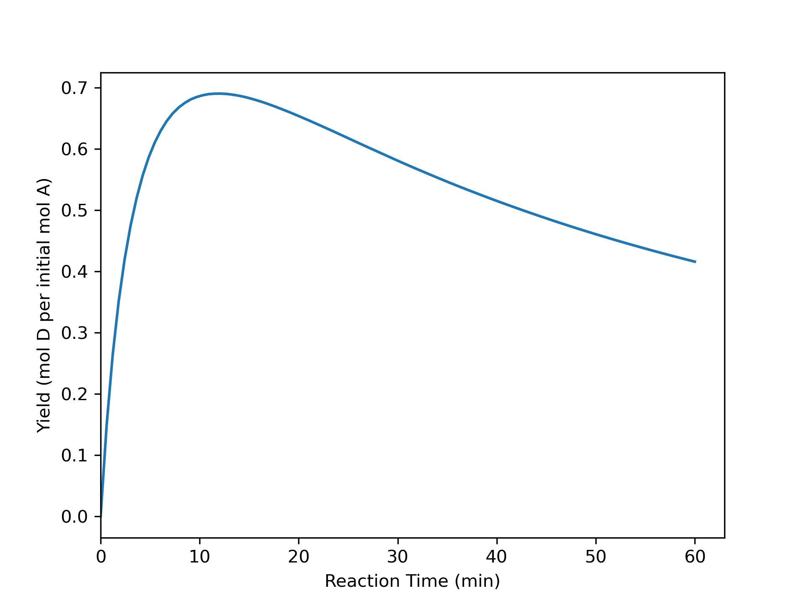{#fig-ch7_ex4_yield_plot width="80%"}

Reactions (1) and (2) constitute a series-parallel reaction network. The desired product, D, is an intermediate product. It is produced in reaction (1) and consumed in reaction (2). The yield of an intermediate product is expected to pass through a maximum as the reaction time increases as seen in @fig-ch7_ex4_yield_plot. This can be predicted qualitatively as long as the effect of temperature is comparable for the two reactions.

At the start of the reaction, the concentrations of A and B will be large and those of D, U, and Z will be zero. The rate of reaction (1) will be positive while that for reaction (2) will be zero. Consequently, during a very brief interval at the start of the reactive process, the concentrations of A and B will decrease and the concentrations of D and Z will increase.

During the next brief interval in time, the rate of reaction (1) will be smaller because the concentrations of A and B will be smaller, and the rate of reaction (2) no longer will equal zero because a small amount D will be present leading to a positive rate. The concentrations of A and B will again decrease and the concentration of Z will again increase. It can be expected that the rate of reaction (1) will be greater than the rate of reaction (2) because only a small concentration of D will be present, so the concentration of D, and its yield, will again increase, as can be seen in @fig-ch7_ex4_yield_plot.

For as long as the rate of reaction (2) remains smaller than the rate of reaction (1), the amount of D will be increasing, but its rate of increase will get smaller and smaller. The reason for this is that the concentrations of A and B will be decreasing, and hence the rate of generation of D by reaction (1) will be decreasing. At the same time, the rate of consumption of D by reaction (2) will be increasing as the concentration of D builds. This can be seen in @fig-ch7_ex4_yield_plot where the curvature of the yield plot is initially concave downward,

Eventually, the rate of reaction (2) will become equal to the rate of reaction (1). For that instant in time, the yield of D will not be changing. This corresponds to the maximum in @fig-ch7_ex4_yield_plot. At times beyond the maximum the rate of reaction (1) is less than the rate of reaction (2), so the concentration of D decreases. As the concentrations of both reactants, A and D, continue to decrease, both reactions (1) and (2) become slower and slower. This can be seen at larger reaction times in @fig-ch7_ex4_yield_plot where the curve is concave upward. Eventually, at very large reaction time, the rates will equal zero and all of the D will have been consumed.

In this example series-parallel reactions are occurring where the desired product is produced in one reaction and consumed by another. This assignment shows that the reaction time has a significant effect upon the amount of the desired product. Other process parameters such as the initial composition or temperature will also affect the results, but for series and series-parallel reactions their effect on the selectivity is often weaker. Temperature can be an effective parameter for adjusting the selectivity of multiple reactions if the activation energies of the reactions differ significantly. That was the case in [Example -@sec-ch7_ex2], and indeed, the discussion following that example showed that changing the temperature did have a significant effect. 

**Deliverables**

A reaction time of 12.1 min maximizes the yield of D from A at 0.69 mol D per mol A, with an 88.2% conversion of A.

:::{.callout-note collapse="false"}
## Notes

1. In the solution above, the mass matrix was used to write the IVODEs in the form of seven derivatives expressions. An equivalent approach is to generate the 7 derivative expressions by algebraic manipulation of equations (5) through (11).

2. Yet another approach is to solve equation (11) for $\frac{dP}{dt}$ and substitute the result into equation (10). This reduces the IVODEs to a set of six equations containing six dependent variables: $n_A$, $n_B$, $n_D$, $n_Z$, $n_U$, and $T$. Those six IVODEs can then be written as derivative expressions either by algebraic manipulation or using a mass matrix.

3. Finally, in this assignment the yield was optimized with respect to an IVODE variable (the reaction time). When that is the case the reactor design equations only need to be solved once, so long as the interval the variables span includes the optimum value of the variable being optimized. When a reactor response is optimized with respect to something other than an independent or dependent ODE variable, the design equations typically need to be solved multiple times. For example, if the yield in this assignment had been optimized with respect to the heat transfer area, the design equations would need to be solved for many different values of the heat transfer area in order to find one that maximizes the yield.

:::

### Steam Consumption During Endothermic Reactions {#sec-ch7_ex5}

Liquid phase reactions (1) and (2) take place in a batch stirred-tank reactor; the reaction rate expressions are given in equations (3) and (4). The rate coefficients for reactions (1) and (2) obey the Arrhenius expression. For reaction (1) the pre-exponential factor is 1.6 × 10^18^ gal lbmol^−1^ h^−1^, and the activation energy is 46,000 BTU lbmol^−1^. For reaction (2) the pre-exponential factor is 4.5 × 10^18^ gal lbmol^−1^ h^−1^, and the activation energy is 48,000 BTU lbmol^−1^. The heat capacity of the reacting liquid is constant and equal to 65 BTU ft^−3^ °R^−1^. The heat of reaction (1) is constant and equal to 45,000 BTU lbmol^−1^, and the heat of reaction (2) is constant and equal to 39,500 BTU lbmol^−1^. The 50 gal reactor initially contains only A and B at concentrations of 0.014 lbmol A gal^−1^ and 0.020 lbmol B gal^−1^. The initial temperature of the reacting fluid is 70 °F. The reactor is jacketed with an overall heat transfer coefficient of 60 BTU ft^−2^ °R^−1^ h^−1^ and a heat transfer area of 13 ft^2^. Saturated steam at 220 °F condenses in the jacket, leaving as a saturated liquid. (The heat of vaporization of steam at 220 °F is 966 BTU lb~m~^–1^.) Plot the yield of D (moles of D per initial mole of A), the temperature and the mass flow rate of water leaving the jacket as a function of the conversion of B.

$$
A + B \rightarrow D + Z \tag{1}
$$

$$
D + B \rightarrow U + Z \tag{2}
$$

$$
r_1 = k_1C_AC_B \tag{3}
$$

$$
r_2=k_2C_DC_B \tag{4}
$$

---

:::{.callout-tip collapse="true"}
## Click Here to See What an Expert Might be Thinking at this Point

This assignment involves a non-isothermal BSTR being used for liquid-phase, series-parallel reactions. The reacting fluid is being heated by the condensation of saturated steam. At least one extensive quantity (i. e. the reacting fluid volume) is known, so a basis cannot be chosen. The deliverables are graphs of output variables as functions of the conversion. For a BSTR, the design equations are IVODEs, and solving them yields corresponding sets of values of the time, molar amounts of the reagents, and temperatures. It won't be necessary to use the conversion as a parameter for this example. The design equations can simply be solved one time spanning a range of conversions from zero to 99%. I'll begin by summarizing the assignment using subscripted "0" to denote initial values and "f" to denote final values.

:::

**Assignment Summary**

[Reactions]{.underline}:

$$
A + B \rightarrow D + Z \tag{1}
$$

$$
D + B \rightarrow U + Z \tag{2}
$$

[Rate Expressions]{.underline}:

$$
r_1 = k_1C_AC_B \tag{3}
$$

$$
r_2=k_2C_DC_B \tag{4}
$$

[Reactor]{.underline}: non-isothermal, liquid-phase BSTR

[Given Constants]{.underline}: $k_{0,1}$ = 1.6 × 10^18^ gal lbmol^−1^ h^−1^, $E_1$ = 46,000 BTU lbmol^−1^, $k_{0,2}$ = 4.5 × 10^18^ gal lbmol^−1^ h^−1^, $E_2$ = 48,000 BTU lbmol^−1^, $\breve{C}_p$ = 65 BTU ft^−3^ °R^−1^, $\Delta H_1$ = 45,000 BTU lbmol^−1^, $\Delta H_2$ = 39,500 BTU lbmol^−1^, $V$ = 50 gal, $C_{A,0}$ = 0.014 lbmol gal^−1^, $C_{B,0}$ = 0.020 lbmol gal^−1^, $C_{D,0} = C_{Z,0} = C_{U,0}$ = 0, $T_0$ = 70 °F, $U$ = 60 BTU ft^−2^ °R^−1^ h^−1^, $A$ = 13 ft^2^, $T_{ex}$ = 220 °F, and $\Delta H_{vap}$ = 966 BTU lb~m~^–1^.

[Deliverables]{.underline}: $\underline{Y}_{D/A}$, $\underline{T}$, and $\underline{m}_{H_2O_{(l)}}$ *vs.* $\underline{f}_B$ as graphs

**Formulation of the Equations**

:::{.callout-tip collapse="true"}
## Click Here to See What an Expert Might be Thinking at this Point

I need to analyze the BSTR in this assignment, and I'll use the workflow described in [Chapter -@sec-ch5_workflow]. A reactor model always requires mole balances, and I prefer to write a mole balance for every reagent (not just the minimum number of mole balances). The general form of the mole balance is given in @eq-bstr_mole_balance. Here there are two reactions, so the summation expands to two terms.

$$
\frac{dn_i}{dt} = V \sum_j \nu_{i,j}r_j \quad \Rightarrow \quad \frac{dn_i}{dt} = \left(\nu_{i,1}r_1 + \nu_{i,2}r_2\right)V
$$

The reactor is non-isothermal, so an energy balance on the reacting fluid is also needed. The general form is given in @eq-bstr_energy_balance. The volumetric heat capacity of the reacting fluid is provided, so the sensible heat term can be written using it. Assuming that the work associated with agitation is negligible and noting there are no other shafts or moving boundaries, the work term is equal to zero. Assuming the liquid to be an incompressible ideal mixture, the pressure and volume will be constant so their derivatives equal zero. Finally, there are two reactions, so the final summation expands to two terms, and dividing by $V\breve{C}_p$ puts the energy balance in the form of a derivative expression.

$$
\cancelto{V\breve{C}_p}{\left(\sum_i n_i \hat C_{p,i} \right)} \frac{dT}{dt} - V\cancelto{0}{\frac{dP}{dt}}  - P  \cancelto{0}{\frac{dV}{dt}}  = \dot Q - \cancelto{0}{\dot W} - V \sum_j \left(r_j \Delta H_j \right)
$$

$$
V\breve{C}_p \frac{dT}{dt}  = \dot Q - \left(r_1 \Delta H_1 + r_2 \Delta H_2 \right) V
$$

$$
\frac{dT}{dt}  = \frac{\dot Q - V \left(r_1 \Delta H_1 + r_2 \Delta H_2 \right)}{V\breve{C}_p}
$$

The exchange fluid is saturated steam that provides its latent heat of condensation. The temperature of the steam is known and constant, so an energy balance on the exchange fluid does not need to be included in the design equations. However, it will be needed after the design equations have been solved for calculating the flow rate of the condensate.

:::

[Reactor Model Equations]{.underline}

$$
\frac{dn_A}{dt} = -r_1V \tag{5}
$$

$$
\frac{dn_B}{dt} = -\left(r_1 + r_2\right)V \tag{6}
$$

$$
\frac{dn_D}{dt} = \left(r_1 - r_2\right)V \tag{7}
$$

$$
\frac{dn_Z}{dt} = \left(r_1 + r_2\right)V \tag{8}
$$

$$
\frac{dn_U}{dt} = r_2V \tag{9}
$$

$$
\frac{dT}{dt}  = \frac{\dot Q - V \left(r_1 \Delta H_1 + r_2 \Delta H_2 \right)}{V\breve{C}_p} \tag{10}
$$

:::{.callout-tip collapse="true"}
## Click Here to See What an Expert Might be Thinking at this Point

BSTR design equations are IVODEs, so when they are solved, they yield corresponding sets of values of the independent and dependent variables. Here, $t$ is the independent variable, and $n_A$, $n_B$, $n_D$, $n_Z$, $n_U$ and $T$ are the dependent variables.

Before they can be solved, all additional unknowns appearing in them must be calculated. Here, examination of the design equations shows that $r_1$, $r_2$, and $\dot{Q}$ are additional unknowns. The two rates can be calculated using the given rate expressions, but that introduces $k_1$, $C_A$, $C_B$, $k_2$, and $C_D$ as additional unknowns. The rate coefficients can be calculated using the Arrhenius expression, and the concentrations, using the defining equation for concentration in a closed system. The rate of heat transfer can be calculated using the known heat transfer coefficient, heat transfer area, and exchange fluid temperature.

:::

[Reactor Model Variables]{.underline}: $\underline{t}$, $\underline{n}_A$, $\underline{n}_B$, $\underline{n}_D$, $\underline{n}_Z$, $\underline{n}_U$ and $\underline{T}$.

[Additional Computable Unknowns]{.underline}: $r_1$, $k_1$, $C_A$, $C_B$, $k_2$, $C_D$, and $\dot{Q}$.

$$
k_i = k_{0,i}\exp{\left(\frac{-E_i}{RT}\right)} \qquad i = 1 \text{ and } 2 \tag{11}
$$

$$
C_i = \frac{n_i}{V} \qquad i = A, B, \text{ and } D \tag{12}
$$

$$
\dot{Q} = UA\left(T_{ex} - T\right) \tag{13}
$$

:::{.callout-tip collapse="true"}
## Click Here to See What an Expert Might be Thinking at this Point

The design equations are IVODEs, so I need to provide initial values, a stopping criterion, and a derivatives function to solve them numerically. If I define $t = 0$ to be the instant the reagents are added to the reactor, the initial values are the molar amounts of the reagents and the temperature at that instant. Only A and B are present initially, and their molar amounts can be calculated from their known initial concentrations and the reacting fluid volume. The initial temperature is given.

I want to plot BSTR responses *versus* the conversion of B. It will equal 0% at the start, and I can choose to used 99% conversion as the stopping criterion. To do that I'll need to provide the corresponding final molar amount of B.

The derivatives function will receive values of the model variables at the start of an integration step and must return the corresponding values of the derivatives of the dependent variables with respect to the independent variable. This is easily accomplished by first calculating the additional unknowns, and the evaluating the derivative using the reactor model equations.

:::

[IVODE Solver Inputs]{.underline}: 

1. Initial values of the reactor model variables shown in @tbl-ch7_ex5_initial_values.
2. Stopping criterion that $n_B$ equals the final value shown in @tbl-ch7_ex5_initial_values.
3. Derivatives function that
	a. receives the BSTR model variables at the start of an integration step, and
	b. returns the corresponding BSTR model derivatives, equations (5) through (10).

| Variable | Initial Value | Final Value |
|:------:|:-------:|:-------:|
| $t$ | $0$ |  |
| $n_A$ | $n_{A,0} = C_{A,0}V$ |  |
| $n_B$ | $n_{B,0} = C_{B,0}V$ | $n_{B,f} = 0.01 n_{B,0}$ |
| $n_D$ | $0$ |  |
| $n_Z$ | $0$ |  |
| $n_U$ | $0$ |  |
| $T$ | $T_0$ |  |
  
: Initial and final values of the design equation variables. {#tbl-ch7_ex5_initial_values}

:::{.callout-tip collapse="true"}
## Click Here to See What an Expert Might be Thinking at this Point

Solving the BSTR design equations will yield corresponding sets of values of $t$, $n_A$, $n_B$, $n_D$, $n_Z$, $n_U$ and $T$. Using them, sets of values of the conversion of B, the yield of D from A, the and the instantaneous rate of heat transfer can be calculated using their defining equations. Then the energy balance on the exchange fluid can be used to calculate the instantaneous condensate flow rate.

:::

[Deliverables Equations]{.underline}:

$$
\underline{f}_B =\frac{n_{B,0} - \underline{n}_B}{n_{B,0}} \tag{14}
$$

$$
\underline{Y}_{D/A} = \frac{\underline{n}_D}{n_{A,0}} \tag{15}
$$

$$
\underline{\dot{Q}} = UA\left(T_{ex} - \underline{T}\right) \tag{16}
$$

$$
\underline{\dot{m}}_{H_2O_{(l)}} = \frac{\underline{\dot{Q}}}{\Delta H_{vap}} \tag{17}
$$

**Implementation of the Calculations**

Computer code to perform the calculations can be written using a variety of programming languages and environments, and the actual code can be structured in a variety of ways. Referring to the preceding assignment summary and formulation of the equations, here are the essential things it must do.

1. Make the given and known constants available wherever they are needed.
2. Define the derivatives function.
3. Define the initial values and stopping criterion.
4. Call an IVODE solver
	a. pass the initial values, stopping criterion and derivatives function as arguments
	b. receive the BSTR model variables
5. Calculate corresponding sets of values of the conversion, yield and condensate flow rate and generate the requested graphs.

**Results and Discussion**

The calculations were performed as described above. The reactions are endothermic, so without heating, the temperature would decrease as they proceed. Here the heating is supplied by the condensation of saturated steam at 220 °F. The initial temperature is 70 °F, and @fig-ch7_ex5_T_vs_t shows that the temperature rises to around 150 °F in the first half hour, and then rises more slowly after that. This is reasonable assuming that the rate is small at 70 °F. In that case, the reaction is not absorbing a significant amount of heat initially. The temperature profile suggests that the rate begins to become significant around 150 °F. From that point on, part of the heat provided by the steam is being consumed by reaction while the rest continues to heat the reacting fluid, so the rate of temperature increase gets smaller. @fig-ch7_ex5_conv_vs_t confirms that the rate begins to become appreciable at ca. 150 °F.

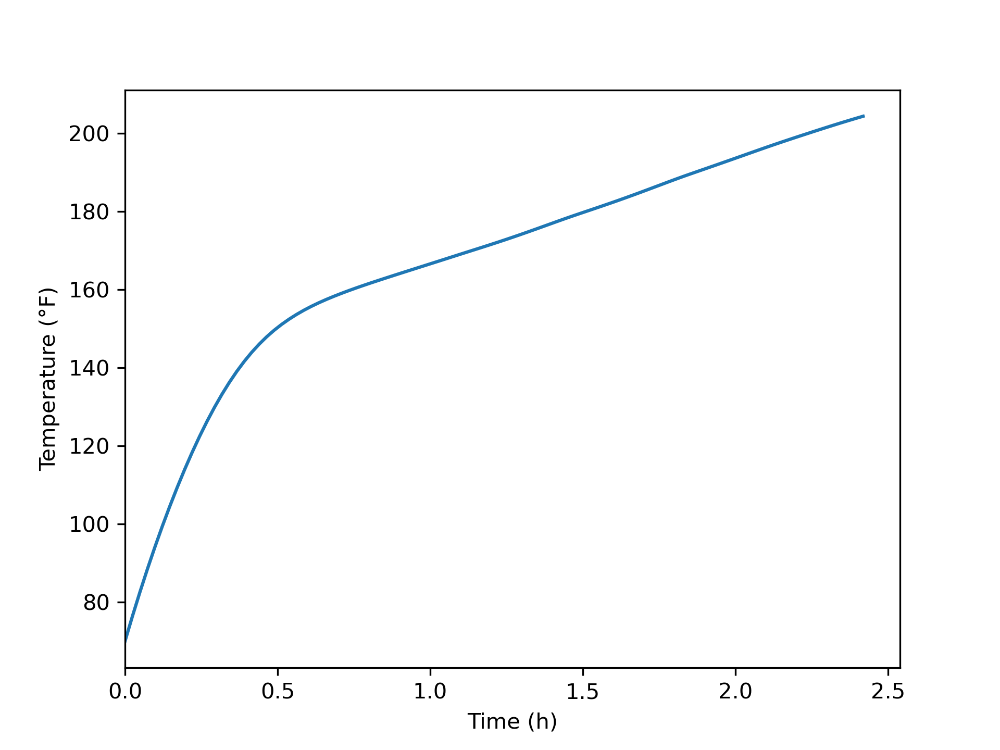{#fig-ch7_ex5_T_vs_t width="70%"}

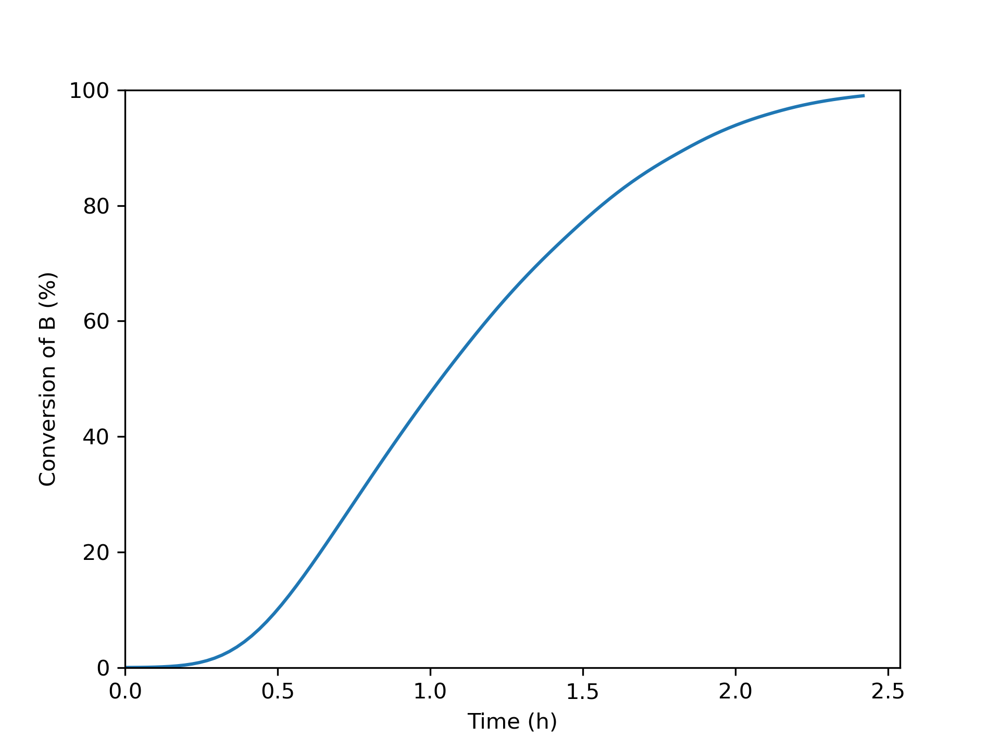{#fig-ch7_ex5_conv_vs_t width="70%"}

The assignment requested a plot of the temperature versus conversion, @fig-ch7_ex5_T_vs_conv, which can be generated from the results in Figures -@fig-ch7_ex5_T_vs_t and -@fig-ch7_ex5_conv_vs_t. The very steep initial rise represents the first half hour during which almost all of the heat provided by the steam was being used to heat the reacting fluid.

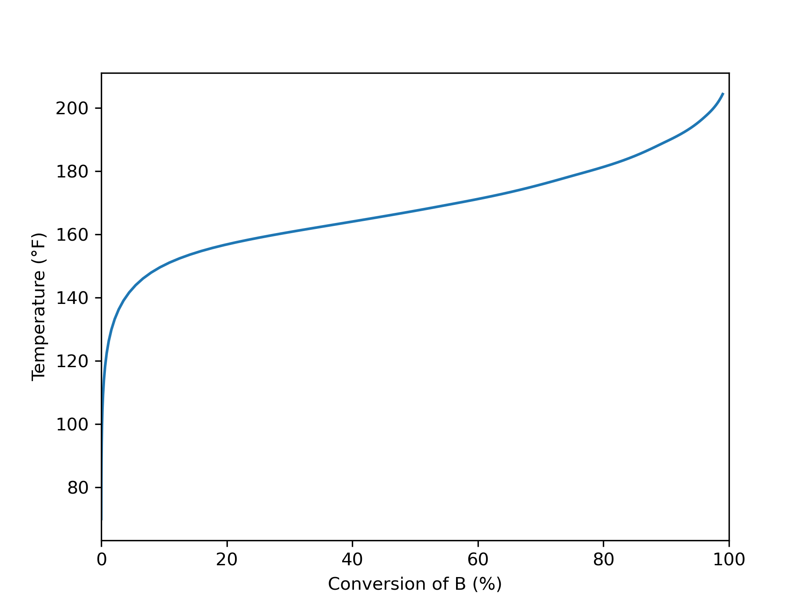{#fig-ch7_ex5_T_vs_conv width="70%"}

The steam consumption during the process is shown in @fig-ch7_ex5_H2O_vs_conv. Not surprisingly, it mirrors the temperature as a function of conversion. The driving force for heat transfer, and consequently for steam consumption, is the temperature difference between the reacting fluid and the steam. The steam temperature is constant, so changes in the steam consumption track with changes in the reacting fluid temperature. The figures are inverted because as the reacting fluid temperature increases, the temperature difference between it and the steam decreases.

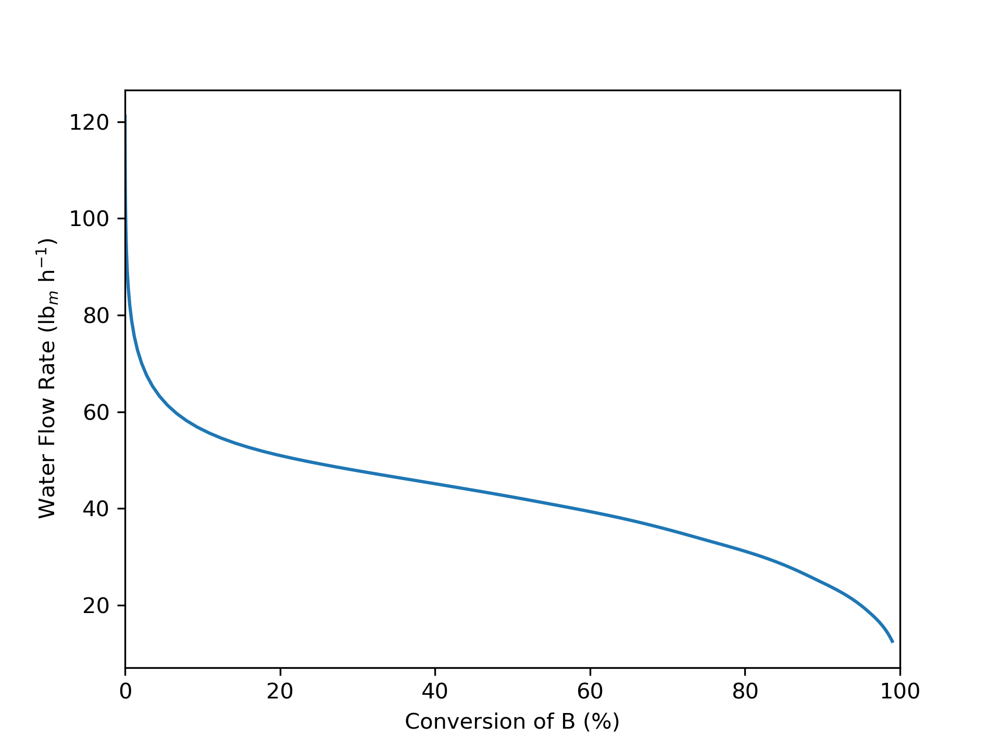{#fig-ch7_ex5_H2O_vs_conv width="70%"}

The yield is plotted as a function of the conversion in @fig-ch7_ex5_yield_vs_conv, which shows that it passes through a maximum. This is expected because the reactions are series-parallel reactions, and D is the intermediate product. That is, D is generated by the first reaction and consumed by the second. The reason for the maximum is the same as that provided in [Example -@sec-ch5_ex2] of Reaction Engineering Basics. Initially the rate of production of D is large, and due to its small concentration, its rate of consumption is small. As reaction proceeds, the rate of production of D declines due to consumption of the reactants while its consumption increases due to its larger concentration. The concentration of D reaches a maximum when the production and consumption rates become equal. After that, the consumption rate is greater than the production rate and consequently the amount of D decreases.

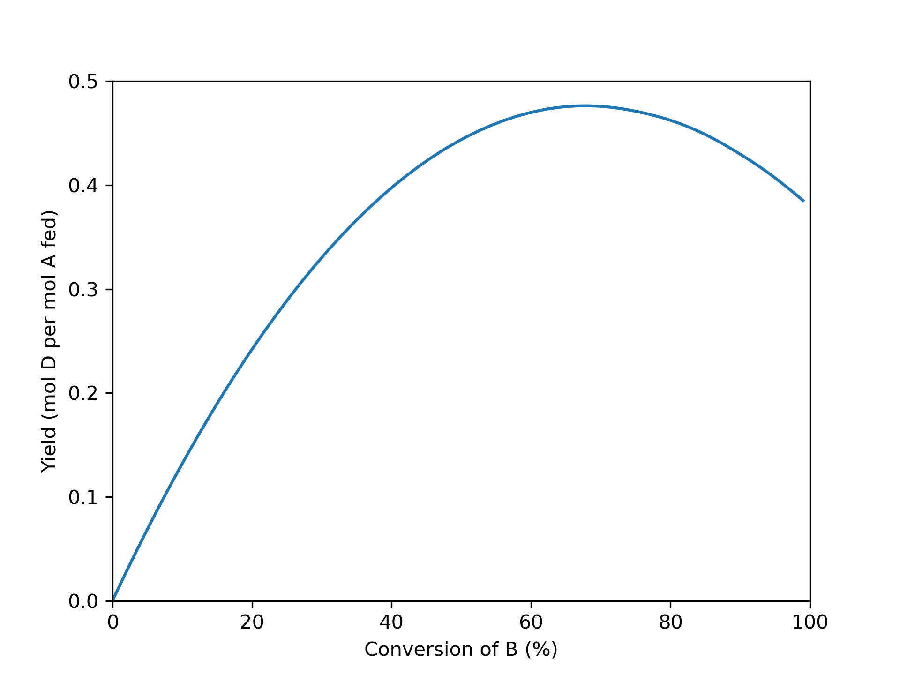{#fig-ch7_ex5_yield_vs_conv width="70%"}

**Deliverables**

The yield of D from A, temperature, and condensed water flow rates are plotted as functions of the conversion of B in Figures -@fig-ch7_ex5_yield_vs_conv, -@fig-ch7_ex5_T_vs_conv, and -@fig-ch7_ex5_H2O_vs_conv, respectively.

## Symbols Used in @sec-ch7

| Symbol | Meaning |
|:-------|:--------|
| $i$ | index denoting a reagent. |
| $\dot{m}_{ex}$ | mass flow rate of the heat exchange fluid. |
| $n_i$ | molar amount of reagent $i$, an additional subscripted 0 denotes the initial molar amount. |
| $r_{i,net}$ | net rate of generation of reagent $i$. |
| $r_j$ | rate of reaction $j$ per volume of reacting fluid. |
| $t$ | time. |
| $t_{op}$ | duration of the complete operational protocol (excluding turnaround time). |
| $t_{turn}$ | turnaround time. |
| $A$ | heat transfer area. |
| $C_i$ | concentration of reagent $i$. |
| $\hat{C}_{p,i}$ | molar, constant-pressure heat capacity of reagent $i$ |
| $\tilde{C}_{p,ex}$ | mass-specific, constant-pressure heat capacity of the heat exchange fluid. |
| $\breve{C}_p$ | volume-specific, constant-pressure heat capacity of the reacting fluid, additional subscripts denote fluids other than the reacting fluid. |
| $M_{ex}$ | molecular weight of the heat exchange fluid. |
| $P$ | pressure of the reacting fluid, a subscripted $i$ denotes the partial pressure of reagent $i$. |
| $\dot{Q}$ | rate of heat transfer *to* the reacting fluid, additional subscripts distinguish between different sources of the heat. |
| $R$ | ideal gas constant. |
| $T$ | temperature, no subscript denotes the reacting fluid, a subscripted $ex$ denotes the heat exchange fluid, an additional subscripted $0$ denotes an initial temperature, $in$ an inlet temperature and $f$ a final temperature. |
| $U$ | heat transfer coefficient. |
| $V$ | reacting fluid volume, a subscripted $ex$ denotes the heat exchange fluid. |
| $\dot{W}$ | rate at which the reacting fluid performs work on its surroundings. |
| $\gamma$ | fraction of the heat exchange fluid that undergoes phase change. |
| $\nu_{i,j}$ | stoichiometric coefficient of reagent $i$ in reaction $j$. |
| $\rho$ | density, no subscript denotes the reacting fluid, a subscripted $ex$ denotes the heat exchange fluid. |
| $\Delta H_j$ | heat of reaction $j$. |

: {tbl-colwidths="[20,80]"}
