# CSTR Analysis {#sec-ch6}

@sec-ch5 presented an overview of the analysis of ideal reactors. This chapter introduces ideal continuous stirred tank reactors and discusses their analysis. It may prove helpful to keep the Learning Objectives in [Section -@sec-ch6_learning_objectives] in mind while reading it.

## Ideal Continuous Stirred Tank Reactors (CSTRs)

A perfectly-mixed cylindrical tank with continuous flow of feed in and product out is one example of a CSTR. @fig-cstr_heat_exchange_schematics shows three CSTR configurations that differ in the geometry used for exchanging heat with a separate heat exchange fluid, indicated in yellow in the figure. When the reacting fluid, indicated in blue in the figure, is a liquid, it typically does not fill the entire volume of the tank. The unfilled volume, indicated in gray in the figure, is called the headspace. When the reacting fluid is a gas, it expands to fill the entire volume and there is no headspace.

::: {#fig-cstr_heat_exchange_schematics layout-ncol=3}

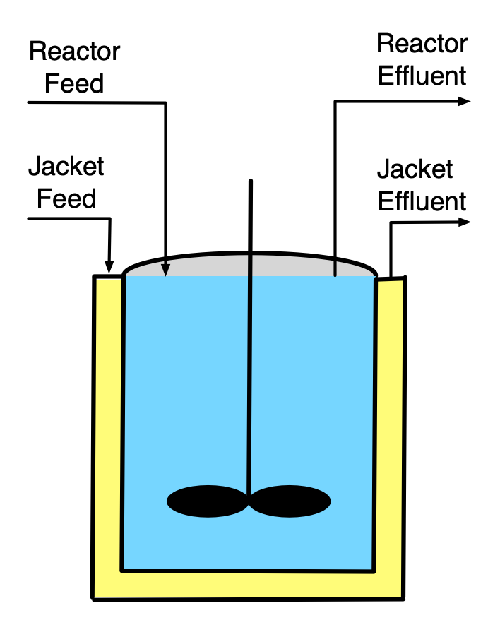{width="100%"}

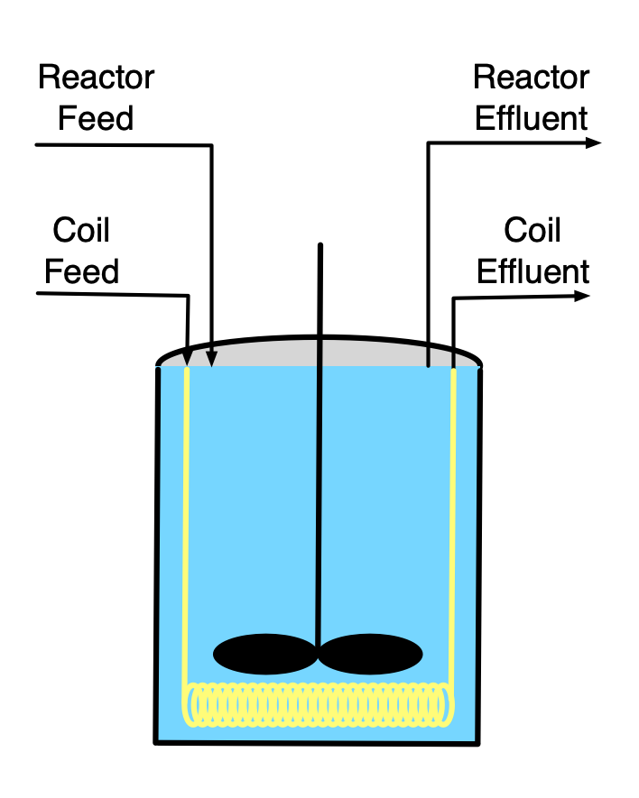{width="100%"}

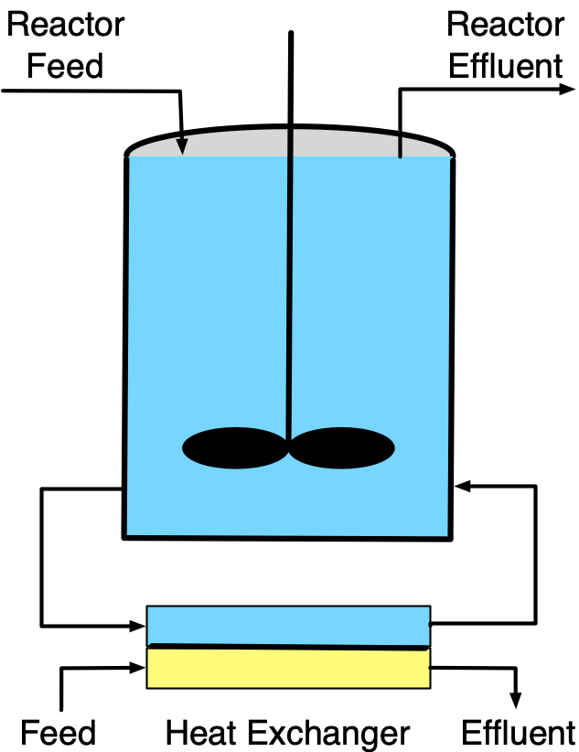{width="100%"}

Schematic representations of three continuous stirred tank reactors, wherein heat is exchanged with an external fluid through the walls of (a) a jacket, (b) a submerged coil, and (c) an external heat exchanger.
:::

The full set of assumptions used in the ideal CSTR model is provided in [Appendix -@sec-apx_CSTR_balances]. While stirred tanks are the most common type of CSTR in commercial facilities, other physical geometries are possible, as long as their contents are a perfectly mixed, single-phase fluid and they satisfy the other assumptions of the ideal CSTR model. Stirred tanks are well-suited to liquid phase reactions because a simple impeller can be used to do the mixing. Attaining perfect mixing of gases in large vessels can be more challenging.

The characteristic that differentiates a CSTR from other ideal stirred tank reactors is the continuous flow of fluid into *and* out of the reactor as the reaction is taking place. This eliminates the need to stop processing to remove products and add fresh feed, and allows them to operate for extended periods of time without interruption. It results in two possible modes of operation, steady-state and transient. At steady-state, nothing changes over time. The inlet flow rate, temperature, and composition; the outlet flow rate, temperature, and composition; and the heat exchange fluid flow rate, inlet temperature, and outlet temperature are all constant. CSTRs are designed to operate at steady-state. Once a steady state has been reached, the labor demands to operate the reactor are minimal. Integration with other operations in the process such as feed purification, product separation, etc. is easier to implement when the entire process operates at steady-state.

However, there are times when a CSTR must operate in a transient mode, such as when the process is being started up and when it is being shut down. This type of transient operation is typically planned, for example, the reactor might be shut down periodically so that routine maintenance can be performed. Unexpected events can also initiate transient operation of a CSTR. For example, a sudden change in the coolant flow rate or temperature or a change in the feed flow or temperature will initiate transient operation.

Compared to the other type of ideal continuous reactor, namely the plug-flow reactor, the most significant feature of a CSTR is the instantaneous mixing of the feed with all of the reacting fluid in the reactor. Because it is perfectly mixed, the outlet temperature and composition equal the temperature and composition of the reacting fluid. At steady-state, the composition and temperature do not change while the fluid is reacting. Consequently, for the entire time the reacting fluid is in the reactor the reaction takes place at the outlet composition and temperature.

Depending upon the reaction kinetics, this can be either an advantage or a disadvantage. Generally, use of a CSTR can be advantageous when the reaction is exothermic and/or auto-catalytic. For exothermic reactions the product temperature most often is greater than the feed temperature, causing the rate to be greater. For all reactions, the product concentration is greater at the outlet than in the feed, and for an auto-catalytic reaction, this too causes the rate to be larger. In constrast the mixing can be a disadvantage when the reaction is endothermic and/or when the reaction kinetics are typical (i.e. lower reactant concentrations result in lower rates).

CSTRs are well-suited to the production of high volumes of product because they operate continuously, apart from being shut down for periodic maintenance. Another advantage of CSTRs is that they can have a wide range of heat transfer area relative to the reacting fluid volume. This is possible because in addition to exchanging heat through the walls of the reactor, a coil through which heat exchange fluid flows can be submerged in the reacting fluid and/or reacting fluid can be rapidly recirculated through an external heat exchanger as illustrated in @fig-cstr_heat_exchange_schematics.

The requirement that the reacting fluid be perfectly mixed can be a disadvantage. If the reacting fluid has a high viscosity, mixing it thoroughly can be very difficult. Doing so can consume a great deal of power and thereby increase operating costs. Similarly if the reaction requires a solid catalyst, use of a CSTR is impractical or impossible because "stirring" a tank full of solid particles doesn't work well. 

## CSTR Operation

CSTRs are designed to operate at steady-state for extended periods of time. Before that can happen, the reactor must be started up. Start-up is a transient process. There are many, many different ways to start up a CSTR. Three goals of start-up are to bring the reactor to steady-state as quickly as possible, to minimize waste while doing so, and to do it all safely. One option is to fill the reactor with the feed and operate it as a batch reactor (no feed or effluent, see @sec-ch7) until the composition and temperature are close to their intended steady-state values, at which time the feed and product flow can be started.

Occasionally CSTRs must be shut down, too. This may be necessary to perform maintenance on the reactor itself, or it may be necessary because an upstream, downstream, or utility process (chilled water, etc.) needs to be shut down. Again, shut-down is a transient process, and the same guidelines as for start-up apply. It is particularly important to analyze startup and shut-down processes prior to implementing them, especially for exothermic processes. If the wrong procedure is used to start up or shut down a reactor, explosions and other undesired events can ensue.

During steady-state operation, automatic control systems can be used to maintain steady-state processing of the feed. Such control systems can make small adjustments to compensate for minor variations in the reactor inputs. Reactor models like those described in this chapter can be used when designing control systems for a CSTR.

## CSTR Design Equations {#sec-ch6_cstr_design_eqns}

The reactor design equations for CSTRs are derived in [Appendix -@sec-apx_CSTR_balances]. The general CSTR mole balance is shown in @eq-gen_cstr_mol_bal, and the CSTR reacting fluid energy balance is presented in @eq-gen_cstr_energy_bal. The energy balances for a heat exchange fluid that exchanges only sensible heat, @eq-exchange_energy_bal_sensible, and for one that only exchanges latent heat, @eq-exchange_energy_bal_latent, are also reproduced below.

$$
\frac{V}{\dot V}\frac{d \dot n_i}{dt} + \frac{\dot n_i}{\dot V}\frac{dV}{dt} - \frac{\dot n_iV}{\dot V^2}\frac{d \dot V}{dt} = \dot n_{i,in} - \dot n_i + V \sum_j \nu_{i,j}r_j
$${#eq-gen_cstr_mol_bal}

$$
\begin{split}
\frac{V}{\dot V}\sum_i \left( \dot n_i \hat C_{p,i}  \right) &\frac{dT}{dt} - V \frac{dP}{dt} - P\frac{dV}{dt} = \dot Q - \dot W \\&- \sum_i\dot n_{i,in} \int_{T_{in}}^T \hat C_{p,i}dT - V\sum_j r_j \Delta H_j
\end{split}
$${#eq-gen_cstr_energy_bal}

$$
\rho_{ex} V_{ex} \tilde C_{p,ex}\frac{dT_{ex}}{dt} = -\dot Q - \dot m_{ex} \int_{T_{ex,in}}^{T_{ex}} \tilde C_{p,ex}dT
$$

$$
\frac{\rho_{ex} V_{ex} \Delta H_{\text{latent},ex}^0}{M_{ex}} \frac{d \gamma}{dt} = - \dot Q - \gamma \dot m_{ex} \frac{\Delta H_{\text{latent},ex}^0}{M_{ex}}
$$

The transient CSTR design equations are initial value ordinary differential equations (IVODEs, see [Appendix -@sec-apxd_ivodes]). The independent variable is the elapsed time ($t$) and the dependent variables are the outlet molar flow rates of the reagents ($\dot{n}_i$), the volume of reacting fluid within the reactor ($V$), the outlet volumetric flow rate ($\dot{V}$), the reacting fluid temperature ($T$), thre reacting fluid pressure ($P$), and either the exchange fluid temperature ($T_{ex}$) or the fraction of the exchange fluid that changes phase ($\gamma$). The number of dependent variables is three greater than the number of IVODEs, so before the design equations can be solved, either three IVODEs must be added or three of the dependent variables must be eliminated. 

The pressure in a CSTR is almost always constant, in which case its time derivative, $\frac{dP}{dt}$, is zero, eliminating pressure as one of the dependent variables.

Gases will always expand to fill the entire volume of a rigid-walled reactor, so for gases $\frac{dV}{dt} = 0$. This is also true for liquids if the reactor is full (assuming the liquid is an incompressible, ideal mixture). However, if the reactor is not full, the change in the volume of liquid within it is equal to the difference between the inlet and outlet volumetric flow rates as given in @eq-liquid_volume_accumulation, which must be added to the design equations.

$$
\frac{dV}{dt} = \dot{V}_{in} - \dot{V}
$${#eq-liquid_volume_accumulation}

Typically, the outlet volumetric flow rate of a liquid phase reacting fluid is zero while the reactor is filling, and it equals the inlet volumetric flow rate when the reactor is full. As a consequence, $\frac{d\dot{V}}{dt}$ is equal to zero at all times unless the inlet volumetric flow rate is being deliberately manipulated. In contrast, the outlet volumetric flow rate of an ideal gas must obey the ideal gas law, which can be expressed in differential form as shown in @eq-differential_ideal_gas_law, which then must be added to the design equations. As already noted, $\frac{dP}{dt}$ in that equation is almost always equal to zero.

$$
\dot{V} \frac{dP}{dt} + P \frac{d\dot{V}}{dt} = R\left(\sum_i{\dot{n}_i} \frac{dT}{dt} + T \sum_i{\frac{d\dot{n}_i}{dt}}\right)
$${#eq-differential_ideal_gas_law}

A few other simplifications or modifications of the design equations may be possible or necessary. When the only moving shaft or boundary is that of an agitator, the associated power of agitation is negligible, $\dot{W} = 0$, unless the reacting fluid is highly viscous. In addition, the units of the $P\frac{dV}{dt}$ term in the energy balance (pressure × volume ÷ time) will need to be converted to the same units as the other terms (energy ÷ time).

If the reactor operates adiabatically, the rate of heat transfer is zero, $\dot{Q} = 0$. Otherwise, assuming both the reacting fluid and the heat exchange fluid to be perfectly mixed, the rate of heat transfer to the reacting fluid can be expressed as shown in @eq-heat_transfer_rate, where $U$ is the overall heat transfer coefficient and $A$ is the area through which heat is transferred.

$$
\dot{Q} = UA(T_{ex} - T)
$${#eq-heat_transfer_rate}

Finally, in the reacting fluid energy balance, @eq-gen_cstr_energy_bal, the sensible heat is expressed in terms of molar heat capacities. When the reacting fluid is a liquid, the gravimetric or volumetric heat capacity of the whole solution may be known instead of the molar heat capacities of the individual reagents. When this is the case, the sensible heat terms can be modified as indicated below.

$$
\frac{V}{\dot V}\sum_i \left( \dot n_i \hat C_{p,i} \right) \frac{dT}{dt}\ \Leftrightarrow\ \rho V \tilde C_p \frac{dT}{dt}\ \Leftrightarrow\ V \breve C_p \frac{dT}{dt}
$$

$$
\sum_i \dot n_{i,in} \int_{T_{in}}^T \hat C_{p,i}dT\ \Leftrightarrow\ \rho \dot V_{in} \int_{T_{in}}^T \tilde C_pdT\ \Leftrightarrow\ \dot V_{in} \int_{T_{in}}^T \breve C_pdT
$$

Being IVODEs, the transient CSTR design equations are solved to find corresponding sets of values of the independent and dependent variables over a span of time defined in terms of the initial values of those variables and a "stopping criterion" (see [Appendix -@sec-apxd_ivodes]). A very common stopping criterion is simply that one of the dependent variables or the independent variable attains a known final value. In some instances, two final values are known, allowing the design equations to be solved for one additional variable that does not vary with time (again, see [Appendix -@sec-apxd_ivodes]).

Thus, the numerical solution of IVODEs requires initial values for each of the dependent variables. This can lead to confusion when first learning to model transient CSTRs because both initial and inlet molar flow rates and temperatures appear in the design equations. The key point to remember is that the dependent variables in the IVODEs are the *[outlet]{.underline}* molar flow rates, volumetric flow rate, temperature and exchange fluid temperature. As a consequence, the initial values that are needed to solve the IVODEs are the [initial]{.underline} values of the [outlet]{.underline} molar flows, volumetric flow, and temperatures, not their inlet values.

### Transient *vs.* Steady-State Operation

Transient operation occurs when a reactor variable or parameter changes. Therefore whenever an analysis involves a reactor where a reactor input or operating parameter has changed, the transient design equations must be used. The change may be intentional, as during startup or shut down, or unintended.

When inputs and operating parameters stop changing, most CSTRs eventually reach a steady-state where nothing changes over time. At that point the time derivatives in the design equations all equal zero, resulting in the steady-state mole balance shown in equation @eq-ss_cstr_mole_bal and the steady-state energy balance shown in @eq-ss_cstr_energy_bal. For completeness, the steady state versions of the energy balances for a heat exchange fluid that exchanges only sensible heat, @eq-exchange_energy_bal_sensible_ss, and for one that only exchanges latent heat, @eq-exchange_energy_bal_latent_ss, are also reproduced here.

$$
0 = \dot n_{i,in} - \dot n_i + V \sum_j \nu_{i,j}r_j
$$ {#eq-ss_cstr_mole_bal}

$$
0 = \dot Q - \dot W - \sum_i\dot n_{i,in} \int_{T_{in}}^T \hat C_{p,i}dT - V\sum_j r_j \Delta H_j
$$ {#eq-ss_cstr_energy_bal}

$$
0 = -\dot Q - \dot m_{ex} \int_{T_{ex,in}}^{T_{ex}} \tilde C_{p,ex}dT
$$

$$
0 = - \dot Q - \gamma \dot m_{ex} \frac{\Delta H_{\text{latent},ex}^0}{M_{ex}}
$$

The steady-state CSTR design equations are algebraic-transcendental equations (ATEs, see [Appendix -@sec-apxd_ates]). If there are $N$ design equations, they can be solved to find the values of $N$ variables that appear in them. Very often the steady-state CSTR design equations are solved to find the outlet molar flow rates, the outlet reacting fluid temperature, and the outlet exchange fluid temperature, but if one or more of those quantities are known, the design equations can be solved for other variables they contain. 

When rate expressions are substituted into either the transient or steady-state CSTR design equations, they will introduce concentrations or, for gases, partial pressures. Noting that the CSTR is perfectly mixed so that the outlet composition and temperature are the same as that of the reacting fluid, the concentrations or partial pressures in the rate expressions should be expressed in terms of the outlet molar flow rates, volumetric flow rate, and temperature.

$$
C_i = \frac{\dot{n}_i}{\dot{V}}
$$

$$
C_i = \frac{\dot{n}_i}{\sum_i \left(\dot{n}_i\right)}\frac{P}{RT} \qquad i = \text{ ideal gas}
$$

$$
P_i = \frac{\dot{n}_i}{\sum_i \left(\dot{n}_i\right)}P \qquad i = \text{ ideal gas}
$$

## Steady-State Multiplicity and Stability

Upon substitution of rate expressions, the steady-state CSTR design equations become non-linear because the rate expression contains an exponential temperature term and may also contain concentrations or partial pressures raised to powers other than one. Non-linear equations can have more than one solution. For example, a quadratic equation has two solutions. Not only are multiple solutions possible, but the steady-state CSTR design equations can have more than one physically meaningful solution. This phenomenon is known as steady-state multiplicity.

### Steady-State Multiplicity {#sec-ch6_multiplicity}

To illustrate, the black line in @fig-ch6_multiplicity shows the outlet temperature of a CSTR as a function of its inlet temperature, with all other inputs and parameters held constant. A plot of the steady-state outlet temperature as a function of the steady-state inlet temperature can be referred to as a multiplicity plot. It can be seen that between the two vertical red lines, the temperature curve doubles back above itself twice leading to an "S" shape. The two red lines in the figure represent inlet temperatures where two steady states are possible. At any inlet temperature between the two red lines, three steady states are possible.  For example, the vertical blue line shows an inlet temperature where there are three possible steady states denoted as $S_{high}$, $U_{mid}$, and $S_{low}$. Only one steady state is possible at inlet temperatures less than the left red line or greater than the right red line.

{#fig-ch6_multiplicity}

It is worth noting that for each [outlet]{.underline} temperature there is only one [inlet]{.underline} temperature. That is, if a horizontal line is drawn at any outlet temperature, it will cross the curve only one time. It is also important to know that some CSTRs do not exhibit steady-state multiplicity. A plot of outlet temperature *versus* inlet for those CSTRs is not S-shaped.

A reaction engineer needs to be aware of the possibility of steady-state multiplicity and know how to check for it. If an outlet variable is specified or known, there will only be one steady state that corresponds to it. Otherwise, generating a plot of the outlet temperature as a function of the inlet temperature like @fig-ch6_multiplicity is the best way to check for steady-state multiplicity. A less reliable approach is to solve the ATE design equations numerically using a wide range of initial guesses, especially for the outlet temperature. However, even if all of the initial guesses yield the same solution, that doesn't guarantee that there aren't other steady states.

Returning to @fig-ch6_multiplicity, one might wonder, if the inlet temperature to the reactor is set to the inlet temperature indicated by the blue line, which of the three steady-state outlet temperatures shown in the figure will actually be observed? The answer to this question is that the transient procedure used to start up the reactor will determine which of the steady states is actually observed. Having said that, however, it is unlikely that the steady state labeled $U_{mid}$ will reached, for reasons discussed next.

### Steady-State Stability {#sec-ch6_stability}

The red lines in @fig-ch6_multiplicity divide the black curve into three branches. A low temperature branch shown as a solid line, an intermediate temperature branch shown as a dashed line, and a high temperature branch shown again as a solid line. The significance of the dashed line is that the steady states with the intermediate outlet temperature are unstable while the solid branches represent stable steady states. Thus the steady states denoted as $S_{high}$ and $S_{low}$ are stable steady states while the one labeled $U_{mid}$ is unstable.

If a CSTR was somehow operating at an unstable steady state such as $U_{mid}$, a slight perturbation of any reactor property would initiate a period of transient operation. Depending on the specifics of the perturbation, that transient would lead either to the high temperature steady-state, $S_{high}$, or to the low temperature steady state, $S_{low}$. That is, if a CSTR somehow operates at an unstable steady state, it will not return to that unstable steady state following even a small perturbation away from it.

The instability following a small perturbation from a steady state can be demonstrated by performing a rigorous transient analysis, and there are other mathematical techniques that can be used to identify steady states that are unstable. Nonetheless, a non-rigorous analysis may provide more insight and a better physical understanding of why the middle-temperature steady state is unstable. It involves a roundabout way of solving the steady-state CSTR design equations.

Consider an adiabatic, steady-state CSTR where the work term is negligible, as is usually the case. That leaves two terms in the reacting fluid energy balance, as shown in @eq-ss_cstr_energy_bal_no_work. One term, denoted as $\dot{Q}_{abs}$ in @eq-heat_abs_term, represents sensible heat absorbed by the feed as it enters the reactor. The other, denoted as $\dot{Q}_{gen}$ in @eq-heat_gen_term, represents the heat generated by the reaction. Clearly, the reacting fluid energy balance, @eq-ss_cstr_energy_bal_no_work, is only satisfied if the two terms are equal, @eq-heat_terms_equal.

$$
0 = \cancelto{0}{\dot Q} - \cancelto{0}{\dot W} - \sum_i\dot n_{i,in} \int_{T_{in}}^T \hat C_{p,i}dT - V\sum_j r_j \Delta H_j
$$ {#eq-ss_cstr_energy_bal_no_work}

$$
\dot{Q}_{abs} = \sum_i\dot n_{i,in} \int_{T_{in}}^T \hat C_{p,i}dT
$$ {#eq-heat_abs_term}

$$
\dot{Q}_{gen} = - V\sum_j r_j \Delta H_j
$$ {#eq-heat_gen_term}

$$
\dot{Q}_{abs} = \dot{Q}_{gen}
$${#eq-heat_terms_equal}

Suppose that the inlet molar flow rates and temperature are known. The solution of the design equation can begin by choosing a range of values for the reactor outlet temperature. For each value in that range, the mole balance design equations can be solved to find the outlet molar flow rates of the reagents. The heat terms, $\dot{Q}_{abs}$ and $\dot{Q}_{gen}$ then can be calculated using @eq-heat_abs_term and @eq-heat_gen_term. After doing so for each outlet temperature in the chosen range, $\dot{Q}_{abs}$ and $\dot{Q}_{gen}$ can each be plotted *vs*. outlet temperature on a single graph as shown in @fig-ch6_stability. According to @eq-heat_terms_equal the reacting fluid energy balance is satisfied when the two curves cross. @fig-ch6_stability shows that the curves cross three times corresponding to the three steady states, $S_{high}$, $U_{mid}$, and $S_{low}$.

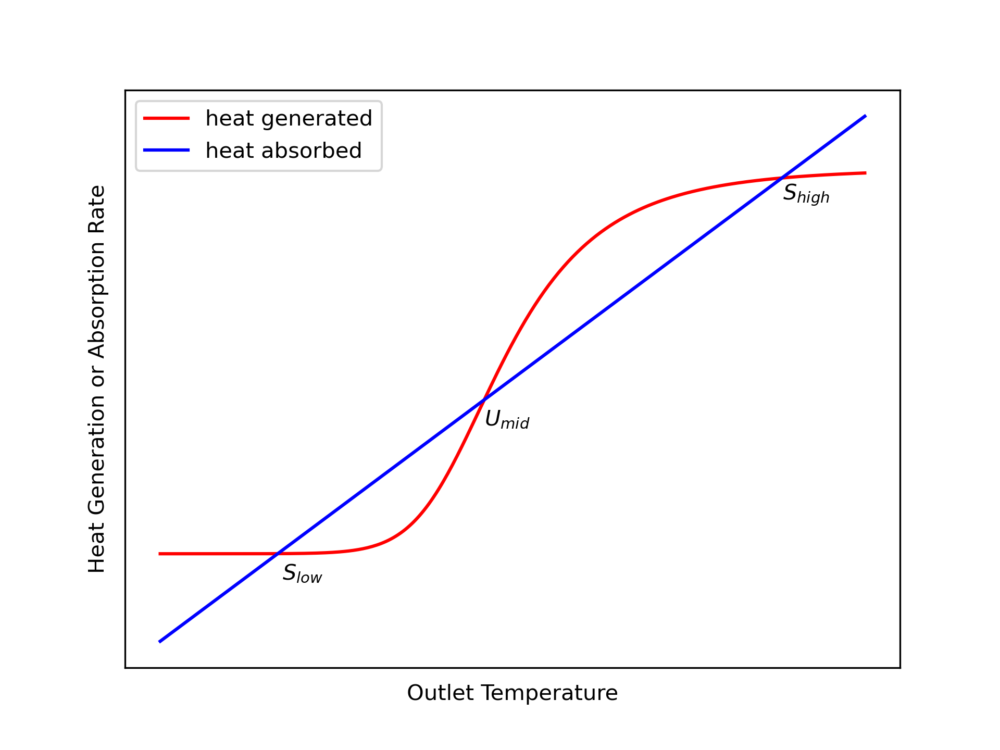{#fig-ch6_stability width="80%"}

Suppose a CSTR was operating at the low temperature steady state, $S_{low}$, and somehow the temperature was increased very slightly. That is, on the graph, suppose the operating point shifted slightly to the right of the intersection labeled $S_{low}$. At that new point the heat absorption (blue) would be greater than the heat generation (red), causing the operating temperature to decrease (i. e. to shift back toward $S_{low}$). 

Similarly, if the CSTR was operating at the low steady state, $S_{low}$, and somehow the temperature was decreased (shifted left) slightly, heat generation (red) would be greater than heat absorption (blue), causing the temperature to increase (i. e. to again shift back toward $S_{low}$). This argument suggests that $S_{low}$ is stable because following a small perturbation away from it, the system returns back to it. The exact same argument can be applied to $S_{high}$. Following any small perturbation from it, the system returns to it.

Now consider the $U_{mid}$ steady state. If somehow the operating temperature is increased very slightly (i. e. shifted to the right), the heat generation will be greater than the heat absorption. This will cause the temperature to rise. That is, the point will move even farther to the right. In fact, it will continue to move to the right until it reaches the high temperature steady state, $S_{high}$.

If the temperature of a CSTR somehow operating at the $U_{mid}$ steady state is decreased very slightly (i. e. shifted slightly to the left), the heat absorbed will exceed the heat generated and the temperature will decrease further. That is, the point will move farther to the left. This will continue until the point reaches the low temperature steady state, $S_{low}$.

These arguments are not rigorous because the curves in @fig-ch6_stability only apply at steady state, and once the system is perturbed, it is operating in transient mode. Nonetheless, a rigorous transient analysis shows that the conclusions drawn are correct. The middle steady state, $U_{mid}$, is unstable. Any perturbation to a reactor operating at the middle steady state will initiate a transient that ends at one of the two stable steady states.

There is another possible result of perturbing a reactor from an unstable steady state. The reactor could go into a state of sustained, periodic oscillations. This possibility is not considered in *Reaction Engineering Basics*. The topic of steady state stability is often considered in detail in more advanced reaction engineering books and courses.

## Parametric Sensitivity of CSTRs{#sec-ch6_ignition_and_extinction}

For reasons just described, real CSTRs do not operate at unstable steady states, but some *stable* steady states display similar behavior known as parametric sensitivity. @fig-ch6_sensitivity again shows the outlet temperature from a CSTR as a function of inlet temperature, but with the red and blue lines and the unstable steady states removed from @fig-ch6_multiplicity. It also shows two stable steady states labeled as $S_{ext}$ and $S_{ign}$. These are stable steady states that display one type of parametric sensitivity. They are called extinction and ignition points.

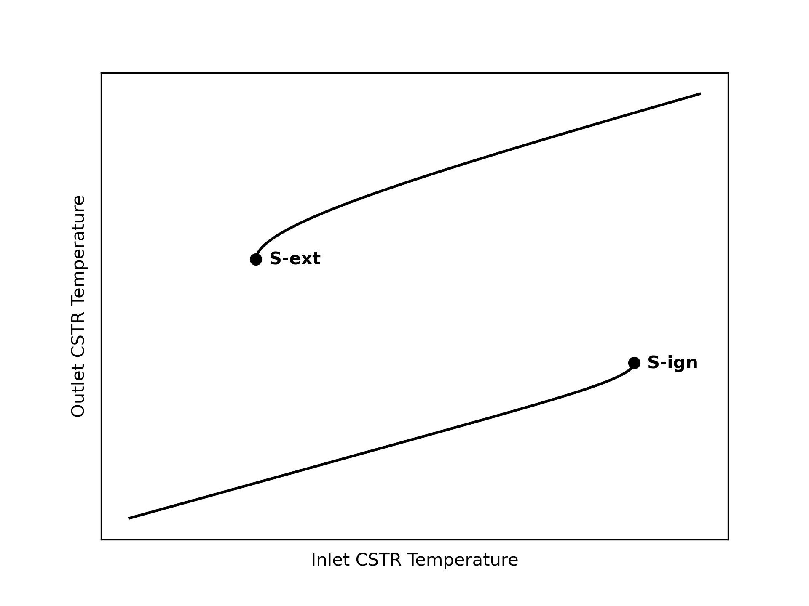{#fig-ch6_sensitivity width="80%"}

Notice that if a CSTR was operating at a stable steady state near the extinction point, $S_{ext}$, a slight perturbation to a lower temperature would cause the system to drop to the lower branch of the steady-state curve where the temperature is very low. This would result in a large decrease in the reaction rate, hence the name, extinction. Thus even though the initial steady state was stable, due to high parametric sensitivity, the system did not return to it following a slight perturbation to a lower temperature.

Similarly, if a CSTR was operating at a stable steady state near the ignition point, $S_{ign}$, a slight perturbation to a higher temperature would cause the system to jump to the upper branch of the steady-state curve where the temperature is much greater. If it occurred without explosion, this would result in a large increase in the reaction rate, hence the name, ignition.

Ignition and extinction are one type of parametric sensitivity; there are other types. Parametric sensitivity pertains to reactors operating at [stable]{.underline} steady states. Generally, when a small change in a reactor operating parameter results in an extreme change in the output, the reactor is said to be parametrically sensitive to the parameter being changed. Identifying and avoiding operation at conditions near points of parametric sensitivity is essential for the safe operation of CSTRs.

Other types of parametric sensitivity and methods for identifying them are typically presented in more advanced books and courses on reaction engineering. They have been introduced here so that readers are aware of the phenomenon. 

## Learning Objectives and Examples {#sec-ch6_learning_objectives}

The numbers in parentheses in the following list of learning objectives refer to the examples that follow in this section. Upon completion of this chapter, readers should

* know the definition and/or defining equation for CSTR mole balance, CSTR energy balance, steady-state multiplicity, stable/unstable steady state, and parametric sensitivity
* understand that
	* the ideal CSTR model assumes that the reacting fluid is a perfectly mixed, single-phase fluid
	* transient operation occurs following a change in a reactor variable or parameter
	* there may be more than one physically realizable solution of the steady-state CSTR design equations
	* there is only one inlet CSTR temperature for each outlet temperature
	* the procedure used to start up a CSTR determines the steady state it attains
	* when a reactor is perturbed from a steady state it may return to that steady state, transition to a different steady state, or go into sustained oscillations
* be able to
	* differentiate between reaction engineering assignments involving a steady-state CSTR (-@sec-ch6_ex1, -@sec-ch6_ex2, -@sec-ch6_ex3) and those involving a transient (-@sec-ch6_ex5) CSTR
	* select, modify, and simplify the CSTR design equations for modeling a given CSTR (-@sec-ch6_ex1, -@sec-ch6_ex2, -@sec-ch6_ex3, -@sec-ch6_ex4, -@sec-ch6_ex5, -@sec-ch6_ex6)
	* use the CSTR design equations, together with any other necessary equations, to complete a reaction engineering assignment involving
		* steady-state (-@sec-ch6_ex1, -@sec-ch6_ex2, -@sec-ch6_ex3, -@sec-ch6_ex4) or transient (-@sec-ch6_ex5, -@sec-ch6_ex6) operation
		* non-isothermal (-@sec-ch6_ex5) or adiabatic operation (-@sec-ch6_ex1, -@sec-ch6_ex2, -@sec-ch6_ex3, -@sec-ch6_ex4, -@sec-ch6_ex6)
		* heat exchange fluids that transfer latent or sensible (-@sec-ch6_ex5) heat
		* gas (-@sec-ch6_ex2) or liquid (-@sec-ch6_ex1, -@sec-ch6_ex3, -@sec-ch6_ex4, -@sec-ch6_ex5) phase reacting systems
		* single (-@sec-ch6_ex2, -@sec-ch6_ex3, -@sec-ch6_ex4) or multiple (-@sec-ch6_ex1, -@sec-ch6_ex5) reactions
		* specification (-@sec-ch6_ex1, -@sec-ch6_ex2, -@sec-ch6_ex4, -@sec-ch6_ex5, -@sec-ch6_ex6) or optimization (-@sec-ch6_ex3) tasks
		* single (-@sec-ch6_ex1, -@sec-ch6_ex2, -@sec-ch6_ex3, -@sec-ch6_ex5) or multiple (-@sec-ch6_ex4, -@sec-ch6_ex6) steady states
	* determine whether multiple CSTR steady states are possible (-@sec-ch6_ex1, -@sec-ch6_ex3, -@sec-ch6_ex4)
	* use transient CSTR analysis to determine the stability of a steady state (-@sec-ch6_ex6)
	* use qualitative analysis to assess and explain results from a quantitative analysis (-@sec-ch6_ex1, -@sec-ch6_ex2, -@sec-ch6_ex3, -@sec-ch6_ex4)

::: {.callout-important collapse="true"}
## Computer Code for Performing Calculations

The examples presented in *REB, The Book* describe how to perform the necessary calculations numerically, but they do not provide computer code for doing so. This is intentional so that readers can use whatever programming language and development environment they choose.

For readers who are interested, the Assignments by Topic Section of [*REB, The Course*]() describes and discusses performing the calculations for each example using Python, and includes links to the source code.

:::

### Response of a Steady-State CSTR {#sec-ch6_ex1}

Reactants A and B can react irreversibly to produce either a desired product, D, or an undesired product, U, as shown in equations (1) and (2). The rate expressions for reactions (1) and (2) are given in equations (3) and (4), respectively. In those rate expressions, the pre-exponential factors for $k_1$ and $k_2$ are 10.2 gal mol^-1^ min^-1^ and 17.0 gal mol^-1^ min^-1^, respectively, and the activation energies are 15.3 kJ mol^-1^ and 23.7 kJ mol^-1^, respectively. A liquid mixture containing 10 mol A gal^-1^ and 12 mol B gal^-1^ at 350 K is fed to an adiabatic 25 gal CSTR at a rate of 12.5 gal min^-1^. If the standard heats of reactions (1) and (2) at 298 K are -12.0 and -21.3 kJ mol^-1^, respectively, and if the reagents form an ideal liquid mixture with the temperature-independent heat capacities of A, B, D and U equal to 85, 125, 200 and 170 J mol^-1^ K^-1^, what are the conversion of the limiting reagent, the outlet selectivity (in mol D per mol U) and the outlet temperature?

$$
A + B \rightarrow D \tag{1}
$$

$$
A + B \rightarrow U \tag{2}
$$

$$
r_1 = k_1 C_AC_B \tag{3}
$$

$$
r_2 = k_2 C_AC_B \tag{4}
$$

---

:::{.callout-tip collapse="true"}
## Click Here to See What an Expert Might be Thinking at this Point

This assignment describes an adiabatic CSTR. It does not indicate that the reactor is being started up or shut down or that any reactor variables or parameters were changed, so it is operating at steady-state. Extensive quantities, e. g. the reacting fluid volume, are specified, so a basis cannot be chosen.

The assignment requests the conversion of the limiting reagent, the outlet selectivity, and the outlet temperature. These deliverables can be found by solving the steady-state CSTR design equations one time, so I don't need to identify a parameter for the calculations.

The conversion of the limiting reagent is requested, so I do need to identify whether A or B is limiting. For this problem I can do that without using any equations because A and B always react in a one-to-one ratio. The concentration of B in the feed is greater than the concentration of A, so A is the limiting reagent because it would be completely consumed first.

I'll start by summarizing the assignment using common symbols to represent the quantities that are given in the assignment narrative. I'll use a subscripted "in" to denote values at the reactor inlet, and I won't add a subscript for values at the reactor outlet.

:::

**Assignment Summary**

[Reactions]{.underline}:

$$
A + B \rightarrow D \tag{1}
$$

$$
A + B \rightarrow U \tag{2}
$$

[Rate Expressions]{.underline}:

$$
r_1 = k_1 C_AC_B \tag{3}
$$

$$
r_2 = k_2 C_AC_B \tag{4}
$$

[Reactor]{.underline}: Adiabatic, liquid-phase, steady-state CSTR 

[Given Constants]{.underline}: $k_{0,1}$ = 10.2 gal mol^-1^ min^-1^, $k_{0,2}$ = 17.0 gal mol^-1^ min^-1^, $E_1$ = 15.3 kJ mol^-1^, $E_2$ = 23.7 kJ mol^-1^, $C_{A,in}$ = 10 mol gal^-1^, $C_{B,in}$ = 12 mol gal^-1^, $T_{in}$ = 350 K, $V$ = 25 gal, $\dot{V}_{in}$ = 12.5 gal min^-1^, $\Delta H_1 \big\vert_{298 \text{ K}}$ =  –12.0 kJ mol^-1^, $\Delta H_2 \big\vert_{298 \text{ K}}$ = –21.3 kJ mol^-1^, $\hat{C}_{p,A}$ = 85 J mol^-1^ K^-1^, $\hat{C}_{p,B}$ = 125 J mol^-1^ K^-1^, $\hat{C}_{p,D}$ = 200 J mol^-1^ K^-1^, and $\hat{C}_{p,U}$ = 170 J mol^-1^ K^-1^.

[Deliverables]{.underline}: $f_A$, $S_{D/U}$, and $T$

**Formulation of the Equations**

:::{.callout-tip collapse="true"}
## Click Here to See What an Expert Might be Thinking at this Point

I'll use the computational strategy presented in [Chapter -@sec-ch5_workflow] for calculating the deliverables. It begins by creating a reactor model. The reactor in this assignment is an adiabatic, steady-state CSTR. To model it I need at least 2 mole balances (since there are two mathematically independent reactions and no inerts), but when the design equations are going to be solved numerically, as they are here, I think it's easier to simply include a mole balance for every reagent. The temperature of the reacting fluid is not given, so I'll also need an energy balance. Being adiabatic, the reactor does not use a heat exchange fluid, so I don't need an exchange fluid energy balance.

The general steady-state mole balance is given by @eq-ss_cstr_mole_bal. Two reactions are taking place, so the summation expands to two terms. Only A and B are flowing into the reactor, so $\dot{n}_{D,in}$ and $\dot{n}_{U,in}$ are equal to zero.

$$
0 = \dot n_{i,in} - \dot n_i + \cancelto{V\left(\nu_{i,1}r_1 + \nu_{i,2}r_2\right)}{V \sum_j \nu_{i,j}r_j}
$$

For a steady-state CSTR the general energy balance is given by @eq-ss_cstr_energy_bal. This reactor is adiabatic, so the rate of heat transfer is equal to zero. There are no shafts or moving boundaries that are doing work, so the rate of doing work is also equal to zero. Only A and B flow into the reactor, so the sum over the reagents reduces to two terms, and since the heat capacities are constant, the integrals can be evaluated. There are two reactions taking place, so the final sum expands to two terms.

$$
\begin{align}
0 =& \cancelto{0}{\dot Q} - \cancelto{0}{\dot W} - \cancelto{\left(\dot{n}_{A,in}\hat{C}_{p,A} + \dot{n}_{B,in}\hat{C}_{p,B}\right)\left(T - T_{in}\right)}{\sum_i\dot n_{i,in} \int_{T_{in}}^T \hat C_{p,i}dT} \\&- \cancelto{V\left(r_1 \Delta H_1 + r_2 \Delta H_2\right)}{V\sum_j r_j \Delta H_j}
\end{align}
$$

These equations are ATEs, so I'll write them in the form of residual expressions (see [Appendix -@sec-apxd_ates]).

:::

[Reactor Model Equations]{.underline}

$$
0 = \dot n_{A,in} - \dot n_A + V \left( -r_1 - r_2\right) = \epsilon_1 \tag{5}
$$

$$
0 = \dot n_{B,in} - \dot n_B + V \left( -r_1 - r_2\right) = \epsilon_2 \tag{6}
$$

$$
0 = - \dot n_D + V r_1 = \epsilon_3 \tag{7}
$$

$$
0 = - \dot n_U + V r_2 = \epsilon_4 \tag{8}
$$

$$
0 = -\left( \dot{n}_{A,in}\hat C_{p,A} + \dot{n}_{B,in}\hat C_{p,B}\right) \left(T - T_{in}\right) - V\left( r_1 \Delta H_1 + r_2 \Delta H_2\right) = \epsilon_5 \tag{9}
$$

:::{.callout-tip collapse="true"}
## Click Here to See What an Expert Might be Thinking at this Point

There are five reactor design equations, so I can solve them to find the values of five reactor model variables. If the outlet molar flow rates and outlet temperatures are not known, I choose them as the reactor model variables to be found by solving the reactor design equations, and that is the case here. Then to solve the design equations I need values for every other unknown quantity that appears in them. Going through the design equations quantity by quantity I see that the inlet molar flow rates of A and B, the rates of reactions (1) and (2), and the heats of reactions (1) and (2) are additional unknowns.

The inlet volumetric flow rate and the inlet concentrations of A and B are given and can be used to calculate the inlet molar flow rates. The assignment provides rate expressions for reactions (1) and (2), but they introduce the rate coefficients and the concentrations of A and B as additional unknowns. The rate coefficients can be calculated using the Arrhenius expression because the pre-exponential factors and activation energies are given. The concentrations of A and B can be calculated using their defining equations, but that introduces the outlet volumetric flow rate as an additional unknown. Assuming the reacting fluid to be an incompressible ideal mixture and noting that the reactor is at steady state, the inlet and outlet volumetric flow rates are equal ($\frac{dV}{dt} = 0$ in @eq-liquid_volume_accumulation), and the inlet volumetric flow rate is given. 

The assignment narrative provides the heats of reaction at 298 K, so I'll need expressions for calcuating the heats of reaction at any other temperatures. That can be done using @eq-deltaH-T,the given heat capacities, and heats of reaction at 298 K.

There aren't any other unknowns in the design equations for this reactor.

:::

[Reactor Model Variables]{.underline}: $\dot{n}_A$, $\dot{n}_B$, $\dot{n}_D$, $\dot{n}_U$, and $T$.

[Additional Computable Unknowns]{.underline}: $\dot{n}_{A,in}$, $r_1$, $k_1$, $C_A$, $C_B$, $\dot{V}$, $r_2$, $k_2$, $\dot{n}_{B,in}$, $\Delta H_1$, and $\Delta H_2$.

$$
\dot n_{i,in} = \dot C_{i,in} \dot{V}_{in} \qquad i = A \text{ and } B \tag{10}
$$

$$
r_1 = k_1 C_AC_B \tag{3}
$$

$$
r_2 = k_2 C_AC_B \tag{4}
$$

$$
k_j = k_{0,j} \exp{\left(\frac{-E_j}{RT}\right)} \qquad j = 1 \text{ and } 2 \tag{11}
$$

$$
C_i = \frac{\dot{n}_i}{\dot{V}} \qquad i = A \text{ and } B \tag{12}
$$

$$
\dot{V} = \dot{V}_{in} \tag{13}
$$

$$
\Delta H_1 = \Delta H_1 \big\vert_{298 \text{ K}} + \left( \hat{C}_{p,D} - \hat{C}_{p,A} - \hat{C}_{p,B} \right)\left(T - 298\right) \tag{14}
$$

$$
\Delta H_2 = \Delta H_2 \big\vert_{298 \text{ K}} + \left( \hat{C}_{p,U} - \hat{C}_{p,A} - \hat{C}_{p,B} \right)\left(T - 298\right) \tag{15}
$$

:::{.callout-tip collapse="true"}
## Click Here to See What an Expert Might be Thinking at this Point

The reactor design equations are ATEs and I'll solve them numerically using an ATE solver (see [Appendix -@sec-apxd_ates]). To do so I must provide an initial guess for the reactor model variables and a residuals function. I typically use the inlet molar flow rates as guesses for the outlet molar flow rates, and I'll do that here. Guessing a temperature that is too large can cause solver issues, so I typically guess that the outlet temperature differs from the inlet temperature by 5 K. In this case the reaction is exothermic and the reactor is adiabatic, so I'll guess the outlet temperature exceeds the inlet by 5 K. If the solver fails to converge, I'll need to revise these guesses until I find ones that lead to convergence. In addition, if multiple steady states are possible, I'll need to repeat the calculations using different guesses to try to find other solutions.

The only argument that can be passed to the residuals function is a guess for the reactor model variables. For this reactor that is all that is needed. The equations listed above can be used to compute the additional unknowns, and then residuals can be calculated using the reactor model equations, also listed above, and returned.

The reactor model variables found by solving the design equations include the outlet temperature, which is one of the requested deliverables. I can use the defining equations for conversion and selectivity to calculate the others.

:::

[ATE Solver Inputs]{.underline}:

1. Initial guesses for the reactor model variables:

$$
\dot{n}_{i,guess} = \dot{n}_{i,in} \qquad i = A, B, D, \text{ and } U \tag{16}
$$

$$
T_{guess} = T_{in} + 5\, K \tag{17}
$$

2. Residuals function that
	a. receives guesses for the reactor model variables,
	b. calculates the additional computable unknowns, and
	c. calculates and returns the residuals.

[Deliverables Equations]{.underline}:

$$
f_A = \frac{\dot{n}_{A,in} - \dot{n}_A}{\dot{n}_{A,in}} \tag{18}
$$

$$
S_{D/U} = \frac{\dot{n}_D}{\dot{n}_U} \tag{19}
$$

**Implementation of the Calculations**

Computer code to perform the calculations can be written using a variety of programming languages and environments, and the actual code can be structured in a variety of ways. Referring to the preceding assignment summary, computational strategy and formulation of the equations, here are the essential things the computer code must do, irrespective of the programming language and environment that is used. 

1. Make the given constants available wherever they are needed.
2. Define the initial guess for the reactor model variables.
3. Define the residuals function.
4. Call an ATE solver.
	a. Pass the initial guess and residuals function as arguments.
	b. Receive one solution of the reactor design equations that will include the outlet temperature.
5. Calculate the conversion of A and selectivity for D over U.
6. Check whether other steady states are possible.

**Results and Discussion**

The calculations were performed as described above. The calculations were repeated changing the initial guess for the outlet temperature to 0.01 K greater than the inlet temperature and to 100 K greater than the inlet temperature. In all three cases the solver converged to the same steady-state solution. While not a rigorous test, these results were taken to indicate that only one steady state is possible for this CSTR. To test more rigorously, a multiplicity plot could be generated and examined to see whether additional outlet temperatures are possible for the 350 K inlet temperature in this assignment.

Reagent A is the limiting reactant, and its steady-state conversion is 54.9%. The selectivity is 8.39 mol D per mol U, and the outlet temperature is 383 K. Both reactions are exothermic and the reactor operates adiabatically, so it is expected that the outlet temperature will be greater than the inlet temperature.

The selectivity for the desired product, D, over the undesired product, U, is good. Since the reactions producing them occur in parallel, the instantaneous selectivity, @eq-def_inst_select, may suggest ways to improve the overall selectivity. Applying that definition to this CSTR yields equation (23). According to that equation, the only way to increase the selectivity is to increase $k_1$ or decrease $k_2$. The only way to change the rate coefficients is by changing the temperature, but changing the temperature will change both rate coefficients.

$$
S_{D/U} =  \frac{r_D}{r_U} = \frac{k_1 C_AC_B}{k_2 C_AC_B} = \frac{k_1}{k_2} = \frac{k_{0,1} \exp{\left(\frac{-E_1}{RT}\right)}}{k_{0,2} \exp{\left(\frac{-E_2}{RT}\right)}}  \tag{23}
$$

The activation energy for reaction (2) is larger than that for reaction (1), so increasing the temperature will increase $k_2$ more than $k_1$, resulting in a lower selectivity for D over U. Thus, the selectivity for D over U can be increased by decreasing the temperature. However, if everything else remains fixed, decreasing the temperature will decrease the conversion because both rate coefficients will be smaller. That is, decreasing the temperature will increase the selectivity but decrease the conversion while increasing the temperature will decrease the selectivity but increase the conversion.

To verify this prediction, the feed temperature was decreased to 325 K and the calculations were repeated. The selectivity did indeed increase to 10.6 mol D per mol U, but the conversion decreased to 46.7%. Increasing the temperature to 375 K gave a lower selectivity of 6.9 mol D per mol U at a higher conversion of 61.5%.

**Deliverables**

A single steady state was identified for the CSTR described in the assignment narrative. At that steady state 54.9% of reagent A is converted with a selectivity of 8.39 mol D per mole of U. The outlet temperature is 383 K.

### Gas Phase Reaction in an Adiabatic, Steady-State CSTR{#sec-ch6_ex2}

The amount of A, (10%), in a gas mixture with B (65%), and inert, I, (25%) at 165 °C and 5 atm needs to be reduced to 0.1%. This is going to be accomplished by converting the A into Z according to reaction (1). An adiabatic CSTR is going to be used. The rate expression is given in equation (2) where the pre-exponential factor is 1.37 x 10^5^ m^3^ mol^-1^ min^-1^ and the activation energy is 11,100 cal mol^-1^. The heat of reaction is constant and equal to -7200 cal mol^-1^, and the heat capacities of A, B, I, and Z are equal to 7.6, 8.2, 4.3, and 13.8 cal mol^-1^ K^-1^, respectively. What space time is required, and what temperature will result?

$$
A + B \rightarrow Z \tag{1}
$$

$$
r_1 = k_1C_AC_B \tag{2}
$$

---

:::{.callout-tip collapse="true"}
## Click Here to See What an Expert Might be Thinking at this Point

The assignment involves an adiabatic CSTR. It doesn't mention startup, shut down, or indicate that any reactor variable or parameter was changed. This means the reactor is operating at steady-state. None of the given constants are extensive quantities, so I can choose one extensive variable as a basis for the calculations. I'll use an inlet volumetric flow rate of 1.0 m^3^ min^-1^ as the basis because that will make it easy to calculate the inlet molar flow rates when they are needed. 

The deliverables can be calculated after solving the reactor design equations once, so I don't need to identify a parameter for the calculations. The assignment doesn't entail making a graph or optimizing anything, so it is not necessary to select a quantity to use as a parameter.

I'll begin with an assignment summary making sure to use appropriate symbols to represent the quantities that are given in the assignment narrative. I'll use a subscripted "in" to denote values at the reactor inlet, and I won't add a subscript for values at the reactor outlet.

:::

**Assignment Summary**

[Reaction]{.underline}:

$$
A + B \rightarrow Z \tag{1}
$$

[Rate Expression]{.underline}:

$$
r_1 = k_1C_AC_B \tag{2}
$$

[Reactor]{.underline}: Adiabatic, gas-phase, steady-state CSTR

[Given Constants]{.underline}: $y_{A,in}$ = 0.1, $y_{Bin}$ = 0.65, $y_{I,in}$ = 0.25, $T_{in}$ = (165 + 273.15) K, $P$ = 5 atm, $y_A$ = 0.001, $k_{0,1}$ = 1.37 x 10^5^ m^3^ mol^-1^ min^-1^, $E_1$ = 11,100 cal mol^-1^, $\Delta H_1$ = –7200 cal mol^-1^, $\hat{C}_{p,A}$ = 7.6 cal mol^-1^ K^-1^, $\hat{C}_{p,B}$ = 8.2 cal mol^-1^ K^-1^, $\hat{C}_{p,I}$ = 4.3 cal mol^-1^ K^-1^, and $\hat{C}_{p,Z}$ = 13.8 cal mol^-1^ K^-1^.

[Basis]{.underline}: $\dot{V}_{in}$ = 1.0 m^3^ min^-1^

[Deliverables]{.underline}: $\tau$ and $T$

**Formulation of the Equations**

:::{.callout-tip collapse="true"}
## Click Here to See What an Expert Might be Thinking at this Point

As suggested in [Chapter -@sec-ch5_workflow], I'll start by creating a model of the reactor. It's a gas-phase, adiabatic, steady-state CSTR. There is one reaction and one inert, so at the minimum I need two mole balances to model the reactor, but I prefer to include a mole balance for every reagent when I'll be solving them numerically. The temperature of the reacting fluid is not known, so an energy balance on the reacting fluid is also necessary. Since there isn't an exchange fluid (the reactor is adiabatic), an exchange fluid energy balance is not needed.

The general steady-state mole balance is given by @eq-ss_cstr_mole_bal. There is only one reaction, so the final summation reduces to a single term. The inlet molar flow rate of Z is zero.

$$
0 = \dot n_{i,in} - \dot n_i + \cancelto{\nu_{i,1}Vr_1}{V \sum_j \nu_{i,j}r_j}
$$

The general energy balance for a steady-state CSTR is given by @eq-ss_cstr_energy_bal. This reactor is adiabatic, so the rate of heat transfer is equal to zero. There are no shafts or moving boundaries that are doing work, so the rate of doing work is also equal to zero. A, B, and I flow into the reactor, so the sum over the reagents becomes three terms. Since the heat capacities are constants, it is trivial to evaluate the integrals. There is only one reaction, so the final summation reduces to a single term.

$$
\begin{align}
0 =& \cancelto{0}{\dot Q} - \cancelto{0}{\dot W} - \cancelto{\left(\dot{n}_{A,in}\hat{C}_{p,A} + \dot{n}_{B,in}\hat{C}_{p,B} + \dot{n}_{I,in}\hat{C}_{p,I}\right)\left(T - T_{in}\right)}{\sum_i\dot n_{i,in} \int_{T_{in}}^T \hat C_{p,i}dT} \\&- \cancelto{r_1 V \Delta H_1}{V\sum_j r_j \Delta H_j}
\end{align}
$$

These reactor design equations are ATEs, so I'll write them in the form of residual expressions (see [Appendix -@sec-apxd_ates]).

:::

[Reactor Model Equations]{.underline}

$$
0 = \dot n_{A,in} - \dot n_A - Vr_1 = \epsilon_1 \tag{3}
$$

$$
0 = \dot n_{B,in} - \dot n_B - Vr_1 = \epsilon_2 \tag{4}
$$

$$
0 = \dot n_{I,in} - \dot n_I = \epsilon_3 \tag{5}
$$

$$
0 = - \dot n_Z + Vr_1 = \epsilon_4 \tag{6}
$$

$$
0 = -\left(\dot{n}_{A,in}\hat{C}_{p,A} + \dot{n}_{B,in}\hat{C}_{p,B} + \dot{n}_{I,in}\hat{C}_{p,I} \right)\left(T - T_{in}\right) - Vr_1 \Delta H_1 = \epsilon_5 \tag{7}
$$

:::{.callout-tip collapse="true"}
## Click Here to See What an Expert Might be Thinking at this Point

There are five reactor design equations, and they can be solved to find the values of five reactor model variables. I usually solve the design equations for the outlet molar flow rates of the reagents and the outlet temperature. However, in this assignment I'm told the final amount of reagent A, so I don't need to solve for its outlet molar flow rate. I'm asked to find the space time, and I already chose the inlet volumetric flow rate as a basis, so I'll solve for the reacting fluid volume instead of the outlet molar flow rate of reagent A. Then once I've solved the design equations, I'll be able to calculate the space time from its definition. Solving the design equations will give the requested outlet temperature directly.

Having identified the reactor model variables, in order to solve the reactor design equations I need values for every other unknown quantity that appears in them. Going through the design equations quantity by quantity I see that the inlet molar flow rates of A, B, and I, the outlet molar flow rate of A, and the reaction rate are additional unknowns. The inlet molar flow rates can be calculated from their given percentages, but to do that, another unknown, the total inlet molar flow rate, will need to be calculated using the inlet volumetric flow rate I chose as the basis and the ideal gas law. The oultet molar flow rate of A can be calculated from its known final mole fraction. 

The given rate expression can be used to calculate the rate, but it introduces the rate coefficient and the concentrations of A and B as additional unknowns. The rate coefficient can be calculated using the Arrhenius expression. The concentrations of A and B can be calculated using the defining equation for concentration, but that introduces the outlet volumetric flow rate as another additional unknown. It can be calculated using the ideal gas law.

There aren't any other unknowns in the design equations for this reactor.

:::

[Reactor Model Variables]{.underline}: $V$, $\dot{n}_B$, $\dot{n}_Z$, $\dot{n}_I$, and $T$.

[Additional Computable Unknowns]{.underline}: $\dot{n}_{A,in}$, $\dot{n}_A$, $r_1$, $k_1$, $C_A$, $C_B$, $\dot{V}$, $\dot{n}_{B,in}$, and $\dot{n}_{I,in}$.

$$
\dot{n}_{i,in} = y_{i,in} \dot{n}_{total,in} \qquad i = A, B, \text{ and } I \tag{8}
$$

$$
\dot{n}_{total,in} = \frac{P\dot{V}_{in}}{RT} \tag{9}
$$

$$
y_A = \frac{\dot{n}_A}{\dot{n}_A + \dot{n}_B + \dot{n}_I + \dot{n}_Z} \qquad \Rightarrow \qquad \dot{n}_A = \frac{\left(\dot{n}_B + \dot{n}_I + \dot{n}_Z\right)y_A}{1-y_A} \tag{10}
$$

$$
r_1 = k_1C_AC_B \tag{2}
$$

$$
k_1 = k_{0,1} \exp{\left(  \frac{-E_1}{RT} \right)} \tag{11}
$$

$$
C_i = \frac{\dot{n}_i}{\dot{V}}  \qquad i = A \text{ and } B \tag{12}
$$

$$
\dot{V} = \frac{\left(\dot{n}_A + \dot{n}_B + \dot{n}_I + \dot{n}_Z\right)RT}{P} \tag{13}
$$
 
:::{.callout-tip collapse="true"}
## Click Here to See What an Expert Might be Thinking at this Point

Since the design equations are ATEs, I'll use an ATE solver to solve them (see [Appendix -@sec-apxd_ates]). I'll need to provide an initial guess for the reactor model variables and a residuals function to it. I have no basis for guessing the reacting fluid volume, so I'll arbitrarily guess 1 m^3^. I usually use the inlet molar flow rates as a guess for the outlet molar flow rates, so I'll do that here. Since a temperature guess that is too large can cause solver issues, I'll guess that the outlet temperature only differs from the inlet temperature by 5 K. Since this reaction is exothermic and the reactor is adiabatic, I'll guess that it is 5 K greater than the inlet temperature. If the solver fails to converge, I'll need to revise these guesses until I find ones that lead to convergence. I won't need to check for multiple steady states in this assignment because I know the final amount of reagent A. Just as there is only one steady state for each outlet temperature, there is also only one steady state for each outlet molar flow rate.

The residuals function must accept a guess for the reactor model variables and return the residuals, $\epsilon_1$ through $\epsilon_5$. Here it will use the guess it receives to calculate the additional unknowns using the equations above, and then it will evaluate the residuals using equations (3) through (7) and return them.

The requested final temperature, one of the requested deliverables, is one of the reactor model variables that will be found upon solving the design equations, as will the reacting fluid volume. The space time, the other requested deliverable, can be calculated using its defining equation.

:::

[ATE Solver Inputs]{.underline}: 

1. Initial guesses for the reactor model variables:

$$
V_{guess} = 1\, m^3 \tag{12}
$$

$$
\dot{n}_{i,guess} = \dot{n}_{i,in} \qquad i = B, Z, \text{ and } I \tag{13}
$$

$$
T_{guess} = T_{in} + 5\, K \tag{14}
$$

2. Residuals function that
	a. receives guesses for the reactor model variables,
	b. calculates the additional computable unknowns, and
	c. calculates and returns the residuals.

[Deliverables Equation]{.underline}:

$$
\tau = \frac{V}{\dot V_{in}}
$$

**Implementation of the Calculations**

Computer code to perform the calculations can be written using a variety of programming languages and environments, and the actual code can be structured in a variety of ways. Referring to the preceding assignment summary, computational strategy and formulation of the equations, here are the essential things the computer code must do, irrespective of the programming language and environment that is used.

1. Make the given constants available wherever they are needed.
2. Define the initial guess for the reactor model variables.
3. Define the residuals function.
4. Call an ATE solver.
	a. Pass the initial guess and residuals function as arguments.
	b. Receive a solution of the reactor design equations which will include the requested outlet temperature.
5. Calculate the space time.

**Results and Discussion**

The calculations were performed as described above. In this analysis, the initial composition and the conversion were specified. As such, the amount of heat released is fixed, and since the reactor is adiabatic, that also fixes the final temperature. Consequently, there is no need to check for other steady states.

The reaction taking place is exothermic and the reactor operates adiabatically, so the temperature is expected to increase, and it does. The inlet temperature is 165 °C and the outlet temperature is 265 °C. The feed is immediately heated to the final temperature as it enters the reactor due to perfect mixing. As a consequence the reaction takes place at 265 °C. In this case, that must correspond to a large rate coefficient, because the required space time is only 0.42 min. In a plug flow reactor (see @sec-ch9) the feed would be heating from 165 to 265 °C as it was reacting. At 165 °C, the rate coefficient would be lower, and that would mean that a longer space time would be needed in a plug flow reactor.

**Deliverables**

The space time necessary to reduce the inlet amount of reagent A from 10% to 0.1% is 0.42 min (25.2 s). The temperature will increase from 165 to 265 °C while doing so.

:::{.callout-note collapse="false"}
## Note

Even though the analysis in this assignment was very straightforward, there is an important point to recognize. Very often, CSTRs are used to process liquid feeds. Assuming the liquids to be ideal, incompressible solutions makes the steady-state volumetric flow rate constant; there is no expansion or contraction of the fluid. The concentrations that are substituted into the rate expressions are simply the outlet molar flow rate divided by the outlet volumetric flow rate, and since the volumetric flow rate is constant, the inlet and outlet volumetric flow rates are equal.

$$
C_i = \frac{\dot{n}_{i}}{\dot{V}} \qquad \underset{\text{liquids}}{\Rightarrow} \qquad \frac{\dot{n}_{i}}{\dot{V}_{in}}
$$

Generaly, for gas phase reacting fluids, the inlet and outlet volumetric flow rates are **not** equal due to expansion or contraction. Setting the concentration equal to the molar flow rate divided by the [inlet]{.underline} volumetric flow rate of a gas will result in an incorrect solution of the reactor design equations. Instead the volumetric flow rate must be calculated using the ideal gas law as was done in equations (11) and (12).

:::

### Maximizing Conversion for a Reversible Reaction in a Steady-State CSTR{#sec-ch6_ex3}

To produce Z via reaction (1), reagent A will be fed to an adiabatic 0.5 m^3^ CSTR at 70 mol min^-1^, and B will be fed at 1500 mol min^-1^ giving a total liquid feed rate of 40 L min^-1^. The rate expression for reaction (1) is given in equation (2), where the pre-exponential factor for the rate coefficient is 1.2 x 10^9^ m^3^ mol^-1^ min^-1^ and the activation energy is 25.8 kcal mol^-1^. The equilibrium constant appearing in the rate expression can be calculated using equation (3), where the pre-exponential factor is 4.2 x 10^-18^ m^3^ mol^-1^ and the heat of reaction is -22.4 kcal mol^-1^. The heat capacities of A, B, and Z are 412, 75.5, and 512 J mol^-1^ K^-1^, respectively, and may be taken to be independent of temperature. What feed temperature will maximize the conversion of A?

$$
A + B \rightarrow Z \tag{1}
$$

$$
r_1 = k_1C_AC_B\left( 1 - \frac{C_Z}{K_1C_AC_B}\right) \tag{2}
$$

$$
K_1 = K_{0,1}\exp{\frac{-\Delta H_1}{RT}} \tag{3}
$$

---

:::{.callout-tip collapse="true"}
## Click Here to See What an Expert Might be Thinking at this Point

The reactor in this assignment is an adiabatic, liquid-phase CSTR. The narrative does not indicate that any reactor variables or parameters where changed, so the operation is steady-state. The assignment narrative specifies extensive quantities, e. g. the reacting fluid volume, so a basis cannot be assumed. 

I'm asked to maximize the conversion with respect to the inlet temperature. That means I'm going to have to calculate the conversion for a range of inlet temperatures to find the one that gives the maximum conversion. So in this analysis, the inlet temperature is a parameter. While the assignment only asks for the inlet temperature that maximizes the conversion, I'll also want to report what that maximum conversion is.

I'll begin with an assignment summary using common symbols to represent the quantities that are given in the assignment narrative. I'll use $T_{in, opt}$ to represent the inlet temperature that maximizes the conversion and $f_{A,max}$ to represent the maximum conversion of A.

:::

**Assignment Summary**

[Reaction]{.underline}:

$$
A + B \rightarrow Z \tag{1}
$$

[Rate Expression]{.underline}:

$$
r_1 = k_1C_AC_B\left( 1 - \frac{C_Z}{K_1C_AC_B}\right) \tag{2}
$$

$$
K_1 = K_{0,1}\exp{\frac{-\Delta H_1}{RT}} \tag{3}
$$

[Reactor]{.underline}: Adiabatic, liquid-phase, steady-state CSTR

[Given Constants]{.underline}: $V$ = 0.5 m^3^, $\dot{n}_{A,in}$ = 70 mol min^-1^, $\dot{n}_{B,in}$ 1500 mol min^-1^, $\dot{V}_{in}$ = 40 L min^-1^ $k_{0,1}$ = 1.2 x 10^9^ m^3^ mol^-1^ min^-1^, $E_1$ = 25.8 kcal mol^-1^, $K_{0.1}$ = 4.2 x 10^-18^ m^3^ mol^-1^, $\Delta H_1$ = –22.4 kcal mol^-1^ $\hat{C}_{p,A}$ = 412 J mol^-1^ K^-1^, $\hat{C}_{p,B}$ = 75.5 J mol^-1^ K^-1^, $\hat{C}_{p,Z}$ = 512 J mol^-1^ K^-1^, and $R$ = 1.987 cal mol^-1^ K^-1^.

[Parameter]{.underline}: $T_{in}$

[Deliverables]{.underline}: $T_{in, opt}$ and $f_{A,max}$.

**Formulation of the Equations**

:::{.callout-tip collapse="true"}
## Click Here to See What an Expert Might be Thinking at this Point

I need to generate a model for the reactor, which in this assignment is an adiabatic, liquid-phase, steady-state CSTR. To begin I need to select and simplify the reactor design equations that are needed. I'll write a mole balance for every reagent in the system. An energy balance on the reacting fluid will need to be added because the reacting fluid temperature is not known. The reactor is adiabatic, meaning there isn't an exchange fluid, and an exchange fluid energy balance cannot be written.

The general steady-state mole balance is given by @eq-ss_cstr_mole_bal. In this system, one reaction is taking place so the summation reduces to a single term. Only A and B are flowing into the reactor, so $\dot{n}_{Z,in}$ is equal to zero.

$$
0 = \dot n_{i,in} - \dot n_i + \cancelto{\nu_{i,1}Vr_1}{V \sum_j \nu_{i,j}r_j}
$$

@eq-ss_cstr_energy_bal is the steady-state CSTR reacting fluid energy balance. This reactor is adiabatic, so the rate of heat transfer is equal to zero. There are no shafts or moving boundaries that are doing work, so the rate of doing work is also equal to zero. Only A and B flow into the reactor, so the sum over the reagents reduces to two terms, and since the heat capacities are constant, the integrals can be evaluated easily. The final sum reduces to a single term because only one reaction is taking place.

$$
\begin{align}
0 =& \cancelto{0}{\dot Q} - \cancelto{0}{\dot W} - \cancelto{\left(\dot{n}_{A,in}\hat{C}_{p,A} + \dot{n}_{B,in}\hat{C}_{p,B}\right)\left(T - T_{in}\right)}{\sum_i\dot n_{i,in} \int_{T_{in}}^T \hat C_{p,i}dT} \\&- \cancelto{Vr_1 \Delta H_1}{V\sum_j r_j \Delta H_j}
\end{align}
$$

I'll write them in the form of residual expressions because they are ATEs and will be solved numerically.

:::

[Reactor Model Equations]{.underline}

$$
0 = \dot n_{A,in} - \dot n_A - Vr_1 = \epsilon_1 \tag{4}
$$

$$
0 = \dot n_{B,in} - \dot n_B - Vr_1 = \epsilon_2 \tag{5}
$$

$$
0 = - \dot n_Z + Vr_1 = \epsilon_3 \tag{6}
$$

$$
0 = -\left(\dot{n}_{A,in} \hat{C}_{p,A} + \dot{n}_{B,in} \hat{C}_{p,B} \right)\left( T - T_{in}\right) - Vr_1 \Delta H_1 = \epsilon_4 \tag{7}
$$

:::{.callout-tip collapse="true"}
## Click Here to See What an Expert Might be Thinking at this Point

There are four reactor ATE design equations, so four reactor model variables can be found by solving them. The outlet molar flow rates of the reagents and the outlet temperature are not known, so I'll solve the design equations for them. To do that, I need values for every other unknown quantity that appears in the design equations. Reading through them I see that $r_1$ and $T_{in}$ are the only additional unknowns they contain. A rate expression is provided for calculating the rate along with an expression for calculating the equilibrium constant it contains. However it also introduces the concentrations of A, B, and Z as additional unknowns. They can be calculated using the defining equation for concentration in a flow system, which introduces another unknown, the outlet volumetric flow rate. Assuming the liquid to be an incompressible ideal mixture and noting that the reactor operates at steady state, the outlet volumetric flow rate will equal the inlet volumetric flow rate.

The inlet temperature is a parameter in this analysis. As such, it is uncomputable, and its value will need to be provided each time the design equations are solved. Initially I'll guess that the optimum inlet temperature is between 75 and 125 °C. If it isn't, I'll need to shift that guess. I'll use the following notation, where $\left[75, \cdots, 125\right]$ denotes an array of arbitrary length, starting at 75 and ending at 125, and 273.15 is added to each element of the array to convert the temperatures to Kelvin.

$$
\underline{T}_{in} = \left(\left[75, \cdots, 125\right] + 273.15\right) \text{ K}
$$

:::

[Reactor Model Variables]{.underline}: $\dot{n}_A$, $\dot{n}_B$, $\dot{n}_Z$, and $T$/

[Additional Computable Unknowns]{.underline}: $r_1$, $k_1$, $C_A$, $\dot{V}$, $C_B$, $C_Z$, and $K_1$

$$
r_1 = k_1C_AC_B\left( 1 - \frac{C_Z}{K_1C_AC_B}\right) \tag{2}
$$

$$
K_1 = K_{0,1}\exp{\frac{-\Delta H_1}{RT}} \tag{3}
$$

$$
k_1 = k_{0,1} \exp{\left(  \frac{-E_1}{RT} \right)} \tag{8}
$$

$$
C_i = \frac{n_i}{\dot{V}} \qquad i = A, B, and \text{ and } Z \tag{9}
$$

$$
\dot{V} = \dot{V}_{in} \tag{10}
$$

[Additional Uncomputable Unknown]{.underline}: $T_{in}$

$$
\underline{T}_{in} = \left(\left[75, \cdots, 125\right] + 273.15\right) \text{ K} \tag{11}
$$

:::{.callout-tip collapse="true"}
## Click Here to See What an Expert Might be Thinking at this Point

The design equations will be solved for each value of the parameter, $T_{in}$ using an ATE solver (see [Appendix -@sec-apxd_ates]). To do so an initial guess for the reactor model variables and a residuals function will need to be provided. The first time the design equations are solved, I will use the inlet molar flow rates as guesses for the outlet molar flow rates. The reaction is exothermic and the reactor is adiabatic, so the outlet temperature will exceed the inlet temperature. A guess for the temperature that is too large can cause solver convergence issues, so I'll guess that the outlet temperture exceeds the inlet temperature by 5 K. After the design equations have been solved the first time, the results can be used as the initial guess the next time they are solved. If the solver fails to converge with these guesses, I'll need to revise them until the solver does converge. I'll also need to check whether multiple steady states are possible, and if they are, I'll need to define different guesses to find them. In most cases, it is only necessary to change the guess for the temperature to find different steady states.

The residuals function must accept a guess for the reactor model variables and return the residuals, $\epsilon_1$ through $\epsilon_4$. The initial guess is the only argument that can be passed to the residuals function, but it needs the additional uncomputable unknown, that is the inlet temperature, in order to evaluate the residuals. Therefore, before calling the ATE solver, the current value of the inlet temperature must be made available to the residuals function by some means other than as an argument. Assuming that has been done, the residuals function can use the guess it receives to calculate the additional computable unknowns using the equations above, and then it can evaluate the residuals using equations (4) through (7).

Once the design equations have been solved, the conversion can be calculated using its defining equation and saved, building up corresponding sets of valus of $T_{in}$ and $f_A$. After the design equations have been solved for all of the chosen inlet temperatures, the maximum conversion and corresponding inlet temperature can be determined.

:::

[ATE Solver Inputs]{.underline}: 

1. Initial guesses for the reactor model variables:

$$
\begin{align}
\forall T_{in,n} \in \underline{T}_{in} \qquad &n =1 \qquad \begin{pmatrix}\dot{n}_{A,guess} = \dot{n}_{A,in}\\
\dot{n}_{B,guess} = \dot{n}_{B,in}\\
\dot{n}_{Z,guess} = \dot{n}_{Z,in}\\
T_{guess} = T_{in,n} + 5 K
\end{pmatrix}\\
&n > 1 \qquad \begin{pmatrix}
\dot{n}_{A,guess} = \dot{n}_A\big\vert_{T{_{in,n-1}}}\\
\dot{n}_{B,guess} = \dot{n}_B\big\vert_{T{_{in,n-1}}}\\
\dot{n}_{Z,guess} = \dot{n}_Z\big\vert_{T{_{in,n-1}}}\\
T_{guess} = T\big\vert_{T{_{in,n-1}}}
\end{pmatrix}
\end{align} \tag{12}
$$

2. Residuals function that
	a. has been provided with the inlet temperature by some means other than as an argument,
	b. receives guesses for the reactor model variables,
	c. calculates the additional computable unknowns, and
	d. calculates and returns the residuals.

::: {.callout-note collapse="false"}
## Note on Notation

This is the first example in *REB, The Book* where a calculation involves looping through a range of values for a parameter. In equation (11) an array containing the values of the parameter was defined. In *REB, The Book,* the notation shown in equation (12) is used to indicate repeating a calculation for each element in an array. The first part, $\forall T_{in,n} \in \underline{T}_{in}$, can be read as saying "for all values of $T_{in}$ in the array $\underline{T}_{in}$, using $n$ to index them, do whatever follows."

Equation (12) next indicates that for the first value of $T_{in}$ in the array, $n=1$, the initial guesses for the outlet molar flow rates are the inlet molar flow rates and the initial guess for the temperature is that it is 5 K greater than the inlet temperature. The second line says that for all other values of $T_{in}$ in the array, $n>1$, the initial guess for the reactor model variables is the solution of the design equations for the previous value of $T_{in}$, $n-1$. This is a common strategy for solving ATEs for a range of values of a parameter, and it is often faster and more reliable than using the same initial guess for each value of the parameter. 

The same notation is used below in equation (13) to indicate that the conversion is calculated for each value of $T_{in}$ in the array. This results in an array of conversion values, $\underline{f}_A$, that corresponds to the array of inlet temperatures, $\underline{T}_{in}$. The maximum conversion and corresponding inlet temperature can then be found by searching through these arrays.

:::

[Deliverables Equations]{.underline}:

$$
\forall T_{in,n} \in \underline{T}_{in} \qquad f_{A,n} = \frac{\dot{n}_{A,in} - \dot{n}_A \big\vert_{T_{in,n}}}{\dot{n}_{A,in}} \tag{13}
$$

$$
T_{in,opt} = \underset{T_{in}}{\arg\max}\left( \underline{f}_A \right)\tag{14}
$$

$$
f_{A,max} = \underline{f}_A \big\vert_{T_{in,opt}}\tag{15}
$$

**Implementation of the Calculations**

Computer code to perform the calculations can be written using a variety of programming languages and environments, and the actual code can be structured in a variety of ways. Referring to the preceding assignment summary, computational strategy and formulation of the equations, here are the essential things the computer code must do, irrespective of the programming language and environment that is used.

1. Make the given constants available wherever they are needed.
2. Define an array containing a range of values for the inlet temperature.
3. Define the residuals function.
4. Define the initial guess for the reactor model variables for the first inlet temperature in the array.
5. Loop through all of the inlet temperatures in the array
	a. making the current inlet temperature available to the residuals function,
	b. calling an ATE solver
		i. passing the initial guess and the residuals function as arguments
		ii. receiving a solution of the design equations
	c. saving the result to use as the initial guess for the next initial temperature
	d. calculating the conversion and saving it in an array
6. Find the maximum conversion and the corresponding initial temperature
7. Check that no other steady states are possible at the inlet temperature where the conversion is maximized.

**Results and Discussion**

The calculations were performed as described above using the range of inlet temperatures between 75 and 125 °C indicated in equation (11). Figure 1 shows the conversion for each inlet temperature in the range. The conversion does pass through a maximum, indicating that the chosen range of inlet temperatures did not need to be adjusted.

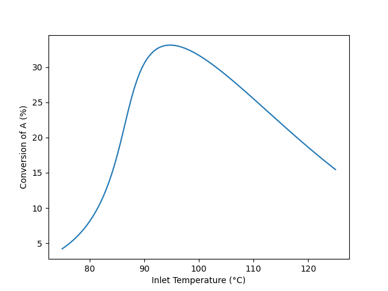

The results shown in Figure 1 agree with qualitative expectations. For any feed temperature heat will be released by reaction leading to an outlet temperature that is greater than the inlet temperature. The rate expression, equation (2) reproduced below, contains two temperature dependent terms, namely the rate coefficient, $k_1$, and the equilibrium constant, $K_1$. The rate coefficient increases as the temperature increases, but because this reaction is exothermic, the equilibrium constant decreases. 

$$
r_1 = k_1C_AC_B\left( 1 - \frac{C_Z}{K_1C_AC_B}\right) \tag{2}
$$

So looking at the rate expression, the first term will increase as with increasing temperature, but the term in parentheses will decrease. ($K_1$ decreases with increasing temperature causing the value being subtracted from one to increase) At lower feed temperatures, the reaction has not come close to equilibrium and the first term predominates causing the rate, and consequently the conversion, to increases. At intermediate feed temperatures, the reaction begins to approach thermodynamic equilibrium. As the temperature increases both $k_1$ and $K_1$ affect the rate, and consequently the rate, and by extension, the conversion, rises less steeply. At some temperature, the effects of $k_1$ and $K_1$ on the rate become equal and the rate (and conversion) reaches a maximum. At still higher temperatures, the reaction approaches thermodynamic equilibrium. At this point, as the temperature increases, the effect of $K_1$ predominates and the rate, while still positive, decreases with increasing temperature. Consequently, the conversion also decreases.

CSTRs can sometimes have multiple steady states. To check rigorously here, a multiplicity plot could be generated and examined to see whether multiple steady states are possible at the optimum inlet temperature, 94.7 °C. Instead of doing that, the conversion and outlet temperature at an inlet temperature of 94.7 were calculated using outlet temperature guesses of 94.71, 99.7, and 294.7 °C. The same conversion (33.1%) and outlet temperature (110 °C) was found in all three cases. Also, the original calculations began at the lowest inlet temperature of the chosen range, and then proceeded through successively greater inlet temperatures. The curve does not show any discontinuities, which might occur if at any inlet temperature the solution jumped to a different steady state.  While not a rigorous test, these results suggests that there is only one steady state.

**Deliverables**

The maximum conversion, 33%, occurs at an inlet temperature of 95 °C, and the corresponding outlet temperature is 110 °C. Lower inlet temperatures result in a lower rate that yields lower conversions. At higher temperatures, thermodynamic equilibrium limits the conversion. Because the reaction is exothermic, the equilibrium conversion decreases as the temperature increases. Thus the maximum in the conversion is due to the opposing effects of temperature on the rate coefficient and the equilibrium constant.

### Multiple Steady States in a CSTR{#sec-ch6_ex4}

An adiabatic, steady-state CSTR with a volume of 500 cm^3^ is going to be used to convert A and B into Y and Z according to reaction (1). A liquid solution flowing at 1.0 cm^3^ s^-1^ and containing equal amounts of A and B (0.015 mol cm^-3^) at 50 °C will be used. The heat capacity of the fluid is essentially equal to that of the solvent, 0.35 cal g^-1^ K^-1^ and can be considered to be constant. The density of the fluid, also constant, is 0.93 gm cm^-3^. The rate expression for reaction (1) is given in equation (2), and the heat of reaction (1) may be assumed to be constant and equal to -20 kJ mol^-1^. The rate coefficient displays Arrhenius temperature dependence with a pre-exponential factor equal to 3.24 x 10^12^ cm^3^ mol^-1^ s^-1^, and an activation energy of 105.0 kJ mol^-1^. How many steady states are possible at these conditions, and what are the conversion and outlet temperature for each of them?

$$
A + B \rightarrow Y + Z \tag{1}
$$

$$
r_1 = k_1C_AC_B \tag{2}
$$

---

:::{.callout-tip collapse="true"}
## Click Here to See What an Expert Might be Thinking at this Point

In this assignment the reactor is an adiabatic, liquid-phase CSTR, and I'm told it operates at steady-state. The reactor volume and other extensive quantities are specified, so a basis cannot be chosen. I'm asked to determine how many steady states are possible and to calculate the conversion and outlet temperature for each. I'm going to perform the analysis in two Parts, A and B.

In Part A I'll generate a multiplicity plot and use it to determine the number of steady states and their temperatures. To do this I will choose a range of outlet temperatures to use as a parameter. Specifically I'll use the design equations to calculate the inlet temperature corresponding to each outlet temperature. So in the first part, the given value of $T_{in}$ is irrelevant, and $T$ is a parameter.

In Part B I'll calculate the conversion and outlet temperature for each steady state at the given inlet temperature. The results from Part A will be used in the initial guesses for solving the design equations in Part B.

I'll start by summarizing the two parts of the assignment, letting $N_{ss}$ represent the number of steady states.

:::

**Assignment Summary**

[Reaction]{.underline}:

$$
A + B \rightarrow Y + Z \tag{1}
$$

[Rate Expression]{.underline}:

$$
r_1 = k_1C_AC_B \tag{2}
$$

[Reactor]{.underline}: Adiabatic, liquid-phase, steady-state CSTR

[Given Constants]{.underline}: $V$ = 500 cm^3^, $\dot{V}_{in}$ = 1.0 cm^3^ s^-1^, $C_{A,in}$ = 0.015 mol cm^-3^, $C_{B,in}$ = 0.015 mol cm^-3^, $T_{in}$ = (50 +273.15) K (Part B only), $\tilde{C}_p$ = 0.35 cal g^-1^ K^-1^, $\rho$ = 0.93 gm cm^-3^, $\Delta H_1$ = –20 kJ mol^-1^, $k_{0,1}$ = 3.24 x 10^12^ cm^3^ mol^-1^ s^-1^, and $E_1$ = 105.0 kJ mol^-1^.

**Part A, Generating the Multiplicity Plot**

[Parameter]{.underline}: $T$
 
[Deliverables]{.underline}: $\underline{T}$ *vs.* $\underline{T}_{in}$ as a graph and $N_{ss}$

**Part B, Calculating the Steady-State Conversion and Outlet Temperature**

[Deliverables]{.underline}: $f_A$ and $T$ for each steady state.

:::{.callout-tip collapse="true"}
## Click Here to See What an Expert Might be Thinking at this Point

For both parts of the analysis I will need a reactor model. The reactor is an adiabatic, steady-state, liquid-phase CSTR. I'll include a mole balances on every reagent and a reacting fluid energy balance in the design equations. I don't need an exchange fluid energy balance because there isn't an exchange fluid.

The general form of the steady-state CSTR mole balance is given in @eq-ss_cstr_mole_bal. In this system, only A and B are present in the feed, so $\dot{n}_{Y,in}$ and $\dot{n}_{Z,in}$ are equal to zero. There is a single reaction, so the summation reduces to a single term.

$$
0 = \dot n_{i,in} - \dot n_i + V \cancelto{\nu_{i,1}r_1}{\sum_j \nu_{i,j}r_j}
$$

An energy balance on the reacting fluid is needed because the outlet temperature is not known. @eq-ss_cstr_energy_bal gives the general form of the reacting fluid energy balance for a steady-state CSTR. The reactor is adiabatic and there are no shafts or moving boundaries that are performing work, so $\dot{Q}$ and $\dot{W}$ are equal to zero. The sum over the molar heat capacities can be replaced with the overall gravimetric heat capacity. It's a constant making it easy to evaluate the integral. There is only one reaction, so the final summation reduces to a single term.

$$
0 = \cancelto{0}{\dot Q} - \cancelto{0}{\dot W} - \cancelto{\dot{V}_{in} \rho \tilde{C}_p \left(T - T_{in}\right)}{\sum_i\dot n_{i,in} \int_{T_{in}}^T \hat C_{p,i}dT} - V\cancelto{r_1 \Delta H_1}{\sum_j r_j \Delta H_j}
$$

I'm going to solve the design equations numerically, and since they are ATEs I'll write them in the form of residual expressions.

:::

[Reactor Model Equations]{.underline}

$$
0 = \dot n_{A,in} - \dot n_A - Vr_1 = \epsilon_1 \tag{3}
$$

$$
0 = \dot n_{B,in} - \dot n_B - Vr_1 = \epsilon_2 \tag{4}
$$

$$
0 = - \dot n_Y + Vr_1 = \epsilon_3 \tag{5}
$$

$$
0 = - \dot n_Z + Vr_1 = \epsilon_4 \tag{6}
$$

$$
0 = -\dot{V}_{in} \rho \tilde{C}_p \left( T - T_{in}\right) - Vr_1 \Delta H_1 = \epsilon_5 \tag{7}
$$

:::{.callout-tip collapse="true"}
## Click Here to See What an Expert Might be Thinking at this Point

There are five ATE design equations, so I can solve them for the values of five reactor model variables. The outlet molar flow rates are not known, so they will be four of the reactor model variables I'll find by solving the reactor design equations. In Part A of the analysis, when I'm generating the data for the multiplicity plot, I'll be using the outlet temperature as a parameter, so the fifth reactor model variable will be the inlet temperature. In Part B, when I'm calculating the steady-state conversion, the inlet temperature will be known and the outlet temperature will be the fifth reactor model variable.

To solve the design equations I need values for every other unknown quantity that appears in the design equations. Examination of the design equations shows that the inlet molar flow rates of A and B are additional unknowns in both Parts of the analysis, as is the rate. The inlet molar flow rates can be calculated using the given inlet concentrations and volumetric flow rate. An expression for calculating the rate is given, but it introduces the rate coefficient and outlet concentrations of A and B as additional unknowns. The rate coefficient can be calculated using the Arrhenius expression and the concentrations using the defining equation for concentration in a flow system. The latter introduces the outlet volumetric flow rate as another unknown. Assuming the liquid to be an incompressible ideal mixture and noting that the reactor operates at a steady state, the outlet volumetric flow rate will equal the inlet volumetric flow rate.

In Part A the outlet temperature is an uncomputable unknown. I'll be choosing a range of values for it and then using it as a parameter when solving the design equations. Being uncomptuable, a value will need to be provided each time the design equations are solved in Part A.

:::

[Reactor Model Variables]{.underline}: $\dot{n}_A$, $\dot{n}_B$, $\dot{n}_Y$, $\dot{n}_Z$, and either $T_{in}$ (Part A) or $T$ (Part B)

[Additional Computable Unknowns]{.underline}: $\dot{n}_{A,in}$, $r_1$, $k_1$, $C_A$, $\dot{V}$, $C_B$, and $\dot{n}_{B,in}$

$$
\dot{n}_{i,in} = \dot{V}_{in} C_{i,in} \qquad i = A \text{ and } B \tag{8}
$$

$$
r_1 = k_1C_AC_B \tag{2}
$$

$$
k_1 = k_{0,1} \exp{\left( \frac{-E_1}{RT} \right)} \tag{9}
$$

$$
C_i = \frac{\dot n_i}{\dot{V}}  \qquad i = A \text{ and } B \tag{10}
$$

$$
\dot{V} = \dot{V}_{in} \tag{11}
$$

[Additional Uncomputable Unknown]{.underline}: $T$ (Part A only)
 
:::{.callout-tip collapse="true"}
## Click Here to See What an Expert Might be Thinking at this Point

The design equations will be solved numerically in both parts of the analysis (see [Appendix -@sec-apxd_ates]). To do so, an ATE solver will need to be provided with an initial guess for the reactor model variables and a residuals function.

The reactor model variables are different in Parts A and B, so the initial guesses will be different. In both Parts the outlet molar flow rates are reactor model variables and I'll use the inlet molar flow rates as guesses for them. In Part A, I'll only provide an initial guess when I solve the design equations using the first value of the parameter, $T$. Since the reactor is adiabatic and the reaction is exothermic, I'll guess that the inlet temperature is 1 K less than the outlet temperature. When solving the design equations using the remaining values of the parameter, $T$, the solution from the previous value will be used as the guess for the next.

In Part B, I'll read the outlet temperatures for the three steady states from the multiplicity plot and use them as guesses for the outlet temperature when solving the design equations.

The residuals functions must accept a guess for the reactor model variables as its only argument and return the corresponding residuals in equations (3) through (7). In Part A, the current value of $T$, the parameter, must be made available to the residual function before the ATE solver is called.

In Part A, solving the design equations for all chosen values of the parameters will yield corresponding sets of values of $T_{in}$ and $T$. They can be plotted against each other to generate a multiplicity plot. Then the requested number of steady states can be determined by counting the number of steady-state outlet temperatures that exist at the given inlet temperature of 50 °C.

In Part B, the conversion can be calculated using its defining equations each time the design equations are solved.

:::

[ATE Solver Inputs]{.underline}:

1. Initial guesses for the outlet molar flow rates

$$
\dot{n}_{i,guess} = \dot{n}_{i,in} \qquad i = A, B, Y, \text{ and } Z \tag{12}
$$

$$
T_{in,guess} = T - 1\,K \qquad \text{Part A only}\tag{13}
$$

$$
T_{guess} = T \text{ read from multiplicity plot} \qquad \text{Part B only}\tag{14}
$$

2. Residuals function for each part that
	a. (for Part A only) is provided with a value of the outlet temperature by some means other than as an argument,
	b. receives a guess for the reactor model variables,
	c. calculates the additional computable unknowns, and
	d. calculates and return the residuals. 

[Deliverables Equation]{.underline}: (Part B only)

$$
f_A = \frac{\dot{n}_{A,in} - \dot n_A}{\dot{n}_{A,in}} \tag{14}
$$

**Implementation of the Calculations**

Computer code to perform the calculations can be written using a variety of programming languages and environments, and the actual code can be structured in a variety of ways. Referring to the preceding assignment summary, computational strategy and formulation of the equations, here are the essential things the computer code for Part A must do, irrespective of the programming language and environment that is used.

1. Make the given constants available wherever they are needed.
2. Define an array containing a range of values for the outlet temperature.
3. Define the residuals function.
4. Define the initial guess for the reactor model variables for the first outlet temperature in the array.
5. Loop through all of the outlet temperatures in the array
	a. making the current outlet temperature available to the residuals function,
	b. calling an ATE solver
		i. passing the initial guess and the residuals function as arguments
		ii. receiving a solution of the design equations
	c. saving the result to use as the initial guess for the next outlet temperature
	d. saving the inlet temperature
6. Plot the outlet temperature *vs.* the inlet temperature.

Here are the essential things that the code for Part B it must do.

1. Make the given constants available wherever they are needed.
2. Define the residuals function.
3. For each steady state observed in the multiplicity plot
	a. define the initial guess for the reactor model variables using the temperature read from the multiplicity plot for the temperture guess
	b. call an ATE solver
		i. pass the initial guess and residuals function as arguments
		ii. receive a solution of the reactor design equations which will include the requested temperature
	c. calculate the conversion

**Results and Discussion**

The calculations for Parts A and B were performed as described above. The resulting multiplicity plot from Part A is shown in @fig-ch6_ex4_T_vs_Tin. The range of values chosen for the outlet temperature did not need to be adjusted. It was broad enough to show that between inlet temperatures of ca. 4 and 90°, three steady states are possible. At the specified inlet temperature of 50 °C, indicated by the blue line in the figure, it can be seen the three steady-state outlet temperatures are approximately 50, 140, and 270 °C.

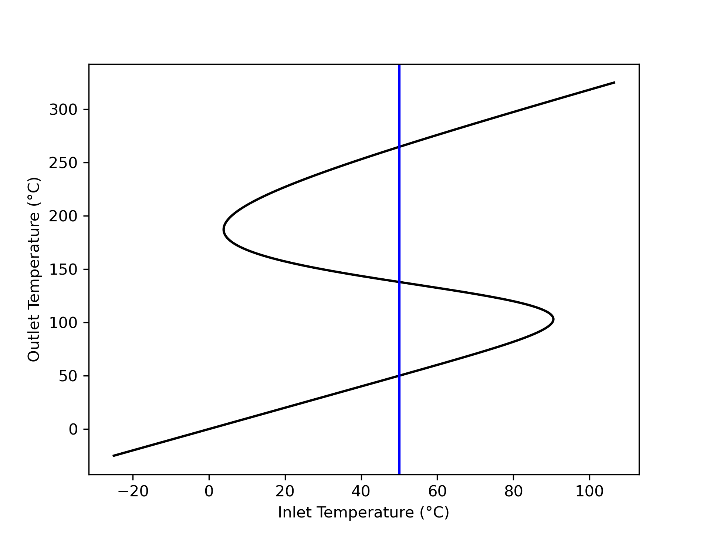{#fig-ch6_ex4_T_vs_Tin width="70%"}

Those approximate outlet temperatures, read from @fig-ch6_ex4_T_vs_Tin, were used as initial guesses to solve the steady-state CSTR design equation for a reactor with the specified feed temperature of 50 °C. The resulting steady states were found to occur at 50, 138, and 265 °C with conversions of 0.03%, 39.9%, and 97.5%, respectively. All three steady states are physically realistic. The steady states at 50 and 265 °C are expected to be stable, while that at 138 °C is expected to be unstable.

@fig-ch6_ex4_T_vs_Tin shows the inlet temperature increases steadily from low temperature until it reaches an ignition point at 90.5 °C, where it begins decreasing. It continues to decrease until it reaches an extinction point at 3.9 °C, where it again begins increasing. [Example -@sec-ch6_ex6] examines the stability of the steady states using their transient response to small perturbations of the reactor's outlet temperature.

**Deliverables**

Three steady states are possible for the specified CSTR. They have outlet temperatures of 50, 138, and 265 °C, and corresponding conversions of 0.03%, 39.9%, and 97.5%, respectively.

### Start-Up of a CSTR{#sec-ch6_ex5}

A 10 gal CSTR with a 1.25 gal shell is going to be used for the conversion of A and B according to reactions (1), (2), and (3). Both the reactor and the shell are perfectly mixed. Before flow into the reactor begins, it is full and contains a solution containing only B at a concentration of 3 mol gal^-1^ and a temperature of 20 °C, while the shell contains cooling water at 20 °C. To start up the reactor, 0.5 gal min^-1^ of a feed consisting of a liquid solution of A (7.5 mol gal^-1^) and B (3 mol gal^-1^) at 50 °C starts flowing into the reactor and simultaneously cooling water at 20 °C starts flowing into the shell at a rate of 250 g min^-1^. The heat transfer coefficient between the reactor and the shell is 190 cal ft^-2^ min^-1^ K^-1^ and the heat transfer area is 4 ft^2^. The entire process operates at a constant pressure of 1 atm.

$$
A + B \rightarrow W + Z \tag{1}
$$

$$
A + B \rightarrow X + Z \tag{2}
$$

$$
A + B \rightarrow Y + Z \tag{3}
$$

Each of the reactions is first order in the concentration of A and first order in the concentration of B. The pre-exponential factors, activation energies and heats of reaction are listed in the table below. The heats of reaction may be taken to be constant. The cooling water has a constant density of 1 g cm^-3^ and a constant heat capacity of 1 cal g^-1^ K^-1^. The reacting fluid may be assumed to have a constant heat capacity of 1600 cal gal^-1^ K^-1^.

Plot the temperature of the reacting fluid, the temperature of the cooling water in the jacket, and the concentration of B in the reactor during the first 30 minutes of the start-up process.

| Reaction | k~0~ (gal mol^-1^ min^-1^) | E (kcal mol^-1^) | $\Delta H$ (kcal mol^-1^) |
|:----:|:----:|:----:|:----:|
| 1 | 4.3 x 10^8^ | 14.2 | -11.0 |
| 2 | 2.7 x 10^8^ | 16.1 | -11.6 |
| 3 | 3.9 x 10^8^ | 14.8 | -12.1 |

: Reaction Data {#tbl-ch6_ex5_data}

---

:::{.callout-tip collapse="true"}
## Click Here to See What an Expert Might be Thinking at this Point

The reactor to be modeled is a non-isothermal, liquid-phase CSTR. It is being started up, so its operation is transient. The reacting fluid volume and other extensive properties are specified, so a basis may not be chosen. The deliverables are graphs, but they can be generated by solving the transient design equations once, making it unnecessary to select a quantity to use as parameter.

Rate expressions for the reactions are not provided as equations, but the narrative says each reaction is first order in the concentration of A and first order in the concentration of B. Pre-exponential factors and activation energies are provided, indicating Arrhenius temperature dependence. I'll write the rate expressions as equations and in terms of the Arrhenius parameters as I summarize the assignment.

In the assignment summary I'll use a subscripted "in" to denote values at the inlet and a subscripted "0" to denote values at the instant the flows into the reactor start.

:::

**Assignment Summary**

[Reactions]{.underline}:

$$
A + B \rightarrow W + Z \tag{1}
$$

$$
A + B \rightarrow X + Z \tag{2}
$$

$$
A + B \rightarrow Y + Z \tag{3}
$$

[Rate Expressions]{.underline}:

$$
r_1 = k_{1,0}\exp{\left(\frac{-E_1}{RT}\right)}C_AC_B \tag{4}
$$

$$
r_2 = k_{2,0}\exp{\left(\frac{-E_2}{RT}\right)}C_AC_B \tag{5}
$$

$$
r_3 = k_{3,0}\exp{\left(\frac{-E_3}{RT}\right)}C_AC_B \tag{6}
$$

[Reactor]{.underline}: Non-isothermal, liquid-phase, transient CSTR

[Given Constants]{.underline}: $V$ = 10 gal, $V_{ex}$ = 1.25 gal, $C_{B,0}$ = 3 mol gal^-1^, $T_0$ = (20 + 273.15) K, $\dot V_{in}$ = 0.5 gal min^-1^, $C_{A,in}$ = 7.5 mol gal^-1^, $C_{B,in}$ = 3 mol gal^-1^, $T_{in}$ = (50 + 273.15) K, $T_{ex,0}$ = $T_{ex,in}$ = = (20 + 273.15) K, $\dot m_{ex,in}$ = 250 g min^-1^, $U$ = 190 cal ft^-2^ min^-1^ K^-1^, $A$ = 4 ft^2^, $P$ = 1 atm, $\rho_{ex}$ = 1 g cm^-3^, $\tilde C_{p,ex}$ = 1 cal g^-1^ K^-1^, $\breve C_p$ = 1600 cal gal^-1^ K^-1^, $k_{0,j}$ in @tbl-ch6_ex5_data, $E_j$ in @tbl-ch6_ex5_data, $\Delta H_j$ in @tbl-ch6_ex5_data, and $t_f$ = 30 min.

[Deliverables]{.underline}: $\underline{T}$, $\underline{T}_{ex}$, and $\underline{C}_B$ *vs.* $\underline{t}$ as graphs.

**Formulation of the Equations**

:::{.callout-tip collapse="true"}
## Click Here to See What an Expert Might be Thinking at this Point

The reactor to be modeled is a transient, non-isothermal CSTR. I need to select and simplify the reactor design equations. I'll include mole balances on every reagent in the system. Neither the reacting fluid temperature nor the exchange fluid temperature s known, so I also need to include an energy balance on the reacting fluid and an energy balance on the exchange fluid.

The general form of the transient CSTR mole balance is given in @eq-gen_cstr_mol_bal. This reactor is full at the start of the transient, and a steady flow of liquid into the reactor is maintained throughout. Assuming the liquid to be an incompressible, ideal solution, this means that the reacting fluid volume and the outlet volumetric flow rate are both constant. Because they are constant, their time derivatives are equal to zero. Only A and B flow into the reactor so $\dot{n}_{W,in}$, $\dot{n}_{X,in}$, $\dot{n}_{Y,in}$, and $\dot{n}_{Z,in}$ are equal to zero. There are three reactions taking place, so the summation expands to three terms.

$$
\frac{V}{\dot V}\frac{d \dot n_i}{dt} + \frac{\dot n_i}{\dot V}\cancelto{0}{\frac{dV}{dt}} - \frac{\dot n_iV}{\dot V^2}\cancelto{0}{\frac{d \dot V}{dt}} = \dot n_{i,in} - \dot n_i + V \cancelto{\nu_{i,1}r_1 + \nu_{i,2}r_2 + \nu_{i,3}r_3}{\sum_j \nu_{i,j}r_j}
$$

The general form of the transient energy balance on the reacting fluid in a CSTR is given in @eq-gen_cstr_energy_bal. As previously noted, the time derivative of the reacting fluid volume is zero. The pressure is also constant, so its time-derivative is also zero. There are no shafts or moving boundaries that do work, so $\dot{W}$ is also equal to zero.

$$
\begin{split}
\frac{V}{\dot V}\sum_i \left( \dot n_i \hat C_{p,i}  \right) &\frac{dT}{dt} - V \cancelto{0}{\frac{dP}{dt}} - P\cancelto{0}{\frac{dV}{dt}} = \dot Q - \cancelto{0}{\dot W} \\&- \sum_i\dot n_{i,in} \int_{T_{in}}^T \hat C_{p,i}dT - V\sum_j r_j \Delta H_j
\end{split}
$$

The volumetric heat capacity of the reacting fluid as a whole is given, so it can be used in place of the molar heat capacities and the integrals can be evaluated. Again, the final summation expands to three terms, one for each of the three reactions.

$$
\begin{align}
\frac{V}{\dot V}\cancelto{\dot{V}\breve{C}_p}{\sum_i \left( \dot n_i \hat C_{p,i}  \right)} &\frac{dT}{dt} = \dot Q - \cancelto{\dot{V}\breve{C}_p\left(T - T_{in}\right)}{\sum_i\dot n_{i,in} \int_{T_{in}}^T \hat C_{p,i}dT} \\&- V\cancelto{r_1 \Delta H_1 + r_2 \Delta H_2 + r_3 \Delta H_3}{\sum_j r_j \Delta H_j}
\end{align}
$$

In this system, the cooling water gains sensible heat from the reacting fluid, so the general form of the exchange fluid energy balance is given by @eq-exchange_energy_bal_sensible. The exchange fluid heat capacity is constant, making it easy to evaluate the integral.

$$
\rho_{ex} V_{ex} \tilde C_{p,ex}\frac{dT_{ex}}{dt} = -\dot Q - \dot m_{ex} \int_{T_{ex,in}}^{T_{ex}} \tilde C_{p,ex}dT
$$

These eight reactor design equations are IVODEs. They contain eight dependent variables, so there is no need to add an IVODE or eliminate a dependent variable. Since I'll be solving them numerically, I'll write them in the form of derivative expressions (see [Appendix -@sec-apxd_ivodes]).

:::

[Reactor Model Equations]{.underline}

$$
\frac{d\dot n_A}{dt} = \frac{\dot V}{V}\left(\dot n_{A,in} - \dot n_A - V\left(r_1 + r_2 + r_3\right)\right) \tag{7}
$$

$$
\frac{d\dot n_B}{dt} = \frac{\dot V}{V}\left(\dot n_{B,in} - \dot n_B - V\left(r_1 + r_2 + r_3\right)\right) \tag{8}
$$

$$
\frac{d\dot n_W}{dt} = \frac{\dot V}{V}\left(- \dot n_W + Vr_1\right) \tag{9}
$$

$$
\frac{d\dot n_Z}{dt} = \frac{\dot V}{V}\left(- \dot n_Z + V\left(r_1 + r_2 + r_3\right)\right) \tag{10}
$$

$$
\frac{d\dot n_X}{dt} = \frac{\dot V}{V}\left(- \dot n_X + Vr_2\right) \tag{11}
$$

$$
\frac{d\dot n_Y}{dt} = \frac{\dot V}{V}\left(- \dot n_Y + Vr_3\right) \tag{12}
$$

$$
\frac{dT}{dt} = \frac{\dot{Q} - \dot V_{in} \breve C_p \left(T - T_{in}\right) - V \left( r_1\Delta H_1 + r_2\Delta H_2 + r_3\Delta H_3 \right)}{V \breve C_p } \tag{13}
$$

$$
\frac{dT_{ex}}{dt} = \frac{-\dot Q - \dot m_{ex} \tilde C_{p,ex} \left( T_{ex} - T_{ex,in} \right)}{\rho_{ex} V_{ex }\tilde C_{p,ex}} \tag{14}
$$

:::{.callout-tip collapse="true"}
## Click Here to See What an Expert Might be Thinking at this Point

The reactor design equations are IVODEs. As such, they will be solved to find corresponding sets of values of the independent variable, $t$, and the dependent variables, $\dot{n}_A$, $\dot{n}_B$, $\dot{n}_W$, $\dot{n}_X$, $\dot{n}_Y$, $\dot{n}_Z$, $T$, and $T_{ex}$. To solve the design equations I need values for every other unknown quantity that appears in them. Examining them I see that the inlet molar flow rates of A and B, the rates of the three reactions, and the rate of heat exchange are additional unknowns. The inlet molar flow rates can be calculated using the given inlet concentrations and volumetric flow rate. The rates can be calculated using the rate expressions, but that introduces the concentrations of A and B as additional unknowns. The concentrations can be calculated using the defining equation for concentration in a flow system, but doing so introduces the outlet volumetric flow rate which is also unknown. In this system, the reactor is full at all times. Assuming the reacting liquid to be an incompressible ideal mixture, that means that the outlet volumetric flow rate will equal the inlet volumetric flow rate. The rate of heat transfer can be calculated using the given heat transfer coefficient and area. 

:::

[Reactor Model Variables]{.underline}: $\underline{t}$, $\underline{\dot{n}}_A$, $\underline{\dot{n}}_B$, $\underline{\dot{n}}_W$, $\underline{\dot{n}}_X$, $\underline{\dot{n}}_Y$, $\underline{\dot{n}}_Z$, $\underline{T}$, and $\underline{T}_{ex}$

[Additional Computable Unknowns]{.underline}: $\dot{n}_{A,in}$, $r_1$, $r_2$, $r_3$, $C_A$, $C_B$, $\dot{V}$, $\dot{n}_{B,in}$, and $\dot{Q}$

$$
\dot n_{i,in} = \dot V_{in}C_{i,in} \qquad i = A \text{ and } B \tag{15}
$$

$$
r_1 = k_{0,1}\exp{\left(\frac{-E_1}{RT}\right)}C_AC_B \tag{4}
$$

$$
r_2 = k_{0,2}\exp{\left(\frac{-E_2}{RT}\right)}C_AC_B \tag{5}
$$

$$
r_3 = k_{0,3}\exp{\left(\frac{-E_3}{RT}\right)}C_AC_B \tag{6}
$$

$$
C_i = \frac{\dot n_i}{\dot V} \qquad i = A \text{ and } B \tag{16}
$$

$$
\dot V = \dot V_{in} \tag{17}
$$

$$
\dot Q = UA\left(T_e - T\right) \tag{18}
$$

:::{.callout-tip collapse="true"}
## Click Here to See What an Expert Might be Thinking at this Point

The design equations are IVODEs and I'll solve them numerically (see [Appendix -@sec-apxd_ivodes]). To do so I must provide initial values for all of the variables, a stopping criterion, and a derivatives function. I can define $t=0$ to be the instant that the flows start. The initial values are then equal to the outlet molar flow rates and temperatures at that instant. Initially the reactor contains only B, so when the flow starts that is the only reagent flowing out of the reactor. Its initial outlet flow rate can be calculated from its known initial concentration in the reactor and the outlet volumetric flow rate. Since there is no A, W, X, Y, or Z in the reactor at that instant, their initial outlet flow rates are zero. Similarly, at the instant the flows start the reacting fluid and the exchange fluid are both at a temperature of 20 °C, so the instant the flow starts, that will be the outlet temperature of both fluids.

The assignment requests graphs of the reacting fluid temperature, exchange fluid temperature and concentration of B over the first thirty minutes of operation. As such, the stopping criterion is that $t = t_f$.

The derivatives function must accept values of the independent and dependent variables at the start of an integration step as its only arguments and return the values of the derivatives. To do so, the values of the independent and dependent variables at the start of an integration step and be used to calculate the additional computable unknowns using the equations given above. Then the derivatives can be evaluated using the reactor design equations and returned.

Solving the design equations will yield corresponding sets of values of the independent and dependent variables spanning times from $t=0$ to $t=t_f$. The reacting fluid temperature and exchange fluid temperature can then be plotted as functions of time. The concentration of B over time can be calculated using the defining equation for concentration in a flow system, and then plotted.

:::

[IVODE Solver Inputs]{.underline}:

1. Initial values shown in @tbl-ch6_ex5_initial_values.
2. Stopping criterion that $t$ equals the final valueshown in @tbl-ch6_ex5_initial_values.
3. Derivatives function that
	a. receives values of the independent and dependent variables at the start of an integration step
	b. calculates the additional computable unknowns, and
	c. evaluates and returns the derivatives.

| Variable | Initial Value | Final Value |
|:------:|:-------:|:-------:|
| $t$ | $0$ | $t_f$ |
| $\dot{n}_A$ | 0 | |
| $\dot{n}_B$ | $\dot{n}_{B,0} = C_{B,0} \dot{V}$ | |
| $\dot{n}_W$ | 0 | |
| $\dot{n}_X$ | 0 | |
| $\dot{n}_Y$ | 0 | |
| $\dot{n}_Z$ | 0 | |
| $T$ | $T_0$ | |
| $T_{ex}$ | $T_{ex,0}$ | |
  
: Initial and final values of the design equation variables. {#tbl-ch6_ex5_initial_values}

[Deliverables Equations]{.underline}:

$$
\underline{C}_B = \frac{\underline{\dot{n}}_B}{\dot{V}} \tag{19}
$$

**Implementation of the Calculations**

Computer code to perform the calculations can be written using a variety of programming languages and environments, and the actual code can be structured in a variety of ways. Referring to the preceding assignment summary, computational strategy and formulation of the equations, here are the essential things the computer code must do, irrespective of the programming language and environment that is used.

1. Make the given and known constants available wherever they are needed.
2. Define the derivatives function.
3. Define the initial values and stopping criterion.
4. Call an IVODE solver.
	a. pass the initial values, stopping criterion, and derivatives function as arguments
	b. receive the reactor model variables which will include corresponding sets of values of the elapsed time, reacting fluid temperature, and exchange fluid temperature
5. Calculate a corresponding set of values of the concentration of B
6. Generate graphs showing $\underline{T}$, $\underline{T}_{ex}$, and $\underline{C}_B$ *vs.* $\underline{t}$

**Results and Discussion**

The calculations were performed as described above. The reacting fluid temperature, exchange fluid temperature and concentration of B during the first 30 min of startup are shown in Figures [-@fig-ch6_ex5_T_vs_t], [-@fig-ch6_ex5_Te_vs_t], and [-@fig-ch6_ex5_CB_vs_t]. There are no undesired temperature excursions, and all three quantities appear to be approaching steady-state after 30 minutes. Specifically the reacting fluid temperature is approximately 58 °C, the exchange fluid, 48 °C, and the concentration of B, 0.2 mol gal^-1^. 

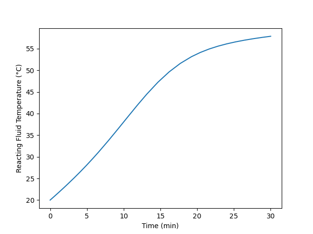{#fig-ch6_ex5_T_vs_t width="80%"}

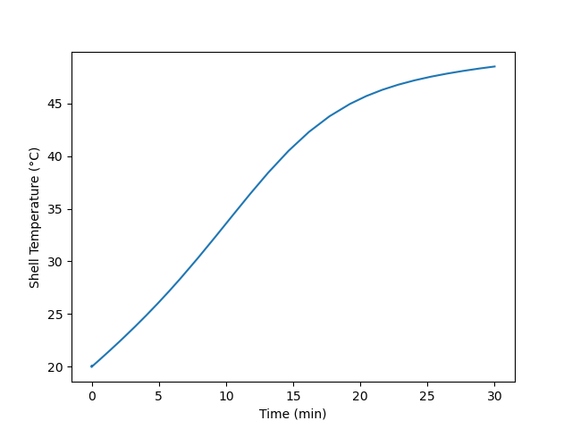{#fig-ch6_ex5_Te_vs_t width="80%"}

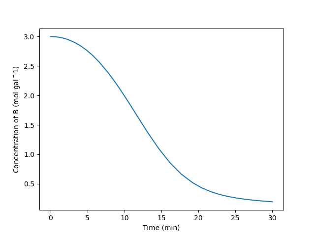{#fig-ch6_ex5_CB_vs_t width="80%"}

There are many ways to start-up a reactor. Here the reactor was filled with one reactant and the feed flow was initiated. Another option would be to charge the reactor with the feed and let it react in BSTR mode until the composition and temperature are near their steady-state values, and then start the flow. The start-up procedure that is ultimately used will likely be chosen, at least in part, on the basis of economics. For example, in this assignment the reactor operated for 30 minutes and still hadn't quite reached steady-state. During that time it was not producing the intended product. If there is no use for that partially reacted product, or if the reactants are relatively expensive, the alternative method described above might be preferred because it wastes less feed and generates less partially reacted product.

**Deliverables**

The startup procedure does not cause any undesirable temperature behavior. After 30 min the the reactor appears to be close to steady-state with a reacting fluid temperature of 58 °C, an exchange fluid temperature of 48 °C and a concentration of B of 0.2 mol gal^-1^. 

### Perturbations from an Unstable Steady State and Sensitivity Near Ignition and Extinction Points{#sec-ch6_ex6}

[Example -@sec-ch6_ex4] showed conditions where three steady states are possible when reaction (1) takes place in an adiabatic CSTR. Specifically, the reactor volume is 500 cm^3^ and the feed is 1.0 cm^3^ s^-1^ of a solution containing 0.015 mol cm^-3^ each of A and B at 50 °C. The heat capacity is 0.35 cal g^-1^ K^-1^, and the density is 0.93 gm cm^-3^. The heat of reaction is -20 kJ mol^-1^, and the rate is given by equation (2) with the pre-exponential factor equal to 3.24 x 10^12^ cm^3^ mol^-1^ s^-1^ and the activation energy equal to 105.0 kJ mol^-1^. The steady-state conversions were 0.03, 39.9, and 97.5%, and the corresponding outlet temperatures were 50, 183, and 265 °C.

$$
A + B \rightarrow Y + Z \tag{1}
$$

$$
r_1 = k_1C_AC_B \tag{2}
$$

The outlet temperature for this reactor was plotted as a function of the feed temperature in @fig-ch6_ex4_T_vs_Tin. That graph is reproduced here as @fig-ch6_ex6_initial_steady_states, with three steady states labeled "S~high~," "U~mid~," and "S~low~" Steady states S~high~ (97.5% conversion) and S~low~ (0.03% conversion) are stable while steady state U~mid~ (39.3% conversion) is unstable. 

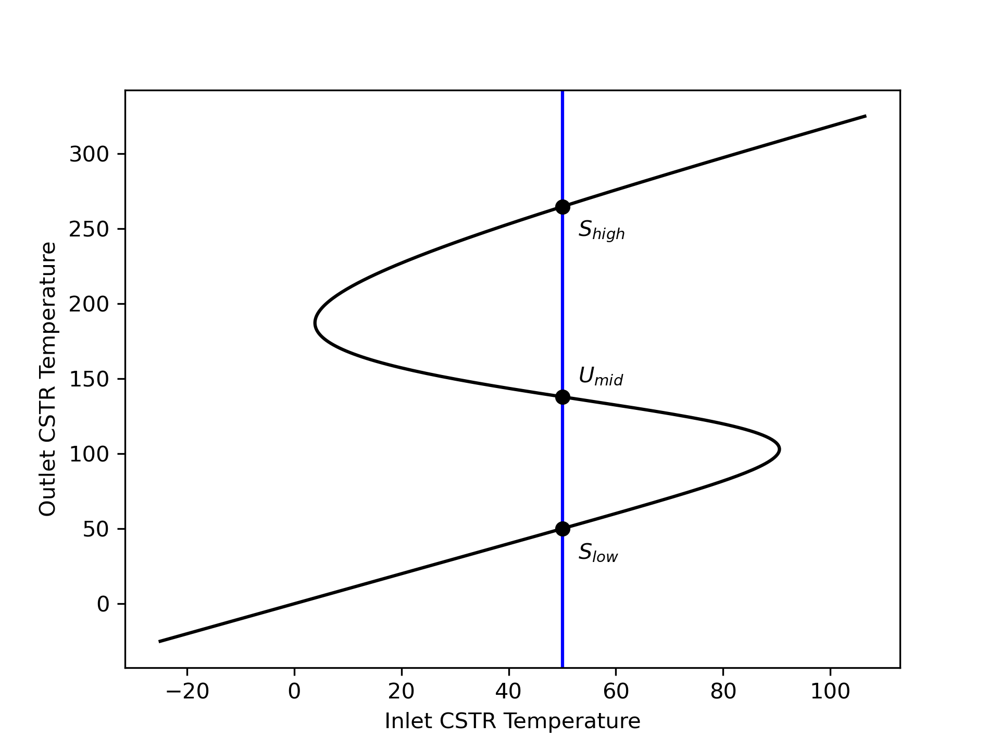{#fig-ch6_ex6_initial_steady_states width="80%"}

To show that steady state U~mid~ is unstable, plot the outlet temperature *vs*. time if the temperature of a CSTR at steady state U~mid~ is perturbed +1 °C, and by -1 °C holding all of the inputs constant. To show the two other steady states are stable, plot the outlet temperature *vs*. time if the temperature of a CSTR at each of those steady states is perturbed +20 °C, and by -20 °C holding all of the inputs constant.

---

:::{.callout-tip collapse="true"}
## Click Here to See What an Expert Might be Thinking at this Point

The reactor is an adiabatic, liquid-phase CSTR wherein the reacting fluid temperature is suddenly changed. Following the change, the reactor will operate in transient mode until it stabilizes at a steady state. Values of extensive quantities, such as the reacting fluid volume, are specified, so a basis cannot be chosen. The deliverables are graphs, but the data for plotting them can be generated by solving the transient design equations once for each perturbation. That means it is not necessary to select a quantity to use as parameter.

I'll begin by summarizing the assignment. For the reactor variables I'll use the usual symbols. For the steady-state conversions and reacting fluid temperatures I'll add "ss,low," "ss,mid," and "ss,high" to differentiate the three values. I'll use $\Delta T_s$ to represent the perturbation for the stable steady states and $\Delta T_u$ for the unstable steady state.

:::

**Assignment Summary**

[Reaction]{.underline}:

$$
A + B \rightarrow Y + Z \tag{1}
$$

[Rate Expression]{.underline}:

$$
r_1 = k_1C_AC_B \tag{2}
$$

[Reactor]{.underline}: Adiabatic, liquid-phase, transient CSTR

[Given Constants]{.underline}: $V$ = 500 cm^3^, $\dot{V}_{in}$ = 1.0 cm^3^ s^-1^, $C_{A,in}$ = 0.015 mol cm^-3^, $C_{B,in}$ = 0.015 mol cm^-3^, $T_{in,u}$ = 50 °C, $\tilde{C}_p$ = 0.35 cal g^-1^ K^-1^, $\rho$ = 0.93 gm cm^-3^, $\Delta H_1$ = -20 kJ mol^-1^, $k_{0,1}$ = 3.24 x 10^12^ cm^3^ mol^-1^ s^-1^, $E_1$ = 105.0 kJ mol^-1^, $f_{A,low}$ = 0.0003, $f_{A,mid}$ = 0.399, $f_{A,ss,high}$ = 0.975, $T_{low}$ = 50 °C, $T_{mid}$ = 183 °C, $T_{high}$ = 265 °C, $\Delta T_s$ = 20 °C, and $\Delta T_u$ = 1.0 °C.

[Deliverables]{.underline}: $\underline{t}$ *vs.* $\underline{T}$ following ± 1 °C perturbations from the U~mid~ steady state and ± 20 °C perturbations form the S~high~ and S~low~ steady states.

**Formulation of the Equations**

:::{.callout-tip collapse="true"}
## Click Here to See What an Expert Might be Thinking at this Point

This analysis involves a transient, liquid-phase, adiabatic CSTR. To model it I will need mole balances and an energy balance on the reacting fluid. There isn't an exchange fluid in an adiabatic reactor, so an exchange fluid energy balance is not needed. I'll write mole balances for every reagent in the system since I'm solving them analytically.

The general form of the transient CSTR mole balance is given in @eq-gen_cstr_mol_bal. Following a perturbation, the inlet volumetric flow rate and the reacting fluid volume do not change, so their time derivatives are equal to zero. Only A and B flow into the reactor, so $\dot{n}_{Y,in}$ and $\dot{n}_{Z,in}$ will equal zero. There is one reaction, so the summation reduces to a single term.

$$
\frac{V}{\dot V}\frac{d \dot n_i}{dt} + \frac{\dot n_i}{\dot V}\cancelto{0}{\frac{dV}{dt}} - \frac{\dot n_iV}{\dot V^2}\cancelto{0}{\frac{d \dot V}{dt}} = \dot n_{i,in} - \dot n_i + V \cancelto{\nu_{i,1}r_1}{\sum_j \nu_{i,j}r_j}
$$

The general form of the transient CSTR reacting fluid energy balance is presented in @eq-gen_cstr_energy_bal. As already noted, the reacting fluid volume is constant and its derivative is zero. The same is true of the pressure. Furthermore there is no heat exchange and negligible work.

$$
\begin{split}
\frac{V}{\dot V}\sum_i \left( \dot n_i \hat C_{p,i}  \right) &\frac{dT}{dt} - V \cancelto{0}{\frac{dP}{dt}} - P\cancelto{0}{\frac{dV}{dt}} = \cancelto{0}{\dot Q }- \cancelto{0}{\dot W} \\&- \sum_i\dot n_{i,in} \int_{T_{in}}^T \hat C_{p,i}dT - V\sum_j r_j \Delta H_j
\end{split}
$$

The sensible heats can be expressed in terms of the given gravimetric heat capacity. That heat capacity is constant. It can be taken outside of the integral, and the integral can be evaluated. The summation over the reactions reduces to a single term.

$$
\frac{V}{\dot V}\cancelto{\dot{V}\rho\tilde{C}_p}{\sum_i \left( \dot n_i \hat C_{p,i}  \right)} \frac{dT}{dt} = - \cancelto{\tilde{C}_p \rho \dot{V}_{in}\left( T - T_{in}\right)}{\sum_i\dot n_{i,in} \int_{T_{in}}^T \hat C_{p,i}dT} - V\cancelto{r_1 \Delta H_1}{\sum_j r_j \Delta H_j}
$$

I'm going to solve these IVODEs numerically, so they need to be written in the form of derivative expressions (see [Appendix -@sec-apxd_ivodes]). The mole balances can be written as derivative expression by multiplying both sides of the equations by $\dot{V}$ and dividing by $V$. The energy balance can be written as a derivative expression by dividing both sides by $V\tilde{C}_p\rho$.

:::

[Reactor Model Equations]{.underline}

$$
\frac{d \dot{n}_A}{dt} = \frac{\dot{V}_{in}}{V}\left(\dot{n}_{A,in} - \dot{n}_A - V r_1\right) \tag{3}
$$

$$
\frac{d \dot{n}_B}{dt} = \frac{\dot{V}_{in}}{V}\left(\dot{n}_{B,in} - \dot{n}_B - V r_1\right) \tag{4}
$$

$$
\frac{d \dot{n}_Y}{dt} = \frac{\dot{V}_{in}}{V}\left( - \dot{n}_Y + V r_1\right) \tag{5}
$$

$$
\frac{d \dot{n}_Z}{dt} = \frac{\dot{V}_{in}}{V}\left( - \dot{n}_Z + V r_1\right) \tag{6}
$$

$$
\frac{dT}{dt} = \frac{ - \tilde{C}_p \rho \dot{V}_{in} \left( T - T_{in}\right) - V r_1 \Delta H_1}{V\tilde{C}_p \rho} \tag{7}
$$

:::{.callout-tip collapse="true"}
## Click Here to See What an Expert Might be Thinking at this Point

The design equations are IVODEs, so solving them will yield sets of values of the independent and dependent variables, in this case $\underline{t}$, $\underline{\dot{n}}_A$, $\underline{\dot{n}}_B$, $\underline{\dot{n}}_Y$, $\underline{\dot{n}}_Z$, and $\underline{T}$. In order to solve the design equations, I need values for every other unknown that appears in them. Reading through the equations I see that the additional unknowns they contain are the inlet molar flow rates of A and B and the reaction rate. 

The inlet molar flow rates can be calculated from the inlet volumetric flow rate and the inlet concentrations. A rate expression is provided for calculating the rate, but it introduces the rate coefficient and the concentrations of A and B as additional unknowns. They can be calculated using the defining equation for concentration in an open system. That introduces the outlet volumetric flow rate as the last additional unknown. Here the reacting fluid volume is constant, so assuming the reacting liquid to be an incompressible ideal mixture, the outlet volumetric flow rate equals the inlet volumetric flow rate.

:::
[Reactor Model Variables]{.underline}: $\underline{t}$, $\underline{\dot{n}}_A$, $\underline{\dot{n}}_B$, $\underline{\dot{n}}_Y$, $\underline{\dot{n}}_Z$, and $\underline{T}$.

[Additional Computable Unknowns]{.underline}: $\dot{n}_{A,in}$, $r_1$, $k_1$, $C_A$, $C_B$, $\dot{V}$, and $\dot{n}_{B,in}$

$$
\dot{n}_{i,in} = \dot{V}_{in} C_{i,in} \qquad i = A \text{ and } B \tag{8}
$$

$$
r_1 = k_1C_AC_B \tag{2}
$$

$$
k_1 = k_{0,1} \exp{\left( \frac{-E_1}{RT} \right)} \tag{9}
$$

$$
C_i = \frac{\dot n_i}{\dot{V}} \qquad i = A \text{ and } B \tag{10}
$$

$$
\dot{V} = \dot{V}_{in} \tag{11}
$$

:::{.callout-tip collapse="true"}
## Click Here to See What an Expert Might be Thinking at this Point

The design equations are IVODEs and I'll solve them numerically (see [Appendix -@sec-apxd_ivodes]). To do so I must provide initial values for all of the variables, a stopping criterion, and a derivatives function. I can define $t=0$ to be the instant that the reacting fluid temperature is perturbed. The initial values are then equal to the outlet molar flow rates and temperatures at that instant. Just before the perturbation the reactor is operating at one of the specified steady states, so the initial values of the dependent variables will be their values at that steady state. Specifically, the steady-state conversion can be used to calculate the initial outlet molar flows, and the initial reacting fluid temperature will equal the steady-state temperature plus the perturbation.

Initially, I'll guess that the transients will be close to a steady state after 30 min and use that as the stopping criterion. If the transients reach steady state much sooner or don't reach a steady state, I'll need to adjust this value.

The only arguments that can be passed to the derivatives function are the values of the independent and dependent variables at the start of an integration step. Using them, the additional computable unknowns can be calculated using the equations given above. Then the derivatives can be evaluated using the reactor design equations and returned.

Solving the design equations will yield the quantities to be plotted, so no further calculations are needed to find the requested deliverables.

:::

[IVODE Solver Inputs]{.underline}:

1. Initial values shown in @tbl-ch6_ex6_initial_values where $x$ equals "low," "mid," or "high," depending on the steady state being analyzed, $y$ equals $s$ or $u$ depending on whether that steady state is stable or unstable, respectively, and $\Delta T_y$ is added when a positive perturbation is being analyzed and subtracted when a negative perturbation is being analyzed.
2. Final value of $t$ shown in @tbl-ch6_ex6_initial_values as the stopping criterion.
3. Derivatives function that
	a. receives values of the independent and dependent variables at the start of an integration step
	b. calculates the additional computable unknowns, and
	c. evaluates and returns the derivatives.

| Variable | Initial Value | Final Value |
|:------:|:-------:|:-------:|
| $t$ | $0$ | $t_f$ = 30 min |
| $\dot{n}_A$ | $\dot{n}_{A,in} - f_{A,ss,x} \dot{n}_{A,in}$ | |
| $\dot{n}_B$ | $\dot{n}_{B,in} - f_{A,ss,x} \dot{n}_{A,in}$ | |
| $\dot{n}_Y$ | $f_{A,ss,x} \dot{n}_{A,in}$ | |
| $\dot{n}_Z$ | $f_{A,ss,x} \dot{n}_{A,in}$ | |
| $T$ | $T_{ss,x} ± \Delta T_y$ | |
  
: Initial and final values of the design equation variables. {#tbl-ch6_ex6_initial_values}

**Implementation of the Calculations**

Computer code to perform the calculations can be written using a variety of programming languages and environments, and the actual code can be structured in a variety of ways. Referring to the preceding assignment summary, computational strategy and formulation of the equations, here are the essential things it must do.

1. Make the given constants available wherever they are needed.
2. Define the derivatives function.
3. Loop through the three steady states
	a. Define the initial values and stopping criterion for the positive perturbation
	b. Call an IVODE solver
		i. pass the initial values, stopping criterion and derivatives function as arguments.
		ii. receive the reactor model variables which will include corresponding sets of values of elapsed time and reacting fluid temperature and save them for plotting
	c. Define the initial values and stopping criterion for the negative perturbation.
	d. Call an IVODE solver as in step 3b.
4. Generate graphs showing $\underline{T}$ *vs.* $\underline{t}$ for positive and negative perturbations from each of the three steady states.

**Results and Discussion**

The calculations were performed as described above. @fig-ch6_ex6_unsteady shows the temperature as a function of time following perturbation from the unstable steady state by plus and minus 1 °C holding all of the inputs constant. Since none of the reactor inputs changed, the temperature would have returned to 138 °C had that been a stable steady state. Instead, the figure shows that following a 1 °C increase in the reacting fluid temperature, it continues to increase and stabilizes at the high temperature steady state. Following a 1°C decrease in the reacting fluid temperature, it continues to decrease and stabilizes at the low temperature steady state. This provides a rigorous confirmation of the argument made in @sec-ch6_stability that the middle temperature steady state is unstable.

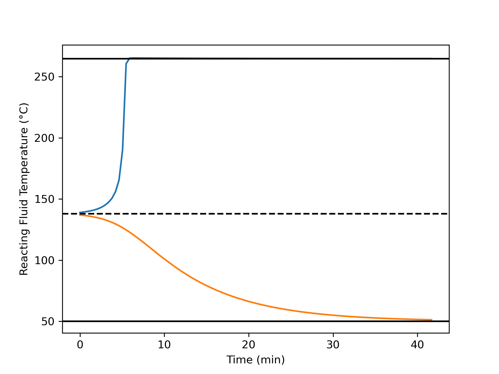{#fig-ch6_ex6_unsteady width="80%"}

For both the high temperature, @fig-ch6_ex6_high, and low temperature, @fig-ch6_ex6_low, steady states, following much larger perturbations of ± 20 °C the system returns to its original steady state. At the high temperature, the response briefly moves farther from the steady-state before reaching a maximum deviation and then returning to the steady state.

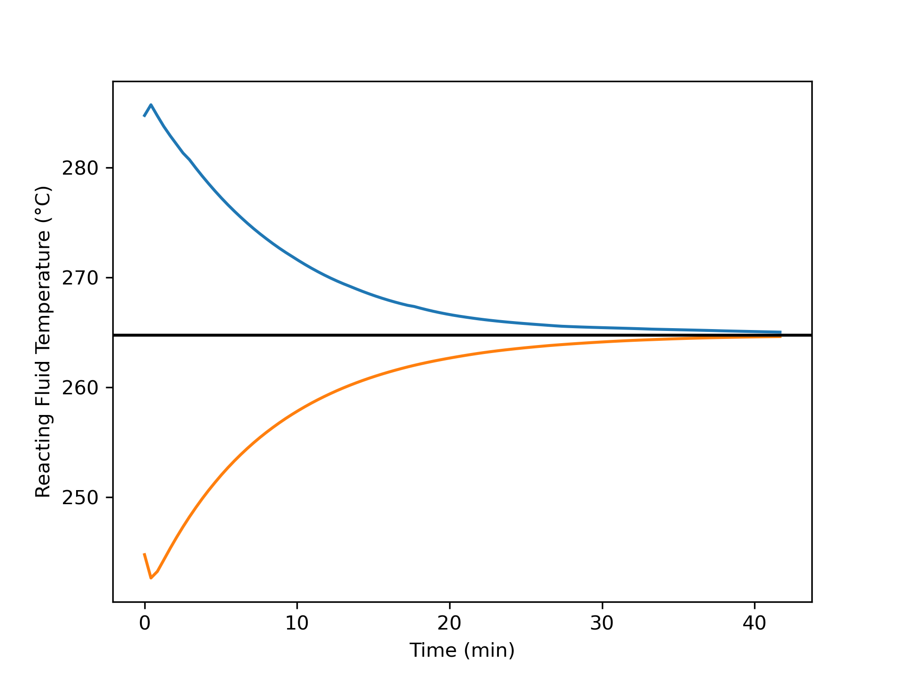{#fig-ch6_ex6_high width="80%"}

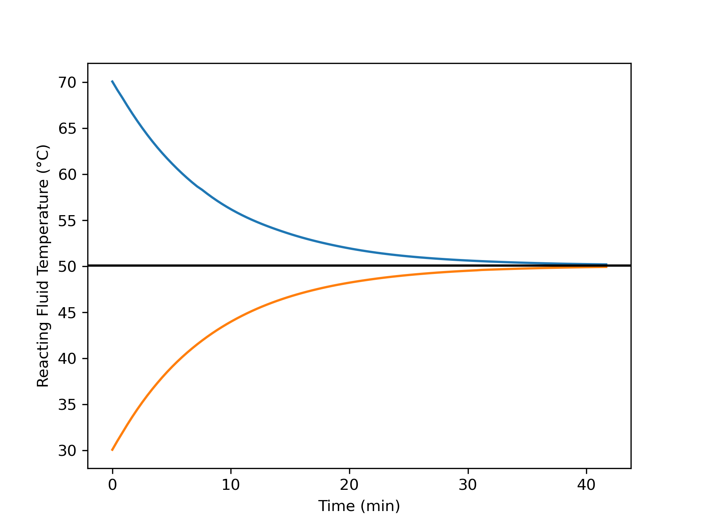{#fig-ch6_ex6_low width="80%"}

**Deliverables**

A 1°C change of the reacting fluid temperature from the unstable steady state initiates transient operation leading to one of the stable steady states. This shows confirms that the initial steady state is, indeed, unstable. In contrast, a 20 °C change of the eacting fluid temperature from either of the stable steady states initiates transient operation leading back to the original steady state, confirming that these initial steady states are stable.

## Symbols Used in [@sec-ch6]

| Symbol | Meaning |
|:-------|:--------|
| $i$ | Subscript denoting a fluid phase reagent. |
| $j$ | Subscript denoting a reaction occurring in the system. |
| $\dot m_{ex}$ | Mass flow rate of the exchange fluid. |
| $\dot n_i$ | Molar flow rate of reagent $i$; an additional subscripted "in" denotes the inlet value; an additional subscripted "out" denotes the outlet value. |
| $r_j$ | Net rate of reaction $j$ per unit volume of reacting fluid. |
| $t$ | Time. |
| $A$ | Heat transfer area. |
| $C_i$ | Concentration of reagent $i$; an additional subscripted "out" denotes the outlet value, "in" denotes the inlet value, or "0" denotes the initial value. |
| $\tilde C_{p,ex}$ | Mass-specific heat capacity of the exchange fluid. |
| $\tilde C_{p}$ | Mass-specific heat capacity of the reacting fluid. |
| $\breve C_{p,ex}$ | Volume-specific heat capacity of the exchange fluid. |
| $\breve C_{p}$ | Volume-specific heat capacity of the reacting fluid. |
| $\hat C_{p,ex}$ | Molar heat capacity of the exchange fluid. |
| $\hat C_{p,i}$ | Molar heat capacity of reagent $i$. |
| $M_{ex}$ | Molecular weight of the exchange fluid. |
| $P$ | Pressure of the reacting fluid. |
| $P_i$ | Partial pressure of reagent $i$. |
| $\dot Q$ | Rate of heat transfer from the exchange fluid to the reacting fluid. |
| $\dot{Q}_{abs}$ | Heat consumed in heating the reactor feed to the reactor outlet temperature. |
| $\dot{Q}_{gen}$ | Heat released by the occurence of the reaction or reactions. |
| $R$ | Ideal gas constant. |
| $T$ | Temperture of the reacting fluid; an additional subscripted "in" denotes the inlet value; an additional subscripted "0" denotes the initial value. |
| $T_{ex}$ | Temperature of the exchange fluid within the shell/jacket and at the outlet; an additional subscripted "in" denoes the inlet value. |
| $U$ | Heat transfer coefficient. |
| $V$ | Volume of reacting fluid within a reactor. |
| $\dot V$ | Volumetric flow rate of the reacting fluid; an additional subscripted "in" denotes the value at the inlet. |
| $V_{ex}$ | Volume of exchange fluid contained within the reactor shell/jacket. |
| $\dot W$ | Rate at which the reacting fluid does work on the surroundings via shafts, moving boundaries, etc. |
| $\gamma$ | Fraction of the exchange fluid that undergoes phase change. |
| $\epsilon$ | Residual that is equal to zero when evaluated using a solution to the corresponding ATE. |
| $\nu_{i,j}$ | Stoichiometric coefficient of reagent $i$ in reaction $j$. |
| $\rho$ | Density of the reacting fluid. |
| $\rho_{ex}$ | Density of the exchange fluid. |
| $\tau$ | Space time. |
| $\Delta H_j$ | Heat of reaction $j$. |
| $\Delta H_{\text{latent},ex}^0$ | Latent heat for the phase change the exchange fluid undergoes. |

: {tbl-colwidths="[20,80]"}
