# Generation and Analysis of Kinetics Data {#sec-ch11}

The first section of *Reaction Engineering Basics* considered chemical reactions and their rates. The second section examined the modeling and analysis of ideal reactors. This chapter shows how experimental data generated using an ideal reactor is used to estimate the unknown parameters that appear in rate expressions. It may prove helpful to read [Appendix -@sec-apxd_par_est] and the learning objectives in @sec-ch11_learning_objectives before reading this chapter.

## Rate Expression Development and Kinetics Data

If the rate of a reaction has been studied previously, an expression for the rate of that reaction may be available. When a rate expression is not available, it is necessary to develop one. Reaction rates depend upon temperature, pressure and composition. Temperature can be measured using thermometers or thermocouples. Pressure can be measured using manometers or a wide variety of pressure gauges. Fluid composition can be measured using gas chromatography, mass spectrometry or many other instruments. The same is not true for reaction rates. There isn't a meter, gauge, or instrument that one can put in or attach to a chemical reactor to directly measure the rate of the reaction or reactions going on within it. 

Since rates cannot be measured directly, changes in composition (or something related to composition) that occur in chemical reactors are measured instead. Herein, that measured quantity is referred to as the experimental response. The response is measured experimentally at different reactor temperatures, pressures and compositions, resulting in a set of experimental kinetics data. *Reaction Engineering Basics* only considers the generation and analysis of isothermal, single response kinetics data. Specifically, the experiments considered in *Reaction Engineering Basics*

* are isothermal
* have only one reaction taking place
* are at steady-state if the reactor is a flow reactor
* have negligible pressure drop if the reactor is a PFR
* involve the measurement of only one quantity as the response

### Procedure for Developing a Rate Expression

The following sequence of events is representative of the process for development of a rate expression for a reaction.

1. A preliminary analysis, perhaps including a few preliminary experiments, is performed to establish the range of conditions (temperature, pressure and composition) over which the rate expression will be used.
2. A laboratory reactor is selected to be used to generate kinetics data.
3. A set of kinetics experiments using that reactor is planned, and the experiments are performed to generate a kinetics data set.
4. A mathematical form is proposed for the rate expression and used to generate a model that predicts the response for an experiment.
5. The values of all unknown parameters appearing in the proposed rate expression are estimated by "fitting" that model to the experimental data set.
6. The accuracy of the proposed rate expression is assessed.
7. One of the following decisions is made.
    a. Accept the rate expression.
    b. Perform additional experiments and reassess the proposed rate expression using steps 5 through 7.
    c. Reject the proposed rate expression, propose another rate expression with a different mathematical form, and assess the new rate expression using steps 5 through 7.

The identification of the reaction and the preliminary analysis (step 1) can be driven by a variety of factors including a perceived business opportunity, regulatory mandates, etc. Chapters [-@sec-ch3] and [-@sec-ch4] describe how a mathematical form of the rate expression can be postulated empirically, theoretically, or mechanistically (step 4). Chapters [-@sec-ch5] through [-@sec-ch9] describe how to generate a reactor model that includes the proposed rate expression and predicts the response for an experiment (step 4). The emphasis here, then, is on generating the kinetics data (steps 2 and 3), estimating the rate expression parameters (step 5), and assessing its accuracy (steps 6 and 7).

### Design of Kinetics Experiments

The preliminary analysis establishes a range of temperature, pressure and composition that is suitable and appropriate for running the reaction. The purpose of kinetics experiments is to generate experimental data that span that range of temperature, pressure and composition with sufficient resolution to capture how temperature, pressure, and composition affect the rate.

The nature of kinetics experiments is relatively straightforward. In each experiment a group of reactor inputs are adjusted to pre-determined values. Those adjusted experimental input variables are referred to as *factors* when discussing the design of experiments. The person performing the experiment then measures the experimental response. Thus the data from one experiment consist of the values of the factors (adjusted experimental input variables) and the corresponding experimental, or measured, response. Performing many experiments then results in a kinetics data set. A kinetics data set can be thought of as a table where there is a column for each factor and a column for the measured response, and each row contains the values of those quantities for one of the experiments that was performed.

Before experiments begin it is necessary to select the type of reactor to be used and identify the response that will be measured in the experiments. The response should be some easily measurable quantity that is related to the change in the composition of the reacting fluid from the start of the experiment to the point when/where the response was measured. There are many possibilities including the outlet or final concentration of a reagent, the conversion of a reactant, an outlet or final mole fraction of a reagent, etc.

The response can also be a property that is related to the concentration of a reagent or the overall composition. For example, if one reagent absorbs radiation of a specific frequency, the transmission of radiation of that frequency through a fixed distance within the reacting fluid can be related to the reagent's concentration. Similarly, the refactive index of a liquid mixture may be related to its composition.

The next step in generating a kinetics data set is to decide which reactor inputs to use as factors. The factors should be chosen so that the resulting kinetics data set will span the desired range of temperature, pressure and composition. Kinetics data are typically generated using small, laboratory-scale reactors. Through the use of a temperature controller, it is usually possible to design the experimental reactor so that it will operate isothermally at a temperature chosen by the reactor operator. A temperature controller is a device that continually monitors the temperature of the reacting fluid and adjusts the amount of heating or cooling provided to the reactor so that the temperature remains constant at the chosen value. This makes temperature an obvious choice for one of the factors.

The pressure is also an obvious choice for one of the factors. For liquid-phase reactions the pressure often does not affect the rate and does not need to be adjusted. For gas phase reactions it usually is straightforward to adjust the initial system pressure in a BSTR from experiment to experiment. With CSTRs and PFRs, it is most often possible to set the inlet pressure and operate the reactor with negligible pressure drop.

The choice of factors related to the composition is less obvious. That is, there are several experimental inputs that can be adjusted to set the composition of the system. For isothermal gas-phase reactions, setting the initial or inlet pressure sets the total molar concentration, as can be seen from the ideal gas law, @eq-pressure_concentration_ideal_gas. Thus, one option is to use the initial or inlet pressure together with the initial or inlet mole fractions of the reagents present in the system as factors. An alternative would be to use the initial molar amounts or the inlet molar flow rates of the reagents as factors.

$$
C_{\text{total}} = \frac{n_{\text{total}}}{V} = \frac{P}{RT}
$${#eq-pressure_concentration_ideal_gas}

It is important to recognize that the composition will change as the reaction proceeds. This means that an additional way to vary the composition is by using the batch reaction time or the flow reactor space time as a factor. The most important consideration in choosing the factors that affect composition is to ensure that by varying the factors it is possible to span the entire range of compositions of interest identified in the preliminary analysis. Whatever composition-related factors are used, it is important to vary the amounts of reactants [and products]{.underline} when performing kinetics experiments.

Having selected the factors to be used during kinetics data generation, it becomes necessary to decide how to vary the factors from one experiment ot the next. The data set could be generated by randomly changing the factors from one experiment to the next, but this may not be a good choice. Typically reaction rates are much more sensitive to temperature than to pressure and composition. (The Arrhenius expression indicates an exponential dependence of rate coefficients upon inverse temperature, an this is much stronger than the composition dependence found in most rate expressions.) Consequently, if composition and temperature are varied simultaneously, the strong temperature effect may mask weaker composition effects. Randomly changing the factors may fail to yield a sufficient number of experiments that separate temperature and composition effects.

A better approach is to select "levels" for each factor and to use an experimental design to change the levels from one experiment to the next. This results in an experimental data set that can be broken into several same-temperature "blocks," where each block consists of all of the experiments conducted at one of the temperature levels. Within each of the blocks, the temperature is the same, and only the pressure and composition vary from experiment to experiment. As such, the effects of pressure and composition are more easily ascertained because the stronger effect of temperature is absent.

To design the experiments a set of "levels" must be chosen for each of the factors. These are the values to which the factors will be adjusted during the experiments. For example, it might be decided to use four temperature levels of 100, 110, 120 and 130 °C. That means that a set of experiments will be conducted at 100 °C, another set at 110 °C, and so on. Things that must be considered when choosing the levels for each factor include the time that is available for doing the experiments and the cost of the experiments (purchase of reagents, salaries for technicians performing the experiments, etc.). 

Sometimes there can be a trade off between the resolution of the experimental data and the time/cost of the experiments. A design with more levels should capture the effect of changing a factor more fully, but it will require more experimental time and cost more. A design with fewer levels will reduce the experimental time required and cost less, but it may not fully capture the effects of changing temperature, pressure, and composition.

The kinetics experiments entail adjusting each of the inputs to one of its levels, measuring the corresponding response, adjusting one or more of the inputs to a different one of it levels, measuring the response, etc. The final aspect of experimental design is deciding which combinations of levels to use to generate the kinetics data. There are a few ways to do this. A common one, sometimes called a full factorial design, simply includes every possible combination of the input levels.

## Kinetics Parameter Estimation

Exact values for rate expression parameters cannot be determined. Instead, kinetics parameters are estimated using the experimental data. Parameter estimation is a statistical process for finding parameter values that give the best agreement between the experimental responses in the data set and the responses predicted by a reactor model for those experiments. For this reason, parameter estimation is sometimes referred to as fitting a reactor model to the experimental data. A few more details about parameter estimation are provided in [Appendix -@sec-apxd_par_est].

The models that are fit to kinetics data are reactor models like those used in Chapters [-@sec-ch6] through [-@sec-ch9]. Because the kinetics experiments are isothermal at a known temperature, and for PFRs have negligible pressure drop, only mole balances need to be included in the design equations. In most situations, the design equations are solved numerically. However, for completeness parameter estimation using reactor models that are solved analytically and using approximate reactor models is also demonstrated.

There are three kinds of parameters found in the rate expressions considered in *Reaction Engineering Basics*. Rate coefficients are expected to depend upon temperature according to the Arrhenius expression, @eq-arrhenius, and as such, each rate coefficient introduces two parameters into the rate expression, a pre-exponential factor and an activation energy. Note, however, that in any one experiment the temperature is constant, so the rate coefficient is also constant in any one experiment.

Equilibrium constants sometimes appear in rate expressions. If the thermodynamic data (Gibbs free energy, etc.) needed to calculate an equilibrium constant are available, it is not treated as a rate expression parameter. However, in some situations, for example, when using a mechanistic rate expression, the thermodynamic data needed to calculate an equilibrium constant may not be known. When theromodynamics data do not exist, equilibrium constants can be treated as rate expression parameters. To a first approximation, they are expected to depend upon temperature according to an Arrhenius-like expression, @eq-K_arrhenius_dependence, and so, as rate expression parameters, unknown equilibrium constants are equivalent to rate coefficients.

The third kind of parameter found in some rate expressions is an exponent that appears in a power-law rate expression, @eq-power_law_expr_conc or @eq-power_law_expr_part_press. Unlike rate coefficients and equilibrium constants, power-law exponents do not have a theoretical basis and are not expected to depend upon temperature in any particular manner. This becomes important when analyzing same-temperature data blocks as described below.

### Using a Numerical Fitting Function {#sec-use_numerical_fitting}

In the preferred approach to parameter estimation, the model that predicts the responses is fit to the entire experimental data set. As described in [Appendix -@sec-apxd_par_est], a numerical fitting function can always be used to do this. Four things must be provided to a numerical fitting function: (1) the adjusted experimental inputs for all of the expriments, (2) the experimentally measured responses for all of the experiments, (3) an initial guess for every parameter in the rate expression, and (4) a predicted responses function. 

Parameter estimation using the full experimental data set is preferred because it uses all of the data in estimating each of the rate expression parameters. Another advantage of using a numerical fitting function is that it can be used with virtually any proposed rate expression. Two disadvantages are that the success of a numerical fitting function can be very sensitive to the initial guesses for the rate expression parameters, and it requires writing a predicted responses function as described in the next sub-section.

Sensitivity to the initial guesses can be particularly acute for pre-exponential factors. The possible range of values for an Arrhenius pre-exponential factor spans tens of orders of magnitude. For example, an unknown Arrhenius pre-expoential factor could have a value anywhere in the range from 10^-20^ to 10^20^ or wider. If the initial guess is not sufficiently close to the true value, the numerical fitting function will fail. One way to address this is to define a new parameter that is equal to the base-10 logarithm of the pre-exponential factor. Doing so reduces the range of possible values to between -20 and +20 and improves the likelihood that the numerical fitting function will succeed. In other words, instead of using a numerical fitting function to find the best value for an Arrhenius pre-exponential factor, it is used to find the best value for the base-10 log of that pre-exponential factor. Of course, the predicted responses function must be modified accordingly.

In a similar vein, success can be sensitive to guesses for Arrhenius activation energies because they appear in exponentials. Using small activation energies as initial guesses can improve the likelihood of a numerical fitting function being successful. Some of the examples at the end of this chapter discuss issues associated with initial guesses for rate expression parameters.

When a numerical fitting function is successful, it will return the best estimate for each parameter, a measure of the uncertainty in each parameter estimate, the coefficient of determination, and, sometimes, the model predicted responses corresponding to the estimated parameter values. The measure of uncertainty in the parameter estimates typically takes the form of a standard error or a 95% confidence interval. If the numerical fitting function does not return the model-predicted responses for the estimated parameters, they can easily be obtained by calling the predicted responses function directly.

#### Predicted Responses Function

The analysis of a set of kinetics data set using a numerical fitting function requires a mathematical model that uses the rate expression being developed to predict the responses for the experiments that were performed. Once the mathematical form of the rate expression has been proposed, a model for the reactor used in the experiments can be created. This reactor model is no different from the reactor models generated and used in Chapters [-@sec-ch6] through [-@sec-ch9]. If the reactor is a CSTR, it uses a residuals function and initial guesses for the reactor outputs to solve the design equations by calling an ATE solver. If the reactor is a BSTR or a PFR, it uses initial values, a stopping criterion, and a derivatives function to solve the design equations by calling an IVODE solver. In essence, each experiment can be thought of as a reactor response modeling task where the quantity of interest is the quantity that was measured experimentally as the response.

The predicted responses function is given the adjusted experimental inputs for all of the experiments and values for all of the parameters that appear in the proposed rate expression as arguments. It uses the reactor model to solve the design equations, calculates a predicted response for each experiment, and returns the full set of model-predicted responses.

### Using Linear Least Squares {#sec-use_linear_least_squares}

If the [only]{.underline} parameter in the proposed rate expression is a rate coefficient with Arrhenius temperature dependence, linear least squares is equally as rigorous as using a numerical fitting function. Furthermore, it has the added advantages of not requiring an initial guess for the parameters being estimated and not requiring that a predicted responses function be written.

This approach was described in [Chapter -@sec-ch3_arrhenius]. To use it, the adjusted experimental inputs and the measured response for each experiment are substituted into the reactor model which is then solved for the rate coefficient based on that one experiment. One of the adjusted experimental inputs will be the experimental temperature, so this yields a $\left(T - k\right)$ data point for that experiment. After $\left(T - k\right)$ data points have been calculated for every experiment, the Arrhenius expression is fit to them just as in [Example @sec-ch3_ex3].

### Using Same-Temperature Data Blocks {#sec-use_same_temp_data_blocks}

This method is less rigorous and cannot always be used. However, it was very widely used before computers became readily available, and it is still used routinely today. To use it, the data set is broken into same-tempeature blocks of data. That is, all of the data in a block have the same experimental temperature and no other blocks have data with that temperature. Each same-temperature data block is analyzed separately. Since all of the data in a block are at the same temperature, rate coefficients and unknown equilibrium constants are used as the rate expression parameters and are not expressed as the product of a pre-exponential factor and an exponential term.

There are two requirement for using this approach. First, the reactor model for predicting the response must be an algebraic equation. As a consequence, for BSTRs and PFRs, only one mole balance is used and it must be possible to solve that mole balance analytically. The second requirement is that it must be possible to linearize the algebraic reactor model for predicting the response with respect to the rate expression parameters. Linearizing the predicted response model is described in [Appendix -@sec-apxd_par_est]. As an example, if the model contains two rate expression parameters, it must be possible to rearrange it in the form of a straight line.

$$
y = mx + b
$$

The slope, $m$, and the intercept, $b$, must be unique combinations of the rate expression parameters, and the variables, $y$ and $x$, must be unique combinations of the adjusted experimental inputs and the measured response.

When those requirements are satisfied, the values of $x$ and $y$ can be calculated from the adjusted experimental inputs and the measure response for each experiment in a same-temperature data block. The slope and the intercept for that same-temperature data block can then be estimated using linear least squares. Finally, since the slope and intercept are unique, known combinations of the rate expression parameters, estimated values for the rate expression parameters can be calculated using the estimated values of the slope and intercept. In this way the analysis of each same-temperature data block yields one temperature-parameter data point for each parameter.

So, for example, if $k$ and $K$ were the rate expression parameters, one $\left(T - k\right)$ data point and one $\left(T - K\right)$ data point would be obtained for each same-temperature data block. Analyzing all of the same-temperature data blocks then yields secondary $\left(T - k\right)$ and $\left(T - K\right)$ data sets. The Arrhenius expression can then be fit to the secondary $k$ *vs.* $T$ and to the secondary $K$ *vs.* $T$ data to estimate the pre-exponential factor and activation energy for $k$ and the pre-exponential factor and the heat of reaction for $K$.

As mentioned previously, the temperature dependence of a power-law rate expression exponent is not known. If the estimated value of a power-law exponent is effectively the same for every same-temperature data block, it can be taken to be constant. However, if the estimated value of a power-law exponent varies with temperature it becomes necessary to find an expression that predicts its temperature dependence. There is no theoretical guidance for doing this. If an expression for the temperature dependence of a power-law exponent cannot be found, then a table of values of each power-law exponent as a function of temperature would be necessary, and interpolation would need to be used for temperatures not in the table. In this case, the rate expression would not be very useful, even if it was very accurate in representing the individual data blocks.

The advantages of using linear least squares with same-temperature data blocks are that it eliminates the need to provide an initial guess for the value of each parameter and it eliminates the need to write a model-predicted responses function. In fact, linear least squares parameter estimation can be performed using a spreadsheet program eliminating the need to write any code.

Unfortunately, for many rate expressions it is not possible to generate a linearized predicted responses model, and this approach cannot be used. Even when the predicted responses model can be linearized, there is a second disadvantage. Specifically, when same-temperature data block analysis is used, only a fraction of the experimental data are used to estimate each rate expression parameter. The pre-exponential factors and activation energies are not estimated using any data; they are estimated using estimates from the same-temperature data block analyses.

### Using Approximate Reactor Response Models {#sec-use_approx_model}

Parameter estimation using same-temperature data blocks requires that IVODE reactor design equation be integrated analytically, and this often is not possible. One approach to dealing with this is to approximate the derivative, eliminating the need for analytical integration of the rate expression. This is known as differential data analysis, and it, too, uses a single mole balance to model the BSTR or PFR.

Instead of solving the exact mole balance, @eq-bstr_mole_bal_one_reaction in the case of a BSTR, the approximate form shown in @eq-bstr_diff_mol_bal is used. The primary advantage of this approach is that it converts the reactor model from an IVODE to an ATE. The derivative can be approximated using backward (@eq-backward_differences), forward (@eq-forward_differences) or central differences (@eq-central_differences). Analogous expressions can be used to approximate the PFR mole balance. In the past, before computers were readily available, the derivative was also estimated graphically. That is $n_i$ was plotted *vs*. $t$, a smooth curve was drawn through the data, and the slopes of tangents to that curve were measured and used to approximate the derivative.

$$
\frac{dn_i}{dt} = \nu_i r V \approx \frac{\Delta n_i}{\Delta t} = \nu_i r V
$$ {#eq-bstr_diff_mol_bal}

$$
\frac{dn_i}{dt}\Bigg|_{k} \approx \frac{n_{i,k} - n_{i,k-1}}{t_{k} - t_{k-1}}
$$ {#eq-backward_differences}

$$
\frac{dn_i}{dt}\Bigg|_{k} \approx \frac{n_{i,k+1} - n_{i,k}}{t_{k+1} - t_{k}}
$$ {#eq-forward_differences}

$$
\frac{dn_i}{dt}\Bigg|_{k} \approx \frac{1}{2} \left( \frac{n_{i,k+1} - n_{i,k}}{t_{k+1} - t_{k}} + \frac{n_{i,k} - n_{i,k-1}}{t_{k} - t_{k-1}} \right)
$$ {#eq-central_differences}

To complete the analysis, the proposed rate expression is substituted in the approximate mole balance which is then linearized. The remaining analysis is then completed using same-temperature data blocks as described above. Of course, if the approximate mole balance cannot be linearized, this approach cannot be used.

As one might expect, this approach is not as accurate as using the exact reactor model. As the data become noisier (i. e. the greater the random error in the data), the accuracy decreases. If the noise in the data is very small and the intervals between response measurements are also small, the accuracy can approach the accuracy of analysis using the exact reactor model. Nonetheless, analysis using the exact reactor model is generally preferred, and differential data analysis more often is used to perform a quick, preliminary analysis.

One variation on this approach uses "initial rates". The only difference in the initial rate approach is that @eq-bstr_diff_mol_bal is only applied at the start of the experiment. As a result, each experiment yields only the value of the derivative at the initial conditions. This approach is typically applied graphically by plotting the molar amount of $i$ *vs*. $t$. The initial slope then can be measured graphically. It facilitates a quick, preliminary assessment of possible rate expressions. As personal computers have become popular and available, the use of this approach appears to have declined.

Unlike differential analysis of BSTR data, if one plans to use this differential method of analysis for PFR data, then an additional restriction is imposed during the experiments. This requirement is that the molar flow rate of every reagent present in the feed should not change by more than ca. 5% between the inlet and the outlet of the reactor. 

### Half-life Methods of Analysis

Another method that appears to have declined in popularity is the half-life method. It involves measuring the “half-life” of the reaction using a BSTR. The half-life, $t_{1/2}$, is the amount of time that it takes for the concentration of a reactant to decrease to one-half of its initial value. The half-life method is most commonly applied when the rate is expected to depend upon the concentration of a single reactant, e. g. reactant A, in a power-law fashion, @eq-half_life_rate_expr. This rate expression can be substituted into the batch reactor mole balance  design equation as shown in @eq-half_life_ode.

$$
r_A = - kC_A^\alpha
$$ {#eq-half_life_rate_expr}

$$
\frac{dn_i}{dt} = - kVC_A^\alpha = -kV\left( \frac{n_A}{V} \right)^\alpha = -kV^{1-\alpha}n_A^\alpha
$$ {#eq-half_life_ode}

@eq-half_life_ode can be solved by separating the variables and integrating. The lower limit of integration is that the moles of A equal $n_{A,0}$ at $t$ equals zero, and the upper limit of integration is that the moles of A equal $0.5n_{A,0}$ at $t$ equals $t_{1/2}$. If the reaction order, $\alpha$, is equal to one, the result is given in @eq-half_life_first_order; for reaction orders other than one, @eq-half_life_other_order results.

$$
t_{1/2} = \frac{0.693}{k}
$$ {#eq-half_life_first_order}

$$
t_{1/2} = \frac{\left(2^{\alpha -1} - 1\right)}{kC_{A,0}^{\alpha - 1}\left( \alpha - 1 \right)}
$$ {#eq-half_life_other_order}

The reaction order, $\alpha$, can be determined by measuring the half-life in a series of experiments using different initial concentrations of A. If the half-life is the same for all initial concentrations, the reaction is first order and the rate coefficient is 0.693 divided by the half-life. Otherwise, a log-log plot of the half-life *vs*. the initial concentration should yield a straight line, and the slope should equal $1-\alpha$ as can be seen by taking the logs of each side of equation @eq-half_life_other_order. Note that $k$ and $\alpha$ are treated as constants in this analysis, so same-temperature data blocks must be used.

## Accuracy Assessment {#sec-accuracy_assessment}

Accuracy must be assessed each time parameter estimation is performed. All of the approaches described above for performing parameter estimation can also be made to yield additional statistics that are useful for assessing the accuracy of the resulting rate expression. These include some measure of the uncertainty in each of the estimated parameters (typically the standard error or a 95% confidence interval) and the coefficient of determination, $R^2$. The following criteria indicate an accurate rate expression.

* The coefficient of determination, $R^2$, is close to 1.0.
* The uncertainty in each parameter is small relative to its value.
    * The standard error for the parameter is small relative to its value.
    * The upper and lower extremes of the 95% confidence interval for the parameter are close to the estimated value of the parameter.

Ideally, the uncertainty for [every]{.underline} parameter should be small. However it sometimes results that while the uncertainty in *most* of the parameters is small, a few parameters may have large uncertainties. For example, quite often the uncertainty in an Arrhenius pre-exponential factor is quite large. If all other criteria indicate that the model is accurate, the rate expression may be deemed to be sufficiently accurate even if the uncertainty in a pre-exponential factor is significant.

A large uncertainty for a parameter could indicate one of three possibilities. First, the factor levels used in the experiments may not allow accurate resolution of that parameter's value. Second, the parameters with higher uncertainty may be mathematically coupled to other parameters (e. g. the rate may only depend on the product of two parameters so that the individual parameters can have any values as long as their product has the optimum value). Alternatively, the parameters with high uncertainty may not be needed, and there may be a simpler rate expression that is equally accurate with fewer parameters.

Graphical assessment of model accuracy is also possible and can be particularly helpful in deciding whether a high uncertainty in one or two rate expression parameters is a cause for concern. Two types of graphs, referred to here as parity plots and residuals plots, are useful. To generate these graphs, the estimated parameter values are first used to calculate the model-predicted responses for all of the experiments in the data set.

A parity plot is constructed by plotting the experimental responses *vs*. the model-predicted responses as points. A diagonal parity line, corresponding to the the experimental responses being equal to the model-predicted responses is then added to the graph. The closer the points are to the parity line, the higher the accuracy of the rate expression.

To generate a set of residuals plots, an experiment residual is calculated for each data point. The experiment residual is the difference between the experimental response for a data point and the corresponding model-predicted response. Plotting the set of experiment residuals *vs.* each of the adjusted experimental inputs yields the set of residuals plots.

In general, the parity plot is used to gauge the accuracy of the model while the residuals plots are examined to see whether there are systematic trends in the residuals. The points in a residuals plot should scatter randomly about zero. If a systematic trend is observed, it may suggest that the adjusted input used to generate the plot has an effect upon the rate that is not being accuratly captured by the rate expression. Thus, in graphical assessment, the following criteria suggest that the model is accurate.

* The points in the parity plot are all close to a diagonal, parity line ($y_{expt} = y_{model}$).
* In each residuals plot, the points scatter randomly about zero (the horizontal axis), and no systematic deviations are apparent.

When same-temperature data blocks are analyzed separately using a linearized model, graphical assessment makes use of a model plot and an Arrhenius plot (see @sec-ch3_arrhenius) for each rate coefficient or equilibrium constant being estimated. In these graphs, the linearized model is plotted as a line and the linearized data are plotted as points. In these plots, the deviations of the data from the line will be small and random with no apparent trends in the deviations if the model is accurate.

### Deciding Whether to Accept the Proposed Rate Expression

The final step in kinetics data analysis involves making a decision to accept, reassess with additional data, or reject the proposed rate expression. In the end, this is a judgement call, and it becomes easier as a reaction engineer gains experience.  The intended use of the rate expression, and more importantly the potential consequences of accepting an inaccurate rate expression, should be given serious consideration when making this decision. That is, if accepting an inaccurate rate expression might result in severe personal injury, significant property damage or catastrophic financial loss, the rate expression should be very, very accurate if it is accepted. If the consequences of accepting an inaccurate rate expression are less severe, somewhat lower accuracy may be deemed acceptable.

## Analysis of CSTR Kinetics Data {#sec-ch11_cstr_data_analysis}

The features and modeling of CSTRs are presented in Chapters [-@sec-ch5] and [-@sec-ch6] and [Appendix -@sec-apxc_CSTR_balances]. This section does not duplicate that information. It discusses experimental details for generating kinetics data using a CSTR and computational details for numerical analysis of the resulting data.

### CSTR Experiments

Before kinetics data generation begins, the CSTR should be tested for complete mixing. The simplest way to do that uses a "smoke test," which does not necessarily require the use of smoke, but does require a CSTR with transparent walls or windows. To perform a smoke test for a gas-phase CSTR, the reactor should initially have air flowing through it at steady-state. The air should be flowing at the lowest flow rate to be used in the kinetics experiments. Smoke should then be instantaneously added to the reactor input while observing the contents of the reactor. The smoke should uniformly fill the entire contents of the reactor. Importantly, there should not be any "stagnant zones" where the smoke appears more slowly than in other locations. If stagnant zones exist, the reactor is not perfectly mixed. For liquid-phase reactions the air can be replaced with a clear liquid like water and the smoke can be replaced with a colored dye. If the reactor is not perfectly mixed, it should not be used to generate kinetics data.

A second way of testing the assumption of perfect mixing involves performing the same experiment several times. Each time the experiment is repeated, the only difference from the other experiments is the rate of agitation. That is, a different stirrer speed or recirculation rate is used in each experiment. As the agitation rate is increased in successive experiments, a point should be reached where the experimental results are identical to the previous experiment. At that rate of agitation, the assumption of perfect mixing can be assumed to be satisfied. In subsequent experiments where kinetics data are being generated, an agitation rate somewhat above that critical rate should be used.

A third way to test for complete mixing involves measuring a property known as the age function of the CSTR. Measurement of the age function is described in @sec-ch13. Comparing the measured age function to the known age function for an ideal CSTR then shows how well a reactor conforms to the assumptions of an ideal CSTR. This test provides a necessary, but not sufficient, criterion that the laboratory reactor must satisfy if it is to be modeled as a CSTR.

The procedure for a typical CSTR kinetics experiment begins by setting each of the adjusted inputs to one of their levels. The flow rate, temperature, and composition of the fluid leaving the reactor are then monitored until they become constant, indicating that the CSTR has reached steady state. The response is then measured to end that experiment. This procedure is repeated for each experiment in the experimental design.

### Parameter Estimation Using CSTR Data

For an isothermal, steady-state CSTR with one reaction taking place, the general CSTR mole balance simplifies to @eq-cstr_mole_bal_one_reaction, where it is written in the form of a residual expression. Since the reactor is isothermal and the temperature is known, no other design equations are needed. The inlet molar flow rates and the reactor volume are known for each experiment. If a numerical fitting function is being used to estimate the rate expression parameters as described in @sec-use_numerical_fitting, the design equations are solved for the outlet molar flow rates. If linear least squares is being used to estimate the parameter as described in @sec-use_linear_least_squares, one outlet flow rate is known from the measured response and the design equations are solved for the remaining outlet flow rates and the rate expression parameter.

$$
0 = \dot{n}_{i,0} - \dot{n}_{i,1} + \nu_i r V = \epsilon
$${#eq-cstr_mole_bal_one_reaction}

The CSTR design equations are ATES and are solved numerically for each experiment in the data set (see [Appendix -@sec-apxd_ates]). To do so initial guesses for the unknowns and a residuals function are needed. The likelihood of convergence to a solution can be improved if the measured response for each experiment is used to generate guess a guess for that experiment. To do so, the inlet molar flow rates and the measured response are used to calculate the extent of reaction. Then the extent of reaction and the inlet molar flow rates are used to calculate guesses for the outlet molar flow rates. (See @sec-ch2_rxn_progress.)

The residuals function is passed a guess for the solution and nothing else. If a numerical fitting function is being used to estimate the parameters as described in @sec-use_numerical_fitting, the design equations are solved for the outlet molar flow rates. In order to evaluate and return the residuals using @eq-cstr_mole_bal_one_reaction the residuals function also needs the rate expression parameters and the inlet molar flow rates, so these must be provided to the residuals function by some other means than as arguments.

If linear least squares is being used to estimate the parameters as described in @sec-use_linear_least_squares, one outlet molar flow is known from the measured response and the design equations are being solved for the other outlet molar flows and the rate expression parameter. In order to evaluate and return the residuals using @eq-cstr_mole_bal_one_reaction the residuals function also needs the inlet molar flow rates and the one known outlet molar flow rate, so these must be provided to the residuals function by some other means than as arguments.

The design equations are solved for each experimental data point. If a numerical fitting function is being used to estimate the parameters as described in @sec-use_numerical_fitting, this occurs within the predicted response function. After the design equations are solved, the predicted response is calculated. Once all of the experiments have been processed the resulting set of predicted responses is returned. If linear least squares is being used to estimate the parameters as described in @sec-use_linear_least_squares the $\left(T - k\right)$ for each of the experiments are are combined into a $\left(T - k\right)$ data set to which the Arrhenius expression is fit.

If the design equation, @eq-cstr_mole_bal_one_reaction, can be linearized with respect to the rate expression parameters, the parameters can be estimated using same-temperature data blocks as described in @sec-use_same_temp_data_blocks. The steady state CSTR design equations are not IVODEs, so parameter estimation using an approximate model as described in @sec-use_approx_model cannot be used.

## Analysis of BSTR Kinetics Data {#sec-ch11_bstr_data_analysis}

The features and modeling of BSTRs are presented in Chapters [-@sec-ch5] and [-@sec-ch7] and [Appendix -@sec-apxc_BSTR_balances]. This section does not duplicate that information. It discusses experimental details for generating kinetics data using a BSTR and computational details for numerical analysis of the resulting data.

### Laboratory BSTRs

The name Batch *Stirred Tank* Reactor may conjure up a mental image of a BSTR as a cylindrical vessel fabricated from steel, with some means of stirring the contents vigourously. In fact, it is quite possible to use a simple beaker or Erlenmeyer flask placed on a heated magnetic stir plate and equipped with magnetic stir bar as a BSTR. When a round-bottomed flask like that shown in @fig-laboratory_bstr is used, the stir bar can be replace by rotating shaft from a motor that extends through a neck and into the flask. The shaft has a paddle on its end that is curved to match the bottom of the flask. As the paddle rotates, it mixes the contents of the reactor. The reactor shown in the figure has two additional necks that can be used, for example, to insert a thermometer and to withdraw samples for analysis. This particular flask has a jacket that surrounds the reactor. A heating or cooling fluid can be circulated through that jacket using the inlet and outlet ports seen on the sides of the vessel. There is also a stopcock at the bottom that can be opened to drain the BSTR when the experiments are complete. 

{#fig-laboratory_bstr width=50%}

For higher pressure reactions, a metal "autoclave" can be used. The top of this type of autoclave is a flange with a gasket that can be bolted onto the reactor to seal it for use at higher pressures. Typically autoclaves can be heated or cooled, and they use a shaft and paddle for agitation. Special fittings or magnetic couplings are used so that the rotating shaft can pass into the autoclave without allowing the high pressure contents to leak out.

In fact, devices that do not resemble a stirred beaker can also be used as BSTRs for kinetics data generation. The primary requirement is that the contents of the reactor be perfectly mixed. As an example, @fig-batch_recirc_reactor shows a recirculation loop reactor. Fluid is rapidly recirculated in the reactor by a pump. In-line mixing devices can be placed in the flow path to promote thorough mixing of the fluid. The reactor must be operated at a very high recirculation rate, and for isothermal operation, the pump and other components all must be maintained at the same constant temperature. If heterogeneous catalytic reactions are being studied, a packed catalyst bed can be inserted somewhere within the loop. In this case, the amount of reactant converted during a single pass through the bed should be very small so that the compositions at the beginning and at the end of the bed are essentially equal. In this way the composition in the loop will change with time, but within it, the composition will be essentially uniform everywhere, just as the batch reactor model assumes. An isothermal recirculation reactor such as that shown in @fig-batch_recirc_reactor is particularly useful for the study of a single gas phase reaction that involves a change in the total number of moles. In such a system, if the initial composition, temperature and pressure are known, the composition at any other time can be found from a measurement of the total pressure. Thus kinetics data can be measured simply by recording the total pressure as a function of time.

{#fig-batch_recirc_reactor width="40%"}

The stopped flow reactor, shown schematically in @fig-stopped_flow_reactor, is a batch reactor that is especially useful for the study of rapid, liquid-phase, bimolecular reactions. Solutions containing the reactants are fed in separate streams to a small mixing chamber. This chamber is designed so that the fluids enter as high velocity jets. The high velocity of these jets causes instantaneous, perfect mixing as the jets enter the reactor. Downstream from the mixing chamber, but still near to it, a detector is located. Typically the detector is a spectrophotometer. This device shines radiation of a given frequency through the fluid and measures how much of the radiation is absorbed. The frequency of the radiation is chosen so that only one of the reactants or products absorbs the radiation. In this way the response from the spectrophotometer is directly proportional to the amount of that one reactant or product. In a typical experiment the fluids begin flowing and a steady state is established. The flow is then stopped instantaneously, and the response of the spectrophotometer is recorded as a function of time. The instant the flow stops, the volume through which the radiation passes becomes a very small batch reactor.

{#fig-stopped_flow_reactor width=60%}

### BSTR Experiments

Being stirred tanks, BSTRs share several features and assumptions with CSTRs. One common assumption is that the reactor is perfectly mixed. As was the case for CSTRs, before kinetics data generation begins, the BSTR should be tested for complete mixing. A smoke test can be used to do this, but since there isn't any flow through the reactor, the smoke must be injected into the reactor as quickly as possible. Again, the smoke should uniformly fill the entire contents of the reactor, and there should not be any "stagnant zones" where the smoke appears more slowly than in other locations. If stagnant zones exist, the reactor is not perfectly mixed, and it should not be used to generate kinetics data.

The second way of testing the assumption of perfect mixing in a CSTR can also be used to test a BSTR. The same experiment is repeated several times with the only difference being the rate of agitation. That is, a different stirrer speed or recirculation rate is used in each experiment. The agiataion rate at which the results of the experiment stop changing is the lowest agitation rate that should be used in the experiments.

Age functions can only be measured for flow reactors, so that method for checking for perfect mixing cannot be used with BSTRs.

The procedure for a typical BSTR kinetics experiment begins with loading the reactants into the reactor; this is also called charging the reactor. If the charge to the reactor has not been pre-heated, then once the reagents are in the vessel, it may be necessary to heat the contents to the desired temperature. If the reaction being studied involves two or more reactants, they can be pre-heated separately to the desired temperature before adding them to the reactor. If a catalytic or enzymatic reaction is being studied, the catalyst or enzyme can be added to start the reaction once the desired temperature has been reached.

In any of these situations, as soon as the reactor is charged and has stabilized at the desired temperature, the "initial composition" is analyzed. It is important to recognize that for kinetics data analysis purposes, the initial composition is not necessarily the composition that was charged to the reactor, but the composition at the point when the reactor begins to operate isothermally. The kinetics experiment is taken to begin at this instant, and the elapsed time is measured from this instant. Periodically the elapsed time and the response are measured and recorded. Each such measurement represents a single data point. The experimental design dictates how long the reaction is allowed to continue, or equivalently, the number of data points generated before the reaction is terminated. As such, each experiment typically yields multiple data points.

The number of times the response can be measured may be determined by the time it takes to make the measurement. For example changes in the absorbance of monochromatic radiation can be measured almost continuously, but analysis using gas chromatography may require several minutes per measurement. The temperature of the experiment may also affect the possible number of response measurements. Consider an irreversible reaction. The reaction rate will be greater in experiments where the temperature is higher. As a consequence, the reaction will go to completion in a shorter period of time in higher temperature experiments than in low temperature experiments. That may mean that fewer responses can be measured in a high temperature experiment than in a low temperature experiment.

### Parameter Estimation Using BSTR Data

The reactor that needs to be modeled is an isothermal BSTR wherein a single reaction is taking place. The general BSTR mole balance simplifies to @eq-bstr_mole_bal_one_reaction. Since the reactor operates isothermally and only one reaction takes place, the mole balance design equations can be solved independently of the energy balances, and only mole balances on the reagents are included among the design equations. Since only one reaction is taking place, the summation reduces to a single term, and it isn't necessary to index the reaction.

$$
\frac{dn_i}{dt} = \nu_i r V
$$ {#eq-bstr_mole_bal_one_reaction}

The BSTR design equations are IVODEs and are solved numerically for each experiment in the data set (see [Appendix -@sec-apxd_ivodes]). To do so initial values, a stopping criterion, and a derivatives function are needed. As noted above, the instant the reactor stabilizes at the desired temperature can be defined as $t=0$. The initial values then equal the molar amounts of each of the reagents at that instant. The response may be measured several times during a BSTR kinetics experiment, yielding several data points from each experiment. The initial values are the same for each of the data points, but the stopping criterion changes, being equal to the elapsed time at which the response was measured.

The derivatives function for a kinetics experiment receives the the elapsed time and the molar amounts of each of the reagents at the start of an integration step and must return the corresponding values of the derivative of each molar amount with respect to time. To do so, the rate must be calculated, so the current values of the rate expression parameters must be made available to the derivatives function by some means other than as an argument.

If a numerical fitting function is being used to estimate the rate expression parameters as described in @sec-use_numerical_fitting, the design equations are solved for corresponding sets of values of the elapsed time and the final molar amounts. This occurs within the predicted responses function. As it loops through the data points, it solves the design equations and uses the results to calculate the predicted response.

If linear least squares is being used to estimate the rate expression parameters as described in @sec-use_linear_least_squares, he design equations are solved for the rate coefficient in addition to the final molar amounts. In this case, the rate coefficient is a coupled unknown. To solve IVODEs with a coupled unknown, in addition to the derivatives function a residuals function for the coupled unknown is needed. Here the residual expression is implicit. The final molar amount of one reagent, $n_{i_{response},f}$ is calculated from the measured response and the implicit residual expression in @eq-implicit_coupled_rate_parameter says that the rate coefficient is the one where this is true. The design equations are solved for each experiment, generating a $\left(T - k\right)$ data set to which the Arrhenius expression is fit.

$$
\begin{align}
k\,: &\quad n_{i_{response}} \Big|_{t_{response}} = n_{i_{response},f}\\ 
&\Rightarrow \qquad 0 = n_{i_{response}} \Big|_{t_{response}} - n_{i_{response},f} = \epsilon
\end{align}
$$ {#eq-implicit_coupled_rate_parameter}

If same-temperature data blocks are being used to estimate the parameters as described in @sec-use_same_temp_data_blocks, only one mole balance is used, and it must be solved analytically. The resulting algebraic reactor model must the be linearized with respect to the rate expression parameters. The parameters can also be estimated using an approximate model, initial rates, or half-lives as described above.

## Analysis of PFR Kinetics Data {#sec-ch11_pfr_data_analysis}

The features and modeling of PFRs are presented in Chapters [-@sec-ch5] and [-@sec-ch9] and [Appendix -@sec-apxc_PFR_balances]. This section does not duplicate that information. It discusses experimental details for generating kinetics data using a PFR and computational details for numerical analysis of the resulting data.

### PFR Experiments

Before a PFR is used to generate kinetics data, it should be tested to ensure it conforms to the asumptions of an ideal PFR. Importantly, it should be tested for plug flow, and if it is a packed bed, it should be tested for negligible concentration and temperature gradients.

Testing for plug flow is not easy. In laminar flow the radial velocity profile is parabolic, and it flattens as the flow becomes turbulent. The Reynolds number, $N_{Re}$, offers a measure of how turbulent the flow is. It can be computed using @eq-Reynolds_number. In cylindrical pipes, a Reynolds number greater than ca. 3500 indicates turbulent flow; a much greater Reynolds number is needed in order to approach plug flow.

$$
N_{Re} = \frac{\rho vD}{\mu}
$${#eq-Reynolds_number}

Smoke- or dye-based flow visualizations are useful for gauging the mixing in an agitated vessel, but they are difficult to apply for gauging plug flow. Alternatively, a small amount of a dye or otherwise detectable species can be injected at the reactor inlet. If the injection is effectively instantaneous, the dye should emerge from the reactor all at once. The greater the time span over which the dye emerges, the greater the deviation from plug flow.  Essentially this involves measuring the age function for the reactor. Doing so is described in @sec-ch13. The measured age distribution function can then be compared to that expected for plug flow to determine whether plug flow prevails in the reactor.

In packed-bed PFRs, gradients in concentration and temperature can exist within the fluid that is close to the surface of the solid particles. When present, these are referred to as external gradients because they are external to the solid material. A common experimental test for external mass transfer limitations (i. e. for non-negligible external concentration gradients) in a packed bed reactor relies on the fact that for an ideal PFR, the conversion depends only upon the residence time within the reactor and not the linear velocity of the flowing fluid. The external mass transfer coefficient, in contrast, *does* depend upon the linear velocity of the flowing fluid. Thus, if the conversion changes when the linear velocity is changed while holding the residence time constant, this indicates that the apparent rate is being affected by the rate of external mass transfer.

One approach to this test is to measure the conversion at varying fluid velocities with a fixed amount of catalyst and plot the conversion versus the residence time. The experiment is then repeated using a different amount of catalyst. In the absence of mass transfer limitations, the plots should superimpose. An alternative approach is to measure the conversion with a given amount of catalyst and at a given fluid flow rate. The conversion is then measured again using a different amount of catalyst, but with a flow rate that gives the same residence time as in the first experiment. In the absence of external mass transfer limitations, the conversions should be equal. Care should be taken in applying this test, however, because at the very low Reynolds numbers that are often used in laboratory reactors, the mass transfer coefficient depends very weakly upon the fluid velocity [@chambers_lack_1966].

When external mass transfer limitations are very severe, a first-order rate expression, @eq-apparent_first_order, will be found to fit the experimental data very well. In this case it is more appropriate to refer to @eq-apparent_first_order as the *apparent* rate expression because the rate it refers to is the rate of external mass transfer and not the rate of reaction. The true rate expression can be first-order, but when external mass transfer limitations are severe, the apparent activation energy, $E$, will be very low (≲ 10 to 15 kJ mol^-1^). True reaction rates typically have activation energies that are significantly greater than this. This can serve as a warning indicator when kinetics data are being analyzed. If the reaction kinetics are observed to change to first order and the activation energy is simultaneously observed to become small, the kinetics data may contain experiments where external transport limitations existed. There are also computational tests for external transport limitations that can be applied to test for external gradients [@mears_tests_1971; @satterfield_heterogeneous_1980; @wheeler_reaction_1951].

$$
r=k_0\exp{\left( \frac{-E}{RT} \right)}C_i
$${#eq-apparent_first_order}

If the catalyst is a porous solid, internal concentration gradients may also exist. When generating kinetics data, the goal is to be able to identify experimental conditions where these gradients are insignificantly small. As a general rule of thumb, internal concentration gradients are more likely than external concentration gradients.

One experimental test for the presence of internal heat or mass transfer limitations is to repeatedly measure the conversion using finer and finer catalyst particle sizes. In the absence of internal gradients, the conversion should not depend upon the particle size, but if gradients are present, their effects should diminish as the particle size is decreased. This happens because the diffusional path length becomes smaller as the particle size is decreased.

Koros and Nowak [-@koros_diagnostic_1967] suggest a test where the catalyst is prepared from two powders that are mixed and formed into catalyst pellets. One powder is inert while the other is catalytic. Two or more sets of pellets are prepared using different ratios of the powders. In the absence of internal gradients, the ratio of the observed rates should equal the ratio of amounts of the active powders used to prepare the catalysts. Madon and Boudart [-@madon_experimental_1982] describe a similar test where the catalyst comprises very small active catalyst nanoparticles supported on a porous oxide carrier.

There are also a few computational tests for the presence of intraparticle temperature or concentration gradients. For an isothermal reaction, @eq-internal_conc_gradients can be used to calculate $\phi_s$. For a zero-order reaction, the effects of concentration gradients in the pores will be negligible if $\phi_s$ is less than 6. For first order reactions it should be less than 1, and for second order reactions it should be less than 0.3.

$$
\phi_s = \frac{r_p^2\left( -r \right)}{D_{\text{eff}}C_i}
$${#eq-internal_conc_gradients}

From an operational viewpoint, the procedure for performing kinetics experiments using a PFR is exactly the same as the procedure used with a CSTR. Each experiment will yield a single data point. However, if one wishes to use an approximate reactor model as described in @sec-use_approx_model, the reactor must operate differentially. The molar flow rate of every reagent present in the feed should not change by more than ca. 5% between the inlet and the outlet of the reactor.

### Parameter Estimation Using PFR Data

The reactor used in PFR kinetics experiments is a steady-state, isothermal PFR with negligible pressure drop. As with CSTRs and BSTRs, the only design equations that are needed are mole balances. The general steady-state PFR mole balance reduces to @eq-pfr_mole_bal_one_reaction since only one reaction is taking place.

$$
\frac{d \dot{n}_i}{dz}  = \frac{\pi D^2}{4}\nu_{i}r
$${#eq-pfr_mole_bal_one_reaction}

The PFR design equations are IVODEs, and solving them numerically is analogous to solving the BSTR design equations. The initial values are the molar flow rates of the reagents at the reactor inlet and the stopping criterion is that the final axial position equals the length of the reactor. The rate expression parameters are needed by the derivatives function, so they must be made available to it by some means other than as an argument.

The solution of the design equations for each of the four approaches to paremeter estimation are also analogous to the solution of the BSTR design equations.

## Learning Objectives and Examples {#sec-ch11_learning_objectives}

Upon completion of this chapter, readers should

* know the definition and/or defining equation for 
* understand that
	* 
* be able to
	*  

::: {.callout-important collapse="true"}
## Computer Code for Performing Calculations

The examples presented in *REB, The Book* describe how to perform the necessary calculations numerically, but they do not provide computer code for doing so. This is intentional so that readers can use whatever programming language and development environment they choose.

For readers who are interested, the Assignments by Topic Section of [*REB, The Course*] describes and discusses using Python to perform the calculations for each example in this book, and it includes links to the source code.

:::

### Design of Kinetics Experiments {#sec-example_18_6_1}

 include examples/reb_18_6_1/narrative.qmd >}}

---

:::{.callout-tip collapse="true"}
## Click Here to See What an Expert Might be Thinking at this Point

I am asked to design kinetics experiments, so I need to decide which variables will be adjusted in the experiments. I further need to decide how many levels to use for each adjusted variable and what those levels should be. The problem states that the rate expression developed using these data will be used to design a new process, so I want to be sure to generate a sizeable data set that spans the expected ranges of the adjusted variables and also captures the effects of each of them upon the response. Based upon the information presented in the problem statement, the experimental response here will be the concentration of A.

Reaction rates can be affected by the temperature and the concentration of each reagent present. Here the problem states that the rate is not affected by the concentration of Z, so the temperature and the concentration of A should vary from one experiment to the next. The reactor is isothermal, so the temperature can be adjusted directly in the experiments. The concentration of A will change as the reaction proceeds. This suggests two ways to vary the concentration of A from experiment to experiment. The first is to adjust the initial concentration of A and the second is to adjust the time at which the response is measured. Longer times will lead to smaller concentrations of A because at longer times more of the A will have reacted. I will use both the initial concentration of A and the reaction time as adjusted variables.

Next I need to decide how many levels to use for each adjusted variable and what those levels should be. Normally I would use levels that span a slightly wider range than the range where the rate expression will be used. Here, however, I'm told that the rate is too low below 65 °C and undesirable reactions occur above 90 °C, so I will choose levels that just span that range. The range only spans 25 °C, so four temperature levels seem reasonable, as does spacing them equally across the range.

I want to span a range of concentrations that is slightly wider than the expected range where the rate expression will be used. Three initial concentration levels of 0.5, 1.0, and 1.5 M will do so. Then, in order to ensure that the data are sensitive to the effect of the concentration of A, I will use six levels of reaction time. Noting that at 80 °C it takes 30 min for the reaction to go to completion, spacing the reaction times 5 minutes apart will lead to samples that span a wide range of conversions, and hence a wide range of concentrations of reagent A.

:::

**Experimental Design**

Three reactor inputs will be adjusted in the experiments: the temperature, $T$, the initial concentration of A, $C_{A,0}$, and the reaction time, $t$. The temperature levels will be 65, 73, 82, and 90 °C; the initial concentration levels will be 0.5, 1.0, and 1.5 M; the reaction time levels will be 5, 10, 15, 20, 25, and 30 min. All possible combinations of these levels will be studied giving a total of 72 experimental data points.

It will not be necessary to perform 72 experiments, however. Using a reactor at 65 °C with an initial concentration of A equal to 0.5 M, six responses can be recorded in the experiment (at reaction times of 5, 10, 15, 20, 25, and 30 min). The number of experiments needed to record all 72 responses is 12. The initial conditions for those 12 experiments are shown in @tbl-example_18_6_1. Each experiment in the table will yield responses at all six reaction time levels.

| Experiment | T (°C) | C~A,0~ (M) |
|:------:|:-------:|:----------:|
| 1 | 65 | 0.5 |
| 2 | 65 | 1.0 |
| 3 | 65 | 1.5 |
| 4 | 73 | 0.5 |
| 5 | 73 | 1.0 |
| 6 | 73 | 1.5 |
| 7 | 82 | 0.5 |
| 8 | 82 | 1.0 |
| 9 | 82 | 1.5 |
| 10 | 90 | 0.5 |
| 11 | 90 | 1.0 |
| 12 | 90 | 1.5 |

: Initial conditions for kinetics experiments. {#tbl-example_18_6_1 tbl-colwidths="[30,35,35]"}

:::{.callout-note collapse="false"}
## Note

Some readers might have difficulty with this problem because it relies upon an understanding of how BSTR kinetics experiments are performed and the data they generate, and that information has not been presented yet. BSTR kinetics experiments are considered in @sec-6_bstr_data_analysis. The important aspects of this example are that it was first necessary to decide which reactor model input variables to adjust, and then it was necessary to decide how many levels of each variable to use and what those levels should be. After doing that, the experimental design simply involves performing an experiment at every combination of the adjusted variable levels.

:::

### Estimating the Base-10 Logarithm of a Pre-Exponential Factor {#sec-example_18_6_2}

A reaction engineer has been tasked with fitting the model shown in equation (1) to a set of experimental data. In that model, $\dot{n}_{A,f}$ is the response, $C_{A,0}$ and $\dot{V}$ are the adjusted experimental inputs, $V$ and $R$ are known constants, and $k_0$ and $E$ are the rate expression parameters that must be estimated. When the engineer attempted to use a numerical fitting function to complete the task, it failed to converge, yielding unacceptably poor parameter estimates. How can the model be modified to improve the likelihood of obtaining good parameter estimates, and how does the modification affect the use of the numerical fitting function?

$$
0 = \dot{V}C_{A,0} - \dot{n}_{A,f} - k_0 \exp{\left( \frac{-E}{RT} \right)}\frac{\dot{n}_{A,f}}{\dot{V}} \tag{1}
$$

---

The problem with using a numerical fitting function to estimate $k_0$ and $E$ in the given model is that a guess must be provided for $k_0$. The actual value of $k_0$ could be anywhere in the range from 10^-20^ to 10^20^ or wider, making extremely difficult to make an ititial guess.

The situation will be improved by defining $\beta$ as shown in equation (2), and re-writing the model as shown in equation (3).

$$
\beta = \log_{10} \left(k_0\right) \tag{2}
$$

$$
0 = \dot{V}C_{A,0} - \dot{n}_{A,f} - 10^\beta \exp{\left( \frac{-E}{RT} \right)}\frac{\dot{n}_{A,f}}{\dot{V}} \tag{3}
$$

The numerical fitting function now can be used to estimate $\beta$ instead of $k_0$. The range of possible values of $\beta$ is between -20 and +20. This makes it easier to make a guess, and it makes it more likely that when the numerical fitting function will be able to estimate $\beta$.

Assuming the numerical fitting function is successful, it will return the best estimate for $\beta$. The best estimate for $k_0$ can be found using equation (4).

$$
\beta = \log_{10} \left(k_0\right) \qquad \Rightarrow \qquad k_0 = 10^\beta \tag{4}
$$

The numerical fitting function will also return a measure of the uncertainty in $\beta$. If it returns the upper and lower limits of the 95% confidence interval for $\beta$, denoted as $\beta_{CI,l}$ and $\beta_{CI,u}$ the upper and lower limits of the confidence interval for $k_0$, $k_{0,CI,l}$ and $k_{0,CI,u}$, can be calculated using equations (5) and (6). If the numerical fitting function returns the stardard error for $\beta$, $\lambda_\beta$, the standard error for $k_0$, $\lambda_{k_0}$ can be calculated using equation (7).

$$
k_{0,CI,l} = 10^{\beta_{CI,l}} \tag{5}
$$

$$
k_{0,CI,u} = 10^{\beta_{CI,u}} \tag{6}
$$

$$
\lambda_{k_0} = k_0 \ln \left(10\right) \lambda_\beta \tag{7}
$$

## Symbols Used in @sec-ch11

| Symbol | Meaning |
|:-------|:--------|
| $k$ | Rate coefficient, an additional index is used to denote the reaction if more than one reaction is taking place. |
| $k_0$ | Pre-exponential factor in the Arrhenius expression. |
| $n_i$ | Molar amount of reagent $i$; an additional subscript denotes the time. |
| $\dot{n}_i$ | Molar flow rate of reagent $i$; an additional subscript denotes the location. |
| $C_i$ | Concentration of reagent $i$; an additional subscript denotes the time or location. |
| $E$ | Activation energy in the Arrhenius expression. |
| $P$ | Pressure. |
| $R$ | Ideal gas constant. |
| $R^2$ | Coefficient of determination. |
| $T$ | Temperature. |
| $V$ | Volume. |
| $\dot{V}$ | Volumetric flow rate. |
| $i$ | index denoting a reagent. |
| $k$ | Rate coefficient, an additional subscript denotes the reaction or direction of the reaction. |
| $k_0$ | Arrhenius pre-exponential factor, an additional subscript denotes the reaction or direction of the reaction. |
| $f\left(\right)$ | A mathematical function of the variables within the parentheses. |
| $\dot{n}_i$ | Molar flow rate of reagent $i$, an additional subscripted "0" denotes the flow into the reactor and "1" denotes flow from the reactor. |
| $r$ | Net rate of reaction per unit fluid volume. |
| $x$ | Independent variable in a linear model. |
| $y$ | Dependent variable in a linear model. |
| $y_i$ | Mole fraction of reagent $i$. |
| $C_i$ | Concentration of reagent $i$. |
| $CI$ | Subscript denoting a 95% confidence interval, an additional "u" or "l" denotes the upper or lower limit of the interval. |
| $E$ | Activation energy, an additional subscript denotes the reaction or direction of the reaction. |
| $P$ | Pressure. |
| $P_i$ | Partial pressure of reagent $i$. |
| $R$ | Ideal gas constant. |
| $R^2$ | Coefficient of determination. |
| $T$ | Temperature. |
| $V$ | Volume of fluid within the reactor. |
| $\dot{V}$ | Volumetric flow rate. |
| $\alpha_i$ | Reaction order for reagent $i$. | 
| $\epsilon$ | Residual, a subscripted "expt" denotes an experiment residual and a subscripted index denotes an ATE residual. |
| $\nu_i$ | Stoichiometric coefficient of reagent $i$. |
| $\dot{\xi}$ | Apparent extent of reaction. |
| $\tau$ | Space time. || $b$ | $y$-intercept of a linearized response model. |
| $f\left(\right)$ | Mathematical function of the variables enclosed by the parentheses. |
| $k$ | Rate coefficient. |
| $k_0$ | Pre-exponential factor; additional subscripted $CI_l$ and $CI_u$ denote the lower and upper limits of the 95% confidence interval. |
| $f$ | Analytic function obtained upon solution of an ODE. |
| $f_i$ | Fractional conversion of reagent $i$. |
| $m_i$ | Slope in the $i$ direction of a linear response model. |
| $n_i$  |  Molar amount of reagent $i$. |
| $r$ | Rate of reaction per unit volume. |
| $r_i$ | Rate of generation of reagent $i$ per unit volume. |
| $t$ | Time; an additional subscripted $f$ denotes the time at which the response was measured. |
| $t_{1/2}$ | Reaction half-life. |
| $x_i$ | Independent variable in a linear response function. |
| $y$ | Reactor response, an additional subscripted "expt" denotes the experimentally measured response, an additional subscripted "model" denotes the response predicted by the model. |
| $C_i$ | Molar concentration of reagent $i$; additional subscripts denote the elapsed time and a model-predicted value. |
| $E$ | Activation energy; additional subscripted $CI_l$ and $CI_u$ denote the lower and upper limits of the 95% confidence interval. |
| $K_m$ | Parameter in the Michaelis-Menten rate expression. |
| $P$ | Pressure; an additional subscript denotes the elapsed time. |
| $P_i$ | Partial Pressure of reagent $i$; an additional subscript denotes the elapsed time. |
| $R^2$ | Coefficient of determination. |
| $T$ | Tempertature. |
| $V$ | Volume. |
| $V_{max}$ | Parameter in the Michaelis-Menten rate expression. |
| $\alpha$ | Power-law reaction order. |
| $\epsilon_{expt}$ | Experiment residual. |
| $\nu_i$ | Stoichiometric coefficient of reagent $i$. |
| $\Delta n_i$ | Change in $n_i$. |
| $\Delta t$ | Change in $t$. |
| $f_i$ | Fractional conversion of reagent $i$. |
| $i$ | index denoting a reagent. |
| $m$ | Mass of catalyst. |
| $k$ | Rate coefficient. |
| $k_0$ | Pre-exponential factor in the Arrhenius expression. |
| $\dot{n}_i$ | Molar flow rate of reagent $i$, an additional subscript indexes the flow stream. |
| $r$ | Net rate of reaction (per unit fluid volume or per catalyst mass, depending on context). |
| $r_p$ | Catalyst particle radius. |
| $v$ | Fluid velocity. |
| $y_i$ | Mole fraction of reagent $i$. |
| $z$ | Axial distance from the reactor inlet. |
| $C_i$ | Concentration of reagent $i$. |
| $CI$ | Subscript indicating a 95% confidence interval, and additional "l" or "u" denotes the lower or upper limit of the interval. |
| $D$ | Reactor diameter. |
| $D_{\text{eff}}$ | Effective diffusion coefficient. |
| $E$ | Activation energy in the Arrhenius expression. |
| $K$ | Equilibrium constant, additional subscripts differential between multiple equilibrium constants appearing in the same rate expression. |
| $L | Reactor length |
| $N_{Re}$ | Reynolds number. |
| $P$ | Pressure. |
| $P_i$ | Partial pressure of reagent $i$. |
| $R$ | Ideal gas constant. |
| $R^2$ | Coefficient of determination. |
| $T$ | Absolute temperature. |
| $V$ | Volume. |
| $\dot{V}$ | Volumetric flow rate, additional subscripts index the reagent and the flow stream. |
| $\hat{V}_{STP}$ | Molar volume of an ideal gas at standard temperature and pressure. |
| $\alpha_i$ | Exponent on the partial pressure of reagent $i$ in a power-law rate expression. |
| $\epsilon_{expt}$ | Experiment residual. |
| $\mu$ | Fluid viscosity. |
| $\nu_i$ | Stoichiometric coefficient of reagent $i$. |
| $\rho$ | Fluid density. |
| $\rho_{\text{bed}}$ | Apparent catalyst bed density. |
| $\phi_s$ | Internal concentration gradient metric. |

: {tbl-colwidths="[20,80]"}


As noted above, the analysis of data from a CSTR is quite similar to the analysis of BSTR data (@sec-6_bstr_data_analysis) or PFR data (@sec-6_pfr_data_analysis). Perhaps the most significant difference for analysis of CSTR data is that the reactor design equations are ATEs whereas for BSTRs and PFRs they are IVODEs.

The first example here considers a liquid-phase reaction. Assuming liquids to be incompressible, ideal mixtures means that the inlet and outlet volumetric flow rates are equal. In contrast, for a gas-phase reacting fluid the inlet and outlet volumetric flow rates will not be equal if the reaction causes a change in the total number of moles. That situation is illustrated in [Example -@sec-example_20_5_2]. The final example in this chapter illustrates the assessment of a rate expression that contains both forward and reverse rate coefficients.

### Analysis of CSTR Kinetics Data for a Liquid-Phase Reaction {#sec-example_20_5_1}

 include examples/reb_20_5_1/narrative.qmd >}}

 include examples/reb_20_5_1/equations.qmd >}}


The first few data points are shown in @tbl-example_20_1_data. The full data set is available in the file [reb_20_5_1_data.csv](examples/reb_20_5_1/reb_20_5_1_data.csv).


---

:::{.callout-tip collapse="true"}
## Click Here to See What an Expert Might be Thinking at this Point

I see that this assignment describes reactor experiments, presents the data from the experiments and asks me to use the data to assess the accuracy of a proposed rate expressions. So this is a kinetics data analysis assignment for a liquid-phase reaction taking place in a steady-state CSTR. In the experiments the temperature, the volumetric feed rate, and the feed concentrations of the four reagents were adjusted and the outlet concentration of reagent Y was measured as the response.

I'll begin by summarizing the assignment using appropriate variable symbols for each quantity. I'll use a subscripted "0" to denote values associated with the reactor feed and a subscripted "1" to denote values associated with the reactor outlet. An underline will be used to indicate sets of values and subscripted "CI,l" and "CI,u" will indicate the lower and upper limits of a 95% confidence interval. Finally, since this is a liquid-phase system, the feed and volumetric flow rates will be equal, so I won't use a feed or outlet subscript on the volumetric flow rate.

In order to assess the accuracy of the rate expression I will need to fit the data to a model. Assuming Arrhenius temperature dependence, that will yield estimates for the pre-exponential factor and activation energy, estimates for their 95% confidence intervals, and the coefficient of determination. To help assess the accuracy, I will calculate the model-predicted responses and experiment residuals and use them to generate a parity plot and residuals plots because they will be useful for assessing accuracy. Thus, I'll list all of these as quantities of interest.

:::

#### Assignment Summary

**Reactor System:** Steady-state, liquid-phase CSTR

**Reactor Schematic:**

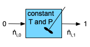{#fig-example_20_5_1_schematic}

**Quantities of Interest:** $k_0$, $k_{0,CI,l}$, $k_{0,CI,u}$, $E$, $E_{CI,l}$, $E_{CI,u}$, $R^2$, $\underline{C}_{Y,1,model}$ *vs.* $\underline{C}_{Y,1}$ (as a parity plot), and $\underline{\epsilon}_{expt}$ *vs.* $\underline{T}$, *vs.* $\underline{\dot{V}}$, *vs.* $\underline{C}_{A,0}$, *vs.* $\underline{C}_{B,0}$, *vs.* $\underline{C}_{Y,0}$, and *vs.* $\underline{C}_{Z,0}$ (as residuals plots).

**Given and Known Constants:** $V=100 \text{ cm}^3$.

**Adjusted Experimental Inputs:** $\underline{T}$, $\underline{\dot{V}}$, $\underline{C}_{A,0}$, $\underline{C}_{B,0}$, $\underline{C}_{Y,0}$, and $\underline{C}_{Z,0}$.

**Experimental Response:** $\underline{C}_{Y,1}$.

#### Mathematical Formulation of the Analysis

:::{.callout-tip collapse="true"}
## Click Here to See What an Expert Might be Thinking at this Point

I know that I'll need an isothermal, steady-state CSTR model to analyze the data, so I'll develop that first. Because the temperature in each experiment is constant and known, I can solve the CSTR mole balances independently of any energy balances. Furthermore, I can calculate everything I need using only the mole balances, so for this analysis the reactor design equations will consist of a mole balance on each reagent present in the system. 

The general form of the steady-state CSTR mole balance is given in @eq-cstr_ss_mole_balance, but here there is only one reaction occurring, so the summation over the reactions reduces to a single term and there isn't a need to index the reactions. I'll be solving the design equations numerically, so I'll write them as residuals expressions.

$$
0 = \epsilon = \dot{n}_{i,0} - \dot{n}_{i,1} + \nu_i r V
$$

I'll be solving the design equations to find the outlet molar flow rates of the reagents. To do so numerically I'll need to provide guesses for those unknowns and a residuals function.

I will use the experimental response for each experiment to generate a guess for the design equation unknowns (the outlet molar flow rates of the reagents). To do so I'll calculate the outlet molar flow rate of Y from the measured outlet concentration of Y. From that I can calculate the apparent extent of reaction, and then the outlet molar flow rates of the other reagents.

:::

<center>**Steady-State CSTR Model**</center>

**Design Equations**

$$
0  = \epsilon_1 = \dot{n}_{A,0} - \dot{n}_{A,1} - rV \tag{3}
$$

$$
0  = \epsilon_2 = \dot{n}_{B,0} - \dot{n}_{B,1} - rV \tag{4}
$$

$$
0  = \epsilon_3 = \dot{n}_{Y,0} - \dot{n}_{Y,1} + rV \tag{5}
$$

$$
0  = \epsilon_4 = \dot{n}_{Z,0} - \dot{n}_{Z,1} + rV \tag{6}
$$

**Initial Guesses for the Design Equations Solution**

$$
\dot{n}_{Y,1,guess} = C_{Y,1} \dot{V} \tag{7}
$$

$$
\dot{n}_{Y,1,guess} = \dot{n}_{Y,0} + \dot{\xi}_{guess} \qquad \Rightarrow \qquad \dot{\xi}_{guess} = \dot{n}_{Y,1,guess} - \dot{n}_{Y,0} \tag{8}
$$

$$
\dot{n}_{A,1,guess} = \dot{n}_{A,0} - \dot{\xi}_{guess} \tag{9}
$$

$$
\dot{n}_{B,1,guess} = \dot{n}_{B,0} - \dot{\xi}_{guess} \tag{10}
$$

$$
\dot{n}_{Z,1,guess} = \dot{n}_{Z,0} + \dot{\xi}_{guess} \tag{11}
$$

:::{.callout-tip collapse="true"}
## Click Here to See What an Expert Might be Thinking at this Point

I will need to write the residuals function. Because it will be called by the ATE solver, it must have values for each of the ATE unknowns as its only arguments and it must return the corresponding values of the ATE residuals, $\epsilon_1$ through $\epsilon_4$. The arguments and the given and known constants from the assignment summary will be available within the residuals function.

Before the ATE residuals can be calculated, any other unknown quantities appearing in the design equations must be calculated. In the present case, the only known quantity in the design equations is $V$, so the inlet molar flow rates of the four reagents and the rate must be calculated. The inlet molar flow rates can be found from the inlet concentrations and the inlet volumetric flow rate, but those vary from one experiment to the next, so they will need to be made available to the residuals function.

The rate can be calculated using equation (2), but that requires $k$, $C_A$, and $C_B$. The concentrations in the rate expression can be calculated using the defining equation for concentration, but that again requires the volumetric flow rate. The rate coefficient can be calculated using the Arrhenius expression, but that, in turn, requires the pre-exponential factor, activation energy, and temperature. The pre-exponential factor and activation energy will be changing as the response model is being fit to the data, and, like the inlet molar flow rates and the volumetric flow rate, the temperature will change from experiment to experiment. Therefore $k_0$, $E$, and $T$ will need to be made available to the residuals function, too.

:::

**Residuals Function**

[Arguments:]{.underline} $\dot{n}_{A,1}$, $\dot{n}_{B,1}$, $\dot{n}_{Y,1}$, and $\dot{n}_{Z,1}$.

[Returns:]{.underline} $\epsilon_1$, $\epsilon_2$, $\epsilon_3$, and $\epsilon_4$.

[Must be Available:]{.underline} $T$, $\dot{V}$, $C_{A,0}$, $C_{B,0}$, $C_{Y,0}$, $C_{Z,0}$, $k_0$, and $E$.

[Algorithm:]{.underline}

$$
\dot{n}_{A,0} = C_{A,0}\dot{V} \tag{12}
$$

$$
\dot{n}_{B,0} = C_{B,0}\dot{V} \tag{13}
$$

$$
\dot{n}_{Y,0} = C_{Y,0}\dot{V} \tag{14}
$$

$$
\dot{n}_{Z,0} = C_{Z,0}\dot{V} \tag{15}
$$

$$
C_{A,1} = \frac{\dot{n}_{A,1}}{\dot{V}} \tag{16}
$$

$$
C_{B,1} = \frac{\dot{n}_{B,1}}{\dot{V}} \tag{17}
$$

$$
k = k_0 \exp{\left(\frac{-E}{RT}\right)} \tag{18}
$$

$$
r = kC_{A,1}C_{B,1} \tag{2}
$$

$$
\epsilon_1 = \dot{n}_{A,0} - \dot{n}_{A,1} - rV  \tag{3}
$$

$$
\epsilon_2 = \dot{n}_{B,0} - \dot{n}_{B,1} - rV  \tag{4}
$$

$$
\epsilon_3 = \dot{n}_{Y,0} - \dot{n}_{Y,1} + rV  \tag{5}
$$

$$
\epsilon_4 = \dot{n}_{Z,0} - \dot{n}_{Z,1} + rV \tag{6}
$$

:::{.callout-tip collapse="true"}
## Click Here to See What an Expert Might be Thinking at this Point

The last thing I need to complete the steady-state CSTR model is a function that solves the design equations. I'll use an ATE solver to solve the design equations, so I'll need to provide it with the guesses for the ATE unknowns and the residuals function above.

The model will be solved for each experiment and for different rate expression parameters. Therefore, I will pass the rate expression parameters, the adjusted experimental inputs for the experiment being analyzed, and the measured response for the experiment being analyzed as arguments. By doing so, the initial guesses for the outlet molar flow rates (the design equation unknowns) can be calculated as described above. The CSTR model function will then need to make the rate expression parameters and the adjusted experimental inputs available to the residuals function. Then all it needs to do is call an ATE solver to solve the design equations.

Being ATEs, he design equations might have multiple solutions. Hopefully by using guesses that were calculated from the measured response, the ATE solver will find the desired solution.

:::

**CSTR Model Function**

[Arguments:]{.underline} $T$, $\dot{V}$, $C_{A,0}$, $C_{B,0}$, $C_{Y,0}$, $C_{Z,0}$, $C_{Y,1}$, $k_0$, and $E$.

[Returns:]{.underline} $\dot{n}_{A,1}$, $\dot{n}_{B,1}$, $\dot{n}_{Y,1}$, and $\dot{n}_{Z,1}$.

[Algorithm:]{.underline}

1. Make $T$, $\dot{V}$, $C_{A,0}$, $C_{B,0}$, $C_{Y,0}$, $C_{Z,0}$, $k_0$, and $E$ available to the residuals function.
2. Calculate initial guesses for the ATE unknowns using equations (7) - (11).
3. Get and return $\dot{n}_{A,1}$, $\dot{n}_{B,1}$, $\dot{n}_{Y,1}$, and $\dot{n}_{Z,1}$ by calling an ATE solver passing the initial guesses and residuals function as argument.

<center>**Quantities of Interest**</center>

:::{.callout-tip collapse="true"}
## Click Here to See What an Expert Might be Thinking at this Point

The quantities of interest are the parameter estimates, the parameter uncertainties, the coefficient of determination, the full set of model-predicted responses, and the full set of experiment residuals. The parameter estimates, parameter uncertainties, and coefficient of determination will be found by fitting a predicted responses model to the experimental data.

The CSTR model cannot be fit to the experimental data directly because it does not yield a predicted value of the response, $C_{A,1,model}$. Instead, I'll use it to generate a predicted responses function. The predicted responses function will be called by a numerical fitting function. I will need to write it recognizing that it must receive the rate expression parameters ($k_0$ and $E$) and the full set of adjusted experimental inputs ($\underline{T}$, $\underline{\dot{V}}$, $\underline{C}_{A,0}$, $\underline{C}_{B,0}$, $\underline{C}_{Y,0}$, and $\underline{C}_{Z,0}$) as its only arguments. It must return the full set of model-predicted responses ($\underline{C}_{Y,1,model}$) and nothing else. Because the measured response for the experiment being modeled is one of the arguments to the CSTR model function, the measured responses need to be made available to the predicted responses function.

All that the predicted responses function needs to do is go through the experiments one by one. For each one it simply needs to extract the adjusted inputs and measured response for that experiment from the full sets and call the CSTR model function. The CSTR model function will solve the design equations and return the outlet molar flow rates of the reagents. From those and the volumetric flow rate, the outlet concentration of Y, the response, can be calculated. After it goes through all of the experiments it can then return the full set of model-predicted responses.

:::

**Predicted Responses Function**

[Arguments:]{.underline} $k_0$, $E$, $\underline{T}$, $\underline{\dot{V}}$, $\underline{C}_{A,0}$, $\underline{C}_{B,0}$, $\underline{C}_{Y,0}$, and $\underline{C}_{Z,0}$

[Returns:]{.underline} $\underline{C}_{Y,1,model}$

[Must be Available:]{.underline} $\underline{C}_{Y,1}$

[Algorithm:]{.underline}

1. For each experiment in the data set

    a. Extract $T$, $\dot{V}$, $C_{A,0}$, $C_{B,0}$, $C_{Y,0}$, $C_{Z,0}$, and $C_{Y,1}$ for that experiment from the full data sets.

    b. Get $\dot{n}_{A,1}$, $\dot{n}_{B,1}$, $\dot{n}_{Y,1}$, and $\dot{n}_{Z,1}$ by calling the CSTR model function, passing the rate expression parameters, adjusted inputs for the experiment and measured response for the experiment as arguments.

    c. Calculate the model-predicted response.

$$
C_{Y,1,model} = \frac{\dot{n}_{Y,1}}{\dot{V}} \tag{19}
$$

2. Return the full set of model-predicted responses, $\underline{C}_{Y,1,model}$.

:::{.callout-tip collapse="true"}
## Click Here to See What an Expert Might be Thinking at this Point

Now that I have a model that predicts the responses for the experiments, I need to fit it to the experimental data. I'll do that using a numerical fitting function. The fitting function will require four things as arguments: (1) guesses for the rate expression parameters, (2) the set of adjusted inputs for all of the experiments, (3) the set of experimental responses for all of the experiments, and (4) the predicted responses function above.

Assuming it is successful, the numerical fitting function will return estimates for the rate expression parameters, $k_0$ and $E$, estimates for the upper and lower limits of their 95% confidence intervals, $k_{0,CI,l}$, $k_{0,CI,u}$, $E_{CI,l}$, and $E_{CI,u}$, and the coefficient of determination, $R^2$. 

I can use the estimated rate expression parameters to calculate the model-predicted responses, and I can use them to calculate the experiment residuals. Then I can generate a parity plot and residuals plots.

:::

**Parameter Estimation**

1. Make an initial guess for the parameters ($k_{0,guess}$ and $E_{guess}$)
2. Get $k_0$, $k_{0,CI,l}$, $k_{0,CI,u}$, $E$, $E_{CI,l}$, $E_{CI,u}$, and $R^2$ by calling a numerical fitting function, passing the guess for the parameters, the full set of adjusted experimental inputs, the full set of measured responses, and the predicted responses function as arguments.

**Assessment Graphs**list

1. Get $\underline{C}_{Y,1,model}$ by calling the predicted responses function passing the estimated parameters and the full set of adjusted inputs as arguments.
2. Calculate the experiment residuals.

$$
\underline{\epsilon}_{expt} = \underline{C}_{Y,1} - \underline{C}_{Y,1,model} \tag{19}
$$

3. Generate a parity plot showing $\underline{C}_{Y,1}$ *vs.* $\underline{C}_{Y,1,model}$.
4. Generate residuals plots showing $\underline{\epsilon}_{expt}$ *vs.* $\underline{T}$, *vs.* $\underline{\dot{V}}$, *vs.* $\underline{C}_{A,0}$, *vs.* $\underline{C}_{B,0}$, *vs.* $\underline{C}_{Y,0}$, and *vs.* $\underline{C}_{Z,0}$.

<center>**Calculation Summary**</center>

1. Read the adjusted experimental inputs and the experimental responses from the file, [reb_20_5_1_data.csv](examples/reb_20_5_1/reb_20_5_1_data.csv).
2. Make the set of measured responses available to the predicted responses function.
3. Perform the parameter estimation and assessment graphs calculations described above.
4. Display the results and/or save them to a file.

#### Results and Discussion


The calculations were performed as described, except that the base-10 log of $k$ was estimated (see [Example -@sec-example_19_5_1]), and the results are shown in @tbl-example_20_5_1_results.


The estimated rate coefficient was used to calculate the model-predicted response for each experiment, and that was used to calculate the residual for each experiment. The results were then used to generate the parity plot in @fig-example_20_5_1_parity and residuals plots shown in @fig-example_20_5_1_plots.

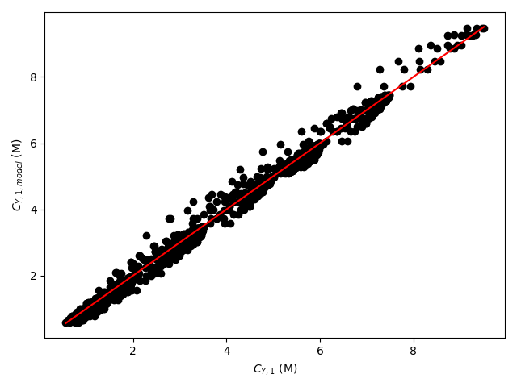{#fig-example_20_5_1_parity width="80%"}

::: {#fig-example_20_5_1_plots layout-ncol=2}

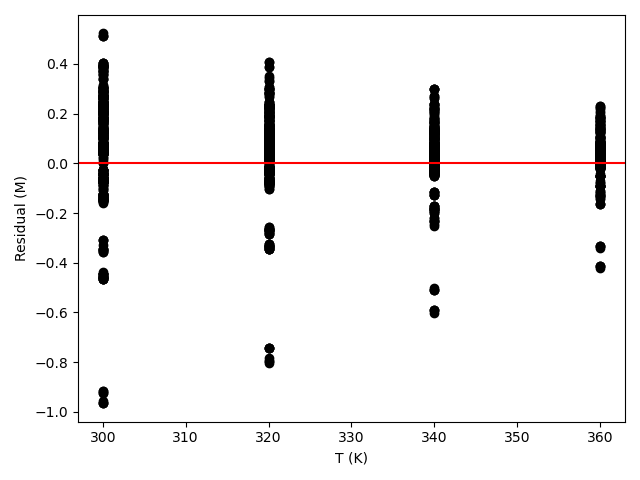

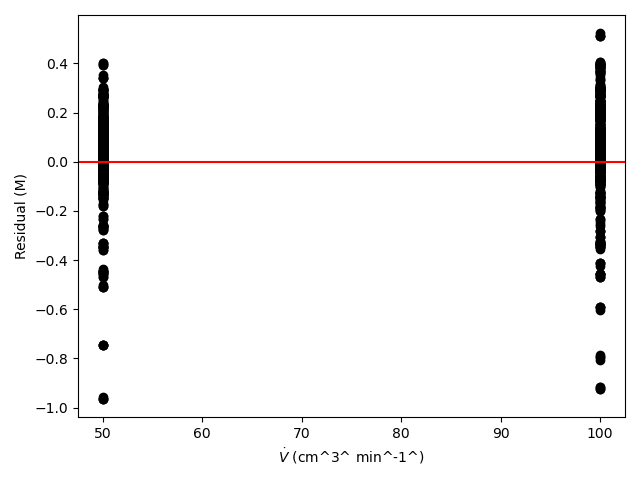


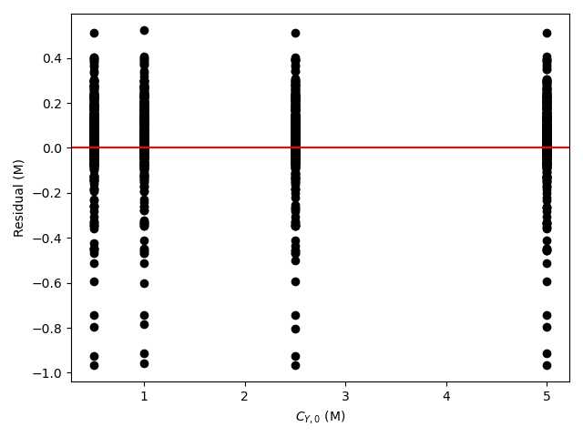


Residuals Plots.
:::

:::{.callout-tip collapse="true"}
## Click Here to See What an Expert Might be Thinking at this Point

The 95% confidence interval for $k_0$,  df$value[2]` to  df$value[3]`  df$units[2]`, is roughly half to double its estimated value,  df$value[1]`   df$units[1]`. The 95% confidence interval for $E$ is much narrower. There is some scatter apparent in the parity plot, and the coefficient of determination is   df$value[7]`. These factors suggest that the rate expression is reasonably accurate. The residuals plots for $T$, $\dot{V}$ and $C_Y$ show random deviations of the residuals about zero, too. However, in the residuals plots for $C_A$ and $C_B$ the residuals at low concentration do not scatter equally about zero. The residuals for $C_Z$ show a definite trend, decreasing steadily as $C_Z$ increases. This suggests that the reaction rate may have some functional dependence on the concentration of Z that is not captured in the rate expression.

:::

**Assessment**

The rate expression is reasonably accurate, but there are indications that the it may not fully capture the dependence of the rate on the concentration of reagent Z. Rate expressions that include a functional dependence on the concentration of Z should be postulated and assessed to determine whether they can represent the experimental results more accurately.

### Analysis of Data for a Gas-Phase Reaction with Change of Total Moles {#sec-example_20_5_2}

 include ../RE_Basics_Examples/reb_20_5_2/narrative.qmd >}}

 include ../RE_Basics_Examples/reb_20_5_2/equations.qmd >}}


The first few data points are shown in @tbl-example_20_5_2_data. The full data set is available in the file [reb_20_5_2_data.csv](examples/reb_20_5_2/reb_20_5_2_data.csv).


---

:::{.callout-tip collapse="true"}
## Click Here to See What an Expert Might be Thinking at this Point

The assignment narrative describes reactor experiments, provides the data generated in those experiments, and asks me to use them to assess the accuracy of a proposed rate expression. Those are distinguishing characteristics of a kinetics data analysis assignment.

I'll begin by summarizing the assignment. I'll assign an appropriate variable symbol to represent each of the quantities provided in the assignment. While doing so I will use a subscripted "0" to denote a quantity value at the inlet to the reactor and a subscripted "1" to denote one at the outlet. I'll use subscripted "CI,l" and "CI,u" to denote values that are  the lower or upper limit of a 95% confidence interval. I'll underline a variable symbol if it represents a set of values (i. e. a vector).

In the experiments for this assignment, a CSTR that operated at steady-state was used. The adjusted experimental inputs were the temperature, space time, and feed mole fraction of reagent A, and the measured response was the outlet concentration of Z.

In order to assess the accuracy of the rate expression I will need to estimate the parameters in the rate expression and the uncertainty in the estimates. I'll also calculate the coefficient of determination. A parity plot and residuals plots also will help me assess the accuracy of the proposed rate expression. To make those plots, I'll need the model-predicted responses and the experiment residuals for the experiments. I'll list all of these as the quantities of interest.

No extensive quantities were provided in the assignment narrative, so I can select one extensive variable as the basis for the calculations. I'll use the reactor volume as the basis and include it among the given and known constants.

:::

#### Assignment Summary

**Reactor System:** Steady-state, isothermal, gas-phase CSTR

**Reactor Schematic:**

{#fig-example_20_5_2_schematic}

**Adjusted Experimental Inputs:** $\underline{T}$, $\underline{\tau}$ and $\underline{y}_{A,0}$

**Experimental Response:** $\underline{C}_{Z,1}$

**Quantities of Interest:** $k_0$, $k_{0,CI,l}$, $k_{0,CI,u}$, $E$, $E_{CI,l}$, $E_{CI,u}$, $\alpha_A$, $\alpha_{A,CI,l}$, $\alpha_{A,CI,u}$, $\alpha_B$, $\alpha_{B,CI,l}$, $\alpha_{B,CI,u}$, $R^2$, $\underline{C}_{Z,1,model}$, $\underline{\epsilon}_{expt}$.

**Given and Known Constants:** $P$ = 3 atm, $\dot{n}_{Z,0}$ = 0, $R$ = 0.08206 L atm mol^-1^ K^-1^, and $V$ = 1.0 L (basis).

:::{.callout-tip collapse="true"}
## Click Here to See What an Expert Might be Thinking at this Point

This is a kinetics data analysis assignment, and I know that to complete it I will need a predicted response model that relates the rate expression parameters and the adjusted experimental inputs for any one experiment to the measured response from that experiment. I can begin to generate the predicted response model by generating a model for the CSTR used in the experiments. The CSTR model relates the rate expression parameters and the adjusted experimental inputs to the outlet molar flow rates.

To generate the predicted responses model I can simply use the CSTR model to relate the rate expression parameters and the adjusted experimental inputs to the outlet molar flow rates, and then add equations to calcuate the response from the outlet molar flow rates.

Once I have a predicted response model, I can fit it to the experimental data to get estimates and uncertainties for the parameters and the coefficient of determination. For the rate expression given here the rate expression parameters are the pre-exponential factor, activation energy, reaction order in A, and reaction order in B. Using the estimated parameters in the predicted responses model will generate the model-predicated responses for the experiments, and those can be used to calculate the experiment residuals. That will allow me to generate a parity plot and residuals plot.

To complete the assignment I can assess the accuracy of the rate expression by noting that for an accurate model the following criteria are satisfied:

* The coefficient of determination is close to 1.0.
* The points in the parity plot are close to the parity line.
* The points in the residuals plots scatter randomly about zero with no apparent trends or systematic deviations.
* The lower and upper limits of the 95% confidence interval for most, if not all, of the rate expression parameters close to their estimated values. 

:::

<center>**Task List**</center>

1. Develop the CSTR model.
2. Using the CSTR model develop a predicted response model.
3. Fit the predicted response model to the experimental data.
4. Generate a parity plot and residuals plots.
5. Assess the accuracy of the rate expression.

#### Mathematical Formulation of the Analysis

:::{.callout-tip collapse="true"}
## Click Here to See What an Expert Might be Thinking at this Point

To start I'll formulate the steady-state CSTR model. To do so I need to generate the reactor design equations for the reactor. They will be solved numerically to find the outlet molar flow rates of the reagents. In kinetics experiments the reactor operates at a known temperature, and as a result the mole balance design equations can be solved independently of any energy balances. I can calculate the outlet molar flow rates of the reagents using just the mole balances, to they are the only design equations I need.

The general form of the CSTR mole balances is given in @eq-cstr_mol_balance. Here the reactor operates at steady-state, so the time derivatives are all equal to zero. There is only one reaction taking place in the reactor so the summation over the reactions reduces to a single term and it isn't necessary to index the reaction. So for this assignment the mole balance on each reagent in the system will take the following form.

$$
0 = \epsilon = \dot{n}_{i,0} - \dot{n}_{i,1} + \nu_i r V
$$

Here, the design equations are a set of ATEs. I will solve numerically for the outlet molar flow rates of the reagents, so the general equation above has been written in the form of a residual expression. To use an ATE solver to solve the design equations numerically for the outlet molar flow rates of the reagents, I will need to provide an initial guess for those outlet molar flow rates. In a kinetics data analysis assignment like this, I can use the measured response from an experiment to make an initial guess for the outlet molar flow rates in that experiment.

In this assignment the measured response was the outlet concentration of Z. Since all I need is a guess, I can ignore the change in the volumetric flow rate and calculate the outlet molar flow of Z as the measured outlet concentration times the inlet volumetric flow rate. The inlet volumetric flow rate can be calculated using the space time and the volume. After guessing the outlet molar flow rate of Z, I can calculate the extent of reaction. Finally, I can calculate the inlet molar flow rates of A and B using the ideal gas law and use them together with the extent of reaction to calculate their outlet molar flow rates.

:::

<center>**Steady-State CSTR Model**</center>

**Design Equations**

$$
0 = \epsilon_1 = \dot{n}_{A,0} - \dot{n}_{A,1} - rV \tag{3}
$$

$$
0 = \epsilon_2 = \dot{n}_{B,0} - \dot{n}_{B,1} - rV \tag{4}
$$

$$
0 = \epsilon_3 = - \dot{n}_{Z,1} + rV \tag{5}
$$

**Guesses for the Design Equations Unknowns**

$$
\dot{V}_0 = \frac{V}{\tau} \tag{6}
$$

$$
\dot{n}_{A,0} = y_{A,0}\frac{P \dot{V}_0}{RT} \tag{7}
$$

$$
\dot{n}_{B,0} = \left(1-y_{A,0}\right) \frac{P \dot{V}_0}{RT} \tag{8}
$$

$$
\dot{n}_{Z,1} \approx \dot{V}_0 C_{Z,1} =  \dot{n}_{Z,1,guess} \tag{9}
$$

$$
\dot{\xi} = \dot{n}_{Z,1,guess} -\dot{n}_{Z,0} \tag{10}
$$

$$
\dot{n}_{A,1,guess} = \dot{n}_{A,0} - \dot{\xi}\tag{11}
$$

$$
\dot{n}_{B,1,guess} = \dot{n}_{B,0} - \dot{\xi} \tag{12}
$$

:::{.callout-tip collapse="true"}
## Click Here to See What an Expert Might be Thinking at this Point

In addition to the guesses for the design equations unknowns, I will need to write a residuals function and provide it to the ATE solver (see @sec-apndx_residuals_fcn). The residuals function will be called by an ATE solver from a mathematics software package. The mathematics software package assumes that the only arguments to the residuals function are the ATE unknowns and that the residuals function returns the ATE residuals and nothing else. I can, of course, use the known constants given the assignment narrative within the residuals function, but if it requires any other input, I will need to provide that by some means other than as an argument.

The purpose of the residuals function is to calculate the design equation residuals, equations (3) - (5). Of the quantities appearing in the design equations, $\dot{n}_{A,1}$, $V$, $\dot{n}_{B,1}$, and $\dot{n}_{Z,1}$ are either arguments to the residuals function (the outlet molar flow rates) or known constants. $\dot{n}_{A,0}$, $r$, $\dot{n}_{B,0}$, and $\dot{n}_{Z,0}$ are not known and must either be calculated or made available within the residuals function. The inlet molar flow rates can be calculated as was done in equations (6) through (8), but the space time, inlet mole fraction of A and temperature will be different depending upon the experiment being analyzed. As such, those quantities cannot be calculated and must be made available to the residuals function before it is called.

The rate can be calculated using the given rate expression, equation (2), but that requires $k$, $P_A$, $P_B$, $\alpha_A$, and $\alpha_B$. The Arrhenius expression, below, can be used to calculate $k$, but that requires $k_0$ and $E$ (assuming $T$ has been made available to enable calculation of the inlet molar flow rates as just mentioned). The rate expression parameters, $k_0$, $E$, $\alpha_A$, and $\alpha_B$ will be changing during the fitting process, so they cannot be calculated and must be made available to the residuals function before it is called.

$$
k = k_0 \exp{ \left( \frac{-E}{RT} \right)}
$$

The partial pressures of A and B can be calculated from the total pressure and their mole fractions, below. Once $T$, $\tau$, $y_{A,0}$, $k_0$, $E$, $\alpha_A$, and $\alpha_B$ have been made available and $\dot{n}_{A,0}$, $r$, $\dot{n}_{B,0}$, and $\dot{n}_{Z,0}$ have been calculated, the residuals can be evaluated using the design equations (3) - (5).

$$
P_i = \frac{\dot{n}_{i,1} P}{\dot{n}_{A,1} + \dot{n}_{B,1} + \dot{n}_{Z,1}}
$$

:::

**Residuals Function**

[Arguments:]{.underline} $\dot{n}_{A,1}$, $\dot{n}_{B,1}$, and $\dot{n}_{Z,1}$

[Returns:]{.underline} $\epsilon_1$, $\epsilon_2$, and $\epsilon_3$

[Must be Available:]{.underline} $T$, $\tau$, $y_{A,0}$, $k_0$, $E$, $\alpha_A$, and $\alpha_B$

[Algorithm:]{.underline}

$$
\dot{V}_0 = \frac{V}{\tau} \tag{6}
$$

$$
\dot{n}_{A,0} = y_{A,0}\frac{P \dot{V}_0}{RT} \tag{7}
$$

$$
\dot{n}_{B,0} = \left(1-y_{A,0}\right) \frac{P \dot{V}_0}{RT} \tag{8}
$$

$$
P_A = \frac{\dot{n}_{A,1}P}{\left(\dot{n}_{A,1} + \dot{n}_{B,1} + \dot{n}_{Z,1}\right)} \tag{13}
$$

$$
P_B = \frac{\dot{n}_{B,1}P}{\left(\dot{n}_{A,1} + \dot{n}_{B,1} + \dot{n}_{Z,1}\right)} \tag{14}
$$

$$
k = k_0 \exp{ \left( \frac{-E}{RT} \right)} \tag{15}
$$

$$
r = kP_A^{\alpha_A}P_B^{\alpha_B} \tag{2}
$$

$$
\epsilon_1 = \dot{n}_{A,0} - \dot{n}_{A,1} - rV \tag{3}
$$

$$
\epsilon_2 = \dot{n}_{B,0} - \dot{n}_{B,1} - rV \tag{4}
$$

$$
\epsilon_3 = - \dot{n}_{Z,1} + rV \tag{5}
$$

:::{.callout-tip collapse="true"}
## Click Here to See What an Expert Might be Thinking at this Point

To complete the CSTR model, I will need to write a CSTR model function that solves the design equations numerically to find the outlet molar flow rates of the reagents. It will use an ATE solver to do so, and it will need to provide two things to the ATE solver: the guess for the ATE unknowns and the residuals function. When it is called, it should be passed the adjusted experimental inputs and the experimental response for the experiment being analyzed and the current rate expression parameters. It needs the adjusted inputs and response to calculate the guesses and it needs to make the adjusted inputs and the rate coefficient parameters available to the residuals function before passing the residuals function to the ATE solver.

After making the adjusted inputs and the rate coefficient parameters available to the residuals function all the CSTR model function needs to do is calculate the guesses and call the ATE solver. Assuming the solver is successful, it will return the outlet molar flow rates of the reagents.

:::

**CSTR Model Function**

[Arguments:]{.underline} $T$, $\tau$, $y_{A,0}$, $C_{Z,1}$, $k_0$, $E$, $\alpha_A$, and $\alpha_B$

[Returns:]{.underline} $\dot{n}_{A,1}$, $\dot{n}_{B,1}$, and $\dot{n}_{Z,1}$.

[Algorithm:]{.underline}

1. Make $T$, $\tau$, $y_{A,0}$, $k_0$, $E$, $\alpha_A$, and $\alpha_B$ available to the residuals function.
2. Calculate the guesses for the design equations unknowns, equations (6) - (12).
3. Get $\dot{n}_{A,1}$, $\dot{n}_{B,1}$, and $\dot{n}_{Z,1}$ by calling an ATE solver passing the initial guesses and the CSTR residuals function as arguments.

:::{.callout-tip collapse="true"}
## Click Here to See What an Expert Might be Thinking at this Point

Having developed a model for the CSTR used in the experiments, my next task is to use it to develop a predicted response model that can be fit to the experimental data. The predicted response model must relate the measured response to the rate expression parameters and the adjusted experimental inputs. The CSTR model relates the outlet molar flow rates to the rate expression parameters and the adjusted experimental inputs, so all I need is equations that relate the outlet molar flow rates to the measured response.

The measured response is the outlet concentration of Z. By definition, it is equal to the outlet molar flow rate of Z divided by the outlet volumetric flow rate. A critical point to remember is that the inlet and outlet volumetric flow rates are not equal because the reaction causes a change in the total molar flow rate. It can be calculated using the ideal gas law and then the outlet concentration of Z can be calculated.

I will use a numerical fitting function from a mathematics or statistics software package to fit the predicted response model to the experimental data (see @sec-apndx_parameter_est). One of the things I will need to provide to it is a predicted responses function, that I must write. The predicted responses function will be called by the numerical fitting function, and it assumes that the only arguments to the predicted responses function are the adjusted experimental inputs and the rate expression parameters and that the predicted responses function returns the model predicted responses for all of the experiments and nothing else. As was the case for the residuals function, I can use the known constants given the assignment narrative within the predicted function, but if it requires any other input, I will need to provide that by some means other than as an argument.

Writing the predicted responses function is straightforward. It simply needs to go through the experiments one by one calling the CSTR model function and using the outlet molar flow rates it returns to calculate the model-predicted response, $C_{Z,1}$. After doing this for each experiment, the full set of model-predicated responses can be returned.

In this assighment, the measured response for the experiment must also be provided as an argument when calling the CSTR model function. Since the measured responses are not passed to the predicted responses function as an argument, they must be provided to it by some other means.

:::

<center>**Predicted Response Model**</center>

**Predicted Response**

$$
\dot{V}_1 = \frac{\left(\dot{n}_{A,1} + \dot{n}_{B,1} + \dot{n}_{Z,1}\right)RT}{P} \tag{16}
$$

$$
C_{Z,1,model} = \frac{\dot{n}_{Z,1}}{\dot{V}_1} \tag{17}
$$

**Predicted Responses Function**

[Arguments:]{.underline} $k_0$, $E$, $\alpha_A$, $\alpha_B$, $\underline{T}$, $\underline{\tau}$, and $\underline{y}_{A,0}$.

[Returns:]{.underline} $\underline{C}_{Z,1,model}$

[Must be Available:]{.underline} $\underline{C}_{Z,1}$

[Algorithm:]{.underline}

1. For each experiment in the data set:

    a. Get $\dot{n}_{A,1}$, $\dot{n}_{B,1}$, and $\dot{n}_{Z,1}$ by calling the CSTR model function passing $T$, $\tau$, $y_{A,0}$, $C_{Z,1}$, $k_0$, $E$, $\alpha_A$, and $\alpha_B$ as arguments.

    b. Calculate the predicted response, equations (16) and (17).

2. Return $\underline{C}_{Z,1,model}$.

:::{.callout-tip collapse="true"}
## Click Here to See What an Expert Might be Thinking at this Point

Now that I have generated the CSTR model function and the predicted responses function, most of the remaining tasks can be accomplished simply by making function calls. To estimate the rate expression parameters, parameter uncertainties and get the coefficient of determination, I simply need to make guesses for the rate expression the parameters and call the numerical fitting function. Once I've done that, all I need to do to generate the data for the parity and residuals plots is to call the predicted responses function using the final parameter estimates and then calculate the experiment residuals.

:::

<center>**Parameter Estimates and Statistics**</center>

1. Define guesses, $k_{0,guess}$, $E_{guess}$, $\alpha_{A,guess}$, and $\alpha_{B,guess}$.

2. Get $k_0$, $k_{0,CI,l}$, $k_{0,CI,u}$, $E$, $E_{CI,l}$, $E_{CI,u}$, $\alpha_A$, $\alpha_{A,CI,l}$, $\alpha_{A,CI,u}$, $\alpha_B$, $\alpha_{B,CI,l}$, $\alpha_{B,CI,u}$, and $R^2$ by calling a numerical fitting function, passing the guesses ($k_{0,guess}$, $E_{guess}$, $\alpha_{A,guess}$, and $\alpha_{B,guess}$), the adjusted experimental inputs ($\underline{T}$, $\underline{\tau}$, and $\underline{y}_{A,0}$), the experimental responses ($\underline{C}_{Z,1}$), and the predicted responses function as arguments.

<center>**Assessment Graphs**</center>

1. Get $\underline{C}_{Z,1,model}$ by calling the predicted responses function, passing the estimated parameters ($k_0$, $E$, $\alpha_A$, and $\alpha_B$) and the adjusted experimental inputs ($\underline{T}$, $\underline{\tau}$, and $\underline{y}_{A,0}$) as arguments.

2. Calculate the experiment residuals.

$$
\underline{\epsilon}_{expt} = \underline{C}_{Z,1,model} - \underline{C}_{Z,1} \tag{18}
$$

3. Generate a parity plot showing $\underline{C}_{Z,1,model}$ *vs.* $\underline{C}_{Z,1}$ as points and $\underline{C}_{Z,1,model}$ = $\underline{C}_{Z,1}$ as the parity line.

4. Generate residuals plots showing $\underline{\epsilon}_{expt}$ *vs.* $\underline{T}$, *vs.* $\underline{\tau}$, and *vs.* $\underline{y}_{A,0}$.

:::{.callout-tip collapse="true"}
## Click Here to See What an Expert Might be Thinking at this Point

Now I have everything I need to perform the calculations. In this assignment it is necessary to make some quantities available to the residuals function and to make the measured responses available to the predicted responses function. I have taken care of making the necessary quantities available to the residuals function within the CSTR model function. The measured responses from the experiments are constants that will never change during the analysis. Therefore, they can be made available to the predicted responses function as soon as they are read in from the data file.

:::

<center>**Calculations Summary**</center>

1. Read the adjusted experimental inputs and the experimental responses from the file, [reb_20_5_2_data.csv](examples/reb_20_5_2/reb_20_5_2_data.csv).

2. Make the experimental responses ($\underline{C}_{Z,1}$) available to the predicted responses function.

3. Calculate the parameter estimates and statistics and generate the assessment graphs as described above.

4. Display the results and/or save them to a file.

#### Results, Analysis, and Discussion


The calculations were performed as described above except that the base-10 log of $k_0$ was estimated instead of estimating $k_0$ directly (see @sec-example_18_6_2). The fitting results are shown in @tbl-example_20_5_2_parameters. The parity plot is shown in @fig-example_20_5_2_parity and the residuals plots are shown in @fig-example_20_5_2_residuals_plots.


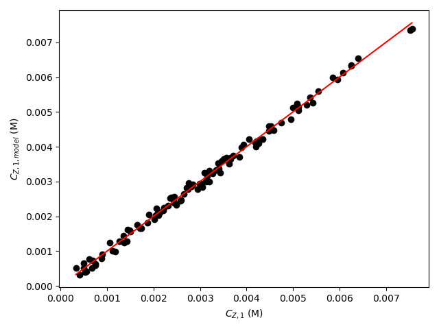{#fig-example_20_5_2_parity}

::: {#fig-example_20_5_2_residuals_plots layout-ncol=1}

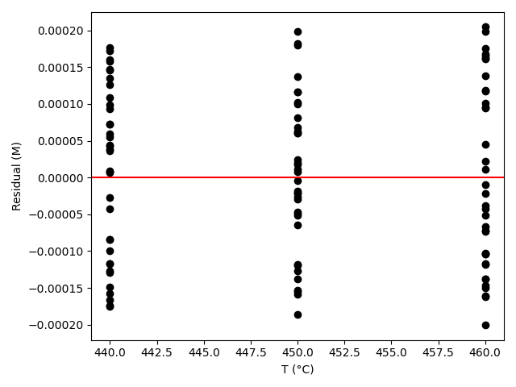

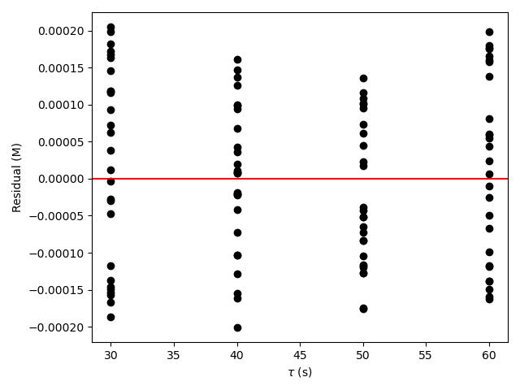

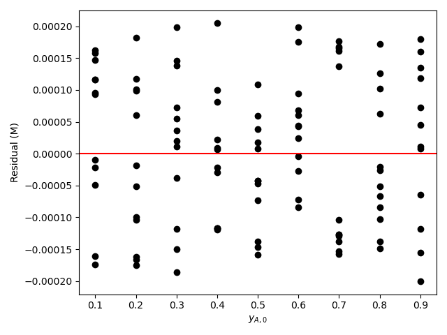

Residuals Plots.
:::

:::{.callout-tip collapse="true"}
## Click Here to See What an Expert Might be Thinking at this Point

The deviations of the data points from the line in the parity plot are small, the deviations of the residuals about zero are random with no apparent trends, the coefficient of determination is close to 1, and the upper and lower limits of the 95% confidence intervals for $E$, $\alpha_A$, and $\alpha_B$ are close to the estimated parameter value. The uncertainty in $k_0$ is slightly greater, but still acceptable. This indicates that the rate expression is acceptabley accurate.

:::

<center>**Assessment**</center>

When used with the rate expression parameters shown in @tbl-example_20_5_2_parameters, the accuracy of the proposed rate expression in describing the concentration and temperature dependence of the rate, within the range of concentrations and temperatures investigated, is acceptable.

### Analysis of Data for a Reversible Reaction {#sec-example_20_5_3}

 include ../RE_Basics_Examples/reb_20_5_3/narrative.qmd >}}

 include ../RE_Basics_Examples/reb_20_5_3/equations.qmd >}}


The first few data points are shown in @tbl-example_20_5_3_data. The full data set is available in the file [reb_20_5_3_data.csv](examples/reb_20_5_3/reb_20_5_3_data.csv).


---

:::{.callout-tip collapse="true"}
## Click Here to See What an Expert Might be Thinking at this Point

The assignment narrative describes reactor experiments, provides the data generated in those experiments, and asks me to use them to assess the accuracy of a proposed rate expression. Those are distinguishing characteristics of a kinetics data analysis assignment.

I'll begin by summarizing the assignment. I'll assign an appropriate variable symbol to represent each of the quantities provided in the assignment. While doing so I will use a subscripted "0" to denote a quantity value at the inlet to the reactor and a subscripted "1" to denote one at the outlet. I'll use subscripted "CI,l" and "CI,u" to denote values that are  the lower or upper limit of a 95% confidence interval. I'll underline a variable symbol if it represents a set of values (i. e. a vector).

In the experiments for this assignment, a CSTR that operated at steady-state was used. The adjusted experimental inputs were the temperature, volumetric flow rate, and feed concentrations of reagents A, Y, and Z, and the measured response was the outlet concentration of A.

In order to assess the accuracy of the rate expression I will need to estimate the parameters in the rate expression and the uncertainty in the estimates. For the rate expression given here, the rate expression parameters are the forward and reverse pre-exponential factors and the forward and reverse activation energies. I'll also calculate the coefficient of determination. A parity plot and residuals plots also will help me assess the accuracy of the proposed rate expression. To make those plots, I'll need the model-predicted responses and the experiment residuals for the experiments. I'll list all of these as the quantities of interest.

The reacting fluid is a liquid, and I'll assume it to be an ideal, incompressible mixture in which case the inlet and outlet volumetric flow rates will be equal. Therefore I will not use a subscript on the volumetric flow rate.

:::

#### Assignment Summary

**Reactor System:** Steady-state, isothermal, liquid-phase CSTR

**Reactor Schematic:**

{#fig-example_20_5_3_schematic}

**Adjusted Experimental Inputs:** $\underline{T}$, $\underline{\dot{V}}$, $\underline{C}_{A,0}$, $\underline{C}_{Y,0}$, and $\underline{C}_{Z,0}$. 

**Experimental Response:** $\underline{C}_{A,1}$

**Quantities of Interest:** $k_{0,f}$, $k_{0,f,CI,l}$, $k_{0,f,CI,u}$, $E_f$, $E_{f,CI,l}$, $E_{f,CI,u}$, $k_0,r$, $k_{0,r,CI,l}$, $k_{0,r,CI,u}$, $E_r$, $E_{r,CI,l}$, $E_{r,CI,u}$, $R^2$, $\underline{C}_{A,1,model}$, $\underline{\epsilon}_{expt}$.

**Given and Known Constants:** $V$ = 3 gal and $R$ = 1.987 BTR lbmol^-1^.

:::{.callout-tip collapse="true"}
## Click Here to See What an Expert Might be Thinking at this Point

This is a kinetics data analysis assignment, and I know that to complete it I will need a predicted response model that relates the rate expression parameters and the adjusted experimental inputs for any one experiment to the measured response from that experiment. I can begin to generate the predicted response model by generating a model for the CSTR used in the experiments. The CSTR model relates the rate expression parameters and the adjusted experimental inputs to the outlet molar flow rates.

To generate the predicted responses model I can simply use the CSTR model to relate the rate expression parameters and the adjusted experimental inputs to the outlet molar flow rates, and then add equations to calcuate the response from the outlet molar flow rates.

Once I have a predicted response model, I can fit it to the experimental data to get estimates and uncertainties for the parameters and the coefficient of determination. Using the estimated parameters in the predicted responses model will generate the model-predicated responses for the experiments, and those can be used to calculate the experiment residuals. That will allow me to generate a parity plot and residuals plot.

To complete the assignment I can assess the accuracy of the rate expression by noting that for an accurate model the following criteria are satisfied:

* The coefficient of determination is close to 1.0.
* The points in the parity plot are close to the parity line.
* The points in the residuals plots scatter randomly about zero with no apparent trends or systematic deviations.
* The lower and upper limits of the 95% confidence interval for most, if not all, of the rate expression parameters close to their estimated values. 

:::

<center>**Task List**</center>

1. Develop the CSTR model.
2. Using the CSTR model develop a predicted response model.
3. Fit the predicted response model to the experimental data.
4. Generate a parity plot and residuals plots.
5. Assess the accuracy of the rate expression.

#### Mathematical Formulation of the Analysis

:::{.callout-tip collapse="true"}
## Click Here to See What an Expert Might be Thinking at this Point

To start I'll formulate the steady-state CSTR model. To do so I need to generate the reactor design equations for the reactor. They will be solved numerically to find the outlet molar flow rates of the reagents. In kinetics experiments the reactor operates at a known temperature, and as a result the mole balance design equations can be solved independently of any energy balances. I can calculate the outlet molar flow rates of the reagents using just the mole balances, to they are the only design equations I need.

The general form of the CSTR mole balances is given in @eq-cstr_mol_balance. Here the reactor operates at steady-state, so the time derivatives are all equal to zero. There is only one reaction taking place in the reactor so the summation over the reactions reduces to a single term and it isn't necessary to index the reaction. So for this assignment the mole balance on each reagent in the system will take the following form.

$$
0 = \epsilon = \dot{n}_{i,0} - \dot{n}_{i,1} + \nu_i r V
$$

Here, the design equations are a set of ATEs. I will solve them numerically for the outlet molar flow rates of the reagents, so the mole balance above has been written in the form of a residual expression. To solve them numerically using using an ATE solver, I will need to provide a guess for those outlet molar flow rates. In a kinetics data analysis assignment like this, I can use the measured response from an experiment to make an initial guess for the outlet molar flow rates in that experiment.

In this assignment the measured response was the outlet concentration of A. To generate guesses for the outlet molar flow rates I can calculate the outlet molar flow of A as the measured outlet concentration times the volumetric flow rate. The inlet volumetric flow rate of A is just the product of the volumetric flow rate and the inlet concentration of A. With that I can calculate the extent of reaction. Finally, I can calculate the inlet molar flow rates of Y and Z, and use them together with the extent of reaction to calculate their outlet molar flow rates.

:::

<center>**Steady-State CSTR Model**</center>

**Design Equations**

$$
0 = \epsilon_1 = \dot{n}_{A,0} - \dot{n}_{A,1} - rV \tag{3}
$$

$$
0 = \epsilon_2 = \dot{n}_{Y,0} - \dot{n}_{Y,1} + rV \tag{4}
$$

$$
0 = \epsilon_3 = \dot{n}_{Z,0} - \dot{n}_{Z,1} + rV \tag{5}
$$

**Guesses for the Design Equations Unknowns**

$$
\dot{n}_{A,1,guess} = \dot{V}C_{A,1} \tag{6}
$$

$$
\dot{n}_{A,0} = \dot{V}C_{A,0} \tag{7}
$$

$$
\dot{n}_{A,1,guess} = \dot{n}_{A,0} - \dot{\xi} \qquad \Rightarrow \qquad \dot{\xi} = \dot{n}_{A,0} - \dot{n}_{A,1,guess} \tag{8}
$$

$$
\dot{n}_{Y,0} = \dot{V}C_{Y,0} \tag{9}
$$

$$
\dot{n}_{Z,0} = \dot{V}C_{Z,0} \tag{10}
$$

$$
\dot{n}_{Y,1,guess} = \dot{n}_{Y,0} + \dot{\xi} \tag{11}
$$

$$
\dot{n}_{Z,1,guess} = \dot{n}_{Z,0} + \dot{\xi} \tag{12}
$$

:::{.callout-tip collapse="true"}
## Click Here to See What an Expert Might be Thinking at this Point

In addition to the guesses for the design equation unknowns, I will need to write a residuals function and provide it to the ATE solver (see @sec-apndx_residuals_fcn). The residuals function will be called by an ATE solver from a mathematics software package. The mathematics software package assumes that the only arguments to the residuals function are the ATE unknowns and that the residuals function returns the ATE residuals and nothing else. I can, of course, use the known constants given in the assignment narrative within the residuals function, but if it requires any other input, I will need to provide that by some means other than as an argument.

The purpose of the residuals function is to calculate the design equation residuals, equations (3) - (5). Of the quantities appearing in the design equations, $\dot{n}_{A,1}$, $V$, $\dot{n}_{Y,1}$, and $\dot{n}_{Z,1}$ are either arguments to the residuals function (the outlet molar flow rates) or known constants. $\dot{n}_{A,0}$, $r$, $\dot{n}_{Y,0}$, and $\dot{n}_{Z,0}$ are not known and must either be calculated or made available within the residuals function. The inlet molar flow rates can be calculated as was done in equations (7), (9), and (10), but the volumetric flow rate, and inlet concentrations of A, Y, and Z will be different depending upon the experiment being analyzed. As such, those quantities cannot be calculated and must be made available to the residuals function before it is called.

The rate can be calculated using the given rate expression, equation (2), but that requires $k_f$, $k_r$, $C_{A,1}$, $C_{Y,1}$, and $C_{Z1}$. The Arrhenius expression, below, can be used to calculate $k_f$ and $k_r$, but that requires $k_{0,f}$, $E_f$, $k_{0,r}$, $E_r$, and $T$. The rate expression parameters, $k_{0,f}$, $E_f$, $k_{0,r}$, and $E_r$ will be changing during the fitting process, so they cannot be calculated and must be made available to the residuals function before it is called. Similarly, the temperature will change depending upon which experiment is being analzyed, so it, too, must be made available to the residuals function.

$$
k = k_0 \exp{ \left( \frac{-E}{RT} \right)}
$$

The concentrations of the reagents appearing in the rate expression can be calculated from outlet molar flow rates (which are the arguments to the residuals function) and volumetric flow rate. Once $T$, $\dot{V}$, $C_{A,0}$, $C_{Y,0}$, $C_{Z,0}$, $k_{0,f}$, $E_f$, $k_{0,r}$, and $E_r$ have been made available and $\dot{n}_{A,0}$, $r$, $\dot{n}_{Y,0}$, and $\dot{n}_{Z,0}$ have been calculated, the residuals can be evaluated using the design equations (3) - (5).

$$
C_i = \frac{\dot{n}_{i,1}}{\dot{V}}
$$

:::

**Residuals Function**

[Arguments:]{.underline} $\dot{n}_{A,1}$, $\dot{n}_{Y,1}$, and $\dot{n}_{Z,1}$

[Returns:]{.underline} $\epsilon_1$, $\epsilon_2$, and $\epsilon_3$

[Must be Available:]{.underline} $T$, $\dot{V}$, $C_{A,0}$, $C_{Y,0}$, $C_{Z,0}$, $k_{0,f}$, $E_f$, $k_{0,r}$, and $E_r$

[Algorithm:]{.underline}

$$
\dot{n}_{A,0} = \dot{V}C_{A,0} \tag{7}
$$

$$
\dot{n}_{Y,0} = \dot{V}C_{Y,0} \tag{9}
$$

$$
\dot{n}_{Z,0} = \dot{V}C_{Z,0} \tag{10}
$$

$$
k_f = k_{0,f} \exp{ \left( \frac{-E_f}{RT} \right)} \tag{13}
$$

$$
k_r = k_{0,r} \exp{ \left( \frac{-E_r}{RT} \right)} \tag{14}
$$

$$
C_A = \frac{\dot{n}_{A,1}}{\dot{V}} \tag{15}
$$

$$
C_Y = \frac{\dot{n}_{Y,1}}{\dot{V}} \tag{16}
$$

$$
C_Z = \frac{\dot{n}_{Z,1}}{\dot{V}} \tag{17}
$$

$$
r = k_fC_A^2 - k_rC_YC_Z \tag{2}
$$

$$
\epsilon_1 = \dot{n}_{A,0} - \dot{n}_{A,1} - rV \tag{3}
$$

$$
\epsilon_2 = \dot{n}_{Y,0} - \dot{n}_{Y,1} + rV \tag{4}
$$

$$
\epsilon_3 = \dot{n}_{Z,0} - \dot{n}_{Z,1} + rV \tag{5}
$$

:::{.callout-tip collapse="true"}
## Click Here to See What an Expert Might be Thinking at this Point

To complete the CSTR model, I will need to write a CSTR model function that solves the design equations numerically to find the outlet molar flow rates of the reagents. It will use an ATE solver to do so, and it will need to provide two things to the ATE solver: the guess for the ATE unknowns and the residuals function. When it is called, it should be passed the adjusted experimental inputs and the experimental response for the experiment being analyzed and the current rate expression parameters. It needs the adjusted inputs and response to calculate the guesses and it needs to make the adjusted inputs and the rate coefficient parameters available to the residuals function before passing the residuals function to the ATE solver.

After making the adjusted inputs and the rate coefficient parameters available to the residuals function all the CSTR model function needs to do is calculate the guesses and call the ATE solver. Assuming the solver is successful, it will return the outlet molar flow rates of the reagents.

:::

**CSTR Model Function**

[Arguments:]{.underline} $T$, $\dot{V}$, $C_{A,0}$, $C_{Y,0}$, $C_{Z,0}$, $C_{A,1}$, $k_{0,f}$, $E_f$, $k_{0,r}$, and $E_r$.

[Returns:]{.underline} $\dot{n}_{A,1}$, $\dot{n}_{Y,1}$, and $\dot{n}_{Z,1}$.

[Algorithm:]{.underline}

1. Make $T$, $\dot{V}$, $C_{A,0}$, $C_{Y,0}$, $C_{Z,0}$, $k_{0,f}$, $E_f$, $k_{0,r}$, and $E_r$ available to the residuals function.
2. Calculate the guesses for the design equations unknowns, equations (6) - (12).
3. Get $\dot{n}_{A,1}$, $\dot{n}_{Y,1}$, and $\dot{n}_{Z,1}$ by calling an ATE solver passing the initial guesses and the CSTR residuals function as arguments.

:::{.callout-tip collapse="true"}
## Click Here to See What an Expert Might be Thinking at this Point

Having developed a model for the CSTR used in the experiments, my next task is to use it to develop a predicted response model that can be fit to the experimental data. The predicted response model must relate the measured response to the rate expression parameters and the adjusted experimental inputs. The CSTR model relates the outlet molar flow rates to the rate expression parameters and the adjusted experimental inputs, so all I need is equations that relate the outlet molar flow rates to the measured response. The measured response is the outlet concentration of A. By definition, it is equal to the outlet molar flow rate of A divided by the volumetric flow rate.

I will use a numerical fitting function from a mathematics or statistics software package to fit the predicted response model to the experimental data (see @sec-apndx_parameter_est). One of the things I will need to provide to it is a predicted responses function, that I must write. The predicted responses function will be called by the numerical fitting function, and it assumes that the only arguments to the predicted responses function are the adjusted experimental inputs and the rate expression parameters and that the predicted responses function returns the model predicted responses for all of the experiments and nothing else. As was the case for the residuals function, I can use the known constants given the assignment narrative within the predicted function, but if it requires any other input, I will need to provide that by some means other than as an argument.

Writing the predicted responses function is straightforward. It simply needs to go through the experiments one by one calling the CSTR model function and using the outlet molar flow rates it returns to calculate the model-predicted response, $C_{A,1}$. After doing this for each experiment, the full set of model-predicated responses can be returned.

In this assighment, the measured response for the experiment must also be provided as an argument when calling the CSTR model function. Since the measured responses are not passed to the predicted responses function as an argument, they must be provided to it by some other means.

:::

<center>**Predicted Response Model**</center>

**Predicted Response**

$$
C_{A,1,model} = \frac{\dot{n}_{A,1}}{\dot{V}} \tag{18}
$$

**Predicted Responses Function**

[Arguments:]{.underline} $k_{0,f}$, $E_f$, $k_{0,r}$, $E_r$, $\underline{T}$, $\underline{\dot{V}}$, $\underline{C}_{A,0}$, $\underline{C}_{Y,0}$, and $\underline{C}_{Z,0}$.

[Returns:]{.underline} $\underline{C}_{A,1,model}$

[Must be Available:]{.underline} $\underline{C}_{A,1}$

[Algorithm:]{.underline}

1. For each experiment in the data set:

    a. Get $\dot{n}_{A,1}$, $\dot{n}_{Y,1}$, and $\dot{n}_{Z,1}$ by calling the CSTR model function passing $T$, $\dot{V}$, $C_{A,0}$, $C_{Y,0}$, $C_{Z,0}$, $C_{A,1}$, $k_{0,f}$, $E_f$, $k_{0,r}$, and $E_r$ as arguments.

    b. Calculate the predicted response, equation (18).

2. Return $\underline{C}_{A,1,model}$.

:::{.callout-tip collapse="true"}
## Click Here to See What an Expert Might be Thinking at this Point

Now that I have generated the CSTR model function and the predicted responses function, most of the remaining tasks can be accomplished simply by making function calls. To estimate the rate expression parameters, parameter uncertainties and get the coefficient of determination, I simply need to make guesses for the rate expression the parameters and call the numerical fitting function. Once I've done that, all I need to do to generate the data for the parity and residuals plots is to call the predicted responses function using the final parameter estimates and then calculate the experiment residuals.

:::

<center>**Parameter Estimates and Statistics**</center>

1. Define guesses, $k_{0,f,guess}$, $E_{f,guess}$, $k_{0,r,guess}$, and $E_{r,guess}$.

2. Get $k_0,f$, $k_{0,f,CI,l}$, $k_{0,f,CI,u}$, $E_f$, $E_{f,CI,l}$, $E_{f,CI,u}$, $k_0,r$, $k_{0,r,CI,l}$, $k_{0,r,CI,u}$, $E_r$, $E_{r,CI,l}$, $E_{r,CI,u}$, and $R^2$ by calling a numerical fitting function, passing the guesses ($k_{0,f,guess}$, $E_{f,guess}$, $k_{0,r,guess}$, and $E_{r,guess}$), the adjusted experimental inputs ($\underline{T}$, $\underline{\dot{V}}$, $\underline{C}_{A,0}$, $\underline{C}_{Y,0}$, and $\underline{C}_{Z,0}$), the experimental responses ($\underline{C}_{A,1}$), and the predicted responses function as arguments.

<center>**Assessment Graphs**</center>

1. Get $\underline{C}_{A,1,model}$ by calling the predicted responses function, passing the estimated parameters ($k_{0,f}$, $E_f$, $k_{0,r}$, and $E_r$) and the adjusted experimental inputs ($\underline{T}$, $\underline{\dot{V}}$, $\underline{C}_{A,0}$, $\underline{C}_{Y,0}$, and $\underline{C}_{Z,0}$) as arguments.

2. Calculate the experiment residuals.

$$
\underline{\epsilon}_{expt} = \underline{C}_{Z,1,model} - \underline{C}_{Z,1} \tag{18}
$$

3. Generate a parity plot showing $\underline{C}_{A,1,model}$ *vs.* $\underline{C}_{A,1}$ as points and $\underline{C}_{A,1,model}$ = $\underline{C}_{A,1}$ as the parity line.

4. Generate residuals plots showing $\underline{\epsilon}_{expt}$ *vs.* $\underline{T}$, *vs.* $\underline{\dot{V}}$, *vs.* $\underline{C}_{A,0}$, *vs.* $\underline{C}_{Y,0}$, and , *vs.* $\underline{C}_{Z,0}$.

:::{.callout-tip collapse="true"}
## Click Here to See What an Expert Might be Thinking at this Point

Now I have everything I need to perform the calculations. In this assignment it is necessary to make some quantities available to the residuals function and to make the measured responses available to the predicted responses function. I have taken care of making the necessary quantities available to the residuals function within the CSTR model function. The measured responses from the experiments are constants that will never change during the analysis. Therefore, they can be made available to the predicted responses function as soon as they are read in from the data file.

:::

<center>**Calculations Summary**</center>

1. Read the adjusted experimental inputs and the experimental responses from the file, [reb_20_5_3_data.csv](examples/reb_20_5_3/reb_20_5_3_data.csv).

2. Make the experimental responses ($\underline{C}_{A,1}$) available to the predicted responses function.

3. Calculate the parameter estimates and statistics and generate the assessment graphs as described above.

4. Display the results and/or save them to a file.

#### Results, Analysis, and Discussion


#| echo: false
#| output: false
df <- read.csv("examples/reb_20_5_3/reb_20_5_3_results.csv")
df <- fmt_tibble_col(df, 2, 3, 2, 2)
a <- c('k~0,f~','E~f~','k~0r~','E~r~','R^2^')
b1 <- paste0(df$value[1],' ',df$units[1],', 95% CI [',df$value[2],', ',df$value[3],']')
b2 <- paste0(df$value[4],' ',df$units[4],', 95% CI [',df$value[5],', ',df$value[6],']')
b3 <- paste0(df$value[7],' ',df$units[7],', 95% CI [',df$value[8],', ',df$value[9],']')
b4 <- paste0(df$value[10],' ',df$units[10],', 95% CI [',df$value[11],', ',df$value[12],']')
b <- c(b1,b2,b3,b4,df$value[13])
 # item, value, units
d <- data.frame(a,b)
```


The calculations were performed as described above except that the base-10 logs of $k_{0,f}$ and $k_{0,r}$ were estimated instead of estimating $k_{0,f}$ and $k_{0,r}$ directly (see [Example -@sec-example_18_6_2]). The fitting results are shown in @tbl-example_20_5_3_parameters. The parity plot is shown in @fig-example_20_5_3_parity and the residuals plots are shown in @fig-example_20_5_2_residuals_plots.


#| echo: false
#| warning: false
#| label: tbl-example_20_5_3_parameters
#| tbl-cap: Parameter estimation results
kbl(d, format = "markdown", align = "cc", col.names = NULL)
```

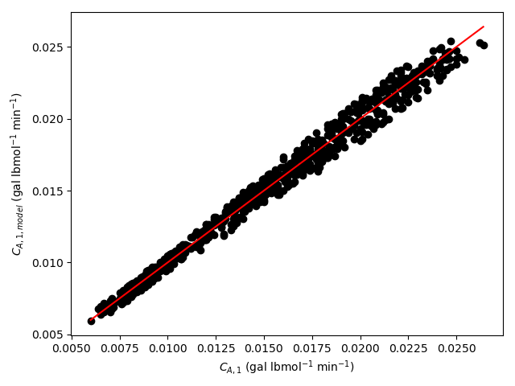{#fig-example_20_5_3_parity}

::: {#fig-example_20_5_3_residuals_plots layout-ncol=2}

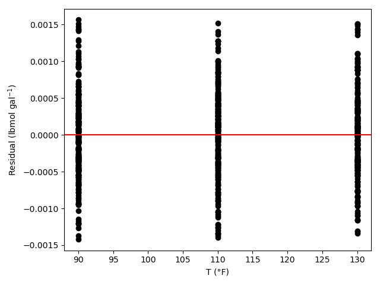

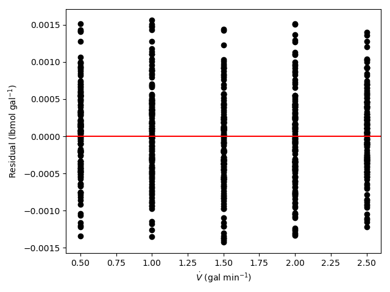

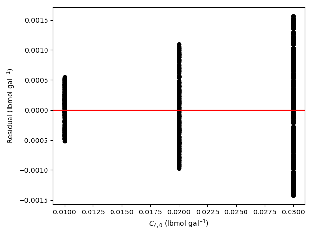

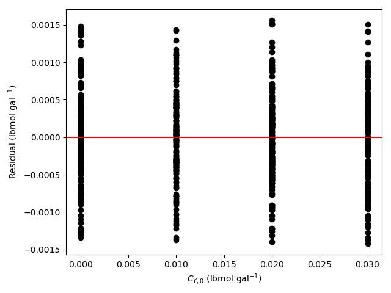

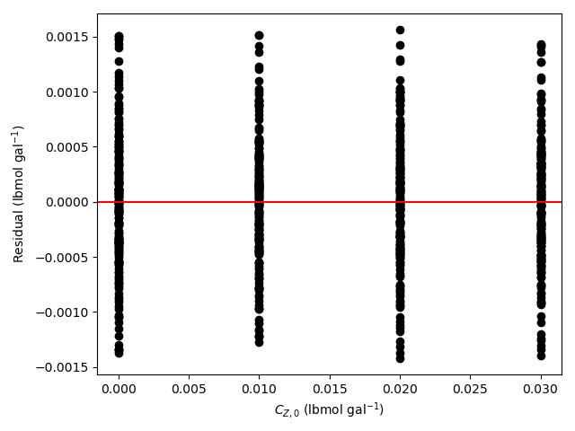

Residuals Plots.
:::

:::{.callout-tip collapse="true"}
## Click Here to See What an Expert Might be Thinking at this Point

The deviations of the data points from the line in the parity plot are not large, the deviations of the residuals about zero are random with no apparent trends, the coefficient of determination is close to 1, and the upper and lower limits of the 95% confidence intervals for $E_f$ and $E_r$ are close to the estimated parameter value. The uncertainties in $k_{0,f}$ and $k_{0,f}$ are slightly greater, but still acceptable. This indicates that the rate expression is acceptabley accurate.

:::

<center>**Assessment**</center>

When used with the rate expression parameters shown in @tbl-example_20_5_3_parameters, the accuracy of the proposed rate expression in describing the concentration and temperature dependence of the rate, within the range of concentrations and temperatures investigated, is acceptable.


#| echo: false
#| output: false
library(tidyverse)
library(knitr)
library(kableExtra)
source('./Code/fmt_tibble_col.R')
```

This chapter presents examples of kinetics data analysis using data generated in an isothermal BSTR. [Chapters -@sec-6_cstr_data_analysis], and [-@sec-6_pfr_data_analysis] illustrate kinetics data analysis using data generated in ideal CSTRs and PFR, respectively. Analysis using the full data set is preferred, and doing so is described in the first four examples that follow. [Example -@sec-example_19_5_5] illustrates using a spreadsheet for kinetics data analysis involving same-temperature data blocks, a linearized reactor model, and linear least squares parameter estimation. [Example -@sec-example_19_5_6] illustrates differential data analysis using same-temperature data blocks, an approximate reactor model, and a spreadsheet.

### Assessing a First-Order Rate Expression for a Liquid-Phase Reaction {#sec-example_19_5_1}

 include examples/reb_19_5_1/narrative.qmd >}}

 include examples/reb_19_5_1/equations.qmd >}}


#| echo: false
#| output: false
d <- read.csv('examples/reb_19_5_1/reb_19_5_1_data.csv')
# Experiment, T, CA0, t, CA
```

Note that these data were generated using the experimental design from [Example -@sec-example_18_6_1]. The first few data points are shown in @tbl-example_19_5_1_data. The full data set is available in the .csv file [reb_19_5_1_data.csv](examples/reb_19_5_1/reb_19_5_1_data.csv)


#| echo: false
#| warning: false
#| label: tbl-example_19_5_1_data
#| tbl-cap: First 8 experimental data points.
kbl(d[1:8,], format = "markdown", align = "cc", col.names = c('Experiment','T (°C)',
    'C~A,0~ (M)', 't~f~ (min)', 'C~A,f~ (M)'))
```

---

:::{.callout-tip collapse="true"}
## Click Here to See What an Expert Might be Thinking at this Point

This assignment presents kinetics data, describes the experiments used to generate them, and asks me to assess the accuracy of a proposed rate expression. These are characteristics of is a kinetics data analysis assigment, in this case one involving data from an isothermal BSTR. I'll begin by summarizing the assignment. I'll assign an appropriate variable symbol to each quantity provided in the narrative. I'll use a subscripted "0" to denote quantities at the start of the reaction, a subscripted "f" to denote quantities at the time the response was measured, a subscripted "CI,l" to denote the lower limit of a 95% confidence interval, and a subscripted "CI,u" to denote the upper limit of a 95% confidence interval.  I'll underline symbols that represent a set of values.

The adjusted experimental inputs were the temperature, initial concentration of A and the elapsed time at which the response was measured. The measured response was the concentration of A.

The assignment asks for the best estimates for the Arrhenius pre-exponential factor and activation energy. It also asks for an assessemnt of the accuracy of the rate expression. That makes the coefficient of determination, the uncertainties in the estimated parameters, a parity plot, and residuals plots quantities of interest, as well, since I'll need them to assess the accuracy of the rate expression.

:::

#### Assignment Summary

**Reactor System:** Isothermal, liquid-phase BSTR

**Reactor Schematic:**

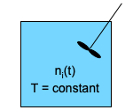{#fig-example_19_5_1_schematic}

**Quantities of Interest:** $k_0$, $k_{0,CI,l}$, $k_{0,CI,u}$, $E$, $E_{CI,l}$, $E_{CI,u}$, $R^2$, $\underline{C}_{A,f,expt}$ *vs.* $\underline{C}_{A,f,model}$ (as a parity plot), and $\underline{\epsilon}_{expt}$ *vs.* $\underline{T}$, *vs.* $\underline{C}_{A,0}$, and *vs.* $\underline{t}_{f}$ (as residuals plots).

**Given and Known Constants**: $V = 1\text{ L}$, $R$ = 8.314 x 10^-3^ kJ mol^-1^ K^-1^.

**Adjusted Experimental Inputs**: $\underline{T}$, $\underline{C}_{A,0}$, and $\underline{t}_{f}$

**Experimental Response**: $\underline{C}_{A,f}$

#### Mathematical Formulation of the Calculations

:::{.callout-tip collapse="true"}
## Click Here to See What an Expert Might be Thinking at this Point

I know I'll need a reactor model, so I'll generate that first. In kinetics experiments the reactor operates isothermally, so the mole balance design equations can be solved independently of the energy balances. The composition at the time the response is measured can be calculate by solving the mole balances, so an energy balance on the reacting fuid and an energy balance on a heat exchange fluid do not need to be included among the reactor design equations. Only one reaction is takeing place, so the general form of the mole balance takes the form given in @eq-bstr_mole_bal_one_reaction. It can be used to write a mole balances for A and Z.

$$
\frac{dn_i}{dt} = \nu_i r V
$$

The BSTR reactor design equations are IVODEs, so the model must include initial values, a stopping criterion and a derivatives function (see @sec-apndx_solve_ivodes). I can define $t=0$ to be the instant the experiment started. The initial values then equal the molar amounts of A and Z at that time. Reagent Z was not present at the start of any of the experiments being analyzed here, so its initial value is zero. For each experiment I know the elapsed time at which the response was measured. I want to calculate the response at that time, so I will use $t_f$ as the stopping criterion.

:::

<center>**BSTR Model**</center>

[Design Equations]{.underline}

$$
\frac{dn_A}{dt} = -rV \tag{3}
$$

$$
\frac{dn_Z}{dt} = rV \tag{4}
$$

[Initial Values and Stopping Criterion]{.underline}

| Variable | Initial Value | Final Value |
|:-------|:-------:|:-------:|
| $t$ | $0$ | $t_f$ |
| $n_A$ | $n_{A,0}$ |  |
| $n_Z$ | $0$ | |

: Initial values and stopping criterion for solving the design equations, equations (3) and (4). {#tbl-example_19_5_1_initial_values tbl-colwidths="[20, 40, 40]"}

:::{.callout-tip collapse="true"}
## Click Here to See What an Expert Might be Thinking at this Point

I'll need to write the derivatives function, and it must receive the values of the independent and dependent variables at the start of an integrations step as its only arguments. It must return the corresponding values of the derivatives of $n_A$ and $n_Z$ with respect to $t$. 

Within the derivatives function the given and known constants and the arguments are available. Before the derivatives can be evaluated, any other quantities appearing in them must be calculated. The only other quantity in the design equations here is the rate, which can be calculated using equation (2), but to do that, the concentration of A and the rate coefficient need to be calculated. 

The concentration of A can be calculated using the defining equation for concentration. The Arrhenius expression, @eq-arrhenius, can be used to calculate the rate coefficient, but to do so the Arrhenius pre-exponential factor, activation energy, and the temperature are needed. As the predicted responses model is fit to the experimental data, the pre-exponential factor and activation energy will be changing. The temperature will be different depending upon which experimental data point is being analyzed. Thus, the pre-exponential factor, activation energy and temperature are not known and cannot be calculated, so they must be made available to the derivatives function.

:::

[Derivatives Function]{.underline}

$\qquad$ Arguments: $t$, $n_A$, and $n_Z$.

$\qquad$ Must be Available: $k_0$, $E$, and $T$.

$\qquad$ Return values: $\frac{dn_A}{dt}$, and $\frac{dn_Z}{dt}$.

$\qquad$ Algorithm:

$$
k = k_0\exp{\left( \frac{-E}{RT}\right)} \tag{5}
$$

$$
C_A = \frac{n_A}{V} \tag{6}
$$

$$
r = kC_A \tag{2}
$$

$$
\frac{dn_A}{dt} = -rV \tag{3}
$$

$$
\frac{dn_Z}{dt} = rV \tag{4}
$$

:::{.callout-tip collapse="true"}
## Click Here to See What an Expert Might be Thinking at this Point

The last component of the BSTR model is a function that solves the design equations. I'll use an IVODE solver to do that, and I'll need to provide it with the initial values, stopping criterion, and the derivatives function, above. The initial molar amount of A can be calculated from its initial concentration, but that will be varying from one experiment to the next. Also, the time at which the response was measured will vary from one experiment to the next. Therefore, the initial concentration of A and the time at which the response was measured for the experiment being analyzed must be provided to the reactor model as input.

:::

[BSTR Reactor Function]{.underline}

$\qquad$ Arguments: $T$, $C_{A,0}$ and $t_f$.

$\qquad$ Return Values: $\underline{t}$, $\underline{n}_A$, and $\underline{n}_B$

$\qquad$ Algorithm:

1. Make $T$ globally available.

2. Calculate unknown initial and final values.

$$
n_{A,0} = C_{A,0}V \tag{7}
$$

3. Call an IVODE solver passing the initial values, stopping criterion and derivatives function as arguments.

4. Receive corresponding sets of values of $t$, $n_A$, and $n_B$ that span the range from $t=0$ to $t=t_f$ from the IVODE solver and return them.

:::{.callout-tip collapse="true"}
## Click Here to See What an Expert Might be Thinking at this Point

The reactor model cannot be fit to the experimental data. Instead it must be used to create a predicted response model that relates the adjusted experimental inputs for an experiment to the predicted response for that experiment.

To do that, the BSTR model above can be solved for any one experiment. Doing so will yield $\underline{t}$, $\underline{n}_A$, and $\underline{n}_Z$. The predicted response, the final concentration of A, can then be calculated using the defining equation for concentration.

I'll use a numerical fitting function to estimate the parameters in the rate expression. One of the things I'll need to provide to it is a predicted responses function that calculates the predicted response for each experiment as just described, and then returns the results. I must write the predicted responses function, and doing so is fairly straightforward. 

The predicted responses function must receive the adjusted experimental inputs for all of the experiments and values for each of the parameters appearing in the proposed rate expression as its only arguments. It must return the predicted responses for all of the experiments. All it needs to do is go through the experiments one by one and calculate the predicted response as just described. There are two important things to remember when doing this. One is to immediately make the rate expression parameters available to the derivatives function. The second is to make the temperature available to the derivatives function before solving the reactor design equations.

:::

<center>**Predicted Responses Function**</center>

[Arguments:]{.underline} $\underline{T}$, $\underline{C}_{A,0}$, $\underline{t}_{f}$, $k_0$, and $E$.

[Return values:]{.underline} $\underline{C}_{A,f,model}$

[Algorithm:]{.underline}

1. Make $k_0$ and $E$ available to the derivatives function.
2. For each experiment in the data set
    a. Call the BSTR model function, passing $C_{A,0}$ and $t_f$ as arguments, to solve the BSTR design equations and receive $\underline{t}$, $\underline{n}_A$, and $\underline{n}_Z$.
    b. Calculate the predicted response.

$$
C_{A,f,model} = \frac{\underline{n}_A\big\vert_{t=t_f}}{V} \tag{8}
$$

3. Return the set of model-predicted responses, $\underline{C}_{A,f,model}$.

:::{.callout-tip collapse="true"}
## Click Here to See What an Expert Might be Thinking at this Point

Now that I have a predicted responses function, I can use a numerical fitting function from a software package to fit the predicted response model to the experimental data. I will need to provide four things to it:

* an initial guess for each of the rate expression parameters
* the adjusted experimental inputs for all of the experiments
* the experimental responses for all of the experiments
* the predicted responses function

Assuming the numerical fitting function is successful, it will return the estimated value of $k_0$, the lower and upper limits of its 95% confidence interval, $k_{0,CI,l}$ and $k_{0,CI,u}$, the estimated value of $E$, the lower and upper limits of its 95% confidence interval, $E_{CI,l}$ and $E_{CI,u}$, and the coefficient of determination, $R^2$.

I'm asked to assess the accuracy of the resulting model. To help with that, I can generate a parity plot and residuals plots. To do so I will use the estimated values of $k_0$ and $E$ to calculate the model-predicted responses for all of the experiments. Plotting the predicted responses against the corresponding experimental responses will result in the partiy plot. I can calculate experiment residuals, $\epsilon_{expt}$, by taking the difference between the experiment responses and the model-predicted responses. Plotting the experimental residuals against the corresponding values of each or the experimental adjusted inputs will yield a set of residuals plots.

:::

<center>**Parameter Estimation**</center>

1. Set an initial guess for the parameters ($k_{0,guess}$ and $E_{guess}$)
2. Call a numerical fitting function passing the adjusted experimental inputs for all of the experiments ($\underline{T}$, $\underline{C}_{A,0}$, and $\underline{t}_{f}$), the experimental responses ($\underline{C}_{A,f}$), the initial guess for the parameters from step 1, and the predicted responses function, above, as arguments, and receive the parameter estimates ($k_0$ and $E$), their 95% confidence intervals ($k_{0,CI,l}$, $k_{0,CI,u}$, $E_{CI,l}$, and $E_{CI,u}$), and the coefficient of determination, $R^2$.

<center>**Generation of Assessment Graphs**</center>

1. Call the predicted responses function above, passing the estimated parameters ($k_0$ and $E$) and the adjusted experimental inputs for all of the experiments ($\underline{T}$, $\underline{C}_{A,0}$, and $\underline{t}_{f}$) as arguments and receive the predicted responses for all of the experiments ($\underline{C}_{A,f,model}$).
2. Calculate the experiment residuals.

$$
\underline{\epsilon}_{expt} = \underline{C}_{A,f} - \underline{C}_{A,f,model} \tag{9}
$$

3. Generate a parity plot showing $\underline{C}_{A,f,expt}$ *vs.* $\underline{C}_{A,f,model}$.
4. Generate residuals plots showing $\underline{\epsilon}_{expt}$ versus  *vs.* $\underline{T}$, *vs.* $\underline{C}_{A,0}$, and *vs.* $\underline{t}_{f}$.

:::{.callout-tip collapse="true"}
## Click Here to See What an Expert Might be Thinking at this Point

At this point, I have everything I need to calculate the quantities of interest. I'll need to read in the data, perform the calculations and present the results.

:::

<center>**Perform the Calculations**</center>

1. Read the adjusted experimental inputs and experimental responses data from the file, [reb_19_5_1_data.csv]('examples/reb_19_5_1/reb_19_5_1_data.csv').
2. Estimate the parameters and generate the assessment graphs as described above.
3. Display the results and/or save them to a file.

#### Results and Discussion


#| echo: false
#| output: false
d <- read.csv('examples/reb_19_5_1/reb_19_5_1_results.csv')
# item, value, units
d <- fmt_tibble_col(d, 2, 3, 2, 2)
```

The calculations were performed as described above with one significant exception. Because $k_0$ can have a wide range of values, it is difficult to make a good initial guess for its value, and if the guess is not sufficiently close to the actual value, the fitting function can fail. Therefore, the the base-10 log of $k_0$ was estimated, as described in [Example -@sec-example_18_6_2]. As a consequence the predicted responses function received the value of the base-10 log of $k_0$ as an argument, from which $k_0$ was calculated and made available to all other functions. In addition, the numerical fittng function returned the estimated values of the base-10 log of $k_0$, the base-10 log of $k_{0,CI,l}$, and the base-10 log of $k_{0,CI,u}$. These were then used to calculate $k_0$, $k_{0,CI,l}$, and $k_{0,CI,u}$. The results are as follow:

k~0~:  d$value[1]`  d$units[1]`, 95% CI [ d$value[2]`,  d$value[3]`]  
E:  d$value[4]`  d$units[4]`, 95% CI [ d$value[5]`,  d$value[6]`]  
R^2^:  d$value[7]`

The resulting parity plot and residuals plots are presented in @fig-example_19_5_1_parity and @fig-example_19_5_1_residual.

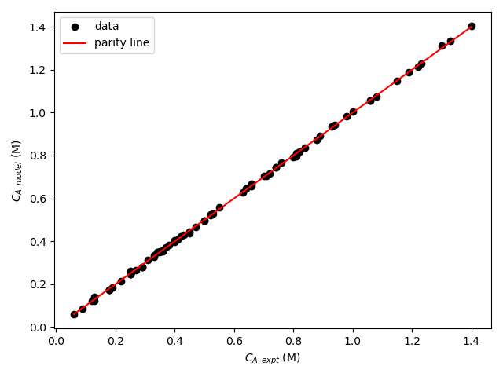{#fig-example_19_5_1_parity width='60%'}

::: {#fig-example_19_5_1_residual layout-ncol=2}

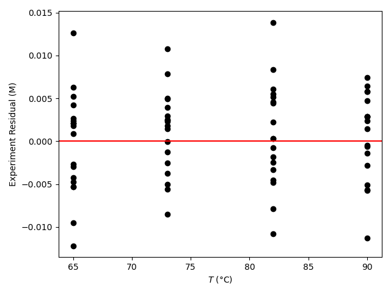{width=60%}

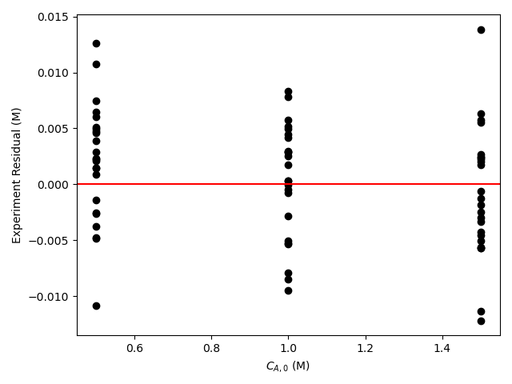{width=60%}

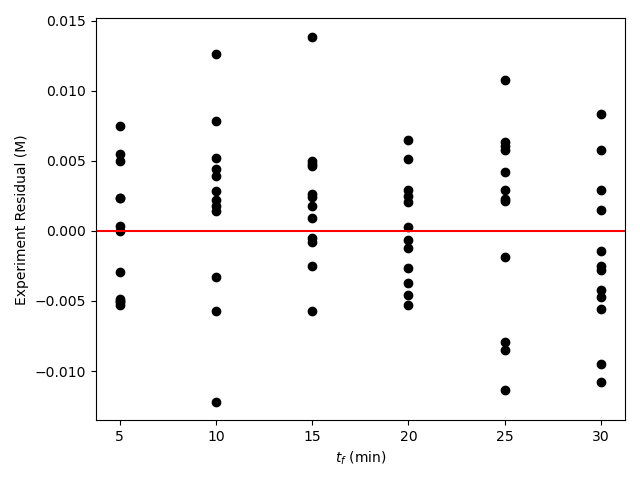{width=60%}

Experiment residuals plotted against each of the adjusted experimental inputs, $T$, $C_{A,0}$, and $t_f$.

:::

The proposed rate expression offers a very accurate representation of the experimental data and can be accepted for use in the range of temperature and composition studied. The coefficient of determination is essentially equal to 1.0, the upper and lower limits of the confidence intervals for both parameters are close to their estimated values, the data in the parity plot fall very close to the parity line, and the experiment residuals scatter randomly about zero in all three residuals plots.

### Assessing a Second-Order Rate Expression for a Gas-Phase Reaction {#sec-example_19_5_2}

 include examples/reb_19_5_2/narrative.qmd >}}

 include examples/reb_19_5_2/equations.qmd >}}


#| echo: false
#| output: false
d <- read.csv("examples/reb_19_5_2/reb_19_5_2_data.csv")
# T, PA0, PB0, t, fA
```

The first few data points are shown in @tbl-example_19_5_2_data. The full data set is available in the file [reb_19_5_2_data.csv](examples/reb_19_5_2/reb_19_5_2_data.csv).


#| echo: false
#| warning: false
#| label: tbl-example_19_5_2_data
#| tbl-cap: First 5 of the 189 experimentally generated data.
kbl(d[1:5,], format = "markdown", align = "cc", 
  col.names = c('T (°C)', 'P~A,0~ (atm)', 'P~B,0~ (atm)', 't~f~ (min)', 
  'f~A~'))
```

---

:::{.callout-tip collapse="true"}
## Click Here to See What an Expert Might be Thinking at this Point

I can see that this is a kinetics data analysis problem involving an isothermal BSTR because it provides experimental data, describes the experiments that generated the data, and asks me to assess a proposed rate expression. I'll begin by summarizing the assignment. I'll assign appropriate variables symbols to each quantity that is provided. I'll use a subscripted "0" to denote quantities at the start of the experiment, a subscripted "f" to denote quantities at the time the response was measured, and I'll underline variables representing a set of values of that quantity.

From the problem narrative I know that the temperature, initial pressures of A and B, and the final time are the adjusted experimental inputs in the experioment. The response is the conversion of A. 

The assignment asks for an assessment of the accuracy of the proposed rate expression. To do that I'll estimate the pre-exponential factor, its 95% confidence interval, the activation energy, and its 95% confidence interval. I'll also calculate the coefficient of determination, so I'll list all of these as quantities of interest, using a subscripted "CI,l" and "CI,u" to denote the uppser and lower limits of the confidence intervals. I'll also make a parity plot and residuals plots, so I will additionally list the quantities needed for those graphs as being of interest.

:::

#### Assignment Summary

**Reactor System:** Isothermal, gas-phase BSTR

**Reactor Schematic:**

{#fig-example_19_5_2_schematic}

**Quantities of Interest:** $k_0$, $k_{0,CI,l}$, $k_{0,CI,u}$, $E$, $E_{CI,l}$, $E_{CI,u}$, $R^2$, $\underline{f}_A$ *vs.* $\underline{f}_{A,model}$ (as a parity plot), and $\underline{\epsilon}_{expt}$ *vs.* $\underline{T}$, *vs.* $\underline{P}_{A,0}$, *vs.* $\underline{P}_{B,0}$, and *vs.* $\underline{t}_f$ (as residuals plots).

**Given and Known Constants:** $V = 500\text{ cm}^3$.

**Adjusted Experimental Inputs:** $\underline{T}$, $\underline{P}_{A,0}$, $\underline{P}_{B,0}$, and $\underline{t}_f$.

**Experimental Response:** $\underline{f}_A$.

#### Mathematical Formulation of the Calculations

:::{.callout-tip collapse="true"}
## Click Here to See What an Expert Might be Thinking at this Point

I know that I'm going to need a model for the isothermal BSTR used in the experiments, so I'll develop that first. I only need the mole balance design equations because they can be solved independently of the energy balances when the reactor is isothermal, and solving them will give me everything I need to calculate the predicted conversion.

I'll write a mole balance on each of the reagents. The general form of the BSTR mole balance is given in @eq-bstr_mole_balance. Since there is only one reaction, the summation reduces to a single term and I don't need subscripts denoting the reaction.

$$
\frac{dn_i}{dt} = V \sum_j \nu_{i,j}r_j \qquad \Rightarrow \qquad \frac{dn_i}{dt} = \nu_i r V
$$

The design equations are IVODEs that I'll solve numerically, so the reactor model must also include initial values, a stopping criterion, and a derivatives function. I can define the instant that the experiment starts to be $t=0$. In that case the initial values are simply the molar amounts of each reagent at the start of the experiment. Here, the initial molar amounts of Y and Z were always equal to zero. I know the time when the response was measured, and I want to calculate the conversion at that time, so I'll use it as the stopping criterion.

:::

<center>**BSTR Model**</center>

[Design Equations]{.underline}

$$
\frac{dn_A}{dt} = -Vr \tag{3}
$$

$$
\frac{dn_B}{dt} = -Vr \tag{4}
$$

$$
\frac{dn_Y}{dt} = Vr \tag{5}
$$

$$
\frac{dn_Z}{dt} = Vr \tag{6}
$$

[Initial Values and Stopping Criterion]{.underline}

| Variable | Initial Value | Final Value |
|:-------|:-------:|:-------:|
| $t$ | $0$ | $t_f$ |
| $n_A$ | $n_{A,0}$ |  |
| $n_B$ | $n_{B,0}$ |  |
| $n_Y$ | $0$ | |
| $n_Z$ | $0$ | |

: Initial values and stopping criterion for solving the design equations, (3) through (6). {#tbl-example_19_5_2_initial_values tbl-colwidths="[20, 40, 40]"}

:::{.callout-tip collapse="true"}
## Click Here to See What an Expert Might be Thinking at this Point

I will need to write the derivatives function. It must receive the values of the independent and dependent variables ($t$, $n_A$, $n_B$, $n_Y$, and $n_Z$) at the start of an integration step as its only arguments, and it must return the values of the derivatives of the dependent variables with respect to the independent variable ($\frac{dn_A}{dt}$, $\frac{dn_B}{dt}$, $\frac{dn_Y}{dt}$, and $\frac{dn_Z}{dt}$).

Within the derivatives function the given and known constants and the arguments will be available. Any other quantities appearing in the design equations must be calculated before the derivatives can be evaluated using equations (3) through (6). The only unknown quantity in the design equations is $r$, and it can be calculated using equation (2).

To calculate the rate using equation (2), the pre-exponential factor, activation energy, temperature, and partial pressures of A and B are needed. The partial pressures can be calculated using the ideal gas law, but that also requires the temperature.

As the predicted responses model is fit to the experimental data, the pre-exponential factor and the activation energy will be changing, and as different experiments are analyzed, the temperature will be changing. Therefore the kinetics parameters and the temperature cannot be calculated, and will need to be made available to the derivatives function.

:::

[Derivatives Function]{.underline}

$\qquad$ Arguments: $t$, $n_A$, $n_B$, $n_Y$, and $n_Z$.

$\qquad$ Must be Available: $k_0$, $E$, and $T$.

$\qquad$ Return values: $\frac{dn_A}{dt}$, $\frac{dn_B}{dt}$, $\frac{dn_Y}{dt}$, and $\frac{dn_Z}{dt}$.

$\qquad$ Algorithm:

$$
k = k_0 \exp{ \left( \frac{-E}{RT}  \right)} \tag{7}
$$

$$
P_A = \frac{n_A RT}{V} \tag{8}
$$

$$
P_B = \frac{n_B RT}{V} \tag{9}
$$

$$
r = kP_AP_B \tag{2}
$$

$$
\frac{dn_A}{dt} = -Vr \tag{3}
$$

$$
\frac{dn_B}{dt} = -Vr \tag{4}
$$

$$
\frac{dn_Y}{dt} = Vr \tag{5}
$$

$$
\frac{dn_Z}{dt} = Vr \tag{6}
$$

:::{.callout-tip collapse="true"}
## Click Here to See What an Expert Might be Thinking at this Point

The last think I need for the reactor model is a function that will solve the design equations. I'll use an IVODE solver for that. I'll need to provide the initial values and stopping criterion in @tbl-example_19_5_2_initial_values to it along with the the derivatives function above. I can calculate the initial molar amounts of A and B for any experiment using their initial partial pressures, but since the partial pressures change from one experiment to the next, the initial partial pressures for the experiment being analyzed will need to be provided, and since their calculation requires the temperature, it, too must be provided. Similarly, the stopping criterion, that is the time at which the response was measured, also changes from experiment to experiment and will need to be provided as input to the reactor model.

:::

[BSTR Model Function]{.underline}

$\qquad$ Arguments: $T$, $P_{A,0}$, $P_{B,0}$, and $t_f$.

$\qquad$ Return Values: $\underline{t}$, $\underline{n}_A$, $\underline{n}_B$, $\underline{n}_Y$, and $\underline{n}_Z$.

$\qquad$ Algorithm:

1. Calculate the unknown initial values.

$$
n_{A,0} = \frac{P_{A,0}V}{RT} \tag{10}
$$

$$
n_{B,0} = \frac{P_{B,0}V}{RT} \tag{11}
$$

2. Call an IVODE solver passing the initial values, stopping criterion and derivatives function as arguments.

3. Receive corresponding sets of values of $t$, $n_A$, $n_B$, $n_Y$, and $n_Z$ that span the range from $t=0$ to $t=t_f$ from the IVODE solver and return them.

:::{.callout-tip collapse="true"}
## Click Here to See What an Expert Might be Thinking at this Point

I need to use the BSTR model above to create a predicted responses model that can be fit to the experimental data. To do that the BSTR model can be solved for any one experiment to get $\underline{t}$, $\underline{n}_A$, $\underline{n}_B$, $\underline{n}_Y$, and $\underline{n}_Z$. The final molar amount of A can then be used calculate the conversion.

I will use numerical fitting func to estimate the unknown parameters, $k_0$, and $E$. I will need to provide it with a guess for $k_0$, and $E$, the set of adjusted experimental inputs being analyzed, the corresponding set of experimental responses and a predicted responses function that I will need to write. 

The predicted responses function must receive the rate expression parameters ($k_0$, and $E$) and adjusted experimental inputs for all of the experiments ($\underline{T}$, $\underline{P}_{A,0}$, $\underline{P}_{B,0}$, and $\underline{t}_f$) as its only arguments. It must calculate and return the model-predicted responses for all of the experiments ($\underline{f}_{A,model}$). The predicted responses function simply needs to go through the experiments one by one and calculate the predicted conversion of A as just described. Before it starts going through the experiments it needs to make the rate expression parameters available to the derivatives function, and each time it starts to analyze an experiment it needs to make the temperature available to the derivatives function.

:::

<center>**Predicted Responses Function**</center>

[Arguments:]{.underlline} $\underline{T}$, $\underline{P}_{A,0}$, $\underline{P}_{B,0}$, $\underline{t}_f$, $k_0$, and $E$.

[Return values:]{.underlline} $\underline{f}_{A,model}$

[Algorithm:]{.underlline}

1. Make $k_0$ and $E$ available to the derivatives function.
2. For each experiment in the data set
    a. Make the temperature available to the derivatives function.
    b. Call the BSTR model function passing $T$, $P_{A,0}$, $P_{B,0}$, and $t_f$ as arguments to solve the design equations and receive $\underline{t}$, $\underline{n}_A$, $\underline{n}_B$, $\underline{n}_Y$, and $\underline{n}_Z$.
    c. Calculate the predicted response.

$$
n_{A,0} = \frac{P_{A,0}V}{RT} \tag{10}
$$

$$
f_{A,model} = \frac{n_{A,0} - n_A\big\vert_{t=t_f}}{n_{A,0}} \tag{12}
$$

3. Return the set of model-predicted responses, $\underline{f}_{A,model}$.

:::{.callout-tip collapse="true"}
## Click Here to See What an Expert Might be Thinking at this Point

I can use a numerical fitting function to fit the predicted response model to the experimental data. I will need to provide it with a guess for the rate expression parameters, the adjusted experimental inputs for all of the experiments, the experimental responses for all of the experiments, and the predicted responses function.

Assuming it is successful, the numerical fitting function will return the estimated values of $k_0$, and $E$, the lower and upper limits of their 95% confidence interval, $k_{0,CI,ll}$ $k_{0,CI,ul}$, $E_{CI,ll}$, and $E_{CI,ul}$ and the coefficient of determination, $R^2$. 

After estimating $k_0$, and $E$, I can calculate the model-predicted responses and use them to generate a parity plot of the experimental conversion *vs.* the model-predicted conversion. I can also calculate the differences between the experimental and model-predicted conversions, that is the experiment residuals, and use them to generate residuals plots of the residuals versus each of the adjusted experimental inputs.

:::

<center>**Parameter Estimation**</center>

1. Set an initial guess for the parameters ($k_{0,guess}$, and $E_{guess}$)
2. Call a numerical fitting function passing the adjusted experimental inputs for all of the experiments ($\underline{T}$, $\underline{P}_{A,0}$, $\underline{P}_{B,0}$, and $\underline{t}_f$), the experimental responses ($\underline{f}_A$), the initial guess for the parameters from step 1, and the predicted responses function, above, as arguments, and receive the parameter estimates ($k_0$, and $E$), their 95% confidence intervals ($k_{0,CI,l}$, $k_{0,CI,u}$, $E_{CI,l}$, and $E_{CI,u}$), and the coefficient of determination, $R^2$.

<center>**Generation of Assessment Graphs**</center>

1. Call the predicted responses function above, passing the estimated parameters ($k_0$, and $E$) and the adjusted experimental inputs for all of the experiments ($\underline{T}$, $\underline{P}_{A,0}$, $\underline{P}_{B,0}$, and $\underline{t}_f$) as arguments and receive the predicted responses for all of the experiments ($\underline{f}_{A,model}$).
2. Calculate the experiment residuals.

$$
\underline{\epsilon}_{expt} = \underline{f}_A - \underline{f}_{A,model} \tag{13}
$$

3. Generate a parity plot showing $\underline{f}_A$ vs. $\underline{f}_{A,model}$.
4. Generate residuals plots showing $\underline{\epsilon}_{expt}$ *vs.* $\underline{T}$, *vs.* $\underline{P}_{A,0}$, *vs.* $\underline{P}_{B,0}$, and *vs.* $\underline{t}_f$.

:::{.callout-tip collapse="true"}
## Click Here to See What an Expert Might be Thinking at this Point

At this point, I have everything I need to calculate the quantities of interest. I'll need to read in the data, perform the calculations and report the results.

:::

<center>**Perform the Calculations**</center>

1. Read the adjusted experimental inputs and experimental responses data from the file, [reb_19_5_2_data.csv]('examples/reb_19_5_2/reb_19_5_2_data.csv').
2. Estimate the parameters and generate the assessment graphs as described above.
4. Display the results and/or save them to a file.

#### Results and Discussion


#| echo: false
#| output: false
d <- read.csv('examples/reb_19_5_2/reb_19_5_2_results.csv')
# item, value, units_
d <- fmt_tibble_col(d, 2, 3, 2, 2)
```

The calculations were performed as described above, and the results are as follow. 

k~0~:  d$value[1]`  d$units[1]`, 95% CI [ d$value[2]`,  d$value[3]`]  
E:  d$value[4]`  d$units[4]`, 95% CI [ d$value[5]`,  d$value[6]`]  
R^2^:  d$value[7]`

@fig-example_19_5_2_parity and @fig-example_19_5_2_residuals show the partiy and residuals plots, respectively.

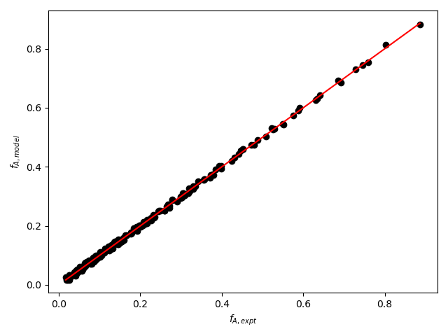{#fig-example_19_5_2_parity width="70%"}

::: {#fig-example_19_5_2_residuals layout-ncol=2}

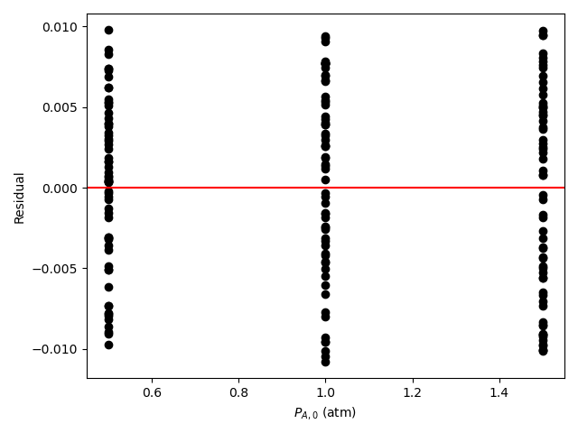

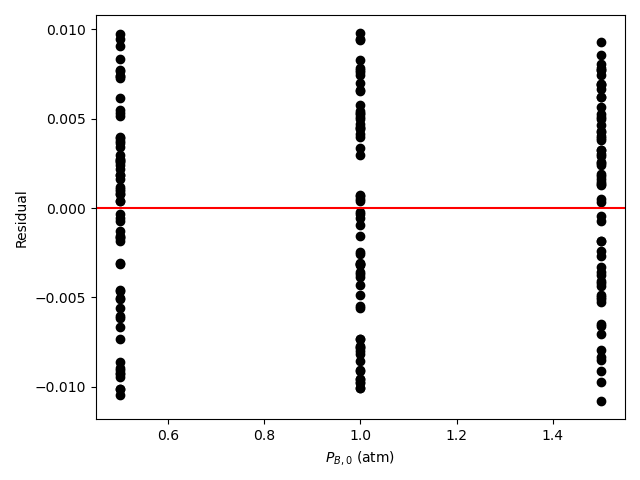

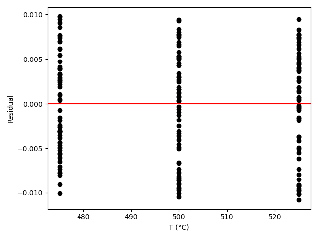

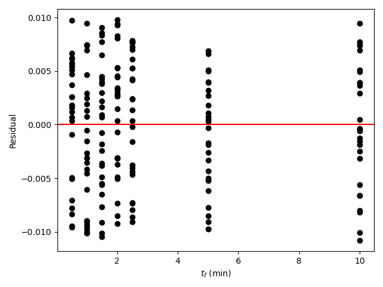

Residuals plots for $P_{A,0}$, $P_{B,0}$, $T$, and $t_f$.

:::

**Assessment**

:::{.callout-tip collapse="true"}
## Click Here to See What an Expert Might be Thinking at this Point

I now need to assess the accuracy of the model and make a decision whether to accept it, recommend additional experiments, or reject it. Here, all of the accuracy criteria are satisfied.

* The coefficient of determination is close to 1.0.
* The upper and lower limits of the 95% confidence intervals for $k_0$ and $E$ are close to the estimated values.
* The data points in the parity plot all lie close to the parity line.
* The data points in the residuals plots scatter randomly about zero, and no apparent trend can be seen in the deviations.

These results indicate that the model is accurate and should be accepted.

:::

The rate expression in equation (2) is accurate when the Arrhenius expression is used to represent the temperature dependence of $k$. Equation (2) should be accepted as the rate expression with  d$value[1]`  d$units[1]` as the pre-exponential factor and  d$value[4]`  d$units[4]` as the activation energy.

### Assessing a Gas-Phase Rate Expression Using Total Pressure as the Response {#sec-example_19_5_3}

 include examples/reb_19_5_3/narrative.qmd >}}

 include examples/reb_19_5_3/equations.qmd >}}


#| echo: false
#| output: false
d <- read.csv("examples/reb_19_5_3/reb_19_5_3_data.csv")
 # T PA0,t,P
```

The first few data points are shown in @tbl-example_19_5_3_data. The full data set is available in the file [reb_19_5_3_data.csv](examples/reb_19_5_3/reb_19_5_3_data.csv).


#| echo: false
#| warning: false
#| label: tbl-example_19_5_3_data
#| tbl-cap: First 5 experimental data points.
kbl(d[1:5,], format = "markdown", align = "ccc", col.names = c('T (°C)', 'P~A,0~ (atm)', 
  't~f~ (min)', 'P~f~ (atm)'))
```

---

:::{.callout-tip collapse="true"}
## Click Here to See What an Expert Might be Thinking at this Point

This is a kinetics data analysis assignment where an isothermal, gas-phase BSTR was used to generate data and I'm asked to assess the accuracy of a proposed rate expression using those data. The experimentally adjusted inputs were the temperature, the initial partial pressure of reagent A, and the time at which the response, i. e. the total pressure, was measured.

To assess the accuracy of the rate expression I need to estimate the rate expression parameters, their 95% confidence intervals, and the coefficient of determination. Assuming that the rate coefficient displays Arrhenius temperature dependence, the rate expresson parameters are $k_0$ and $E$. I'll also want to make a parity plot and model plots.

I'll begin by summarizing the assignment using appropriate variable symbols for each quantity with a subscripted "0" denoting a value a the start of the experiment, a subscripted "f" denoting the time when the response was measured, subscripted "CI,l" and "CI,u" to denote the limits of the 95% confidence interval and an underline to denote sets of values.

:::

#### Assignment Summary

**Reactor System:** Isothermal, gas phase BSTR.

**Reactor Schematic:**

{#fig-example_19_5_3_schematic}

**Items of Interest:** $k_0$, $k_{0,CI,l}$, $k_{CI,u}$, $E$, $E_{CI,l}$, $E_{CI,u}$, $R^2$, $\underline{P}_f$ *vs.* $\underline{P}_{f,model}$ (as a parity plot), $\underline{\epsilon}_{expt}$ *vs.* $T$, *vs.* $P_{A,0}$ and *vs.* $t_f$ (as residuals plots).

**Given and Known Constants:** $V$ = 100 cm^3^, $P_0$ = 6 atm, and $R$ = 82.06 cm^3^ atm mol^-1^ K^-1^ = 1.987 x 10^-3^ kcal mol^-1^ K^-1^.

**Adjusted Experimental Inputs:** $\underline{T}$, $\underline{P}_{A,0}$ and $\underline{t}_f$

**Experimental Response:** $\underline{P}_f$

#### Mathematical Formulation of the Analysis

:::{.callout-tip collapse="true"}
## Click Here to See What an Expert Might be Thinking at this Point

I know I will need a model for the experimental BSTR, so I'll generate that first. The experimental reactor operates isothermally, and when that is true, the mole balance design equations can be solved independently of any other reactor design equations. Since I can calculate everything I need using the mole balances, they are the only equations I'll include among the design equations. The general form of the BSTR mole balance is given in @eq-bstr_mole_balance, but here, since there is only one reaction, the summation becomes a single term and the subscripts denoting the reaction are not needed. I'll write a mole balance for each reagent in the system.

$$
\frac{dn_i}{dt} = V \nu_ir
$$

The mole balances are IVODEs, so I will need initial values, a stopping criterion and a derivatives function in order to solve them numerically. I can define $t=0$ to be the instant the reaction begins, in which case the inital values are the molar amounts of each reagent at that time. In these experiments the initial molar amount of Z was always zero. The elapsed time when the total pressure was measured is known for each experiment, and I'll use as the stopping criterion because I want to calculate the total pressure at that time.

:::

<center>**BSTR Model**</center>

[Design Equations]{.underline}

$$
\frac{dn_A}{dt} = -rV \tag{3}
$$

$$
\frac{dn_B}{dt} = -rV \tag{4}
$$

$$
\frac{dn_Z}{dt} = rV \tag{5}
$$

[Initial Values and Stopping Criterion]{.underline}

| Variable | Initial Value | Stopping Criterion |
|:-------|:-------:|:-------:|
| $t$ | $0$ | $t_f$ |
| $n_A$ | $n_{A,0}$ |  |
| $n_B$ | $n_{B,0}$ |  |
| $n_Z$ | $0$ | |

: Initial values and stopping criterion for solving equations (3) through (5). {#tbl-example_19_5_3_initial_values tbl-colwidths="[20, 40, 40]"}

:::{.callout-tip collapse="true"}
## Click Here to See What an Expert Might be Thinking at this Point

I'll need to write a derivatives function. It will have access to the given and known constants from the assignment summary, and it will be passed the values of the independent variable, $t$, and the dependent variables, $n_A$, $n_B$, and $n_Z$, at start of an integration step. It must evaluate and return the derivatives in the design equations. Before that can be done, any other quantities appearing in the design equations must be calculated.

In this assignment the only other quantity in equations (3) through (5) is the rate, and it can be calculated using equation (2). In otder to do that, $k$, $P_A$, and $P_B$ must be calculated. $P_A$ and $P_B$ can be calculated using the ideal gas law, but the temperature will also be needed, and it varies from one experiment to the next. Also, as the predicted responses model is being fit to the experimental data, the pre-exponential factor and the activation energy will be varying. For that reason $k_0$, $E$, an $T$ will need to be made available to the derivatives function so the rate coefficient can be calculated using the Arrhenius expression.

:::

[Derivatives Function]{.underline}

$\qquad$ Arguments: $t$, $n_A$, $n_B$, and $n_Z$.

$\qquad$ Must be Available: $k_0$, $E$, and $T$.

$\qquad$ Return values: $\frac{dn_A}{dt}$, $\frac{dn_B}{dt}$, and $\frac{dn_Z}{dt}$.

$\qquad$ Algorithm:

$$
P_A = \frac{n_ART}{V} \tag{6}
$$

$$
P_B = \frac{n_BRT}{V} \tag{7}
$$

$$
k = k_0 \exp{ \left( \frac{-E}{RT} \right)} \tag{8}
$$

$$
r = kP_A\sqrt{P_B} \tag{2}
$$

$$
\frac{dn_A}{dt} = -rV \tag{3}
$$

$$
\frac{dn_B}{dt} = -rV \tag{4}
$$

$$
\frac{dn_Z}{dt} = rV \tag{5}
$$

:::{.callout-tip collapse="true"}
## Click Here to See What an Expert Might be Thinking at this Point

Finally I'll write a BSTR model function that solves the design equations. I'll use an IVODE solver to do so. I will need to provide the initial values, stopping criterion and the derivatives function to it. I can calculate the initial molar amounts of A and B using the ideal gas law, but to do so I'll need their initial partial pressures and the temperature. The initial partial pressure of A (and consequently the initial partial pressure of B) and the temperature will change from experiment to experiment, so they will need to be passed to the model function as arguments. Similarly, the final time will vary from one experiment to the next and must be passed in as an argument.

:::

[BSTR Model Function]{.underline}

$\qquad$ Arguments: $P_{A,0}$, $T$, and $t_f$.

$\qquad$ Return Values: $\underline{t}$, $\underline{n}_A$, $\underline{n}_B$, and $\underline{n}_Z$.

$\qquad$ Algorithm:

1. Calculate unknown initial and final values.

$$
n_{A,0} = \frac{P_{A,0}V}{RT} \tag{9}
$$

$$
P_{B,0} = P_0 - P_{A,0} \tag{10}
$$

$$
n_{B,0} = \frac{P_{B,0}V}{RT} \tag{11}
$$

2. Call an IVODE solver passing the initial values, stopping criterion and derivatives function as arguments.

3. Receive corresponding sets of values of $t$, $n_A$, $n_B$, and $n_Z$ spanning the range from $t=0$ to $t=t_f$ from the IVODE solver and return them.

:::{.callout-tip collapse="true"}
## Click Here to See What an Expert Might be Thinking at this Point

Now I need to use the model function to create a predicted responses model that can be fit to the experimental data. It will be called by a numerical fitting function, so the predicted responses function must receive the rate expression parameters, $k_0$ and $E$, and the adjusted experimental inputs for all of the experiments as its only arguments.

After making the pre-exponential factor and activation energy available to derivatives function, the predicted responses function simply needs to go through the experiments sequentially. For each experiment it should make the temperature available to the derivatives function, call the BSTR reactor model function to get the solution of the design equations for that experiment, and then use the results to calculate the model-predicted final pressure using the ideal gas law. After going through all of the experiments, it should return the full set of predicted final pressures.

:::

<center>**Predicted Responses Function**</center>

$\qquad$ Arguments: $k_0$, $E$, $\underline{T}$, $\underline{P}_{A,0}$ and $\underline{t}_f$.

$\qquad$ Return Values: $\underline{P}_{f,model}$

$\qquad$ Algorithm:

1. Make $k_0$ and $E$ available to the derivatives function.
2. For each experiment in the data set
	a. Make $T$ available to the derivatives function.
	b. Call the BSTR model function passing $T$, $P_{A,0}$, and $t_f$ as arguments to solve the design equations and receive $\underline{t}$, $\underline{n}_A$, $\underline{n}_B$, and $\underline{n}_Z$.
	c. Calculate the predicted response.

$$
P_{f,model} = \frac{\left(n_A\big\vert_{t=t_f} + n_B\big\vert_{t=t_f} + n_Z\big\vert_{t=t_f}\right)RT}{V} \tag{12}
$$

3. Return the set of model-predicted responses, $\underline{P}_{f,model}$.

:::{.callout-tip collapse="true"}
## Click Here to See What an Expert Might be Thinking at this Point

I will use a numerical fitting function to fit the predicted responses model to the experimental data. I'll need to provide (a) a guess for the rate expression parameters, (b) the adjusted experimental inputs for all of the experiments, (c) the experimental response for all of the experiments, and (d) the predicted responses function above.

Assuming the numerical fitting function converges, it will return estimates for $k_0$ and $E$, the 95% confidence intervals for $k_0$ and $E$, and the coefficient of determination, $R^2$. The estimated rate expression parameters can then be used to calculate the predicted responses for all of the experiments. They can be used to generate a parity plot and to calculate the experiment residual for each experiment. The latter can bhen be used to generate residuals plots.

:::

<center>**Parameter Estimation**</center>

1. Set an initial guess for the parameters $k_{0,guess}$ and $E_{guess}$
2. Call a numerical fitting function passing the adjusted experimental inputs for all of the experiments $\underline{T}$, $\underline{P}_{A,0}$ and $\underline{t}_f$, the experimental responses $\underline{P}_f$, the initial guess for the parameters from step 1, and the predicted responses function, above, as arguments, and receive the parameter estimates $k_0$ and $E$, their 95% confidence intervals $k_{0,CI,l}$, $k_{CI,u}$, $E_{CI,l}$, $E_{CI,u}$, and the coefficient of determination, $R^2$.

<center>**Generation of Assessment Graphs**</center>

1. Call the predicted responses function above, passing the estimated parameters $k_0$ and $E$ and the adjusted experimental inputs for all of the experiments $\underline{T}$, $\underline{P}_{A,0}$ and $\underline{t}_f$ as arguments and receive the predicted responses for all of the experiments $\underline{P}_f$.
2. Calculate the experiment residuals.

$$
\underline{\epsilon}_{expt} = \underline{P}_f - \underline{P}_{f,model} \tag{13}
$$

3. Generate a parity plot showing $\underline{P}_f$ *vs.* $\underline{P}_{f,model}$.
4. Generate residuals plots showing $\underline{\epsilon}_{expt}$ *vs.* $\underline{T}$, *vs.* $\underline{P}_{A,0}$, and *vs.* $\underline{t}_f$.

:::{.callout-tip collapse="true"}
## Click Here to See What an Expert Might be Thinking at this Point

At this point, I can perform all of the calculations needed to complete the assignment.

:::

<center>**Perform the Calculations**</center>

1. Read the adjusted experimental inputs and experimental responses from the data file, [reb_19_5_3_data.csv](examples/reb_19_5_3/reb_19_5_3_data.csv).
2. Estimate the parameters and generate the assessment graphs as described above.
3. Display the results and/or save them to a file.

#### Results and Discussion


#| echo: false
#| output: false
d <- read.csv('examples/reb_19_5_3/reb_19_5_3_results.csv')
d <- fmt_tibble_col(d, 2, 3, 2, 2)
a <- c('k~0~','E','R^2^')
b1 <- paste0(d$value[1],' ',d$units[1],', 95% CI [',d$value[2],', ',d$value[3],']')
b2 <- paste0(d$value[4],' ',d$units[4],', 95% CI [',d$value[5],', ',d$value[6],']')
b <- c(b1,b2,d$value[7])
 # item, value, units
d <- data.frame(a,b)
```

The calculations were performed as described above, and the results are shown in @tbl-example_19_5_3_results.


#| echo: false
#| warning: false
#| label: tbl-example_19_5_3_results
#| tbl-cap: Parameter estimation results
library(kableExtra)
library(knitr)
kbl(d, format = "markdown", align = "cc", col.names = NULL)
```

A parity plot of the measured responses *vs*. the model-predicated responses is presented in @fig-example_19_5_3_parity, and residuals plots showing the difference between the measured and predicted responses *vs.* the temperature,  *vs*. the initial partial pressure of A, and *vs*. the reaction time are shown in @fig-example_19_5_3_residual.

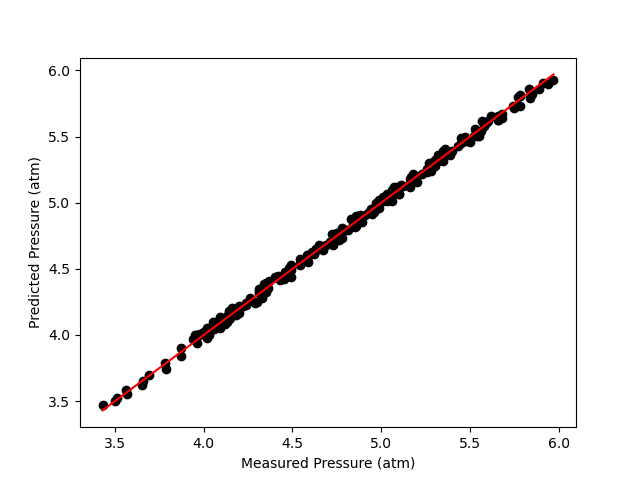{#fig-example_19_5_3_parity width="60%"}

::: {#fig-example_19_5_3_residual layout-ncol=2}

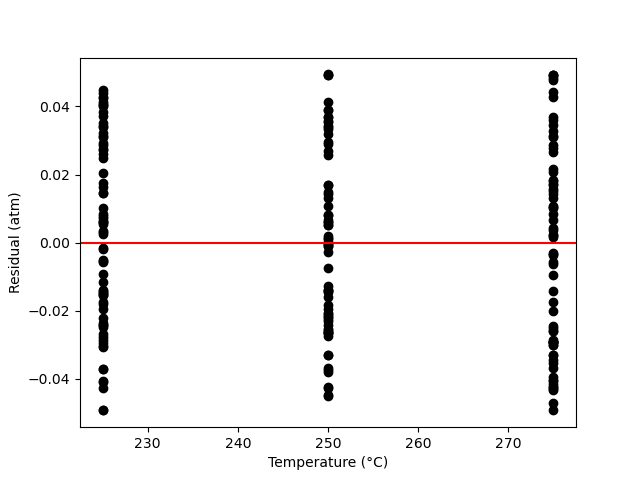

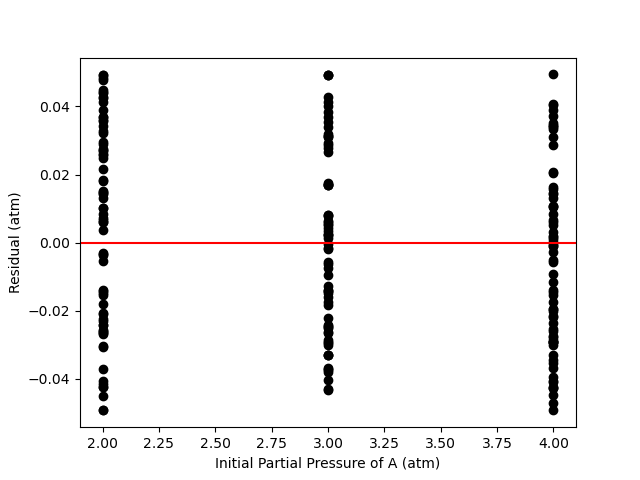

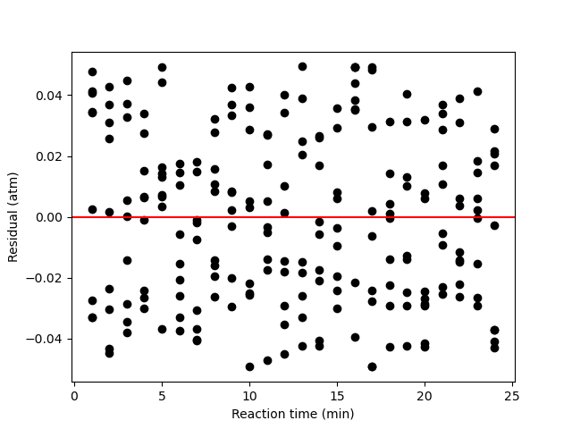

Residuals plots showing the difference between the measured and predicted responses with respect to each of the adjusted experimental inputs,$T$, $P_{A,0}$, and $t_{f$.
:::


:::{.callout-tip collapse="true"}
## Click Here to See What an Expert Might be Thinking at this Point

The proposed model is quite accurate. Looking at the parity plot, the deviations of the data from the diagonal line is very small, and in the residuals plots, the deviations are random with no apparent trends. The difference between the upper and lower limits of the 95% confidence intervals are small relative to the estimated values of the rate coefficient parameters, $k_0$ and $E$, and the coefficient of determination is nearly equal to 1.0.

:::

**Assessment**

When the Arrhenius parameters shown in @tbl-example_19_5_3_results are used in the proposed rate expression, equation (2), the rate expression is acceptably accurate.

### Assessing a Michaelis-Menten Rate Expression {#sec-example_19_5_4}

 include examples/reb_19_5_4/narrative.qmd >}}

 include examples/reb_19_5_4/equations.qmd >}}


#| echo: false
#| output: false
d <- read.csv('examples/reb_19_5_4/reb_19_5_4_data.csv')
 # CS0, t, CP
```

The first few data points are shown in @tbl-example_19_5_4_data. The full data set is available in the file [reb_19_5_4_data.csv](examples/reb_19_5_4/reb_19_5_4_data.csv).


#| echo: false
#| warning: false
#| label: tbl-example_19_5_4_data
#| tbl-cap: First five experimental data points.
kbl(d[1:5,], format = "markdown", align = "cc", col.names = c('C~S,0~ (mmol L^-1^)', 't~f~ (min)', 'C~P,f~ (mmol L^-1^)'))
```

---

:::{.callout-tip collapse="true"}
## Click Here to See What an Expert Might be Thinking at this Point

This assignment describes kinetics experiments, presents the data from them and asks me to use the data to assess a proposed rate expression. As such, it is a kinetics data analysis assignment where a liquid-phase reaction was studied in an isothermal BSTR. The adjusted experimental inputs were the initial concentration of S and the elapsed time when the response (the concentration of P) was measured. I'll start by summarizing the assignment using subscripted "0", "f", "CI,l", and "CI,u" to denote values at the start of the experiment, values at the time the response was measured, the lower limit of a 95% confidence interval and the upper limit of that interval. I'll use underlines to denote sets of values.

I'm asked to assess the accuracy of the rate expression, so I'll need to estimate the rate expression parameters, $V_{max}$ and $K_m$, calculate their 95% confidence intervals and calculate the coefficient of determination. I'll also make a parity plot and residuals to help in the assessment.

:::

#### Assignment Summary

**Reactor System:** Isothermal, steady-state BSTR

**Reactor Schematic:**

{#fig-example_19_5_4_schematic}

**Quantities of Interest:** $V_{max}$, $V_{max,CI,l}$, $V_{max,CI,u}$, $K_m$, $K_{m,CI,l}$, $K_{m,CI,u}$, $R^2$, $\underline{C}_P$ *vs.* $\underline{C}_{P,model}$ (as a parity plot), and $\underline{\epsilon}_{expt}$ *vs.* $\underline{C}_{S,0}$ and *vs.* $\underline{t}_f$ (as residuals plots).

**Given and Known Constants:** $V$ = 50 ml.

**Adjusted Experimental Inputs:** $\underline{C}_{S,0}$ and $\underline{t}_f$

**Experimental Response:** $\underline{C}_{P,f}$

:::{.callout-tip collapse="true"}
## Click Here to See What an Expert Might be Thinking at this Point

I know I will need to model the experimental BSTR, so I'll start by developing the reactor model. Mole balances are always need in a reactor model. For a BSTR the general form of the mole balance is given by @eq-bstr_mole_balance. Here there is only one reaction, so the summation becomes a single term and the subscripts denoting the reaction are not needed.

$$
\frac{dn_i}{dt} = \nu_i r V
$$

Because the reactor operated isothermally, the mole balances can be solved independently of any other reactor design equations. Here I won't need any other design equations because I can calculate the response using just the mole balances.

However, since the mole balances are IVODEs, I will need initial values, a stopping criterion, and a derivatives function to solve them. I can define $t=0$ to be the instant the experiment starts in which case the initial values are the molar amounts at that instant. The initial molar amount of P was zero in all experiments. The time when the response was measured is also known, and will be used as the stopping criterion.

:::

<center>**BSTR Model**</center>

[Design Equations]{.underline}

$$
\frac{dn_S}{dt} = -rV \tag{3}
$$

$$
\frac{dn_P}{dt} = rV \tag{4}
$$

[Initial Values and Stopping Criterion]{.underline}

| Variable | Initial Value | Stopping Criterion |
|:-------|:-------:|:-------:|
| $t$ | $0$ | $t_f$ |
| $n_S$ | $n_{S,0}$ | |
| $n_P$ | $0$ | |
  
: Initial values and stopping criterion for solving the design equations, equations (3) and (4). {#tbl-example_19_5_4_initial_values tbl-colwidths="[20, 40, 40]"}

:::{.callout-tip collapse="true"}
## Click Here to See What an Expert Might be Thinking at this Point

I'll need to write a derivatives function. It will be given the values of the independent and dependent variables ($t$, $n_S$, and $n_P$) at the start of an integration step. Using those values and the given and known constants from the assignment summary, the derivatives in the design equations must be calculated and returned. In order to do that any unknown quantities appearing in the design equations must first be calculated. The only unknown in the design equations is $r$, and that can be calculated using equation (2), but equation (2) contains 3 more unknowns: $V_{max}$, $K_m$, and $C_S$. $V_{max}$ and $K_m$ will change as the predicted response model is fit to the data, so they will need to be provided. The concentration of S can be calculated using the defining equation for concentration, @eq-concentration_closed.

:::

[Derivatives Function]{.underline}

$\qquad$ Arguments: $t$, $n_S$, and $n_P$.

$\qquad$ Must be Available: $V_{max}$ and $K_m$.

$\qquad$ Return Values: $\frac{dn_S}{dt}$ and $\frac{dn_P}{dt}$.

$\qquad$ Algorithm:

$$
C_S = \frac{n_S}{V} \tag{5}
$$

$$
r = \frac{V_{max}C_S}{K_m + C_S} \tag{2}
$$

$$
\frac{dn_S}{dt} = -rV \tag{3}
$$

$$
\frac{dn_P}{dt} = rV \tag{4}
$$

:::{.callout-tip collapse="true"}
## Click Here to See What an Expert Might be Thinking at this Point

I'll use an IVODE solver to solve the design equations. I'll need to provide the derivatives function, above, to it, along with the initial values and stopping criterion in @tbl-example_19_5_4_initial_values. The initial molar amount of S can be calculated from its initial concentration. Because the initial concentration varies from one experiment to the next, it will need to be provided, as will the final time which also varies with the experiment.

:::

[BSTR Model Function]{.underline}

$\qquad$ Arguments: $C_{S,0}$ and $t_f$

$\qquad$ Return Values: $\underline{t}$, $\underline{n}_S$, and $\underline{n}_P$.

$\qquad$ Algorithm:

1. Calculate unknown initial and final values.

$$
n_{S,0} = C_{S,0}V \tag{6}
$$

2. Call an IVODE solver passing the initial values, stopping criterion and derivatives function as arguments.

3. Receive corresponding sets of values of $t$, $n_S$, and $n_P$ that span the range from $t=0$ to $t=t_f$ from the IVODE solver and return them.

:::{.callout-tip collapse="true"}
## Click Here to See What an Expert Might be Thinking at this Point

The reactor model function cannot be fit to the experimental data. Instead I need to use it to generate a predicted responses model that can be fit to the data. It will be called by a numerical fitting function, so it must have the rate expression parameters ($V_{max}$ and $K_m$ here) and the adjusted experimental inputs ($\underline{C}_{S,0}$ and $\underline{t}_f$) as its only arguments.

It must make the rate expression parameters available to the derivatives function and then process each experimental data point. For each data point it needs to solve the design equations and calculate the predicted response, namely the concentration of P. Solving the design equations will yield the molar amount of P, so the concentration can be calculated using the defining equation for concentration.

:::

<center>**Predicted Responses Function**</center>

[Arguments:]{.underline} $V_{max}$, $K_m$, ($\underline{C}_{S,0}$ and $\underline{t}_f$

[Return Values:]{.underline} $\underline{C}_{P,f,model}$

[Algorithm:]{.underline}

1. Make [list rate expression parameters] available to the [derivatives/residuals] function.
2. For each experiment in the data set
	a. Make $V_{max}$ and $K_m$ available to the derivatives function.
	b. Call the BSTR model function passing $C_{S,0}$ and $t_f$ as arguments to solve the design equations and receive $\underline{t}$, $\underline{n}_S$, and $\underline{n}_P$..
	c. Calculate the predicted response.

$$
C_{P,f,model} = \frac{n_P\big\vert_{t=t_f}}{V} \tag{7}
$$

3. Return the set of model-predicted responses, $\underline{C}_{P,f,model}$.

:::{.callout-tip collapse="true"}
## Click Here to See What an Expert Might be Thinking at this Point

Now I can use a numerical fitting function to fit the predicted responses model to the data. I will need to provide the fitting function with a guess for the rate expression parameters, the set of adjusted experimental inputs, the set of experimental responses, and the predicted responses function.

Assuming the fitting function converges, it will return estimates for the rate expression parameters, their 95% confidence intervals, and the coefficient of determination. I will use the parameter estimates to calculate the model-predicted responses, and then use those to calculate the experiment residuals. That will give me the data I need to make a parity plot and residuals plots.

:::

<center>**Parameter Estimation**</center>

1. Set an initial guess for the parameters ($V_{max,guess}$ and $K_{m,guess}$).
2. Call a numerical fitting function passing the adjusted experimental inputs for all of the experiments ($\underline{C}_{S,0}$ and $\underline{t}_f$), the experimental responses ($\underline{C}_{P,f}$), the initial guess for the parameters from step 1, and the predicted responses function, above, as arguments, and receive the parameter estimates ($V_{max}$ and $K_m$), their 95% confidence intervals ($V_{max,CI,l}$, $V_{max,CI,u}$, $K_m,CI,l$ and $K_m,CI,u$), and the coefficient of determination, $R^2$.

<center>**Generation of Assessment Graphs**</center>

1. Call the predicted responses function above, passing the estimated parameters ($V_{max}$ and $K_m$) and the adjusted experimental inputs for all of the experiments ($\underline{C}_{S,0}$ and $\underline{t}_f$) as arguments and receive the predicted responses for all of the experiments ($\underline{C}_{P,f}$).
2. Calculate the experiment residuals.

$$
\underline{\epsilon}_{expt} = \underline{C}_{P,f} - \underline{C}_{P,f,model} \tag{8}
$$

3. Generate a parity plot showing $\underline{C}_{P,f}$ vs. $\underline{C}_{P,f,model}$.
4. Generate residuals plots showing $\underline{\epsilon}_{expt}$ *vs.* $\underline{C}_{S,0}$ and *vs.*  $\underline{t}_f$.

:::{.callout-tip collapse="true"}
## Click Here to See What an Expert Might be Thinking at this Point

I now have everything I need to perform the calculations that are needed to complete the assignment.

:::

<center>**Performing the Analysis**</center>

1. Read the adjusted experimental inputs and the experimental responses from the data file, [reb_19_5_4_data.csv](examples/reb_19_5_4/reb_19_5_4_data.csv).
2. Estimate the parameters and generate the assessment graphs as described above.
3. Display the results and/or save them to a file.

#### Results and Discussion


#| echo: false
#| output: false
d <- read.csv('examples/reb_19_5_4/reb_19_5_4_results.csv')
d <- fmt_tibble_col(d, 2, 3, 2, 2)
a <- c('V~max~','K~m~','R^2^')
b1 <- paste0(d$value[1],' ',d$units[1],', 95% CI [',d$value[2],', ',d$value[3],']')
b2 <- paste0(d$value[4],' ',d$units[4],', 95% CI [',d$value[5],', ',d$value[6],']')
b <- c(b1,b2,d$value[7])
 # item, value, units
d <- data.frame(a,b)
```

The calculations were performed as described above, and the results are shown in @tbl-example_19_5_4_results. A parity plot of the measured responses *vs*. the model-predicated responses is presented in @fig-example_19_5_4_parity, and residuals plots showing the difference between the measured and predicted responses *vs*. the initial concentration of S and *vs*. the reaction time are shown in @fig-example_19_5_4_residual.


#| echo: false
#| warning: false
#| label: tbl-example_19_5_4_results
#| tbl-cap: Parameter estimation results
kbl(d, format = "markdown", align = "cc", col.names = NULL)
```

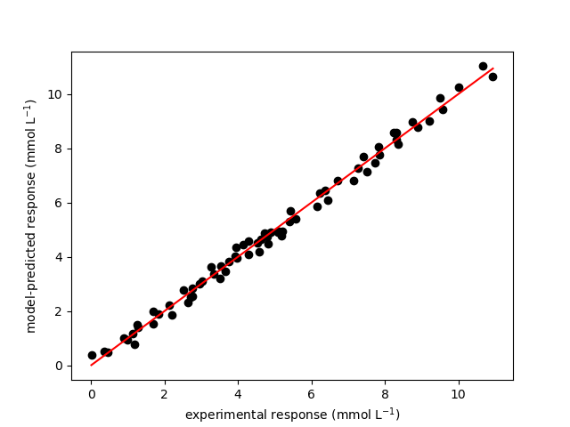{#fig-example_19_5_4_parity width="60%"}

::: {#fig-example_19_5_4_residual layout-ncol=2}

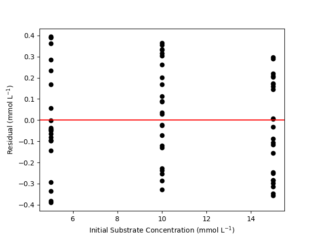

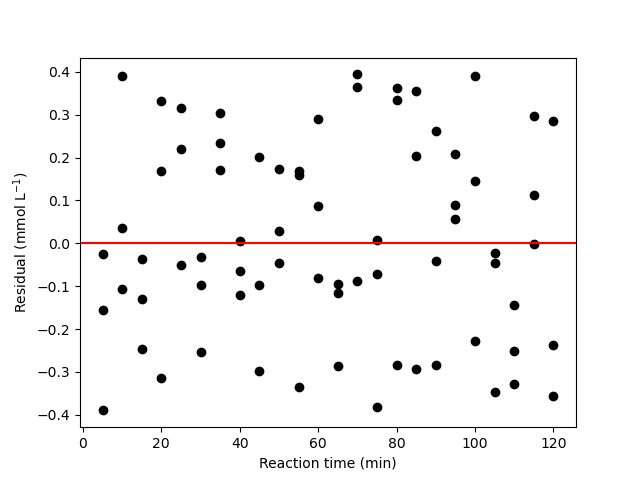

Residuals plots showing the difference between the measured and predicted responses with respect to each of the adjusted experimental inputs, $C_{S,0}$ and $t_{rxn}$.
:::

:::{.callout-tip collapse="true"}
## Click Here to See What an Expert Might be Thinking at this Point

The proposed model is quite accurate. Looking at the parity plot, the deviations of the data from the parity line is very small, and in the residuals plots, the deviations are random with no apparent trends. The difference between the upper and lower limits of the 95% confidence intervals are small relative to the estimated values of $V_{max}$ and $K_m$, and the coefficient of determination is nearly equal to 1.0.

:::

**Assessment**

When the $V_{max}$ and $K_m$ shown in @tbl-example_19_5_4_results are used in the proposed rate expression, equation (2), the rate expression is acceptably accurate.

### Kinetics Data Analysis using Same-Temperature Data Blocks and Linear Least Squares {#sec-example_19_5_5}

Recall [Example -@sec-example_19_5_2], below. This example repeats that assignment using linear least squares fitting and a spreadsheet.

 include examples/reb_19_5_2/narrative.qmd >}}

 include examples/reb_19_5_2/equations.qmd >}}


#| echo: false
#| output: false
d <- read.csv("examples/reb_19_5_2/reb_19_5_2_data.csv")
# T, PA0, PB0, t, fA
```

The first few data points are shown in @tbl-example_19_5_2_data. The full data set is available in the file [reb_19_5_2_data.csv](examples/reb_19_5_2/reb_19_5_2_data.csv).


#| echo: false
#| warning: false
#| label: tbl-example_19_5_5_data
#| tbl-cap: First 5 of the 189 experimentally generated data.
kbl(d[1:5,], format = "markdown", align = "cc", 
  col.names = c('T (°C)', 'P~A,0~ (atm)', 'P~B,0~ (atm)', 't~f~ (min)', 
  'f~A~'))
```

---

:::{.callout-tip collapse="true"}
## Click Here to See What an Expert Might be Thinking at this Point

The assignment is the same as it was in [Example -@sec-example_19_5_2], except for the quantities of interest. When a linearized model is used, the data are analyzed in same temperature blocks. Instead of a single parity plot and one residuals plot for each adjusted input, the graphs used for assessment will be a model plot for each temperature and an Arrhenius plot. So I'll copy the assignment summary from [Example -@sec-example_19_5_2] and change the quantities of interest.

:::

#### Assignment Summary

**Reactor System:** Isothermal, gas-phase BSTR

**Reactor Schematic:**

{#fig-example_19_5_2_schematic}

**Quantities of Interest:** $k_0$, $k_{0,CI,l}$, $k_{0,CI,u}$, $E$, $E_{CI,l}$, $E_{CI,u}$, $R^2$, model plots for each same-temperature data block, and an Arrhenuis plot.

**Given and Known Constants:** $V = 500\text{ cm}^3$.

**Adjusted Experimental Inputs:** $\underline{T}$, $\underline{P}_{A,0}$, $\underline{P}_{B,0}$, and $\underline{t}_f$.

**Experimental Response:** $\underline{f}_A$.

#### Mathematical Formulation of the Calculations

:::{.callout-tip collapse="true"}
## Click Here to See What an Expert Might be Thinking at this Point

If I'm going to use linear least squares to do the fitting, I must use a *single* mole balance on one of the products or reactants to model the reactor. Because the reactor is isothermal, I can solve that mole balance independently of the energy balances. The response in this problem is the fractional conversion of reagent A, so I'll write the mole balance on reagent A.

The mole balance will be a differential equation. I know that I will need to solve that IVODE *analytically* before I'll be able to linearize the model.

:::

<center>**Linearized Reactor Model**</center>

A mole balance on reagent A is shown in equation (3), where the rate expression, equation (2), has been substituted into the mole balance.

$$
\frac{dn_A}{dt} = -kVP_AP_B \tag{3}
$$

:::{.callout-tip collapse="true"}
## Click Here to See What an Expert Might be Thinking at this Point

I need to solve equation (3) *analytically* before I can linearize it. To do that, I need to express every variable quantity appearing in it in terms of the dependent variable, $n_A$, and the independent variable $t$. In any one experiment, $k$ and $V$ will be constant, but $P_A$ and $P_B$ will change as the reaction proceeds. Consequently, I need to express $P_A$ and $P_B$ in terms of $n_A$ and $t$.

:::

Using the ideal gas law, the partial pressures can be eliminated, equation (4).

$$
\frac{dn_A}{dt} = -kV\left( \frac{n_ART}{V} \right)\left( \frac{n_BRT}{V} \right) = \frac{-k\left(RT\right)^2}{V}n_An_B \tag{4}
$$

:::{.callout-tip collapse="true"}
## Click Here to See What an Expert Might be Thinking at this Point

Expressing $P_B$ using the ideal gas law introduced the molar amount of B, $n_B$. It is not a constant, so it must be expressed in terms of $n_A$ and $t$. I can accomplish that using the apparent extent of reaction (see @sec-1_reaction_progress).

First I'll express the molar amount of reagent B in terms of its initial amount and the apparent extent of the reaction.

$$
n_B = n_{B,0} - \xi
$$

Then I can express $\xi$ in terms of the molar amount of reagent A.

$$
n_A = n_{A,0} - \xi \qquad \Rightarrow \qquad \xi = n_{A,0} - n_A
$$

Substuting the second expression into the first gives me an expression for the molar amount of reagent B.

$$
n_B = n_{B,0} - n_{A,0} + n_A
$$

:::

After expressing the molar amount of B in terms of the molar amount of A, equation (5) results.

$$
\frac{dn_A}{dt} = \frac{-k\left(RT\right)^2}{V}n_A\left( n_{B,0} - n_{A,0} + n_A \right) \tag{5}
$$

Separation of variables and integration then leads to equation (6).

$$
\frac{1}{n_{A,0}-n_{B,0}} \ln{\frac{n_{A,0}\left( n_{B,0} - n_{A,0} + n_A  \right)}{n_{B,0}n_A}} = \frac{-k\left(RT\right)^2}{V} t\tag{6}
$$

:::{.callout-tip collapse="true"}
## Click Here to See Where That Came From

Rearrange equation (6) so only $n_A$ appears on the left side and only $t$ appears on the right.

$$
\frac{dn_A}{n_A\left( n_{B,0} - n_{A,0} + n_A \right)} = \frac{-k\left(RT\right)^2}{V}dt
$$

Then integrate noting that at $t=0$, $n_A = n_{A,0}$, at any later time, $t$, the molar amount of reagent A is $n_A$, and $k$, $R$, $T$, and $V$ are constants that can be taken outside of the integral.

$$
\int_{n_{A,0}}^{n_A}\frac{dn_A}{n_A\left( n_{B,0} - n_{A,0} + n_A \right)} = \frac{-k\left(RT\right)^2}{V}\int_{t_0}^tdt
$$

$$
\frac{1}{n_{B,0}-n_{A,0}} \left(\ln{\frac{ n_{B,0} - n_{A,0} + n_A  }{n_A}}\right)\Bigg\vert_{n_{A,0}}^{n_A} = \frac{-k\left(RT\right)^2}{V} t\Big\vert_{t_0}^t
$$

Evaluating at the upper and lower limits and taking the difference on each side then yields equation (6).

:::

:::{.callout-tip collapse="true"}
## Click Here to See What an Expert Might be Thinking at this Point

Looking at equation (6), I can see that the first fraction will become infinite if $n_{A,0} = n_{B,0}$, and some of the experiments have equal initial partial pressures of reagents A and B. If $n_{A,0} = n_{B,0}$ then $n_A$ will equal $n_B$ at all times because one A is consumed every time one B is consumed in the reaction. In this case, the rate expression becomes $r=kP_A^2$, so the reactor model is as follows.

$$
\frac{dn_A}{dt} = -kVP_A^2
$$

Rearrange so only $n_A$ appears on the left side and only $t$ appears on the right.

$$
\frac{dn_A}{n_A^2} = \frac{-k\left(RT\right)^2}{V}dt
$$

Then integrate noting that at $t=0$, $n_A = n_{A,0}$, at any later time, $t$, the molar amount of reagent A is $n_A$, and $k$, $R$, $T$, and $V$ are constants that can be taken outside of the integral.

$$
\int_{n_{A,0}}^{n_A}\frac{dn_A}{n_A^2} = \frac{-k\left(RT\right)^2}{V}\int_{t_0}^tdt
$$

$$
\frac{-1}{n_A}\Bigg\vert_{n_{A,0}}^{n_A} = \frac{-k\left(RT\right)^2}{V} t\Big\vert_{t_0}^t
$$

Evaluating at the upper and lower limits and taking the difference on each side then yields equation (7), below.

:::

If $n_{A,0} = n_{B,0}$, separation of variables and integration leads to equation (7).

$$
\frac{1}{n_{A,0}} - \frac{1}{n_A} = \frac{-k\left(RT\right)^2}{V} t\tag{7}
$$

:::{.callout-note collapse="false"}
## Note

Someone just starting to learn about kinetic data analysis might not have noticed that the initial fraction in equation (6) will become infinite if $n_{A,0} = n_{B,0}$. In that case, the analysis would have failed a little later, indicating that something was wrong. Eventually the new learner might figure out the problem, but this is one of those times when a little prior experience (or the ability to ask a teacher who has such experience) really helps. 

:::

:::{.callout-tip collapse="true"}
## Click Here to See What an Expert Might be Thinking at this Point

Having solved the mole balance ODE, the next step is to linearize it. In this problem nothing needs to be done. It is already linear. That means that I next need to calculate the values of $x$ and $y$ for each experimental data point.

:::

If $y$ is defined as shown in equation (8) for experiments where $n_{A,0} = n_{B,0}$, or as shown in equation (9) when $n_{A,0} \ne n_{B,0}$, and $x$ is defined as shown in equation (10), it can be seen that the model for both cases is a linear equation with a slope equal to $k$, equation (11).

$$
y = \frac{1}{n_{A,0}} - \frac{1}{n_A} \tag{8}
$$

$$
y = \frac{1}{n_{A,0}-n_{B,0}} \ln{\frac{n_{A,0}\left( n_{B,0} - n_{A,0} + n_A  \right)}{n_{B,0}n_A}} \tag{9}
$$

$$
x = \frac{-t_f\left(RT\right)^2}{V} \tag{10}
$$

$$
y=kx \tag{11}
$$

<center>**Linear Least Squares Parameter Estimation**</center>

:::{.callout-tip collapse="true"}
## Click Here to See What an Expert Might be Thinking at this Point

At this point, I can use linear least squares to estimate $k$ for each same-temperature data block. To do that, I simply need to calculate $x$ and $y$ for each data point in the data block being analyzed. Then I can fit equation (11) to those data, and the resulting slope will equal $k$.

Once I have estimated $k$ at each of the same-temperature data block temperatures I will have a set of $k$ *vs.* $T$ data. I can estimate the Arrhenius parameters by linearizing the Arrhenius expression and fitting the result to the $k$ *vs.* $T$ data as was done in [Example -@sec-example_4_5_4].

All of this can be accomplished using a spreadsheet.

:::

The values of $x$ and $y$ can be calculated for every experimental data point using equation (10) and either equation (8) (if $n_{A,0} = n_{B,0}$) or equation (9). Before doing so, the initial molar amounts of A and B and the final molar amount of A must be calculated using the experimental data for each experiment, equations (12) through (14).

$$
n_{A,0} = \frac{P_{A,0}V}{RT} \tag{12}
$$

$$
n_{B,0} = \frac{P_{B,0}V}{RT} \tag{13}
$$

$$
n_A = n_{A,0} \left( 1 - f_A \right) \tag{14}
$$

[Estimation of $k$ *vs.* $T$]{.underline}

1. Split the data into same-temperature blocks.
2. For each block
    a. calculate $x$ and $y$
    b. fit equation (11) to the resulting data to estimate $k$

The Arrhenius expression can then be fit to the resulting $k$ *vs.* $T$ data. Recall from [Chapter -@sec-2_rate_express] that the Arrhenius expression can be linearized by taking the logarithm of each side, equation (13).

$$
\begin{matrix} y = \ln{k_j} \\ x = \displaystyle \frac{-1}{RT} \end{matrix} \quad \Rightarrow \quad y = m x + b \quad \Rightarrow \quad \begin{matrix} m = E_j \\ b = \ln{k_{0,j}} \end{matrix} \tag{13}
$$

The $k$ *vs.* $T$ data can be used to calculate $x$ and $y$ in equation (13), and $m$ and $b$ can be estimated by fitting $y=mx+b$ to the resulting $x$ - $y$ data. The estimated  values of $k_0$ and $E$ then can be calculated as shown in equation (13).

[Estimation of $k_0$ and $E$]{.underline}

1. Using the $k$ *vs.* $T$ data above, calculate a corresponding set of $y$ *vs.* $x$ data using equation (13).
2. Fit $y=mx + b$ to those data to find $m$ and $b$.
3. Calculate $k_0$ and $E$ using equation (13).

#### Implementation of the Calculations Using a Spreadsheet

To perform the calculations, the file provided with assignment, [reb_19_5_2_data.csv](examples/reb_19_5_2/reb_19_5_2_data.csv), was opened in a spreadsheet program. The spreadsheet consisted of five columns (A through E) with headings of T, PA0, PB0, tf, and fA, corresponding to the the headings shown in @tbl-example_19_5_5_data. Each column contained 189 rows below the heading, one for each experiment.

Five columns were added to the right of the fA column, as shown in @fig-example_19_5_5_screenshot. In column F the temperature in K was calculated from the Celsius temperature in column A. In columns G, H, and I, the initial molar amounts of A and B and the final molar amount of A were calculated using equations (12) through (14). Finally, $x$ and $y$ were calculated using equation (10) and either equation (8) for experiments where $n_{A,0} = n_{B,0}$, or equation (9) when $n_{A,0} \ne n_{B,0}$.

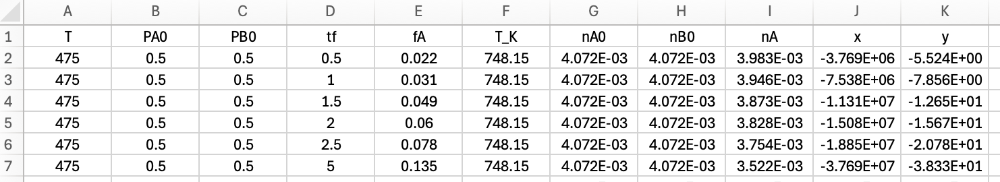{#fig-example_19_5_5_screenshot width="90%"}

Next the $x$ and $y$ columns for experiments with $T$ = 475 °C were selected and used to generate a scatter plot. A linear trendline with an intercept of zero was added to the graph, and it was set to display the equation for the trendline and the $R^2$ value. The resulting plot is shown in @fig-example_19_5_5_model_plot. The displayed equation is $y=1.097\text{E}-06x$, indicating that the slope is 1.097 x 10^-6^ mol cm^-3^ min^-1^ atm^-2^. This is also the value of $k$ as shown in equation (11).

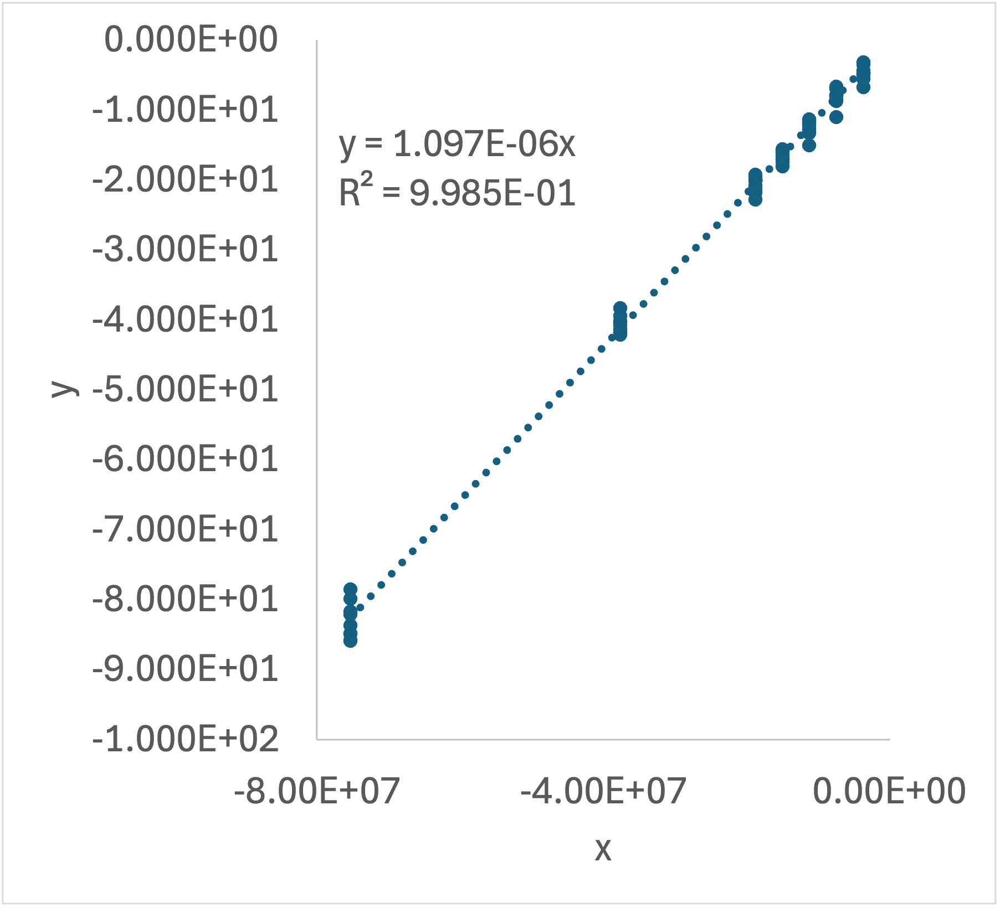{#fig-example_19_5_5_model_plot width="80%"}

Model plots, not shown, for the 500 °C and 525 °C data were generated the same manner. The temperatures, estimated rate coefficients and coefficients of determination are shown in @tbl-example_19_5_5_rate_coefficients. A new spreadsheet was created with columns for the temperatures and rate coefficients. Columns were then added for the temperature in K, $x$ ($\frac{-1}{RT}$), and $y$ ($\ln{ k}$) from equation (13). A plot of $y$ *vs.* $x$ was generated, a linear trendline ($y=mx+b$) was added and the graph was set to display the trendline equation and the coefficient of determination. A screenshot from the spreadsheet is shown as @fig-example_19_5_5_arrhenius.

| Temperature | $k$ | $R^2$ |
|:------:|:-------:|:-------:|
| 475 °C | 1.097 x 10^-6^ | 0.9985 |
| 500 °C | 1.740 x 10^-6^ | 0.9989 |
| 525 °C | 2.772 x 10^-6^ | 0.9989 |

:Estimated rate coefficients for each of the same-temperature data blocks. {#tbl-example_19_5_5_rate_coefficients tbl-colwidths="[33,33,33]"}

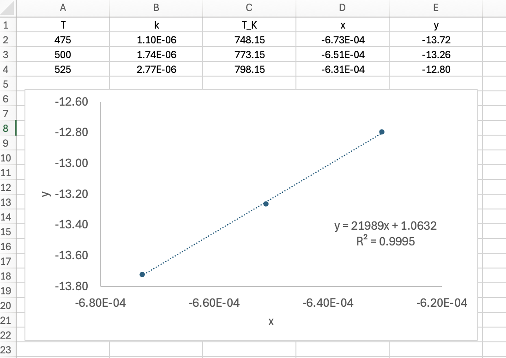{#fig-example_19_5_5_arrhenius width="80%"}

It can be seen in @fig-example_19_5_5_arrhenius that the slope of the Arrhenius plot is 21989 cal mol^-1^ and the intercept is 1.0632. As shown in equation (13), the slope is equal to the activation energy, $E$, and the intercept is equal to the natural logarithm of $k_0$. The pre-exponential factor can be calcuated using equation (14), and it is found to equal 2.896 mol cm^-3^ min^-1^ atm^-2^.

#### Discussion

:::{.callout-tip collapse="true"}
## Click Here to See What an Expert Might be Thinking at this Point

I now need to assess the accuracy of the model and make a decision whether to accept it, recommend additional experiments, or reject it. All of the accuracy criteria are satisfied, and the rate expression should be accepted.

* The coefficient of determination is close to 1.0 for each of the three temperature levels and for the Arrhenius plot.
* The data points in the model plots and the Arrhenius plot all lie close to the line representing the model.
* The data points in the model and Arrhenius plots scatter randomly from the line representing the model, and there is no apparent trend in the deviations.

:::

The rate expression in equation (2) is accurate when the Arrhenius expression is used to represent the temperature dependence of $k$. Equation (2) should be accepted as the rate expression with $k_0$ = 2.90 mol cm^-3^ min^-1^ atm^-2^ and $E$ equal to 22.0 kcal mol^-1^.

#### Comparision of the Two Analyses

The same rate expression was assessed using the same data set in [Example -@sec-example_19_5_2] and in this example. In [Example -@sec-example_19_5_2] a response function was fit to all of the data to estimate the best values of $k_0$ and $E$. In this example a linearized reactor model was fit to the three same-temperature data sets, and the Arrhenius expression was fit to the resulting rate coefficient estimates. In both cases it was concluded that the rate expression was accurate. @tbl-example_19_5_5_results_comparison compares the resulting parameter estimates.

| Method | $k_0$ | $E$ |
|:------:|:-------:|:-------:|
| Response Function | 2.59 mol cm^-3^ min^-1^ atm^-2^ | 21.8 kcal mol^-1^ |
| Linearized Model | 2.90 mol cm^-3^ min^-1^ atm^-2^ | 22.0 kcal mol^-1^ |

: Comparison of estimated rate epxression parameters. {#tbl-example_19_5_5_results_comparison tbl-colwidths="[33,33,33]"}

It is possible to estimate the uncertainty in the parameter estimates when using a spreadsheet, but that was not done here. The pre-exponential factor and activation energy for the response function method shown in @tbl-example_19_5_5_results_comparison are based directly upon the experimental data. In contrast, the pre-exponential factor and activation energy for the linearized model are estimates that are based on estimates of the rate coefficients, each of which is based upon a fraction of the data. 

Apart from this example and the one that follows, kinetics data analysis in *Reaction Engineering Basics* uses a response function so that each parameter is estimated from the full data set. While it is arguably easier to use a linearized model and use a spreadsheet, that approach cannot always be used, and the estimated parameters are based upon other estimates that are each based upon only a fraction of the data.

### Kinetics Data Analysis using Same-Temperature Data Blocks and an Approximate Reactor Model {#sec-example_19_5_6}

Recall [Example -@sec-example_19_5_1], below. This example repeats that assignment using a linearized, approximate reactor model and a spreadsheet. 

 include examples/reb_19_5_1/narrative.qmd >}}

 include examples/reb_19_5_1/equations.qmd >}}


#| echo: false
#| output: false
d <- read.csv('examples/reb_19_5_1/reb_19_5_1_data.csv')
# Experiment, T, CA0, t, CA
```

Note that these data were generated using the experimental design from [Example -@sec-example_18_6_1]. The first few data points are shown in @tbl-example_19_5_6_data. The full data set is available in the .csv file [reb_19_5_1_data.csv](examples/reb_19_5_1/reb_19_5_1_data.csv)


#| echo: false
#| warning: false
#| label: tbl-example_19_5_6_data
#| tbl-cap: First 8 experimental data points.
kbl(d[1:8,], format = "markdown", align = "cc", col.names = c('Experiment','T (°C)',
    'C~A,0~ (M)', 't~f~ (min)', 'C~A,f~ (M)'))
```

---

:::{.callout-tip collapse="true"}
## Click Here to See What an Expert Might be Thinking at this Point

This assignment is the same as [Example -@sec-example_19_5_1], and so the same summary can be used except that the quantities of interest are different. The data can be broken into four same-temperature blocks (65, 73, 82 and 90 °C). Each of those blocks will be analyzed separately to estimate the rate coefficient at those temperatures. Then the resulting $k$ *vs.* $T$ data will be analyzed to find the Arrhenius parameters and the coefficient of determination. Instead of a parity plot and residuals plots, a model plot for each block temperature and an Arrhenius plot will be used to assess the accuracy of the proposed rate expression.

:::

#### Assignment Summary

**Reactor System:** Isothermal, liquid-phase BSTR

**Reactor Schematic:**

{#fig-example_19_5_1_schematic}

**Quantities of Interest:** $k\big\vert_{T=65\text{°C}}$, $k\big\vert_{T=73\text{°C}}$, $k\big\vert_{T=82\text{°C}}$, $k\big\vert_{T=90\text{°C}}$, $k_0$, $k_{0,CI,l}$, $k_{0,CI,u}$, $E$, $E_{CI,l}$, $E_{CI,u}$, $R^2$, model plots, and an Arrhenius plot.

**Given and Known Constants**: $V = 1\text{ L}$, $R$ = 8.314 x 10^-3^ kJ mol^-1^ K^-1^.

**Adjusted Experimental Inputs**: $\underline{T}$, $\underline{C}_{A,0}$, and $\underline{t}_{f}$

**Experimental Response**: $\underline{C}_{A,f}$

#### Mathematical Formulation of the Calculations

:::{.callout-tip collapse="true"}
## Click Here to See What an Expert Might be Thinking at this Point

In any kinetics data analysis, a model for the experimental reactor is needed, so I'll by generating that. Because the kinetics experiments are isothermal, the mole balance design equations can be solved independently of the energy balances. In addition, everything that is needed for kinetics data analysis can be found by solving the mole balance design equations, so they are the only equations that need to be included in the design equations.

In these experiments there is only one reaction taking place and there aren't any non-reactive reagents, so the minimum number of mole balance is one. Here I will use a mole balance on reagent A to model the system. Here I'm going to approximate it and then linearize it. That is, I'm going to approximate the derivative in the design equation using backwards differences.

$$
\frac{dn_A}{dt} = \nu_A r V = -rV
$$

Since I am using backward differences (see @sec-apndx_pre_knowledge) to approximate the derivative, each data point will use the response from the previous data point as well as for the data point itself. I will substitute the rate expression into the approximate design equation.

:::

<center>**Approximate BSTR Model**</center>

[Design Equation]{.underline}

$$
\frac{dn_A}{dt} \approxeq \frac{\Delta n_A}{\Delta t} \approxeq \frac{n_A\big \vert_{t=t_i} - n_A \big \vert_{t=t_{i-1}}}{t_i - t_{i-1}} = -kC_AV \tag{3}
$$

:::{.callout-tip collapse="true"}
## Click Here to See What an Expert Might be Thinking at this Point

Looking at the design equation, I can see it is already linear. I can also see that if I divide both sides by $V$, I can define new variables, $y$, $x$, and $m$, so the design equation becomes $y=mx$. Having divided by $V$, it will be easier to calculate $y$ because the concentration was measured in the experiments, not the molar amounts.

:::

$$
\frac{C_A\big \vert_{t=t_i} - C_A \big \vert_{t=t_{i-1}}}{t_i - t_{i-1}} = -kC_A \tag{4}
$$

$$
\begin{matrix} y = \displaystyle \frac{ C_A\big \vert_{t=t_i} - C_A \big \vert_{t=t_{i-1}}}{t_i - t_{i-1}} \\ x = -C_A \end{matrix} \quad \Rightarrow \quad y = m C_A \quad \Rightarrow \quad m = -k \tag{5}
$$

<center>**Linear Least Squares Parameter Estimation**</center>

:::{.callout-tip collapse="true"}
## Click Here to See What an Expert Might be Thinking at this Point

At this point I can use linear least squares to estimate $k$ for each same-temperature data block. All I need to do is calculate $y$ for each data point in the block being analyzed. Then I can fit equation (5) to the $x$-$y$ data and the slope will equal $k$.

Once I have estimated $k$ at each of the same-temperature data block temperatures, I will have a set of $k$ *vs.* $T$ data. I can fit the Arrhenius experssion to those data to estimate the pre-exponential factor and activation energy. All of this can be done in a spreadsheet.

:::

[Estimation of $k$ *vs.* $T$]{.underline}

1. Split the data into same-temperature blocks.
2. For each block
    a. Calculate $y$ using equation (5).
    b. fit $y=mC_A$ to the resulting data to estimate $m$.
    c. Calculate $k = -m$.

The Arrhenius expression can then be fit to the resulting $k$ *vs.* $T$ data. Recall from [Chapter -@sec-2_rate_express] that the Arrhenius expression can be linearized by taking the logarithm of each side, equation (6).

$$
\begin{matrix} y = \ln{k_j} \\ x = \displaystyle \frac{-1}{RT} \end{matrix} \quad \Rightarrow \quad y = m x + b \quad \Rightarrow \quad \begin{matrix} m = E_j \\ b = \ln{k_{0,j}} \end{matrix} \tag{6}
$$

The $k$ *vs.* $T$ data can be used to calculate $x$ and $y$ in equation (6), and $m$ and $b$ can be estimated by fitting $y=mx+b$ to the resulting $x$ - $y$ data. The estimated  values of $k_0$ and $E$ then can be calculated as shown in equation (6).

[Estimation of $k_0$ and $E$]{.underline}

1. Using the $k$ *vs.* $T$ data above, calculate a corresponding set of $y$ *vs.* $x$ data using equation (6).
2. Fit $y=mx + b$ to those data to find $m$ and $b$.
3. Calculate $k_0$ and $E$ using equation (6).

#### Implementation of the Calculations Using a Spreadsheet

To perform the calculations, the file provided with assignment, [reb_19_5_1_data.csv](examples/reb_19_5_1/reb_19_5_1_data.csv), was opened in a spreadsheet program. The spreadsheet consisted of five columns (A through E) with headings of Experiment, T, CA0, tf, and CAf, corresponding the the headings shown in @tbl-example_19_5_6_data. Each column contained 72 rows below the heading, one for each data point. Before begining the analysis, the data were sorted by the temperature, then experiment and then tf.

Two columns were added to the right of the CAf column, as shown in @fig-example_19_5_6_screenshot. In column F the temperature in Kelvin was calculated from the Celsius temperature in column B. In column G, $y$ was calculated using equation (5). If $y$ was being calculated for the first data point in an experiment, the initial concentration, $C_{A,0}$ was used as $C_A \big \vert_{t=t_{1-1}}$ and 0 was used as $t\big \vert_{t=t_{1-1}}$, otherwise $C_{A,f}$ and $t_f$ from the previous data point were used.

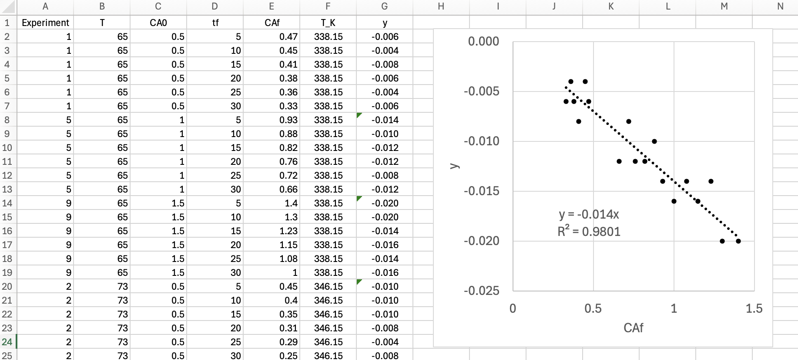{#fig-example_19_5_6_screenshot width="90%"}

Next the $C_{A,f}$ and $y$ columns for experiments with $T$ = 65 °C were selected and used to generate a scatter plot. A linear trendline with an intercept of zero was added to the graph, and it was set to display the equation for the trendline and the $R^2$ value. @fig-example_19_5_6_screenshot includes the resulting plot. The displayed equation is $y=-0.0140x$, indicating that the slope is -0.0140 min^-1^, so according to equation (5), $k = 0.0140$ min^-1^.

Model plots, not shown, for the 73, 82, and 90 °C data blocks were generated the same manner. The temperatures, estimated rate coefficients and coefficients of determination are shown in @tbl-example_19_5_6_rate_coefficients. 

| Temperature (°C) | $k$ (min^-1^) | $R^2$ |
|:------:|:-------:|:-------:|
| 65 | 0.0140 | 0.9801 |
| 73 | 0.0247 | 0.9937 |
| 82 | 0.0468 | 0.9943 |
| 90 | 0.0837 | 0.9979 |

:Estimated rate coefficients for each of the same-temperature data blocks. {#tbl-example_19_5_6_rate_coefficients tbl-colwidths="[33,33,33]"}

A new spreadsheet was created with columns for the temperatures and rate coefficients. Columns were then added for the temperature in K, $x$ ($\frac{-1}{RT}$), and $y$ ($\ln{ k}$) from equation (6). A plot of $y$ *vs.* $x$ was generated, a linear trendline ($y=mx+b$) was added and the graph was set to display the trendline equation and the coefficient of determination. A screenshot from the spreadsheet is shown as @fig-example_19_5_6_arrhenius.

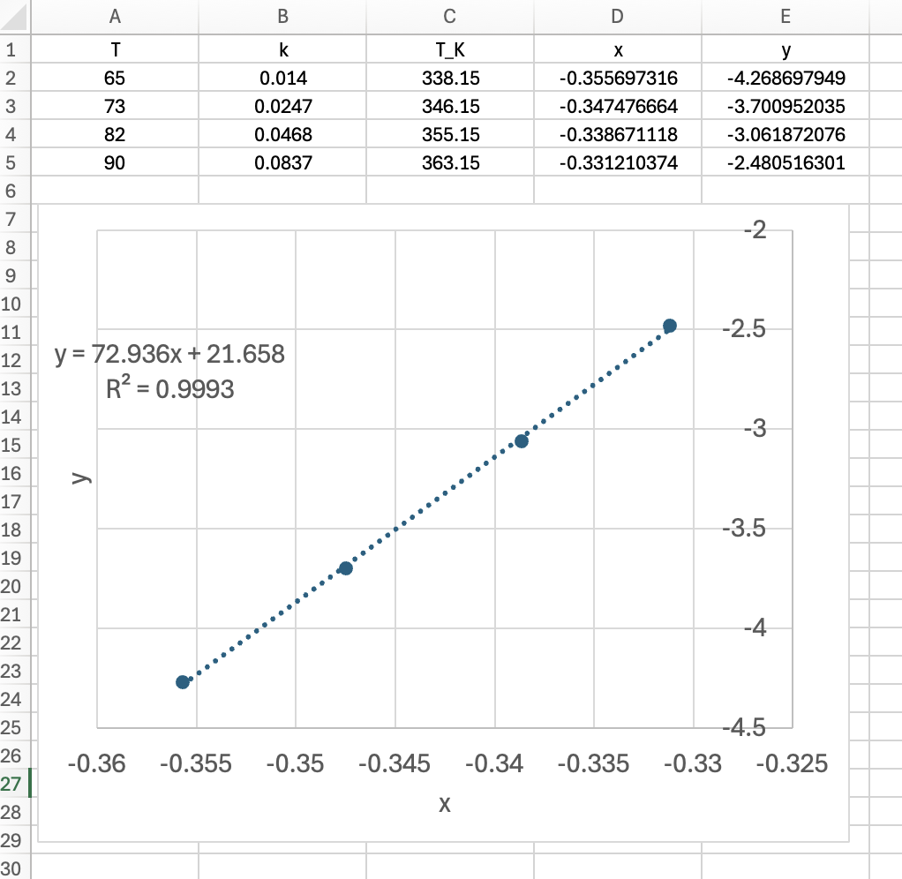{#fig-example_19_5_6_arrhenius width="80%"}

It can be seen in @fig-example_19_5_6_arrhenius that the slope of the Arrhenius plot is 72.936 kJ mol^-1^ and the intercept is 21.658. As shown in equation (6), the slope is equal to the activation energy, $E$, and the intercept is equal to the natural logarithm of $k_0$. The pre-exponential factor can be calculated, and it is found to equal 2.90 x 10^9^ min^-1^.

#### Discussion

:::{.callout-tip collapse="true"}
## Click Here to See What an Expert Might be Thinking at this Point

I now need to assess the accuracy of the model and make a decision whether to accept it, recommend additional experiments, or reject it. All of the accuracy criteria are satisfied, and the rate expression should be accepted.

* The coefficient of determination is close to 1.0 for each of the three temperature levels and for the Arrhenius plot.
* The data points in the Arrhenius plot all lie close to the line representing the model.
* The data points in the model plot shown in @fig-example_19_5_6_screenshot scatter by a moderate amount from the line, but the scatter in the other model plots (not shown) got smaller as the temperature increased. Overall, the scatter can be deemed acceptable knowing that an approximate model was being used.
* The data points in the model and Arrhenius plots scatter randomly from the line representing the model, and there is no apparent trend in the deviations.

:::

The rate expression in equation (2) is acceptably accurate when the Arrhenius expression is used to represent the temperature dependence of $k$. Equation (2) should be accepted as the rate expression with $k_0$ = 2.90 x 10^9^ min^-1^ and $E$ equal to 72.94 kJ mol^-1^.

#### Comparision of the Two Analyses

The same rate expression was assessed using the same data set in [Example -@sec-example_19_5_1] and in this example. In [Example -@sec-example_19_5_1] a response function was fit to all of the data to estimate the best values of $k_0$ and $E$. In this example a linearized, approximate reactor model was fit to the four same-temperature data sets, and the Arrhenius expression was fit to the resulting rate coefficient estimates. In both cases it was concluded that the rate expression was accurate. #tbl-example_19_5_6_results_comparison compares the resulting parameter estimates.

| Method | $k_0$ | $E$ |
|:------:|:-------:|:-------:|
| Response Function | 3.61 x 10^8^ min^-1^ | 67.5 kJ mol^-1^ |
| Linearized Model | 2.90 x 10^9^ min^-1^ | 72.94 kJ mol^-1^ |

: Comparison of estimated rate epxression parameters. {#tbl-example_19_5_6_results_comparison tbl-colwidths="[33,33,33]"}

It is possible to estimate the uncertainty in the parameter estimates when using a spreadsheet, but that was not done here. The pre-exponential factor and activation energy for the response function method shown in @tbl-example_19_5_6_results_comparison are based directly upon the experimental data. In contrast, the pre-exponential factor and activation energy for the linearized model are estimates that are based on estimates of the rate coefficients, each of which is based upon a fraction of the data. 

@fig-example_19_5_6_parity shows parity plots for parameters estimated using the full data set and a predicted responses model and for parameters in the present example using an approximate model. While both show good agreement between the measured and predicted responses, it is clear that the deviations for the predictions based upon the approximate model are greater. The parameters from the approximate model appear to consistently under-predict the experimental responses. This can be attributed to both the approximate model and the procedure wherein initial estimates (of each rate coefficient at one block temperature) are made using only part of the data and then final estimates (of the pre-exponential factor and activation energy) are generated from the first set of estimates.

![Parity plots based upon the parameter estimates from a full model (blue, [Example -@sec-example_19_5_1]) and parameter estimates from the approximate model (red, this Example).](examples/reb_19_5_6/reb_19_5_6_parity.png){#fig-example_19_5_6_parity width="80%"}

---


## Examples


#| echo: false
#| output: false
library(tidyverse)
library(knitr)
library(kableExtra)
source('Code/fmt_tibble_col.R')
```

The analysis of kinetics data from a PFR is nearly identical to the analysis of BSTR kinetics data as described and illustrated in @sec-6_bstr_data_analysis. For both data types the reactor design equations are IVODEs, so the mathematics are the same. One difference is associated with gas phase reactions where the total number of moles changes. In a BSTR this causes the pressure to change as the reaction proceeds (see [Example -@sec-example_19_5_3]). Assuming no pressure drop, in a PFR the volumetric flow rate will change as the reaction proceeds. This is illustrated in [Example -@sec-example_21_5_1]. When analyzing PFR kinetics data the cumulative volume of the reactor or the mass of catalyst in the reactor is sometimes used as the independent variable in the design equations. Doing so is illustrated in Examples -@sec-example_21_5_2 and -@sec-example_21_5_3.

### Kinetics of Gas-Phase Decomposition {#sec-example_21_5_1}

 include examples/reb_21_5_1/narrative.qmd >}}

 include examples/reb_21_5_1/equations.qmd >}}


#| echo: false
#| output: false
d <- read.csv("examples/reb_21_5_1/reb_21_5_1_data.csv")
 # A_in, Y_in, Z_in, fA
```

The first few data points are shown in @tbl-example_21_5_1_data; the full data set are available in the file, [reb_21_5_1_data.csv](examples/reb_21_5_1/reb_21_5_1_data.csv).


#| echo: false
#| warning: false
#| label: tbl-example_21_5_1_data
#| tbl-cap: First 8 of the 160 experimentally generated data.
library(kableExtra)
library(knitr)
kbl(d[1:8,], format = "markdown", align = "cccc", 
  col.names = c('$\\dot{V}_{A,0}$ (sccm)','$\\dot{V}_{Y,0}$ (sccm)',
  '$\\dot{V}_{Z,0}$ (sccm)', 'f~A~ (%)'))
```

---

:::{.callout-tip collapse="true"}
## Click Here to See What an Expert Might be Thinking at this Point

The assignment narrative describes reactor experiments, provides the data generated in those experiments, and asks me to use them to assess the accuracy of a proposed rate expression. Those are distinguishing characteristics of a kinetics data analysis assignment.

I'll begin by summarizing the assignment. I'll assign an appropriate variable symbol to represent each of the quantities provided in the assignment. While doing so I will use a subscripted "0" to denote a quantity value at the inlet to the reactor and a subscripted "1" to denote one at the outlet. I'll use subscripted "CI,l" and "CI,u" to denote values that are  the lower or upper limit of a 95% confidence interval. I'll underline a variable symbol if it represents a set of values (i. e. a vector).

In the experiments for this assignment, a PFR that operated isothermally and at steady-state was used. The adjusted experimental inputs were the inlet volumetric flow rates of the reagents and the measured response was the conversion. Fitting the responses model to the experimental data will yield the rate coefficient, the 95% confidence interval for the rate coefficient and the coefficient of determination, so I'll list them as quantities of interest. A parity plot and residuals plots will help me assess the accuracy of the proposed rate expression. To make those plots, I'll need the model-predicted responses and the experiment residuals for the experiments, so I'll list them as quantities of interest, as well.

:::

#### Assignment Summary

**Reactor System:** Isothermal, steady-state PFR

**Reactor Schematic:**

{#fig-example_21_5_1_schematic}

**Adjusted Experimental Inputs:** $\underline{\dot{V}}_{A,0}$, $\underline{\dot{V}}_{Y,0}$, and $\underline{\dot{V}}_{Z,0}$

**Experimental Response:** $\underline{f}_A$

**Quantities of Interest:** $k$, $k_{CI,l}$, $k_{CI,u}$, $R^2$, $\underline{f}_A$ *vs.* $\underline{f}_{A,model}$ as a parity plot, $\underline{\epsilon}_{expt}$ *vs.* $\underline{\dot{V}}_{A,0}$, *vs.* $\underline{\dot{V}}_{Y,0}$, and *vs.* $\underline{\dot{V}}_{Z,0}$ as residuals plots.

**Given and Known Constants:** $T$ = 1500 K, $P$ = 1 atm., $D$ = 1 cm, and $L$ = 10 cm.

:::{.callout-tip collapse="true"}
## Click Here to See What an Expert Might be Thinking at this Point

This is a kinetics data analysis assignment, and I know that to complete it I will need a predicted response model that relates the rate expression parameters and the adjusted experimental inputs for any one experiment to the measured response from that experiment. I can begin to generate the predicted response model by generating a model for the PFR used in the experiments. The PFR model relates the rate expression parameters and the adjusted experimental inputs to the molar flow rates of the reagents between the reactor inlet and outlet. To generate the predicted responses model I can solve the PFR design equations, and use the resulting outlet molar flow rates to calculate the response.

Once I have a predicted response model, I can fit it to the experimental data to get estimates and uncertainties for the parameters and the coefficient of determination. Using the estimated parameters in the predicted responses model will generate the model-predicated responses for the experiments, and those can be used to calculate the experiment residuals. That will allow me to generate a parity plot and residuals plot.

To complete the assignment I can assess the accuracy of the rate expression by noting that for an accurate model the following criteria are satisfied:

The coefficient of determination is close to 1.0.
The points in the parity plot are close to the parity line.
The points in the residuals plots scatter randomly about zero with no apparent trends or systematic deviations.
The lower and upper limits of the 95% confidence interval for most, if not all, of the rate expression parameters close to their estimated values.

:::

<center>**Task List**</center>

1. Develop the PFR model.
2. Using the PFR model, develop a predicted responses model.
3. Fit the predicted responses model to the experimental data.
4. Generate a parity plot and residuals plots.
5. Assess the accuracy of the rate expression.

#### Mathematical Formulation of the Analysis

:::{.callout-tip collapse="true"}
## Click Here to See What an Expert Might be Thinking at this Point

I'll start to formulate a model for the PFR used in the experiments by selecting the design equations I need and simplifying them appropriately for this reactor. The general PFR mole balance is given by @eq-pfr_mol_balance, but when the reactor operates at steady-state the time derivatives are equal to zero an the spatial derivatives become ordinary derivatives as in @eq-pfr_ss_mol_balance. Here there is only one reaction taking place, so the summation over the reactions reduces to a single term and it isn't necessary to index the reaction, as shown below.

$$
\frac{d \dot n_i}{d z} =\frac{\pi D^2}{4}\nu_{i}r
$$

When a PFR operates isothermally at a known temperature and with negligible pressure drop, the mole balance design equations can be solved independently of the energy and momentum balances. Doing so yields the molar flow rates within and at the outlet of the reactor which is all that is needed for kinetics data analysis. So the mole balances for each of the reagents are the only design equations needed.

The mole balances are IVODEs, and to solve them numerically using an IVODE solver I will need initial values for all variables and a stopping criterion. I can define $z$ to equal zero at the reactor inlet in which case the other initial values are the molar flow rate of each of the ragents at the reactor inlet. I know the length of the reactor, so $z = L$ can be used as the stopping criterion.

:::

<center>**Steady-State, Isothermal PFR Model**</center>

**Design Equations**

$$
\frac{d\dot{n}_A}{dz} = -\frac{\pi D^2}{4}r \tag{3}
$$

$$
\frac{d\dot{n}_Y}{dz} = \frac{\pi D^2}{4}r \tag{4}
$$

$$
\frac{d\dot{n}_Z}{dz} = \frac{\pi D^2}{4}r \tag{5}
$$

**Initial Values and Stopping Criterion**

| Variable | Initial Value | Stopping Criterion |
|:-------|:-------:|:-------:|
| $z$ | $0$ | $L$ |
| $\dot{n}_A$ | $\dot{n}_{A,0}$ |  |
| $\dot{n}_Y$ | $\dot{n}_{Y,0}$ |  |
| $\dot{n}_Z$ | $\dot{n}_{Z,0}$ |  |

: Initial values and stopping criterion for solving the design equations, (3), (4), (5). {#tbl-example_21_5_1_initial_values tbl-colwidths="[20, 40, 40]"}

:::{.callout-tip collapse="true"}
## Click Here to See What an Expert Might be Thinking at this Point

In addition to the initial values and stopping criterion, I will need to write a derivatives function and provide it to the IVODE solver (see @sec-apndx_solve_ivodes). The derivatives function will be called by an IVODE solver from a mathematics software package. For that reason, the the independent and dependent variables must be the only arguments passed to the derivatives function, and it must return the corresponding values of the design equation derivatives and nothing else.

So, the deerivatives function will be given values for $z$, $\dot{n}_A$, $\dot{n}_Y$, and $\dot{n}_Z$, and using them, it must evaluate the right-hand sides of equations (3) - (5) and return the results. Of course, I can use the known constants given in the assignment narrative, but if any other input is needed, it must be provided by some means other than as an argument.

Looking at the right-hand sides of equations (3) - (5) I see that I will need $D$ and $r$. The tube diameter, $D$, is a given and known constant, but $r$ will need to be calculated. The rate expression, equation (2) can be used to calculate $r$, but that, in turn, requires $k$ and $P_A$. As the responses model is being fit to the experimental data, the fitting function will be varying the value of $k$. As such, it cannot be calculated and must be made available to the derivatives function. The partial pressure of reagent A can be calculated within the derivatives function. It is simply the mole fraction of A times the pressure.

:::

**Derivatives Function**

[Arguments]{.underline}: $z$, $\dot{n}_A$, $\dot{n}_Y$, and $\dot{n}_Z$.

[Returns]{.underline}: $\frac{d\dot{n}_A}{dz}$, $\frac{d\dot{n}_Y}{dz}$, and $\frac{d\dot{n}_Z}{dz}$.

[Must be Available]{.underline}: $k$.

[Algorithm]{.underline}:

$$
P_A = \frac{\dot{n}_A}{\dot{n}_A+\dot{n}_Y + \dot{n}_Z}P \tag{6}
$$

$$
r = kP_A \tag{2}
$$

$$
\frac{d\dot{n}_A}{dz} = -\frac{\pi D^2}{4}r \tag{3}
$$

$$
\frac{d\dot{n}_Y}{dz} = \frac{\pi D^2}{4}r \tag{4}
$$

$$
\frac{d\dot{n}_Z}{dz} = \frac{\pi D^2}{4}r \tag{5}
$$

:::{.callout-tip collapse="true"}
## Click Here to See What an Expert Might be Thinking at this Point

To complete the PFR model I need to write a model function that solves the design equations for any one experiment. It will need to receive the adjusted experimental inputs for that experiment and the current value of $k$ as arguments. It should return the solution of the design equations, that is, corresponding sets of values of the independent variable ($z$) and the dependent variables ($\dot{n}_A$, $\dot{n}_Y$, and $\dot{n}_Z$) spanning the range from the reactor inlet to the reactor outlet.

To do so, it must first make $k$ available to the derivatives function since $k$ cannot be passed to the derivatives function as an argument. Next it should evaluate any of the initial and final values in @tbl-example_21_5_1_initial_values that aren't known constants. Here the reactor length is a known constant, but the inlet molar flow rates need to be calculated. Doing so simply involves dividing the inlet volumetric flow rates for the current experiment by the molar volume at standard conditions, $\hat{V}_{STP}$.

It can then get the solution of the design equations by calling an IVODE solver, passing the initial values, stopping criterion and derivatives function as arguments.

:::

**PFR Model Function**

[Arguments]{.underline}: $\dot{V}_{A,0}$, $\dot{V}_{Y,0}$, $\dot{V}_{Z,0}$, and $k$.

[Returns]{.underline}: $\underline{z}$, $\underline{\dot{n}}_A$, $\underline{\dot{n}}_Y$ and $\underline{\dot{n}}_Z$ spanning the range from the reactor inlet to the reactor outlet.

[Algorithm]{.underline}:

1. Make $k$ available to the derivatives function.
2. Calculate the unknown initial and final values in @tbl-example_12_7_5_initial_values.

$$
\dot{n}_{A,0} = \frac{\dot{V}_{A,0}}{\hat{V}_{\text{ STP}}} \tag{7}
$$

$$
\dot{n}_{Y,0} = \frac{\dot{V}_{Y,0}}{\hat{V}_{\text{ STP}}} \tag{8}
$$

$$
\dot{n}_{Z,in} = \frac{\dot{V}_{Z,0}}{\hat{V}_{\text{ STP}}} \tag{9}
$$

3. Get corresponding sets of values $z$, $\dot{n}_A$, $\dot{n}_Y$, and $\dot{n}_Z$ spanning the range from the reactor inlet to the reactor outlet by calling an IVODE solver, passing the intial values, stopping criterion and derivatives function as arguments.

:::{.callout-tip collapse="true"}
## Click Here to See What an Expert Might be Thinking at this Point

Having developed a model for the PFR used in the experiments, my next task is to use it to develop a predicted response model that can be fit to the experimental data. The predicted response model must relate the measured response to the rate expression parameters and the adjusted experimental inputs. The PFR model relates the outlet molar flow rates to the rate expression parameters and the adjusted experimental inputs, so all I need is equations that relate the outlet molar flow rates to the measured response. The measured response is the conversion of A. By definition, it is equal to the inlet molar flow rate of A minus the outlet molar flow rate of A divided by the inlet molar flow rate.

I will use a numerical fitting function from a mathematics or statistics software package to fit the predicted response model to the experimental data (see @sec-apndx_parameter_est). One of the things I will need to provide to it is a predicted responses function, that I must write. The predicted responses function will be called by the numerical fitting function, and it assumes that the only arguments to the predicted responses function are the adjusted experimental inputs and the rate expression parameters and that the predicted responses function returns the model predicted responses for all of the experiments and nothing else. I can use the known constants given the assignment narrative within the predicted function, but if it requires any other input, I will need to provide that by some means other than as an argument.

Writing the predicted responses function is straightforward. It simply needs to go through the experiments one by one calling the PFR model function and using the the results it returns to calculate the model-predicted response, $f_A$. After doing this for each experiment, the full set of model-predicated responses can be returned.

:::

<center>**Predicted Response Model**</center>

**Predicted Response**

$$
\dot{n}_{A,0} = \frac{\dot{V}_{A,0}}{\hat{V}_{\text{ STP}}} \tag{7}
$$

$$
f_A = \frac{\dot{n}_{A,0} - \dot{n}_A \big \vert_{z=L}}{\dot{n}_{A,0}} \tag{10}
$$

**Predicted Responses Function**

[Arguments]{.underline}: $k$, $\underline{\dot{V}}_{A,0}$, $\underline{\dot{V}}_{Y,0}$, and $\underline{\dot{V}}_{Z,0}$.

[Returns]{.underline}: $\underline{f}_{A,model}$.

[Algorithm]{.underline}:

1. For each experiment in the data set:

    a. Get $\underline{z}$, $\underline{\dot{n}}_A$, $\underline{\dot{n}}_Y$ and $\underline{\dot{n}}_Z$ by calling the PFR model function passing $\dot{V}_{A,0}$, $\dot{V}_{Y,0}$, $\dot{V}_{Z,0}$, and $k$ as arguments

    b. Calculate the predicted response using equations (7) and (10).

2. Return $\underline{f}_{A,model}$.

:::{.callout-tip collapse="true"}
## Click Here to See What an Expert Might be Thinking at this Point

Now that I have generated the PFR model function and the predicted responses function, most of the remaining tasks can be accomplished simply by making function calls. To estimate the rate expression parameters, parameter uncertainties and get the coefficient of determination, I simply need to make guesses for the rate expression parameters and call the numerical fitting function. Once I’ve done that, all I need to do to generate the data for the parity and residuals plots is to call the predicted responses function using the final parameter estimates and then calculate the experiment residuals.

:::

<center>**Parameter Estimates and Statistics**</center>

1. Define a guess for $k_{guess}$.

2. Get $k$, $k_{CI,l}$, $k_{CI,u}$, and $R^2$ by calling a numerical fitting function, passing the guess,  $k_{guess}$, the adjusted experimental inputs ($\underline{\dot{V}}_{A,0}$, $\underline{\dot{V}}_{Y,0}$, and $\underline{\dot{V}}_{Z,0}$), the experimental responses ($\underline{f}_A$) and the predicted responses function as arguments.

<center>**Assessment Graphs**</center>

1. Get $\underline{f}_{A,model}$ by calling the predicted repsonses function passing the estimated parameter, $k$, and the adjusted experimental inputs, $\underline{\dot{V}}_{A,0}$, $\underline{\dot{V}}_{Y,0}$, and $\underline{\dot{V}}_{Z,0}$, as arguments.

2. Calculate the experiment residuals.

$$
\underline{\epsilon}_{expt} = \underline{f}_{A,model} - \underline{f}_A \tag{11}
$$

3. Generate a parity plot showing $\underline{f}_A$ *vs.* $\underline{f}_{A,model}$ as points and $\underline{f}_A$ = $\underline{f}_{A,model}$ as the parity line.

4. Generate residuals plots showing $\underline{\epsilon}_{expt}$ *vs.* $\underline{\dot{V}}_{A,0}$, *vs.* $\underline{\dot{V}}_{Y,0}$, and *vs.* $\underline{\dot{V}}_{Z,0}$.

<center>**Calculations Summary**</center>

1. Read the adjusted experimental inputs and the experimental responses from the file, [reb_21_5_1_data.csv](examples/reb_21_5_1/reb_21_5_1_data.csv).

2. Calculate the parameter estimates and statistics and generate the assessment graphs as described above.

3. Display the results and/or save them to a file.

#### Results, Analysis, and Discussion


#| echo: false
#| output: false
d <- read.csv('examples/reb_21_5_1/reb_21_5_1_results.csv')
d <- fmt_tibble_col(d, 2, 3, 2, 2)
a <- c('k','R^2^')
b1 <- paste0(d$value[1],' ',d$units[1],', 95% CI [',d$value[2],', ',d$value[3],']')
b <- c(b1,d$value[4])
d <- data.frame(a,b)
```

The calculations were performed as described above except that the base-10 log of $k$ was estimated instead of estimating $k$ directly  (see [Example -@sec-example_18_6_2]). The fitting results are shown in @tbl-example_21_5_1_results, and the parity plot and residuals plots are shown in @fig-example_21_5_1_plots.


#| echo: false
#| warning: false
#| label: tbl-example_21_5_1_results
#| tbl-cap: Parameter estimation results
kbl(d, format = "markdown", align = "cc", col.names = NULL)
```

::: {#fig-example_21_5_1_plots layout-ncol=2}

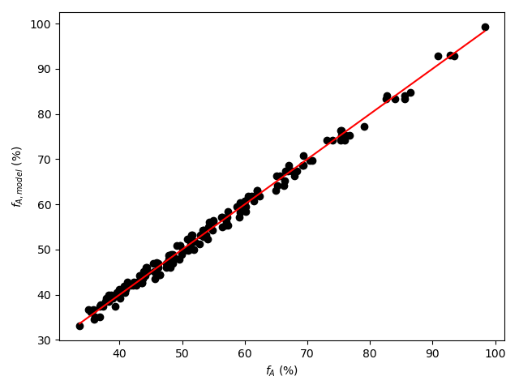

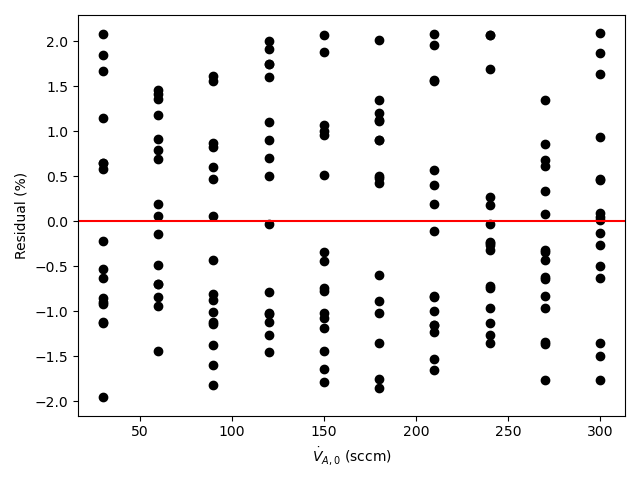

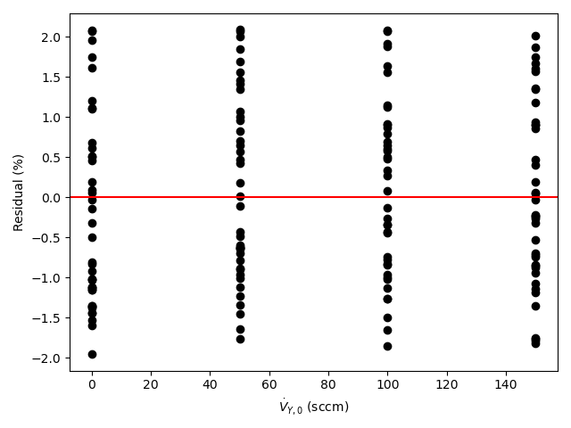

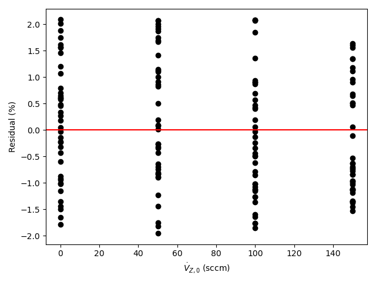

Parity and Residuals Plots.
:::

:::{.callout-tip collapse="true"}
## Click Here to See What an Expert Might be Thinking at this Point

By all criteria, the rate expression appears to be very accurate. The coefficient of determination is close to 1.0, the upper and lower limits of the 95% confidence interval for $k$ are very close to the value of $k$, the points in the parity plot are all very close to the diagonal line, and in each of the residuals plots the scatter is random with no apparent trends.

:::

<center>**Assessment**</center>

When the rate coefficient in @tbl-example_21_5_1_results is used in the proposed rate expression, it is acceptably accurate.

---

### Power-Law Kinetics of a Heterogeneous Catalytic Reaction {#sec-example_21_5_2}

 include examples/reb_21_5_2/narrative.qmd >}}

 include examples/reb_21_5_2/equations.qmd >}}


#| echo: false
#| output: false
d <- read.csv("examples/reb_21_5_2/reb_21_5_2_data.csv")
 # yA, yB, yY, yZ, PA
```

The first few data points are shown in @tbl-example_21_5_2_data; the full data set are available in the file, [reb_21_5_2_data.csv](examples/reb_21_5_2/reb_21_5_2_data.csv).


#| echo: false
#| warning: false
#| label: tbl-example_21_5_2_data
#| tbl-cap: First 8 of the 64 experimentally generated data.
kbl(d[1:8,], format = "markdown", align = "ccccc", 
  col.names = c('y~A,0~','y~B,0~','y~Y,0~', 'y~Z,0~', 'P~A,1~ (atm)'))
```

---

:::{.callout-tip collapse="true"}
## Click Here to See What an Expert Might be Thinking at this Point

The assignment narrative describes reactor experiments, provides the data generated in those experiments, and asks me to use them to assess the accuracy of a proposed rate expression. Those are distinguishing characteristics of a kinetics data analysis assignment. 

I'll begin by summarizing the assignment. I'll assign an appropriate variable symbol to represent each of the quantities provided in the assignment. While doing so I will use a subscripted "0" to denote a quantity value at the inlet to the reactor, and a subscripted "1" to denote one at the outlet. I'll use subscripted "CI,l" and "CI,u" to denote values that are  the lower or upper limit of a 95% confidence interval. I'll underline a variable symbol if it represents a set of values (i. e. a vector).

In the experiments for this assignment, a PFR that operated isothermally and at steady-state was used. The adjusted experimental inputs were the inlet mole fractions of the four reagents and the measured response was the outlet partial pressure of A. 

All of the data in this assignment are at the same temperature. That means I can estimate the rate coefficient, $k$, but not the Arrhenius parameters. I can also estimate the power-law exponents, so fitting the responses model to the experimental data will yield $k$, $\alpha_A$, $\alpha_B$, $\alpha_Y$, and $\alpha_Z$, so I'll list them as quantities of interest. The coefficient of determination, $R^2$, a parity plot, and residuals plots will help me assess the accuracy of the proposed rate expression. To make those plots, I'll need the model-predicted responses and the experiment residuals for the experiments, so I'll list them as quantities of interest, as well.

:::

#### Assignment Summary

**Reactor System:** Isothermal, steady-state PFR

**Reactor Schematic:**

{#fig-example_21_5_2_schematic}

**Adjusted Experimental Inputs:** $\underline{y}_{A,0}$, $\underline{y}_{B,0}$, $\underline{y}_{Y,0}$, and $\underline{y}_{Z,0}$.

**Experimental Response:** $\underline{P}_{A,1}$

**Quantities of Interest:** $k$, $k_{CI,l}$, $k_{CI,u}$, $\alpha_A$, $\alpha_{A,CI,l}$, $\alpha_{A,CI,u}$, $\alpha_B$, $\alpha_{B,CI,l}$, $\alpha_{B,CI,u}$, $\alpha_Y$, $\alpha_{Y,CI,l}$, $\alpha_{Y,CI,u}$, $\alpha_Z$, $\alpha_{Z,CI,l}$, $\alpha_{Z,CI,u}$, $R^2$, $\underline{P}_{A,1}$ *vs.* $\underline{P}_{A,1,model}$ as a parity plot, $\underline{\epsilon}_{expt}$ *vs.* $\underline{y}_{A,0}$, *vs.* $\underline{y}_{B,0}$, *vs.* $\underline{y}_{Y,0}$, and *vs.* $\underline{y}_{Z,0}$ as residuals plots.

**Given and Known Constants:** $T$ = 400 °C, $P$ = 1 atm, $m_{catalyst}$ = 3.0 g, $\dot{V}_{in}$ = 0.85 L~stp~ min^-1^, and $K$ = 12.2.

:::{.callout-tip collapse="true"}
## Click Here to See What an Expert Might be Thinking at this Point

This is a kinetics data analysis assignment, and I know that to complete it I will need a predicted response model that relates the rate expression parameters and the adjusted experimental inputs for any one experiment to the measured response from that experiment. I can begin to generate the predicted response model by generating a model for the PFR used in the experiments. The PFR model relates the rate expression parameters and the adjusted experimental inputs to the molar flow rates of the reagents. To generate the predicted responses model I can solve the PFR design equations, and use the outlet molar flow rates to calculate the response.

Once I have a predicted response model, I can fit it to the experimental data to get estimates and uncertainties for the parameters and the coefficient of determination. Using the estimated parameters in the predicted responses model will generate the model-predicated responses for the experiments, and those can be used to calculate the experiment residuals. That will allow me to generate a parity plot and residuals plot.

To complete the assignment I can assess the accuracy of the rate expression by noting that for an accurate model the following criteria are satisfied:

The coefficient of determination is close to 1.0.
The points in the parity plot are close to the parity line.
The points in the residuals plots scatter randomly about zero with no apparent trends or systematic deviations.
The lower and upper limits of the 95% confidence interval for most, if not all, of the rate expression parameters close to their estimated values.

:::

<center>**Task List**</center>

1. Develop the PFR model.
2. Using the PFR model, develop a predicted responses model.
3. Fit the predicted responses model to the experimental data.
4. Generate a parity plot and residuals plots.
5. Assess the accuracy of the rate expression.

#### Mathematical Formulation of the Analysis

:::{.callout-tip collapse="true"}
## Click Here to See What an Expert Might be Thinking at this Point

I'll start to formulate a model for the PFR used in the experiments by selecting the design equations I need and simplifying them appropriately for this reactor. The general PFR mole balance is given by @eq-pfr_mol_balance, but when the reactor operates at steady-state the time derivatives are equal to zero an the spatial derivatives become ordinary derivatives as in @eq-pfr_ss_mol_balance. Here there is only one reaction taking place, so the summation over the reactions reduces to a single term and it isn't necessary to index the reaction, as shown below.

$$
\frac{d \dot n_i}{d z} =\frac{\pi D^2}{4}\nu_{i}r
$$

In this assignment, however, the dimensions of the reactor are not provided, but instead, the catalyst mass. Therefore, I'll need to change the independent variable to the cumulative catalyst mass. I can also normalize the rate per catalyst mass, in which case the design equations is given below.

$$
\frac{d \dot{n}_i}{dm} = \nu_{i}r
$$

When a PFR operates isothermally at a known temperature and with negligible pressure drop, the mole balance design equations can be solved independently of the energy and momentum balances. Doing so yields the molar flow rates within and at the outlet of the reactor which is all that is needed for kinetics data analysis. So the mole balances for each of the reagents are the only design equations needed.

The mole balances are IVODEs, and to solve them numerically using an IVODE solver I will need initial values for all variables and a stopping criterion. At the inlet to the reactor, the cumulative mass will equal zero, giving the initial value for the independent variable. The other initial values are then the molar flow rate of each of the ragents at the reactor inlet. I know the final mass of catalyst, so $m = m_{catalyst}$ can be used as the stopping criterion.

:::

<center>**Isothermal, Steady-State PFR Model**</center>

**Design Equations**

$$
\frac{d\dot{n}_A}{dm} = -r \tag{3}
$$

$$
\frac{d\dot{n}_B}{dm} = -r \tag{4}
$$

$$
\frac{d\dot{n}_Y}{dm} = r \tag{5}
$$

$$
\frac{d\dot{n}_Z}{dm} = r \tag{6}
$$

**Initial Values and Stopping Criterion**

| Variable | Initial Value | Stopping Criterion |
|:-------|:-------:|:-------:|
| $m$ | $0$ | $m_{\text{catalyst}}$ |
| $\dot{n}_A$ | $\dot{n}_{A,0}$ |  |
| $\dot{n}_B$ | $\dot{n}_{B,0}$ |  |
| $\dot{n}_Y$ | $\dot{n}_{Y,0}$ |  |
| $\dot{n}_Z$ | $\dot{n}_{Z,0}$ |  |

: Initial values and stopping criterion for solving the design equations, equations (3) through (6). {#tbl-example_21_5_2_initial_values tbl-colwidths="[20, 40, 40]"}

:::{.callout-tip collapse="true"}
## Click Here to See What an Expert Might be Thinking at this Point

In addition to the initial values and stopping criterion, I will need to write a derivatives function (see @sec-apndx_solve_ivodes). The derivatives function will be called by an IVODE solver from a mathematics software package. For that reason, the the independent and dependent variables must be the only arguments passed to the derivatives function, and it must return the corresponding values of the design equation derivatives and nothing else.

So, the derivatives function will be given values for $m$, $\dot{n}_A$, $\dot{n}_B$, $\dot{n}_Y$, and $\dot{n}_Z$, and using them, it must evaluate the right-hand sides of equations (3) - (6) and return the results. Of course, I can use the known constants given in the assignment narrative, but if any other input is needed, it must be provided by some means other than as an argument.

The only variables on the right-hand sides of equations (3) - (6) is the rate, $r$. It's not a known constant, so it will need to be calculated. The rate expression, equation (2), can be used, but that requires $k$, the power-law exponents, the partial pressures of the reagents and $K$. As the responses model is being fit to the experimental data, the fitting function will be varying the value of $k$ and the power-law exponents, so they cannot be calculated and must be made available to the derivatives function. The equilibrium constant, $K$, is a known constant. The partial pressures of the reagents can be calculated within the derivatives function. They are simply equal to the mole fraction of each reagent times the pressure.

$$
P_i = y_iP = \frac{\dot{n}_i}{sum_i\left(\dot{n}_i\right)}P
$$


:::

**Derivatives Function**

[Arguments]{.underline}: $m$, $\dot{n}_A$, $\dot{n}_B$, $\dot{n}_Y$, and $\dot{n}_Z$.

[Returns]{.underline}: $\frac{\dot{n}_A}{dm}$, $\frac{\dot{n}_B}{dm}$, $\frac{\dot{n}_Y}{dm}$, and $\frac{\dot{n}_Z}{dm}$.

[Must be Available]{.underline}: $k$, $\alpha_A$, $\alpha_B$, $\alpha_Y$, and $\alpha_Z$.

[Algorithm]{.underline}: 

$$
P_A = \frac{\dot{n}_A}{\dot{n}_A++\dot{n}_B+\dot{n}_Y+\dot{n}_Z}P \tag{7}
$$

$$
P_B = \frac{\dot{n}_B}{\dot{n}_A++\dot{n}_B+\dot{n}_Y+\dot{n}_Z}P \tag{8}
$$

$$
P_Y = \frac{\dot{n}_Y}{\dot{n}_A++\dot{n}_B+\dot{n}_Y+\dot{n}_Z}P \tag{9}
$$

$$
P_Z = \frac{\dot{n}_Z}{\dot{n}_A++\dot{n}_B+\dot{n}_Y+\dot{n}_Z}P \tag{10}
$$

$$
r = kP_{A}^{\alpha_A}P_{B}^{\alpha_B}P_{Y}^{\alpha_Y}P_{Z}^{\alpha_Z}\left( 1 - \frac{P_YP_Z}{KP_AP_B} \right) \tag{2}
$$

:::{.callout-tip collapse="true"}
## Click Here to See What an Expert Might be Thinking at this Point

To complete the PFR model I need to write a model function that solves the design equations for any one experiment. It will need to receive the adjusted experimental inputs for that experiment and the current value of $k$ as arguments. It should return the solution of the design equations, that is, corresponding sets of values of the independent variable ($m$) and the dependent variables ($\dot{n}_A$, $\dot{n}_B$, $\dot{n}_Y$, and $\dot{n}_Z$) spanning the range from the reactor inlet to the reactor outlet.

To do so, it must first make $k$, $\alpha_A$, $\alpha_B$, $\alpha_Y$, and $\alpha_Z$ available to the derivatives function since they cannot be passed to the derivatives function as arguments. Next it should evaluate any of the initial and final values in @tbl-example_21_5_1_initial_values that aren't known constants. Here the catalyst mass is a known constant, but the inlet molar flow rates need to be calculated. Doing so simply involves dividing the inlet volumetric flow rates for the current experiment by the molar volume at standard conditions, $\hat{V}_{STP}$ to get the total molar flow rate, and then multiplying that by the inlet mole fraction of each reagent.

It can then get the solution of the design equations by calling an IVODE solver, passing the initial values, stopping criterion and derivatives function as arguments.

:::

**PFR Model Function**

[Arguments]{.underline}: $k$, $\alpha_A$, $\alpha_B$, $\alpha_Y$, and $\alpha_Z$, $y_{A,0}$, $y_{B,0}$, $y_{Y,0}$, and $y_{Z,0}$.

[Returns]{.underline}: $\underline{m}$, $\underline{\dot{n}}_A$, $\underline{\dot{n}}_B$, $\underline{\dot{n}}_Y$, and $\underline{\dot{n}}_Z$ spanning the range from the reactor inlet to the reactor outlet (where $m=m_{catalyst}$).

[Algorithm]{.underline}:

1. Make $k$, $\alpha_A$, $\alpha_B$, $\alpha_Y$, and $\alpha_Z$ available to the derivatives function.
2. Calculate the unknown initial anf final values in @tbl-example_21_5_2_initial_values.

$$
\dot{n}_{A,0} = y_{A,0}\frac{\dot{V}_{0}}{\hat{V}_{STP}} \tag{11}
$$

$$
\dot{n}_{B,0} = y_{B,0}\frac{\dot{V}_{0}}{\hat{V}_{STP}} \tag{12}
$$

$$
\dot{n}_{Y,0} = y_{Y,0}\frac{\dot{V}_{0}}{\hat{V}_{STP}} \tag{13}
$$

$$
\dot{n}_{Z,0} = y_{Z,0}\frac{\dot{V}_{0}}{\hat{V}_{STP}} \tag{14}
$$

3. Get corresponding sets of $m$, $\dot{n}_A$, $\dot{n}_B$, $\dot{n}_Y$, and $\dot{n}_Z$ spanning the range from $m=0$ to $m=m_{catalyst}$ by callling an IVODE solver, passing the initial values, stopping criterion and derivatives function as arguments.

:::{.callout-tip collapse="true"}
## Click Here to See What an Expert Might be Thinking at this Point

Having developed a model for the PFR used in the experiments, my next task is to use it to develop a predicted response model that can be fit to the experimental data. The predicted response model must relate the measured response to the rate expression parameters and the adjusted experimental inputs. The PFR model relates the outlet molar flow rates to the rate expression parameters and the adjusted experimental inputs, so all I need is equations that relate the outlet molar flow rates to the measured response. The measured response is the outlet partial pressure of A. By definition, it is equal to the outlet mole fraction of A times the total pressure.

I will use a numerical fitting function from a mathematics or statistics software package to fit the predicted response model to the experimental data (see @sec-apndx_parameter_est). One of the things I will need to provide to it is a predicted responses function, that I must write. The predicted responses function will be called by the numerical fitting function, and it assumes that the only arguments to the predicted responses function are the adjusted experimental inputs and the rate expression parameters, and that the predicted responses function returns the model predicted responses for all of the experiments and nothing else. I can use the known constants given the assignment narrative within the predicted function, but if it requires any other input, I will need to provide that by some means other than as an argument.

Writing the predicted responses function is straightforward. It simply needs to go through the experiments one by one calling the PFR model function and using the the results it returns to calculate the model-predicted response, $P_{A,1,model}$. After doing this for each experiment, the full set of model-predicated responses can be returned.

:::

<center>**Predicted Response Model**</center>

**Predicted Response**

$$
P_{A,1,model} = \frac{\dot{n}_{A}\Big\vert_{m=m_{catalyst}}}{\left( \dot{n}_{A}\Big\vert_{m=m_{catalyst}} + \dot{n}_{B}\Big\vert_{m=m_{catalyst}} + \dot{n}_{Y}\Big\vert_{m=m_{catalyst}} + \dot{n}_{Z}\right)}P\Big\vert_{m=m_{catalyst}} \tag{15}
$$

**Predicted Responses Function**

[Arguments]{.underline}: , $\alpha_A$, $\alpha_B$, $\alpha_Y$, and $\alpha_Z$, $\underline{y}_{A,0}$, $\underline{y}_{B,0}$, $\underline{y}_{Y,0}$, and $\underline{y}_{Z,0}$.

[Returns]{.underline}: $\underline{P}_{A,1,model}$.

[Algorithm]{.underline}:

1. For each experiment in the data set:

    a. Get $\underline{m}$, $\underline{\dot{n}}_A$, $\underline{\dot{n}}_B$, $\underline{\dot{n}}_Y$, and $\underline{\dot{n}}_Z$ by calling the PFR model function passing $k$, $\alpha_A$, $\alpha_B$, $\alpha_Y$, and $\alpha_Z$, $y_{A,0}$, $y_{B,0}$, $y_{Y,0}$, and $y_{Z,0}$ as arguments.

    b. Calculate the predicted response using equation (15).

2. Return $\underline{P}_{A,1,model}$.

:::{.callout-tip collapse="true"}
## Click Here to See What an Expert Might be Thinking at this Point

Now that I have generated the PFR model function and the predicted responses function, most of the remaining tasks can be accomplished simply by making function calls. To estimate the rate expression parameters, parameter uncertainties and get the coefficient of determination, I simply need to make guesses for the rate expression parameters and call the numerical fitting function. Once I’ve done that, all I need to do to generate the data for the parity and residuals plots is to call the predicted responses function using the final parameter estimates and then calculate the experiment residuals.

:::

<center>**Parameter Estimates and Statistics**</center>

1. Define parameter guesses, $k_{guess}$, $\alpha_{A,guess}$, $\alpha_{B,guess}$, $\alpha_{Y,guess}$, and $\alpha_{Z,guess}$.

2. Get $k$, $k_{CI,l}$, $k_{CI,u}$, $\alpha_A$, $\alpha_{A,CI,l}$, $\alpha_{A,CI,u}$, $\alpha_B$, $\alpha_{B,CI,l}$, $\alpha_{B,CI,u}$, $\alpha_Y$, $\alpha_{Y,CI,l}$, $\alpha_{Y,CI,u}$, $\alpha_Z$, $\alpha_{Z,CI,l}$, $\alpha_{Z,CI,u}$, and $R^2$ by calling a numerical fitting function, passing the parameter guesses, the adjusted experimental inputs, the experimental responses, and the predicted responses function as arguments.

<center>**Assessment Graphs**</center>

1. Get $\underline{P}_{A,1,model}$ by calling the predicted repsonses function passing the estimated parameters, $k$, $\alpha_A$, $\alpha_B$, $\alpha_Y$, and $\alpha_Z$, and the adjusted experimental inputs as arguments.

2. Calculate the experiment residuals.

$$
\underline{\epsilon}_{expt} = \underline{P}_{A,1,model} - \underline{P}_{A,1} \tag{16}
$$

3. Generate a parity plot showing $\underline{P}_{A,1}$ *vs.* $\underline{P}_{A,1,model}$ as points and $\underline{P}_{A,1}$ = $\underline{P}_{A,1,model}$ as the parity line.

4. Generate residuals plots showing $\underline{\epsilon}_{expt}$ *vs.* $\underline{y}_{A,0}$, *vs.* $\underline{y}_{B,0}$, *vs.* $\underline{y}_{Y,0}$, and *vs.* $\underline{y}_{Z,0}$.

<center>**Calculations Summary**</center>

1. Read the adjusted experimental inputs and the experimental responses from the file, [reb_21_5_2_data.csv](examples/reb_21_5_2/reb_21_5_2_data.csv).

2. Calculate the parameter estimates and statistics and generate the assessment graphs as described above.

3. Display the results and/or save them to a file.

#### Results, Analysis, and Discussion


#| echo: false
#| output: false
d <- read.csv('examples/reb_21_5_2/reb_21_5_2_results.csv')
d <- fmt_tibble_col(d, 2, 3, 2, 1)
a <- c('k','α~A~','α~B~','α~Y~','α~Z~','R^2^')
b1 <- paste0(d$value[1],' ',d$units[1],', 95% CI [',d$value[2],', ',d$value[3],']')
b2 <- paste0(d$value[4],' ',d$units[4],', 95% CI [',d$value[5],', ',d$value[6],']')
b3 <- paste0(d$value[7],' ',d$units[7],', 95% CI [',d$value[8],', ',d$value[9],']')
b4 <- paste0(d$value[10],' ',d$units[10],', 95% CI [',d$value[11],', ',d$value[12],']')
b5 <- paste0(d$value[13],' ',d$units[13],', 95% CI [',d$value[14],', ',d$value[15],']')
b <- c(b1,b2,b3,b4,b5,d$value[16])
d <- data.frame(a,b)
```

The calculations were performed as described above. The resulting values of the rate expression parameters, their 95% confidence intervals, and the coefficient of determination, $R^2$, are shown in @tbl-example_21_5_2_results. The parity plot is shown in @fig-example_21_5_2_parity, and the residuals plots are shown in @fig-example_21_5_2_residuals_plots.


#| echo: false
#| warning: false
#| label: tbl-example_21_5_2_results
#| tbl-cap: Parameter estimation results
kbl(d, format = "markdown", align = "cc", col.names = NULL)
```

{#fig-example_21_5_2_parity width=80%}

::: {#fig-example_21_5_2_residuals_plots layout-ncol=2}

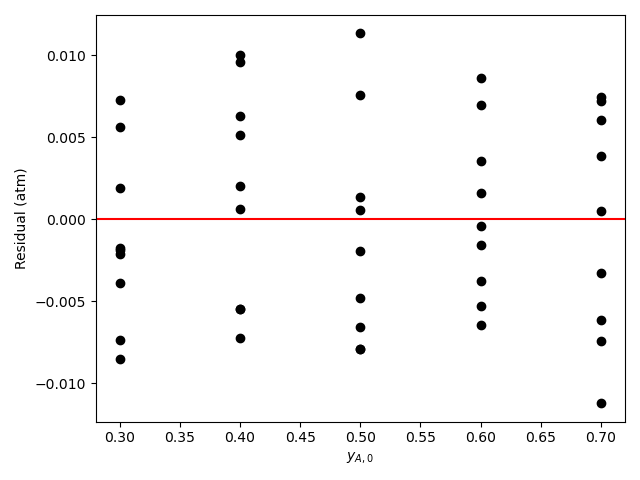

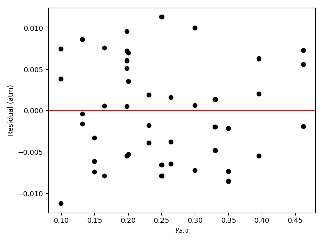

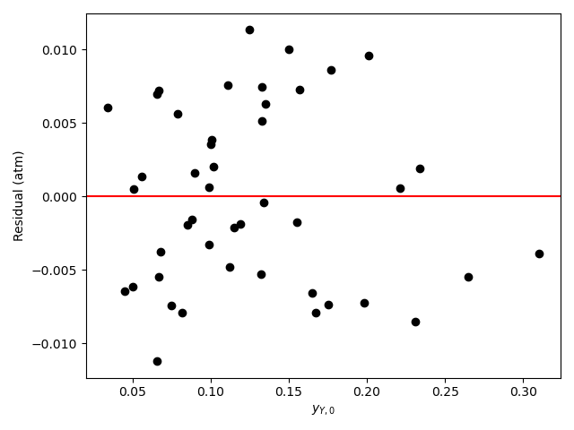

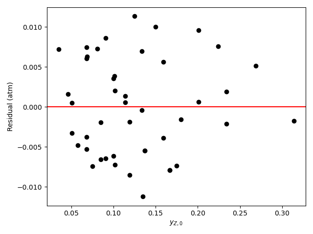

Residuals Plots.
:::

**Assessment**

:::{.callout-tip collapse="true"}
## Click Here to See What an Expert Might be Thinking at this Point

The coefficient of determination is close to 1.0, the points on the parity plot lie close to the diagonal line, and the points in the residuals plots scatter randomly about zero. This suggests an accurate rate expression. However, the upper and lower limits of the 95% confidence intervals for the parameters are significant compated to the parameter values. This suggests some inaccuracy in the model.

:::

Based upon the parity plot, residuals plots and coefficient of determination, the rate expression in equation (2) accurately predicts the experimental results when the parameters have the values shown in @tbl-example_21_5_2_results. The confidence intervals are not narrow relative to the parameters' values, but they are acceptable. It is possible that additional experiments at different conditions would tighten the confidence intervals for the parameters.

---

### Mechanistic Kinetics of a Heterogeneous Catalytic Reaction {#sec-example_21_5_3}

 include examples/reb_21_5_3/narrative.qmd >}}

 include examples/reb_21_5_3/equations.qmd >}}


#| echo: false
#| output: false
d <- read.csv("examples/reb_21_5_2/reb_21_5_2_data.csv")
```

The first few data points are shown in @tbl-example_21_5_3_data; the full data set are available in the file, [reb_21_5_2_data.csv](examples/reb_21_5_2/reb_21_5_2_data.csv).


#| echo: false
#| warning: false
#| label: tbl-example_21_5_3_data
#| tbl-cap: First 8 of the 64 experimentally generated data.
kbl(d[1:8,], format = "markdown", align = "ccccc", 
  col.names = c('y~A,in~','y~B,in~','y~Y,in~', 'y~Z,in~', 'P~A,out~ (atm)'))
```

---

:::{.callout-tip collapse="true"}
## Click Here to See What an Expert Might be Thinking at this Point

The only difference between this assignment and the one from [Example -@sec-example_21_5_2] is the rate expression to be assessed. As a consequence, the rate expression parameters to be estimated in this assignment are different, as is the rate expression used in the derivatives function. So, apart from those two changes, I can use the same assignment summary and mathematical formulations as I used in the preceding example.

:::

#### Assignment Summary

**Reactor System:** Isothermal, steady-state PFR

**Reactor Schematic:**

{#fig-example_21_5_2_schematic}

**Adjusted Experimental Inputs:** $\underline{y}_{A,0}$, $\underline{y}_{B,0}$, $\underline{y}_{Y,0}$, and $\underline{y}_{Z,0}$.

**Experimental Response:** $\underline{P}_{A,1}$

**Quantities of Interest:** $k$, $k_{CI,l}$, $k_{CI,u}$, $K_A$, $K_{A,CI,l}$, $K_{A,CI,u}$, $K_B$, $K_{B,CI,l}$, $K_{B,CI,u}$, $K_Y$, $K_{Y,CI,l}$, $K_{Y,CI,u}$, $K_Z$, $K_{Z,CI,l}$, $K_{Z,CI,u}$, $R^2$, $\underline{P}_{A,1}$ *vs.* $\underline{P}_{A,1,model}$ as a parity plot, $\underline{\epsilon}_{expt}$ *vs.* $\underline{y}_{A,0}$, *vs.* $\underline{y}_{B,0}$, *vs.* $\underline{y}_{Y,0}$, and *vs.* $\underline{y}_{Z,0}$ as residuals plots.

**Given and Known Constants:** $T$ = 400 °C, $P$ = 1 atm, $m_{catalyst}$ = 3.0 g, $\dot{V}_{in}$ = 0.85 L~stp~ min^-1^, and $K$ = 12.2.

<center>**Task List**</center>

1. Develop the PFR model.
2. Using the PFR model, develop a predicted responses model.
3. Fit the predicted responses model to the experimental data.
4. Generate a parity plot and residuals plots.
5. Assess the accuracy of the rate expression.

#### Mathematical Formulation of the Analysis

<center>**Isothermal, Steady-State PFR Model**</center>

**Design Equations**

$$
\frac{d\dot{n}_A}{dm} = -r \tag{3}
$$

$$
\frac{d\dot{n}_B}{dm} = -r \tag{4}
$$

$$
\frac{d\dot{n}_Y}{dm} = r \tag{5}
$$

$$
\frac{d\dot{n}_Z}{dm} = r \tag{6}
$$

**Initial Values and Stopping Criterion**

| Variable | Initial Value | Stopping Criterion |
|:-------|:-------:|:-------:|
| $m$ | $0$ | $m_{\text{catalyst}}$ |
| $\dot{n}_A$ | $\dot{n}_{A,0}$ |  |
| $\dot{n}_B$ | $\dot{n}_{B,0}$ |  |
| $\dot{n}_Y$ | $\dot{n}_{Y,0}$ |  |
| $\dot{n}_Z$ | $\dot{n}_{Z,0}$ |  |

: Initial values and stopping criterion for solving the design equations, equations (3) through (6). {#tbl-example_21_5_2_initial_values tbl-colwidths="[20, 40, 40]"}

**Derivatives Function**

[Arguments]{.underline}: $m$, $\dot{n}_A$, $\dot{n}_B$, $\dot{n}_Y$, and $\dot{n}_Z$.

[Returns]{.underline}: $\frac{\dot{n}_A}{dm}$, $\frac{\dot{n}_B}{dm}$, $\frac{\dot{n}_Y}{dm}$, and $\frac{\dot{n}_Z}{dm}$.

[Must be Available]{.underline}: $k$, $K_A$, $K_B$, $Y_Y$, and $K_Z$.

[Algorithm]{.underline}: 

$$
P_A = \frac{\dot{n}_A}{\dot{n}_A++\dot{n}_B+\dot{n}_Y+\dot{n}_Z}P \tag{7}
$$

$$
P_B = \frac{\dot{n}_B}{\dot{n}_A++\dot{n}_B+\dot{n}_Y+\dot{n}_Z}P \tag{8}
$$

$$
P_Y = \frac{\dot{n}_Y}{\dot{n}_A++\dot{n}_B+\dot{n}_Y+\dot{n}_Z}P \tag{9}
$$

$$
P_Z = \frac{\dot{n}_Z}{\dot{n}_A++\dot{n}_B+\dot{n}_Y+\dot{n}_Z}P \tag{10}
$$

$$
r = \frac{kP_{A}P_{B}}{1 + K_AP_A + K_BP_B + K_YP_Y + K_ZP_Z }\left( 1 - \frac{P_YP_Z}{K_1P_AP_B} \right) \tag{2}
$$

**PFR Model Function**

[Arguments]{.underline}: $k$, $K_A$, $K_B$, $K_Y$, and $K_Z$, $y_{A,0}$, $y_{B,0}$, $y_{Y,0}$, and $y_{Z,0}$.

[Returns]{.underline}: $\underline{m}$, $\underline{\dot{n}}_A$, $\underline{\dot{n}}_B$, $\underline{\dot{n}}_Y$, and $\underline{\dot{n}}_Z$ spanning the range from the reactor inlet to the reactor outlet (where $m=m_{catalyst}$).

[Algorithm]{.underline}:

1. Make $k$, $K_A$, $K_B$, $K_Y$, and $K_Z$ available to the derivatives function.
2. Calculate the unknown initial anf final values in @tbl-example_21_5_2_initial_values.

$$
\dot{n}_{A,0} = y_{A,0}\frac{\dot{V}_{0}}{\hat{V}_{STP}} \tag{11}
$$

$$
\dot{n}_{B,0} = y_{B,0}\frac{\dot{V}_{0}}{\hat{V}_{STP}} \tag{12}
$$

$$
\dot{n}_{Y,0} = y_{Y,0}\frac{\dot{V}_{0}}{\hat{V}_{STP}} \tag{13}
$$

$$
\dot{n}_{Z,0} = y_{Z,0}\frac{\dot{V}_{0}}{\hat{V}_{STP}} \tag{14}
$$

3. Get corresponding sets of $m$, $\dot{n}_A$, $\dot{n}_B$, $\dot{n}_Y$, and $\dot{n}_Z$ spanning the range from $m=0$ to $m=m_{catalyst}$ by callling an IVODE solver, passing the initial values, stopping criterion and derivatives function as arguments.

<center>**Predicted Response Model**</center>

**Predicted Response**

$$
P_{A,1,model} = \frac{\dot{n}_{A}\Big\vert_{m=m_{catalyst}}}{\left( \dot{n}_{A}\Big\vert_{m=m_{catalyst}} + \dot{n}_{B}\Big\vert_{m=m_{catalyst}} + \dot{n}_{Y}\Big\vert_{m=m_{catalyst}} + \dot{n}_{Z}\right)}P\Big\vert_{m=m_{catalyst}} \tag{15}
$$

**Predicted Responses Function**

[Arguments]{.underline}: $k$, $K_A$, $K_B$, $K_Y$, and $K_Z$, $\underline{y}_{A,0}$, $\underline{y}_{B,0}$, $\underline{y}_{Y,0}$, and $\underline{y}_{Z,0}$.

[Returns]{.underline}: $\underline{P}_{A,1,model}$.

[Algorithm]{.underline}:

1. For each experiment in the data set:

    a. Get $\underline{m}$, $\underline{\dot{n}}_A$, $\underline{\dot{n}}_B$, $\underline{\dot{n}}_Y$, and $\underline{\dot{n}}_Z$ by calling the PFR model function passing $k$, $K_A$, $K_B$, $K_Y$, and $K_Z$, $y_{A,0}$, $y_{B,0}$, $y_{Y,0}$, and $y_{Z,0}$ as arguments.

    b. Calculate the predicted response using equation (15).

2. Return $\underline{P}_{A,1,model}$.

<center>**Parameter Estimates and Statistics**</center>

1. Define parameter guesses, $k_{guess}$, $K_{A,guess}$, $K_{B,guess}$, $K_{Y,guess}$, and $K_{Z,guess}$.

2. Get $k$, $k_{CI,l}$, $k_{CI,u}$, $K_A$, $K_{A,CI,l}$, $K_{A,CI,u}$, $K_B$, $K_{B,CI,l}$, $K_{B,CI,u}$, $K_Y$, $K_{Y,CI,l}$, $K_{Y,CI,u}$, $K_Z$, $K_{Z,CI,l}$, $K_{Z,CI,u}$, and $R^2$ by calling a numerical fitting function, passing the parameter guesses, the adjusted experimental inputs, the experimental responses, and the predicted responses function as arguments.

<center>**Assessment Graphs**</center>

1. Get $\underline{P}_{A,1,model}$ by calling the predicted repsonses function passing the estimated parameters, $k$, $K_A$, $K_B$, $K_Y$, and $K_Z$, and the adjusted experimental inputs as arguments.

2. Calculate the experiment residuals.

$$
\underline{\epsilon}_{expt} = \underline{P}_{A,1,model} - \underline{P}_{A,1} \tag{16}
$$

3. Generate a parity plot showing $\underline{P}_{A,1}$ *vs.* $\underline{P}_{A,1,model}$ as points and $\underline{P}_{A,1}$ = $\underline{P}_{A,1,model}$ as the parity line.

4. Generate residuals plots showing $\underline{\epsilon}_{expt}$ *vs.* $\underline{y}_{A,0}$, *vs.* $\underline{y}_{B,0}$, *vs.* $\underline{y}_{Y,0}$, and *vs.* $\underline{y}_{Z,0}$.

<center>**Calculations Summary**</center>

1. Read the adjusted experimental inputs and the experimental responses from the file, [reb_21_5_2_data.csv](examples/reb_21_5_2/reb_21_5_2_data.csv).

2. Calculate the parameter estimates and statistics and generate the assessment graphs as described above.

3. Display the results and/or save them to a file.

#### Results, Analysis, and Discussion


#| echo: false
#| output: false
d <- read.csv('examples/reb_21_5_3/reb_21_5_3_results.csv')
d <- fmt_tibble_col(d, 2, 3, 2, 2)
a <- c('k','K~A~','K~B~','K~Y~','K~Z~','R^2^')
b1 <- paste0(d$value[1],' ',d$units[1],', 95% CI [',d$value[2],', ',d$value[3],']')
b2 <- paste0(d$value[4],' ',d$units[4],', 95% CI [',d$value[5],', ',d$value[6],']')
b3 <- paste0(d$value[7],' ',d$units[7],', 95% CI [',d$value[8],', ',d$value[9],']')
b4 <- paste0(d$value[10],' ',d$units[10],', 95% CI [',d$value[11],', ',d$value[12],']')
b5 <- paste0(d$value[13],' ',d$units[13],', 95% CI [',d$value[14],', ',d$value[15],']')
b <- c(b1,b2,b3,b4,b5,d$value[16])
d <- data.frame(a,b)
```

The calculations were performed as described above. A few different sets of rate expression parameters were found to give comparably accurate fits. One such set of the rate expression parameters, their 95% confidence intervals, and the coefficient of determination, $R^2$, are shown in @tbl-example_21_5_3_results where "Inf" indicates infinity. The parity plot is shown in @fig-example_21_5_3_parity, and the residuals plots are shown in @fig-example_21_5_3_residuals_plots.


#| echo: false
#| warning: false
#| label: tbl-example_21_5_3_results
#| tbl-cap: Parameter estimation results
kbl(d, format = "markdown", align = "cc", col.names = NULL)
```

{#fig-example_21_5_3_parity width=80%}

::: {#fig-example_21_5_3_residuals_plots layout-ncol=2}


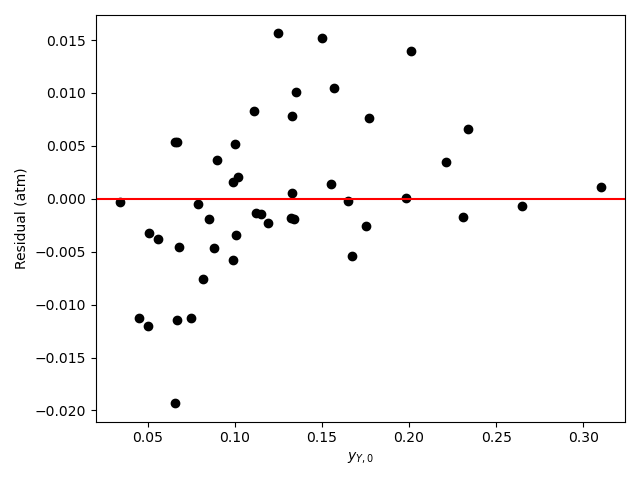

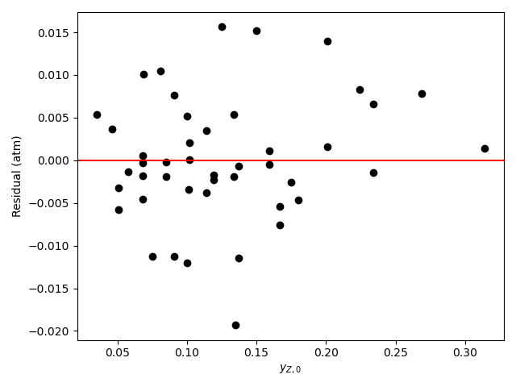

Residuals Plots.
:::

:::{.callout-tip collapse="true"}
## Click Here to See What an Expert Might be Thinking at this Point

Looking at the parity plot and $R^2$, the model appears to be accurate, but there is a problem. For several of the parameters the confidence interval ranges from 0 to infinity. Based on my experience (a novice would not be expected to know this) I know that this can mean that some of the kinetics parameters are kinetically insignificant or coupled. Here, $K_B$ and $K_Y$ are of the order of 10^8^. The total pressure is 1 atm, so the partial pressures will be of the order of 0.1 atm. With this information, looking at the denominator in equation (2) it is apparent that the terms containg $K_B$ and $K_Y$ will be much greater than the other terms ($K_A$ ~ 10^-4^ and $K_Z$ ~ 10^-2^), so the other terms can be eliminated.

$$
r = \frac{kP_{A}P_{B}}{\cancelto{0}{1} + \cancelto{0}{K_AP_A} + K_BP_B + K_YP_Y + \cancelto{0}{K_ZP_Z} }\left( 1 - \frac{P_YP_Z}{K_1P_AP_B} \right)
$$

There is still a problem with the remaining rate expression. Specifically there cannot be a unique set of values of $k$, $K_B$, and $K_Y$ that will minimize the sum of the squares of the residuals. Multiplying the numerator and denominator by any constant, $\alpha$, does not change the rate. Therefore the rate will be the same if the parameters equal $k$, $K_B$, and $K_Y$ or if they equal $\alpha k$, $\alpha K_B$, and $\alpha K_Y$. In other words, the remaining parameters are coupled. This problem can be eliminated by dividing the numerator and denominator by $K_Y$ and defining two new kinetics parameters.

$$
k^\prime = \frac{k}{K_Y}
$$

$$
K_B^\prime = \frac{K_B}{K_Y}
$$

$$
r = \frac{k^\prime P_{A}P_{B}}{K_B^\prime P _B + P_Y}\left( 1 - \frac{P_YP_Z}{K_1P_AP_B} \right)
$$

:::

**Assessment**

The uncertainty in the kinetics parameters is unacceptable. Some of the parameters in equation (2) may be kinetically insignificant or coupled. Examining the parameter estimates, it appears that in the denominator only the terms containing $P_B$ and $P_Y$ are significant. It is recommended to repeat the analysis using the rate expression shown in equation (15).

$$
r = \frac{k^\prime P_{A}P_{B}}{K_B^\prime P _B + P_Y}\left( 1 - \frac{P_YP_Z}{K_1P_AP_B} \right) \tag{15}
$$

**Follow-up**


#| echo: false
#| output: false
d <- read.csv('examples/reb_21_5_3/reb_21_5_3_results_follow_up.csv')
d <- fmt_tibble_col(d, 2, 3, 2, 2)
a <- c("k'","K~B~'",'R^2^')
b1 <- paste0(d$value[1],' ',d$units[1],', 95% CI [',d$value[2],', ',d$value[3],']')
b2 <- paste0(d$value[4],' ',d$units[4],', 95% CI [',d$value[5],', ',d$value[6],']')
b <- c(b1,b2,d$value[7])
d <- data.frame(a,b)
```

The analysis was repeated a third time using equation (15) as the rate expression. The parameter estimation results are shown in @tbl-example_21_5_3_results_2_par. The parity plot is shown in @fig-example_21_5_3_parity_two_par and the residuals plots are shown in @fig-example_21_5_3_residuals_plots_two_par.


#| echo: false
#| warning: false
#| label: tbl-example_21_5_3_results_2_par
#| tbl-cap: Parameter estimation results for equation (15)
kbl(d, format = "markdown", align = "cc", col.names = NULL)
```

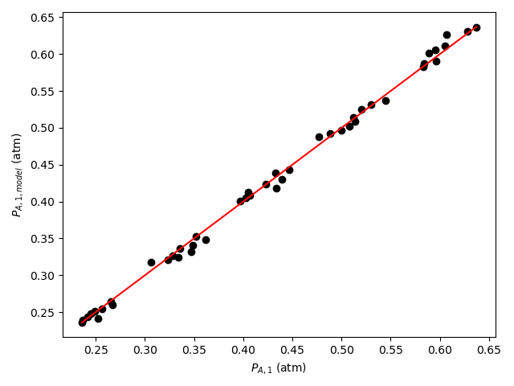{#fig-example_21_5_3_parity_two_par width=80%}

::: {#fig-example_21_5_3_residuals_plots_two_par layout-ncol=2}

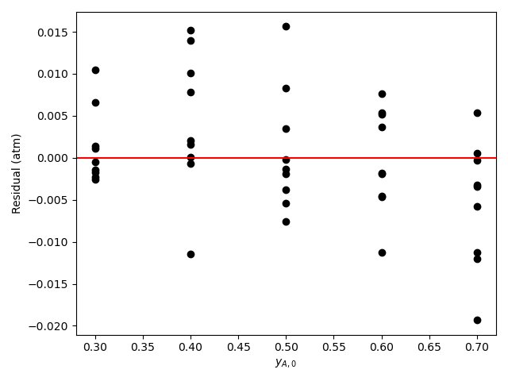

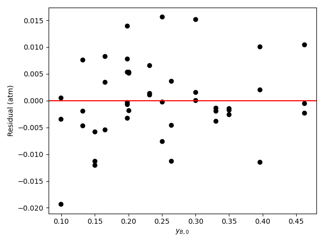


Residuals for Rate Expression (15).
:::

**Final Assessment**

Based upon the parity plot, residuals plots, and coefficient of determination, the rate expression in equation (15) is just as accurate as that in equation (2). In addition, for rate expression (15), there are fewer parameters and their confidence intervals are narrow relative to their values. The rate expression in equation (15) is preferred over the rate expression in equation (2).

---


