# Generation and Analysis of Kinetics Data {#sec-ch11}

The first section of *Reaction Engineering Basics* considered chemical reactions and their rates. The second section examined the modeling and analysis of ideal reactors. This chapter shows how experimental data generated using an ideal reactor is used to estimate the unknown parameters that appear in rate expressions. It may prove helpful to read [Appendix -@sec-apxd_par_est] and the learning objectives in @sec-ch11_learning_objectives before reading this chapter.

## Rate Expression Development and Kinetics Data

If the rate of a reaction has been studied previously, a rate expression for it may be available. When a rate expression is not available, it is necessary to develop one. Reaction rates depend upon temperature, pressure and composition. Temperature can be measured using thermometers or thermocouples. Pressure can be measured using manometers or a wide variety of pressure gauges. Fluid composition can be measured using gas chromatography, mass spectrometry or many other techinques. The same is not true for reaction rates. There isn't a meter, gauge, or instrument that one can put in or attach to a chemical reactor to directly measure the rate of the reaction going on within it. 

Since rates cannot be measured directly, changes in composition (or something related to composition) that occur in chemical reactors are measured instead. Herein, that measured quantity is referred to as the experimental response. The response is measured experimentally at different reactor temperatures, pressures and compositions, resulting in a set of experimental kinetics data. *Reaction Engineering Basics* only considers the generation and analysis of isothermal, single response kinetics data. Specifically, the experiments considered in *Reaction Engineering Basics*

* are isothermal
* have only one reaction taking place
* are at steady-state if the reactor is a flow reactor
* have negligible pressure drop if the reactor is a PFR
* involve the measurement of only one quantity as the response

### Procedure for Developing a Rate Expression

The following sequence of events is representative of the development of a rate expression for a reaction.

1. A preliminary analysis, perhaps including a few preliminary experiments, is performed to establish the range of conditions (temperature, pressure and composition) over which the rate expression will be used.
2. A laboratory reactor is selected to be used to generate kinetics data.
3. A set of kinetics experiments using that reactor is planned, and the experiments are performed to generate a kinetics data set.
4. A mathematical form is proposed for the rate expression and used to generate a reactor response model that predicts the response for an experiment.
5. The values of all unknown parameters appearing in the proposed rate expression are estimated by "fitting" that model to the experimental data set.
6. The accuracy of the proposed rate expression is assessed.
7. One of the following decisions is made.
    a. Accept the rate expression.
    b. Perform additional experiments and reassess the proposed rate expression using steps 5 through 7.
    c. Reject the proposed rate expression, propose another rate expression with a different mathematical form, and assess the new rate expression using steps 5 through 7.

The identification of the reaction and the preliminary analysis (step 1) can be driven by a variety of factors including a perceived business opportunity, regulatory mandates, etc. Chapters [-@sec-ch3] and [-@sec-ch4] describe how a mathematical form of the rate expression can be postulated empirically, theoretically, or mechanistically (step 4). Chapters [-@sec-ch5] through [-@sec-ch9] describe how to generate a reactor model that includes the proposed rate expression and use that model to predict the response for an experiment (step 4). The emphasis here, then, is on generating the kinetics data (steps 2 and 3), estimating the rate expression parameters (step 5), and assessing its accuracy (steps 6 and 7).

### Design of Kinetics Experiments

The preliminary analysis establishes ranges of temperature, pressure and composition that are suitable and appropriate for running the reaction. The purpose of kinetics experiments is to generate experimental data that span those ranges with sufficient resolution to separate the individual effects of temperature, pressure, and composition upon the rate and capture those effects with high accuracy.

The nature of kinetics experiments is relatively straightforward. In each experiment a group of reactor inputs are adjusted to pre-determined values. Those adjusted experimental input variables are referred to as *factors* when discussing the design of experiments. The person performing the experiment then measures the experimental response. Thus the data from one experiment consist of the values of the factors (adjusted experimental input variables) and the corresponding experimental, or measured, response. Performing many experiments then results in a kinetics data set. A kinetics data set is often recorded in a spreadsheet where there is a column for each factor and a column for the measured response, and each row contains the values of those quantities for one experiment.

Before experiments begin it is necessary to select the type of reactor to be used and identify the response that will be measured in the experiments. The response should be some easily measurable quantity that is related to the change in the composition of the reacting fluid from the start of the experiment to the point when/where the response was measured. There are many possibilities including the outlet or final concentration of a reagent, the conversion of a reactant, an outlet or final mole fraction of a reagent, etc.

The response can also be a property that is related to the concentration of a reagent or the overall composition. For example, if one reagent absorbs radiation of a specific frequency, the transmission of radiation of that frequency through a fixed distance within the reacting fluid can be related to the reagent's concentration. Similarly, the refactive index of a liquid mixture may be related to its composition.

The next step in generating a kinetics data set is to decide which reactor inputs to use as factors. The factors should be chosen so that the resulting kinetics data set will span the desired range of temperature, pressure and composition. Kinetics data are typically generated using small, laboratory-scale reactors. Through the use of a temperature controller, it is usually possible to design the experimental reactor so that it will operate isothermally at a temperature chosen by the reactor operator. A temperature controller is a device that continually monitors the temperature of the reacting fluid and adjusts the amount of heating or cooling provided to the reactor so that the temperature remains constant at the chosen value. This makes temperature an obvious choice for one of the factors.

The pressure is also an obvious choice for one of the factors. For liquid-phase reactions the pressure often does not affect the rate and does not need to be adjusted. For gas phase reactions it usually is straightforward to adjust the initial system pressure in a BSTR from experiment to experiment. With CSTRs and PFRs, it is most often possible to set the inlet pressure and operate the reactor with negligible pressure drop.

The choice of factors related to the composition is less obvious. That is, there are several experimental inputs that can be adjusted to set the composition of the system. For isothermal gas-phase reactions, setting the initial or inlet pressure sets the total molar concentration, as can be seen from the ideal gas law, @eq-pressure_concentration_ideal_gas. Thus, one option is to use the initial or inlet pressure together with the initial or inlet mole fractions of the reagents present in the system as factors. An alternative would be to use the initial molar amounts or the inlet molar flow rates of the reagents as factors.

$$
C_{\text{total}} = \frac{n_{\text{total}}}{V} = \frac{P}{RT}
$${#eq-pressure_concentration_ideal_gas}

It is important to recognize that in BSTRs and PFRs the composition will change as the reaction proceeds. This means that the batch reaction time or the flow reactor space time affect the composition and can be used as a factor. The most important consideration in choosing the composition factors is to ensure that it is possible to span the desired range of compositions by varying them. Whatever composition-related factors are used, it is important to vary the amounts of reactants [and products]{.underline} when performing kinetics experiments.

Having selected the factors to be used during kinetics data generation, it becomes necessary to decide how to vary the factors from one experiment ot the next. The data set could be generated by randomly changing the factors from one experiment to the next, but this may not be a good choice. Typically reaction rates are much more sensitive to temperature than to pressure and composition. (The Arrhenius expression indicates an exponential dependence of rate coefficients upon inverse temperature, and this is much stronger than the composition dependence found in most rate expressions.) Consequently, if composition and temperature are varied simultaneously, the strong temperature effect may mask weaker composition effects. Randomly changing the factors may fail to yield a sufficient number of experiments that separate temperature and composition effects.

A better approach is to select "levels" for each factor and to use an experimental design to change the levels from one experiment to the next. This results in an experimental data set that can be broken into several same-temperature "blocks," where each block consists of all of the experiments conducted at one of the temperature levels. Within each of the blocks, the temperature is the same, and only the pressure and composition vary from experiment to experiment. As such, the effects of pressure and composition are more easily ascertained because the stronger effect of temperature is absent.

To design the experiments a set of "levels" must be chosen for each of the factors. These are the values to which the factors will be adjusted during the experiments. For example, it might be decided to use four temperature levels of 100, 110, 120 and 130 °C. That means that a set of experiments will be conducted at 100 °C, another set at 110 °C, and so on. Things that must be considered when choosing the levels for each factor include the time that is available for doing the experiments and the cost of the experiments (purchase of reagents, salaries for technicians performing the experiments, etc.). 

Sometimes there can be a trade off between the resolution of the experimental data and the time/cost of the experiments. A design with more levels should capture the effect of changing a factor more fully, but it will require more experimental time and cost more. A design with fewer levels will reduce the experimental time required and cost less, but it may not fully capture the effects of changing temperature, pressure, and composition.

The kinetics experiments entail adjusting each of the inputs to one of its levels, measuring the corresponding response, adjusting one or more of the inputs to a different one of its levels, measuring the response, etc. The final aspect of experimental design is deciding which combinations of levels to use to generate the kinetics data. There are a few ways to do this. A common one, sometimes called a full factorial design, simply includes every possible combination of the input levels.

## Kinetics Parameter Estimation

Exact values for rate expression parameters cannot be determined. Instead, kinetics parameters are estimated using the experimental data. Parameter estimation is a statistical process for finding parameter values that give the best agreement between the experimental responses and the responses predicted by a reactor model for those experiments. For this reason, parameter estimation is sometimes referred to as fitting a reactor model to the experimental data. A few more details about parameter estimation are provided in [Appendix -@sec-apxd_par_est].

The models that are fit to kinetics data are reactor models like those used in Chapters [-@sec-ch6] through [-@sec-ch9]. Because the kinetics experiments are isothermal at a known temperature, and for PFRs have negligible pressure drop, only mole balances need to be included in the design equations. Since CSTRs and PFRs are operated at steady-state when generating kinetics data, the steady-state mole balances are used.

There are three kinds of parameters found in the rate expressions considered in *Reaction Engineering Basics*. Rate coefficients are expected to depend upon temperature according to the Arrhenius expression, @eq-arrhenius, and as such, each rate coefficient introduces two parameters into the rate expression, a pre-exponential factor and an activation energy. Note, however, that if all of the data being analyzed are at the same temperature, the rate coefficient, itself, is the same in every experiment. Consequently the pre-exponential factor and activation energy cannot be be estimated individually, and instead, the rate coefficient must be used as the rate expression parameter to be estimated.

Equilibrium constants sometimes appear in rate expressions. If the thermodynamic data (Gibbs free energy, etc.) needed to calculate an equilibrium constant are available, it is not treated as a rate expression parameter. However, in some situations, for example, when using a mechanistic rate expression, the thermodynamic data needed to calculate an equilibrium constant may not be known. When theromodynamics data do not exist, equilibrium constants can be treated as rate expression parameters. To a first approximation, they are expected to depend upon temperature according to an Arrhenius-like expression, @eq-K_arrhenius_dependence, and so, as rate expression parameters, unknown equilibrium constants are equivalent to rate coefficients.

The third kind of parameter found in some rate expressions is an exponent that appears in a power-law rate expression, @eq-power_law_expr_conc or @eq-power_law_expr_part_press. Unlike rate coefficients and equilibrium constants, power-law exponents do not have a theoretical basis and are not expected to depend upon temperature in any particular manner. This becomes important when analyzing same-temperature data blocks as described below.

### Using a Numerical Fitting Function {#sec-use_numerical_fitting}

In the most rigorous approach to parameter estimation, the predicted responses model is fit to the entire experimental data set using a numerical fitting function as described in [Appendix -@sec-apxd_par_est]. Four things must be provided to a numerical fitting function: (1) the adjusted experimental inputs for all of the expriments, (2) the experimentally measured responses for all of the experiments, (3) an initial guess for every parameter in the rate expression, and (4) a predicted responses function.

Parameter estimation using the full experimental data set is preferred because every parameter appearing in the proposed rate expression is estimated using the entire experimental data set. Another advantage of using a numerical fitting function is that it can be used with virtually any proposed rate expression. Two disadvantages are that the success of a numerical fitting function can be very sensitive to the initial guesses for the rate expression parameters, and it requires writing a predicted responses function as described in the next sub-section.

Sensitivity to the initial guesses can be particularly acute for pre-exponential factors. The possible range of values for an Arrhenius pre-exponential factor spans tens of orders of magnitude. For example, an unknown Arrhenius pre-expoential factor could have a value anywhere in the range from 10^-20^ to 10^20^ or wider. If the initial guess is not sufficiently close to the true value, the numerical fitting function will fail. One way to address this is to define a new parameter that is equal to the base-10 logarithm of the pre-exponential factor. Doing so reduces the range of possible values to between -20 and +20 and improves the likelihood that the numerical fitting function will succeed. In other words, instead of using a numerical fitting function to find the best value for an Arrhenius pre-exponential factor, it is used to find the best value for the base-10 log of that pre-exponential factor. Of course, the predicted responses function must be modified accordingly.

In a similar vein, success can be sensitive to guesses for Arrhenius activation energies because they appear in exponentials. Using small activation energies as initial guesses can improve the likelihood of a numerical fitting function being successful. Some of the examples at the end of this chapter discuss issues associated with initial guesses for rate expression parameters.

When a numerical fitting function is successful, it will return the best estimate for each parameter, a measure of the uncertainty in each parameter estimate, the coefficient of determination ($R^2$), and often, the model predicted responses corresponding to the estimated parameter values. The measure of uncertainty in the parameter estimates typically takes the form of a standard error or a 95% confidence interval. If the numerical fitting function does not return the model-predicted responses for the estimated parameters, they can easily be obtained by calling the predicted responses function directly.

#### Predicted Responses Function

The analysis of a set of kinetics data using a numerical fitting function requires a mathematical model that uses the rate expression being developed to predict the responses for the experiments that were performed. Once the mathematical form of the rate expression has been proposed, a model for the reactor used in the experiments can be created. This reactor model is no different from the reactor models generated and used in Chapters [-@sec-ch6] through [-@sec-ch9]. As noted above only the mole balances are included in the reactor model since the reactor is isothermal, and for CSTRs and PFRs, the steady-state mole balances are used.

If the reactor is a steady-state CSTR, numerical solution of the reactor model uses an ATE solver and requires a residuals function and initial guesses for the reactor outputs. If the reactor is a BSTR or a steady-state PFR, numerical solution of the reactor model uses an IVODE solver and requires initial values, a stopping criterion, and a derivatives function. In essence, each experiment can be thought of as a reactor response modeling task where the quantity of interest is the quantity that was measured experimentally as the response.

As arguments, the predicted responses function is given the adjusted experimental inputs for all of the experiments and values for all of the parameters that appear in the proposed rate expression. For each experiment it uses the reactor model to solve the design equations and calculate the predicted response. After doing so for every experiment, it returns the full set of model-predicted responses.

### Using a Linearized Reactor Model {#sec-use_linearized_model}

A slightly less rigorous approach to parameter estimation uses linear least squares instead of a numerical fitting function. While this approach cannot always be used, before computers became readily available it was employed widely, and it is still taught and used routinely today. In this approach, the data set is broken into same-tempeature blocks of data. That is, all of the data in a block have the same experimental temperature and no other blocks have data with that temperature. Each same-temperature data block is analyzed separately.

This approach involves two stages of analysis. In the first stage the rate expression parameters are estimated separately for each same-temperature block of data. Because the temperature is the same for every experiment in the data block, the rate coefficient is the parameter that is estimated, not the pre-exponential factor and the activation energy. This yields rate coefficient estimates at each temperature. In a second stage of  analysis, the Arrhenius expression is fit to those results to find pre-exponential factors and activation engergies. Hence, instead of estimating each pre-exponential factor and each activation energy using the full data set, rate coefficients are estimated at each temperature using only the data for experiments at that temperature. Then the pre-exponential factors and activation energies are estimated using the rate coefficient estimates.

There are two requirements for using this approach. First, the reactor model for predicting the response must be an algebraic equation. As a consequence, for BSTRs and PFRs where the models are ODEs, only one mole balance is used. Since only one reaction is taking place, the minimum number of mole balances is one, and the molar amounts of all other reagents are related through stoichiometry (see [Chapter -@sec-ch5_quant_analysis]).

The second requirement is that it must be possible to linearize the algebraic mole balance with respect to the rate expression parameters. Linearizing the predicted response model is described in [Appendix -@sec-apxd_par_est]. As an example, if the model contains two rate expression parameters, it must be possible to rearrange it in the form of a straight line.

$$
y = mx + b
$$

The slope, $m$, and the intercept, $b$, must be unique combinations of the rate expression parameters, and the variables, $y$ and $x$, must be unique combinations of the adjusted experimental inputs and the measured response.

When those requirements are satisfied, the values of $x$ and $y$ can be calculated for each experiment in a same-temperature data block using the adjusted experimental inputs and the measured response for that experiment experiment. The slope and the intercept for that same-temperature data block can then be estimated by fitting the linearized predicted response model to the $\left(x - y \right)$ data using linear least squares. Finally, since the slope and intercept are unique, known combinations of the rate expression parameters, estimated values for the rate expression parameters can be calculated using the estimated values of the slope and intercept. In this way the analysis of each same-temperature data block yields one temperature-parameter data point for each parameter.

So, for example, if $k$ and $K$ were the rate expression parameters, one $\left(T - k\right)$ data point and one $\left(T - K\right)$ data point would be obtained for each same-temperature data block. Analyzing all of the same-temperature data blocks then yields secondary $\left(T - k\right)$ and $\left(T - K\right)$ data sets. In the second stage of the analysis, the Arrhenius expression is fit to the secondary $k$ *vs.* $T$ data and to the secondary $K$ *vs.* $T$ data to estimate the pre-exponential factor and activation energy for $k$ and the pre-exponential factor and the heat of reaction for $K$.

For power-law rate expressions, this approach will yield estimates for each power-law exponent at each experimental temperature. As mentioned previously, there isn't a theoretical or expected temperature dependence for power-law exponents. If the estimated value of a power-law exponent is effectively the same for every same-temperature data block, it can be taken to be constant. However, if the estimate varies with temperature, it becomes necessary to find an empirical expression for its temperature dependence. If an expression for the temperature dependence of a power-law exponent cannot be found, this approach yields a table of values of each power-law exponent as a function of temperature. Interpolation would need to be used for temperatures not in the table, and the rate expression would not be very useful, even if it was very accurate in representing the individual data blocks.

The advantages of using linear least squares with same-temperature data blocks are that it eliminates the need to provide an initial guess for the value of each parameter, and it eliminates the need to write a model-predicted responses function. In fact, linear least squares parameter estimation can be performed using a spreadsheet program eliminating the need to write any code. The disadvantages are that this approach cannot be used if the predicted responses model cannot be written in the form of a linear equation, and it is not as rigorous as using a fitting function where every data point is used for the estimation of every parameter.

### Using Approximate Reactor Response Models {#sec-use_approx_model}

A third approach to parameter estimation uses an approximate reactor model and is sometimes referred to as differential data analysis. Instead of solving the IVODE reactor models for BSTRs or PFRs analytically, the derivative is estimated using finite differences as shown for a BSTR in @eq-bstr_diff_mol_bal. The primary advantage of this approach is that it converts the reactor model from an IVODE to an ATE, eliminating the need to solve the IVODE analytically. The derivative can be approximated using backward (@eq-backward_differences), forward (@eq-forward_differences) or central differences (@eq-central_differences). Analogous expressions can be used to approximate the PFR mole balance. In the past, before computers were readily available, the derivative was also estimated graphically. That is $n_i$ was plotted *vs*. $t$, a smooth curve was drawn through the data, and the slopes of tangents to that curve were measured and used to approximate the derivative.

$$
\frac{dn_i}{dt} = \nu_i r V \approx \frac{\Delta n_i}{\Delta t} = \nu_i r V
$$ {#eq-bstr_diff_mol_bal}

$$
\frac{dn_i}{dt}\Bigg|_{k} \approx \frac{n_{i,k} - n_{i,k-1}}{t_{k} - t_{k-1}}
$$ {#eq-backward_differences}

$$
\frac{dn_i}{dt}\Bigg|_{k} \approx \frac{n_{i,k+1} - n_{i,k}}{t_{k+1} - t_{k}}
$$ {#eq-forward_differences}

$$
\frac{dn_i}{dt}\Bigg|_{k} \approx \frac{1}{2} \left( \frac{n_{i,k+1} - n_{i,k}}{t_{k+1} - t_{k}} + \frac{n_{i,k} - n_{i,k-1}}{t_{k} - t_{k-1}} \right)
$$ {#eq-central_differences}

To complete the analysis, the approximate response model is linearized with respect to the parameters as in the preceding sub-section. As one might expect, this approach is not as accurate as using the exact reactor model. As the data become noisier (i. e. the greater the random error in the data), the accuracy decreases. If the noise in the data is very small and the intervals over which the finite differences are applied are also small, the accuracy can approach the accuracy of analysis using the exact reactor model. Nonetheless, analysis using the exact reactor model is generally preferred, and differential data analysis more often is used to perform a quick, preliminary analysis.

One variation on this approach uses "initial rates". The only difference in the initial rate approach is that @eq-bstr_diff_mol_bal is only applied at the start of the experiment. As a result, each experiment yields only the value of the derivative at the initial conditions. When the initial rates approach was developed, the initial slope was measured graphically. It facilitates a quick, preliminary assessment of possible rate expressions, but as personal computers have become popular and available, the use of this approach appears to have declined.

Unlike differential analysis of BSTR data, if one plans to use this differential method of analysis for PFR data, then an additional restriction is imposed during the experiments. This requirement is that the molar flow rate of every reagent present in the feed should not change by more than ca. 5% between the inlet and the outlet of the reactor.

### Coefficient of Determination for Blocked Data Sets

When sets of same-temperature data are used, the uncertainties in pre-exponential factors and activation energies/heats of reaction are based on the secondary $T-k$ or $T-K$ data and not the full data set. Instead, model plots and coefficients of determination for each of the same-temperature data blocks are generated.

It is possible to calculate the coefficient of determination and to generate parity and residuals plots for the entire data set. After completing the analysis of the same-temperature blocks and estimating the pre-exponential factors and activation energies, all of the parameters in the rate expression are known. These estimates can be substituted into the reactor model and solved to find the model-predicated response for every experiment. Parity and residuals plots are then generated as described below.

Letting $y_i$ and $y_{i,pred}$ represent the measured and predicted responses for the full data set, the coefficient of determination can be calculated using Equations [-@eq-mean_response] through [-@eq-coeff_of_determination]. First the mean response is calculated, @eq-mean_response. Then the sum of the squares of the residuals and the total sum of the squares are calculated using @eq-sum_squares_residuals and @eq-sum_squares_total. Finally the coefficient of determination is calculated using @eq-coeff_of_determination.

$$
y_{mean} = \frac{\sum_i y_i}{N_{expts}}
$$ {#eq-mean_response}

$$
ss_{resid} = \sum_i \left(y_i - y_{i,pred}\right)^2
$$ {#eq-sum_squares_residuals}

$$
ss_{total} = \sum_i \left(y_i - y_{mean}\right)^2
$$ {#eq-sum_squares_total}

$$
R^2 = 1 - \frac{ss_{resid}}{ss_{total}}
$$ {#eq-coeff_of_determination}

### Half-life Methods of Analysis

Another method that appears to have declined in popularity is the half-life method. It involves measuring the “half-life” of the reaction using a BSTR. The half-life, $t_{1/2}$, is the amount of time that it takes for the concentration of a reactant to decrease to one-half of its initial value. The half-life method is most commonly applied when the rate is expected to depend upon the concentration of a single reactant, e. g. reactant A, in a power-law fashion, @eq-half_life_rate_expr. This rate expression can be substituted into the batch reactor mole balance  design equation as shown in @eq-half_life_ode.

$$
r_A = - kC_A^\alpha
$$ {#eq-half_life_rate_expr}

$$
\frac{dn_i}{dt} = - kVC_A^\alpha = -kV\left( \frac{n_A}{V} \right)^\alpha = -kV^{1-\alpha}n_A^\alpha
$$ {#eq-half_life_ode}

@eq-half_life_ode can be solved by separating the variables and integrating. The lower limit of integration is that the moles of A equal $n_{A,0}$ at $t$ equals zero, and the upper limit of integration is that the moles of A equal $0.5n_{A,0}$ at $t$ equals $t_{1/2}$. If the reaction order, $\alpha$, is equal to one, the result is given in @eq-half_life_first_order; for reaction orders other than one, @eq-half_life_other_order results.

$$
t_{1/2} = \frac{0.693}{k}
$$ {#eq-half_life_first_order}

$$
t_{1/2} = \frac{\left(2^{\alpha -1} - 1\right)}{kC_{A,0}^{\alpha - 1}\left( \alpha - 1 \right)}
$$ {#eq-half_life_other_order}

The reaction order, $\alpha$, can be determined by measuring the half-life in a series of experiments using different initial concentrations of A. If the half-life is the same for all initial concentrations, the reaction is first order and the rate coefficient is 0.693 divided by the half-life. Otherwise, a log-log plot of the half-life *vs*. the initial concentration should yield a straight line, and the slope should equal $1-\alpha$ as can be seen by taking the logs of each side of equation @eq-half_life_other_order. Note that $k$ and $\alpha$ are treated as constants in this analysis, so same-temperature data blocks must be used.

## Accuracy Assessment {#sec-accuracy_assessment}

Accuracy must be assessed each time parameter estimation is performed. All of the approaches described above for performing parameter estimation can also be made to yield additional statistics that are useful for assessing the accuracy of the resulting rate expression. These include some measure of the uncertainty in each of the estimated parameters (typically the standard error or a 95% confidence interval) and the coefficient of determination, $R^2$. The following criteria indicate an accurate rate expression.

* The coefficient of determination, $R^2$, is close to 1.0.
* The uncertainty in each parameter is small relative to its value.
    * The standard error for the parameter is small relative to its value.
    * The upper and lower extremes of the 95% confidence interval for the parameter are close to the estimated value of the parameter.

Ideally, the uncertainty for [every]{.underline} parameter should be small. However it sometimes results that while the uncertainty in *most* of the parameters is small, a few parameters may have large uncertainties. For example, quite often the uncertainty in an Arrhenius pre-exponential factor is quite large. If all other criteria indicate that the model is accurate, the rate expression may be deemed to be sufficiently accurate even if the uncertainty in a pre-exponential factor is significant.

A large uncertainty for a parameter could indicate one of three possibilities. First, the factor levels used in the experiments may not allow accurate resolution of that parameter's value. Second, the parameters with higher uncertainty may be mathematically coupled to other parameters (e. g. the rate may only depend on the product of two parameters so that the individual parameters can have any values as long as their product has the optimum value). Alternatively, the parameters with high uncertainty may not be needed, and there may be a simpler rate expression that is equally accurate with fewer parameters.

Graphical assessment of model accuracy is also possible and can be particularly helpful in deciding whether a high uncertainty in one or two rate expression parameters is a cause for concern. Two types of graphs, referred to here as parity plots and residuals plots, are useful. To generate these graphs, the estimated parameter values are first used to calculate the model-predicted responses for all of the experiments in the data set.

A parity plot is constructed by plotting the experimental responses *vs*. the model-predicted responses as points. A diagonal parity line, corresponding to the the experimental responses being equal to the model-predicted responses is then added to the graph. The closer the points are to the parity line, the higher the accuracy of the rate expression.

To generate a set of residuals plots, an experiment residual is calculated for each data point. The experiment residual is the difference between the experimental response for a data point and the corresponding model-predicted response. Plotting the set of experiment residuals *vs.* each of the adjusted experimental inputs yields the set of residuals plots.

In general, the parity plot is used to gauge the accuracy of the model while the residuals plots are examined to see whether there are systematic trends in the residuals. The points in a residuals plot should scatter randomly about zero. If a systematic trend is observed, it may suggest that the adjusted input used to generate the plot has an effect upon the rate that is not being accuratly captured by the rate expression. Thus, in graphical assessment, the following criteria suggest that the model is accurate.

* The points in the parity plot are all close to a diagonal, parity line ($y_{expt} = y_{model}$).
* In each residuals plot, the points scatter randomly about zero (the horizontal axis), and no systematic deviations are apparent.

When same-temperature data blocks are analyzed separately using a linearized model, graphical assessment makes use of a model plot and an Arrhenius plot (see @sec-ch3_arrhenius) for each rate coefficient or equilibrium constant being estimated. In these graphs, the linearized model is plotted as a line and the linearized data are plotted as points. In these plots, the deviations of the data from the line will be small and random with no apparent trends in the deviations if the model accurately describes the data in that same-temperature data block.

### Deciding Whether to Accept the Proposed Rate Expression

The final step in kinetics data analysis involves making a decision to accept, reassess with additional data, or reject the proposed rate expression. In the end, this is a judgement call, and it becomes easier as a reaction engineer gains experience.  The intended use of the rate expression, and more importantly the potential consequences of accepting an inaccurate rate expression, should be given serious consideration when making this decision. That is, if accepting an inaccurate rate expression might result in severe personal injury, significant property damage or catastrophic financial loss, the rate expression should be very, very accurate if it is accepted. If the consequences of accepting an inaccurate rate expression are less severe, somewhat lower accuracy may be deemed acceptable.

## Kinetics Experiments and Response Models

Once a reactor is chosen for generating the kinetics data it is important to ensure that it conforms to the ideal reactor model. The experimental procedure and the resulting data differ slightly depending on the reactor type. As already noted, only mole balances are used to model the experimental reactor.

### Generating Kinetics Data Using a BSTR {#sec-ch11_bstr_data_analysis}

The features and modeling of BSTRs are presented in Chapters [-@sec-ch5] and [-@sec-ch7] and [Appendix -@sec-apxc_BSTR_balances]. The name Batch *Stirred Tank* Reactor may conjure up a mental image of a BSTR as a cylindrical vessel fabricated from steel, with some means of stirring the contents vigourously. In fact, it is quite possible to use a simple beaker or Erlenmeyer flask placed on a heated magnetic stir plate and equipped with magnetic stir bar as a BSTR.

When a round-bottomed flask like that shown in @fig-laboratory_bstr is used, the stir bar can be replaced by rotating shaft from a motor that extends through a neck and into the flask. The shaft has a paddle on its end that is curved to match the bottom of the flask. As the paddle rotates, it mixes the contents of the reactor. The reactor shown in the figure has two additional necks that can be used, for example, to insert a thermometer and to withdraw samples for analysis. This particular flask has a jacket that surrounds the reactor. A heating or cooling fluid can be circulated through that jacket using the inlet and outlet ports seen on the sides of the vessel. There is also a stopcock at the bottom that can be opened to drain the BSTR when the experiments are complete. 

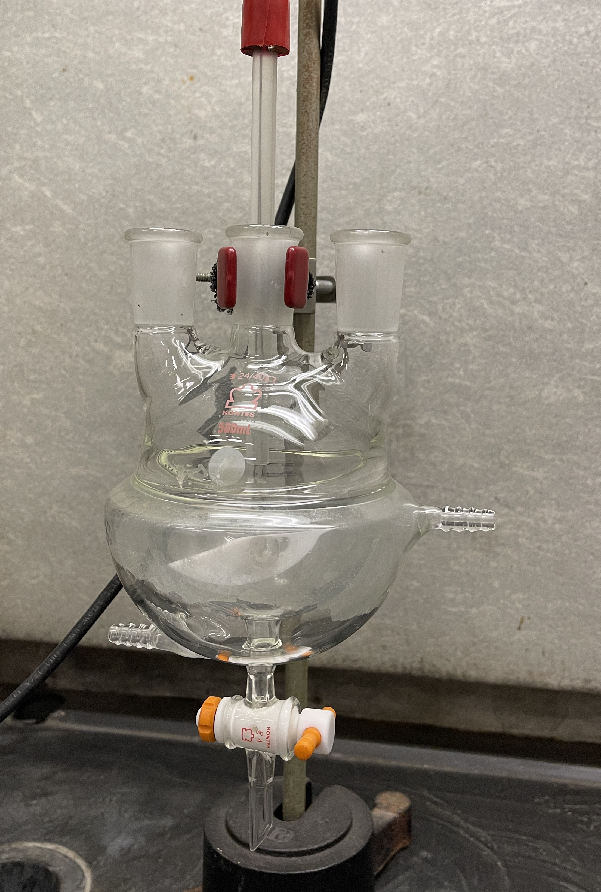{#fig-laboratory_bstr width=50%}

For higher pressure reactions, a metal "autoclave" can be used. The top of the autoclave is a flange with a gasket that can be bolted onto the reactor to seal it for use at higher pressures. Typically autoclaves can be heated or cooled, and they use a shaft and paddle for agitation. Special fittings or magnetic couplings are used so that the rotating shaft can pass into the autoclave without allowing the high pressure contents to leak out.

In fact, devices that do not resemble a stirred beaker can also be used as BSTRs for kinetics data generation. The primary requirement is that the contents of the reactor be perfectly mixed. As an example, @fig-batch_recirc_reactor shows a recirculation loop reactor. Fluid is rapidly recirculated in the reactor by a pump. In-line mixing devices can be placed in the flow path to promote thorough mixing of the fluid. The reactor must be operated at a very high recirculation rate, and for isothermal operation, the pump and other components all must be maintained at the same constant temperature.

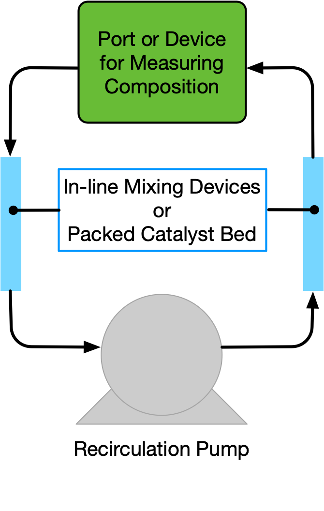{#fig-batch_recirc_reactor width="40%"}

If heterogeneous catalytic reactions are being studied, a packed catalyst bed can be inserted somewhere within the loop. In this case, the amount of reactant converted during a single pass through the bed should be very small so that the compositions at the beginning and at the end of the bed are essentially equal. In this way the composition in the loop will change with time, but within it, the composition will be essentially uniform everywhere, just as the batch reactor model assumes.

An isothermal recirculation reactor such as that shown in @fig-batch_recirc_reactor is particularly useful for the study of a single gas phase reaction that involves a change in the total number of moles. In such a system, if the initial composition, temperature and pressure are known, the composition at any other time can be found from a measurement of the total pressure. Thus kinetics data can be measured simply by recording the total pressure as a function of time.

The stopped flow reactor, shown schematically in @fig-stopped_flow_reactor, is a batch reactor that is especially useful for the study of rapid, liquid-phase, bimolecular reactions. Solutions containing the reactants are fed in separate streams to a small mixing chamber. This chamber is designed so that the fluids enter as high velocity jets. The high velocity of these jets causes instantaneous, perfect mixing as the jets enter the reactor. Downstream from the mixing chamber, but still near to it, a detector is located.

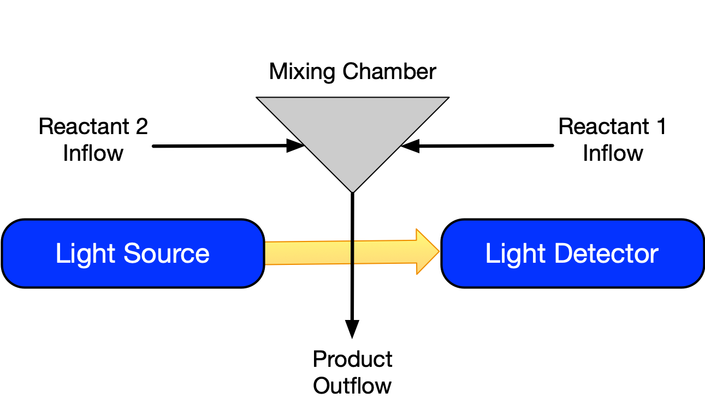{#fig-stopped_flow_reactor width=60%}

Typically the detector is a spectrophotometer. This device shines radiation of a given frequency through the fluid and measures how much of the radiation is absorbed. The frequency of the radiation is chosen so that only one of the reactants or products absorbs the radiation. In this way the response from the spectrophotometer is directly proportional to the amount of that one reactant or product.

In a typical experiment the fluids begin flowing and a steady state is established. The flow is then stopped instantaneously, and the response of the spectrophotometer is recorded as a function of time. The instant the flow stops, the volume through which the radiation passes becomes a very small batch reactor.

#### BSTR Experiments

Before a laboratory BSTR is used to generate kinetics data, it should be tested to ensure that it conforms to the assumptions of an ideal BSTR. The most important assumption is that of perfect mixing. If the reactor walls are transparent or if there is a window in the walls, a "smoke test" is a simple way to check the mixing. To perform this kind of test a small amount of colored fluid is added to the reactor. For a gas phase reactor the added fluid is some form of smoke, for a liquid phase system it is often a colored dye. The contents of the reactor are observed at the instant the smoke or dye is added. The smoke or dye should instantaneously mix and, for gases, fill the entire contents of the reactor. Importantly, there should not be any "corners" or other locations where the color changes slowly. Locations where the color changes slowly are called stagnant zones. They are places where the mixing is not perfect.

A second way of testing the assumption of perfect mixing involves performing the same experiment several times. Each time the experiment is repeated, the only difference from the other experiments is the rate of agitation. That is, a different stirrer speed or recirculation rate is used in each experiment. As the agitation rate is increased in successive experiments, a point should be reached where the experimental results are identical to the previous experiment. At that rate of agitation, the assumption of perfect mixing can be assumed to be satisfied. In subsequent experiments where kinetics data are being generated, an agitation rate somewhat above that critical rate should then be used.

The procedure for a typical BSTR kinetics experiment begins with loading the reactants into the reactor; this is also called charging the reactor. If the charge to the reactor has not been pre-heated, then once the reagents are in the vessel, it may be necessary to heat the contents to the desired temperature. If the reaction being studied involves two or more reactants, they can be pre-heated separately to the desired temperature before adding them to the reactor. If a catalytic or enzymatic reaction is being studied, the catalyst or enzyme can be added to start the reaction once the desired temperature has been reached.

In any of these situations, as soon as the reactor is charged and has stabilized at the desired temperature, the "initial composition" is analyzed. It is important to recognize that for kinetics data analysis purposes, the initial composition is not necessarily the composition that was charged to the reactor, but the composition at the point when the reactor begins to operate isothermally. The kinetics experiment is taken to begin at this instant, and the elapsed time is measured from this instant. Periodically the elapsed time and the response are measured and recorded. Each such measurement represents a single data point. The experimental design dictates how long the reaction is allowed to continue, or equivalently, the number of data points generated before the reaction is terminated. As such, each experiment typically yields multiple data points.

The number of times the response can be measured may be determined by the time it takes to make the measurement. For example changes in the absorbance of monochromatic radiation can be measured almost continuously, but analysis using gas chromatography may require several minutes per measurement. The temperature of the experiment may also affect the possible number of response measurements. Consider an irreversible reaction. The reaction rate will be greater in experiments where the temperature is higher. As a consequence, the reaction will go to completion in a shorter period of time in higher temperature experiments than in low temperature experiments. That may mean that fewer responses can be measured in a high temperature experiment than in a low temperature experiment.

#### BSTR Response Model

For BSTR kinetics experiments, the general BSTR mole balance, @eq-bstr_mole_balance, simplifies to @eq-bstr_mole_bal_one_reaction. After substitution of the proposed rate expression this equation must be solved for each experiment being analyzed. This will either be done numerically within a predicted responses function, or it will be solved analytically.

$$
\frac{dn_i}{dt} = \nu_i r V
$$ {#eq-bstr_mole_bal_one_reaction}

The predicted responses function will have been provided with the rate expression parameters and the full set of experimentally adjusted inputs. It will loop through the experiments one-by-one, solving the mole balances numerically and calculating a predicted value of the response. If a separate function is written to solve the design equations, it will need to be provided with the rate expression parameters and the experimental inputs for the current experiment. The rate expression parameters will also need to be made available to the deriviatives function used by the IVODE solver (see [Appendix -@sec-apxd_ivodes]).

If the linearized model approach is being used to estimate the parameters, @eq-bstr_mole_bal_one_reaction is written for [one]{.underline} reactant or product. If the proposed rate expression contains concentrations or partial pressures of other reagents, they must be expressed in terms of the reactant or product for which the mole balance was written. This can be done using the stoichiometry and the extent of reaction as described in @sec-ch2. After doing that, the only variables in the design equation will be the time and the molar amount of the reagent for which the mole balance was written. Then it may be possible to solve the design equation analytically, for example by separation of variables. If it isn't possible to solve it analytically, the linearized model approach cannot be used to estimate the parameters.

Typically, each BSTR experiment generates several data points, and several experiments are performed. If an approximate reactor model is being used, the derivative must be approximated using one of the finite difference equations, [-@eq-backward_differences], [-@eq-forward_differences], or [-@eq-central_differences]. If backward differences are used, the derivative cannot be estimated at time zero. If forward differences are used, the derivative cannot be estimated at the final time, and if central differences are used, the derivative cannot be estimated at time zero and at the final time.

### Generating Kinetics Data Using a CSTR {#sec-ch11_cstr_data_analysis}

The features and modeling of CSTRs are presented in Chapters [-@sec-ch5] and [-@sec-ch6] and [Appendix -@sec-apxc_CSTR_balances]. There are many similarities between BSTRs and CSTRs. The primary difference is that fluid continually flows in and out of a CSTR. Basically CSTRs are BSTRs with inlet and outlet flow streams. Other than the stopped flow reactor, the laboratory BSTRs described above can be converted to CSTRs simply by adding a flow in and a flow out. In the case of the recirculation loop reactor, @fig-batch_recirc_reactor, the flow in and out should be small compared to the recirculation flow within the loop.

#### CSTR Experiments

Before kinetics data generation begins, the CSTR should be tested for complete mixing. Smoke tests and the measurement of the reactor response as the agitation rate is increased again can be used to test for perfect mixing. In addition, a property known as the age function can be used to assess how well a reactor conforms to the assumptions of an ideal CSTR. The measurement and use of the age function is described in @sec-ch13. Comparing the measured age function to the known age function for an ideal CSTR then shows how well a reactor conforms to the assumptions of an ideal CSTR. This test provides a necessary, but not sufficient, criterion that the laboratory reactor must satisfy if it is to be modeled as a CSTR.

The procedure for a typical CSTR kinetics experiment begins by setting each of the adjusted inputs to one of their levels. The flow rate, temperature, and composition of the fluid leaving the reactor are then monitored until they become constant, indicating that the CSTR has reached steady state. The response is then measured to end that experiment. This procedure is repeated for each experiment in the experimental design. Thus, in contrast to BSTR experiments, each CSTR experiment yields a single data point.

#### CSTR Response Model

For an isothermal, steady-state CSTR with one reaction taking place, the general CSTR mole balance simplifies to @eq-cstr_mole_bal_one_reaction, where it is written in the form of a residual expression. After substitution of the proposed rate expression this equation will either be solved numerically for each experiment being analyzed or it will be linearized.

$$
0 = \dot{n}_{i,0} - \dot{n}_{i,1} + \nu_i r V = \epsilon
$${#eq-cstr_mole_bal_one_reaction}

If a numerical fitting function is being used to estimate the parameters, the mole balances will be solved numerically within a predicted responses function. The predicted responses function will have been provided with the rate expression parameters and the full set of experimentally adjusted inputs. It will loop through the experiments one-by-one, solving the mole balances numerically and calculating a predicted value of the response. If a separate function is written to solve the design equations, it will need to be provided with the rate expression parameters and the experimental inputs for the current experiment. The rate expression parameters will also need to be made available to the residuals function used by the ATE solver (see [Appendix -@sec-apxd_ates]).

### Generating Kinetics Data Using a PFR {#sec-ch11_pfr_data_analysis}

The features and modeling of PFRs are presented in Chapters [-@sec-ch5] and [-@sec-ch9] and [Appendix -@sec-apxc_PFR_balances]. In its most basic form, a PFR is simply a length of rigid tubing or pipe. For catalytic reactions a packed-bed PFR can be used.

#### PFR Experiments

Before a PFR is used to generate kinetics data, it should be tested to ensure it conforms to the asumptions of an ideal PFR. Importantly, it should be tested for plug flow, and if it is a packed bed, it should be tested for negligible concentration and temperature gradients.

Testing for plug flow is not easy. In laminar flow the radial velocity profile is parabolic, and it flattens as the flow becomes turbulent. The Reynolds number, $N_{Re}$, offers a measure of how turbulent the flow is. It can be computed using @eq-Reynolds_number. In cylindrical pipes, a Reynolds number greater than ca. 3500 indicates turbulent flow; a much greater Reynolds number is needed in order to approach plug flow.

$$
N_{Re} = \frac{\rho vD}{\mu}
$${#eq-Reynolds_number}

Smoke- or dye-based flow visualizations are useful for gauging the mixing in an agitated vessel, but they are difficult to apply for gauging plug flow. Alternatively, a small amount of a dye or otherwise detectable species can be injected at the reactor inlet. If the injection is effectively instantaneous, the dye should emerge from the reactor all at once. The greater the time span over which the dye emerges, the greater the deviation from plug flow.  Essentially this involves measuring the age function for the reactor. Doing so is described in @sec-ch13. The measured age distribution function can then be compared to that expected for plug flow to determine whether plug flow prevails in the reactor.

In packed-bed PFRs, gradients in concentration and temperature can exist within the fluid that is close to the surface of the solid particles. When present, these are referred to as external gradients because they are external to the solid material. A common experimental test for external mass transfer limitations (i. e. for non-negligible external concentration gradients) in a packed bed reactor relies on the fact that for an ideal PFR, the conversion depends only upon the residence time within the reactor and not the linear velocity of the flowing fluid. The external mass transfer coefficient, in contrast, *does* depend upon the linear velocity of the flowing fluid. Thus, if the conversion changes when the linear velocity is changed while holding the residence time constant, this indicates that the apparent rate is being affected by the rate of external mass transfer.

One approach to this test is to measure the conversion at varying fluid velocities with a fixed amount of catalyst and plot the conversion versus the residence time. The experiment is then repeated using a different amount of catalyst. In the absence of mass transfer limitations, the plots should superimpose. An alternative approach is to measure the conversion with a given amount of catalyst and at a given fluid flow rate. The conversion is then measured again using a different amount of catalyst, but with a flow rate that gives the same residence time as in the first experiment. In the absence of external mass transfer limitations, the conversions should be equal. Care should be taken in applying this test, however, because at the very low Reynolds numbers that are often used in laboratory reactors, the mass transfer coefficient depends very weakly upon the fluid velocity [@chambers_lack_1966].

When external mass transfer limitations are very severe, a first-order rate expression, @eq-apparent_first_order, will be found to fit the experimental data very well. In this case it is more appropriate to refer to @eq-apparent_first_order as the *apparent* rate expression because the rate it refers to is the rate of external mass transfer and not the rate of reaction. The true rate expression can be first-order, but when external mass transfer limitations are severe, the apparent activation energy, $E$, will be very low (≲ 10 to 15 kJ mol^-1^). True reaction rates typically have activation energies that are significantly greater than this. This can serve as a warning indicator when kinetics data are being analyzed. If the reaction kinetics are observed to change to first order and the activation energy is simultaneously observed to become small, the kinetics data may contain experiments where external transport limitations existed. There are also computational tests for external transport limitations that can be applied to test for external gradients [@mears_tests_1971; @satterfield_heterogeneous_1980; @wheeler_reaction_1951].

$$
r=k_0\exp{\left( \frac{-E}{RT} \right)}C_i
$${#eq-apparent_first_order}

If the catalyst is a porous solid, internal concentration gradients may also exist. When generating kinetics data, the goal is to use experimental conditions where these gradients are insignificantly small. As a general rule of thumb, internal concentration gradients are more likely than external concentration gradients.

One experimental test for the presence of internal heat or mass transfer limitations is to repeatedly measure the conversion using finer and finer catalyst particle sizes. In the absence of internal gradients, the conversion should not depend upon the particle size, but if gradients are present, their effects should diminish as the particle size is decreased. This happens because the diffusional path length becomes smaller as the particle size is decreased.

Koros and Nowak [-@koros_diagnostic_1967] suggest a test where the catalyst is prepared from two powders that are mixed and formed into catalyst pellets. One powder is inert while the other is catalytic. Two or more sets of pellets are prepared using different ratios of the powders. In the absence of internal gradients, the ratio of the observed rates should equal the ratio of amounts of the active powders used to prepare the catalysts. Madon and Boudart [-@madon_experimental_1982] describe a similar test where the catalyst comprises very small active catalyst nanoparticles supported on a porous oxide carrier.

There are also a few computational tests for the presence of intraparticle temperature or concentration gradients. For an isothermal reaction, @eq-internal_conc_gradients can be used to calculate $\phi_s$. For a zero-order reaction, the effects of concentration gradients in the pores will be negligible if $\phi_s$ is less than 6. For first order reactions it should be less than 1, and for second order reactions it should be less than 0.3.

$$
\phi_s = \frac{r_p^2\left( -r \right)}{D_{\text{eff}}C_i}
$${#eq-internal_conc_gradients}

From an operational viewpoint, the procedure for performing kinetics experiments using a PFR is exactly the same as the procedure used with a CSTR. Each experiment will yield a single data point. However, if one wishes to use an approximate reactor model as described in @sec-use_approx_model, the reactor must operate differentially. The molar flow rate of every reagent present in the feed should not change by more than ca. 5% between the inlet and the outlet of the reactor.

#### PFR Response Model

The reactor used in PFR kinetics experiments is a steady-state, isothermal PFR with negligible pressure drop. As with CSTRs and BSTRs, the only design equations that are needed are mole balances. The general steady-state PFR mole balance reduces to @eq-pfr_mole_bal_one_reaction since only one reaction is taking place.

$$
\frac{d \dot{n}_i}{dz}  = \frac{\pi D^2}{4}\nu_{i}r
$${#eq-pfr_mole_bal_one_reaction}

The PFR design equations are IVODEs, and solving them numerically is analogous to solving the BSTR design equations. The initial values are the molar flow rates of the reagents at the reactor inlet and the stopping criterion is that $z$ equals the length of the reactor. The rate expression parameters are needed by the derivatives function, so they must be made available to it by some means other than as an argument.

## Learning Objectives and Examples {#sec-ch11_learning_objectives}

Upon completion of this chapter, readers should

* know the definition and/or defining equation for rate-expression parameters, adjusted inputs, measured and predicted responses, factors, levels, experiment residuals, coefficient of determination, parity plot, residuals plot, fitting and fitting functions, predicted responses function, linearized models, approximate models, half-life
* understand that
	* in *Reaction Engineering Basics* kinetics experiments
        * are isothermal
        * have only one reaction taking place
        * are at steady-state if a flow reactor is used
        * have negligible pressure drop if a PFR is used
        * have one quantity that is measured in every experiment as the response
    * indicators of an accurate model include
        * a coefficient of determination close to 1.0
        * uncertainties in estimated parameters that are small relative to their values
        * parity plots where all points are close to the parity line
        * residuals plots where scatter is random with no apparent trends
* be able to
	* design kinetics experiments that accuratey resolve the effects of temperature, pressure, and composition on reaction rate
    * describe tests that can be used to ensure experimental reactors conform to ideal reactor model assumptions
    * estimate kinetics parameters using a numerical fitting function and single response data from an ideal BSTR, CSTR, or PFR
    * estimate kinetics parameters using a linearized model, when possible
    * approximate derivatives using forward, backward, or central differences
    * assess the accuracy of a fitted rate expression

::: {.callout-important collapse="true"}
## Computer Code for Performing Calculations

Computer code to perform the calculations can be written using a variety of programming languages and environments, and the actual code can be structured in a variety of ways. The examples presented in *REB, The Book* assume a consistent code structure that is described in @sec-ch5_workflow, but other code structures are possible. 

Here, the examples describe one way to structure code and perform the necessary calculations numerically, but they do not provide computer code for doing so. This is intentional so that readers can use whatever programming language and development environment they choose.

For readers who are interested, Python and Matlab codes for the examples that follow are available from [*REB, The Course*](link to page).

:::

```{r}
#| echo: false
#| output: false
library(tidyverse)
library(knitr)
library(kableExtra)
source('code/fmt_tibble_col.R')
```

### Design of Kinetics Experiments {#sec-ch11_ex1}

A rate expression for liquid-phase reaction (1) is needed for the design of a new batch reactor process. Preliminary studies suggest that a temperature in the range of 65 to 90 °C will be needed. At lower temperatures the reaction proceeds too slowly, and at higher temperatures undesired side reactions begin to occur. At a temperature of ca. 80 °C, it takes approximately 30 minutes for the reaction to go to completion. The preliminary experiments suggest that the reaction is irreversible and that the rate is not affected by the concentration of the product, Z. It is expected that the reactant, A, will be available at concentrations between 0.8 and 1.2 M. A perfectly mixed, 1 L BSTR is available for kinetics experiments. The reactor has a sampling port that allows the concentration of A to be measured while the reaction is taking place. Design a set of experiments to generate kinetics data that can be used to develop a rate expression.

$$
A \rightarrow Z \tag{1}
$$

---

:::{.callout-tip collapse="true"}
## Click Here to See What an Expert Might be Thinking at this Point

I am asked to design kinetics experiments, so I need to decide which variables will be adjusted in the experiments. I further need to decide how many levels to use for each adjusted variable and what those levels should be. The problem states that the rate expression developed using these data will be used to design a new process, so I want to be sure to generate a sizeable data set that spans the expected ranges of the adjusted variables and also captures the effects of each of them upon the response. Based upon the information presented in the problem statement, the experimental response here will be the concentration of A.

Reaction rates can be affected by the temperature and the concentration of each reagent present. Here the problem states that the rate is not affected by the concentration of Z, so the temperature and the concentration of A should vary from one experiment to the next. The reactor is isothermal, so the temperature can be adjusted directly in the experiments. The concentration of A will change as the reaction proceeds. This suggests two ways to vary the concentration of A from experiment to experiment. The first is to adjust the initial concentration of A and the second is to adjust the time at which the response is measured. Longer times will lead to smaller concentrations of A because at longer times more of the A will have reacted. I will use both the initial concentration of A and the reaction time as adjusted variables.

Next I need to decide how many levels to use for each adjusted variable and what those levels should be. Normally I would use levels that span a slightly wider range than the range where the rate expression will be used. Here, however, I'm told that the rate is too low below 65 °C and undesirable reactions occur above 90 °C, so I will choose levels that just span that range. The range only spans 25 °C, so four temperature levels seem reasonable, as does spacing them equally across the range.

I want to span a range of concentrations that is slightly wider than the expected range where the rate expression will be used. Three initial concentration levels of 0.5, 1.0, and 1.5 M will do so. Then, in order to ensure that the data are sensitive to the effect of the concentration of A, I will use six levels of reaction time. Noting that at 80 °C it takes 30 min for the reaction to go to completion, spacing the reaction times 5 minutes apart will lead to samples that span a wide range of conversions, and hence a wide range of concentrations of reagent A.

:::

<center>**Discussion**</center>

The range of temperatures where the rate expression may be used only spans 25 °C, so four evenly spaced levels were deemed sufficient. The assignment narrative notes that at 80°C the reaction goes to completion in 30 min, so six reaction time levels, spaced at 5 min intervals were selected. At the highest temperature, 90 °C, the reaction will likely go to completion in less than 30 minutes, so the last few data points may not yield useful data points. Noting that during the course of the experiments the concentration of A will decrease with reaction time, only three initial concentration levels were chosen. The full range of measured responses should span the range of interest from 1.2 M to 0 M. The narrative notes that Z does not affect the rate, so the initial concentration of Z is zero in all experiments. Similarly, it was assumed that because the reaction is liquid-phase, pressure would not affect the rate significantly, so all experiments are to be performed at the same pressure of 1 atm. A full factorial design was specified noting that it would only require 12 experiments that each yield 6 data points. 

<center>**Deliverables**</center>

Three reactor inputs will be adjusted in the experiments: the temperature, $T$, the initial concentration of A, $C_{A,0}$, and the reaction time, $t$. The temperature levels will be 65, 73, 82, and 90 °C; the initial concentration levels will be 0.5, 1.0, and 1.5 M; the reaction time levels will be 5, 10, 15, 20, 25, and 30 min. All possible combinations of these levels will be studied giving a total of 72 experimental data points.

It will not be necessary to perform 72 experiments, however. Using a reactor at 65 °C with an initial concentration of A equal to 0.5 M, six responses can be recorded in the experiment (at reaction times of 5, 10, 15, 20, 25, and 30 min). The number of experiments needed to record all 72 responses is 12. The initial conditions for those 12 experiments are shown in @tbl-example_18_6_1. Each experiment in the table will yield responses at all six reaction time levels.

| Experiment | T (°C) | C~A,0~ (M) |
|:------:|:-------:|:----------:|
| 1 | 65 | 0.5 |
| 2 | 65 | 1.0 |
| 3 | 65 | 1.5 |
| 4 | 73 | 0.5 |
| 5 | 73 | 1.0 |
| 6 | 73 | 1.5 |
| 7 | 82 | 0.5 |
| 8 | 82 | 1.0 |
| 9 | 82 | 1.5 |
| 10 | 90 | 0.5 |
| 11 | 90 | 1.0 |
| 12 | 90 | 1.5 |

: Initial conditions for kinetics experiments. {#tbl-example_18_6_1 tbl-colwidths="[30,35,35]"}

### Analysis of CSTR Kinetics Data for a Liquid-Phase Reaction {#sec-ch11_ex2}

The liquid-phase reaction between reactants A and B, reaction (1), was studied in a 100 cm^3^ laboratory CSTR. The reactor operated at steady state, the volumetric flow rate and the inlet concentrations of each of the reagents were adjusted from one experiment to the next, and the steady-state outlet concentration of reagent Y was measured. Use the experimental data to assess the accuracy with which the rate expression shown in equation (2) describes the rate of reaction (1). The rate coefficient in equation (2) can be assumed to exhibit Arrhenius temperature dependence.

$$
A + B \rightarrow Y + Z \tag{1}
$$

$$
r = kC_AC_B \tag{2}
$$


```{r}
#| echo: false
#| output: false
d <- read.csv("solutions/ch11_ex2/example_11_5_2_data.csv")
 # T, VFR, CAin, CBin, CYin, CZin, CYout
```

The first few data points are shown in @tbl-ch11_ex2_data. The full data set is available in the file [example_11_5_2_data.csv](solutions/ch11_ex2/example_11_5_2_data.csv).

```{r}
#| echo: false
#| warning: false
#| label: tbl-ch11_ex2_data
#| tbl-cap: First 6 of the 2048 experiments.
kbl(d[1:6,], format = "markdown", align = "ccccccc", 
  col.names = c('T (K)', '$\\dot{V}$ (cm^3^ min^-1^)', 'C~A,0~ (M)', 'C~B,0~ (M)',
  'C~Y,0~ (M)', 'C~Z,0~ (M)', 'C~Y,1~ (M)'))
```

---

:::{.callout-tip collapse="true"}
## Click Here to See What an Expert Might be Thinking at this Point

I see that this assignment describes reactor experiments, presents the data from the experiments and asks me to use the data to assess the accuracy of a proposed rate expressions. So this is a kinetics data analysis assignment for a liquid-phase reaction taking place in a steady-state CSTR. In the experiments the temperature, the volumetric feed rate, and the feed concentrations of the four reagents were adjusted and the outlet concentration of reagent Y was measured as the response.

I'll begin by summarizing the assignment using appropriate variable symbols for each quantity. I'll use a subscripted "in" to denote values associated with the reactor feed and a subscripted "out" to denote values associated with the reactor outlet. An underline will be used to indicate sets of values and "CI" will be used to indicate the 95% confidence interval. Finally, since this is a liquid-phase system, the feed and volumetric flow rates will be equal, so I won't use a feed or outlet subscript on the volumetric flow rate.

In order to assess the accuracy of the rate expression I will need to fit the data to a model that predicts the outlet concentration of Y given the experimentally adjusted inputs. Assuming Arrhenius temperature dependence, that will yield estimates for the pre-exponential factor and activation energy, estimates for their 95% confidence intervals, and the coefficient of determination. To help assess the accuracy, I will calculate the model-predicted responses and experiment residuals and use them to generate a parity plot and residuals plots because they will be useful for assessing the accuracy of the rate expression.

:::

<center>**Assignment Summary**</center>

[Reaction]{.underline}

$$
A + B \rightarrow Y + Z \tag{1}
$$

[Rate Expression]{.underline}

$$
r = kC_AC_B \tag{2}
$$

[Reactor]{.underline}: Isothermal, steady-state, liquid-phase CSTR

[Adjusted Experimental Inputs]{.underline}: $T$, $\dot{V}$, $C_{A,in}$, $C_{B,in}$, $C_{Y,in}$, and $C_{Z,in}$

[Experimental Response]{.underline}: $C_{Y,out}$

[Given Constant]{.underline}: $V=100 \text{ cm}^3$

[Given Experimental Data]{.underline}: $\underline{T}$, $\underline{\dot{V}}$, $\underline{C}_{A,0}$, $\underline{C}_{B,0}$, $\underline{C}_{Y,0}$, $\underline{C}_{Z,0}$, and $\underline{C}_{Y,1}$

[Parameters to Estimate]{.underline}: $k_0$ and $E$

[Deliverable]{.underline}: Assessment of the accuracy of the rate expression, equation (2).

<center>**Formulation of the Equations**</center>

:::{.callout-tip collapse="true"}
## Click Here to See What an Expert Might be Thinking at this Point

I know that I'll need an isothermal, steady-state CSTR model to analyze the data, so I'll develop that first. Because the temperature in each experiment is constant and known, I can solve the CSTR mole balances independently of any energy balances. Furthermore, I can calculate everything I need using only the mole balances, so for this analysis the reactor design equations will consist of a mole balance on each reagent present in the system. 

The general form of the steady-state CSTR mole balance is given in @eq-ss_cstr_mole_bal, but here there is only one reaction occurring, so the summation over the reactions reduces to a single term and there isn't a need to index the reactions. I'll be solving the design equations numerically, so I'll write them as residuals expressions.

$$
0 = \dot{n}_{i,0} - \dot{n}_{i,1} + \nu_i r V = \epsilon
$$

I'll be solving the design equations to find the outlet molar flow rates of the reagents. To do so numerically I'll need to provide guesses for those unknowns and a residuals function to an ATE solver.

The residuals function will be provided with a guess for the outlet molar flow rates. In order to evaluate the residuals, it will need to calculate any additional unknowns that are computable. Going through the mole balances quantity-by-quantity I see that the additional unknowns are the inlet molar flow rates of A, B, Y, and Z and the rate. 

The inlet molar flow rates can be calculated from the given inlet volumetric flow rate and concentrations. The rate can be calculated using the proposed rate expression, but that introduces the rate coefficient and concentrations of A and B as additional unknowns. The rate coefficient can be calculated using the Arrhenius expression, and the concentrations, using their defining equation.

The Arrhenius expression introduces the pre-exponential factor and activation energy as additional unknowns. These are not computable, so I'll need to make them available to the residuals function by some means other than as an argument.

I'll just use the inlet molar flow rates as guesses for the outlet molar flow rates. If the ATE solver doesn't converge, I'll need to come back and improve them.

:::

[CSTR Model Equations]{.underline}:

$$
0 = \dot{n}_{A,in} - \dot{n}_{A,out} - rV  = \epsilon_1 \tag{3}
$$

$$
0 = \dot{n}_{B,in} - \dot{n}_{B,out} - rV  = \epsilon_2 \tag{4}
$$

$$
0 = \dot{n}_{Y,in} - \dot{n}_{Y,out} + rV  = \epsilon_3 \tag{5}
$$

$$
0 = \dot{n}_{Z,in} - \dot{n}_{Z,out} + rV  = \epsilon_4 \tag{6}
$$

[CSTR Model Variables]{.underline}: $\dot{n}_{A,out}$, $\dot{n}_{B,out}$, $\dot{n}_{Y,out}$, and $\dot{n}_{Z,out}$

[Additional Computable Unknowns]{.underline}: $\dot{n}_{A,in}$, $\dot{n}_{B,in}$, $\dot{n}_{Y,in}$, $\dot{n}_{Z,in}$, $r$, $k$, $C_A$, and $C_B$

$$
\dot{n}_{i,in} = C_{i,in} \dot{V} \qquad i = A, B, Y, \text{ and } Z\tag{7}
$$

$$
k = k_0 \exp{ \left( \frac{-E}{RT}\right)}\tag{8}
$$

$$
C_i = \frac{\dot{n}_{i,out}}{\dot{V}} \qquad i = A \text{ and } B\tag{9}
$$

[Additional Uncomputable Unknowns]{.underline}: $k_0$ and $E$

[ATE Solver Inputs]{.underline}:

1. Initial guesses for the CSTR model variables
$$
\dot{n}_{i,out,guess} = \dot{n}_{i,in} = C_{i,in}\dot{V} \qquad i = A, B, Y, \text{ and } Z \tag{10}
$$
2. Residuals function that
    a. receives a guess for the CSTR model variables
    b. has access to $k_0$ and $E$
    c. calculates the additional unknowns using equations (2), (7) - (9)
    d. evaluates and returns the CSTR model residuals using equations (3) - (6)

:::{.callout-tip collapse="true"}
## Click Here to See What an Expert Might be Thinking at this Point

I'll use a numerical fitting function to fit the CSTR model to the experimental data. I will need to provide the experimentally adjusted inputs, the experimentally measured responses, a guess for the rate expression parameters being estimated, and a predicted responses function to the fitting function.

I have no idea of the magnitude of the pre-exponential factor or the activation energy. So instead of guessing a value for $k_0$, I'm going to guess a value for its base-10 logarithm, which I'll represent as $\beta$. I'll guess it is equal to zero (or $k_0$ is equal to 1), and I'll guess a small activation energy of 10 kcal mol^-1^. As discussed in this chapter, these guesses may improve the chances of the fitting function converging.

I'll need to write the predicted responses function, but it will be called by the fitting function. It will receive the experimentally adjusted inputs and a guess for the parameters being estimated as arguments. It must go through the experiments one by one. For each one it solve the CSTR model equations and use the results to calculate the model-predicted response. Solving the CSTR model equations will yield the outlet molar flow rates of the reagents. From those and the volumetric flow rate, the outlet concentration of Y, the response, can be calculated. After the predicted responses function goes through all of the experiments it must return the full set of model-predicted responses.

:::

[Fitting Function Inputs]{.underline}:

1. Experimental data: $\underline{T}$, $\underline{\dot{V}}$, $\underline{C}_{A,0}$, $\underline{C}_{B,0}$, $\underline{C}_{Y,0}$, $\underline{C}_{Z,0}$, and $\underline{C}_{Y,1}$
2. Initial guesses for the parameters being estimated
$$
\beta_{guess} = 0\tag{11}
$$
$$
E_{guess} = 10 \text{ kcal mol}^{-1}\tag{12}
$$
3. Predicted Responses Function that
    a. receives the adjusted experimental inputs and guesses for the parameters
    b. calculates the pre-exponential factor and makes it and the activation energy available to the residuals function
$$
k_0 = 10^{\beta} \tag{13}
$$
    c. loops through all of the experiments
        i. defines an initial guess for the CSTR model variables, equation (10)
        ii. solves the CSTR design equations
        iii. calculates the model-predicted response
$$
C_{Y,out,pred} = \frac{\dot{n}_{A,out}}{\dot{V}} \tag{14}
$$
    d. returns the predicted responses for all of the experiments

:::{.callout-tip collapse="true"}
## Click Here to See What an Expert Might be Thinking at this Point

Assuming it is successful, the fitting function will return estimates for $\beta$ and $E$, their 95% confidence intervals, the coefficient of determination, and the model-predicted responses for each of the experiments. (If the fitting function I use doesn't return the model-predicted responses, I can calculate them by simply calling the predicted responses function with the final parameter estimates as arguments.)

Having defined $\beta$ as the base-10 logarithm of $k_0$, it is straightforward to calculate the estimated value of $k_0$ and its 95% confidence interval.

I'll also want to generate parity and residuals plots to help me assess the accuracy of the final model. I can plot the measured *versus* the predicted responses to generate the parity plot. In the residuals plots the experiment residuals are plotted against each adjusted input. Thus, I'll need to calculate the experiment residuals for making the residuals plots.

:::

[Assessment Equations]{.underline}:

$$
k_{0,CI} = 10^{\beta_{CI}}\tag{15}
$$

$$
\underline{\epsilon}_{expt} = \underline{C}_{Y,out} - \underline{C}_{Y,out,pred} \tag{16}
$$

<center>**Implementation of the Calculations**</center>

Computer code to perform the calculations can be written using a variety of programming languages and environments, and the actual code can be structured in a variety of ways. Referring to the preceding assignment summary and formulation of the equations, here are the essential things it must do.

1. Read the adjusted experimental inputs and the experimental responses from the file, [example_11_5_2_data.csv](solutions/ch11_ex2/example_11_5_2_data.csv).
2. Make the given and known constants available wherever they are needed.
3. Declare global variables (or use some other means) for making the rate expression parameters available to the CSTR residuals function.
4. Define the CSTR residuals and predicted responses functions as described above.
5. Define initial guesses for the parameters, $\beta$ and $E$
6. Call a numerical fitting function to get the parameter estimates, 95% confidence intervals, coefficient of determination, and model-predicted responses.
7. Calculate the experiment residuals and generate a parity plot and residuals plots.
8. Tabulate, graph, and save the results, as appropriate.

<center>**Results and Discussion**</center>

```{r}
#| echo: false
#| output: false
df <- read.csv("solutions/ch11_ex2/example_11_5_2_results.csv") 
df <- fmt_tibble_col(df, 2, 3, 3, 1)
```

The calculations were performed as described, and the results are shown in @tbl-ch11_ex_2_results. The 95% confidence interval for $k_0$, `r df$value[2]` to `r df$value[3]` `r df$units[2]`, is roughly half to double its estimated value, `r df$value[1]`  `r df$units[1]`. The 95% confidence interval for $E$ is much narrower. There is some scatter apparent in the parity plot, and the coefficient of determination is  `r df$value[7]`. These factors suggest that the rate expression is reasonably accurate.

```{r}
#| echo: false
#| warning: false
#| label: tbl-ch11_ex_2_results
#| tbl-cap: Parameter Estimation Results.
kbl(df, format = "markdown",  align = "ccc", col.names = c("Quantity","Value", "Units"))
```

A parity plot is presented in @fig-ch11_ex2_parity_plot, and residuals plots in @fig-ch11_ex2_residuals_plots. The residuals plots for $T$, $\dot{V}$ and $C_Y$ show random deviations of the residuals about zero. However, in the residuals plots for $C_A$ and $C_B$, the residuals at low concentration do not scatter equally about zero. The residuals for $C_Z$ show a definite trend, decreasing steadily as $C_Z$ increases. This suggests that the reaction rate may have some functional dependence on the concentration of Z that is not captured in the rate expression.

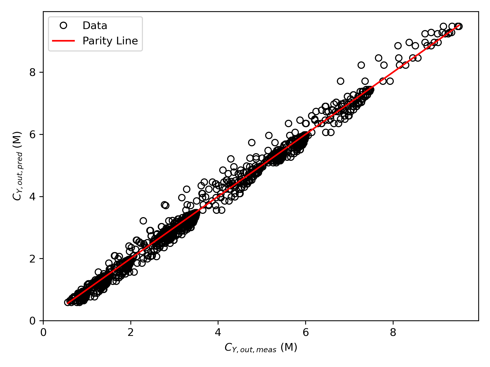{#fig-ch11_ex2_parity_plot width="80%"}

::: {#fig-ch11_ex2_residuals_plots layout-ncol=2}

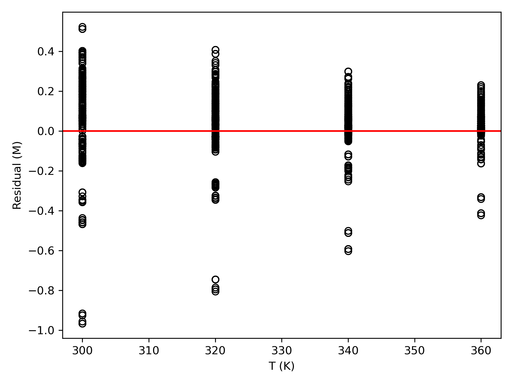

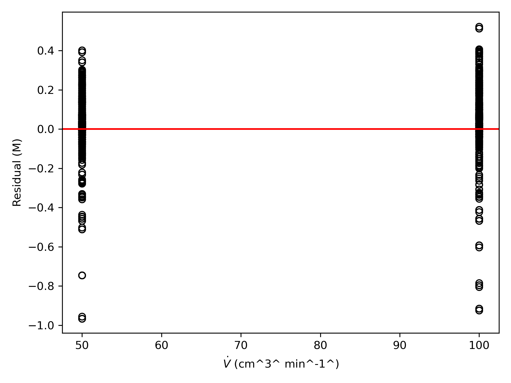

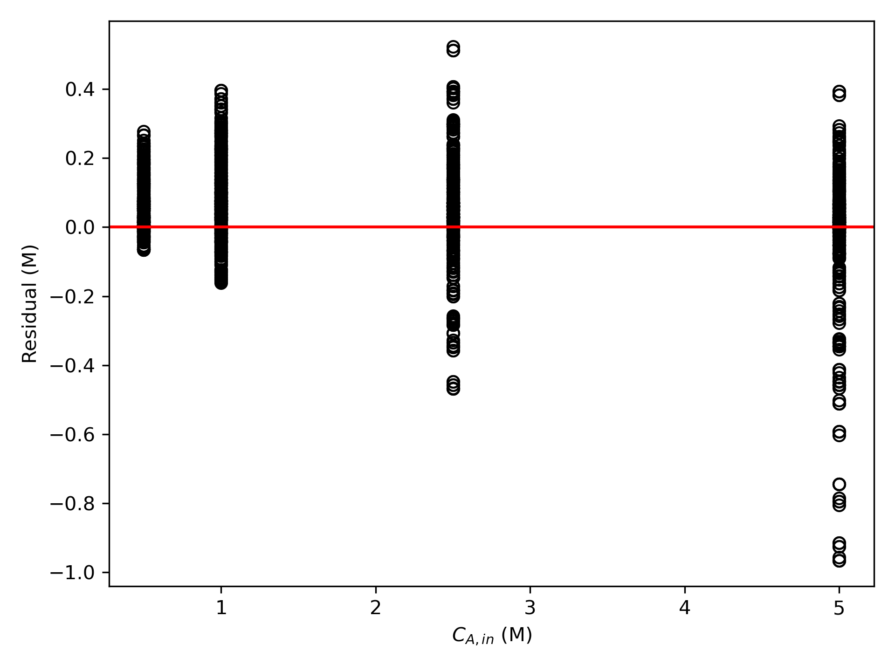


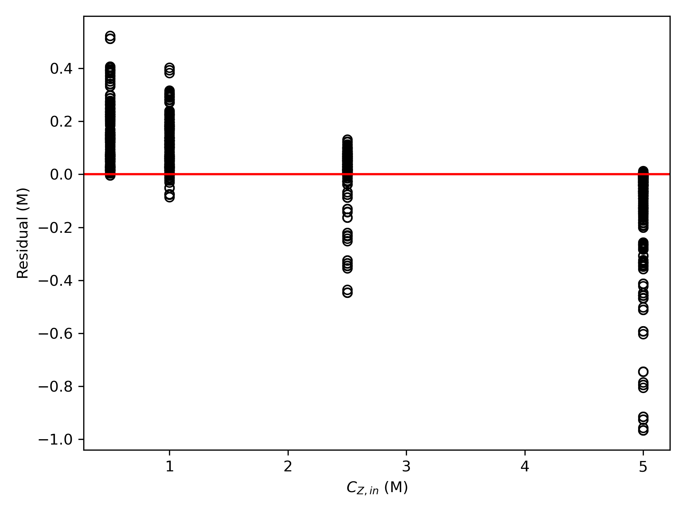

Residuals Plots.
:::

<center>**Assessment**</center>

With the estimated pre-exponential factor of  `r df$value[1]`  `r df$units[1]` and the estimated activation energy, `r df$value[4]`  `r df$units[4]`, the rate expression is reasonably accurate, but there are indications that the it may not fully capture the dependence of the rate on the concentration of reagent Z. Rate expressions that include a functional dependence on the concentration of Z should be postulated and assessed to determine whether they can represent the experimental results more accurately.

---

### Analysis of CSTR Data Using a Fitting Function and Using a Linear Model {#sec-ch11_ex3}

The liquid-phase disproportionation of reagent A, reaction (1), is reversible. Kinetics data were generated in a 3 gal CSTR by varying the temperature, volumetric flow rate and feed concentrations of reagents A, Y, and Z from experiment to experiment. In each experiment the outlet concentration of reagent A was measured. Use the resulting data to assess the accuracy of the rate expression shown in equation (2) using a fitting function and using a linearized response model.

Note that thermodynamic data to calculate the equilibrium constant for reaction (1) are not available, so both the forward and reverse rate coefficients in the rate expression must be estimated from the experimental data.


$$
A \leftrightarrows Y + Z \tag{1}
$$

$$
r = k_fC_A^2 - k_rC_YC_Z \tag{2}
$$

```{r}
#| echo: false
#| output: false
df <- read.csv("solutions/ch11_ex3/example_11_5_3_data.csv") 
df <- fmt_tibble_col(df, 2, 3, 3, 1)
```

The first few data points are shown in @tbl-ch11_ex3_data. The full data set is available in the file [example_11_5_3_data.csv](solutions/ch11_ex3/example_11_5_3_data.csv).

```{r}
#| echo: false
#| warning: false
#| label: tbl-ch11_ex3_data
#| tbl-cap: First 6 of the 720 experimental data points.
kbl(df[1:6,], format = "markdown", align = "cccccc", 
  col.names = c('T (°F)', '$\\dot{V}$ (gal min^-1^)', 'C~A,in~ (lbmol gal^-1^)',
  'C~Y,in~ (lbmol gal^-1^)', 'C~Z,in~ (lbmol gal^-1^)', 'C~A,out~ (lbmol gal^-1^)'))
```

---

:::{.callout-tip collapse="true"}
## Click Here to See What an Expert Might be Thinking at this Point

The assignment narrative describes reactor experiments, provides the data generated in those experiments, and asks me to use them to assess the accuracy of a proposed rate expression. In the experiments for this assignment, an isothermal CSTR that operated at steady-state was used. The adjusted experimental inputs were the temperature, volumetric flow rate, and feed concentrations of reagents A, Y, and Z, and the measured response was the outlet concentration of A.

I'll begin by summarizing the assignment. I'll use a subscripted "in" to denote a quantity at the inlet to the reactor, a subscripted "out" to denote the outlet, "CI" for 95% confidence interval, and I'll underline a variable symbol if it represents a set of values (i. e. a vector). The reacting fluid is a liquid, and I'll assume it to be an ideal, incompressible mixture in which case the inlet and outlet volumetric flow rates will be equal. Therefore I will not use a subscript on the volumetric flow rate.

:::

<center>**Assignment Summary**</center>

[Reaction]{.underline}

$$
A \leftrightarrows Y + Z \tag{1}
$$

[Rate Expression]{.underline}

$$
r = k_fC_A^2 - k_rC_YC_Z \tag{2}
$$

[Reactor]{.underline}: Steady-state, isothermal CSTR

[Given Constant]{.underline}: $V$ = 3 gal

[Given Adjusted Experimental Inputs]{.underline}: $\underline{T}$, $\underline{\dot{V}}$, $\underline{C}_{A,0}$, $\underline{C}_{Y,0}$, and $\underline{C}_{Z,0}$

[Given Experimental Response]{.underline}: $\underline{C}_{A,1}$

[Parameters to Estimate]{.underline}: $k_{0,f}$, $E_f$, $k_0,r$, and $E_r$.

[Deliverable]{.underline}: Assessment of the accuracy of the rate expression, equation (2).

<center>**Formulation of the Equations Using a Fitting Function**</center>

:::{.callout-tip collapse="true"}
## Click Here to See What an Expert Might be Thinking at this Point

I know I'll need to model the experimental reactor, so I'll start with a model for the CSTR used in the experiments. It operated at steady-state and a known isothermal temperature, so only mole balance design equations are needed. With only one reaction taking place, the mole balance takes the following form.

$$
0 = \dot{n}_{i,in} - \dot{n}_{i,out} + \nu_i r V = \epsilon
$$

The design equations are a set of ATEs. I will solve them numerically, so the mole balance above has been written in the form of a residual expression. To solve them numerically using using an ATE solver, I will need to provide a residuals function and guess for the outlet molar flow rates.

The residuals function will receive a guess for those outlet flow rates. It must compute any additional unknowns that appear in the set of mole balances, and then evaluate and return the residuals. Here, the additional unknowns are the inlet molar flow rates and the rate. The inlet molar flow rates can be calculated from the volumetric flow rate and the inlet molar flow rates. The rate can be calculated using the proposed rate expression.

The rate expression introduces the rate coefficients and concentrations of the reagents as additional unknowns. The former can be calculated using the Arrhenius expression and the latter by the definition of concentration in a flow system. The Arrhenius expressions introduce the non-computable pre-exponential factors and activation energies. These will need to be provided to the residuals function by some means other than passing them as arguments.

The inlet molar flow rates can be used as the initial guesses for the CSTR model variables. If the solver fails to converge, they will need to be revised.

:::

[CSTR Model Equations]{.underline}:

$$
0 = \dot{n}_{A,in} - \dot{n}_{A,out} - rV = \epsilon_1 \tag{3}
$$

$$
0 = \dot{n}_{Y,in} - \dot{n}_{Y,out} + rV = \epsilon_2 \tag{4}
$$

$$
0 = \dot{n}_{Z,in} - \dot{n}_{Z,out} + rV = \epsilon_3 \tag{5}
$$

[CSTR Model Variables]{.underline}: $\dot{n}_{A,out}$, $\dot{n}_{Y,out}$, and $\dot{n}_{Z,out}$

[Additional Computable Unknowns]{.underline}: $\dot{n}_{A,in}$, $\dot{n}_{Y,in}$, $\dot{n}_{Z,in}$, $r$, $k_f$, $k_r$, $C_A$, $C_Y$, and $C_Z$ 

$$
\dot{n}_{i,in} = C_{i,in}\dot{V} \qquad i = A, Y, \text{ and } Z \tag{6}
$$

$$
k_i = k_{0,i} \exp{\left( \frac{-E_i}{RT}\right)} \qquad i = f \text{ and } r \tag{7}
$$

$$
C_i = \frac{\dot{n}_{i,out}}{\dot{V}} \qquad i = A, Y, \text{ and } Z \tag{8}
$$

[Additional Uncomputable Unknowns]{.underline}: $k_{0,f}$, $E_f$, $k_0,r$, and $E_r$.

[ATE Solver Inputs]{.underline}:

1. Initial guesses for the reactor model variables
$$
\dot{n}_{i,out,guess} = \dot{n}_{i,in} = C_{i,in} \dot{V} \qquad i = A, Y, \text{ and } Z \tag{9}
$$
2. Residuals function that
    a. receives guesses for the CSTR model variables, $\dot{n}_{A,out}$, $\dot{n}_{Y,out}$, and $\dot{n}_{Z,out}$
    b. has access to the parameters, $k_{0,f}$, $E_f$, $k_0,r$, and $E_r$
    c. calculates the additional unknowns using equations (2) and (6) - (8)
    d. evaluates and returns the CSTR model residuals using equations (3) - (5)

:::{.callout-tip collapse="true"}
## Click Here to See What an Expert Might be Thinking at this Point

I will use a numerical fitting function to estimate the parameters, confidence intervals, etc. When I call it I must provide the experimental data (adjusted inputs and responses), guesses for the parameters being estimated, and a predicted responses function I'll need to write.

Since I have no idea what values to guess for the pre-exponential factors, I'll use the approach of guessing the base-10 logarithm of the pre-exponential factors to equal zero and small activation energies. I'll use $\beta$ to represent the base-10 logarithm of the pre-exponential factors.

The predicted responses function only receives the adjusted experimental inputs and guesses for the parameters being estimated as input. It must calculate the pre-exponentia factors and then make all of the parameters being estimated available to the CSTR residuals function. After that it simply loops through the experiments, solving the CSTR model equations and calculating the predicted response for each. Here the response is simply the concentrations, so after solving the CSTR design equations and getting the outlet molar flow rate of A, the predicted concentration can be calculated as the molar flow rate of A divided by the volumetric flow rate.

:::

[Fitting Function Inputs]{.underline}:

1. Experimental data: $\underline{T}$, $\underline{\dot{V}}$, $\underline{C}_{A,0}$, $\underline{C}_{Y,0}$, $\underline{C}_{Z,0}$, and $\underline{C}_{A,1}$
2. Initial guesses for the parameters being estimated
$$
\beta_{i,guess} = 0 \qquad i = f \text{ and } r\tag{10}
$$
$$
E_{i,guess} = 10^4 \text{ BTU lbmol}^{-1}  \qquad i = f \text{ and } r\tag{11}
$$
3. Predicted responses function that
    a. receives the adjusted experimental inputs and guesses for the parameters
    b. calculates the pre-exponential factors and makes them and the activation energies available to the residuals function
$$
k_{0,i} = 10^{\beta_i}   \qquad i = f \text{ and } r \tag{12}
$$
    c. loops through all of the experiments
        i. solves the CSTR model equations
        ii. calculates the model-predicted response
$$
C_{A,out,pred} = \frac{\dot{n}_{A,out}}{\dot{V}} \tag{13}
$$
    d. returns the predicted responses for all of the experiments

:::{.callout-tip collapse="true"}
## Click Here to See What an Expert Might be Thinking at this Point

The fitting function will return estimates and confidence intervals for the base-10 logs of the pre-exponentials. I can use equation (13) above to convert the estimates, and I can write a similar equation for the confidence intervals.

I will need the predicted responses and the experiment residuals to make parity and residuals plots. If the fitting function doesn't return the predicted responses, I can call the predicted responses function using the parameter estimates to get them. Then I can calculate the experiment residuals as the difference between the measured and predicted responses.

:::

[Assessment Equations]{.underline}:

$$
k_{0,CI,i} = 10^{\beta_{CI,i}} \qquad i = f \text{ and } r \tag{14}
$$

$$
\underline{\epsilon}_{expt} = \underline{C}_{A,out,meas} - \underline{C}_{A,out,pred} \tag{15}
$$

<center>**Formulation of the Equations Using a Linearized Model**</center>

:::{.callout-tip collapse="true"}
## Click Here to See What an Expert Might be Thinking at this Point

I'm also asked to estimate the parameters using a linear model. To do this, I will use just one of the mole balances. I'll use the mole balance on A. I need to define new $x$ and $y$ variables that result in a model equation of the form $y=mx+b$. The slope, $m$, and the intercept, $b$, in that equation must be unique functions of the rate coefficients so that after estimating $m$ and $b$, the rate coefficients can be calculated from them.

Since concentrations are given in the experimental data, I'll start by expressing the molar flow rates in the mole balance on reagent A in terms of concentrations and substituting the rate expression. It is important that I use the outlet concentrations in the rate expression. After substituting the rate expression, I can linearize the equation. I'll need to split the data into same-temperature blocks and analyze one block at at time.

Linearizing the model will give me expressions for calculating $x$ and $y$, but they will contain the outlet concentrations of reagents Y and Z, which are not known. I can use the extent of reaction to calculate those concentrations (see [Chapter -@sec-ch2_rxn_progress]). Linearizing the model will aslo give expressions for calculating the rate coefficients from the slope and intercept after fitting a straight line to the $x-y$ data for each same-temperature block.

:::

[Linearized CSTR Model Equation]{.underline}:

$$
0 = \dot{n}_{A,in} - \dot{n}_{A,out} - rV
$$

$$
0 = C_{A,in} - C_{A,out} - r \frac{V}{\dot{V}}
$$

$$
\frac{C_{A,in} - C_{A,out}}{\tau} = r
$$

$$
\frac{C_{A,in} - C_{A,out}}{\tau} = k_fC_{A,out}^2 - k_rC_{Y,out}C_{Z,out}
$$

$$
\frac{C_{A,in} - C_{A,out}}{\tau C_{Y,out}C_{Z,out}} = k_f\frac{C_{A,out}^2}{C_{Y,out}C_{Z,out}} - k_r \quad \Rightarrow \quad y=mx+b \tag{16}
$$

[Linear Model Least Squares Inputs]{.underline}: (for each same-temperature data block)

$$
\underline{x} = \frac{C_{A,out}^2}{C_{Y,out}C_{Z,out}} \tag{17}
$$

$$
\underline{y} = \frac{C_{A,in} - C_{A,out}}{\tau C_{Y,out}C_{Z,out}} \tag{18}
$$

$$
\dot{n}_{A,out} = \dot{n}_{A,in} - \dot{\xi} \quad \Rightarrow \quad \dot{\xi} = \dot{n}_{A,in} - \dot{n}_{A,out} \tag{19}
$$

$$
\dot{n}_{Y,out} = \dot{n}_{Y,in} + \dot{\xi} \quad \Rightarrow \quad C_{Y,out} = C_{Y,in} + \frac{\dot{\xi}}{\dot{V}} \tag{20}
$$

$$
C_{Z,out} = C_{Z,in} + \frac{\dot{\xi}}{\dot{V}} \tag{21}
$$

[Linear Model Least Squares Parameter Estimates]{.underline}: (for each same-temperature data block)

$$
k_f = m \tag{22}
$$

$$
k_r = -b \tag{23}
$$

:::{.callout-tip collapse="true"}
## Click Here to See What an Expert Might be Thinking at this Point

Each same-temperature data block will yield estimates for $k_f$ and $k_r$ at that temperature. After all of the data blocks have been analyzed, I can fit the Arrhenius expression to the $T-k_f$ and $T-k_r$ data to estimate pre-exponential factors and activation energies.

:::

[Arrhenius Expression Least Squares Inputs]{.underline}: (for $k_f$ and $k_r$)

$$
\underline{y} = \ln{\underline{k}_j} \qquad j = f \text{ and } r \tag{24}
$$

$$
\underline{x} = \frac{1}{\underline{T}} \qquad j = f \text{ and } r \tag{25}
$$

[Arrhenius Expression Least Squares Parameter Estimates]{.underline}: (for $k_f$ and $k_r$)

$$
k_{0,j} = \exp{\left(b_j\right)} \qquad j = f \text{ and } r \tag{26}
$$

$$
E_j = -m_jR \qquad j = f \text{ and } r \tag{27}
$$

:::{.callout-tip collapse="true"}
## Click Here to See What an Expert Might be Thinking at this Point

The pre-exponential factor and activation energy estimates are not derived from the full experimental data set. They are derived from rate coefficient estimates that each were generated using only the data for one temperature.

For assessing the accuracy of the rate expression, I will generate parity and residuals plots and calculate the coefficient of determination using the full data set. Having estimated the pre-exponential factors and activation energies, I can solve the CSTR model equations to find the predicted response for each experiment. The experiment residuals then can be calculated as before. Finally, I will calculate the coefficient of determination.

:::

[Coefficient of Determination Equations]{.underline}: (using the full data set)

$$
C_{A,mean} = \frac{\sum_iC_{A,out,i}}{n_{expts}} \tag{28}
$$

$$
ss_{resid} = \sum_i \left(C_{A,out,i} - C_{A,out,pred,i}\right)^2 \tag{29}
$$

$$
ss_{total} = \sum_i \left(C_{A,out,i} - C_{A,mean}\right)^2 \tag{30}
$$

$$
R^2 = 1 - \frac{ss_{resid}}{ss_{total}} \tag{31}
$$

<center>**Implementation of the Calculations**</center>

Computer code to perform the calculations can be written using a variety of programming languages and environments, and the actual code can be structured in a variety of ways. Referring to the preceding assignment summary and formulation of the equations, here are the essential things it must do.

1. Read the adjusted experimental inputs and the experimental responses from the file, [example_11_5_3_data.csv](solutions/ch11_ex3/example_11_5_3_data.csv).
2. Make the given and known constants available wherever they are needed.
3. Declare global variables (or use some other means) for making the rate expression parameters available to the CSTR residuals function.
4. Define the CSTR residuals and predicted responses functions as described above.
5. Perform the analysis using a fitting function.
    a. Define initial guesses for the parameters, $\beta_f$, $\beta_r$, $E_f$, and $E-r$.
    b. Call a numerical fitting function to get the parameter estimates, 95% confidence intervals, coefficient of determination and model predicted responses.
    c. Calculate the pre-exponential factor estimates from the $\beta$ estimates.
    d. Calculate the experiment residuals and generate parity and residuals plots.
6. Perform the analysis using a linearized model
    a. Separate the data into same-temperature blocks, and for each block
        i. calculate $x$ and $y$
        ii. fit a straight line, $y=mx+b$, to the data using linear least squares.
        iii. calculate $k_f$ and $k_r$ from the estimated slope and intercept.
    b. Fit the Arrhenius expression to the data from step 6a
    c. Calculate the predicted responses, experiment residuals and coefficient of determination for all of the experiments using the Arrhenius expression parameters from step 6b.
7. Tabulate, graph, and save the results, as appropriate.

<center>**Results and Discussion**</center>

The calculations were performed as described, and the results are shown in @tbl-ch11_ex3_results. The parity plots are presented in @fig-ch11_ex3_parity and the residuals plots in @fig-ch11_ex3_residuals

| Approach | Parameter | Value | 95% CI |
|:------:|:------:|:------:|:------:|
fitting function | $k_{0,f}$ | 6.12 x 10^5^ gal lbmol^-1^ min^-1^ | [2.5 x 10^5^, 1.5 x 10^6^]
| | $E_f$ | 11907 BTU lbmol^-1^ | [10900, 12914]
| | $k_{0,r}$ | 9.46 x 10^7^ gal lbmol^-1^ min^-1^ | [1.9 x 10^7^, 4.71 x 10^8^]
| | $E_r$ | 18913 BTU lbmol^-1^ | [17092, 20735]
| | $R^2$ | 0.986 | 
linear model | $k_{0,f}$ | 4.14 x 10^6^ gal lbmol^-1^ min^-1^ | [7.43 x 10^-15^, 2.3 x 10^27^]
| | $E_f$ | 14098 BTU lbmol^-1^ | [-39908, 68105]
| | $k_{0,r}$ | 1.82 x 10^19^ gal lbmol^-1^ min^-1^ | [1.42 x 10^-111^, 2.33 x 10^149^]
| | $E_r$ | 48838 BTU lbmol^-1^ | [-289868, 387544]
| | $R^2$ | 0.948 | 

: Comparison of the Estimated Rate Expression Parameters. {#tbl-ch11_ex3_results tbl-colwidths="[15,15,35,35]"}

&nbsp;

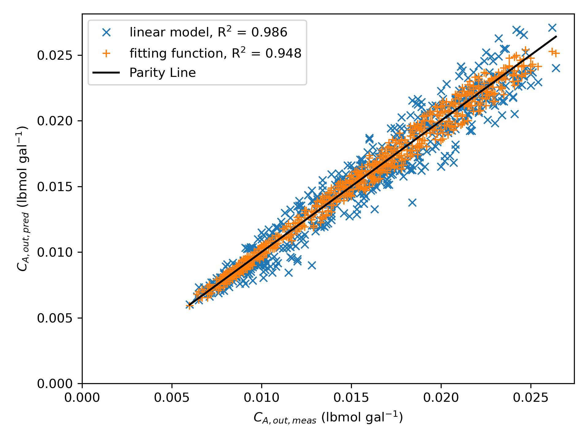{#fig-ch11_ex3_parity width="80%"}

&nbsp;

::: {#fig-ch11_ex3_residuals layout-ncol=2}

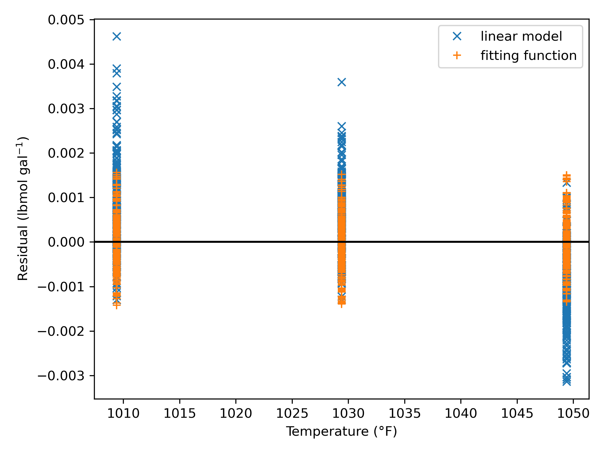

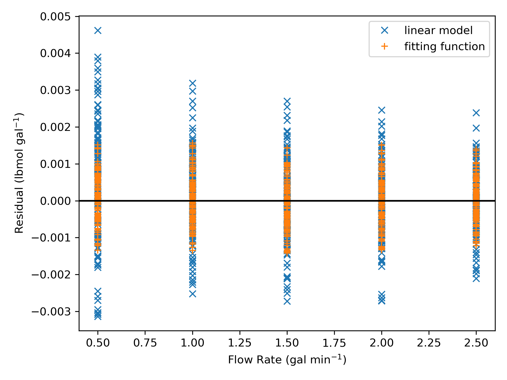

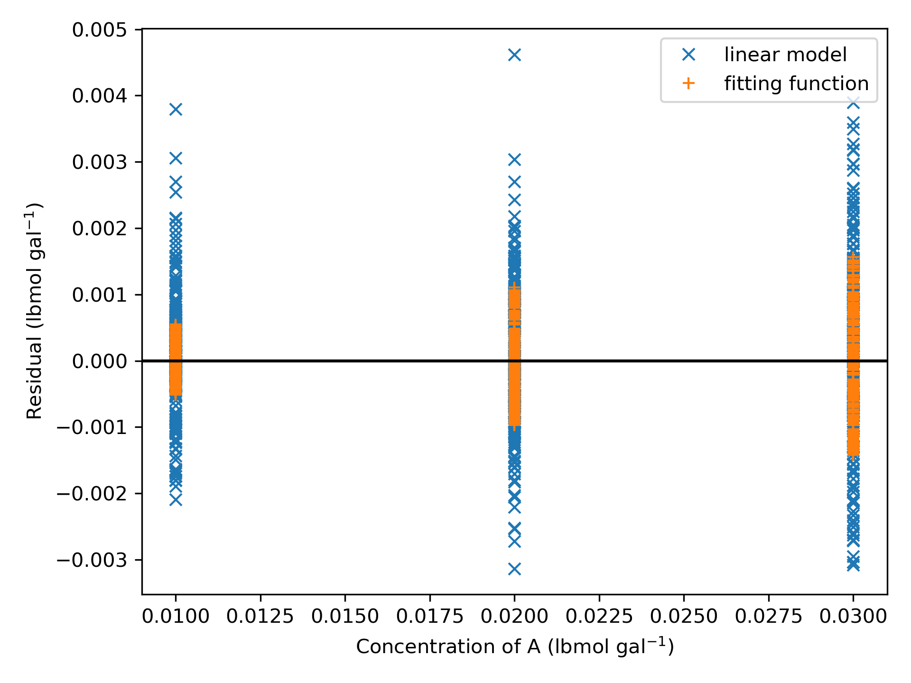

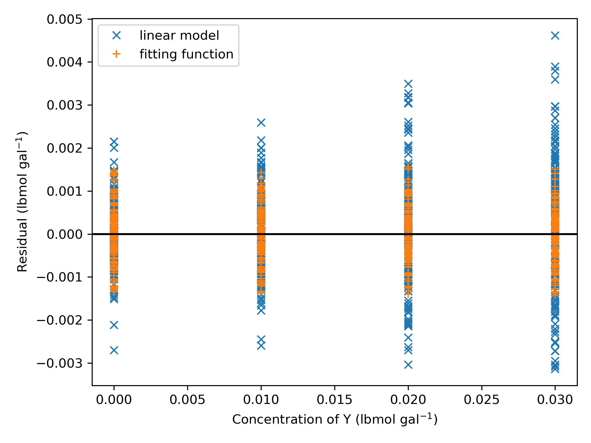

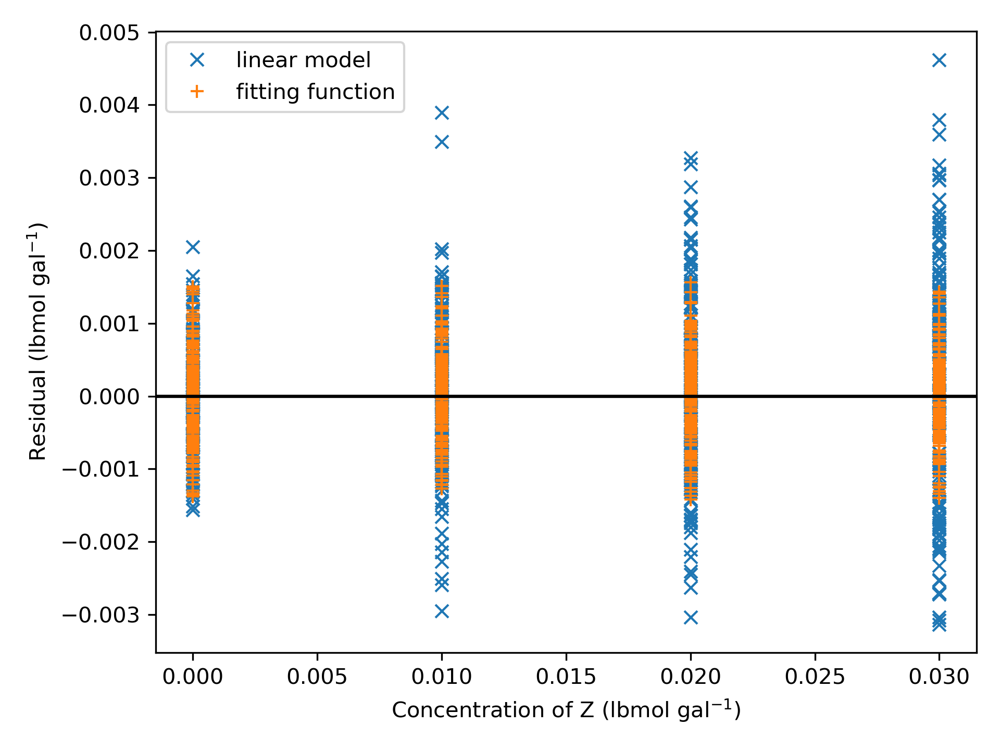

Residuals plots for both the fitting function and linear model parameter estimation approaches.
:::

[Fitting Function Analysis]{.underline}

The fitting function approach yields pre-exponential factors and activation energies that are each estimated using all of the experimental data points. The confidence interval for $k_{0,f}$ is between 41 and 245 % of the estimated value, while that for $k_{0,r}$ is between 20 and 497% of its estimated value. It is often found that pre-exponential factors have relatively large uncertainties. The confidence interval for  is between 92 and 108% of its estimated value, and for  between 90 and 110% of its estimated value. These much narrower confidence intervals indicate that there is much less uncertainty in the activation energies.

The data points in the parity plot show a small amount of scatter about the parity line, and the residuals plots show the scatter to be random, with equal positive and negative deviations and with no trends relative to any of the adjusted experimental inputs. These graphical indicators, together with a coefficient of determination of 0.986, indicate that the model is accurate and adequately captures the effect of each adjusted input on the reaction rate.

Overall, with the parameters estimated using the fitting function approach, equation (2) is an acceptably accurate rate expression. The uncertainty in the estimated parameters is reasonable and there are no indications that the rate expression fails to capture effects associated with the adjusted experimental inputs.

[Linearized Model Analysis]{.underline}

In the linear model approach the data are separated into same temperature blocks. The rate coefficients estimated for each block only use the data from that block, not the complete data set. @fig-ch11_ex3_model_plots shows the model plots for the three temperatures used in the experiments. Both a visual examination and the coefficients of determination included in the figure legends indicate that the fit of the linear model to the 110 °F data is a little less accurate than for the other temperatures.

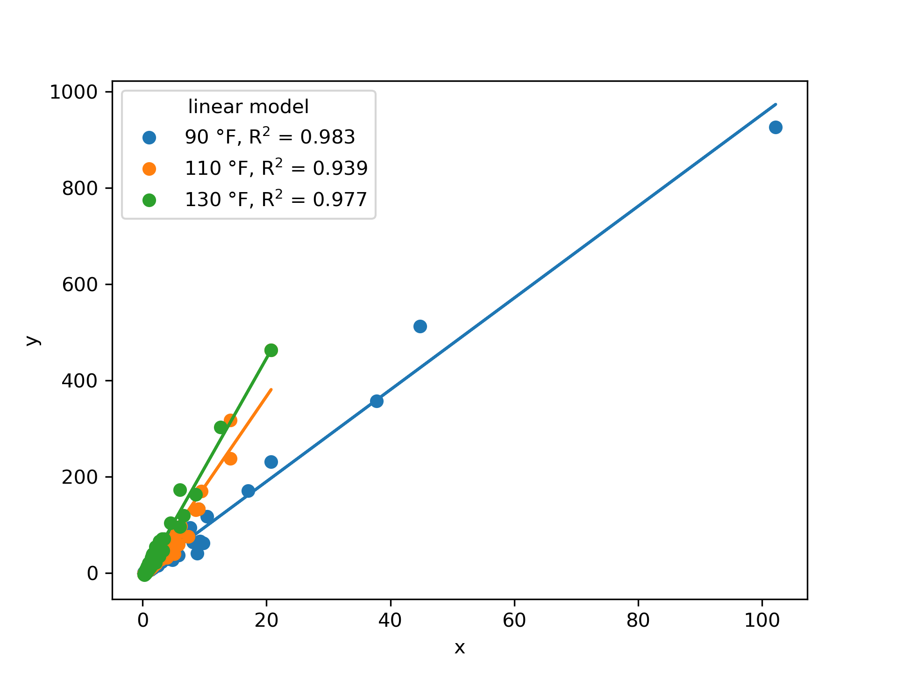{#fig-ch11_ex3_model_plots width="80%"}

The forward and reverse rate coefficients at the three data block temperatures are found from slopes and intercepts of the model plots. The Arrhenius expression is then fit to the data as shown in @fig-ch11_ex3_Arr_plot. The fit for the forward rate coefficient is relatively good, but for the reverse rate coefficient it is unacceptable.

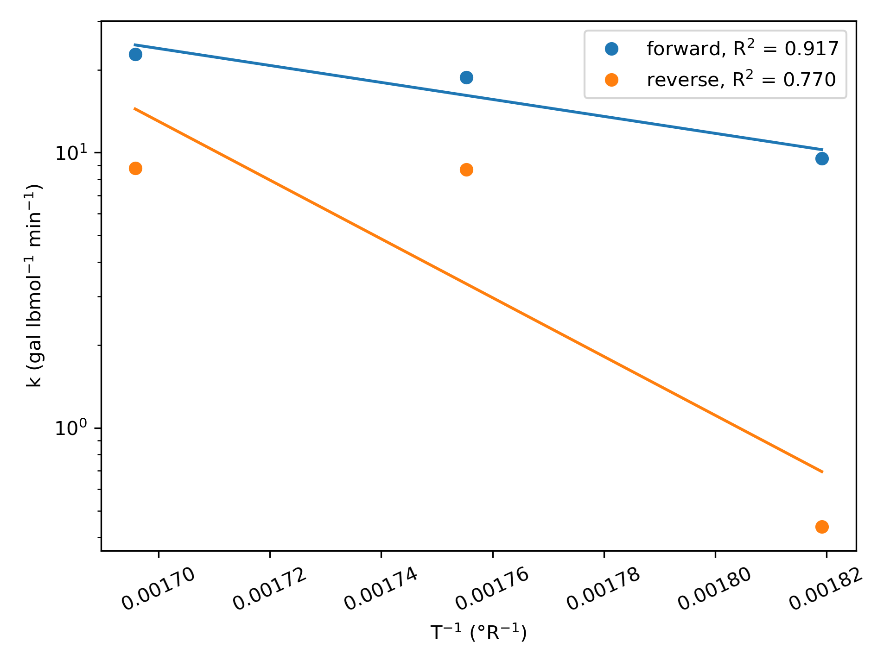{#fig-ch11_ex3_Arr_plot width="80%"}

As expected from the Arrhenius plots, the pre-exponential factor and activation energy for the reverse rate coefficient in @tbl-ch11_ex3_results have huge uncertainty. Their values are also vastly different from those found using the fitting function approach. While the Arrhenius parameters for the forward rate coefficient are closer to those from the fitting function approach, their 95% confidence intervals are also unacceptable.

Given the high uncertainty in the rate expression parameters found using the linear model, it is somewhat surprising that coefficients of determination in @tbl-ch11_ex3_results are both well above 0.9, and the data still fall close to the parity plot in @fig-ch11_ex3_parity. The deviations are larger, but don’t, in themselves, indicate that the rate expression is unacceptable. The larger deviations are also seen in the residuals plots of @fig-ch11_ex3_residuals. There appears to be a trend in the deviations as a function of temperature for the linear model, but not for the fitting function approach.

While the linear model gives a reasonably accurate overall model, the uncertainties in the individual parameters are too large, and it should not be accepted. Additional experiments should be performed, particularly at 110 °F, to get better estimates.

<center>**Assessment**</center>

When used with the rate expression parameters shown for the fitting function approach in @tbl-ch11_ex3_results, the accuracy of the proposed rate expression in describing the concentration and temperature dependence of the rate, within the range of concentrations and temperatures investigated, is acceptable.

---

### Kinetics Data Analysis using Same-Temperature Data Blocks and Linear Least Squares {#sec-ch11_ex4}

The gas-phase reaction between reagents A and B was studied in an ideal, isothermal, 500 cm^3^ BSTR. In all experiments the reactor was charged with reagents A and B only, but with varying partial pressures. The fractional conversion of reagent A was measured at seven different elapsed times in each experiment. Experiments were performed at three different temperatures. Assess the accuracy of the rate expression shown in equation (2) using both a fitting function approach and a linear model approach.

$$
A + B \rightarrow Y + Z \tag{1}
$$

$$
r = k P_A P_B \tag{2}
$$

```{r}
#| echo: false
#| output: false
df <- read.csv("solutions/ch11_ex4/example_11_5_4_data.csv") 
df <- fmt_tibble_col(df, 2, 3, 3, 1)
```

The experimental data are provided in the file, [example_11_5_4_data.csv](solutions/ch11_ex4/example_11_5_4_data.csv). The first few data points from that file are shown in @tbl-ch11_ex4_data.

```{r}
#| echo: false
#| warning: false
#| label: tbl-ch11_ex4_data
#| tbl-cap: First 6 of the 189 experimental data points.
kbl(df[1:6,], format = "markdown",  align = "ccccc"
    , col.names = c("T (°C)", "P~A,0~ (atm)", "P~B,0~ (atm)", "T~meas~ (min)", "f~A~"))
```

---

:::{.callout-tip collapse="true"}
## Click Here to See What an Expert Might be Thinking at this Point

The assignment narrative describes experiments performed using an isothermal BSTR. The asjusted experimental inputs were the temperature, initial partial pressures of A and B, and the reaction time. The conversion of A was measured as the response. A rate expression is proposed, and I'm asked to assess its accuracy. I'll start by summarizing the assignment. 

:::

<center>**Assignment Summary**</center>

[Reaction]{.underline}

$$
A + B \rightarrow Y + Z \tag{1}
$$

[Rate Expression]{.underline}

$$
r = k P_A P_B \tag{2}
$$

[Reactor]{.underline}: Isothermal BSTR

[Given Constant]{.underline}: $V$ = 500 cm^3^

[Given Adjusted Experimental Inputs]{.underline}: $\underline{T}$, $\underline{P}_{A,0}$, $\underline{P}_{B,0}$, $\underline{t}_{meas}$

[Experimental Response]{.underline}: $\underline{f}_A$

[Parameters to Estimate]{.underline}: $k_0$ and $E$

[Deliverable]{.underline}: Assessment of the accuracy of the rate expression, equation (2).

<center>**Formulation of the Equations Using a Fitting Function**</center>

:::{.callout-tip collapse="true"}
## Click Here to See What an Expert Might be Thinking at this Point

I will need a reactor model to calculate the predicted responses, so I'll start by generating the BSTR design equations. The experiments are isothermal at a known temperature, so the mole balances can be solved independently and no other design equations are needed.

BSTR mole balances are IVODEs, so I know they need to be solved numerically to get vectors containing the independent and dependent variables spanning the range from the start of the experiment to the time when the response was measured. To solve them I'll need to provide initial values, a stopping criterion, and a derivatives function.

The initial values can be calculated using the given initial partial pressures and the ideal gas law. The stopping criterion is defined using the time when the response was measured. I'll need to write the derivatives function. It must receive the independent and dependent variables at the start of an integration step. First it must calculate any additional unknowns that appear in the design equations, and then it must evaluate and return the mole balance derivatives.

The only additional unknown in the mole balances is the rate, which can be calculated using the proposed rate expression. However, the rate expression introduces the rate coefficient and the partial pressures of A and B as additional unknowns. The parital pressures can be calculated using the ideal gas law and the rate coefficient can be calculated using the Arrhenius expression. The Arrhenius expression introduces the pre-exponential factor and the activation energy as additional unknowns. These are not computable, so they will need to be provided to the derivatives function by some means other than passing them as arguments.

:::

[BSTR Model Equations]{.underline}:

$$
\frac{dn_A}{dt} = -Vr \tag{3}
$$

$$
\frac{dn_B}{dt} = -Vr \tag{4}
$$

$$
\frac{dn_Y}{dt} = Vr \tag{5}
$$

$$
\frac{dn_Z}{dt} = Vr \tag{6}
$$

[BSTR Model Variables]{.underline}: $\underline{t}$, $\underline{n}_A$, $\underline{n}_B$, $\underline{n}_Y$, and $\underline{n}_Z$

[Additional Computable Unknowns]{.underline}: $r$, $k$, $P_A$, and $P_B$

$$
k = k_0 \exp{ \left( \frac{-E}{RT}  \right)} \tag{7}
$$

$$
P_i = \frac{n_i RT}{V} \qquad i = A \text{ and } B \tag{8}
$$

[Additional Uncomputable Unknowns]{.underline}: $k_0$ and $E$

[IVODE Solver Inputs]{.underline}:

1. Initial values of the reactor model variables shown in @tbl-ch11_ex4_initial_values.
2. Stopping criterions that $t$ equals the final value shown in @tbl-ch11_ex4_initial_values.
3. Derivatives function that
    a. receives the BSTR model variables
    b. has access to $k_0$ and $E$
    c. calculates the additional unknowns using equations (2), (7), and (8)
    d. evaluates and returns the BSTR derivatives using equations (3) - (6)

| Variable | Initial Value | Final Value |
|:------:|:-------:|:-------:|
| $t$ | $0$ | $t_{meas}$ |
| $n_A$ | $n_{A,0} = \frac{P_{A,0}V}{RT}$ | |
| $n_B$ | $n_{B,0} = \frac{P_{B,0}V}{RT}$ | |
| $n_Y$ | 0 | |
| $n_Z$ | 0 | |
  
: Initial and final values of the design equation variables. {#tbl-ch11_ex4_initial_values}

:::{.callout-tip collapse="true"}
## Click Here to See What an Expert Might be Thinking at this Point

I need to fit the BSTR model to the experimental data, and I'll use a numerical fitting function to do that. When I call it I'll need to provide the adjusted experimental inputs, the measured responses, a guess for the parameters to be estimated, and a predicted responses function that I will need to write.

Instead of estimating $k_0$, I'll estimate it's base-10 log, $\beta$. I'll guess a value of 0 for $\beta$ and 10 kcal mol^-1^ for $E$.

The predicted responses function will receive the adjusted experimental inputs and guesses for the parameters as arguments. It must calculate $k_0$ and make it available to the derivatives function, along with $E$. Then it can simply loop through the experiments, solving the design equations and calculating the conversion predicted by the model for each experiment.

:::

[Fitting Function Inputs]{.underline}:

[Assessment Equations]{.underline}:

1. Experimental data: $\underline{T}$, $\underline{P}_{A,0}$, $\underline{P}_{B,0}$, $\underline{t}_{meas}, and $\underline{f}_A$
2. Initial guesses for the parameters being estimated
$$
\beta = 0 \tag{9}
$$
$$
E = 10 \text{ kcal mol}^{-1} \tag{10}
$$
3. Predicted responses function that
    a. receives the adjusted experimental inputs and guesses for the parameters
    b. calculates the pre-exponential factor and makes it and the activation energy available to the derivatives function
$$
k_0 = 10^\beta \tag{11}
$$
    c. loops through all of the experiments
        i. solves the BSTR model equations
        ii. calculates the model-predicted response
$$
f_{A,pred} = \frac{n_{A,0} - \underline{n}_A\big\vert_{t=t_{meas}}}{n_{A,0}} \tag{12}
$$
    d. returns the predicted responses for all of the experiments.

:::{.callout-tip collapse="true"}
## Click Here to See What an Expert Might be Thinking at this Point

The fitting function will return estimates and confidence intervals for $\beta$ and $E$ along with the coefficient of determination and the model-predicted responses. I will need to use $\beta$ and $\beta_{CI}$ to calculate the estimates for $k_0$ and $k_{0,CI}$.

If the fitting function does not return the predicted responses, I can get them by calling the predicted responses function with the estimated parameters. In either case, I can then calculate the experiment residuals to use for making residuals plots.

:::

[Assessment Equations]{.underline}

$$
k_{0,CI} = 10^{\beta_{CI}} \tag{13}
$$

$$
\underline{\epsilon}_{expt} = \underline{f}_{A,meas} - \underline{f}_{A,pred} \tag{14}
$$

<center>**Formulation of the Equations Using a Linearized Model**</center>

:::{.callout-tip collapse="true"}
## Click Here to See What an Expert Might be Thinking at this Point

I also need to estimate the parameters using a linearized model. To do that, I'll start with one only one of the mole balances. Here I'll use the mole balance on A. I need to substitute the rate expression into it, express all variables in terms of $n_A$ and $t$, solve it to get an algebraic expression for $n_A$ as a function of $t$. I can use the extent of reaction to express the other variables in terms of $n_A$ as described in [Chapter -@sec-ch2_rxn_progress].

:::

[Linearized BSTR Model Equation]{.underline}:

$$
\frac{dn_A}{dt} = -Vr = -kV P_A P_B
$$

$$
\frac{dn_A}{dt} = -kV\left( \frac{n_ART}{V} \right)\left( \frac{n_BRT}{V} \right) = \frac{-k\left(RT\right)^2}{V}n_An_B
$$

$$
n_A = n_{A,0} - \xi \qquad \Rightarrow \qquad \xi = n_{A,0} - n_A
$$

$$
n_B = n_{B,0} - \xi = n_{B,0} - n_{A,0} + n_A
$$ 

$$
\frac{dn_A}{dt} = \frac{-k\left(RT\right)^2}{V}n_A\left( n_{B,0} - n_{A,0} + n_A \right)
$$

$$
\frac{dn_A}{n_A\left( n_{B,0} - n_{A,0} + n_A \right)} = \frac{-k\left(RT\right)^2}{V}dt
$$

$$
\int_{n_{A,0}}^{n_A}\frac{dn_A}{n_A\left( n_{B,0} - n_{A,0} + n_A \right)} = \frac{-k\left(RT\right)^2}{V}\int_{t_0}^tdt
$$

If $n_{A,0} = n_{B,0}$

$$
\frac{1}{n_{A,0}}- \frac{1}{n_A} = \frac{-k\left(RT\right)^2}{V} t 
\quad \Rightarrow \quad y=mx \tag{14}
$$

If $n_{A,0} \ne n_{B,0}$

$$
\begin{align}
\frac{1}{n_{A,0}-n_{B,0}} &\ln{\frac{n_{A,0}\left( n_{B,0} - n_{A,0} + n_A  \right)}{n_{B,0}n_A}} \\&= \frac{-k\left(RT\right)^2}{V} t 
\end{align}\quad \Rightarrow \quad y=mx \tag{15}
$$

:::{.callout-tip collapse="true"}
## Click Here to See What an Expert Might be Thinking at this Point

I'll split the data into same-temperature blocks and analyze each block separately. For each block I need to use the experimental data to calculate $x$ and $y$, fit the equation $y=mx$, and set the estimate for $m$ equal to $k$. After all of the data blocks have been analyzed, I can fit the Arrhenius expression to the $T-k$ data to estimate the pre-exponential factor and activation energy.

Finally, I can use the resulting values of $k_0$ and $E$ to calcuate predicted responses, experiment residuals, and the coefficient of determination.

:::

[Linear Model Least Squares Inputs]{.underline}: (for each same-temperature data block)

$$
n_A = n_{A,0}\left(1-f_A\right) \tag{16}
$$

$$
y = \frac{1}{n_{A,0}} - \frac{1}{n_A} = \frac{1}{n_{A,0}-n_{B,0}} \ln{\frac{n_{A,0}\left( n_{B,0} - n_{A,0} + n_A  \right)}{n_{B,0}n_A}} \tag{17}
$$

$$
x = \frac{-t_{meas}\left(RT\right)^2}{V} \tag{18}
$$

[Linear Model Rate Coefficient Equation]{.underline}: (for each same-temperature data block)

$$
k=m \tag{19}
$$

[Arrhenius Expression Least Squares Inputs]{.underline}:

$$
\underline{y} = \ln{\underline{k}} \tag{20}
$$

$$
\underline{x} = \frac{1}{\underline{T}} \tag{21}
$$

[Arrhenius Parameter Equations]{.underline}:

$$
k_0 = \exp{\left(b\right)} \tag{22}
$$

$$
E = -mR \tag{23}
$$

[Coefficient of Determination Equations]{.underline}:

$$
f_{A,mean} = \frac{\sum_if_{A,i}}{n_{expts}} \tag{24}
$$

$$
ss_{resid} = \sum_i \left(f_{A,i} - f_{A,pred,i}\right)^2 \tag{25}
$$

$$
ss_{total} = \sum_i \left(f_{A,i} - f_{A,mean}\right)^2 \tag{26}
$$

$$
R^2 = 1 - \frac{ss_{resid}}{ss_{total}} \tag{27}
$$

<center>**Implementation of the Calculations**</center>

Computer code to perform the calculations can be written using a variety of programming languages and environments, and the actual code can be structured in a variety of ways. Referring to the preceding assignment summary and formulation of the equations, here are the essential things it must do.

1. Read the adjusted experimental inputs and the experimental responses from the file, [example_11_5_4_data.csv](solutions/ch11_ex4/example_11_5_4_data.csv).
2. Make the given and known constants available wherever they are needed.
3. Declare global variables (or use some other means) for making the rate expression parameters available to the BSTR derivatives function.
4. Define the BSTR derivatives and predicted responses functions as described above.
5. Perform the analysis using a fitting function.
    a. Define initial guesses for the parameters, $\beta$ and $E$.
    b. Call a numerical fitting function to get the parameter estimates, 95% confidence intervals, coefficient of determination and model predicted responses.
    c. Calculate the pre-exponential factor estimates from the $\beta$ estimates.
    d. Calculate the experiment residuals and generate parity and residuals plots.
6. Perform the analysis using a linearized model
    a. Separate the data into same-temperature blocks, and for each block
        i. calculate $x$ and $y$
        ii. fit a straight line, $y=mx$, to the data using linear least squares.
        iii. calculate $k$ from the estimated slope.
    b. Fit the Arrhenius expression to the data from step 6a
    c. Calculate the predicted responses, experiment residuals and coefficient of determination for all of the experiments using the Arrhenius expression parameters from step 6b.
7. Tabulate, graph, and save the results, as appropriate.

<center>**Results and Discussion**</center>

The estimated pre-exponential factor and activation energy found using a fitting function are shown in @tbl-ch11_ex4_results. The accuracy is excellent as evidenced by all indicators. The upper and lower limits of the 95% confidence intervals are close in value to the estimates, the coefficient of determination is nearly equal to 1, the data in the parity plot, @fig-ch11_ex4_parity, all lie very close to the parity line, and in all four residuals plots, @fig-ch11_ex4_residual, the deviations are random with no trends.

| Approach | Parameter | Value | 95% CI | Units |
|:------:|:-------:|:-------:|:-------:|:-------:|
| fitting function | $k_0$ | 2.59 | [2.08, 3.1] | mol cm^-3^ min^-1^ atm^-2^ |
| | $E$ | 21.8 | [21.5, 22.1] | kcal mol^-1^ |
| | $R^2$ | 0.999 | | |
| linearized model | $k_0$ | 2.88 | [0.054, 154] | mol cm^-3^ min^-1^ atm^-2^ |
| | $E$ | 22.0 | [15.9, 28.1] | kcal mol^-1^ |
| | $R^2$ | 0.999 | | |
 
: Results of parameter estimation using a fitting function. {#tbl-ch11_ex4_results}

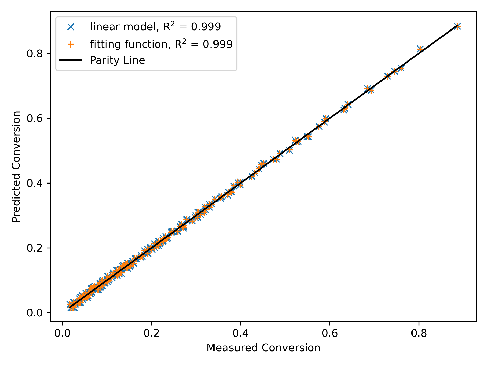{#fig-ch11_ex4_parity width="80%"}

::: {#fig-ch11_ex4_residual layout-ncol=2}

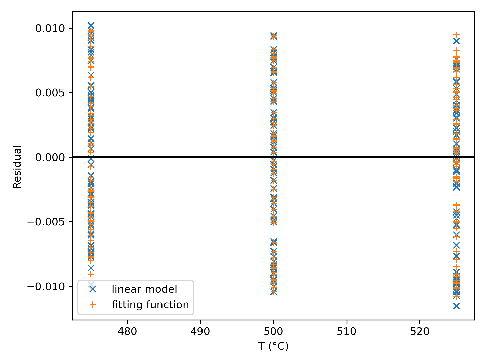

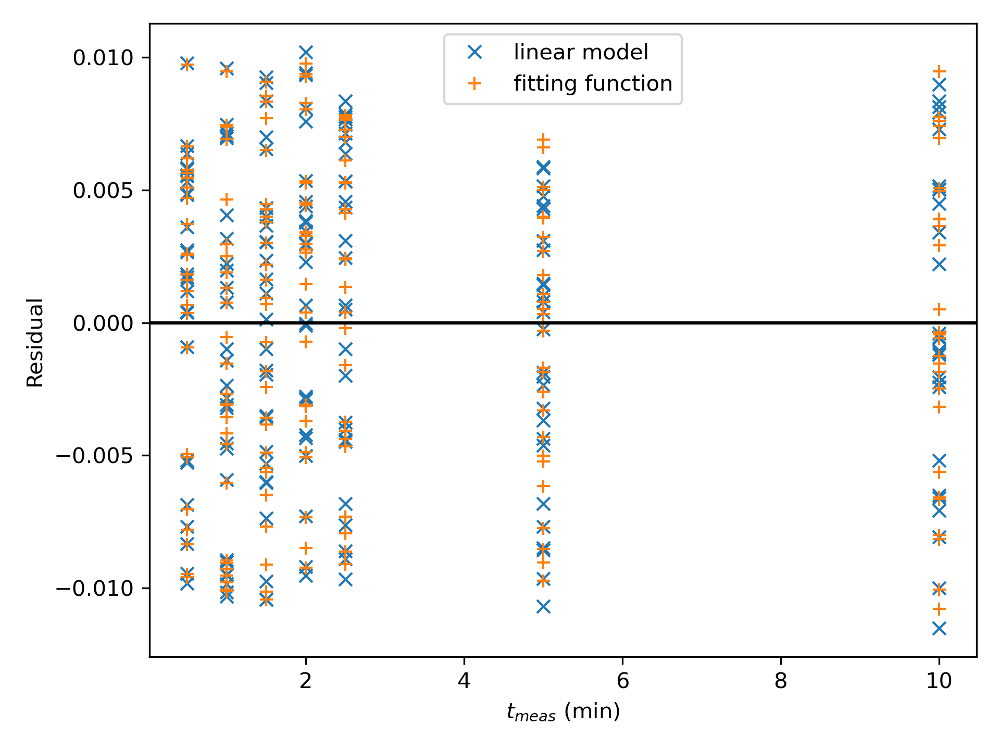

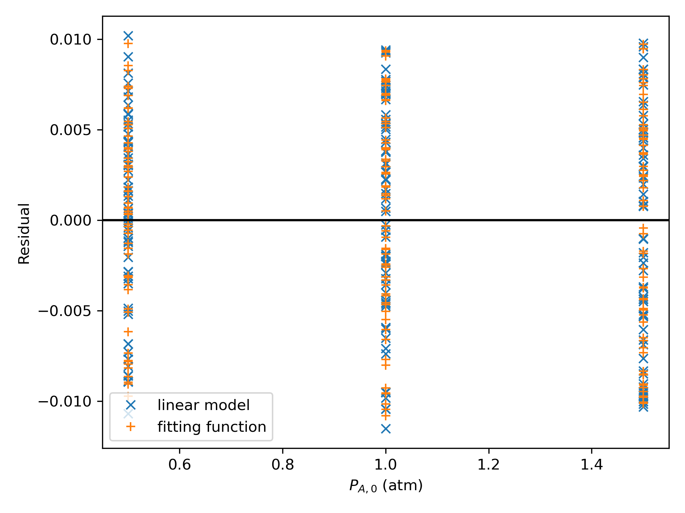

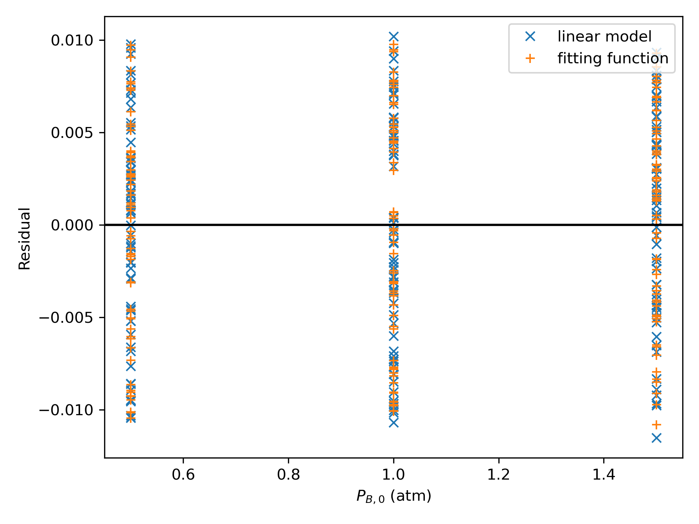

Residuals Plots for estimation using a fitting function and a linearized model.
:::

When using the linearized model approach, the data are separated into same-temperature blocks. Model plots from fitting the linearized model to each of the data blocks are shown in @fig-ch11_ex4_model_plots. There is minimal scatter of the data about the line at all three temperatures, indicating an accurate fit. The Arrhenius expression was fit to the resulting  data. The results are alos presented in @tbl-ch11_ex4_results and the Arrhenius plots are shown in @fig-ch11_ex4_Arrhenius. As was the case for the estimates using a fitting function, A highly accurate fit is evidenced by all indicators (confidence intervals, coefficient of determination, model plots and Arrhenius plot).

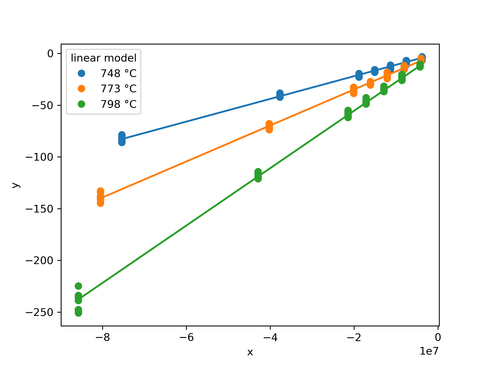{#fig-ch11_ex4_model_plots width='80%'}

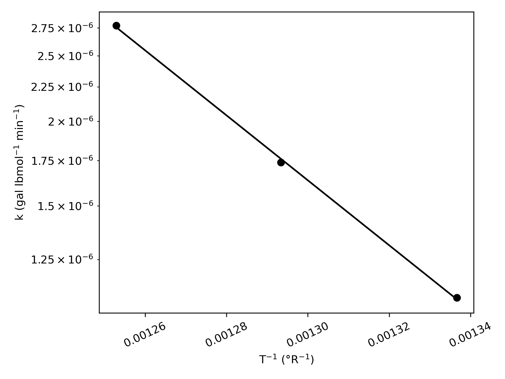{#fig-ch11_ex4_Arrhenius width='80%'}

For this data set, the two approaches to parameter estimation gave the same results to within the experimental uncertainty. The parity and residuals plots and the coefficients of determination for the complete data sets are essentially the same. This is true because each of the same-temperature data blocks gave excellent estimates for the rate coefficient. 

<center>**Assessment**</center>

The proposed rate expression is acceptably accurate when either of the sets of Arrhenius parameters shown in @tbl-ch11_ex4_results are used.

---

::: {.callout-note collapse="false"}
## Note

When a linearized model is used for parameter estimation it is very common for the calculations to be performed using a spreadsheet. Once the design equation has been integrated and linearized, $x$ and $y$ can be added as spreadsheet columns. Constant temperature blocks of $x$ *versus* $y$ can be plotted and a trendline can be added to fit a straight line to the data. The Arrhenius expression can also be fit to the resulting $T-k$ data in the same spreadsheet.

:::

### Power-Law Kinetics of a Heterogeneous Catalytic Reaction {#sec-ch11_ex5}

Reversible, gas-phase reaction (1) was studied in a PFR at 1 atm. In all experiments the same amount of catalyst, 3.0 g, was present in the reactor, forming a small packed bed. The apparent density of the catalyst bed was constant, and pressure drop across the catalyst bed was negligible. The total inlet molar flow rate was also the same in all experiments and equal to 2.5 mol h^–1^. The inlet mole fractions of A, B, Y, and Z and the temperature were varied in the experiments and the partial pressure of A, in atm, at the reactor outlet was recorded.

Preliminary experiments showed that the rate does not depend upon the partial pressure of reagent Z, and the reaction is inhibited by reagent Y. The power-law rate expression shown in equation (2) has been proposed to model the rate. The equilibrium constant, $K$ , in equation (2) can be calculated using equation (3) where $K_0$ equals 0.0132 and $\Delta H$ equals –9096 cal mol^–1^.

Use the resulting data to assess the accuracy of the proposed rate expression.

$$
A + B \rightarrow Y + Z \tag{1}
$$

$$
r = k\,P_{A}^{\alpha_A}\,P_{B}^{\alpha_B}\,P_{Y}^{\alpha_Y}\left( 1 - \frac{P_YP_Z}{KP_AP_B} \right) \tag{2}
$$

$$
K = K_0 \exp{\left( \frac{-\Delta H}{RT}\right)} \tag{3}
$$

```{r}
#| echo: false
#| output: false
df <- read.csv("solutions/ch11_ex5/example_11_5_5_data.csv") 
df <- fmt_tibble_col(df, 2, 3, 3, 1)
```

The experimental data are provided in the file, [example_11_5_5_data.csv](solutions/ch11_ex5/example_11_5_5_data.csv). The first few data points from that file are shown in @tbl-ch11_ex5_data.

```{r}
#| echo: false
#| warning: false
#| label: tbl-ch11_ex5_data
#| tbl-cap: First 6 of the 45 experimental data points.
kbl(df[1:6,], format = "markdown",  align = "cccccc", 
    col.names = c("y~A,in~", "y~B,in~", "y~Y,in~", "y~Z,in~", "T (°C)", "P~A,out~ (atm)"))
```

---

:::{.callout-tip collapse="true"}
## Click Here to See What an Expert Might be Thinking at this Point

The assignment narrative describes generation of kinetics data using an isothermal, steady-state PFR with negligible pressure drop. The experimentally adjusted inputs are the temperature and the mole fractions of the reagents. The measured response is the outlet partial pressure of reagent A. I'll begin by summarizing the assignment.

:::

<center>**Assignment Summary**</center>

[Reaction]{.underline}

$$
A + B \rightarrow Y + Z \tag{1}
$$

[Rate Expression]{.underline}

$$
r = k\,P_{A}^{\alpha_A}\,P_{B}^{\alpha_B}\,P_{Y}^{\alpha_Y}\left( 1 - \frac{P_YP_Z}{KP_AP_B} \right) \tag{2}
$$

[Reactor]{.underline}: Isothermal, steady-state PFR with negligible pressure drop.

[Given Constants]{.underline}: $P$ = 1 atm, $m_{cat}$ = 3 g, $\dot{n}_{total,in}$ = 2.5 mol h^-1^, $K_0$ = 0.0132, and $\Delta H$ = -9096 cal mol^-1^.

[Given Adjusted Experimental Inputs]{.underline}: $\underline{y}_{A,in}$, $\underline{y}_{B,in}$, $\underline{y}_{Y,in}$, and $\underline{y}_{Z,in}$, and $\underline{T}$.

[Given Experimental Responses]{.underline}: $\underline{P}_{A,out}$

[Parameters to Estimate]{.underline}: $k_0$, $E$, $\alpha_A$, $\alpha_B$, and $\alpha_Y$.

[Deliverable]{.underline}: Assessment of the accuracy of the rate expression, equation (2).

<center>**Formulation of the Equations**</center>

:::{.callout-tip collapse="true"}
## Click Here to See What an Expert Might be Thinking at this Point

I need to model the experimental PFR. Both the pressure and the temperature are constant and known, so the only design equations I need are mole balances. I don't know the volume of the packed bed in these experiments, so I'll use the cumulative catalyst mass as the independent variable which will result in a rate that is normalized per unit catalyst mass.

The design equations will be solved numerically, so I'll need initial values, a stopping criterions and a derivatives function. The initial values are the molar flow rates at the inlet, which are simply the mole fractions times the total inlet molar flow rate. The stopping criterion is that the cumulative catalyst mass will equal the mass of catalyst used in the experiments.

The derivatives function that I will write must recieve the independent and dependent variables at the start of an integration step as arguments. First it must calculate any addtional unknowns that appear in the design equations. Then it must evaluate and return the PFR model derivatives.

The only additional unknown in the design equations is the rate which can be calculated using the proposed rate expression. That introduces the rate coefficient, equilibrium constant, the partial pressures of the reagents, and the power-law exponents as additional unknowns. The Arrhenius expression and the ideal gas law can be used to calculate the rate coefficient and partial pressures An expression for the equilibrium constant is provided. That introduces the pre-expoential factor and the activation energy as additional unknowns.

The pre-exponential factor, activation energy, and power-law exponents are not computable, so they will need to be made available to the derivatives function by some means other than as an argument.

:::

[PFR Model Equations]{.underline}:

$$
\frac{d\dot{n}_A}{dm} = -r \tag{4}
$$

$$
\frac{d\dot{n}_B}{dm} = -r \tag{5}
$$

$$
\frac{d\dot{n}_Y}{dm} = r \tag{6}
$$

$$
\frac{d\dot{n}_Z}{dm} = r \tag{7}
$$

[PFR Model Variables]{.underline}: $\underline{m}$, $\underline{\dot{n}}_A$, $\underline{\dot{n}}_B$, $\underline{\dot{n}}_Y$, and $\underline{\dot{n}}_Z$

[Additional Computable Unknowns]{.underline}: $r$, $k$, $P_A$, $P_B$, $P_Y$, $P_Z$, and $K$.

$$
k = k_0 \exp{ \left( \frac{-E}{RT}\right)} \tag{8}
$$

$$
P_i = \frac{\dot{n}_i}{\dot{n}_A + \dot{n}_B + \dot{n}_Y + \dot{n}_Z}P \quad i = A, B, Y, \text{ and } Z \tag{9}
$$

[Additional Uncomputable Unknowns]{.underline}: $k_0$, $E$, $\alpha_A$, $\alpha_B$, and $\alpha_Y$.

[IVODE Solver Inputs]{.underline}:

1. Initial values of the reactor model variables shown in @tbl-ch11_ex5_initial_values.
2. Stopping criterion that $m$ equals the final value shown in @tbl-ch11_ex5_initial_values.
3. Derivatives function that
    a. receives the PFR model variables, $m$, $\dot{n}_A$, $\dot{n}_B$, $\dot{n}_Y$, and $\dot{n}_Z$, at the start of an integration step
    b. has access to the parameters, $k_0$, $E$, $\alpha_A$, $\alpha_B$, and $\alpha_Y$.
    c. calculates the additional unknowns using equations (2), (3), (8), and (9)
    d. evaluates and returns the PFR model derivatives using equations (4) - (7)

| Variable | Initial Value | Final Value |
|:------:|:-------:|:-------:|
| $m$ | $0$ | $m_{cat}$ | 
| $\dot{n}_A$ | $\dot{n}_{A,in}= y_{A,in}\dot{n}_{total,in}$ | |
| $\dot{n}_B$ | $\dot{n}_{B,in}= y_{B,in}\dot{n}_{total,in}$ | |
| $\dot{n}_Y$ | $\dot{n}_{Y,in}= y_{Y,in}\dot{n}_{total,in}$ | |
| $\dot{n}_Z$ | $\dot{n}_{Z,in}= y_{Z,in}\dot{n}_{total,in}$ | |
  
: Initial and final values of the design equation variables. {#tbl-ch11_ex5_initial_values}

:::{.callout-tip collapse="true"}
## Click Here to See What an Expert Might be Thinking at this Point

I'll use a numerical fitting function to fit the PFR model equations to the experimental data. I'll need to provide it with the adjusted experimental inputs, the measured responses, initial guesses for the rate expression parameters, and a predicted responses function.

I'll estimate the base-10 log of the pre-exponential instead of the pre-exponential itself, and I'll guess a value of 0. I guess a low activation energy of 10 kcal mol^-1^, and I'll guess the power-law exponents all equal 1.0 for reactants and -1.0 for products. If the fitting function doesn't converge, I'll need to improve these guesses.

The predicted responses function that I write must receive the adjusted inputs and rate expression parameters are arguments. It needs to make the parameters available to the PFR derivatives function and then loop through the experiments solving the design equations and calculating the predicted response for each.

Finally, I'll need to convert the estimate and confidence interval for $\beta$ to those for $k_0$.

:::

[Fitting Function Inputs]{.underline}:

1. Experimental data: $\underline{y}_{A,in}$, $\underline{y}_{B,in}$, $\underline{y}_{Y,in}$, and $\underline{y}_{Z,in}$, $\underline{T}$, and $\underline{P}_{A,out}$
2. Initial guesses for the parameters being estimated
$$
\beta_{guess} = 0 \tag{10}
$$
$$
E_{guess} = 10,000 \text{ cal mol}^{-1} \tag{11}
$$
$$
\alpha_{i,guess} = 1.0 \qquad i = A \text{ and } B \tag{12}
$$
$$
\alpha_{Y,guess} = -1.0 \tag{13}
$$
3. Predicted Responses Function that
    a. receives the adjusted experimental inputs and guesses for the parameters
    b. calculates the pre-exponential factor, equation (9), and makes all of the rate expression parameters available to the derivatives function
    c. loops through all of the experiments
        i. solves the PFR model equations
        ii. calculates the model-predicted response
$$
P_{A,out,pred} = \left(\frac{\underline{\dot{n}}_A}{\underline{\dot{n}}_A + \underline{\dot{n}}_B + \underline{\dot{n}}_Y + \underline{\dot{n}}_Z}\right)\Bigg|_{m=m_{cat}}P \tag{14}
$$
    d. returns the predicted responses for all of the experiments

[Assessment Equation]{.underline}:

$$k_{0,CI} = 10^{\beta_{CI}} \tag{15}
$$

<center>**Implementation of the Calculations**</center>

Computer code to perform the calculations can be written using a variety of programming languages and environments, and the actual code can be structured in a variety of ways. Referring to the preceding assignment summary and formulation of the equations, here are the essential things it must do.

1. Read the adjusted experimental inputs and the experimental responses from the file, [example_11_5_5_data.csv](solutions/ch11_ex5/example_11_5_5_data.csv).
2. Make the given and known constants available wherever they are needed.
3. Declare global variables (or use some other means) for making the rate expression parameters available to the PFR derivatives function.
4. Define the PFR derivatives and predicted responses functions as described above.
5. Define initial guesses for the rate expression paramters, $k_0$, $E$, $\alpha_A$, $\alpha_B$, and $\alpha_Y$.
6. Call a numerical fitting function to get the parameter estimates, 95% confidence intervals, coefficient of determination and model predicted responses.
7. Calculate $k_0$ and its 95% confidence interval
8. Calculate the experiment residuals and generate parity and residuals plots.
9. Tabulate, graph, and save the results, as appropriate.

<center>**Results and Discussion**</center>

@tbl-ch11_ex5_results presents the parameter estimation results. The range of the 95% confidence interval for each of the estimates is closely centered on the estimated values and the coefficient of determination is nearly equal to 1.0. These facts indicate that the fitted model is quite accurate.

Parameter | Value | 95% CI | Units
:--: | :--: | :--: | :--:
$k_0$ |3.06 x 10^5^ | [1.07 x 10^5^, 8.79 x 10^5^] | mol g^–1^ min^–1^ atm^–0.566^
$E$ | 27237 | [25895, 28580] |  cal mol^–1^
$\alpha_A$ | 0.91 | [0.72, 1.1] | 
$\alpha_B$ | 0.21 | [0.12, 0.31] | 
$\alpha_Y$ | -0.56 | [-0.68, -0.44] | 
$R^2$ | 0.998 |  | 	

: Parameter Estimation Results. {#@tbl-ch11_ex5_results}

The accuracy of the fitted model is additionally verified by the parity plot shown in @fig-ch11_ex5_parity. The data all lie close to the parity line. Additionally, the deviations in the residuals plots shown in @fig-ch11_ex5_residuals do not show any trends. This indicates that within the range of each adjusted input, the model captured the effects of varying it.

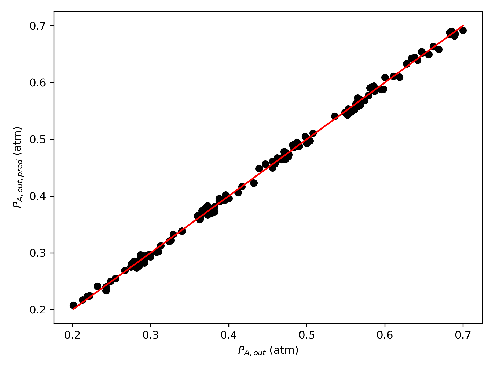{#fig-ch11_ex5_parity width="80%"}

::: {#fig-ch11_ex5_residuals layout-ncol=2}

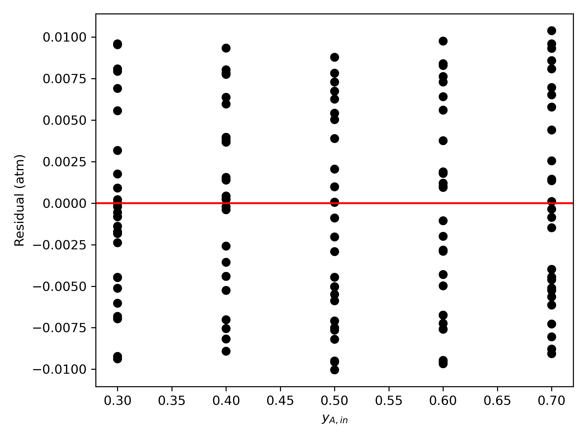

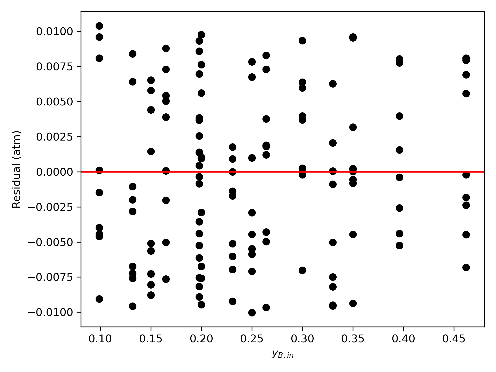

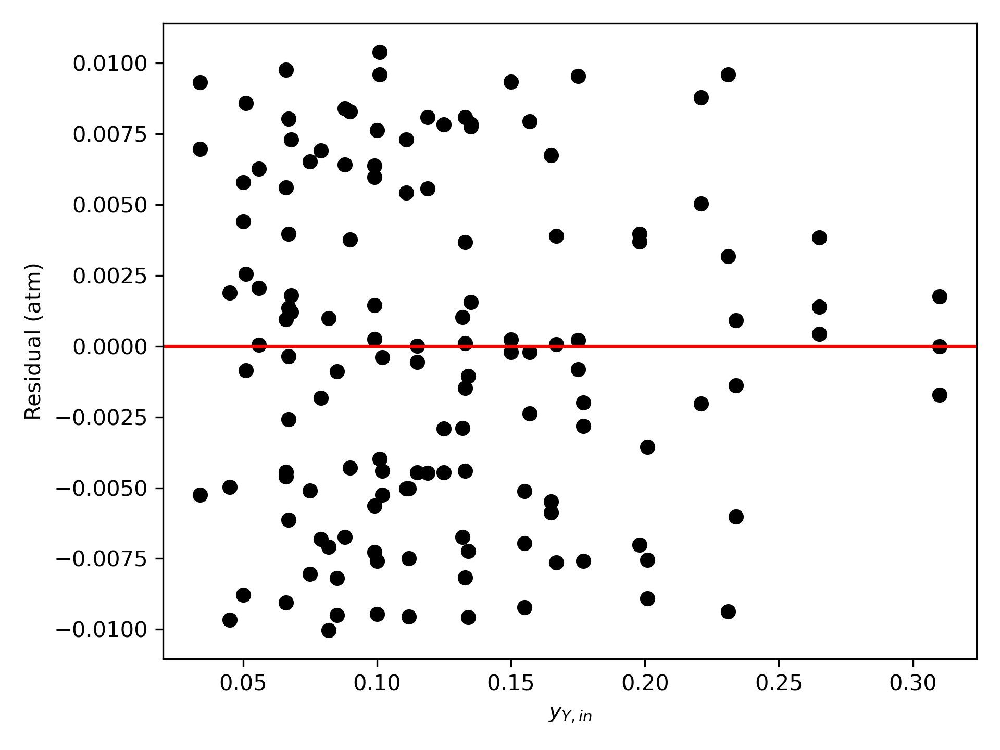

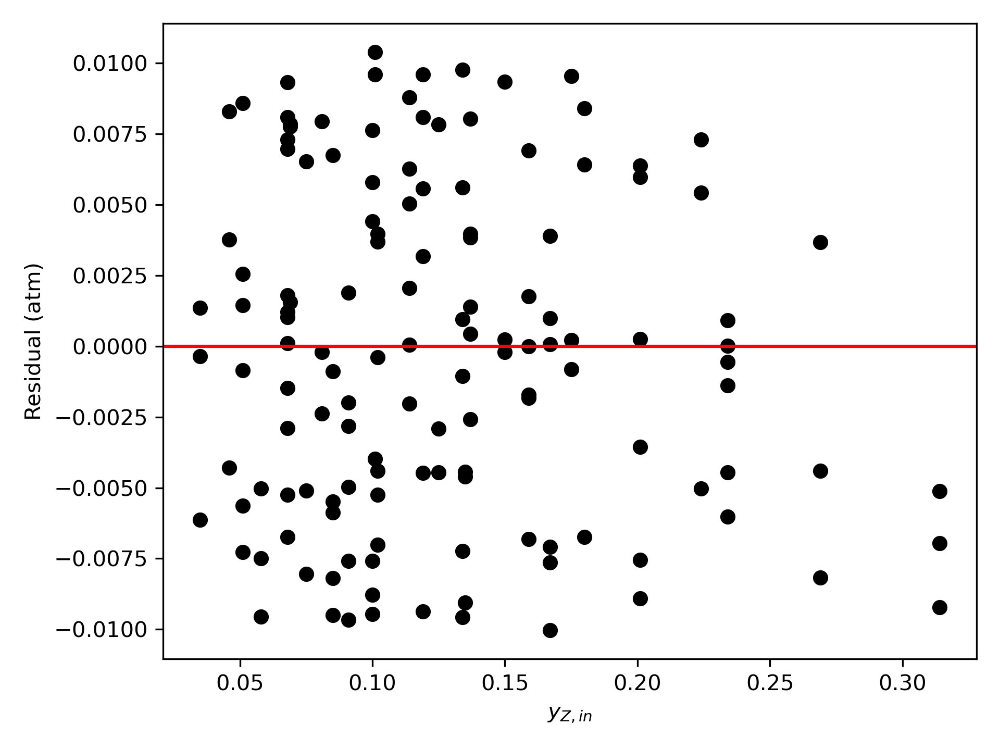

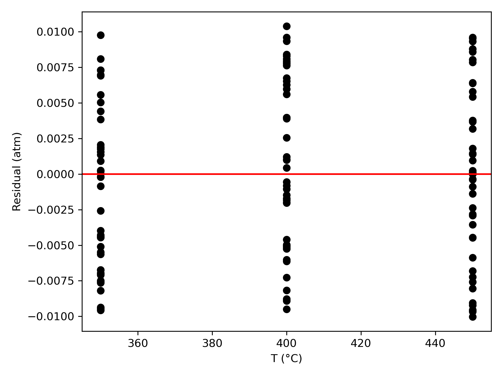

The residuals plots do not suggest any trends as the adjusted inputs were varied.
:::

It appears for this reaction that it is valid to assume that the power-law exponents are constants. The fit is good, and there aren’t any trends that suggest the exponents change with temperature. If this analysis had been performed using a linearized model, power-law exponents would have been estimated at each temperature. There undoubtedly would have been some variation with temperature. It then would have been necessary to decide how to represent that temperature variation. The exponents are not expected to exhibit Arrhenius temperature dependence. Most likely, given the present results, the variation would have been small, and the average value could be used in equation (2). By using a fitting function, all this was avoided and the best possible constant exponents were found based upon all of the data.

<center>**Assessment**</center>

The proposed rate expression is acceptably accurate when the parameters have the values shown in Table 2.

---

### Kinetics Data Analysis using Same-Temperature Data Blocks and an Approximate Reactor Model {#sec-ch11_ex6}

Kinetics data for liquid-phase reaction (1) were generated using an ideal, isothermal, 1 L BSTR. The reaction is irreversible, and preliminary analysis indicated that the rate is not affected by the concentration of the product, Z. The experimental design used the initial concentration of A and the temperature as factors. Twelve experiments were performed wherein the temperature and initial concentration of reagent A were set after which the concentration of reagent A was measured at six reaction times, giving a set of 72 experimental data points. The rate expression shown in equation (2) has been proposed for this reaction. The rate coefficient in equation (2) is expected to display Arrhenius temperature dependence. Compare the best values for the Arrhenius pre-exponential factor and activation energy determined using (a) a fitting function, (b) a linearized model, and (c) an approximate model. Then assess the accuracy of the proposed first order rate expression.

$$
A \rightarrow Z \tag{1}
$$

$$
r = k C_A \tag{2}
$$

Note that these data were generated using the experimental design from [Example -@sec-ch11_ex1]. The experimental data are provided in the file, [example_11_5_6_data.csv](solutions/ch11_ex6/example_11_5_6_data.csv). The first few data points from that file are shown in @tbl-ch11_ex6_data.

{#tbl-ch11_ex6_data width="40%"}

---

:::{.callout-tip collapse="true"}
## Click Here to See What an Expert Might be Thinking at this Point

The assignment narrative provides data from an isothermal BSTR and asks me to use the data to assess a first-order rate expression. The adjusted inputs were the temperature, initial reactant concentration and response measurement time. The measured response was the concentration of reagent A. I'll begin by summarizing the assignment. I'm going to include a few items in the deliverables that aren't specifically requested in the assignment narrative, but that are needed for assessing the accuracy of the final rate expression.

:::

<center>**Assignment Summary**</center>

[Reaction]{.underline} 

$$
A \rightarrow Z \tag{1}
$$

[Rate Expression]{.underline}

$$
r = k C_A \tag{2}
$$

[Reactor]{.underline}: Isothermal, liquid-phase BSTR

[Given Constant]{.underline}: $V$ = 1 L

[Given Adjusted Experimental Inputs]{.underline}: $\underline{T}$, $\underline{C}_{A,0}$, and $\underline{t}_{meas}$

[Given Experimental Responses]{.underline}: $\underline{C}_{A,f}$

[Parameters to Estimate]{.underline}: $k_0$ and $E$

[Deliverable]{.underline}: Parameter estimates, coefficients of determination, parity and residuals plots, and an assessment of the accuracy of the fitted model.

#### Solution Using a Fitting Function

:::{.callout-tip collapse="true"}
## Click Here to See What an Expert Might be Thinking at this Point

To complete this assignment I will generate a BSTR model function that solves the BSTR design equations numerically. Any quantities that are not given and are required to solving the design equations will be passed to it as arguments. It will return arrays containing the independent and dependent variables spanning the time from the start of an experiment to the time when the response was measured. Then I will write a deliverables function that uses the BSTR model function to calculate the deliverables.

The experimental BSTR operates isothermall at known, constant temperature and pressure. Consequently, the only design equations needed are mole balances. They are IVODEs, so numerical solution will require initial values, a stopping criterion and a derivatives function. The initial values are straightforward, and the stopping criterion is that the time equals the time when the response was measured.

The only arguments to the derivatives function, which I also must write, are the independent and dependent variables at the start of an integration step. It must calculate any additional unknowns present in the design equations, and then evaluate and return the design equation derivatives. If there are any additional unknowns that are not computable, they will need to be provided to the derivatives function using global variables.

The rate is the only additional unknown in the design equations, but using the proposed rate expression to calculate it introduces the rate coefficient and the concentration of A as additional unknowns. The Arrhenius expression and the definition of concentration can be used to compute them, but that introduces the pre-exponential factor and activation energy as additional unknowns. The Arrhenius parameters cannot be computed, so they will need to be made available to the derivatives function as global variables.

:::

<center>**BSTR Model Function**</center>

The purpose of the BSTR model function is to solve the BSTR reactor design equations for the reactor used in the experiments. This is done numerically by calling an IVODE solver. Any quantities that are not given and are required for solving the design equations will be passed to the BSTR function as arguments. If necessary, it will then make them available to the BSTR derivatives function as global variables. The BSTR derivatives function described here also must be written.

[BSTR Model Equations]{.underline}:

$$
\frac{dn_A}{dt} = -rV \tag{3}
$$

$$
\frac{dn_Z}{dt} = rV \tag{4}
$$

[BSTR Model Variables]{.underline}: $\underline{t}$, $\underline{n}_A$, and $\underline{n}_Z$

[Additional Computable Unknowns]{.underline}: $r$, $k$, and $C_A$

$$
k = k_0 \exp{ \left( \frac{-E}{RT}\right)} \tag{5}
$$

$$
C_A = \frac{n_A}{V} \tag{6}
$$

[Additional Uncomputable Unknowns]{.underline}: $T$, $k_0$, and $E$

[IVODE Solver Inputs]{.underline}:

1. Initial values of the reactor model variables.
$$
t=0 \tag{7}
$$
$$
n_{A,0} = C_{A,0}V \tag{8}
$$
$$
n_{Z,0} = 0 \tag{9}
$$
2. Stopping criterion.
$$
t = t_{meas} \tag{10}
$$
3. Derivatives function that
    a. receives the BSTR model variables at the start of an integration step as arguments
    b. has access to the current values of the additional uncomputable unknowns: $T$, $k_0$, and $E$.
    c. calculates the additional computable unknowns using equations (2), (5), and (6).
    d. evaluates and returns the BSTR design equation derivatives using equations (3) and (4).

:::{.callout-tip collapse="true"}
## Click Here to See What an Expert Might be Thinking at this Point

Now that I have a BSTR function that solves the design equations, I need to write a deliverables function that uses it to estimate the rate expression parameters and calculate the other deliverables. I'll use a numerical fitting function to that. I'll need to provide it with a guess for the parameters, the experimental data, and a predicted responses function.

To improve the likelihood of the fitting function converging, I'll actually estimate the base-10 log of the pre-exponential, $\beta$ instead of $k_0$ itself. Then I'll use an initial guess that $\beta$ is equal to 0.0 and that the activation energy is small.

I'll need to write the predicted responses function, and its arguments must be the adjusted experimental inputs and guesses for the parameters being estimated. All it needs to do is loop through the experiments and for each, call the BSTR model function to solve the design experiments and then calculate the predicted response.

Along with the coefficient of determination, the fitting function will return an estimate for the base-10 log of $k_0$ and its 95% confidence interval, so I'll need to calculate the values for the actual pre-exponential factor. Assuming the fitting function returns the predicted responses, I'll aslo need to calculate the experiment residuals for making residuals plots.

:::

<center>**Deliverables Function**</center>

The purpose of the deliverables function is to use the BSTR model function above to estimate the pre-exponential factor and activation energy for $k$, along with quantities that are needed for assessing the model’s accuracy. This is done numerically by calling a fitting function. To improve the likelihood of numerical convergence, the base-10 log of $k$ is estimated instead of $k$, itself. The predicted responses function described here also must be written.

[Deliverables Function]{.underline}

1. Define guesses for $\beta$ and $E$.
$$
\beta_{guess} = 0.0 \tag{11}
$$
$$
E_{guess} = 40 \text{ kJ mol}^{-1} \tag{12}
$$
2. Call a numerical fitting function.
    a. Arguments
        i. The experimental data: $\underline{T}$, $\underline{C}_{A,0}$, $\underline{t}_{meas}$, and $\underline{C}_{A,meas}$
        ii. Initial guesses for the parameters being estimated, equations (11) and (12)
        iii. A predicted responses function as described below
    b. Returned values
        i. Estimates and confidence intervals for $\beta$ and $E$
        ii. The coefficient of determination
        iii. The predicted responses: $\underline{C}_{A,pred}$
3. Calculate $k_0$ and its confidence interval
$$
k_0 = 10^\beta \tag{13}
$$
$$
k_{0,CI} = 10^\beta_{CI} \tag{14}
$$
4. Calculate the experiment residuals
$$
\underline{\epsilon}_{expt} = \underline{C}_{A,meas} - \underline{C}_{A,pred} \tag{15}
$$
5. Generate
    a. A parity plot showing $\underline{C}_{A,pred}$ *vs.* $\underline{C}_{A,meas}$
    b. Residuals plots showing $\underline{\epsilon}_{expt}$ *vs.* $\underline{T}$, $\underline{C}_{A,0}$, and $\underline{t}_{meas}$

[Predicted Responses Function]{.underline}

1. receives the adjusted experimental inputs and guesses for the parameters
2. calculates the pre-exponential factor using equation (13)
3. loops through all of the experiments
    a.calls the BSTR model function
    b. calculates the model-predicted response
$$
C_{A,pred} = \frac{\underline{n}_A \big|_{t=t_{meas}}}{V} \tag{16}
$$
4. returns the predicted responses for all of the experiments, $\underline{C}_{A,pred}$

<center>**Implementation of the Calculations**</center>

1. Import libraries if necessary
2. Make the given constants, adjusted experimental inputs, and measured responses available wherever they are needed as global constants.
3. Declare global variables for quantities that cannot be passed to the derivatives function as arguments.
4. Define the BSTR model, BSTR derivatives, predicted responses, and deliverables functions as described above.
5. Call the deliverables function.

<center>**Results and Discussion**</center>

The parameter estimation results are shown in @tbl-ch11_ex6_ff_results. The parity plot is presented in @fig-ch11_ex6_ff_parity, and @fig-ch11_ex6_ff_residuals shows the residuals plots. The range of the uncertainty in the pre-exponential factor is more than 4 times its value, but all other criteria suggest that the model is accurate. The range of the uncertainty in the activation energy is 12% of its value, the coefficient of determination is close to 1.0, the deviation of the data from the parity line in Figure 1 is relatively small, and there are no apparent trends in the deviations with respect to any of the experimentally adjusted inputs.

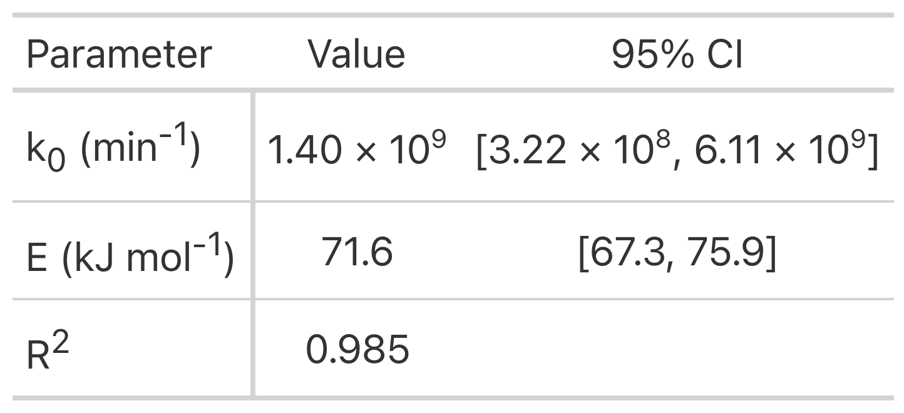{#tbl-ch11_ex6_ff_results width='40%'}

{#fig-ch11_ex6_ff_parity width="80%"}

::: {#fig-ch11_ex6_ff_residuals layout-ncol=3}

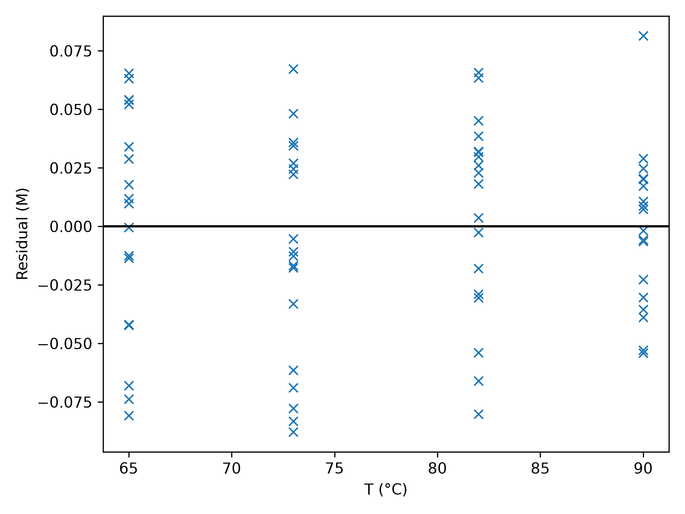

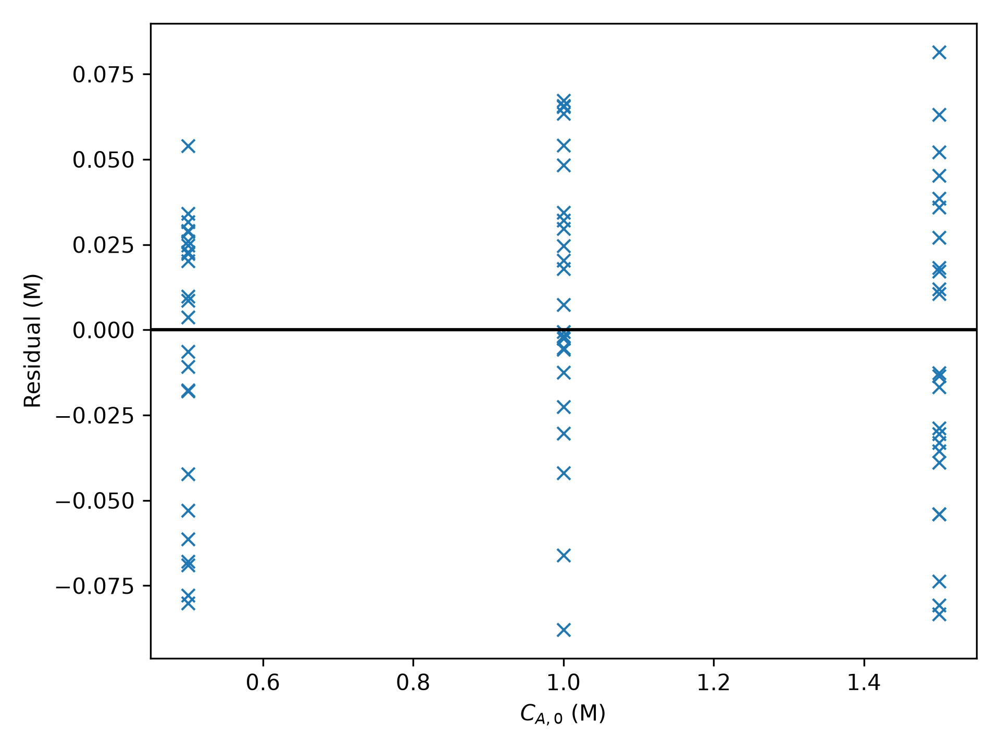

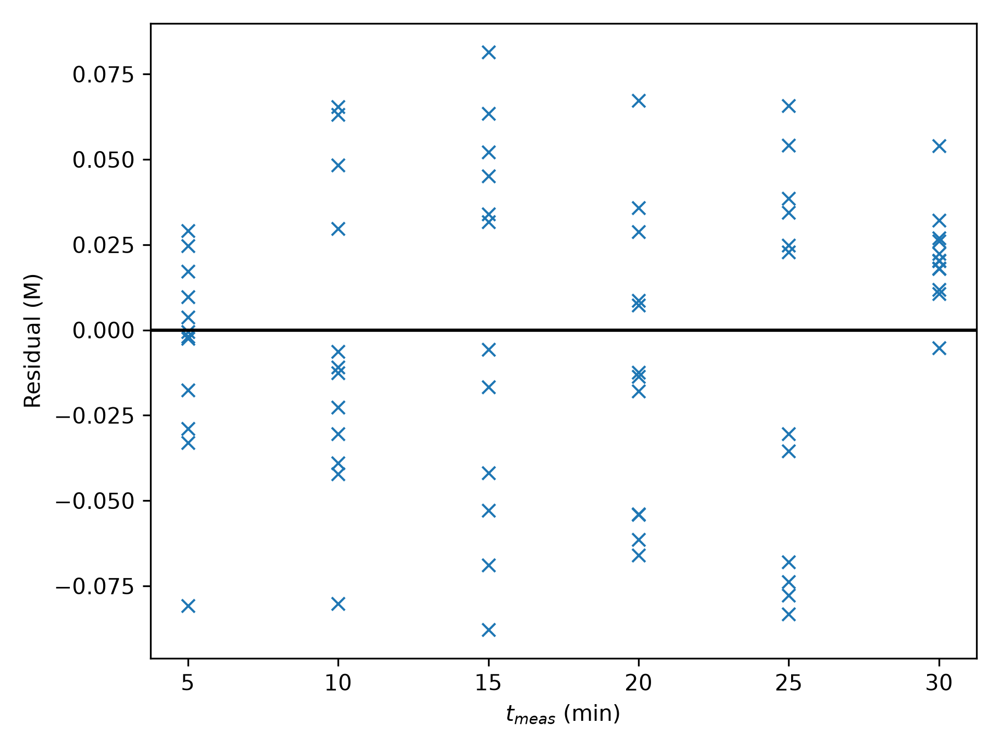

Residuals plots for a) temperature, b) initial concentration of A, and c) measurement time.

:::

<center>**Accuracy Assessment**</center>

When used with the pre-exponential factor and activation energy shown in @tbl-ch11_ex6_ff_results, the reactor model, and by extension, the proposed rate expression, is reasonably accurate.

#### Solution Using a Linearized Model

:::{.callout-tip collapse="true"}
## Click Here to See What an Expert Might be Thinking at this Point

To use a linearized model, I need to choose just one mole balance, solve it analytically to convert it from an ODE to an algebraic equation, and linearize that equation. Then I can split the data into same temperature blocks and analyze each block separately. To do so I need to calculate $x$ and $y$, fit $y=mx$ to those data, and calculate $k$ from the slope, $m$. I then must fit the Arrhenius expression to the $T$ - $k$ data from the same temperature blocks to get the pre-exponential factor and activation energy. To complete the analysis I must use the pre-exponential factor and activation energy to calculate predicted responses for the entire data set and then calculate the experiment residuals and the coefficient of determination.

:::

<center>**Linearized BSTR Model**</center>

The reason for linearizing the BSTR model function is to allow parameter estimation using linear least squares. The design equations, which are IVODEs, must first be solved analytically, which results in an algebraic model equation. The algebraic model equation is rearranged and new variables are defined to convert it to a linear form. Generally, the data are then separated into same-temperature blocks, and the linear model is fit to the data in each block. This yields rate coefficient estimates for each data block temperature. To complete the analysis, the Arrhenius expression is fit to those data.

[Linearized BSTR Model Equation]{.underline}:

$$
\frac{dn_A}{dt} = -rV = -kC_AV = -k\left(\frac{n_A}{V}\right)V = -kn_A
$$

$$
\int_{C_{A,0}V}^{C_{A_meas}V}{\frac{dn_A}{n_A}} = -k\int_0^{t_meas}{dt} 
$$

$$
\ln{\frac{C_{A,meas}V}{C_{A,0}V}} = \ln{\frac{C_{A,meas}}{C_{A,0}}} = -kt_{meas} \quad \Rightarrow \quad y=mx
$$

$$
y = \ln{\frac{C_{A,meas}}{C_{A,0}}} \tag{17}
$$

$$
x=-t_{meas} \tag{18}
$$

$$
m=k \tag{19}
$$

<center>**Deliverables Function**</center>

The purpose of the deliverables function is to use the linearized BSTR model above to estimate the pre-exponential factor and activation energy for , along with quantities that are needed for assessing the model’s accuracy. 

[Deliverables Function]{.underline}

1. Group the experimental data to form same-temperature data blocks
2. For each data block
    a. calculate $x$ and $y$, equations (17) and (18)
    b. call a linear least squares fitting function to fit $y=mx$ to the $x-y$ data
        i. it will return the slope and its uncertainty, the coefficient of determination for that data block, and model-predicted $y$ values
    c. calculate $k$ and its confidence interval, equations (19) and (20)
$$
k_{CI} = m_{CI} \tag{20}
$$
3. Call a linear least squares fitting function to fit the Arrhenius expression to the  data from step 2 (see Example 3.6.3 in *REB, The Book*)
    a. it will return estimates and confidence intervals for $k_0$ and $E$, the coefficient of determination for the Arrhenius expression, and model-predicted $k$ values
4. Generate an Arrhenius plot
5. Calculate the experiment residuals and overall coefficient of determination using the full data set
$$\ln{\frac{C_{A}}{C_{A,0}}} = -kt \quad \Rightarrow \quad C_A = C_{A,0} \exp{\left(-kt\right)}
$$
$$
\underline{C}_{A,pred} = \underline{C}_{A,0} \exp{\left(-k_0 \exp{\left(\frac{-E}{R\underline{T}}\right)}\underline{t}_{meas}\right)} \tag{21}
$$
$$
\underline{\epsilon}_{expt} = \underline{C}_{A,meas} - \underline{C}_{A,pred} \tag{22}
$$
$$
C_{A,mean} = \frac{\sum_iC_{A,meas,i}}{n_{expts}} \tag{23}
$$
$$
ss_{resid} = \sum_i \left(C_{A,meas,i} - C_{A,pred,i}\right)^2 \tag{24}
$$
$$
ss_{total} = \sum_i \left(C_{A,meas,i} - C_{A,mean}\right)^2 \tag{25}
$$
$$
R^2 = 1 - \frac{ss_{resid}}{ss_{total}} \tag{26}
$$
6. Generate
    a. A parity plot showing $\underline{C}_{A,pred}$ *vs.* $\underline{C}_{A,meas}$
    b. Residuals plots showing $\underline{\epsilon}_{expt}$ *vs.* $\underline{T}$, $\underline{C}_{A,0}$, and $\underline{t}_{meas}$

<center>**Implementation of the Calculations**</center>

1. Import necessary libraries.
2. Make the given constants, adjusted experimental inputs, and measured responses available wherever they are needed.
3. Define the deliverables function as described above.
4. Call the deliverables function.

<center>**Results and Discussion**</center>

The linearized model was fit to the  data for each of the same-temperature blocks. @fig-ch11_ex6_lm_model_plots presents the resulting model plots, and @tbl-ch11_ex6_lm_model_plot_results shows the parameter estimates, their confidence intervals and the coefficients of determination. For all four temperatures, the upper and lower limits of the 95% confidence intervals for the rate coefficient are close to the estimated value, and the coefficients of determination are close to 1.0. The deviations of the data points from the model lines are relatively small, and there does not appear to be any trends in those deviations.

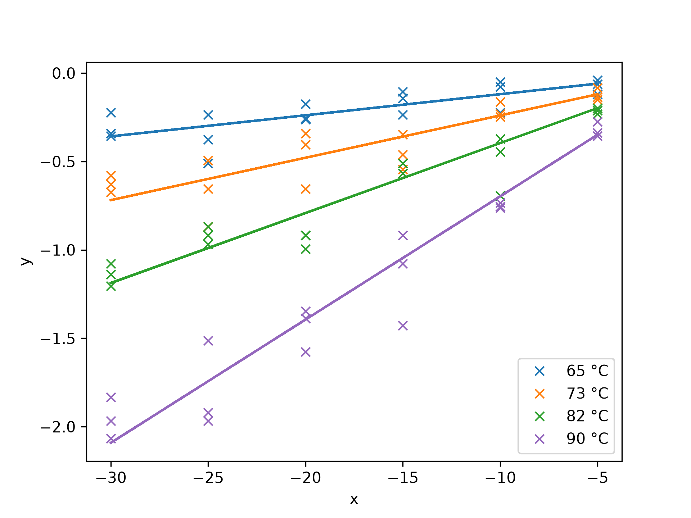{#fig-ch11_ex6_lm_model_plots width="80%"}

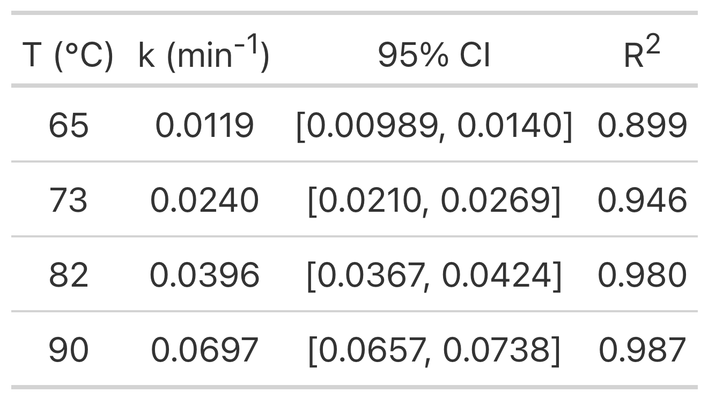{#tbl-ch11_ex6_lm_model_plot_results width="40%"}

The Arrhenius expression was fit to the $T-k$ data in @tbl-ch11_ex6_lm_model_plot_results. The Arrhenius plot is shown in @fig-ch11_ex6_lm_Arrhenius_plot, and the fitting results are listed in @tbl-ch11_ex6_lm_Arrhenius_results. The 95% confidence intervals for both the pre-exponential factor and the activation energy are large compared to the estimated values, but the coefficient of determination from the Arrhenius plot is close to 1.0, and the plot itself evidences an accurate fit.

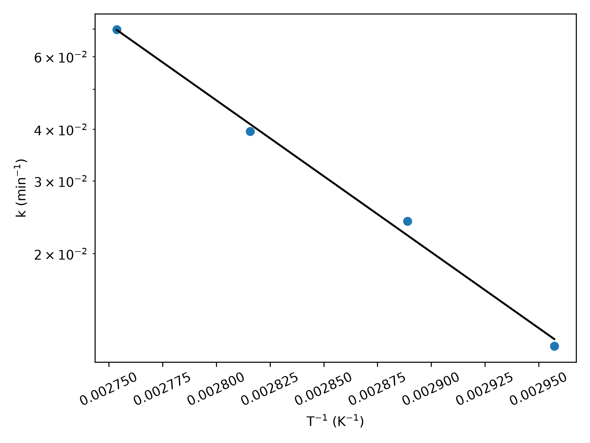{#fig-ch11_ex6_lm_Arrhenius_plot width="80%"}

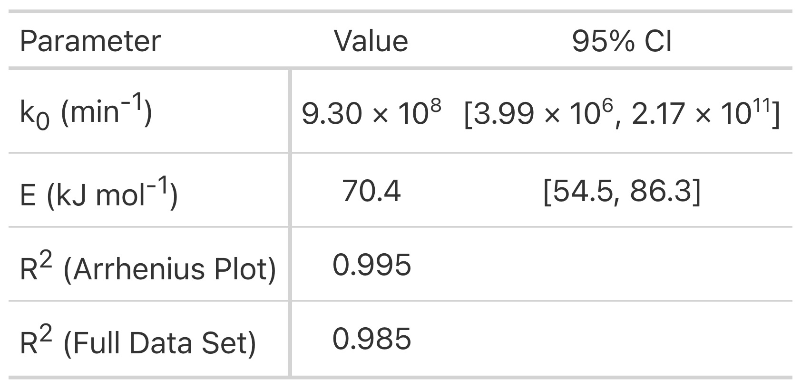{#tbl-ch11_ex6_lm_Arrhenius_results width="40%"}

Overall within the range of the inputs that was studied, the rate expression provides an adequate representation of the experimental results when the pre-exponential factor and activation energy reported in @tbl-ch11_ex6_lm_Arrhenius_results are used. @tbl-ch11_ex6_lm_Arrhenius_results additionally reports the coefficient of determination for the complete data set. It, too, is quite close to 1.0

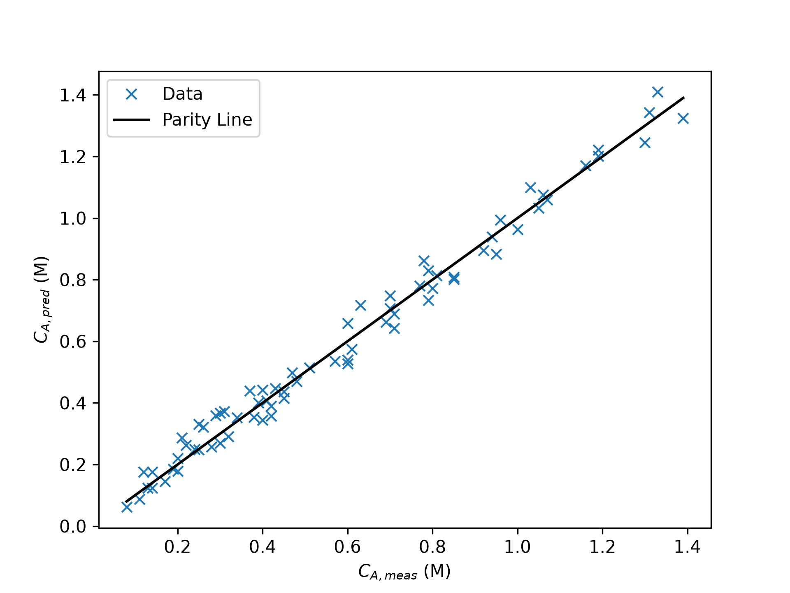{#fig-ch11_ex6_lm_parity_plot width="80%"}

::: {#fig-ch11_ex6_lm_residuals layout-ncol=3}

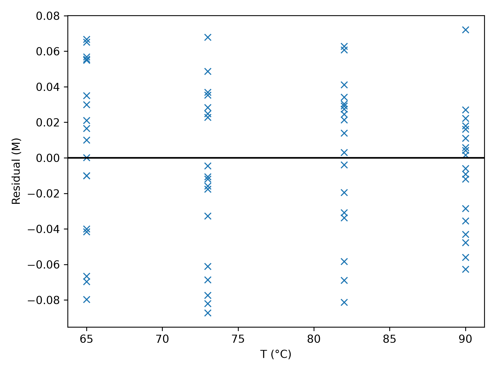

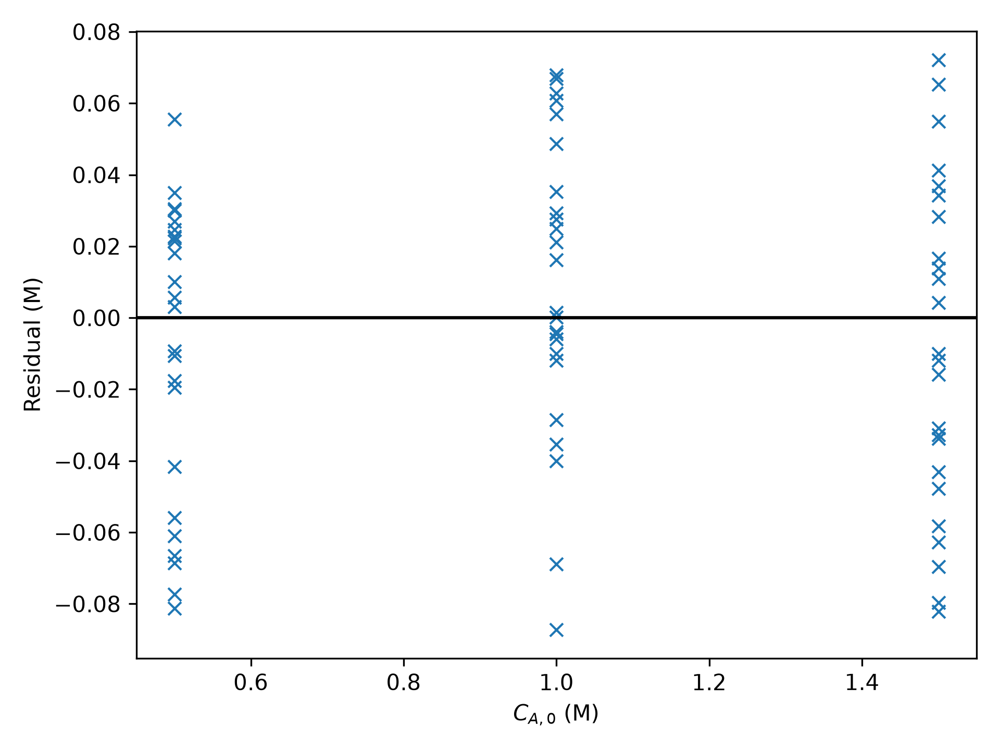

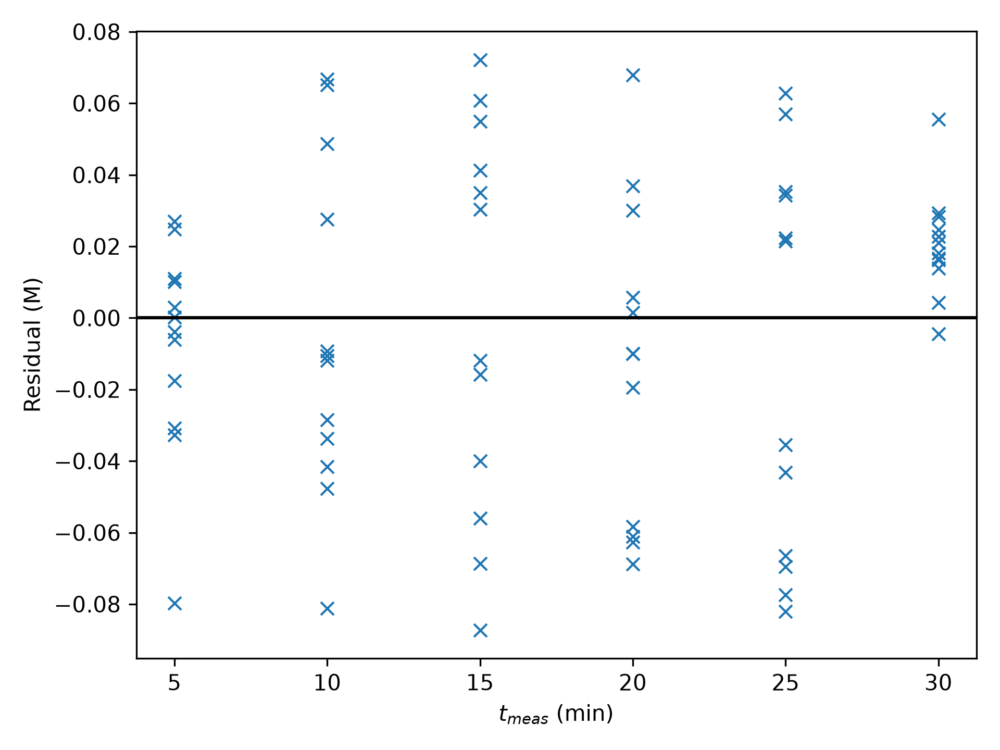

Residuals plots for a) temperature, b) initial concentration of A, and c) measurement time.

:::

<center>**Accuracy Assessment**</center>

When used with the pre-exponential factor and activation energy shown in @tbl-ch11_ex6_lm_Arrhenius_results, the rate expression in equation (2) is acceptably accurate.

#### Solution Using an Approximate Model

:::{.callout-tip collapse="true"}
## Click Here to See What an Expert Might be Thinking at this Point

The procedure for using an approximate model is almost the same as the prodecure for a linear model. It skips the step of solving the ODE design to get an algebraic equation. Instead the derivative is approximated using finite differences to get an algebraic equation. After that, the rest of the processing is the same as for a linear model.

I'm going to use backwards differences to approximate the derivative. The data for each experiment are used. Here there are six experimental data points in each experiment. Basically, the derivative is approximated as the change in the molar amount of A since the previous data point divided by the change in the time since the last data point. The only slight problem is that for the first data point, there isn't one before it. However, for that one the change since the start of the experiment can be used. In this way, the derivative can be approximated for every data point in the experiment.

:::

<center>**Approximate BSTR Model**</center>

The reason for approximating the derivative in the BSTR model function is to eliminate the need to solve the design equations analytically. The approximate BSTR model is an algebraic equations and allows parameter estimation using linear least squares. That approximate, algebraic model equation is rearranged and new variables are defined to convert it to a linear form. Generally, the data are then separated into same-temperature blocks, and the linear approximate model is fit to the data in each block. This yields rate coefficient estimates for each data block temperature. To complete the analysis, the Arrhenius expression is fit to those data.

[Linearized Approximate BSTR Model Equation]{.underline}:

$$
\frac{dn_A}{dt} \approxeq \frac{\Delta n_A}{\Delta t} \approxeq \frac{n_A\big \vert_{t=t_i} - n_A \big \vert_{t=t_{i-1}}}{t_i - t_{i-1}} = -kC_{A,f}\big |_{t=t_i}V
$$

$$
\frac{C_A\big \vert_{t=t_i} - C_A \big \vert_{t=t_{i-1}}}{t_i - t_{i-1}} = -kC_{A,f}\big |_{t=t_i} \quad \Rightarrow \quad y=mx
$$

$$
y_i = \frac{ C_A\big \vert_{t=t_i} - C_A \big \vert_{t=t_{i-1}}}{t_i - t_{i-1}} \tag{27}
$$

$$
x_i = -C_{A,f}\big |_{t=t_i} \tag{28}
$$

$$
m=k \tag{29}
$$

<center>**Deliverables Function**</center>

The purpose of the deliverables function is to use the linearized approximate BSTR model above to estimate the pre-exponential factor and activation energy for $k$, along with quantities that are needed for assessing the model’s accuracy.

[Deliverables Function]{.underline}

1. Group the experimental data to form same-temperature data blocks
2. For each data block
    a. calculate $x$ and $y$, equations (27) and (28)
    b. call a linear least squares fitting function to fit $y=mx$ to the $x-y$ data
        i. it will return the slope and its uncertainty, the coefficient of determination for that data block, and model-predicted $y$ values
    c. calculate $k$ and its confidence interval, equations (19) and (20)
3. Call a linear least squares fitting function to fit the Arrhenius expression to the  data from step 2 (see Example 3.6.3 in *REB, The Book*)
    a. it will return estimates and confidence intervals for $k_0$ and $E$, the coefficient of determination for the Arrhenius expression, and model-predicted $k$ values
4. Generate an Arrhenius plot
5. Calculate the experiment residuals and overall coefficient of determination using the full data set
$$\ln{\frac{C_{A}}{C_{A,0}}} = -kt \quad \Rightarrow \quad C_A = C_{A,0} \exp{\left(-kt\right)}
$$
$$
\underline{C}_{A,pred} = \underline{C}_{A,0} \exp{\left(-k_0 \exp{\left(\frac{-E}{R\underline{T}}\right)}\underline{t}_{meas}\right)}
$$
$$
\underline{\epsilon}_{expt} = \underline{C}_{A,meas} - \underline{C}_{A,pred}
$$
$$
C_{A,mean} = \frac{\sum_iC_{A,meas,i}}{n_{expts}}
$$
$$
ss_{resid} = \sum_i \left(C_{A,meas,i} - C_{A,pred,i}\right)^2
$$
$$
ss_{total} = \sum_i \left(C_{A,meas,i} - C_{A,mean}\right)^2
$$
$$
R^2 = 1 - \frac{ss_{resid}}{ss_{total}}
$$
6. Generate
    a. A parity plot showing $\underline{C}_{A,pred}$ *vs.* $\underline{C}_{A,meas}$
    b. Residuals plots showing $\underline{\epsilon}_{expt}$ *vs.* $\underline{T}$, $\underline{C}_{A,0}$, and $\underline{t}_{meas}$


<center>**Implementation of the Calculations**</center>

1. Import necessary libraries.
2. Make the given constants, adjusted experimental inputs, and measured responses available wherever they are needed.
3. Define the deliverables function as described above.
4. Call the deliverables function.

<center>**Results and Discussion**</center>

The linearized approximate model was fit to the $x-y$ data for each of the same-temperature blocks. @fig-ch11_ex6_am_model_plots presents the resulting model plots, and @tbl-ch11_ex6_am_model_results shows the parameter estimates, their confidence intervals and the coefficients of determination. By all measures, the fit is not good. The data scatter widely about the model lines, the coefficients of determination are all less than 0.9. However, the 95% confidence intervals are relatively narrow.

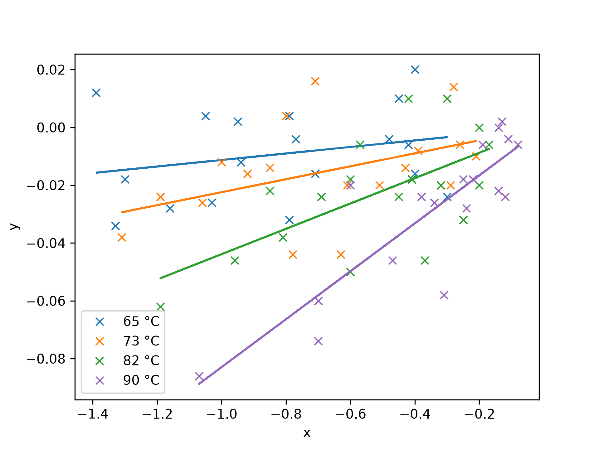{#fig-ch11_ex6_am_model_plots width="80%"}

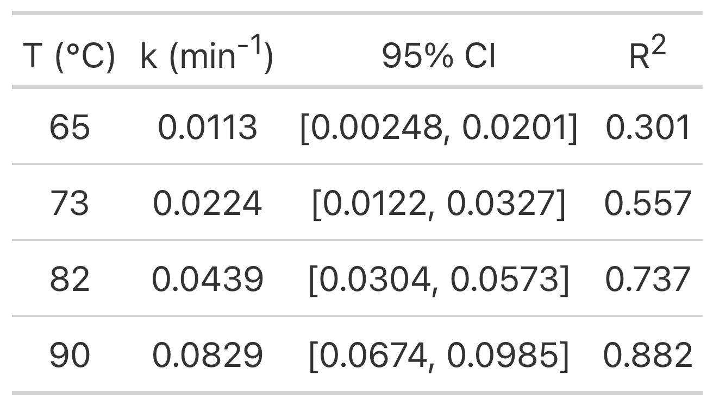{#tbl-ch11_ex6_am_model_results width='40%'}

Given the poor quality of the model plot fits, it is quite surprising that the Arrhenius plot, @fig-ch11_ex6_am_Arr_plot of the model plot $T$ vs. $k$ data is very good. There is effectively no scatter and the coefficients of determination, shown in @tbl-ch11_ex6_am_Arr_res, is equal to 1.0.

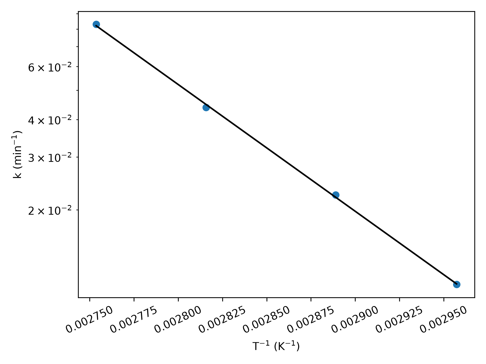{#fig-ch11_ex6_am_Arr_plot width="80%"}

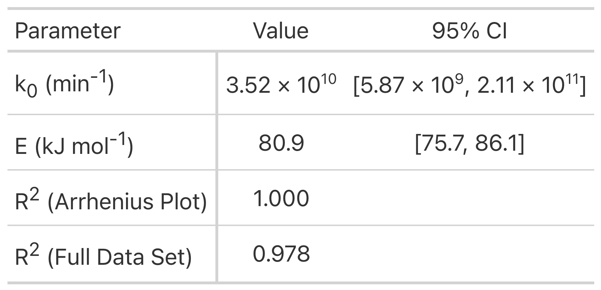{#tbl-ch11_ex6_am_Arr_res width='40%'}

The parity plot based upon the complete data set, shown in @fig-ch11_ex6_parity_plot, also shows modest deviations of the data from the parity line, and there aren’t any apparent trends in the scatter in the residuals plots in @fig-ch11_ex6_am_residuals. Overall the rate expression is accurate and captures the effects of the three input that were varied in the experiments.

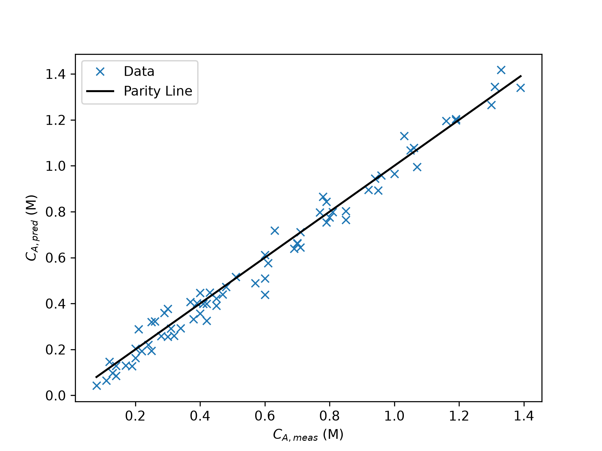{#fig-ch11_ex6_parity_plot width="80%"}

::: {#fig-ch11_ex6_am_residuals layout-ncol=3}

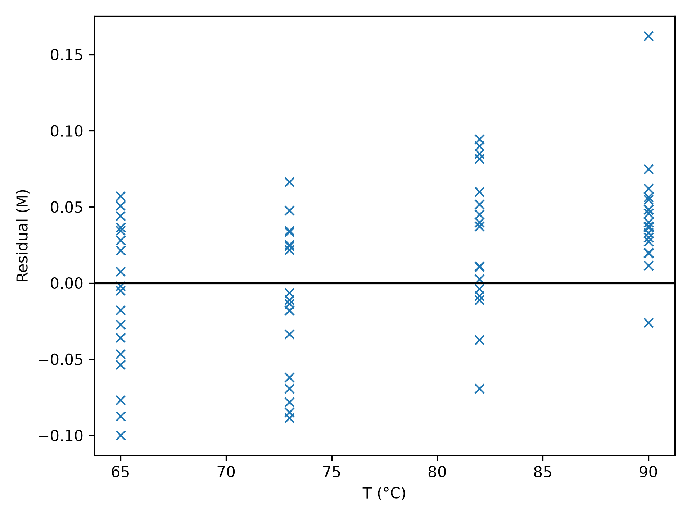

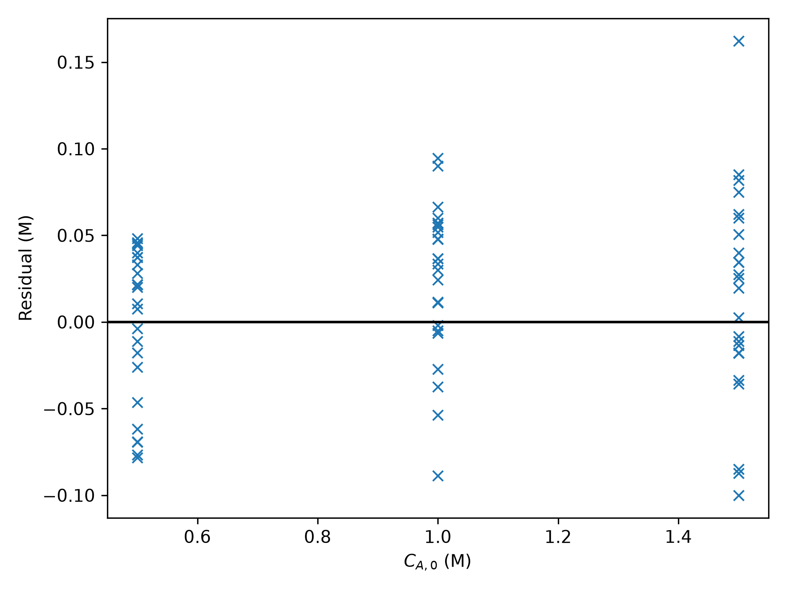

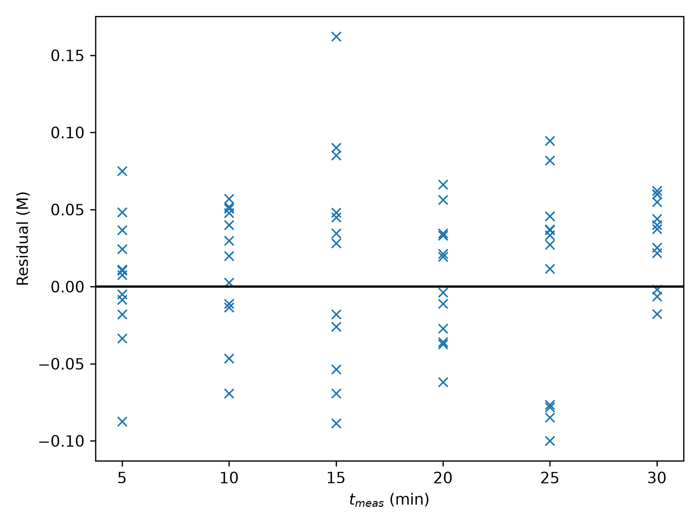

Residuals plots for a) temperature, b) initial concentration of A, and c) measurement time.

:::

<center>**Accuracy Assessment**</center>

When used with the pre-exponential factor and activation energy shown in @tbl-ch11_ex6_am_Arr_res, the rate expression in equation (2) is acceptably accurate.

#### Comparison of Results

The analyses using each of the three parameter estimation models are presented separately. Here the results from the three methods are compared. The parameter estimation results for all three methods are shown in @tbl-ch11_ex6_summary. The linear model and approximate model methods do not yield 95% confidence intervals that are based upon the full data set, so no values are listed. The coefficients of determination listed for those methods are based upon the full data set. @fig-ch11_ex6_combined_parity shows the parity plots for all three methods and Figure 2 presents the residuals plots.

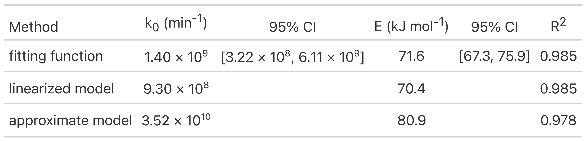{#tbl-ch11_ex6_summary width="50%"}

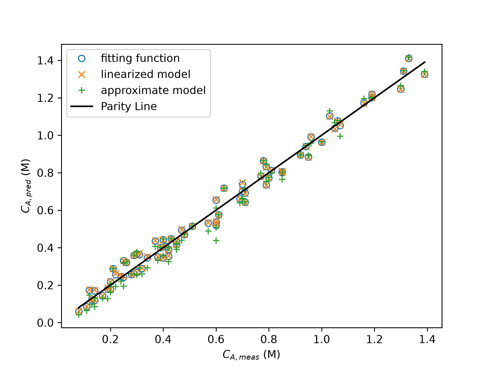{#fig-ch11_ex6_combined_parity width="80%"}

::: {#fig-ch11_ex6_combined_residuals layout-ncol=3}

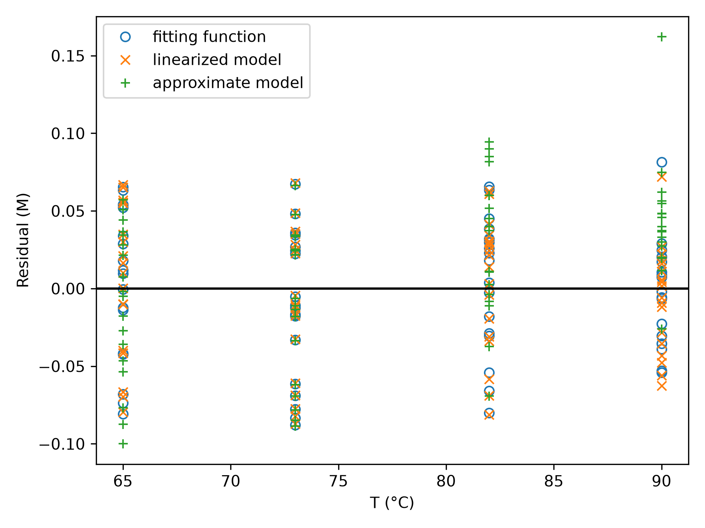

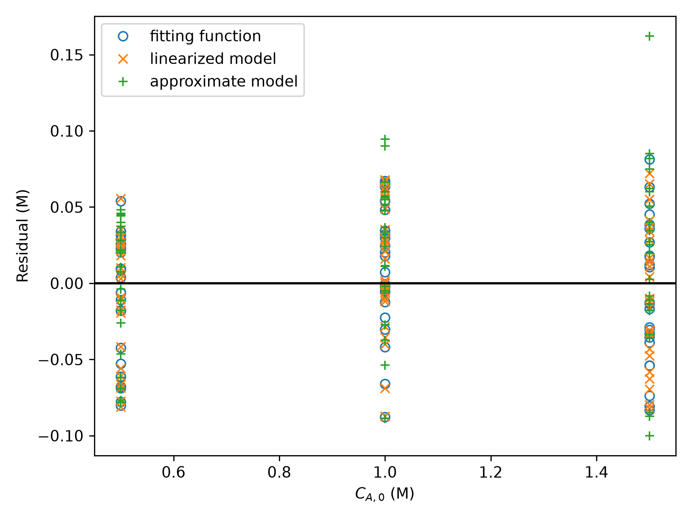

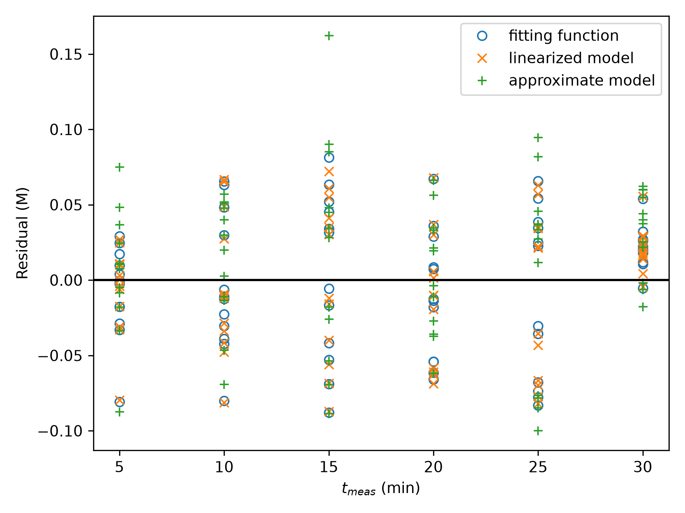

Residuals plots for a) temperature, b) initial concentration of A, and c) measurement time for all three analyses.

:::

It is apparent from the parity plots and coefficients of determination that all three methods yielded accurate models. The residuals plots similarly show comparable deviations. There are no obvious trends in the residuals plots deviations which indicates that the models capture the effects of the three adjusted inputs well.

So, the final rate expressions appear to be comparably accurate. This is surprising for the approximate model method when the results are examined more closely. In the linear and approximate model approaches, the data are split into same-temperature blocks and each block is analyzed separately. @fig-ch11_ex6_model_plot_comparision presents the model plots for each temperature block for the two approaches. Very clearly, the approximate model yields much noisier $x-y$ data. The slopes of the model plots yield the rate coefficient estimates for each temperature shown in @tbl-ch11_ex6_model_plot_param_comparison. The coefficients of determination support the visual observation that the data are much noisier in the model plots for the approximate model approach.

::: {#fig-ch11_ex6_model_plot_comparision layout-ncol="1"}


Model plots for a) the linear model and b) the approximate model.

:::

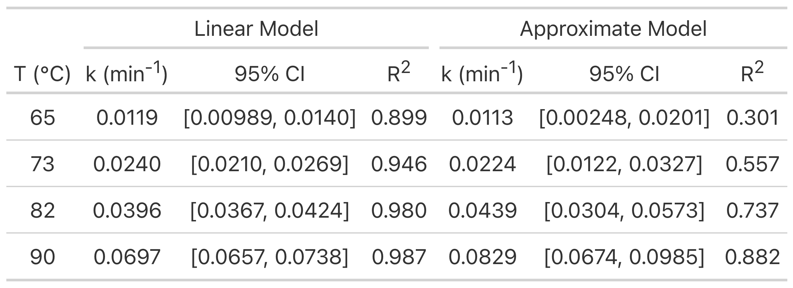{#tbl-ch11_ex6_model_plot_param_comparison width="60%"}

What is surprising in light of the noisy approximate model plots is that two of the four approximate model rate coefficients fall within the 95% confidence interval for the linear model rate coefficients, and the other two fall just outside of the linear model rate coefficient confidence intervals. Apparently much of the noise in the approximate model plots averages out leading to rate coefficients that are quite similar.

The Arrhenius expression is then fit to the  data in @tbl-ch11_ex6_model_plot_param_comparison to estimate the pre-exponential factors and activation energies. The results are included in @tbl-ch11_ex6_summary. Since the uncertainties are based on the  which, in turn, are estimated using the data from only one of the same-temperature blocks. For that reason, the uncertainties are not included in @tbl-ch11_ex6_summary.

The Arrhenius plots for the two approaches are shown in @fig-ch11_ex6_Arr_plot_comp. Despite the greater scatter in the model plots for the approximate model, the scatter in the Arrhenius plots is comparable and quite minimal. As shown in @tbl-ch11_ex6_model_plot_params_comp, the coefficients of determination are essentially equal to 1. While the models provide comparable accuracy, the pre-exponential factors and activation energies are quite different.

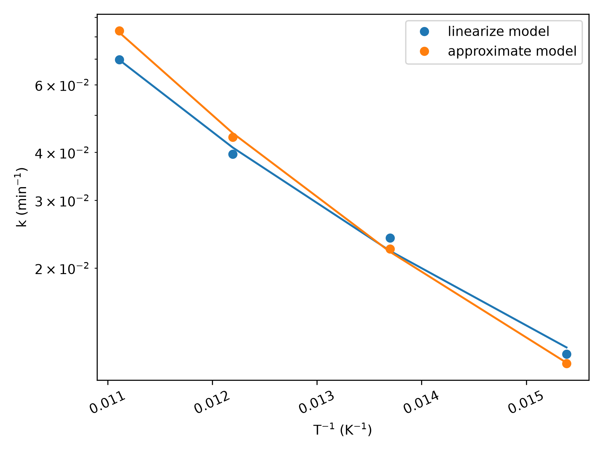{#fig-ch11_ex6_Arr_plot_comp width="80%"}

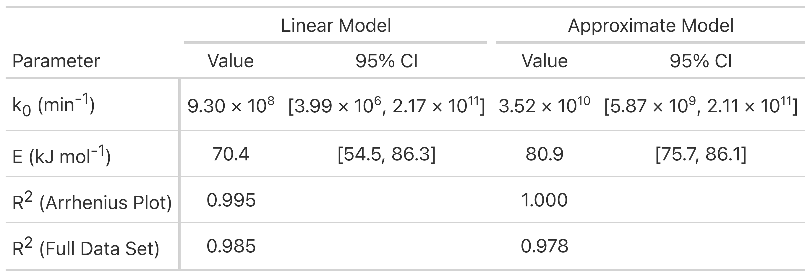{#tbl-ch11_ex6_model_plot_params_comp width="60%"}

As noted already, in the range of composition and temperature that was studied, all three rate expressions are acceptably accurate. Nonetheless, the Arrhenius parameters found using a fitting function are preferred because all of the data are used to estimate each of them. The linearized model gave similar Arrhenius parameters and could be used. The Arrhenius parameters from the approximate model differ, and are the least preferred because of the large amount of scatter in the model plots.

---

## Symbols Used in @sec-ch11

| Symbol | Meaning |
|:-------|:--------|
| $f$ | Analytic function obtained upon solution of an ODE. |
| $f\left(\right)$ | A mathematical function of the variables within the parentheses. |
| $f_i$ | Fractional conversion of reagent $i$. |
| $i$ | index denoting a reagent. |
| $k$ | Rate coefficient, an additional index is used to denote the reaction if more than one reaction is taking place. |
| $k_0$ | Pre-exponential factor in the Arrhenius expression. |
| $m$ | Mass of catalyst. |
| $m_i$ | Slope in the $i$ direction of a linear response model. |
| $n_i$ | Molar amount of reagent $i$; an additional subscript denotes the time. |
| $\dot{n}_i$ | Molar flow rate of reagent $i$; an additional subscripted "in" denotes the flow into the reactor and "out" denotes flow from the reactor. |
| $r$ | Net rate of reaction per unit fluid volume. |
| $r_i$ | Rate of generation of reagent $i$ per unit volume. |
| $r_p$ | Catalyst particle radius. |
| $t$ | Time; an additional subscripted $f$ denotes the time at which the response was measured. |
| $t_{1/2}$ | Reaction half-life. |
| $v$ | Fluid velocity. |
| $x$ | Independent variable in a linear model. |
| $x_i$ | Independent variable in a linear response function. |
| $y$ | Dependent variable in a linear model. |
| $y_i$ | Mole fraction of reagent $i$. |
| $z$ | Axial distance from the reactor inlet. |
| $C_i$ | Concentration of reagent $i$; an additional subscript denotes the time or location. |
| $CI$ | Subscript denoting a 95% confidence interval, an additional "u" or "l" denotes the upper or lower limit of the interval. |
| $D$ | Reactor diameter. |
| $D_{\text{eff}}$ | Effective diffusion coefficient. |
| $E$ | Activation energy, an additional subscript denotes the reaction or direction of the reaction. |
| $K$ | Equilibrium constant, additional subscripts differential between multiple equilibrium constants appearing in the same rate expression. |
| $K_m$ | Parameter in the Michaelis-Menten rate expression. |
| $L | Reactor length |
| $N_{Re}$ | Reynolds number. |
| $P$ | Pressure. |
| $P_i$ | Partial pressure of reagent $i$. |
| $R$ | Ideal gas constant. |
| $R^2$ | Coefficient of determination. |
| $T$ | Temperature. |
| $V$ | Volume. |
| $V_{max}$ | Parameter in the Michaelis-Menten rate expression. |
| $\dot{V}$ | Volumetric flow rate. |
| $\hat{V}_{STP}$ | Molar volume of an ideal gas at standard temperature and pressure. |
| $\alpha_i$ | Reaction order for reagent $i$. | 
| $\epsilon$ | Residual, a subscripted "expt" denotes an experiment residual and a subscripted index denotes an ATE residual. |
| $\mu$ | Fluid viscosity. |
| $\nu_i$ | Stoichiometric coefficient of reagent $i$. |
| $\dot{\xi}$ | Apparent extent of reaction. |
| $\rho$ | Fluid density. |
| $\rho_{\text{bed}}$ | Apparent catalyst bed density. |
| $\phi_s$ | Internal concentration gradient metric. |
| $\tau$ | Space time. || $b$ | $y$-intercept of a linearized response model. |
| $\Delta n_i$ | Change in $n_i$. |
| $\Delta t$ | Change in $t$. |

: {tbl-colwidths="[20,80]"}


