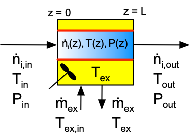
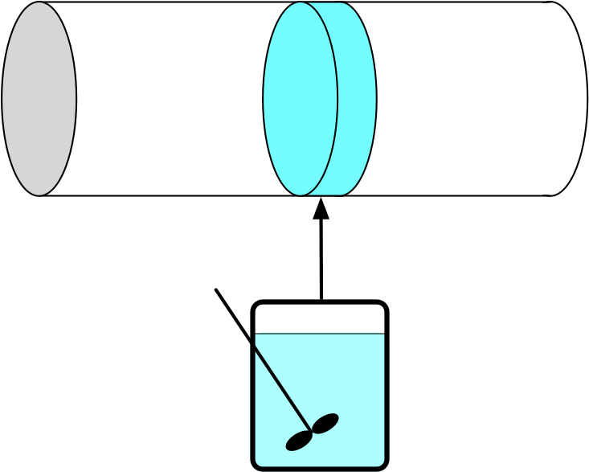
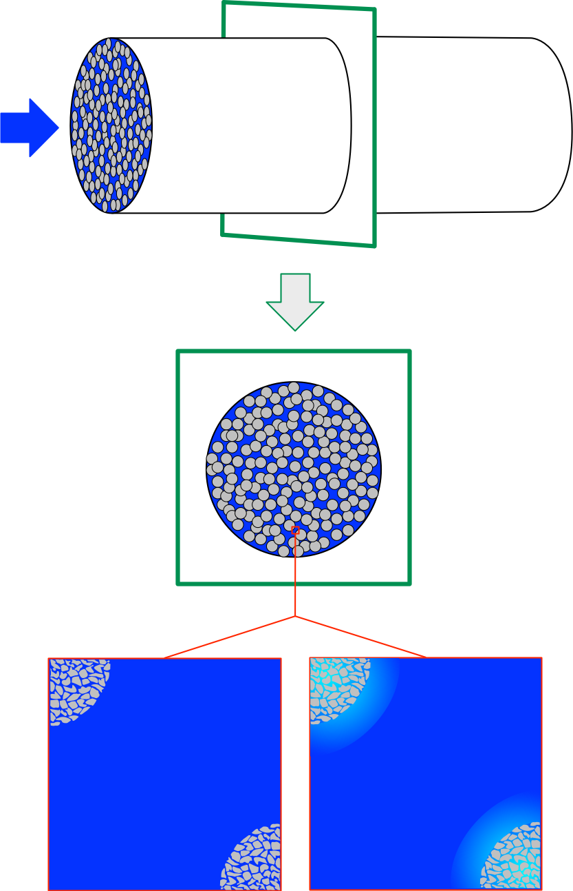
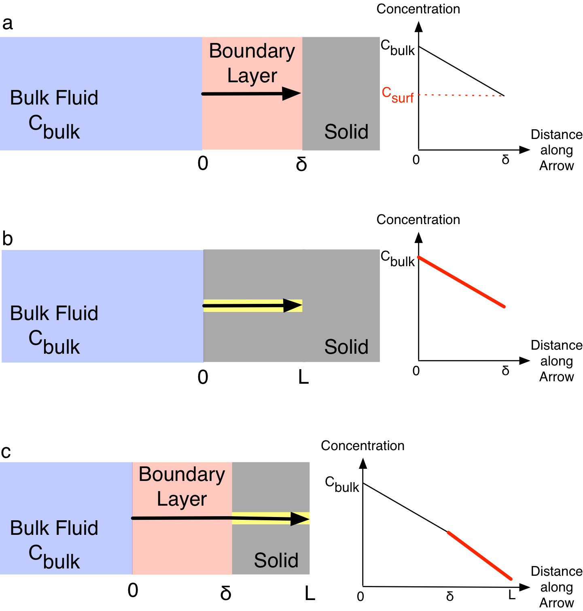
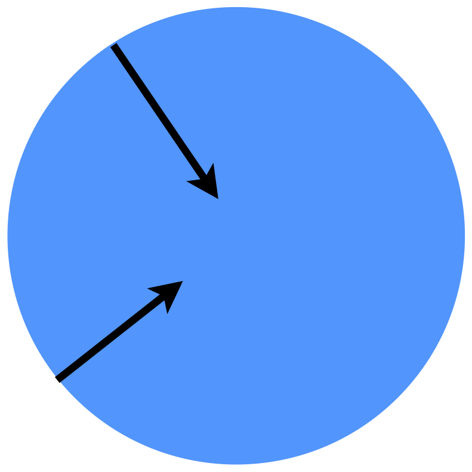
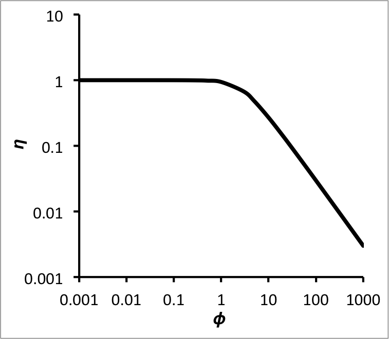
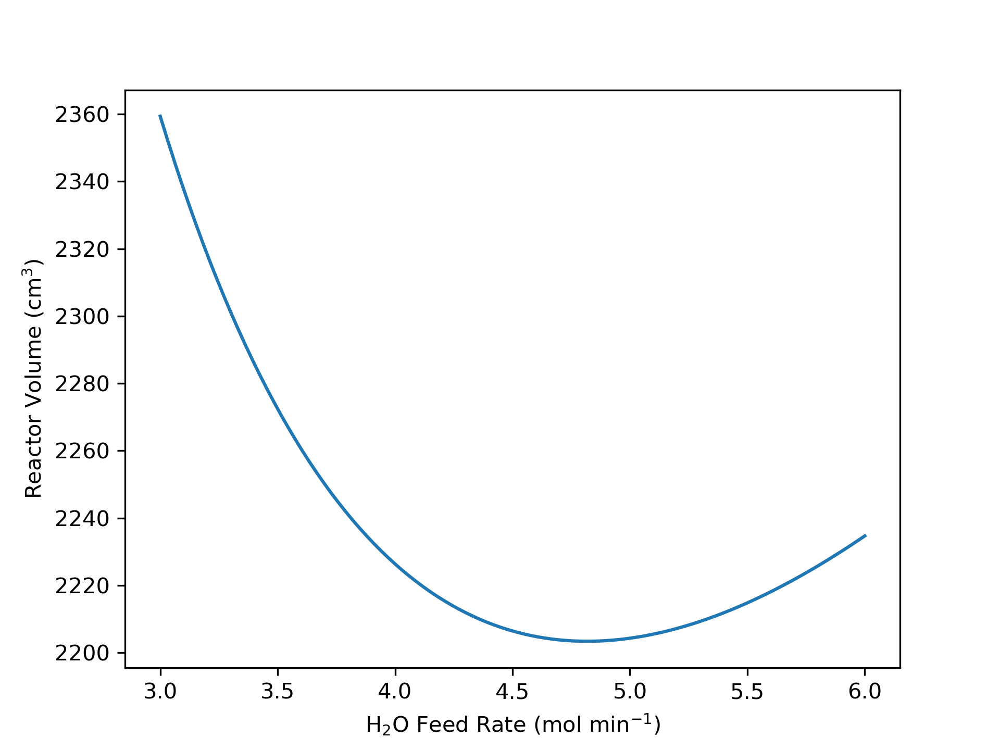
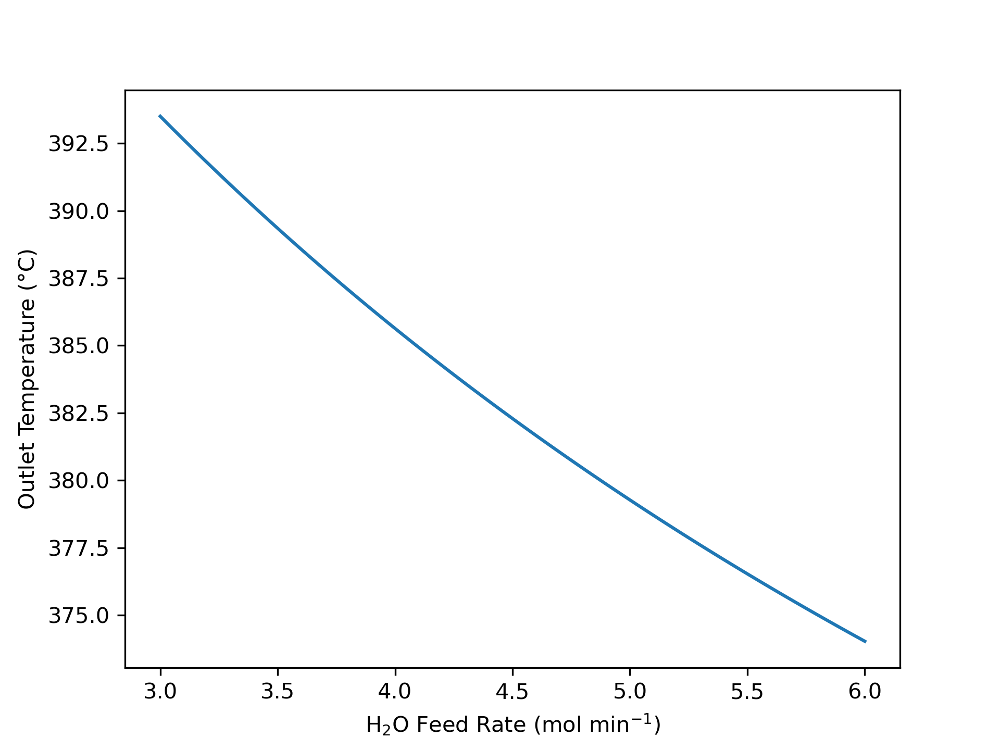

# PFR Analysis {#sec-ch9}

Chapters [-@sec-ch6], [-@sec-ch7], and [-@sec-ch8] examined ideal stirred tanks. This chapter introduces ideal plug-flow reactors and considers their analysis. It may prove helpful to keep the learning objectives in @sec-ch9_learning_objectives in mind while reading it.

## Ideal Plug-Flow Reactors (PFRs)

The reactors examined in preceding chapters were all variants of a stirred tank, that is, they were perfectly mixed. This chapter considers a very different kind of continuous reactor, namely the plug flow reactor (PFR). As the schematic, @fig-pfr_schematic, indicates, PFRs are basically tubes through which reacting fluid flows and within which chemical reactions take place. Heat is exchanged with PFRs through the tube walls, indicated in red in @fig-pfr_schematic.

{#fig-pfr_schematic width="50%"}

The distictive characteristics of PFRs and the assumptions used for modeling ideal PFRs are presented in [Appendix -@sec-apndx_PFR_balances]. The biggest difference between PFRs and stirred tanks lies in the mixing. Stirred tanks are perfectly mixed at all times, so there are never any spatial variations of composition or temperature within the reactor. In contrast, the composition and temperature vary continuously along the length of a PFR as the reacting fluid flows through it, as suggested by the color gradient within the tubular reactor in @fig-pfr_schematic.

More specifically the ideal PFR model assumes that the fluid velocity in the axial direction does not vary across the tube diameter. As a consequence, the fluid can be thought of as differentially thick disks that move from the reactor inlet to the outlet. As @fig-plug_flow suggests, there is perfect mixing in the radial direction (i. e. within each differentially thick disk) an no mixing at all in the axial direction (i. e. between disks). In effect, each differentially thick disk of fluid is effectively a small BSTR. Ignoring expansion/contraction, the time a differentially thick disk fluid element spends in the reactor is equal to the volume of the PFR divided by the volumetric flow rate of the reacting fluid. Thus, to a first approximation there is an analogy between the space time of a PFR and the reaction time in a BSTR.

{#fig-plug_flow width="50%"}

As already noted, heat is exchanged through the reactor walls. Commonly there is a concentric tube surrounding the reactor tube with heat exchange fluid flowing through the annular space. Alternatively, there may be many reactor tubes that all pass through a larger shell while heat exchange fluid flows through the shell. In some applications PFR tubes pass though a furnace firebox within which a fuel is burned. In this situation the flue gases are the heat exchange fluid, and any PFR tubes that are within line of sight of the combustion flame are additionally heated radiantly. *Reaction Engineering Basics* only considers heat exchange with a perfectly mixed fliud in a shell surrounding the PFR tube (see [Chapter -@sec-ch5_ideal_reactor_analysis]).

Another difference between PFRs and CSTRs is that the pressure of the reacting fluid in a PFR can decrease as the fluid flows from the inlet to the outlet. As mentioned in [Chapter -@sec-ch5_ideal_reactor_analysis], kinetic energy is converted to thermal energy as a fluid flows through a PFR. The resulting heat is negligible compared to heats of reaction and heat transfer, but it can affect the pressure significantly. Therefore, unlike stirred tanks, the reactor design equations for a PFR include a momentum balance unless it is known that the pressure drop is insignificant.

PFRs are well-suited to high throughput production. During steady-state operation, the labor requirements are small and comparable to those for a steady-state CSTR. PFRs are also well-suited for reactions that require solid catalyst particles because there is no need to stir the reacting fluid. However, the presence of solid catalyst particles can introduce concentration and temperature gradients as described later in this chapter.

The absence of axial mixing can be both an advantage and a disadvantage. An advantage is that unlike a CSTR, the reactants entering a PFR are not immediately diluted due to mixing with the fluid already present in the reactor. As a consequence, the concentration of reactant is high at the inlet. High reactant concentration typically results in a high reaction rate and a smaller reactor volume.

The absence of axial mixing can be a disadvantage if the reaction is exothermic with limited or no heat removal. Unlike a CSTR, where the feed is instantly heated to the outlet temperature upon entering the reactor, fluid enters a PFR at the feed temperature, and its temperature rises continuously as it flows through the reactor. The lower temperatures near the inlet typically result in a lower rate, and therefore a larger reactor is needed to accomplish a given extent of conversion.

Another disadvangage of PFRs is that the heat transfer area is fixed and equal to the tube wall area. Unlike CSTRs, it isn't feasible to add coiled tubes containing flowing heat exchange fluid within the PFR tube. Similarly, circulating the reacting fluid through an external heat exchanger is not practical. One workaround is to break one long PFR into several shorter PFRs with additional cooling between the shorter lengths of reactor.

## PFR Operation

Being continuous flow reactors, PFRs can operate at steady-state or in a transient mode. Like CSTRs, PFRs are normally designed to operate at steady state. When a PFR operates at steady state, the composition, temperature and pressure are all constant over time at any one axial position in the reactor. The temperature pressure and composition will be different at a different location, but at that location they again will be constant over time. Put differently, the steady-state composition, pressure and temperature in a PFR will vary spatitially (along the axis), but not temporally (over time).

At the minimum, transient operation occurs when the PFR is started up and shut down. Transient behavior will occur whenever a reactor input changes. Those changes can involve the flow rate, the feed composition, the feed temperature, the feed pressure, the heat exchange fluid flow rate, and the heat exchange fluid inlet temperature. *Reaction Engineering Basics* does not consider the analysis of transient PFRs; it only examines steady-state reactors.

## PFR Design Equations {#sec-ch9_cstr_design_eqns}

The reactor design equations for PFRs are derived in [Appendix -@sec-apxc]. The general PFR mole balance is presented in @eq-pfr_transient_mol_balance, the reacting fluid energy balance in @eq-pfr_transient_energy_balance, and the momentum balance in @eq-pfr_transient_momentum_balance. These forms of the PFR balance equations, together with an energy balance on the heat exchange fluid, are used when analyzing transient reactors. They are partial differential equations and are presented here for completeness, even though analysis of transient PFRs will not be considered herein.

$$
\frac{\partial \dot{n}_i}{\partial z} + \frac{\pi D^2}{4\dot{V}} \frac{\partial\dot{n}_i}{\partial t} - \frac{\pi D^2\dot{n}_i}{4\dot{V}^2} \frac{\partial \dot{V}}{\partial t}  =\frac{\pi D^2}{4}\sum_j \nu_{i,j}r_j
$$ {#eq-pfr_transient_mol_balance}

$$
\begin{split}
\left(\sum_i \dot{n}_i \hat{C}_{p,i} \right) \frac{\partial T}{\partial z} +& \frac{\pi D^2}{4\dot{V}} \sum_i \left(\dot{n}_i \hat{C}_{p,i} \right) \frac{\partial T}{\partial t} - \frac{\pi D^2}{4} \frac{\partial P}{\partial t} \\ &= \pi D U\left( T_{ex} - T  \right) - \frac{\pi D^2}{4}\sum_j r_j \Delta H_j
\end{split}
$${#eq-pfr_transient_energy_balance}

$$
\frac{\partial \dot{V}}{\partial t} + \frac{4 \dot{V}}{\pi D^2} \frac{\partial \dot{V}}{\partial z} + \frac{\pi D^2}{4 \rho} \frac{\partial P}{\partial z} = - \frac{2 f \dot{V}^2}{\pi D^3}
$${#eq-pfr_transient_momentum_balance}

When a PRF is operating at steady state, the time derivatives are equal to zero and the partial derivatives become ordinary derivatives. The resulting general form of the *steady-state* PFR mole balance is presented in @eq-pfr_ss_mol_balance, the reacting fluid energy balance in @eq-pfr_ss_energy_balance, the open tube momentum balance in @eq-pfr_momentum_balance, and the packed bed momentum balance in @eq-pfr_ergun_eqn. The steady-state energy balances for a heat exchange fluid that exchanges only sensible heat, @eq-exchange_energy_bal_sensible_ss, and only latent heat are also reproduced below. If the exchange fluid is a condensing vapor maintained at constant pressure, the fraction that condenses, $\gamma$, is equal to 1 and $\dot{m}_{ex}$ is the condensate flow rate leaving the shell.

$$
\frac{d \dot{n}_i}{d z}  =\frac{\pi D^2}{4}\sum_j \nu_{i,j}r_j
$${#eq-pfr_ss_mol_balance}

$$
\frac{d T}{d z} = \frac{\pi D U\left( T_{ex} - T  \right) - \frac{\pi D^2}{4}\sum_j r_j \Delta H_j}{\sum_i \dot{n}_i \hat{C}_{p,i} }
$${#eq-pfr_ss_energy_balance}

$$
\frac{dP}{dz} + \frac{4G}{\pi D^2} \frac{d \dot{V}}{dz} = - \frac{f_D G^2}{2D \rho}
$$ {#eq-pfr_momentum_balance}

$$
\frac{{dP}}{{dz}} =  - \frac{{1 - \varepsilon }}{{{\varepsilon ^3}}}\frac{{{G^2}}}{{\rho {\Phi _s}{D_p}}}\left[ {\frac{{150\left( {1 - \varepsilon } \right)\mu }}{{{\Phi _s}{D_p}G}} + 1.75} \right]
$${#eq-pfr_ergun_eqn}

$$
0 = \dot{Q} + \dot{m}_{ex} \int_{T_{ex,in}}^{T_{ex}} \tilde{C}_{p,ex}dT
$$

$$
0 = \dot{Q} + \gamma \dot{m}_{ex} \frac{\Delta H_{\text{latent},ex}^0}{M_{ex}}
$$

The steady-state, open tube momentum balance, @eq-pfr_momentum_balance, contains two dependent variables, $P$ and $\dot{V}$. If the fluid is incompressible, $\frac{d\dot{V}}{dz}$ is equal to zero, eliminating one of the dependent variables. Otherwise the differential form of the ideal gas law shown in @eq-dif_gas_law_wrt_z must be added to the design equations.

$$
P \frac{d \dot{V}}{dz} + \dot{V} \frac{dP}{dz} - R \left( T \sum_i \frac{d\dot{n}_i}{dz} + \left( \sum_i \dot{n}_i \right) \frac{dT}{dz} \right) = 0
$$ {#eq-dif_gas_law_wrt_z}
 

The sensible heat term in the denominator of the steady-state PFR energy balance, @eq-pfr_ss_energy_balance, is written in terms of the molar heat capacities of the reagents. It can also be expressed in terms of the overall volumetric or gravimetric heat capacity of the reacting fluid.

$$
\left(\sum_i \dot{n}_i \hat{C}_{p,i} \right) \Leftrightarrow \rho \dot{V} \tilde{C}_p  \Leftrightarrow \dot{V} \breve{C}_p 
$$ {#eq-equiv_sens_terms_pfr}

When a steady-state PFR operates adiabatically or isothermally at a known temperature, it can be convenient to use the cumulative reactor volume as the independent variable instead of the axial position. Converting between these two independent variables is straightforward. Assuming the PFR is a cylindrical tube, they are related by geometry as shown in @eq-dz_to_dv. The cumulative reactor volume can also be used when analyzing an isothermal reactor as long as the temperature is known, and the energy balances are not being used.

$$
\frac{\pi D^2}{4} dz = dV
$${#eq-dz_to_dv}

[Chapter -@sec-ch5_ideal_reactor_analysis] described how to determine which reactor design equations are needed for a given analysis. The design equations that are needed often can be simplified, as well. As already noted, if the reacting fluid is an incompressible, ideal liquid mixture, the volumetric flow rate will be constant. Consequently its derivative with respect to axial position will equal zero. 

Heat transfer depends upon the temperature difference between the reacting fluid and the exchange fluid. While the exchange fluid is perfectly mixed, the temperature of the reacting fluid varies along the length of a PFR. The reacting fluid energy balance, @eq-pfr_ss_energy_balance, accounts for this. In the exchange fluid energy balances, the rate of heat transfer from the exchange fluid to the reacting fluid is given by @eq-total_heat_exchanged_pfr. The second form of that equation makes use of the fact that the temperature of a perfectly mixed exchange fluid is constant in a steady-state reactor.

$$
\dot{Q} = \int_0^L \pi D U \left(T_{ex} - T \right)dz
$$ {#eq-total_heat_exchanged_pfr}

When rate expressions are substituted into the PFR design equations, they will introduce concentrations or, for gases, partial pressures. For liquid phase reactions, the concentration can be expressed in terms of the dependent variables in the design equations using its defining equation. For gases the concentration or partial pressure can be expressed in terms of the molar flow rates using the ideal gas law.

$$
C_i = \frac{\dot{n}_i}{\dot{V}}
$$

$$
C_i = \frac{\dot{n}_i}{\sum_i \left(\dot{n}_i\right)}\frac{P}{RT} \qquad i = \text{ ideal gas}
$$

$$
P_i = \frac{\dot{n}_i}{\sum_i \left(\dot{n}_i\right)}P \qquad i = \text{ ideal gas}
$$

Finally, the mass velocity, $G$, in the momentum balance equations is a constant for a steady-state reactor because mass is neither created nor consumed by chemcial reactions. The mass velocity is simply the mass flow rate divided by the cross-sectional area, @eq-mass_velocity. The mass flow rate can be calculated using the density and the volumetric flow rate, @eq-mass_flow_from_density, or from the molar flow rates and the molecular weights, @eq-mass_flow_from_MWs. The latter equations can be applied at any location in the reactor, and often the inlet is used.

$$
G = \frac{4 \dot{m}}{\pi D^2}
$${#eq-mass_velocity}

$$
\dot{m} = \rho \dot{V}
$${#eq-mass_flow_from_density}

$$
\dot{m} = \sum_i \left(\dot{n}_i M_i\right)
$${#eq-mass_flow_from_MWs}

## Packed Bed PFRs

One of the advantages of PFRs is their suitability for heterogeneous catalystic reactions with solid catalysts. The catalyst takes the form of small particles, often cylindrical or spherical in shape with dimensions of the order of 0.25 in. The catalyst particles are highly porous. When they are examined using a microscope, they look similar to a common sponge, with interconnected void spaces throughout their volume.

### The Pseudo-Homogeneous PFR Model

Stirred tank reactors are not will suited to reactions that require solid catalyst particles due to the necessity of agitating the fluid to keep it perfectly mixed. Stirring a tank full of solid pellets is not practical. PFRs do not require agitation, so the interior of the reactor can be filled with the catalyst pellets. Screens or other similar means are used to keep the pellets in place, and the reacting fluid flows in the space between the pellets. That space is called the void space. Reactors packed with catalyst pellets as described here are known as packed bed PFRs (assuming they still obey the assumptions of the PFR model).

The presence of the packed bed does introduce a few complications. One is that the fluid no longer flows in the axial direction only. Its path must twist and turn so it can flow around the catalyst particles. In many cases, the relatively small amount of non-axial flow does not significantly affect the assumption of a constant velocity in the axial direction in any reactor cross-section, and it promotes radial mixing without introducing significant axial mixing. This allows the reactor to be treated as a pseudo-homogeneous PFR, @fig-pseudo_homogeneous_pfr_model. 

{#fig-pseudo_homogeneous_pfr_model width="50%"}

Use of the pseudo-homogeneous PFR model can introduce a second complication depending upon the manner in which the rate is normalized. With homogeneous single-phase reactions, reaction rates are almost always normalized per unit volume of reacting fluid. Indeed, the reactor design equations used throughout *Reaction Engineering Basics* assume that the rate is normalized per reacting fluid volume, and the reacting fluid volume is essentially equal to the reactor volume.

Heterogeneous catalytic reactions actually occur on the surface of the catalyst particles. This includes their external surface and the walls of all internal pores and voids. As such, the best way to normalize the rate is per unit catalyst surface area. Nonetheless, the catalyst surface area is not often used to normalize heterogeneous catalytic reaction rates. Most commonly the rates are normalized per unit mass of catalyst. They can also be normalized per unit catalyst bed volume (pellets plus void space between them) or per the apparent volume of the pellets alone. It is called the apparent volume of the pellets because it includes the volume of the solid and the *internal* pore and void volume.

When the pseudo-homogeneous PFR model is used, the reactor volume is equal to the catalyst bed volume. Consequently, a rate that is normalized per unit catalyst bed volume can be used directly in the reactor design equations. The catalyst bed volume is not a very good normalization factor because it depends how tightly the catalyst particles are packed into the bed. That is, one could load the same mass of catalyst pellets into a tubular reactor three times and find three different bed volumes depending on how well the particles had settled into the tube. Nonetheless, it is sometimes used to normalize catalytic reaction rates.

A rate that is normalized in any way other than per catalyst bed volume must be renormalized to use the catalyst bed volume before it can be used in the reactor design equations present throughout *Reaction Engineering Basics*.

When the rate is normalized per unit catalyst mass, the bed density must be measured when the catalyst is loaded into the reactor. Doing so is relatively straightforward. Before the catalyst is loaded into the reactor, the volume into which the catalyst will be loaded can be measured. The total mass of catalyst particles loaded into the reactor can then be measured. The bed density is simply the total mass of catalyst loaded divided by the volume into which it was loaded, @eq-bed_density. The rate per catalyst mass can then be renormalized by multiplying it by the bed density, @eq-renormalize_rate_per_mass.

$$
\rho_{bed} = \frac{m_{cat}}{V_{bed}}
$${#eq-bed_density}

$$
r_{\text{(bed V)}} = \rho_{bed} r_{\text{(mass)}} 
$${#eq-renormalize_rate_per_mass}

There are experimental techniques and instruments for measuring the catalyst's specific surface area, $S_{cat}$, that is, the surface area per mass of catalyst. When the rate is normalized per catalyst surface area, it can be renormalized simply by multiplying it by the specific surface area to get the rate per catalyst mass, and then applying @eq-renormalize_rate_per_mass, as shown in @eq-renormalize_rate_per_area.

$$
r_{\text{(bed V)}} =  \rho_{bed} S_{cat} r_{\text{(area)}}
$$ {#eq-renormalize_rate_per_area}

When the rate is normalized per catalyst particle volume it is convenient to define $\epsilon$ as the catalyst bed void fraction, @eq-void_fraction. It is simply the fraction of the bed volume that is not occupied by catalyst particles. Using that definition, an expression for ratio of the particle volume to the bed volume can be generated, @eq-particle_volume_per_bed_volume. The rate per particle volume then can be renormalized by multiplying it by this ratio, @eq-renormalize_rate_per_particle_volume.

$$
\epsilon = \frac{V_{void}}{V_{bed}} = \frac{V_{void}}{V_{void} + V_{particle}}
$$ {#eq-void_fraction}

$$
\frac{V_{particle}}{V_{bed}} = \frac{V_{bed} - V_{void}}{V_{bed}} = \frac{1 - \frac{V_{void}}{V_{bed}}}{1} = 1 - \epsilon
$${#eq-particle_volume_per_bed_volume}

$$
r_{\text{(bed V)}} = \left( 1 - \epsilon \right) r_{\text{(particle V)}}
$$ {#eq-renormalize_rate_per_particle_volume}

### Concentration and Temperature Gradients in Packed Bed PFRs {#sec-packed_bed_gradients}

The renormalizations described above all make the implicit assumption that the fluid composition and temperature is uniform in any reactor cross-section. As illustrated @fig-catalyst_gradients, gradients can form at the interface between two phases, and if one of the phases is porous, gradients can also form within the pores. The middle of the figure shows a cross-section of a packed bed PFR and then zooms in at the bottom of the figure to just show portions of two porous catalyst particles in gray and the fluid in blue. The zoomed in view on the left side shows a uniform blue in the space between the catalyst particles and within the pores of the particles. The uniformity of the blue means that the concentration and temperature are uniformly the same everywhere. This is what the renormalizations assume.

{#fig-catalyst_gradients width="70%"}

The zoomed in view shown in the lower right of @fig-catalyst_gradients shows that in fact, there can be temperature and concentration gradient between the bulk of the fluid and the external surface of the catalyst particles *and* there can be concentration and temperature gradients within the pores of the solid catalyst particles. The blue color in the bulk of the fluid is uniform, but a gradient in color (representative of concentration and temperture gradients) is seen as the external surface of the particles are approached. Concentration and temperature gradients between the bulk of the fluid and the surface of the particles are referred to as *external gradients*. Looking more closely at the figure it can be seen that there is also a gradient within the catalyst particles. These gradients are called *internal gradients*.

The problem this presents is as follows. The concentrations and temperatures that are used in the rate expression and the reactor design equations are the bulk fluid concentrations and temperatures. If there are no gradients, as in the lower left of the figure, this does not cause a problem. However, if there are gradients, then the concentrations and temperature within the catalst particle are different from those in the bulk fluid. In other words, the rate should be calculated using the concentrations and temperatured within the catalyst pores because that is where the reaction is taking place, but instead, the rate is being calculated using the bulk fluid concentrations and temperature.

The consequences of using the bulk fluid reactant concentrations in the rate expression when there are gradients present is indicated in @fig-effect_of_gradients. Panel a represents a situation where the catalyst (gray) is not porous, but there are gradients (pink) between the bulk fluid (blue) and the catalyst surface. The region within which the gradients exist (pink) is called the *boundary layer*. The graph on the right of the top panel plots the concentration of a reactant as a function of the distance into the boundary layer. The concentration of a reactant decreases across the boundary layer. As a consequence, the concentration at the surface of the catalyst, $C_{surf}$, is smaller than the bulk fluid concentration $C_{bulk}$. It is important to realize that no reaction occurs within the boundary layer because the reaction is catalyzed and only occurs on the catalyst surface. The net effect of the external gradient is that the concentration that *should* be used in the rate expression, $C_{surf}$, is smaller than the bulk fluid concentration $C_{bulk}$. $C_{surf}$ is colored red in the graph to indicate that reaction takes place at that concentration. If the gradient is ignored and the rate is calculated using the bulk concentration, the rate will be larger than it should be, and the predictions made by the reactor design equaions will be incorrect.

{#fig-effect_of_gradients width="80%"}

Panel b in @fig-effect_of_gradients, depicts a situation where there are no external gradients, but the catalyst is porous and the reactant diffuses into a catalyst pore (yellow). Since there isn't a boundary layer, the concentraton at the external surface of the catalyst is equal to $C_{bulk}$. However, as the reactant diffuses into the pore more and more of it reacts causing its concentration to decrease. The graph to the right of that schematic plots the reactant concentration as a function of the distance into the catalyst particle. The line in the graph is colored red because reaction takes place all along the pore. In other words, the rate should not be evaluated only at $C_{bilk}$, but at a range of concentrations that exist within the catalyst pore. Once again, if the rate is evaluated only at $C_{bulk}$ it will be too large and the results from the reactor design equations will be incorrect.

Panel c in @fig-effect_of_gradients, depicts a situation where there are both external and internal gradients. The graph to the right of the schematic shows that in this situation the rate again occurs over a range of reactant concentrations, but all of them are less than the bulk fluid concentration. Yet again, if the rate is evaluated only at $C_{bulk}$ it will be too large and the results from the reactor design equations will be incorrect.

**Accounting for External Concentration Gradients** Several approaches are possible to account for concentration and temperature gradients associated with heterogeneous catalysts. Doing so is typically considered more advanced reaction engineering books. This chapter does not attempt to present a comprehensive discussion of the topic, but instead considers one of the simplest of situations, illustrating one approach to accounting for concentration gradients. In particular, this chapter only considers concentration gradients. An analogous approach can be used to account for temperature gradients, but it won't be described here.

The analysis presented here assumes that Fick’s law describes diffusion and that there is equal and opposite counter-diffusion. The flux of a reactant, A, through the boundary layer is usually described in terms of a mass transfer coefficient, $k_c$, where the subscript “c” denotes that the mass transfer coefficient is for use with concentrations as expressed in @eq-external_flux. The mass transfer coefficient will depend upon the geometry of the system under consideration, the fluid flow rate and fluid properties.

$$
N_A = k_c\left( C_{A,bulk} - C_{A,surf} \right)
$$ {#eq-external_flux}

As a consequence, values for mass transfer coefficients are often found from dimensionless correlations. @eq-jD_correlation_with_Reynolds is an example of one such correlation for the dimensionless quantity, $j_D$, @eq-jD_definition, in terms of the Reynolds number, $N_{Re}$, @eq-Reynolds_definition. This particular correlation applies to flow through a packed bed of spherical particles with Reynolds numbers greater than 50. A number of correlations of this type are available; a good mass transfer textbook or chemical engineering handbook should be consulted to find an appropriate correlation for other conditions. Both $j_D$ and $N_{Re}$ may be defined differently, depending on the specific correlation being used.

$$
j_D = 0.61N_{Re}^{-0.41}
$$ {#eq-jD_correlation_with_Reynolds}

$$
j_D = \frac{\pi D_{tube}^2k_c}{4\dot{V}}\left(\frac{\mu}{\rho D_A} \right)^{2/3}
$$ {#eq-jD_definition}

$$
N_{Re} = \frac{2\dot{V}\rho}{3\pi D_{tube}^2 \mu \left(1-\epsilon \right)D_{particle}}
$$ {#eq-Reynolds_definition}

In general, the concentration of the reactant at the external surface of the catalyst particle is not known. Suppose, however, that the catalyst was not porous as in panel a of @fig-effect_of_gradients, and that the system had reached steady state. At steady state, the flux given by @eq-external_flux must just equal the rate of reaction on the surface of the catalyst particle. If this weren’t true, reactant would accumulate at the surface, and accumulation does not occur at steady state. In this case, the rate expression should be evaluated at $C_{A,surf}$, not $C_{A,bulk}$. Then, for a steady state system, the flux according to @eq-external_flux can be set equal to the rate predicted by the rate expression at $C_{A,surf}$. Solving for the surface concentration of A yields @eq-surface_conc_from_mass_transfer_coeff for a first order reaction.

$$
C_{A,surf} = \frac{k_c}{k + k_c}C_{A,bulk}
$$ {#eq-surface_conc_from_mass_transfer_coeff}

Substitution into the first order rate expression leads to a rate expression in terms of the bulk fluid concentration of A, @eq-rate_from_mass_transfer_coeff. The rate expression in terms of the bulk fluid concentration still has the appearance of a first order rate expression, @eq-apparent_first_order_from_mass_transfer_coeff, but the apparent rate coefficient, $k^{\prime}$, is no longer a simple rate coefficient, @eq-apparent_rate_coeff_from_mass_trandfer_coeff. 

$$
-r_A = \frac{k k_c}{k + k_c}C_{A,bulk} = \left( \frac{1}{k} + \frac{1}{k_c} \right)^{-1}C_{A,bulk}
$$ {#eq-rate_from_mass_transfer_coeff}

$$
-r_A = k^{\prime}C_{A,bulk}
$$ {#eq-apparent_first_order_from_mass_transfer_coeff}

$$
\frac{1}{k^{\prime}} = \frac{1}{k} + \frac{1}{k_c}
$$ {#eq-apparent_rate_coeff_from_mass_trandfer_coeff}

Thus, if only external concentration gradients were present and the catalyst was non-porous, the rate expression in @eq-rate_from_mass_transfer_coeff could be used in an ideal reactor model, and the model would correctly account for the external concentration gradient. This analysis only applies if the reaction is first order and the catalyst is non-porous.

**Accounting for Internal Concentration Gradients** Accounting for internal concentration gradients associated with heterogeneous catalysts requires some sort of model for the pore structure of the catalyst. Each catalyst particle is likely to have its own unique pore structure. As a result, it is not practical to attempt to construct an exact physical model for the pore structure. Instead, common approaches are to construct a network of pores that are interconnected at nodes where a specified number of pores meet or to assume straight pores with circular cross sections and a distribution of pore diameters. An even simpler approach, which will be used here, is to adopt a pseudo-continuum pore model, @fig-pseudo_continuum_pore_model.

{#fig-pseudo_continuum_pore_model width="20%"}

The pseudo-continuum pore model completely ignores the pore structure of the solid. Instead, it treats the catalyst particle as if it is a single homogeneous phase. It further assumes that the reactants diffuse in a straight line in the radial direction, as indicated by the black arrows in the figure. The diffusion process is assumed to obey Fick’s law, but an effective diffusivity is used in place of the true diffusion coefficient.

Using the pseudo-continuum pore model, a steady state mole balance on reactant A within a spherical catalyst particle takes the form given in @eq-radial_diffusion_reaction. It should be noted, in particular, that the appropriate diffusion coefficient to use when modeling a porous solid depends upon the chemical species present, the nominal diameter of the catalyst pores and the mode of diffusion. Possible modes of diffusion include ordinary molecular diffusion, Knudsen diffusion, configurational diffusion and surface diffusion.

$$
-D_{eff,A}\left( \frac{\partial^2 C_A}{\partial r^2} + \frac{2}{r} \frac{\partial C_A}{\partial r}\right) = r_A
$$ {#eq-radial_diffusion_reaction}

In reality, of course, if you looked at any spherical shell within the catalyst particle, only a fraction of the surface of that shell would be available for diffusion because the reactant would only diffuse in the pores, not through the solid. It is commonly assumed that the fraction of the surface of any spherical shell that is available for diffusion is equal to the void fraction, $\varepsilon$, of the catalyst particle (not the void fraction of the packed bed of particles, $\epsilon$).

Similarly, the actual path followed by a diffusing reactant will twist and turn so that the distance the reactant travels to reach the center of the particle is greater than the radius of the particle. A quantity known as the tortuosity, $\tau$, is used to account for the difference between the straight line distance to the center and the actual path length. With these two correction factors, the effective diffusivity can be related to the appropriate true diffusion coefficient for species A according to @eq-effective_diffusivity.

$$
D_{eff,A} = \frac{\varepsilon D_A}{\tau}
$$ {#eq-effective_diffusivity}

Assuming the total number of moles is not changed by reaction, a mole balance can be written for reactant A on a differentially thin spherical shell within the spherical catalyst particle. Assuming that the rate is first order and normalized per unit mass of catalyst, and letting $\rho_{part}$ represent the apparent density of a catalyst particle, @eq-spherical_rxn_dffn results by taking the limit as the shell thickness goes to zero.
 
$$
D_{eff,A} \frac{1}{r^2} \frac{d}{dr}\left( r^2 \frac{dC_A}{dr} \right) = \rho_{particle}k C_A
$$ {#eq-spherical_rxn_dffn}

@eq-spherical_rxn_dffn can be solved using the boundary conditions specified in Equations [-@eq-spherical_rxn_dffn_bc1] and [-@eq-spherical_rxn_dffn_bc2]. The first boundary condition simply requires that the concentration of A at the entrance to the porous solid is equal to the external surface concentration of A. The second boundary condition is a symmetry condition that requires that the concentration gradient go to zero at the center of the particle.

$$
C_A \big\vert_{r=R_{particle}} = C_{A,surf}
$$ {#eq-spherical_rxn_dffn_bc1}

$$
\frac{dC_A}{dr} \Big \vert_{r=0} = 0
$$ {#eq-spherical_rxn_dffn_bc2}

Solving @eq-spherical_rxn_dffn leads to @eq-spherical_rxn_dffn_conc for the concentration of A as a function of radial position within the catalyst particle. It  only applies for a spherical catalyst particle with a first order reaction taking place. E. W. Thiele was among the first to derive models of this kind, and consequently the name Thiele modulus is given to the dimensionless quantity $\phi$, @eq-Thiele_modulus, which represents the ratio of reaction rate to diffusion rate. It should be noted that in general, the definition of the Thiele modulus depends upon the geometry of the catalyst particle and the form of the rate expression.

$$
C_A\left(r\right) = C_{A,surf} \frac{\sinh{\left(\phi \frac{r}{R_{particle}}\right)}}{\frac{r}{R_{particle}}\sinh{\phi}}
$$ {#eq-spherical_rxn_dffn_conc}

$$
\phi = R_{particle}\sqrt{\frac{k\rho_{particle}}{D_{eff,A}}}
$$ {#eq-Thiele_modulus}

The flux of reactant A into the catalyst through its surface (i. e. in the negative $r$ direction) is related to the gradient in the concentration of A at the surface according to @eq-Thiele_flux_with_deriv. Substitution of the derivative of @eq-spherical_rxn_dffn_conc into equation @eq-Thiele_flux_with_deriv gives an expression for the flux of A into the catalyst particle, @eq-spherical_rxn_diffn_flux. Multiplication of this flux by the external surface area of the catalyst particle gives the rate at which reactant A enters the particle. As before, at steady state, the rate at which A enters the catalyst particle must just equal the rate of reaction of A within the particle, because otherwise A would accumulate within the particle.

$$
-N_A = D_{eff,A} \left( \frac{dC_A}{dr}\Big\vert_{r = R_{particle}} \right)
$$ {#eq-Thiele_flux_with_deriv}

$$
-N_A = \frac{\phi D_{eff,A} C_{A,surf}}{R_{part}} \left( \frac{1}{\tanh{\phi}} - \frac{1}{\phi} \right)
$$ {#eq-spherical_rxn_diffn_flux}

## Effectiveness Factors

Substitution of @eq-spherical_rxn_diffn_flux in the PFR design equations represents one way to account for internal concentration gradients, but it makes the design equations quite unwieldy. Instead, it is useful to compare the rate of reaction @eq-spherical_rxn_diffn_flux predicts to the rate if there were no concentration gradients. In the latter case, $C_A = C_{A,surf}$ everywhere within the catalyst particle.

An effectiveness factor, $\eta$, can be defined as the ratio of the actual rate of reaction to the rate that would be observed if there were no concentration gradients. Substituting those rates leads to @eq-effectiveness_factor which shows how the effectiveness factor depends upon the Thiele modulus when the reaction is first order and the catalyst particles are spherical. For other reaction orders or particle shapes, the dependence of the effectiveness factor on the Thiele modulus would be different.

$$
\eta = \frac{3}{\phi} \left( \frac{1}{\tanh{\phi}} - \frac{1}{\phi} \right)
$$ {#eq-effectiveness_factor}

The utility of the effectiveness factor can be understood by first considering a situation where the external concentration gradients are negligible, such as that depicted in panel b of @fig-effect_of_gradients. In this case, $C_{A,surf} = C_{A,bulk}$ and the actual rate of reaction, including the effect of the concentration gradients within the pores, is simply equal to the rate of reaction given by the rate expression for the bulk fluid concentration multiplied by the effectiveness factor. That is, if the rate is multiplied by $\eta$, it can be evaluated at the bulk fluid concentration, and it will still account for the concentration gradients within the spherical catalyst particles. The resulting rate, @eq-effectiveness_rate, is normalized per catalyst bed volume.

$$
-r_{A \text{(bed V)}} = \eta \rho_{bed}kC_{A,bulk}
$$ {#eq-effectiveness_rate}

@fig-effectiveness_vs_Thiele plots the effectiveness factor for a first order reaction taking place in a spherical catalyst particle as a function of the Thiele modulus. The figure shows that as the Thiele modulus goes to zero, the effectiveness factor approaches one. The effectiveness factor remains close to one for values of the Thiele modulus up to ca. 1, so generally one would prefer to operate a reactor at a Thiele modulus around 1 or less. At values of the Thiele modulus greater than 1, the effectiveness factor decreases rapidly, eventually approaching an asymptotic slope equal to $\frac{3}{\phi}$ (for a first-order reaction in a spherical particle).

{#fig-effectiveness_vs_Thiele width="70%"}

A word of caution is in order. When the reaction is first order, as in the analysis presented above, the Thiele modulus does not depend upon the concentration of A at the catalyst surface. This is rarely the case; for other reaction orders, the corresponding Thiele modulus, and consequently the effectiveness factor, depends upon the concentration of A at the catalyst surface. This means that as the reaction proceeds, the effectiveness factor will change along the length of the reactor. In addition, for a spherical catalyst particle and most reaction orders other than one, it has not proven possible to obtain an analytical expression for the effectiveness factor like @eq-effectiveness_factor, which only applies for a first order reaction. Instead, the effectiveness factor must be calculated numerically.

**Accounting for Simulaneuous External and Internal Gradients** Returning to the first order case, if the concentration gradient across the boundary layer is significant, as in panel c of @fig-effect_of_gradients, @eq-spherical_rxn_diffn_flux is still valid. The only problem is that $C_{A,surf}$ is no longer equal to $C_{A,bulk}$. However, for a steady state process, the flux into the catalyst must just equal the flux through the boundary layer. This is expressed in @eq-fluxes_equal which can be solved for $C_{A,surf}$ giving @eq-surf_conc.

$$
\frac{\phi D_{eff,A} C_{A,surf}}{R_{particle}} \left( \frac{1}{\tanh{\phi}} - \frac{1}{\phi} \right) = k_c \left( C_{A,bulk} - C_{A,surf} \right)
$$ {#eq-fluxes_equal}

$$
C_{A,surf} = \frac{\gamma C_{A,bulk} \tanh{\phi}}{\phi + \left( \gamma - 1 \right)\tanh{\phi}}\, \qquad \gamma = \frac{k_c R_{particle}}{D_{eff,A}}
$$ {#eq-surf_conc}

@eq-surf_conc then can be substituted back into @eq-spherical_rxn_diffn_flux to get an expression for the flux of reactant A into the catalyst in terms of the bulk fluid concentration of A, @eq-flux_with_external. From that, an expression for the global effectiveness factor, $\eta_G$, can be derived, @eq-global_effectiveness. The global effectiveness factor in @eq-global_effectiveness is the actual rate of reaction (i. e. in the presence of concentration gradients in both the boundary layer and the pores) divided by the rate of reaction in the absence of concentration gradients (i. e. if $C_A = C_{A,bulk}$ everywhere). @eq-global_effectiveness only applies for a first order reaction taking place isothermally in a spherical catalyst particle.

$$
-N_A = \frac{\gamma C_{A,bulk} D_{eff,A}}{R_{particle}} \frac{\phi - \tanh{\phi}}{\phi + \left( \gamma - 1 \right) \tanh{\phi}}
$$ {#eq-flux_with_external}

$$
\eta_G = \frac{3}{\phi} \left( \frac{1}{\tanh{\phi}} - \frac{1}{\phi} \right) \frac{\gamma \tanh{\phi}}{\phi + \left( \gamma - 1 \right) \tanh{\phi}}
$$ {#eq-global_effectiveness}

Once again, the approach presented in this unit is but one of many means of accounting for concentration gradients during heterogeneous catalysis. A similar approach can be applied to additionally account for temperature gradients. The approach used here uses the pseudo-continuum model for the porous solid; models can also be developed using other pore models. This approach can be adapted to catalyst geometries other than spherical and to situations where the total number of moles changes upon reaction. These topics are typically treated in much greater detail in advanced courses on kinetics and reaction engineering.

## Learning Objectives and Examples {#sec-ch9_learning_objectives}

Upon completion of this chapter, readers should

* know the definition and/or defining equation for plug flow, PFR mole balance, PFR energy balance, open-tube momentum balance, packed-bed PFR, packed-bed momentum balance, boundary layer, internal and external gradients, porosity, tortuosity, Thiele modulus, and effectiveness factor
* understand that
	* the ideal PFR model assumes that the reacting fluid is a single-phase fluid
	* different momentum balance equations are used when modeling open-tube PFRs and packed-bed PFRs
	* when the open-tube momentum balance is used to model a PFR, the differential form of the ideal gas law must be added to the design equations.
	* when using the pseudo-homogeneous approximation, the rate must be normalized per bed volume
	* when solid catalyst particles are present in a packed-bed PFR, temperature and concentration gradients exist between the bulk fluid and the particle surface, and within the solid packing if it is porous
* be able to
	* select, modify, and simplify the design equations for modeling a given PFR using either the axial position or the cumulative volume as the independent variable 
	* use the PFR design equations, together with any other necessary equations, to complete a reaction engineering assignment involving
        * gas or liquid  phase reacting systems
		* non-isothermal or adiabatic operation 
		* open tube or packed-bed reactors
		* heat exchange fluids that transfer latent  or sensible  heat
		* single or multiple  reactions
		* response or optimization  tasks
	* use the effectiveness factor to account for concentration gradients when modeling a packed-bed PFR
	* use qualitative analysis to assess and explain results from a quantitative analysis 

::: {.callout-important collapse="true"}
## Computer Code for Performing Calculations

The examples presented in *REB, The Book* describe how to perform the necessary calculations numerically, but they do not provide computer code for doing so. This is intentional so that readers can use whatever programming language and development environment they choose.

For readers who are interested, the Assignments by Topic Section of [*REB, The Course*] describes and discusses using Python to perform the calculations for each example in this book, and it includes links to the source code.

:::

### Steady-State Conversion in a Gas-Phase PFR {#sec-ch9_ex1}

The heat of reaction (1) is 44.8 kJ mol^-1^, and the reaction is irreversible. The rate expression is equation (2) where the pre-exponential factor is 7.22 x 10^6^ mol atm^-2^ cm^-3^ s^-1^ and the activation energy is 84.1 kJ mol^-1^. A 10 foot long tubular reactor with a diameter of 1 inch is heated by a vapor condensing at 200 °C on the outside of the tube wall. The overall heat transfer coefficient is 7.48 x 10^4^ J h^-1^ ft^-2^ K^-1^. Pressure drop through the reactor is negligible. If a gas phase mixture of 60% A and 40% B enters the reactor at 282 L min^-1^, 2.5 atm and 175 °C and if the heat capacities of A, B and Z are equal to 18.0, 12.25 and 21.2 cal mol^-1^ K^-1^, what steady state outlet temperature and conversion of B will result?

$$
A + B \rightarrow Z \tag{1}
$$

$$
r_1 = k_1 P_A P_B \tag{2}
$$

---

:::{.callout-tip collapse="true"}
## Click Here to See What an Expert Might be Thinking at this Point

This narrative describes a gas-phase, steady-state PFR that is heated by the condensation of a heat exchange fluid. The dimensions of the reactor, extensive quantities, are provided, so a basis cannot be chosen. The quantities of interest are the outlet temperature and the conversion of reagent B. I'm given reactor inputs, and can calculate these quantities by solving the PFR design equations. I will use the assignment completion workflow described in [Chapter -@sec-ch5_workflow], beginning with a concise summary of the assignment. I'll use a subscripted "in" to denote inlet quantities and "out" to denote outlet quantities.

:::

**Assignment Summary**

[Reaction]{.underline}:

$$
A + B \rightarrow Z \tag{1}
$$

[Rate Expression]{.underline}:

$$
r_1 = k_1 P_A P_B \tag{2}
$$

[Reactor]{.underline}: Gas-phase, heated, steady-state PFR

[Given Constants]{.underline}: $\Delta H_1$ = 44.8 kJ mol^-1^, $k_{0,1}$ = 7.22 x 10^6^ mol atm^-2^ cm^-3^ s^-1^, $E_1$ = 84.1 kJ mol^-1^, $L$ = 10 ft, $D$ = 1 in, $T_{ex}$ = 200 °C, $U$ = 7.48 x 10^4^ J h^-1^ ft^-2^ K^-1^, $y_{A,in}$ = 0.60, $y_{B,in}$ =  0.40, $\dot{V}_{in}$ = 282 L min^-1^, $P$ = 2.5 atm, $T_{in}$ = 175 °C, $\hat{C}_{p,A}$ = 18.0 cal mol^-1^ K^-1^, $\hat{C}_{p,B}$ = 12.25 cal mol^-1^ K^-1^, and $\hat{C}_{p,Z}$ = 21.2 cal mol^-1^ K^-1^.
 
[Deliverables]{.underline}: $T_{out}$ and $f_B$

**Formulation of the Equations**

:::{.callout-tip collapse="true"}

## Click Here to See What an Expert Might be Thinking at this Point

The reactor design equations always include some minimum number of mole balances. I will simply write the mole balance for each of the three reagents. The PFR operates at steady-state, so I'll start with the general form of the steady-state PFR mole balance given in @eq-pfr_ss_mol_balance. There is only one reaction taking place, so the summation reduces to a single term. 

$$
\frac{d \dot{n}_i}{d z}  =\frac{\pi D^2}{4}\cancelto{\nu_{i,1}r_1}{\sum_j \nu_{i,j}r_j}
$$

This reactor is not isothermal, so the mole balances cannot be solved separately from an energy balance on the reacting gas. To generate that equation, I'll start from the general form of the steady-state PFR energy balance, @eq-pfr_ss_energy_balance. There are three reagents present in the reactor, so the first summation expands to three terms. Again, there is only one reaction taking place, so the final summation reduces to a single term. Knowing that I will be solving the design equations numerically, and that I'll have to evaluate each of the derivatives, I'll rearrange the equation into the form of a derivative expression (@sec-apxd_ivodes).

$$
\cancelto{\left( \dot{n}_A \hat{C}_{p,A} + \dot{n}_B \hat{C}_{p,B} + \dot{n}_Z \hat{C}_{p,Z}  \right)}{\left(\sum_i \dot{n}_i \hat{C}_{p,i} \right)} \frac{d T}{d z} = \pi D U\left( T_{ex} - T  \right) - \frac{\pi D^2}{4}\cancelto{r_1 \Delta H_1}{\sum_j r_j \Delta H_j}
$$

$$
\frac{d T}{d z} = \frac{\pi D U\left( T_{ex} - T  \right) - \frac{\pi D^2}{4}r_1 \Delta H_1}{\dot{n}_A \hat{C}_{p,A} + \dot{n}_B \hat{C}_{p,B} + \dot{n}_Z \hat{C}_{p,Z}}
$$

The PFR is being heated using the latent heat of a heat exchange fluid. Because only the latent heat is involved, the temperature of the exchange fluid is constant. That means that I can solve the combined mole and reacting fluid energy balances independently of an energy balance on the heat exchange fluid. 

Finally, for PFRs a momentum balance is needed to account for pressure drop along the length of the reactor. In this assignment, however, it is noted that pressure drop is negligible, so I won't add a momentum balance to the reactor design equations.

:::

[Reactor Model Equations]{.underline}

$$
\frac{d \dot{n}_A}{dz} = -\frac{\pi D^2}{4}r_1 \tag{3}
$$

$$
\frac{d \dot{n}_B}{dz} = -\frac{\pi D^2}{4}r_1 \tag{4}
$$

$$
\frac{d \dot{n}_Z}{dz} = \frac{\pi D^2}{4}r_1 \tag{5}
$$

$$
\frac{d T}{d z} = \frac{\pi D U\left( T_{ex} - T  \right) - \frac{\pi D^2}{4}r_1 \Delta H_1}{\left( \dot{n}_A \hat{C}_{p,A} + \dot{n}_B \hat{C}_{p,B} + \dot{n}_Z \hat{C}_{p,Z} \right)} \tag{6}
$$

:::{.callout-tip collapse="true"}
## Click Here to See What an Expert Might be Thinking at this Point

The reactor design equations consist of four IVODEs and they contain four dependent variables, $\dot{n}_A$, $\dot{n}_B$, $\dot{n}_Z$, and $T$, so there isn't a need to either eliminate a dependent variable or add an IVODE. Solving them numerically will yield corresponding sets of values of the independent variable, $t$ and those dependent variables. In order to solve them, any additional unknowns appearing in the design equations must first be calculated. Going through the design equations variable by variable I can see that the rate is the only additional unknown. It can be calculated using the provided rate expression, and that introduces the rate coefficient and the partial pressures of A and B as additional unknowns. The rate coefficient can be calculated using the Arrhenius expression, and the partial pressures can be calculated using the ideal gas law as shown in @eq-partial_pressure_open.

:::

[Reactor Model Variables]{.underline}: $\underline{z}$, $\underline{\dot{n}}_A$, $\underline{\dot{n}}_B$, $\underline{\dot{n}}_Z$, and $\underline{T}$

[Additional Computable Unknowns]{.underline}: $r_1$, $k_1$, $P_A$, and $P_B$

$$
k_1 = k_{0,1} \exp{\left( \frac{-E_1}{RT} \right)} \tag{7}
$$

$$
P_A = \frac{\dot{n}_A}{\dot{n}_A + \dot{n}_B + \dot{n}_Z}P \tag{8}
$$

$$
P_B = \frac{\dot{n}_B}{\dot{n}_A + \dot{n}_B + \dot{n}_Z}P \tag{9}
$$

:::{.callout-tip collapse="true"}
## Click Here to See What an Expert Might be Thinking at this Point

In addition to a derivatives function, the IVODE solver will need to be provided with initial values of those reactor model variables and a stopping criterion. I can define $z=0$ to be the inlet to the reactor. The other initial values are then simply the values of the depedent variables at the reactor inlet. The molar flow rates at the inlet can be calculated using the ideal gas law. The length of the reactor is provided, so that can serve as the stopping criterion.

Solving the design equations will yield the outlet temperature. The conversion of B can be calculated using the defining equation for conversion.

:::

[IVODE Solver Inputs]{.underline}: 

1. Initial values of the reactor model variables shown in @tbl-ch9_ex1_initial_values.
2. Stopping criterion that the axial position, $z$, equals the final value shown in @tbl-ch9_ex1_initial_values.
3. A derivatives function that
	a. receives the reactor model variables at the start of an integration step
	b. calculates the additional unknowns using equations (7) through (9)
	c. evaluates and returns the design equation derivatives, equations (3) through (6).

| Variable | Initial Value | Stopping Criterion |
|:------:|:-------:|:-------:|
| $z$ | $0$ | $L$ |
| $\dot{n}_A$ | $\dot{n}_{A,in} = y_{A,in} \frac{P\dot{V}_{in}}{RT_{in}}$ | |
| $\dot{n}_B$ | $\dot{n}_{B,in} = y_{B,in} \frac{P\dot{V}_{in}}{RT_{in}}$ | |
| $\dot{n}_Z$ | $0$ | |
| $T$ | $T_{in}$ | |
  
: Initial values and final values for solving  PFR design equations, (3) through (6). {#tbl-ch9_ex1_initial_values}

[Deliverables Equations]{.underline}:

$$
T_{out} = \underline{T} \big \vert_{z=L} \tag{10}
$$

$$
f_B = \frac{\dot{n}_{B,in} - \underline{\dot{n}}_B}{\dot{n}_{B,in}} \Bigg|_{z=L}\tag{11}
$$

**Implementation of the Calculations**

Computer code to perform the calculations can be written using a variety of programming languages and environments, and the actual code can be structured in a variety of ways. Referring to the preceding assignment summary and formulation of the equations, here are the essential things it must do.

1. Make the given and known constants available wherever they are needed
2. Define the derivatives function.
3. Define the initial values and the stopping criterion.
4. Call an IVODE solver
	a. pass the initial values, stopping criterion, and derivatives function as arguments
	b. receive the reactor model variables
5. Calculate the outlet temperature and the conversion using equations (10) and (11).

**Results and Discussion**

The calculations were performed as described above. The outlet temperature is 138 °C and the conversion of B is 81.6%. The reaction is endothermic, so the temperature would be expected to decrease if the PFR was adiabatic. Here heat is being transferred to the reactor. Apparently the rate of heat transfer to the reactor from the vapor condensing on the outside of the reactor wall is less than the heat absorbed by the endothermic reaction. The feed enters at 175 °C, and despite the heat being supplied by the 200 °C heat exchange fluid, the reacting fluid temperature drops to 138 °C by the time it reaches the reactor outlet.

If heat was not being supplied, the temperature would have dropped even lower. This would have resulted is a lower conversion. In fact, the temperature might have dropped to the point where the rate approaches zero, in which case the conversion would have been significantly lower.

**Deliverables**

At the specified operating conditions the outlet temperature is 138 °C and the conversion of B is 81.6%.

### Required Steady-State PFR Feed Temperature {#sec-ch9_ex2}

A perfectly insulated, 40 L, tubular reactor is fed an aqueous solution containing A and B at concentrations of 1.0 and 1.2 M, respectively. This feed stream flows at 75 L min^-1^. Reagents A and B react according to reaction (1) with a rate of reaction that is accurately described by equation (2). The rate coefficient displays Arrhenius temperature dependence with a pre-exponential factor equal to 8.72 x 10^5^ L mol^-1^ min^-1^ and an activation energy of 7200 cal mol^-1^. The heat of reaction (1) is –10,700 cal mol^-1^ and may be assumed to be constant. The heat capacity of the solution and the density of the solution may be taken to be constant and equal to those of water (1.0 cal g^-1^ K^-1^ and 1.0 g cm^-3^). The pressure drop in the reactor is negligible. What feed temperature is needed in order to convert 95% of the A, and what will the outlet temperature be?

$$
A + B \rightarrow Y + Z \tag{1}
$$

$$
r_1 = k_1 C_A C_B \tag{2}
$$

---

:::{.callout-tip collapse="true"}
## Click Here to See What an Expert Might be Thinking at this Point

In the assignment narrative, the liquid phase PFR is described as perfectly insulated. This means it is adiabatic, and there is no mention of anything changing, so it also operates at steady state. Extensive quantities are given, so a basis cannot be chosen. The quantities of interest are the feed temperature and the outlet temperature. I can find those deliverables by solving the PFR design equations. I'll begin by concisely summarizing the assignment. I'll use "in" to denote feed quantities and "out" to denote outlet values.

:::

**Assignment Summary**

[Reaction]{.underline}:

$$
A + B \rightarrow Y + Z \tag{1}
$$

[Rate Expression]{.underline}:

$$
r_1 = k_1 C_A C_B \tag{2}
$$

[Reactor]{.underline}: Liquid-phase, steady-state, adiabatic PFR

[Given Constants]{.underline}: $V_{pfr}$ = 40 L, $C_{A,in}$ = 1.0 M, $C_{B,in}$ = 1.2 M, $\dot{V}_{in}$ = 75 L min^-1^, $k_{0,1}$ = 8.72 x 10^5^ L mol^-1^ min^-1^, $E_1$ = 7200 cal mol^-1^, $\Delta H_1$ = –10,700 cal mol^-1^, $\tilde{C}_p$ = 1.0 cal g^-1^ K^-1^, $\rho$ = 1.0 g cm^-3^, and $f_A$ = 0.95.
 
[Deliverables]{.underline}: $T_{in}$ and $T_{out}$

**Formulation of the Equations**

:::{.callout-tip collapse="true"}
## Click Here to See What an Expert Might be Thinking at this Point

I'll follow the workflow described in [Chapter -@sec-ch5_workflow], beginning with the generation of the PFR design equations. In this assignment, the PFR volume is provided, not the length and diameter. Since the reactor is adiabatic, the length and diameter are not needed to calculate the heat transfer area. In this situation, the cumulative volume can be used as the independent variable in the design equations, in place of the axial position. @eq-dz_to_dv provides the necessary conversion. When it is substituted into the design equations, the net effect is $dz$ becomes $dV$, and the $\frac{\pi D^2}{4}$ no longer appears on the right side of the equals sign.

$$
\frac{\pi D^2}{4} dz = dV \qquad \Rightarrow \qquad dz = \frac{dV}{\frac{\pi D^2}{4}}
$$

The design equations always include a minimum number of mole balances. Knowing I'll be solving the design equations numerically, I'll just write a mole balance on every reagent present in the system. This reactor operates at steady-state, so the general form of the mole balance is given by @eq-pfr_ss_mol_balance. There is only one reaction taking place, so the summation reduces to a single term.

$$
\frac{d \dot{n}_i}{dV} = \sum_j \nu_{i,j}r_j = \nu_{i,1}r_1
$$

The reactor is not isothermal, so I cannot solve the mole balances independently. I need to add an energy balance on the reacting fluid. The general form of the steady-state PFR reacting fluid energy balance is given by @eq-pfr_ss_energy_balance. The narrative provides the gravimetric heat capacity and the density of the liquid phase reacting fluid, to the first term can be modified to use that information. This PFR is adiabatic, so the heat exchange term is equal to zero, and again, there is only one reaction taking place.

$$
\cancelto{\rho \dot{V} \breve{C}_p}{\left(\sum_i \dot{n}_i \hat{C}_{p,i} \right)} \frac{d T}{dV} = \cancelto{0}{\pi D U\left( T_{ex} - T  \right)} - \cancelto{\frac{\pi D^2}{4}r_1 \Delta H_1}{\sum_j r_j \Delta H_j}
$$

When I solve the design equations numerically, I'm going to need to evaluate the derivatives, so I will re-write the equation in the form of a derivative expression (see @sec-apxd_ivodes).

$$
\frac{d T}{dV} = - \frac{r_1 \Delta H_1}{\rho \dot{V} \tilde{C}_p}
$$

The reactor is adiabatic, so there isn't a heat exchange fluid to write an energy balance on. The pressure drop is negligible, so a momentum balance is not needed.

:::

[Reactor Model Equations]{.underline}

$$
\frac{d \dot{n}_A}{dV} = - r_1 \tag{3}
$$

$$
\frac{d \dot{n}_B}{dV} = - r_1 \tag{4}
$$

$$
\frac{d \dot{n}_Y}{dV} = r_1 \tag{5}
$$

$$
\frac{d \dot{n}_Z}{dV} = r_1 \tag{6}
$$

$$
\frac{d T}{dV} = -\frac{r_1 \Delta H_1}{\rho \dot{V} \tilde{C}_p} \tag{7}
$$

:::{.callout-tip collapse="true"}
## Click Here to See What an Expert Might be Thinking at this Point

There are five IVODE reactor design equations and they contain five dependent variables ($\dot{n}_A$, $\dot{n}_B$, $\dot{n}_Y$, $\dot{n}_Z$, and %T%), so there isn't a need to eliminate a dependent variable or add an IVODE. The independent variable is $V$. To solve them numerically I'll need to write a derivative function that evaluates the derivatives. In order to do so, I'll need to calculate any additional unknowns appearing in the design equations. Examination of the equations shows that $r_1$ and $\dot{V}_out$ are additional unknowns. The assignment narrative provides a rate expression that can be used to calculate the rate, but it introduces the rate coefficient and concentrations of A and B as additional unknowns. The rate coefficient can be calculated using the Arrhenius expression and the concentrations can be calculated using their defining equation for an open system. The outlet volumetric flow rate equals the inlet volumetric flow rate because the reacting fluid is a liquid and can be assumed to be a perfect, incompressible mixture.

When I solve the design equations I'll also need to provide initial values and a stopping criterion. I can define $V=0$ to be the inlet to the reactor, in which case the other initial values are the molar flow rates and the temperture at the reactor inlet. The feed only contains A and B, so the inlet molar flow rates of Y and Z are zero. The assignment doesn't provide the feed temperature, in fact, that is one of the quantities of interest. When an initial value or other constant appearing in the design equations is unknown, two final values will be known. Here, the length of the reactor is given, so that can serve as the stopping criterion. The conversion is also given, so I can use that to write an implicit equation for the feed temperature that is coupled to the IVODEs. Since I'll be solving the equation numerically, I'll write it in the form of a residual expression.

That equation is an implicit ATE, and to solve it numerically I will need to provide a function that calculates the residual given a guess for the coupled unknown and an initial guess for it. I have no good guess for the feed temperature, so I'll just use 25 °C, recognizing that if the ATE solver fails, I'll need to change the guess.

:::

[Reactor Model Variables]{.underline}: $\underline{V}$, $\underline{\dot{n}}_A$, $\underline{\dot{n}}_B$, $\underline{\dot{n}}_Y$, $\underline{\dot{n}}_Z$, and $\underline{T}$.

[Additional Computable Unknowns]{.underline}: $r_1$, $k_1$, $C_A$, $C_B$, and $\dot{V}$

$$
k_1 = k_{0,1} \exp{\left( \frac{-E_1}{RT} \right)} \tag{8}
$$

$$
C_A = \frac{\dot{n}_A}{\dot{V}} \tag{9}
$$

$$
C_B = \frac{\dot{n}_B}{\dot{V}} \tag{10}
$$

$$
\dot{V} = \dot{V}_{in} \tag{11}
$$

[Additional Coupled Unknowns]{.underline}: $T_{in}$

$$
T_{in}: \, \frac{\dot{n}_{A,in} - \dot{n}_A}{\dot{n}_{A,in}} \Bigg|_{V=V_{pfr}} = f_A \qquad \Rightarrow \qquad \epsilon = \frac{\dot{n}_{A,in} - \dot{n}_A}{\dot{n}_{A,in}} \Bigg|_{V=V_{pfr}} - f_A \tag{12}
$$

[ATE Solver Inputs]{.underline}: 

1. Initial guess for the coupled unknown

$$
T_{in} = 25 °C \tag{13}
$$

2. Residuals function that
	a. receives a guess for $T_{in}$
	b. uses it to solve the IVODE design equations
	c. uses the result to evaluate and return the coupled unknown residual, $\epsilon$.

[IVODE Solver Inputs]{.underline}: 

1. Initial values of the reactor model variables shown in @tbl-ch9_ex2_initial_values.
2. Stopping criterion that $z$ equals the final value shown in @tbl-ch9_ex2_initial_values.
3. Derivatives function that
	a. receives the reactor model variables at the start of an integration step
	b. calculates the additional unknowns using equations (8) through (11)
	c. evaluates and returns the design equation derivatives, equations (3) through (7)

| Variable | Initial Value | Stopping Criterion |
|:------:|:-------:|:-------:|
| $V$ | $0$ | $V_{pfr}$ |
| $\dot{n}_A$ | $\dot{n}_{A,in} = \dot{V}_{in}C_{A,in}$ | |
| $\dot{n}_B$ | $\dot{n}_{B,in} = \dot{V}_{in}C_{B,in}$ | |
| $\dot{n}_Y$ | $0$ | |
| $\dot{n}_Z$ | $0$ | |
| $T$ | $T_{in}$ | |
  
: Initial values and stopping criterion for solving  equations, (3) - (7). {#tbl-ch9_ex2_initial_values}

:::{.callout-note collapse="false"}
## Note

The assignment specifies both the reactor volume and the conversion of A. In the solution presented here I am using $V=V_{pfr}$ as the stopping criterion and calculating $T_{in}$ using implicit equation (12) which requires the conversion to have the value specified in the assignment narrative. I could have used the final value of A $\left(\dot{n}_{A,out} = \dot{n}_{A,in}\left( 1 - f_A \right)\right)$ as the stopping criterion. In that case I'd  calculate $T_{in}$ using an implicit equation that requires the reactor volume to equal $V_{pfr}$, that is, $\left(T_{in}:\, V = V_{pfr}\right)$. Both approaches are valid and will produce the same results.

:::

[Deliverables Equation]{.underline}:

$$
T_{out} = \underline{T}\Big|_{V=V_{pfr}} \tag{14}
$$

**Implementation of the Calculations**

Computer code to perform the calculations can be written using a variety of programming languages and environments, and the actual code can be structured in a variety of ways. Referring to the preceding assignment summary and formulation of the equations, here are the essential things it must do.

1. Make the given and known constants available wherever they are needed.
2. Define the coupled unknown residual function.
3. Define the derivatives function.
4. Define an initial guess for the the coupled unknown, equation (13)
5. Solve the implicit coupled unknown equation by calling an ATE solver
	a. passing the initial guess and the residual function as arguments
	b. receiving the coupled unknown, $T_{in}$
6. Define the initial values and stopping criterion
7. Solve the PFR design equations by calling an IVODE solver
	a. passing the initial values, stopping criterion, and derivatives function as arguments
	b. receiving the PFR model variables
8. Extract the outlet temperature, equation (14)

**Results and Discussion**

The calculations were performed as described above. The ATE solver converged using the initial guess in equation (13), so it wasn't necessary to adjust the guess. When the feed temperature is 45.6 °C, 95% of the A in the feed is converted and the outlet temperature equals 55.7 °C. In this system, the reaction is exothermic and the reactor is adiabatic. The heat released by the reaction is not removed, and so the temperature of the reacting fluid rises as the reaction proceeds. In this case the temperature only rises by 10 °C between the reactor inlet and the outlet, so it was not necessary to cool the reacting fluid during processing.

**Deliverables**

A feed temperature of 45.6 °C is required to achieve the specified conversion. The corresponding outlet temperature is 55.7 °C.

### Pressure Drop in a Steady-State, Gas-Phase, Packed-Bed PFR {#sec-ch9_ex3}

The gas-phase decomposition of A according to reaction (1) takes place at steady-state in a PFR. The feed to the reactor is 75% A and 25% inert gas flowing at 100 cm^3^ s^-1^ (0.44 g s^-1^), 3 atm and 400 °C. The reactor diameter is 2.5 cm and its length is 8 m. It is surrounded by a shell containing a molten salt at a constant temperature of 375 °C. The heat transfer coefficient between the reactor and shell is 187 kJ h^-1^ m^-2^ K^-1^. The reaction is catalytic, and the reactor is packed with catalyst particles with a 0.25 cm diameter, a sphericity of 0.7, and a bed porosity of 0.60.
The rate expression for reaction (1) is given in equation (2) where $k_{0,f}$ = 9.0 x 10^17^ mol cm^3^ s^-1^ atm^-1^, $𝐸_𝑓$ = 285 kJ mol^-1^, $𝑘_{0,𝑟}$ = 4.09 x 10^-4^ mol cm^-3^ s^-1^ atm^-4^, and $𝐸_𝑟$ = 85 kJ mol^-1^. The heat of reaction is constant and equal to 200 kJ mol^-1^. The heat capacities of the reagents are also constant: $\hat{C}_{p,A}$ = 11.7 cal mol^-1^ K^-1^, $\hat{C}_{p,Y}$ = 8.3 cal mol^-1^ K^-1^, $\hat{C}_{p,Z}$ = 4.3 cal mol^-1^ K^-1^, and $\hat{C}_{p,I}$ = 5.8 cal  mol^-1^ K^-1^. The viscosity may be assumed to be constant and equal to 0.027 cP. What are the outlet temperature, pressure and conversion?

$$
A \leftrightarrows Y + 3 Z \tag{1}
$$

$$
r_1 = k_fP_A - k_rP_YP_Z^3 \tag{2}
$$

---

:::{.callout-tip collapse="true"}
## Click Here to See What an Expert Might be Thinking at this Point

This assignment narrative describes a gas-phase, steady-state PFR that is heated by a constant temperature exchange fluid. Extensive quantities are provided, so a basis cannot be chosen. The quantities of interest are the outlet temperature, pressure, and conversion.

To begin, I'll summarize the assignment concisely. I'll use a subscripted "in" to indicate values at the reactor inlet, a subscripted "out" to designate values at the outlet, a "p" to denote values associated with the catalyst particles, and "I" to represent the inert gas present in the system.

:::

**Assignment Summary**

[Reaction]{.underline}:

$$
A \leftrightarrows Y + 3 Z \tag{1}
$$

[Rate Expression]{.underline}:

$$
r_1 = k_fP_A - k_rP_YP_Z^3 \tag{2}
$$

[Reactor]{.underline}: gas-phase, steady-state PFR heated by a constant temperature exchange fluid

[Given Constants]{.underline}: $y_{A,in}$ = 0.75, $y_{I,in}$ = 0.25, $\dot{V}_{in}$ =  100 cm^3^ s^-1^, $\dot{m}_{in}$ = 0.44 g s^-1^, $P_{in}$ = 3 atm, $T_{in}$ = 400 °C, $D$ = 2.5 cm, $L$ = 8 m, $T_{ex}$ = 375 °C, $U$ = 187 kJ h^-1^ m^-2^ K^-1^, $D_p$ = 0.25 cm, $\Phi_s$ = 0.7, $\varepsilon$ = 0.60, $k_{0,f}$ = 9.0 x 10^17^ mol cm^3^ s^-1^ atm^-1^, $𝐸_𝑓$ = 285 kJ mol^-1^, $𝑘_{0,𝑟}$ = 4.09 x 10^-4^ mol cm^-3^ s^-1^ atm^-4^, $𝐸_𝑟$ = 85 kJ mol^-1^, $\Delta H_1$ = 200 kJ mol^-1^, $\hat{C}_{p,A}$ = 11.7 cal mol^-1^ K^-1^, $\hat{C}_{p,Y}$ = 8.3 cal mol^-1^ K^-1^, $\hat{C}_{p,Z}$ = 4.3 cal mol^-1^ K^-1^, $\hat{C}_{p,I}$ = 5.8 cal mol^-1^ K^-1^, and $\mu$ =  0.027 cP.
 
[Deliverables]{.underline}: $T_{out}$, $P_{out}$, and $f_A$.

**Formulation of the Equations**

:::{.callout-tip collapse="true"}
## Click Here to See What an Expert Might be Thinking at this Point

I need to generate the reactor design equations for modeling this particular PFR. The reactor design equations will include mole balances, an energy balance on the reacting fluid, an energy balance on the heat exchange fluid, and, since the assignment does not indicate negligible pressure drop, a momentum balance. I prefer to write mole balances on every reagent (other than liquid solvents) in the system. The general steady-state form of the PFR mole balance is given in @eq-pfr_ss_mol_balance. There is only one reaction, so the summation becomes one term.

$$
\frac{d \dot{n}_i}{d z} = \frac{\pi D^2}{4}\sum_j \nu_{i,j}r_j = \frac{\pi D^2}{4} \nu_{i,1}r_1
$$

The PFR is not isothermal, so I must add an energy balance on the reacting gas. @eq-pfr_ss_energy_balance presents the general, steady-state form of the energy balance. None of the terms in the equation can be eliminated, but the two summations can be expanded, and the equation can be rearranged into the form of a derivative expression (see [Appendix -@sec-apxd_ivodes]).

$$
\left(\sum_i \dot{n}_i \hat{C}_{p,i} \right) \frac{d T}{d z} = \pi D U\left( T_{ex} - T  \right) - \frac{\pi D^2}{4}\sum_j r_j \Delta H_j
$$

$$
\frac{d T}{d z} =  \frac{\pi DU \left(T_{ex} - T\right)-{\frac{\pi D^2}{4}r_1 \Delta H_1}}{\dot{n}_A \hat{C}_{p,A} + \dot{n}_B \hat{C}_{p,I} + \dot{n}_Y \hat{C}_{p,Y} + \dot{n}_Z \hat{C}_{p,Z}}
$$

There is a molten salt that is exchanging heat with the reacting gas, and the assignment states that the temperature of this heat exchange fluid is constant. Since that temperature is known, so I can solve the mole and energy balances above independently of an energy balance on the exchange fluid. Furthermore, since the assignment does not ask anything about the exchange fluid, I won't need to use an energy balance on the heat exchange fluid.

The assignment does not state that the pressure drop is negligible, so I'll need to add a momentum balance. In this case the reactor is packed with catalyst particles, so I'll use the Ergun equation, @eq-pfr_ergun_eqn. More generally, in a real-world engineering assignment, I would not know whether pressure drop will be significant or not, so I would want to calculate it.

$$
\frac{{dP}}{{dz}} =  - \frac{{1 - \varepsilon }}{{{\varepsilon ^3}}}\frac{{{G^2}}}{{\rho {\Phi _s}{D_p}}}\left[ {\frac{{150\left( {1 - \varepsilon } \right)\mu }}{{{\Phi _s}{D_p}G}} + 1.75} \right]
$$

:::

[Reactor Model Equations]{.underline}

$$
\frac{d \dot{n}_A}{dz} = - \frac{\pi D^2}{4}r_1 \tag{3}
$$

$$
\frac{d \dot{n}_Y}{dz} = \frac{\pi D^2}{4}r_1 \tag{4}
$$

$$
\frac{d \dot{n}_Z}{dz} = 3\frac{\pi D^2}{4}r_1 \tag{5}
$$

$$
\frac{d \dot{n}_I}{dz} = 0.0 \tag{6}
$$

$$
\frac{d T}{d z} =  \frac{\pi DU \left(T_{ex} - T\right)-{\frac{\pi D^2}{4}r_1 \Delta H_1}}{\dot{n}_A \hat{C}_{p,A} + \dot{n}_B \hat{C}_{p,I} + \dot{n}_Y \hat{C}_{p,Y} + \dot{n}_Z \hat{C}_{p,Z}} \tag{7}
$$

$$
\frac{{dP}}{{dz}} =  - \frac{{1 - \varepsilon }}{{{\varepsilon ^3}}}\frac{{{G^2}}}{{\rho {\Phi _s}{D_p}}}\left[ {\frac{{150\left( {1 - \varepsilon } \right)\mu }}{{{\Phi _s}{D_p}G}} + 1.75} \right] \tag{8}
$$

:::{.callout-tip collapse="true"}
## Click Here to See What an Expert Might be Thinking at this Point

The design equations are IVODEs. Solving them numerically will yield corresponding sets of values of the independent and dependent variables spanning the range from the reactor inlet to its outlet. To do so, any additional unknowns appearing in the design equations must be calculated. Examination of those equations reveals $r_1$, $G$ and $\rho$ as unknowns that will need to be calculated. The rate expression, equation (2), can be used to calculate $r_1$, but before that can be done, the two rate coefficients and the partial pressures of the reactants and products must be calculated. The rate coefficients can be calculated using the Arrhenius expression, @eq-arrhenius. The partial pressure of reagent $i$ is simply its mole fraction times the total pressure.

$$
P_i = \frac{\dot{n}_i}{\sum_i \dot{n}_i}P = \frac{\dot{n}_i}{\dot{n}_A + \dot{n}_Y + \dot{n}_Z + \dot{n}_I}P
$$

$G$ can be calculated using its defining equation. The density could be calculated by multipying each molar flow rate times the corresponding molecular weight, to get mass flow rates of each reagent. These could then be totaled and divided by the volumetric flow rate to calculate the density. However, noting that the mass flow rate is constant (no nuclear reactions are taking place), the density can be calculated simply by dividing the mass flow rate by the volumetric flow rate.

$$
G = \frac{4\dot{m}_{in}}{\pi D^2} = \frac{4\dot{m}}{\pi D^2}
$$

$$
\rho = \frac{\dot{m}_{in}}{\dot{V}} = \frac{\dot{m}P}{\left( \dot{n}_A + \dot{n}_Y + \dot{n}_Z + \dot{n}_I \right)RT}
$$ 

:::

[Reactor Model Variables]{.underline}: $\underline{z}$, $\underline{\dot{n}}_A$, $\underline{\dot{n}}_Y$, $\underline{\dot{n}}_Z$, $\underline{\dot{n}}_I$, $\underline{T}$, and $\underline{P}$.

[Additional Computable Unknowns]{.underline}: $r_1$, $k_{1,f}$, $k_{1,r}$, $P_A$, $P_Y$, $P_Z$, $G$, $\dot{m}$, and $\rho$

$$
k_{1,f} = k_{0,f} \exp{\left( \frac{-E_f}{RT} \right)} \tag{9}
$$

$$
k_{1,r} = k_{0,r} \exp{\left( \frac{-E_r}{RT} \right)}\tag{10}
$$

$$
P_A = \frac{\dot{n}_A}{\dot{n}_A + \dot{n}_Y + \dot{n}_Z + \dot{n}_I}P \tag{11}
$$

$$
P_Y = \frac{\dot{n}_Y}{\dot{n}_A + \dot{n}_Y + \dot{n}_Z + \dot{n}_I}P \tag{12}
$$

$$
P_Z = \frac{\dot{n}_Z}{\dot{n}_A + \dot{n}_Y + \dot{n}_Z + \dot{n}_I}P \tag{13}
$$

$$
\dot{m} = \dot{m}_{in} \tag{14}
$$

$$
G = \frac{4\dot{m}}{\pi D^2} \tag{15}
$$

$$
\rho = \frac{\dot{m}P}{\left( \dot{n}_A + \dot{n}_Y + \dot{n}_Z + \dot{n}_I \right)RT} \tag{16}
$$

:::{.callout-tip collapse="true"}
## Click Here to See What an Expert Might be Thinking at this Point

The reactor design equations are six IVODEs, and they contain six dependent variables ($\dot{n}_A$, $\dot{n}_Y$, $\dot{n}_Z$, $\dot{n}_I$, $T$, and $P$), so it isn't necessary to add an IVODE or eliminate a dependent variable. Initial values and a stopping criterion are needed in order to solve the IVODEs numerically. I can define $z=0$ as the inlet to the reactor in which case the other initial values are simply the values of the dependent variables at the reactor inlet. Inlet mole fractions of A and I are specified, and they sum to one, so there isn't any Y or Z in the feed. The mole fractions and the ideal gas law can be used to calculate the inlet molar flow rates. The reactor length is specified, so that can be used as the stopping criterion.

Solving the design equations will yield the pressure and temperature along the length of the reactor, from which the outlet values can be extracted. The conversion can be calculated using its definition.

:::

[IVODE Solver Inputs]{.underline}: 

1. Initial values of the reactor model variables shown in @tbl-ch9_ex3_initial_values.
2. Stopping criterion that $z$ equals the final value shown in @tbl-ch9_ex3_initial_values.
3. Derivatives function that
	a. receives the reactor model variables at the start of an integration step
	b. calculates the additional unknowns using equations (9) through (16)
	c. evaluates and returns the design equation derivatives, equations (3) through (8).

| Variable | Initial Value | Stopping Criterion |
|:------:|:-------:|:-------:|
| $z$ | $0$ | $L$ |
| $\dot{n}_A$ | $\dot{n}_{A,in} = y_{A,in}\frac{P_{in}\dot{V}_{in}}{RT_{in}}$ | |
| $\dot{n}_Y$ | $0$ | |
| $\dot{n}_Z$ | $0$ | |
| $\dot{n}_I$ | $\dot{n}_{I,in} = y_{I,in}\frac{P_{in}\dot{V}_{in}}{RT_{in}}$ | |
| $T$ | $T_{in}$ | |
| $P$ | $P_{in}$ | |
  
: Initial values and stopping criterion for solving  equations, (numbers). {#tbl-ch9_ex3_initial_values}

[Deliverables Equations]{.underline}:

$$
T_{out} = \underline{T} \big \vert_{z=L} \tag{17}
$$

$$
P_{out} = \underline{P} \big \vert_{z=L} \tag{18}
$$

$$
f_A = \frac{\dot{n}_{A,in} - \underline{\dot{n}}_A\big |_{z=L}}{\dot{n}_{A,in}} \tag{19}
$$

**Implementation of the Calculations**

Computer code to perform the calculations can be written using a variety of programming languages and environments, and the actual code can be structured in a variety of ways. Referring to the preceding assignment summary and formulation of the equations, here are the essential things it must do.

1. Make the given and known constants available wherever they are needed
2. Define the derivatives function
3. Define the initial values and stopping criterion
4. Solve the PFR design equations by calling an IVODE solver
	a. passing the initial values, stopping criterion, and derivatives function as arguments
	b. receiving the PFR model variables
5. Calculate the deliverables, equations (17) - (19)

**Results and Discussion**

The calculations were performed as described above. The outlet temperature is 364 °C, the outlet pressure is 2.92 atm, and the conversion is 77.7%. This system is similar to that of [Example -@sec-ch9_ex1] in that while the feed is at 400 °C and the heat exchange fluid is at 375 °C, the gas leaving the reactor is at 364 °C. Apparently the heat absorbed due to reaction greater than that provided by the heat exchange fluid.

The pressure drop here is only 0.08 atm, but there was no way of knowing that without performing the calculations. Performing the analysis assuming constant pressure yields an outlet temperature of 362 °C and a conversion of 78.6%, indicating that ignoring the pressure drop did not affect the calculated outlet temperature and conversion significantly. However, it is difficult to predict the magnitude of the pressure drop in a packed bed. Consequently, it is wise to account for it in case it proves to be more significant.

**Deliverables**

The specified PFR has an outlet temperature of 364 °C, an outlet pressure of 2.92 atm, and the conversion is 77.7%.

### Minimum Water-Gas Shift Reactor Volume {#sec-ch9_ex4}

The water-gas shift, equation (1), is used to reduce the amount of CO in gas mixtures containing CO, CO~2~, H~2~, H~2~O, and other gases. It is exothermic, $\Delta H$ = –9120 cal mol^-1^, and reversible with the equilibrium constant given by equation (3) with $K_{0,1}$ = 0.132. The heat capacities of CO, H~2~O, CO~2~, H~2~, and inert, I, can be take to be constant and equal to 29.3, 34.3, 41.3, 29.2, and 40.5 J mol^-1^ K^-1^, respectively. Two reactors are often used, one operating at higher temperatures and the other at lower temperatures. The steam to CO feed ratio is often in the range from 3 to 6. Suppose the rate in the first reactor when using a certain catalyst is given by equation (2) with $k_{0,1}$ = 0.0354 mol cm^-3^ min^-1^ atm^-2^ and $E_1$ = 9740 cal mol^-1^. The feed to the adiabatic reactor is at 26 atm and 320 °C, and pressure drop is negligible. Using a feed with 1 mol CO h^-1^, 0.359 mol CO~2~ h^-1^, 4.44 mol H~2~ h^-1^, and 0.180 mol I h^-1^ as a basis, what inlet molar flow of H~2~O will minimize the reactor volume if 55% of the CO must be converted? What will the outlet temperature from a reactor of that volume equal?

$$
CO + H_2O \rightleftarrows CO_2 + H_2 \tag{1}
$$

$$
r_1 = k_1 \left( P_{CO} P_{H_2O} - \frac{P_{CO_2}P_{H_2}}{K_1} \right) \tag{2}
$$

$$
K_1 = K_{0,1} \exp{ \left( \frac{-\Delta H}{RT} \right)} \tag{3}
$$

---

:::{.callout-tip collapse="true"}
## Click Here to See What an Expert Might be Thinking at this Point

This assignment describes an adiabatic PFR. The description of the reactor operation does not mention any changes in reactor inputs that might initiate transient behavior, so it is safe to assume that the reactor operates at steady-state. A basis cannot be chosen, because extensive quantities are specified. One quantity of interest is the steam feed rate needed to minimize the reactor volume for a given conversion. As such, the steam feed rate will be used as a parameter, and the reactor model will be solved for a range of steam feed rates to find the one that minimizes the volume. The other quantity of interest is the outlet temperature corresponding to that feed rate. To begin, I will summarize the assignment by assigning appropriate variable symbols to all quantities mentioned in the narrative, using "in" and "out" subscripts to denote values at the reactor inlet and outlet, respectively.

:::

**Assignment Summary**

[Reaction]{.underline}:

$$
CO + H_2O \rightleftarrows CO_2 + H_2 \tag{1}
$$

[Rate and Equilibrium Constant Expressions]{.underline}:

$$
r_1 = k_1 \left( P_{CO} P_{H_2O} - \frac{P_{CO_2}P_{H_2}}{K_1} \right) \tag{2}
$$

$$
K_1 = K_{0,1} \exp{ \left( \frac{-\Delta H}{RT} \right)} \tag{3}
$$

[Reactor]{.underline}: gas-phase, steady-state, adiabatic PFR with negligible pressure drop

[Given Constants]{.underline}: $\Delta H$ = –9120 cal mol^-1^, $K_{0,1}$ = 0.132, $\hat{C}_{p,CO}$ = 29.3 J mol^-1^ K^-1^, $\hat{C}_{p,H_2O}$ = 34.3 J mol^-1^ K^-1^, $\hat{C}_{p,CO_2}$ = 41.3 J mol^-1^ K^-1^, $\hat{C}_{p,H_2}$ = 29.2 J mol^-1^ K^-1^, $\hat{C}_{p,I}$ = 40.5 J mol^-1^ K^-1^, $k_{0.1}$ = 0.0354 mol cm^-3^ min^-1^ atm^-2^, $E_1$ = 9740 cal mol^-1^, $P$ = 26 atm, $T_{in}$ = 320 °C, $\dot{n}_{CO,in}$ = 1 mol h^-1^, $\dot{n}_{CO_2,in}$ = 0.359 mol h^-1^, $\dot{n}_{H_2,in}$ = 4.44 mol h^-1^, $\dot{n}_{I,in}$ = 0.180 mol h^-1^, and $f_{CO}$ = 0.55.
 
[Parameter]{.underline}: $\dot{n}_{H_2O,in}$

[Deliverables]{.underline}: $\dot{n}_{H_2O,in,opt}  = \underset{\dot{n}_{H_2O,in}}{\arg\min}\left( V \right)$ and $T_{out}\big|_{\dot{n}_{H_2O,in,opt}}$

**Formulation of the Equations**

:::{.callout-tip collapse="true"}
## Click Here to See What an Expert Might be Thinking at this Point

The next step in the single reactor analysis workflow from [Chapter -@sec-ch5_workflow] is to generate the reactor design equations. This reactor is an adiabatic PFR with negligible pressure drop, so I won't need an energy balance on the heat exchange fluid (because there isn't one) or a momentum balance (because pressure drop is negligible). The reactor design equations will consist of mole balances and an energy balance on the reacting gas. I'll write mole balances for each of the five reagents. The general form of the steady-state PFR mole balance is given in @eq-pfr_ss_mol_balance. In this assignment, however, the reactor diameter and length are not mentioned, only the volume. Consequently, both sides of the mole balance can be divided by the cross-sectional area of the reactor. Then noting that $\frac{\pi D^2}{4}dz$ is equal to a differential volume element, $dV$, the independent variable can be changed from $z$ to $V$. At the same time, the summataion can be written in terms of the one reaction that is taking place.

$$
\frac{d \dot{n}_i}{d z} = \frac{\pi D^2}{4}\sum_j \nu_{i,j}r_j \qquad \Rightarrow \qquad \frac{d \dot{n}_i}{\frac{\pi D^2}{4}dz} = \sum_j \nu_{i,j}r_j 
$$

$$
\frac{d \dot{n}_i}{dV} = \nu_{i,1}r_1
$$

Having changed the independent variable in the mole balances to $V$, an analogous change must be made to the general form of the steady-state PFR reacting fluid energy balance, @eq-pfr_ss_energy_balance, after first noting that the reactor is adiabatic so the heat exchange term is equal to zero. 

$$
\left(\sum_i \dot{n}_i \hat{C}_{p,i} \right) \frac{d T}{d z} = \cancelto{0}{\pi D U\left( T_{ex} - T  \right)} - \frac{\pi D^2}{4}\sum_j r_j \Delta H_j
$$ 

$$
\left(\sum_i \dot{n}_i \hat{C}_{p,i} \right) \frac{d T}{dV} = \sum_j r_j \Delta H_j
$$

Expanding the summations and rearranging yields the steady-state energy balance in the form of a derivative expression.

$$
\frac{d T}{dV} =  \frac{-r_1 \Delta H_1}{\dot{n}_{CO} \hat{C}_{p,CO} + \dot{n}_{H_2O} \hat{C}_{p,H_2O} + \dot{n}_{CO_2} \hat{C}_{p,CO_2} + \dot{n}_{H_2} \hat{C}_{p,H_2} + \dot{n}_I \hat{C}_{p,I}}
$$

:::

[Reactor Model Equations]{.underline}

$$
\frac{d \dot{n}_{CO}}{dV} = - r_1 \tag{4}
$$

$$
\frac{d \dot{n}_{H_2O}}{dV} = - r_1 \tag{5}
$$

$$
\frac{d \dot{n}_{CO_2}}{dV} = r_1 \tag{6}
$$

$$
\frac{d \dot{n}_{H_2}}{dV} = r_1 \tag{7}
$$

$$
\frac{d \dot{n}_I}{dV} = 0.0 \tag{8}
$$

$$
\frac{d T}{dV} =  \frac{-r_1 \Delta H_1}{\dot{n}_{CO} \hat{C}_{p,CO} + \dot{n}_{H_2O} \hat{C}_{p,H_2O} + \dot{n}_{CO_2} \hat{C}_{p,CO_2} + \dot{n}_{H_2} \hat{C}_{p,H_2} + \dot{n}_I \hat{C}_{p,I}} \tag{9}
$$

:::{.callout-tip collapse="true"}
## Click Here to See What an Expert Might be Thinking at this Point

The number of IVODE design equations (6) is equal to the number of dependent variables appearing in them ($\dot{n}_{CO}$, $\dot{n}_{H_2O}$, $\dot{n}_{CO_2}$, $\dot{n}_{H_2}$, $\dot{n}_{I}$, and $T$), so it is not necessary to eliminate a dependent variable or add an IVODE. To solve the design equations numerically any additional unknowns appearing in them must be calculated. The only unknown quantity appearing in equations (4) through (9) is the rate. It can be calculated using equation (2). Before doing so, the rate coefficient, $k_1$, the equilibrium constant, $K_1$ and the partial pressures of the reactants and products must be calculated. The rate coefficient can be calculated using the Arrhenius expression, @eq-arrhenius, and the equilibrium coefficient, using equation (3). No additional unknowns appear in the Arrhenius expression or equation (3). The partial pressures of the reactants can be found by calculating the reactant and product mole fractions and multiplying by the total pressure.

$$
P_i = y_i P = \frac{\dot{n}_i}{\sum_i \dot{n}_i}P = \frac{\dot{n}_i}{\dot{n}_{CO} + \dot{n}_{H_2O} + \dot{n}_{CO_2} + \dot{n}_{H_2} + \dot{n}_{I} + }P
$$

When I solve the design equations, I'll need to provide initial values and a stopping criterion. The inlet molar flow rate of steam is one of the initial values, and it cannot be computed. As I noted, it will be used as a parameter. The design equations will be solved for a range of values of it. I happen to know that the steam to CO ratio used in commercial reactors is around 3, so I'm going to use values between 2 and 4 times the inlet CO flow rate. If a minimum reactor volume doesn't fall in that range, I'll need to go back and adjust it.

:::

[Reactor Model Variables]{.underline}: $\underline{V}$, $\underline{\dot{n}}_{CO}$, $\underline{\dot{n}}_{H_2O}$, $\underline{\dot{n}}_{CO_2}$, $\underline{\dot{n}}_{H_2}$, $\underline{\dot{n}}_I$, and $\underline{T}$

[Additional Computable Unknowns]{.underline}: $r_1$, $k_1$, $K_1$, $P_{CO}$, $P_{H_2O}$, $P_{CO_2}$, $P_{H_2}$

$$
k_1 = k_{0,1} \exp{\left( \frac{-E_1}{RT} \right)} \tag{10}
$$

$$
P_{CO} = \frac{\dot{n}_{CO}}{\dot{n}_{CO} + \dot{n}_{H_2O} + \dot{n}_{CO_2} + \dot{n}_{H_2} + \dot{n}_I}P \tag{11}
$$

$$
P_{H_2O} = \frac{\dot{n}_{H_2O}}{\dot{n}_{CO} + \dot{n}_{H_2O} + \dot{n}_{CO_2} + \dot{n}_{H_2} + \dot{n}_I}P \tag{12}
$$

$$
P_{CO_2} = \frac{\dot{n}_{CO_2}}{\dot{n}_{CO} + \dot{n}_{H_2O} + \dot{n}_{CO_2} + \dot{n}_{H_2} + \dot{n}_I}P \tag{13}
$$

$$
P_{H_2} = \frac{\dot{n}_{H_2}}{\dot{n}_{CO} + \dot{n}_{H_2O} + \dot{n}_{CO_2} + \dot{n}_{H_2} + \dot{n}_I}P \tag{14}
$$

[Additional Uncomputable Unknown]{.underline}: $\dot{n}_{H_2O,in}$

$$
\dot{n}_{H_2O,in} = \left[2\dot{n}_{CO,in}, \cdots, 4\dot{n}_{CO,in}\right]\tag{15}
$$

:::{.callout-tip collapse="true"}
## Click Here to See What an Expert Might be Thinking at this Point

I'll need to solve the design equations for each value of the steam feed rate in the chosen range. To do so, I'll need to provide a derivatives function, initial values and a stopping criterion. I can define $V=0$ as the inlet to the reactor so that the remaining intial values become equal to the values of the dependent variables at the reactor inlet. The conversion of CO is specifed, so I will use the correspoinding outlet molar flow of CO as the stopping criterion.

After solving the design equations for each of the chosen values of the steam feed rate, I can find the steam feed rate that minimizes the volume. Then I can solve the design equations using that value to find the corresponding outlet temperature.

:::

[IVODE Solver Inputs]{.underline}: (for each value of $\dot{n}_{H_2O,in}$)

1. Initial values of the reactor model variables shown in @tbl-ch9_ex4_initial_values.
2. Stopping criterions that $\dot{n}_{CO}$ equals the final value shown in @tbl-ch9_ex4_initial_values.
3. Derivatives function that
	a. receives the reactor model variables at the start of in integration step
	b. calculates the additional unknowns using equations (10) - (14)
	c. evaluates and returns the design equation derivatives, equations (4) - (9)

| Variable | Initial Value | Stopping Criterion |
|:------:|:-------:|:-------:|
| $V$ | $0$ | |
| $\dot{n}_{CO}$ | $\dot{n}_{CO,in}$ | $\dot{n}_{CO,out} = \dot{n}_{CO,in} \left( 1 - f_{CO} \right)$ |
| $\dot{n}_{H_2O}$ | $\dot{n}_{H_2O,in}$ | |
| $\dot{n}_{CO_2}$ | $\dot{n}_{CO_2,in}$ | |
| $\dot{n}_{H_2}$ | $\dot{n}_{H_2,in}$ | |
| $\dot{n}_I$ | $\dot{n}_{I,in}$ | |
| $T$ | $T_{in}$ | |
  
: Initial values and stopping criterion for solving  equations, (numbers). {#tbl-ch9_ex4_initial_values}

[Deliverables Equations]{.underline}:

$$
\dot{n}_{H_2O,in,opt}  = \underset{\dot{n}_{H_2O,in}}{\arg\min}\left( \underline{V} \right) \tag{16}
$$

$$
T_{out} = \left( \underline{T}\big|_{\dot{n}_{CO,out}} \right)\Bigg|_{\dot{n}_{H_2O,in,opt}} \tag{17}
$$

**Implementation of the Calculations**

Computer code to perform the calculations can be written using a variety of programming languages and environments, and the actual code can be structured in a variety of ways. Referring to the preceding assignment summary and formulation of the equations, here are the essential things it must do.

1. Make the given and known constants available wherever they are needed
2. Define the derivatives function
3. Define the initial values and stopping criterion
4. Solve the PFR design equations for each value of $\dot{n}_{H_2O,in}$ by calling an IVODE solver
	a. passing the initial values, stopping criterion, and derivatives function as arguments
	b. receiving the reactor model variables
	c. saving the final volume
5. Identifying the steam feed rate that minimizes the volume, equation (16)
6. Calculating the corresponding outlet temperature, equation (17)

**Results and Discussion**

The calculations were performed as described above, and the reactor volume did not pass through a minimum. The values of the steam feed rate were changed to span the range from 3 to 6 times the CO feed rate, after which the reactor volume did pass through a minimum. @fig-ch9_ex4_V_vs_H2O_in shows the reactor volume as a function of the steam feed rate, and @fig-ch9_ex4_T_vs_H2O_in shows the outlet temperature. The minimum reactor volume, 2.2 L, occurs at an H~2~O feed rate of 4.8 mol h^–1^. The corresponding outlet temperature is 380 °C. 

{#fig-ch9_ex4_V_vs_H2O_in width="80%"}

{#fig-ch9_ex4_T_vs_H2O_in width="80%"}

The results are reasonable, based upon a quantitative analysis. First, as the amount of steam in the feed increases, it is expected that the outlet temperature will decrease if the conversion is held constant. By holding the conversion constant, the heat given off by the reaction is also constant. As the amount of steam in the feed increases, the heat of reaction gets spread across a larger number of moles, and consequently the temperature rise of the gas is smaller. Since the inlet temperature is constant, this means that the average temperature in the reactor decreases as the amount of steam in the feed increases.

With respect to the rate of reaction, increasing the steam in the feed leads to a greater average partial pressure of steam and a lower average temperature in the reactor. Examining the rate expression, it can be seen that decreasing the average temperature will cause the rate coefficient to decrease, and taken alone, this will always cause the rate to decrease. If the rate is decreasing, then the volume should increase. While that eventually does occur, @fig-ch9_ex4_V_vs_H2O_in shows that at lower steam feed rates, the volume is decreasing, so there must be other factors that are important.

The temperature also affects the equilibrium constant. It will increase as the average temperature decreases (i. e. as the steam feed rate increases). This causes the second term in parentheses in equation (2) to increase. Since that term is being subtracted, increasing it, taken alone, would also tend to decrease the rate and increase the volume. Thus, the decreasing temperature, taken alone, would lead to a steadily decreasing rate because the rate coefficient would decrease and the term containing the equilibrium constant, which is being subtracted, would increase.

However, increasing the steam feed rate will also lead to a larger average partial pressure of steam in the reactor. The rate expression shows that, taken alone, this would tend to increase the reaction rate. So, the increasing partial pressure of steam tends to increase the rate while the decreasing temperature tends to decrease it. As such, the minimum in the volume seen in @fig-ch9_ex4_V_vs_H2O_in can be explained qualitatively. At lower steam feed rates, the increased steam partial pressure predominates over the decreased temperature leading to an increase in the rate and a corresponding decrease in the volume needed to reach the fixed conversion. Eventually, the effects of increasing steam partial pressure and decreasing temperature become equal and the volume reaches a minimum. Upon further increase in the steam feed rate, the effect of decreasing temperature predominates over the effect of increasing steam partial pressure, and the rate decreases, leading to an increased reactor volume.

The water-gas shift reaction offers an excellent example of a reversible, exothermic reaction. It was noted in the assignment narrative that two reactors are often used. The reactor considered in this assignment is representative of the first of the two reactors. While the system is far from thermodynamic equilibrium, this reactor can operate at higher temperatures where the rate is larger and the corresponding volume is smaller. However, the reaction approaches equilibrium at conversions that are much smaller than desired.

Therefore in commercial practice, in order to reach higher conversions, the product stream from the first reactor is cooled and fed to a second reactor that operates at much lower temperature. The rate in the second reactor is not as large, due to the lower temperature, but the reaction can proceed to much higher conversion before it approaches equilibrium because the equilibrium constant is much smaller. This situation creates an interesting system design/oprimization situation where the total volume of the two reactors can be minimized with respect to the steam feed rate, the temperature of the feed entering the first reactor, the conversion in the first reactor, and the temperature of the feed entering the second reactor.

**Deliverables**

The minimum reactor volume, 2.2 L, occurs at an H~2~O feed rate of 4.8 mol h^–1^. The corresponding outlet temperature is 380 °C.

### Start-up of the PFR from [Example -@sec-ch9_ex2] {#sec-ch9_ex5}

An adiabatic PFR is used to produce Z via the catalyzed, liquid-phase reaction (1). The rate expression for the reaction is given in equation (2) where the pre-exponential factor is 6.632 x 10^8^ cm^6^ g^–1^ mol^–1^ s^–1^ and the activation energy is 15 kcal mol^–1^. The reactor is 16 m long with a diameter of 2 cm. The catalyst bed density is 2.5 g cm^–3^. The reacting fluid density is 0.65 g cm^–3^, and its heat capacity is 0.5 cal g^–1^ K^–1^. The 0.228 L min^–1^ feed to the reactor contains 7.84 kg-mol m^–3^ of A and 2.32 kg-mol m^–3^ of B at 20 °C. The heat of reaction is –1.75 x 10^7^ cal kg-mol^–1^. What are the conversion of A and the outlet temperature?

$$
A + B \rightarrow Z \tag{1}
$$

$$
r_1 = k_1C_AC_B \tag{2}
$$

---

:::{.callout-tip collapse="true"}
## Click Here to See What an Expert Might be Thinking at this Point

This assignment describes a steady-state, liquid-phase, packed-bed PFR. I'll begin by summarizing the assignment using sub-scripted "in" and "out" to denote quantities at the reactor inlet and outlet.

:::

**Assignment Summary**

[Reaction]{.underline}:

$$
A + B \rightarrow Z \tag{1}
$$

[Rate Expression]{.underline}:

$$
r_1 = k_1C_AC_B \tag{2}
$$

[Reactor]{.underline}: Liquid-phase, transient, adiabatic PFR

[Given Constants]{.underline}: $k_{0,1}$ = 6.632 x 10^8^ cm^6^ g^–1^ mol^–1^ s^–1^, $E_1$ = 15 kcal mol^–1^, $L$ = 16 m, $D$ = 2 cm, $\rho_{bed}$ = 2.5 g cm^–3^, $/rho$ = 0.65 g cm^–3^, $\tilde{C}_p$ = 0.5 cal g^–1^ K^–1^, $\dot{V}_{in}$ = 0.228 L min^–1^, $C_{A,0}$ = 7.84 kg-mol m^–3^, $C_{B,0}$ = 2.32 kg-mol m^–3^, $T_{in}$ = 20 °C, and $\Delta H_1$ = –1.75 x 10^7^ cal kg-mol^–1^.

[Deliverables]{.underline}: $f_A$ and $T_{out}$.

**Formulation of the Equations**

:::{.callout-tip collapse="true"}
## Click Here to See What an Expert Might be Thinking at this Point

The general form of the mole balance is given by @eq-pfr_ss_mol_balance. There is only one reaction taking place, so the summation reduces to a single term. Here, however, the rate expression gives the rate per catalyst mass, but the design equations assume that the rate is normalized per reactor volume. I'll use the pseudo-homogenous model, in which case the bed volume is equal to the reactor volume. To convert the rate expression, then all I need to do is multiply by the apparent bed density.

$$
\frac{d \dot{n}_i}{d z} = \frac{\pi D^2}{4}\sum_j \nu_{i,j}r_j = \frac{\pi D^2}{4}\nu_{i,1}\rho_{bed}r_1
$$

The general form of the steady-state PFR reacting fluid energy balance is given by @eq-pfr_ss_energy_balance. The narrative provides the gravimetric heat capacity and the density of the liquid phase reacting fluid, to the first term can be modified to use that information. This PFR is adiabatic, so the heat exchange term is equal to zero, and again, there is only one reaction taking place.

$$
\cancelto{\rho \dot{V} \breve{C}_p}{\left(\sum_i \dot{n}_i \hat{C}_{p,i} \right)} \frac{d T}{d z} = \cancelto{0}{\pi D U\left( T_{ex} - T  \right)} - \frac{\pi D^2}{4}\cancelto{\rho_{bed}r_1 \Delta H_1}{\sum_j r_j \Delta H_j}
$$

When I solve the design equations numerically, I'm going to need to evaluate the derivatives, so I will re-write the equation in the form of a derivative expression (see @sec-apxd_ivodes).

$$
\frac{d T}{d z} = -\frac{\pi D^2}{4} \frac{\rho_{bed}r_1 \Delta H_1}{\rho \dot{V} \tilde{C}_p}
$$

:::

[Reactor Model Equations]{.underline}

$$
\frac{d \dot n_A}{dz} = -\frac{\pi D^2}{4}\rho_{bed}r_1 \tag{3}
$$

$$
\frac{d \dot n_B}{dz} = -\frac{\pi D^2}{4}\rho_{bed}r_1 \tag{4}
$$

$$
\frac{d \dot n_Z}{dz} = \frac{\pi D^2}{4}\rho_{bed}r_1 \tag{5}
$$

$$
\frac{d T}{d z} = - \frac{\pi D^2}{4} \frac{\rho_{bed}r_1 \Delta H}{\dot{V} \rho \tilde{C}_p} \tag{6}
$$

:::{.callout-tip collapse="true"}
## Click Here to See What an Expert Might be Thinking at this Point

There are four IVODE reactor design equations and they contain four dependent variables ($\dot{n}_A$, $\dot{n}_B$, $\dot{n}_Z$, and $T$), so there isn't a need to eliminate a dependent variable or add an IVODE. To solve them, all additional unknowns appearing in them must be calculated. In those equations, the reaction rate, $r_1$, and the volumetric flow rate, $\dot{V}$, are unknown. The rate can be calculated using the rate expression, equation (2). In order to do that, the rate coefficient and the concentrations of A and B must be calculated. The rate coefficient can be calculated using the Arrhenius expression, @eq-arrhenius. The concentrations can be calculated using the defining equation for concentration in an open system, @eq-concentration_open. The reacting fluid is a liquid; assuming it to be an incompressible ideal mixture means that the volumetric flow rate will be constant and equal to the inlet volumetric flow rate.

:::

[Reactor Model Variables]{.underline}: $\underline{z}$, $\underline{\dot{n}}_{A}$, $\underline{\dot{n}}_{B}$, $\underline{\dot{n}}_{Z}$, and $\underline{T}$

[Additional Computable Unknowns]{.underline}: $r_1$, $k_1$, $C_A$, $C_B$, and $\dot{V}$

$$
k_1 = k_{0,1} \exp{\left( \frac{-E_1}{RT} \right)} \tag{7}
$$

$$
C_i = \frac{\dot{n}_i}{\dot{V}} \qquad i = A \text{ and } B \tag{8}
$$

$$
\dot{V} = \dot{V}_{in} \tag{9}
$$

:::{.callout-tip collapse="true"}
## Click Here to See What an Expert Might be Thinking at this Point

Initial values and a stopping criterion are needed when solving IVODEs numerically. I can define $z=0$ to be the inlet to the reactor, in which case the other initial values are the molar flow rates and the temperture at the reactor inlet. The feed only contains A and B, so the inlet molar flow rates of Y and Z are zero. The length of the reactor is given, so that can serve as the stopping criterion.

At this point the IVODEs can be solved for corresponding sets of values of $z$, $\dot{n}_{A}$, $\dot{n}_{B}$, $\dot{n}_{Z}$, and $T$ that span the range from their initial values to their final values.

That gives the outlet temperature. The conversion can be calculated using its definition.

:::

[IVODE Solver Inputs]{.underline}: 

1. Initial values of the reactor model variables shown in @tbl-ch9_ex5_initial_values.
2. Stopping criterions the $z$ equals the final value shown in @tbl-ch9_ex5_initial_values.
3. Derivatives function that
	a. receives the reactor model variables at the start of an integration step
	b. calculates the additional unknowns using equations (7) through (9)
	c. evaluates and returns the design equation derivatives using equations (3) through (6)

| Variable | Initial Value | Stopping Criterion |
|:------:|:-------:|:-------:|
| $z$ | $0$ | $L$ |
| $\dot{n}_A$ | $\dot{n}_{A,in} = \dot{V}_{in}C_{A,in}$ | |
| $\dot{n}_B$ | $\dot{n}_{B,in} = \dot{V}_{in}C_{B,in}$ | |
| $\dot{n}_Z$ | $0$ | |
| $T$ | $T_{in}$ | |
  
: Initial values and stopping criterion for solving  equations, (numbers). {#tbl-ch9_ex5_initial_values}

[Deliverables Equations]{.underline}:

$$
f_A = \frac{\dot{V}_{in}C_{A,in} - \underline{\dot{n}}_A \big|_{z=L}}{\dot{V}_{in}C_{A,in}} \tag{10}
$$

$$
T_{out} = \underline{T}\big|_{z=L} \tag{11}
$$

**Implementation of the Calculations**

Computer code to perform the calculations can be written using a variety of programming languages and environments, and the actual code can be structured in a variety of ways. Referring to the preceding assignment summary and formulation of the equations, here are the essential things it must do.

1. Make the given and known constants available wherever they are needed
2. Define the derivatives function
3. Define the initial values and stopping criterion
4. Solve the PFR design equations by calling an IVODE solver
	a. passing the initial values, stopping criterion and derivatives function
	b. receiving the reactor model variables
5. Calculate the quantities of interest, equations (10) and (11)

**Results and Discussion**

The calculations were performed as described above. The conversion is 13.4% and the outlet temperature is 77 °C. The temperature increase, from 20 °C at the inlet to 77 °C at the outlet is consistent with the reaction being exothermic and the reactor operating adiabatically. The conversion is not particularly high. It could be increased by increasing the feed temperature, provided undesired side reactions or degradation do not occur at the higher outlet temperature that would result.

**Deliverables**

The conversion is 13.4% and the outlet temperature is 77 °C.

### Gas-Phase Reaction in a Packed-Bed PFR with Internal Concentration Gradients {#sec-ch9_ex6}

The gas-phase conversion of A to Z, equation (1), takes place at steady-state in a packed bed PFR operating isothermally at 400 °C. The reaction rate per unit catalyst particle volume is first order in A, equation (2), and at the operating temperature, the rate coefficient is equal to 0.15 cm^3^~fluid~ cm^–3^~particle~ s^-1^. The void fraction within the packed bed is equal to 0.4. Pure A, flowing at 1.0 cm^3^ s^-1^ (0.054 g s^-1^), 400 °C, and 30 atm is fed to the reactor. There are no temperature gradients anywhere in the reactor or in the catalyst particles, and there are no concentration gradients external to the spherical catalyst particles which have a diameter, $D_p$ of 4 mm. The effective diffusion coefficient of A within the porous catalyst particles is equal to 0.0029 cm^2^ s^-1^ and the gas viscosity may be assumed to be constant and equal to 0.022 cP. If the reactor diameter is 1.5 cm and the conversion of A in the reactor is to equal 85%, what reactor length is required?

$$
A \rightarrow Z \tag{1}
$$

$$
r_1 = k_1 C_A \tag{2}
$$

---

:::{.callout-tip collapse="true"}
## Click Here to See What an Expert Might be Thinking at this Point

This problem describes operation of an isothermal, gas-phase, steady-state PFR. Extensive quantities are specified, so a basis cannot be chosen. I'll begin by concisely summarizing the assignment.

:::

**Assignment Summary**

[Reaction]{.underline}:

$$
A \rightarrow Z \tag{1}
$$

[Rate Expression]{.underline}:

$$
r_1 = k_1 C_A \tag{2}
$$

[Reactor]{.underline}: Gas-phase, isothermal, steady-state PFR

[Given Constants]{.underline}: $T$ = 400 °C, $k_1$ = 0.15 cm^3^~fluid~ cm^3^~particle~ s^-1^, $\epsilon$ = 0.4, $\dot{V}_{in}$ = 1.0 cm^3^ s^-1^, $\dot{m}_{in}$ = 0.054 g s^-1^, $T_{in}$ = 400 °C, $P_{in}$ =  30, $D_p$ = 4 mm, $D_{A,eff}$ = 0.0029 cm^2^ s^-1^, $\mu$ = 0.022 cP, $D$ = 1.5 cm, and $f_A$ = 0.85.

[Deliverable]{.underline}: $L$

**Formulation of the Equations**

:::{.callout-tip collapse="true"}
## Click Here to See What an Expert Might be Thinking at this Point

In order to complete this assignment, I am going to need to generate an appropriate set of reactor design equations and solve them. The reactor design equations must always include mole balances. I will write mole balances for both A and Z. The general form of the steady-state PFR mole balance is shown in @eq-pfr_ss_mol_balance.

$$
\frac{d \dot{n}_i}{d z}  =\frac{\pi D^2}{4}\sum_j \nu_{i,j}r_j
$$

However, that form of the mole balance assumes that the rate is normalized per volume of reactor (or here per volume of packed bed), that there aren't any composition or temperature gradients between the fluid and the catalyst particles, and that there aren't any gradients within the particles. The rate expression provided in the assignment is normalized per catalyst particle volume. Noting that there is only one reaction taking place, the mole balance can be modified to account for the normalization of the rate.

$$
\frac{d \dot{n}_i}{d z}  =\frac{\pi D^2}{4}\nu_{i,1}\frac{V_{part}}{V_{bed}}r_1
$$

The particle volume is the bed volume minus the void volume, and the void volume is equal to the bed volume times the void fraction.

$$
\begin{align}
\frac{d \dot{n}_i}{d z} &= \frac{\pi D^2}{4}\nu_{i,1}\frac{V_{part}}{V_{bed}}r_1 \\&= \frac{\pi D^2}{4}\nu_{i,1}\frac{V_{bed} - V_{void}}{V_{bed}}r_1 \\&= \frac{\pi D^2}{4}\nu_{i,1}\frac{V_{bed} -  \epsilon V_{bed}}{V_{bed}}r_1 = \frac{\pi D^2}{4}\nu_{i,1}\left( 1 -  \epsilon \right)r_1
\end{align}
$$

That accounts for the rate normalization. The assignment states that there aren't any gradients external to the particles and that there aren't any temperature gradients within the particles. However, there may be concentration gradients within the particles. One way to account for any internal concentration gradients is to multiply the rate by the effectiveness factor. Doing so yields a mole balance where the normalization of the rate has been accounted for, as have any concentration gradients within the particles.

$$
\frac{d \dot{n}_i}{d z} = \frac{\pi D^2}{4}\nu_{i,1}\left( 1 -  \epsilon \right)\eta r_1
$$

The assignment states that the reactor is isothermal and there aren't any temperature gradients anywhere. In that case, I can solve the mole balance equations independently of the energy balance on the reacting fluid and the energy balance on the heat exchange fluid. Since the assignment does not ask any questions associated with either of those balances, I do not need to include them. The assignment does not mention whether or not there is a pressure drop in the reactor. As such, I'll need to include a momentum balance in case pressure drop is significant. The steady-state momentum balance for a packed-bed PFR is given in @eq-pfr_ergun_eqn.

:::

[Reactor Model Equations]{.underline}

$$
\frac{\dot{n}_A}{dz} = - \frac{\pi D^2}{4}\left(1-\varepsilon \right)\eta r_1 \tag{3}
$$

$$
\frac{\dot{n}_Z}{dz} = \frac{\pi D^2}{4}\left(1-\varepsilon \right)\eta r_1 \tag{4}
$$

$$
\frac{{dP}}{{dz}} =  - \frac{{1 - \varepsilon }}{{{\varepsilon ^3}}}\frac{{{G^2}}}{{\rho {\Phi _s}{D_p}}}\left[ {\frac{{150\left( {1 - \varepsilon } \right)\mu }}{{{\Phi _s}{D_p}G}} + 1.75} \right] \tag{5}
$$

:::{.callout-tip collapse="true"}
## Click Here to See What an Expert Might be Thinking at this Point

The reactor design equations consist of three IVODEs and they contain three dependent variables ($\dot{n}_A$,$\dot{n}_Z$, and $P$) so there isn't any need to add an IVODE or eliminate a dependent variable. I will solve them numerically to obtain sets of values of the independent variable, $z$, and the dependent variables. I'll write a derivatives function that is given the independent and dependent variables and returns the design equation derivatives. To do that, any additional unknowns appearing in the design equations must first be calculated. Examination of equations (3) - (5) shows that for this assigment I'll need to calculate $\eta$, $r_1$, $G$, $\rho$, and $\Phi_s$.

The catalyst particles are spherical, so the sphericity is equal to one, and I can calculate the effectiveness factor using @eq-effectiveness_factor. In order to do that, I will first need to calculate the Thiele modulus for a spherical particle using @eq-Thiele_modulus and noting that the particle radius is half of its diameter.

$$
\eta = \frac{3}{\phi}\left( \frac{1}{\tanh{\phi}} - \frac{1}{\phi} \right)
$$

$$
\phi = R_{\text{part}}\sqrt{\frac{k_1}{D_{eA}}} = \frac{D_{\text{part}}}{2}\sqrt{\frac{k_1}{D_{eA}}}
$$

The rate can be calculated using the given rate expression, equation (2), but in order to do so the concentration must first be calculated. Than can be done using the defining equation for concentration in an open system and the ideal gas equation.

$$
C_A = \frac{\dot{n}_A}{\dot{V}} = \frac{\dot{n}_A}{\dot{n}_A + \dot{n}_Z}\frac{P}{RT}
$$

The mass flux, $G$, can be calculated using its definition. To do that, the mass flow rate is needed. Here the inlet mass flow rate is given, but at steady state, the mass flow rate does not change because no nuclear reactions are taking place.

$$
G = \frac{4\dot{m}}{\pi D^2} = \frac{4\dot{m}_{in}}{\pi D^2}
$$

I don't know the molecular weight of A and Z, but I can calculate the density of the fluid by dividing the mass flow rate by the volumetric flow rate, again noting that the mass flow rate is constant and equal to the inlet mass flow rate.

$$
\rho = \frac{\dot{m}}{\dot{V}} = \frac{\dot{m}_{in}P}{\left( \dot{n}_A + \dot{n}_Z \right)RT}
$$

:::

[Reactor Model Variables]{.underline}: $\underline{z}$, $\underline{\dot{n}}_A$, $\underline{\dot{n}}_Z$, and $\underline{P}$

[Additional Computable Unknowns]{.underline}: $\eta$, $r_1$, $C_A$, $G$, $\rho$, and $\Phi_s$.

$$
\phi = \frac{D_{\text{part}}}{2}\sqrt{\frac{k}{D_{eA}}} \tag{6}
$$

$$
\eta = \frac{3}{\phi}\left( \frac{1}{\tanh{\phi}} - \frac{1}{\phi} \right) \tag{7}
$$

$$
C_A = \frac{\dot{n}_A}{\dot{n}_A + \dot{n}_Z}\frac{P}{RT} \tag{8}
$$

$$
G = \frac{4\dot{m}_{in}}{\pi D^2} \tag{9}
$$

$$
\rho = \frac{\dot{m}_{in}P}{\left( \dot{n}_A + \dot{n}_Z \right)RT} \tag{10}
$$

:::{.callout-tip collapse="true"}
## Click Here to See What an Expert Might be Thinking at this Point

Initial values and a stopping criterion are needed when solving IVODEs numerically. I can define $z=0$ as the reactor inlet, in which case the other initial values are simply the values of the dependent variables at the reactor inlet. Here the reactor is fed pure A, so the initial molar flow rate of Z is equal to zero. I know the conversion, so I can calculate the outlet molar flow rate of A and use it as the stopping criterion.

The length of the reactor is then the value of z at the point were the stopping criterion is satisfied.

:::

[IVODE Solver Inputs]{.underline}: 

1. Initial values of the PFR model variables shown in @tbl-ch9_ex6_initial_values.
2. Stopping criterion that $\dot{n}_A$ equals the final value shown in @tbl-ch9_ex6_initial_values.
3. Derivatives function that
	a. receives the model variables at the start of an integration step
	b. calculates the addtional unknowns using equations (6) through (10)
	c. evaluates and returns the design equation derivatives using equations (3) - (5).

| Variable | Initial Value | Stopping Criterion |
|:------:|:-------:|:-------:|
| $z$ | $0$ | |
| $\dot{n}_A$ | $\dot{n}_{A,in} = \frac{\dot{V}_{in}P_{in}}{RT_{in}}$ | $\dot{n}_{A,out} = \dot{n}_{A,in} \left( 1 - f_A \right)$ |
| $\dot{n}_Z$ | $0$ | |
| $P$ | $P_{in}$ | |
  
: Initial values and stopping criterion for solving  equations, (numbers). {#tbl-ch9_ex6_initial_values}

[Deliverables Equation]{.underline}:

$$
L = \underline{z}\big|_{\dot{n}_A = \dot{n}_{A,out}} \tag{11}
$$

**Implementation of the Calculations**

Computer code to perform the calculations can be written using a variety of programming languages and environments, and the actual code can be structured in a variety of ways. Referring to the preceding assignment summary and formulation of the equations, here are the essential things it must do.

1. Make the given and known constants available wherever they are needed
2. Define the derivatives function
3. Define the initial values and stopping criterion
4. Solve the PFR design equations by calling an IVODE solver
	a. passing the initial values, stopping criterion and derivatives function
	b. receiving the reactor model variables
5. Extract the reactor length, equation (11)

**Results and Discussion**

The calculations were performed as described above. During the calculations it is found that the effectiveness factor is 0.88, resulting in a reactor length of 13.5 cm. If the effectiveness factor was not used to correct for the concentration gradients within the catalyst particles, a significantly shorter length of 11.9 cm would have been calculated corresponding to an error of almost 12%. 

The calculations also show that the pressure drop is negligible; the calculated outlet pressure is 30 atm, which is equal to the inlet pressure. Nonetheless, this calculation was necessary because there was no way of knowing ahead of time whether the pressure drop would be significant.

**Deliverables**

The length of the specified reactor is 13.5 cm.

:::{.callout-note collapse="false"}
## Note

This example serves to show that when a reacting system consists of more than one phase, it is essential to check for gradients in the fluid phases close to interfaces and, if there are porous solids, within the pores. The equations developed and used in *Reaction Engineering Basics* assume that the reacting fluid is homogeneous, i. e. that no such gradients exist. Using those reactor design equations to model systems where gradients do exist can result is significant error.

There are much more rigorous ways to account for gradients in a reacting system. Doing so is often a substantial component of intermediate and advanced reaction engineering textbooks and courses.

:::

## Symbols Used in @sec-ch9

| Symbol | Meaning |
|:-------|:--------|
| $ex$ | Subscript denoting the heat exchange fluid. |
| $f$ | Friction factor. |
| $i$ | Subscript denoting a fluid phase reagent. |
| $j$ | Subscript denoting a reaction occurring in the system. |
| $j_D$ | Dimensionless $j$ factor for mass transfer. |
| $k_c$ | Concentration based mass transfer coefficient. |
| $\dot{m}_{ex}$ | Mass flow rate of the exchange fluid. |
| $\dot{n}_i$ | Molar flow rate of reagent $i$; an additional subscripted "in" denotes the inlet value; an additional subscripted "out" denotes the outlet value. |
| $r_j$ | Net rate of reaction $j$ per unit volume of reacting fluid. |
| $t$ | Time. |
| $z$ | Distance from the inlet along the axis of a PFR. |
| $A$ | Heat transfer area. |
| $C_i$ | Concentration of reagent $i$; an additional subscripted "out" denotes the outlet value, "in" denotes the inlet value, or "0" denotes the initial value. |
| $\tilde C_{p,ex}$ | Mass-specific heat capacity of the exchange fluid. |
| $\tilde C_{p}$ | Mass-specific heat capacity of the reacting fluid. |
| $\breve C_{p,ex}$ | Volume-specific heat capacity of the exchange fluid. |
| $\breve C_{p}$ | Volume-specific heat capacity of the reacting fluid. |
| $\hat C_{p,ex}$ | Molar heat capacity of the exchange fluid. |
| $\hat C_{p,i}$ | Molar heat capacity of reagent $i$. |
| $D$ | Diameter of a PFR. |
| $D_A$ | Diffusion coefficient for reagent A; an additional subscripted "eff" denotes an effective diffusion coefficient. |
| $L$ | Length of a PFR. |
| $M_{ex}$ | Molecular weight of the exchange fluid. |
| $N_{Re}$ | Reynold's number. |
| $P$ | Pressure of the reacting fluid. |
| $P_i$ | Partial pressure of reagent $i$. |
| $\dot Q$ | Rate of heat transfer from the exchange fluid to the reacting fluid. |
| $R$ | Ideal gas constant. |
| $T$ | Temperture of the reacting fluid; an additional subscripted "in" denotes the inlet value; an additional subscripted "0" denotes the initial value. |
| $T_{ex}$ | Temperature of the exchange fluid within the shell/jacket and at the outlet; an additional subscripted "in" denoes the inlet value. |
| $U$ | Heat transfer coefficient. |
| $V$ | Volume of reacting fluid within a reactor. |
| $\dot{V}$ | Volumetric flow rate of the reacting fluid; an additional subscripted "in" denotes the value at the inlet. |
| $V_{ex}$ | Volume of exchange fluid contained within the reactor shell/jacket. |
| $\dot{W}$ | Rate at which the reacting fluid does work on the surroundings via shafts, moving boundaries, etc. |
| $\gamma$ | Fraction of the exchange fluid that undergoes phase change or term defined in @eq-surf_conc. |
| $\delta$ | Boundary layer thickness. |
| $\epsilon$ | Bed void fraction. |
| $\varepsilon$ | Catalyst particle void fraction. |
| $\eta$ | Effectiveness factor; a subscripted "G" denotes the global effectiveness factor. |
| $\mu$ | Viscosity. |
| $\nu_{i,j}$ | Stoichiometric coefficient of reagent $i$ in reaction $j$. |
| $\rho$ | Density of the reacting fluid. |
| $\rho_{ex}$ | Density of the exchange fluid. |
| $\tau$ | Pore tortuosity. |
| $\tau_{PFR}$ | PFR space time. |
| $\phi$ | Thiele modulus. |
| $\Delta H_j$ | Heat of reaction $j$. |
| $\Delta H_{\text{latent},ex}^0$ | Latent heat for the phase change the exchange fluid undergoes. |

: {tbl-colwidths="[20,80]"}
