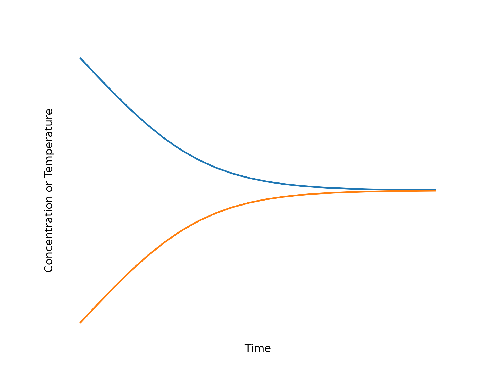
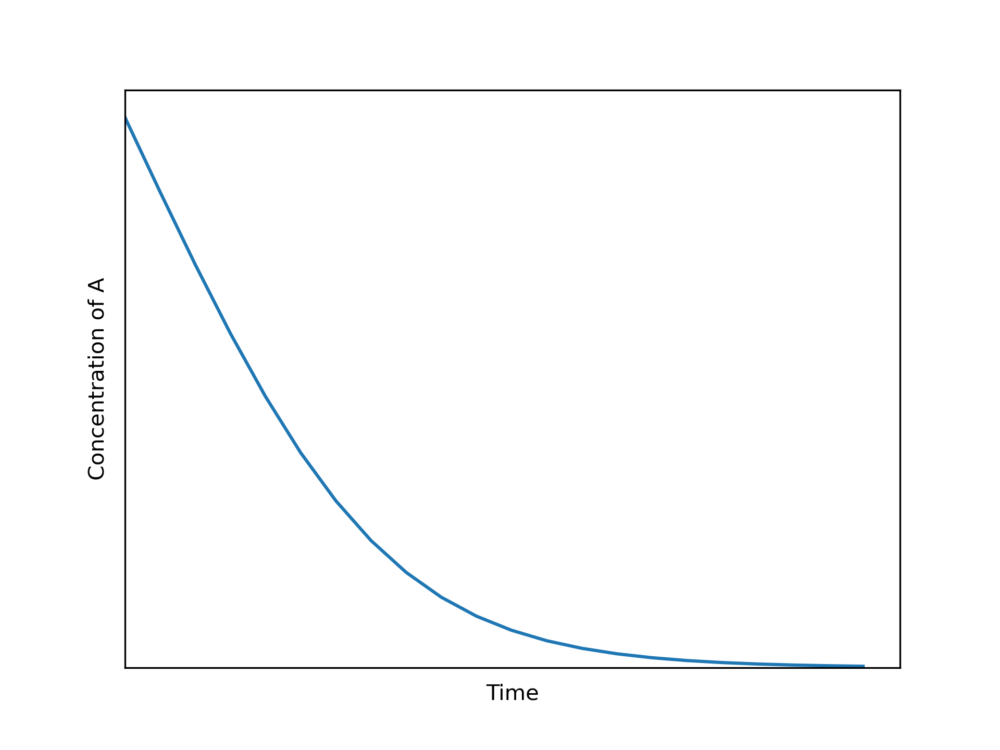
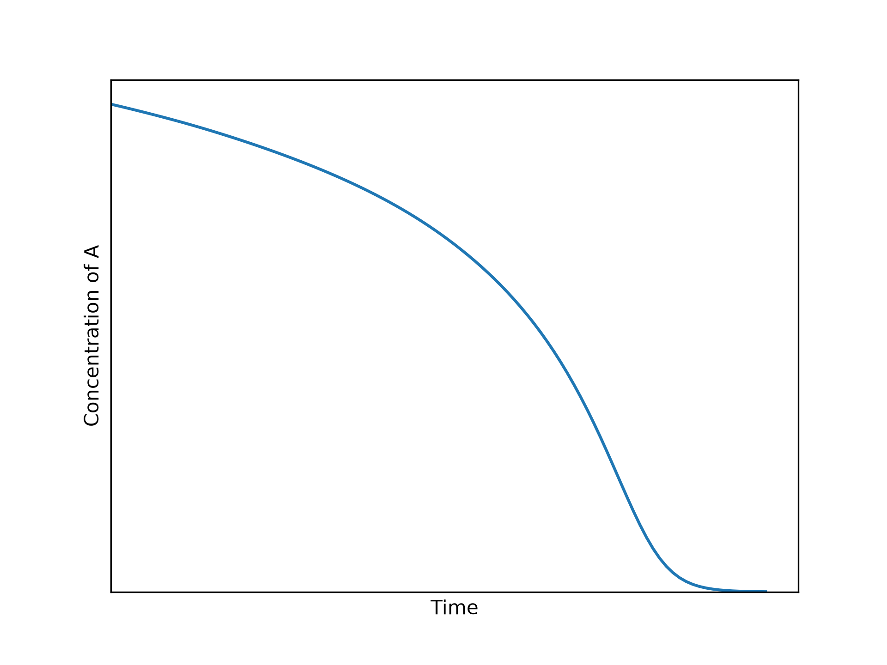
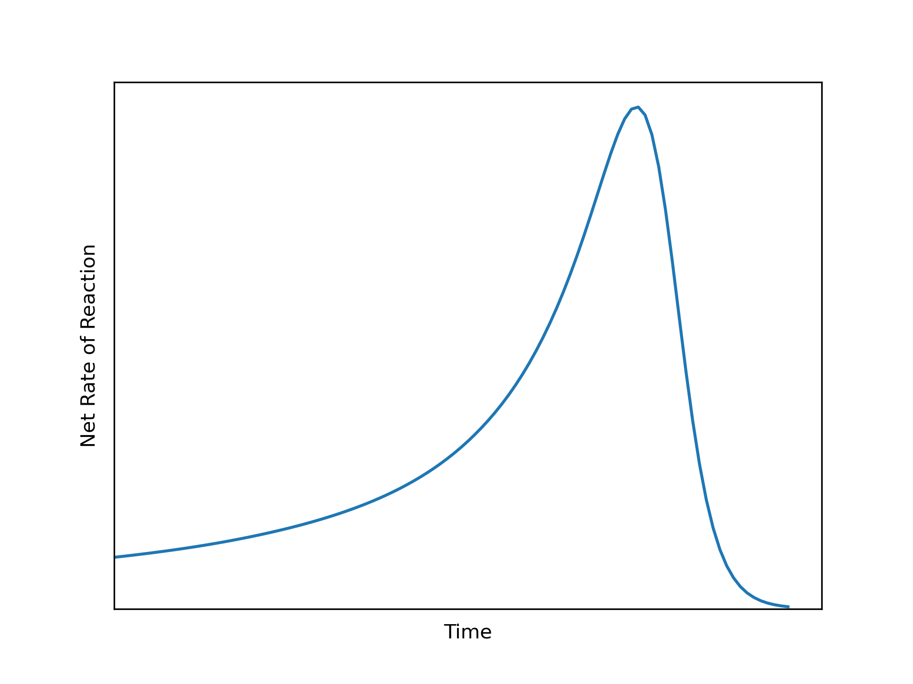
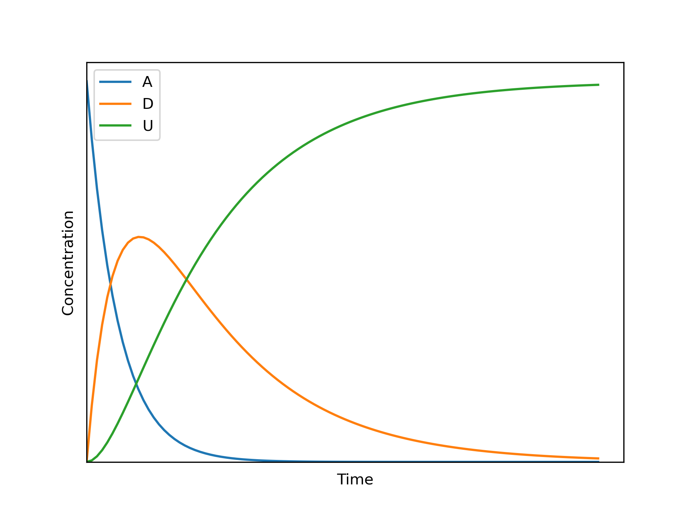
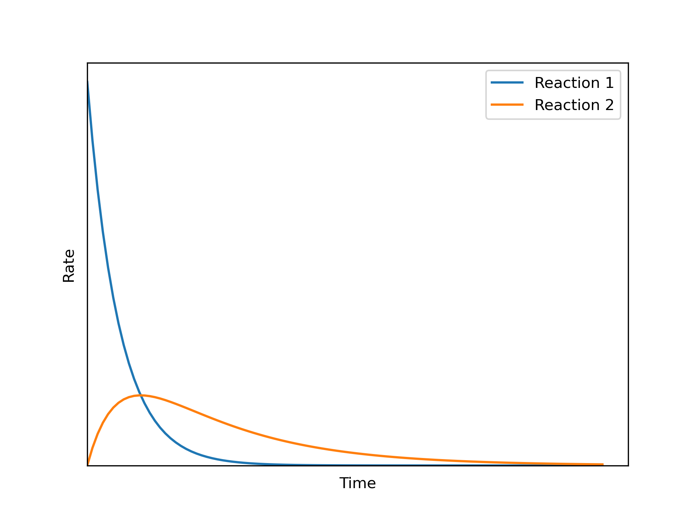

# Reactor Analysis {#sec-ch5}

Rate expressions like those considered in @sec-ch3 and @sec-ch4 are used in mathematical models for reactors. This chapter presents an introduction to the modeling of ideal chemical reactors.  It may prove helpful to keep the Learning Objectives in [Section -@sec-ch5_learning_objectives] in mind while reading it.

## Ideal Reactor Modeling {#sec-ch5_ideal_reactor_analysis}

A piece of equipment within which chemical reactions take place is called a reactor. Mathematical models of reactors are essential for reaction engineering analyses. A reactor model is a set of equations that relates what goes into a reactor (inputs) to what comes out (outputs). Other reactor parameters that affect the relationship between inputs and outputs appear within the model. 

Reactor models that make certain assumptions about the flow and mixing of fluid are called ideal reactor models, and the associated equations are called the reactor design equations. Four ideal reactor models will be considered in subsequent chapters, and their model equations are derived in @sec-apxc. Herein they are called continuous stirred tank reactors (CSTRs), batch stirred tank reactors (BSTRs), semibatch stirred tank reactors (SBSTRs), and plug-flow reactors (PFRs). This chapter focuses on general aspects of modeling a single ideal reactor.

In a batch, or closed, reactor, a fluid containing the reactants is put into the reactor before the reaction starts. The fluid is isolated while reaction takes place, then when the processing is complete, the reacted fluid is removed. In a continuous, or open, reactor, fluid containing the reactants continually flows into the reactor. Reaction takes place within the reactor, and reacted fluid continually flows out.

As described next, heat can be added or removed from both batch and continuous reactors. If the rate of heat addition or removal is such that the reacting fluid temperature is constant and the same everywhere, the reactor is isothermal. If the reacting fluid temperature is not constant, the reactor is non-isothermal. If no heat is added or removed from the reacting fluid, the reactor is adiabatic. If the pressure of the reacting fluid is constant and the same everywhere in the reactor, the reactor is isobaric, and if the fluid volume is constant, it is isochoric.

### Reactor Heat Transfer

Supplying or removing heat is an essential aspect of reactor operation, and while there are several ways of doing so, *Reaction Engineering Basics* only considers heat transfer between the reacting fluid and a separate heat exchange fluid. The two fluids do not mix; there is a solid wall that separates them, and heat is transferred through it. If the reactor has separate chambers for the reacting fluid and the heat exchange fluid, the chamber containing the heat exchange fluid is often called the shell. Sometimes, instead, the exchange fluid flows through a coil of tubing that is immersed in the reacting fluid, or a heat exchanger external to the reactor is used to transfer heat. In all of these cases, though, heat is transferred between the fluids through a solid wall.

The equations for modeling heat transfer between the reacting fluid and a heat exchange fluid are derived [Appendix -@sec-apndx_heat_exch]. The exchange fluid is assumed to be a pure, perfectly mixed fluid that either undergoes phase change (exchanges latent heat) or experiences temperature change (exchanges sensible heat), but not both. Consequently, there are two forms of the energy balance on the exchange fluid: one for exchange of latent heat and one for exchange of sensible heat. Unless the reactor is adiabatic, one of these two equations is included among the reactor design equations. To avoid duplicating their description in each of the following four chapters, they are considered here.

#### Exchange of Sensible Heat

When the exchange fluid undergoes only temperature change, the energy balance on it is given by @eq-ext_fluid_energy_bal_sens, which is reproduced here as @eq-exchange_energy_bal_sensible. The term on the left side of the equation represents the accumulation of sensible heat in the exchange fluid. The first term on the right side of the equation represents the rate at which heat is transferred from the exchange fluid to the reacting fluid. The last term represents the change in the sensible heat of the exchange fluid as it flows through the reactor. If the reactor operates at steady-state, the time derivative is equal to zero and the energy balance on the exchange fluid reduces to the form shown in @eq-exchange_energy_bal_sensible_ss.

$$
\rho_{ex} V_{ex} \tilde{C}_{p,ex}\frac{dT_{ex}}{dt} = -\dot{Q} - \dot{m}_{ex} \int_{T_{ex,in}}^{T_{ex,out}} \tilde{C}_{p,ex}dT
$$ {#eq-exchange_energy_bal_sensible}

$$
0 = \dot{Q} + \dot {m}_{ex} \int_{T_{ex,in}}^{T_{ex}} \tilde{C}_{p,ex}dT 
$$ {#eq-exchange_energy_bal_sensible_ss}

In @eq-exchange_energy_bal_sensible and @eq-exchange_energy_bal_sensible_ss the sensible heat terms are expressed using the gravimetric heat capacity of the exchange fluid, $\tilde{C}_{p,ex}$. It has units of energy per mass of exchange fluid per degree of temperature change. The sensible heat terms could also be written using either the volumetric heat capacity ($\breve{C}_p$, energy per volume of exchange fluid per degree of temperature change) or the molar heat capacity ($\hat{C}_p$, energy per mole of exchange fluid per degree of temperature change). @eq-equivalent_sens_heat_accumulation_terms shows the three equivalent ways of writing the accumulation term and @eq-equivalent_sens_heat_terms shows the three equivalent ways of writing the term for the sensible heat change.

$$
\rho_{ex} V_{ex} \tilde{C}_{p,ex}\frac{dT_{ex}}{dt}\ \Leftrightarrow\ V_{ex} \breve{C}_{p,ex}\frac{dT_{ex}}{dt}\ \Leftrightarrow\ \frac{\rho_{ex} V_{ex} \hat{C}_{p,ex}}{M_{ex}}\frac{dT_{ex}}{dt}
$$ {#eq-equivalent_sens_heat_accumulation_terms}

$$
\dot{m}_{ex} \int_{T_{ex,in}}^{T_{ex}} \tilde{C}_{p,ex}dT\ \Leftrightarrow\ \frac{\dot{m}_{ex}}{\rho_{ex}} \int_{T_{ex,in}}^{T_{ex}} \breve{C}_{p,ex}dT\ \Leftrightarrow\ \frac{\dot{m}_{ex}}{M_{ex}} \int_{T_{ex,in}}^{T_{ex}} \hat {C}_{p,ex}dT
$$ {#eq-equivalent_sens_heat_terms}

#### Exchange of Latent Heat

When the exchange fluid undergoes only phase change, the energy balance on it is given by @eq-ext_fluid_energy_bal_latent, which is reproduced here as @eq-exchange_energy_bal_latent. The term on the left side of the equation represents the accumulation of latent heat in the exchange fluid, the first term on the right side of the equation again represents the rate at which heat is transferred from the exchange fluid to the reacting fluid, and the last term represents the change in the latent heat of the exchange fluid as it flows through the reactor. As above, if the reactor operates at steady-state, the time derivative is equal to zero and the energy balance on the exchange fluid reduces to @eq-exchange_energy_bal_latent_ss.

$$
\frac{\rho_{ex} V_{ex} \Delta H_{\text{latent},ex}^0}{M_{ex}} \frac{d \gamma}{dt} = - \dot{Q} - \gamma \dot{m}_{ex} \frac{\Delta H_{\text{latent},ex}^0}{M_{ex}}
$$ {#eq-exchange_energy_bal_latent}

$$
0 = \dot{Q} + \gamma \dot{m}_{ex} \frac{\Delta H_{\text{latent},ex}^0}{M_{ex}}
$$ {#eq-exchange_energy_bal_latent_ss}

The transient energy balance in @eq-exchange_energy_bal_latent assumes only some of the exchange fluid undergoes phase change so that the fluid leaving the system is a two-phase mixture. As an example of an alternative, consider using the condensation of saturated steam to provide heat. The alternative procedure is to maintain a constant steam pressure and remove the condensate immediately as it forms. This is the assumption that is used throughout *Reaction Engineering Basics.* In this procedure, $\gamma$ is constant and equal to 1, meaning only saturated water leaves the system. In this situation, the exchange fluid energy balance is given by @eq-exchange_energy_bal_latent_ss with $\gamma$ equal to one and with $\dot{m}_{ex}$ representing the instantaneous outlet mass flow rate of condensed water.

## Quantitative Reactor Analysis {#sec-ch5_quant_analysis}

The purpose of an ideal reactor model is to relate the reactor outputs to the reactor inputs and other reactor parameters. Mole balances relate the input molar amounts to the output molar amounts, so they are always included in a reactor model. A mole balance can be written for each reagent present at any point in the system, whether or not it is present in the reactor input. That includes reagents that are reactants or products in the reactions that are occurring, as well as reagents that are neither reactants nor products in any of the reactions. The reagents that do not participate in any of the reactions can be referred to as "inerts."

Energy balances on the reacting fluid and on the separate heat exchange fluid relate their output temperatures to the reactor inputs and parameters. The energy balance on the reacting fluid also accounts for any work it performs on the surroundings. Normally, the reacting fluid and exchange fluid energy balances are also included as reactor model equations. As discussed below, there are circumstances where a reactor can be modeled without using one or both of the energy balances.

A momentum balance accounts for the conversion of kinetic energy of a flowing fluid to thermal energy. While the magnitude of this energy is negligible with respect to the terms in the energy balance, it can have a significant effect upon the pressure of the flowing fluid. Momentum balances are not needed with any of the ideal stirred tank reactors, but they are sometimes necessary when modeling ideal PFRs. When a momentum balance is not needed, the outlet pressure can be calculated from the other output variables using the equation of state. Herein that means they can be calculated using the ideal gas law or by assuming liquids to have constant density.

Collectively, the mole balances, energy balances, and momentum balance, as needed, are referred to as the design equations for the reactor. In some situations where the design equations are ordinary differential equations, the mole, energy, and momentum balances are found to contain one too many dependent variables. In these cases a differential form of the ideal gas law must be added to the reactor design equations.

The words "transient" and "steady state" are used to differentiate two modes of reactor operation. When a reactor operates at steady state, one can watch any one point in the reactor and the conditions (temperature, pressure, composition, flow rate, etc.) will not change over time. At a different point in the reactor, the conditions may be different, but they, too, will be constant over time. Putting it another way, when a reactor operates at steady state, the conditions may vary spatially, but they won't vary temporally (i. e. over time). Of the ideal reactors considered in *Reaction Engineering Basics,* only CSTRs and PFRs can operate at steady-state.

In a transient reactor one will observe changes in the conditions over time when watching any one point within the reactor. That is, within a transient reactor the conditions will vary temporally (and possibly spatially, too). The most general form of the design equations are those for transient operation. The steady-state design equations for CSTRs and PFRs represent simplifications of their transient design equations wherein all time derivatives are set equal to zero.

### Determining Which Reactor Design Equations are Needed

It is not always necessary to use all of the reactor design equations. For example, in closed systems and in open steady-state systems, mole balances do not need to be written for every reagent in the system because the amounts of the reactants and products are related through stoichiometry. As such, if $N_{ind}$ mathematically independent reactions are taking place, only $N_{ind}$ reactant or product mole balances are needed, together with a mole balance for each inert.

When sensible heat terms associated with a reacting liquid-phase solution can be expressed in terms of the mass-specific or volume-specific heat capacity of the entire solution, a mole balance for the solvent need not be included among the design equations. However, if the sensible heat terms are written in terms of molar heat capacities of the individual reagents, then the solvent must be included among those reagents, and a mole balance on the solvent does need to be included in the design equations.

A momentum balance is only needed when the reactor is an ideal PFR. Even then, if it is known that the pressure drop is negligible, the momentum balance is not needed.

If a reactor operates adiabatically there will not be an exchange fluid, and consequently an energy balance on the exchange fluid cannot be included among the design equations. If a reactor operates isothermally at a known temperature, the mole balance equations can be solved separately from the two energy balance equations, and the energy balances may not be needed. (True isothermal operation of an industrial reactor is not very common, but laboratory reactors that are used to generate kinetics data normally do operate isothermally.)

*Reaction Engineering Basics* assumes that heat transfer always involves a perfectly mixed heat exchange fluid. If the outlet temperature of that fluid is known and constant, the other reactor design equations can be solved independently from the energy balance on the exchange fluid, and the latter may not be needed. One situation where this can happen is when the exchange fluid undergoes a phase change and exchanges only the latent heat associated with the phase change. Phase changes occur at constant temperature, so, for example, if condensation of saturated steam at 1 atm is being used to supply heat to the reacting fluid, the temperature of the exchange fluid will be constant and equal to 100 °C.

Other times the heat exchange fluid may be treated as a constant temperature thermal sink with a known, constant temperature. In this situation, an energy balance on the exchange fluid is not needed. The other reactor design equations can be solved without it.

### Quantitative Reaction Engineering Tasks

The reactor design equations establish a quantitative relationship between the reactor inputs, the reactor outputs, and the reactor/process parameters. In any reactor modeling assignment, the reaction engineer is given values for some of the inputs, outputs and parameters and tasked with determining the values of the others. The reactor design equations can be used to accomplish four kinds of tasks: response, optimization, design, and parameter estimation. The difference between these tasks is found not in the equations themselves, but in how they are used. Examples of these tasks are deferred to later chapters, but they are defined here.

**Reactor response tasks**, as defined here, are the most straightforward of the four tasks. In a reactor response assignment the reaction engineer is provided with a sufficient number of reactor variables to allow calculation of all of the quantities of interest. Generally there is a single, correct answer to a reactor response assignment.

Sometimes a reactor response assignment will ask for a graph where a quantity of interest is plotted *versus* some other reactor variable. This is still a reactor response task. The only difference is that the reactor design equations may need to be solved multiple times to generate the data to be plotted. Each time the reactor design equations are solved, there is a single, correct answer, and consequently, there is a single correct graph that completes the task.

In **optimization tasks** the number of reactor variables that are specified or known is not sufficient to allow the reaction engineer to solve the reactor design equations and calculate the quantities of interest. The simplest example would task the engineer to maximize (or minimize) a quantity of interest (the target) with respect to some other reactor variable (the adjusted variable). Neither the value of the target nor the value of the adjusted variable are known. In lieu of knowing the actual value of the adjusted variable, the reaction engineer instead knows that its value is the one that maximizes the target. Typically the engineer is tasked to find both the maximum value of the target and the corresponding value of the adjusted variable. Again, there is a single correct answer to this type of reactor optimization assignment.

As noted below, the reactor design equations will be solved numerically. Consequently, there are two ways the reaction engineer could approach an optimization task. In the first, a range of values of the adjusted variable is selected and the design equations are solved repeatedly to find the value of the target corresponding to each value of the adjusted variable. Then a table is generated with one column for the target and one column for the adjusted variable. The column for the target is scanned to identify the maximum value, and the corresponding value of the adjusted variable is found in the other column in the same row. Alternatively the target variable can be plotted against the adjusted variable, and the maximum value of the target and the corresponding value of the adjusted variable are read from the graph.

Many software packages include a function (an optimizer) that finds a maximum or minimum. The second approach involves using such an optimizer. In this case, the numerical implementation of the solution would entail writing a reactor model function that receives the adjusted variable as an argument and returns target variable. That reactor model function would then be passed to the optimizer. Typically an initial guess for the optimum value of the adjusted variable would also need to be provided.

Optimization tasks can be much more complicated than simply maximizing or minimizing a quantity of interest with respect to another reactor variable. In addition to specifying multiple adjusted variables, the assignment also could impose constraints on the values of one or more reactor variables (not just the adjusted variables). Constraints are conditions that must be obeyed. An example of a constraint would be that the temperature of the heat exchange fluid cannot exceed some specified value because it would boil or decompose. Again, there are software packages that will perform constrained, multi-variable optimization.

**Reactor design tasks** are the most complicated of the tasks considered here. At the same time they can be intellectually stimulating, affording the reaction engineer an opportunity to be creative. A reactor design assignment does not provide sufficient information to solve the reactor design equations. The reaction engineer must choose values for the missing reactor variables. In more extreme cases, the assignment may provide little more than the reagents that are available and the products that are to be produced. The type of reactor to use and how to operate it may be among the choices the reaction engineer needs to make.

Design tasks almost always involve an optimization sub-task. The quantity that needs to be maximized is typically financial in nature. The goal is to maximize the rate of making profit subject to technical, regulatory, and financial constraints. Design at this level is typically taught in chemical engineering courses on plant design, and the system being optimized is typically an entire process, not just an isolated reactor.

That level of design task is well beyond the scope of *Reaction Engineering Basics*. However, simplified design tasks involving only the reactor are considered in @sec-ch10. Instead of optimizing a financial target, reactor variables that are related to the overall economics are used. For example, the cost of operating a process may scale with the temperature of that process, in which case minimizing the temperature minimizes the operating cost. In general, there is not a single correct solution to a reactor design assignment. Design tasks are inherently “open-ended,” and multiple solutions are possible and acceptable.

**Parameter estimation tasks** are inherently different from the three types of tasks described above, but they do use the same reactor design equations and those equations are solved the same way as in the other tasks. Briefly, a parameter estimation task involves using a reactor to generate data, and then using the data, together with a model for the reactor, to estimate the values of parameters such as those appearing in a rate expression. The use of the ideal reactor models to estimate rate expression parameters is examined in @sec-ch11. A similar approach can be used to estimate parameters that appear in empirical models for non-ideal reactors such as those considered in @sec-ch13.

## Reactor Analysis Workflow {#sec-ch5_workflow}

It isn't possible to solve the design equations for most meaningful reaction engineering assignments analytically. So, for the sake of consistency, the reactor design equations are solved numerically in all *Reaction Engineering Basics* assignments. The assignments in the next four chapters all involve the analysis of a single ideal reactor. They are presented using a consistent workflow, and the calculations are structured for straightforward implementation as computer code using whatever programming language and environment the reader chooses.

Each analysis begins with an assignment summary. It is a concise listing of the information provided in the assignment narrative, the information it requests, and any additional information that is needed to complete the assignment. The intention is that the assignment summary should be sufficient to complete the assignment without having to read the assignment narrative again.

Next a reactor model function is defined for solving the reactor design equations for the reactor being analyzed. The function definition begins with the selection and simplification of the reactor design equations that are needed to model that reactor. The reactor model variables to be found by solving the design equations are identified. If the design equations are initial value ordinary differential equations (IVODEs), the reactor model variables are a set of values of the independent variable (time, axial position, or cumulative volume) and corresponding sets of values of the dependent variables. For a steady-state CSTR, the design equations are a set of algebraic-transcendental equations (ATEs). If the outlet molar flow rates and outlet temperature are unknown, they are used as the CSTR model variables. If any of those outlet variables are known, an unknown inlet quantity, reactor property, or operational parameter is selected to replace it as a CSTR model variable.

The reactor model function definition continues with the identification of any additional computable unknowns that appear in the design equations. Equations are listed for calculating them using given and known constants and the reactor model variables. Any additional unknowns that are non-computable or cannot be calculated directly because they are coupled to other equations are listed next. Being non-computable, these are quantities that will need to be passed to the reactor model function as arguments.

The reactor model function will use an IVODE solver or an ATE solver to find the reactor model variables, so its definition indicates the type of solver to be used and the input it requires. One of those inputs will be a derivatives function or a residuals function that will need to be written. The reactor model function definition will describe the inputs it requires, the calculations it performs, and the values it returns. The final part of the reactor model function definition identifies any additional quantities that must be made available to the derivatives or residuals function as global variables because they cannot be passed as arguments. 

Additional coupled unknowns identified in the reactor model function above must satisfy the reactor design equations [and]{.underline} separate implicit or explicit ATEs. A coupled unknowns function is defined next to accomplish this. Its definition parallels the definition of the reactor model function. A deliverables function is the last function to be defined. The term "deliverables" is used here to refer to the things requested in the assignment narrative or that are needed in order to complete the assignment. The deliverables function uses the reactor model function and coupled unknowns function to solve the design equations as necessary. Then it uses the results they return to calculate any other quantities that are needed to complete the assignment. The deliverables function also generates any requested graphs.

The next step in the workflow is to implement the calculations in code and execute it. Specifics for this step are not provided in *Reaction Engineering Basics* so that each reader may choose to use the programming language and environment that they prefer. Each chapter does, however, provide links to *Reaction Engineering Basics, The Course* where Python and Matlab implementations of the calculations are presented and discussed. 

The final step in the workflow is to present, interpret, and discuss the results. This typically requires a qualitative analysis that explains the significant features of the computed results. It is essential that the final results make sense on a physical basis. If the assignment requires the engineer to make an assessment or recommendation, the basis for it is developed in the discussion.

The workflow defined here may not be entirely clear at this point. The examples included in the next four chapters will illustrate its use and should remove any abiguities. It is intended to be general enough to apply to any assignment involving the analysis of a single ideal reactor, but should not be viewed as a rigid recipe that must be followed exactly. Later chapters of the book will add items to this workflow as new reactor systems or engineering tasks are introduced.

## Qualitative Reactor Analysis {#sec-ch5_qual_analysis}

Qualitative analysis focuses upon how  composition and temperature vary as reactions progress, but not on the magnitude of the variations. In batch reactors the time during which reactions occur is measured using clock time. The total reaction time is the difference between the clock time when the reaction starts and the clock time when it ends. It is customary to define an elapsed time, $t$, as being equal to zero when the reaction starts, in which case the total reaction time is equal to the elapsed time when the reaction stops. 

In continuous flow systems, the time during which reactions occur is equal to the amount of time that the reagents spend in the reactor. One measure of the time reagents spend in the reactor is the space time, $\tau$, defined in @eq-space_time. For flow reactors, the mixing of the reacting fluid while it is in the reactor is also critical to a physical understanding of reactor performance. That aspect of qualitative analysis is considered in the chapters on ideal flow reactors. This chapter focuses on the variation of concentrations and temperatures as functions of reaction time or space time.
$$
\tau = \frac{V}{\dot{V}_{in}}
$$ {#eq-space_time}

Because the analysis is qualitative, the rate expression is not used directly. Instead, the general behavior of reactions must be used, noting that for a typical reaction, holding all other conditions constant,

* the rate will increase if the temperature of the reacting system is increased,
* the rate will decrease if the concentration of one or more reactants decreases,
* the rate is not strongly affected by the concentration of the products if the reaction is irreversible,
* the rate decreases as the concentration of the products increases if the reaction is reversible,
* the equilibrium constant decreases as the temperature increases if the reaction is exothermic, and
* the equilibrium constant increases as the temperature increases if the reaction is endothermic.

Of course, not all reactions behave “typically.” The qualitative analysis methodology presented here also can be applied to atypical reactions if the general behavior above is appropriately adjusted. Atypical behavior can often be recognized by examining the rate expression, if it is available. For example, if the rate increases as the concentration of a *product* increases, the reaction is said to be autocatalytic, and the qualitative behavior can be adjusted accordingly. It is important to note, however, that as a reaction with atypical kinetics approaches thermodynamic equilibrium, it will asymptotically approach "typical" behavior.

The goal of qualitative analysis is to use understanding of physical effects to predict how the concentrations of reagents and the temperature vary as a function of reaction time or space time. This is easiest and most reliable when only one reaction is taking place in a reactor that operates either adiabatically or isothermally. When only one exothermic reaction is taking place adiabatically, the temperature will rise continually since the reaction is releasing heat, and that heat is not being removed. Similarly, when only one endothermic reaction takes place adiabatically, the temperature will drop continually. When a reactor operates isothermally, the temperature does not change as the reaction proceeds and does not need to be considered. When a reactor is neither adiabatic nor isothermal, qualitative analysis can be more difficult with greater uncertainty in the results.

Plots of a reagent's concentration or of the temperature versus reaction time will begin at a reaction time of zero. At time zero, the concentration or temperature will be located either at the orign or on the positive y-axis. The initial slope and curvature, and any changes in slope or curvature will depend upon the system being analyzed. Nonetheless, as the reaction approaches completion the curves must either be decreasing with a concave upward curvature or increasing with a concave downward shape as illustraed in @fig-ch5_final_shape. It can be seen that in both cases the quantity being plotted asymptotically approaches its final value. The goal of qualitative analysis, then, is to predict the shape of the curves between the y-axis and the point where they attain one of those two shapes.

{#fig-ch5_final_shape width="80%"}

The slope and shape plots of concentration or temperature change when the reaction rate changes. Important variables for a qualitative analysis are those that affect the reaction rate. If the reactions are irreversible, then only the concentrations of reactants are important, but if they are reversible, the concentrations of both reactants and products may be important. Similarly, if the reactor operates isothermally, then temperature is not important, but if the reactor is adiabatic or otherwise non-isothermal, the temperature is important.

To begin a qualitative analysis, a set of axes is drawn to plot each important variable versus reaction time. Often it is also useful to draw a set of axes to plot reaction rate versus reaction time, too. Then the initial values of the important variables are plotted as points on their respective y-axes. The axes need not have a scale, and as such, plotted values only need to indicate whether the quantity is initially large, intermediate, small, or zero in value.

Next, the initial rate of each reaction is determined to be either positive (if every reactant concentration is initially non-zero) or zero (if any reactant concentration is initially zero). The initial rates of the reactions determine the initial slopes of the concentration vs. time and temperature vs. time curves. Specifically curves for concentrations of reactants will have negative initial slopes, and curves for concentrations of products will have positive initial slopes. If a reagent is a reactant in one reaction and a product in another, its initial slope will depend on the relative rates of the two reactions. That may not be known, and it may be necessary to consider both possibilities. The initial slope of the temperature vs. time curve will be positive if the reaction is exothermic and negative if it is endothermic.

To determine the initial curvature of the graphs, the values of the important variables after a very small interval of time are considered. The critical questions are whether each of the reaction rates at the end of the interval will be larger or smaller than their initial values. That then determines whether the change in each important varible during the next small interval of time will be greater than, equal to, or less than the change during the first small interval of time. So, for example, if an important variable decreased during the first interval and it will decrease more during the next interval, then initially that variable will be decreasing with a concave downward shape. If it will decrease less during the next interval, then initially that variable will be decreasing with a concave upward shape. If it will decrease by the same amount during the next interval, then there will be no curvature (i. e. it will be a straight line) at least for some initial period of time. Similarly, if an important variable increases more during the second interval than during the first, it is increasing with a concave upward shape, and if it increases less during the second interval than during the first, it is increasing with a concave downward shape.

That may complete the qualitative analysis if the curves are all either decreasing with a concave upward shape or increasing with a concave downward shape as shown in @fig-ch5_final_shape. If not, it is necessary to infer what must happen to get to either of those shapes (i. e. pass through an inflection point, minimum, maximum, etc.), and explain why that happens on a physical basis.

In *Reaction Engineering Basics*, qualitative analyses of this type often will be used in the discussion of the results of a quantitative analysis. In that context, qualitative analysis can be used to answer the question, "Do these results make sense?" or "Why does that graph have that shape?" Additionally, performing a qualitative analysis after the quantitative analysis helps new reaction engineers develop a physical understanding of results that complements the mathematical understanding obtained in quantitative analysis. As a reaction engineer gains experience and develops the necessary skills and understanding, qualitative analysis can often provide insight and guidance before beginning an assignment. This is particularly true for reactor design tasks like those described above.

## Learning Objectives and Examples {#sec-ch5_learning_objectives}

Upon completion of this chapter, readers should

* know the definition/defining equation for steady-state/transient/isothermal/adiabatic/non-isothermal/isobaric/isochoric reactor operation, sensible/latent heat, and response/optimization/design/parameter estimation tasks
* be able to qualitatively describe how composition, temperature, and related quantities evolve with reaction time, given appropriate information about rate expressions, reaction exothermicity, and reactor heat exchange

Qualitative analyses will be used often in subsequent chapters to provide a physical interpretation of the results of quantitative analyses. Two examples are provided here. The first illustrates analysis of a single reaction where both compositional and thermal effects are important. The second involves two reactions in series where thermal effects are not significant.

### Qualitative Analysis of a Reversible, Exothermic Reaction {#sec-ch5_ex1}

Consider the typical reaction, A → Z, which is irreversible and exothermic. Suppose that reaction is run in an adiabatic reactor starting with pure A. Sketch the concentration of A, and the temperature versus reaction time. Describe the shape of each graph noting slopes, curvature, inflection points, etc. Then explain the shape on a physical basis.

---

**Analysis and Discussion**

Generally the reaction rate is affected by composition and temperature. Here the reaction is irreversible and the kinetics are typical, so the only important concentration is that of the reactant, A. The reaction is exothermic and the reactor is adiabatic, so the temperature will increase due to reaction, and consequently the temperature is also important.

At the start of the reaction, the concentration of A and the temperature will both have positive values. The corresponding rate will be positive, so initially the concentration of A is decreasing because it is a reactant, and the temperature is increasing because the reaction is exothermic and the reactor is adiabatic.

So after a very brief interval of time, the concentration of A will have decreased and the temperature will have increased. The curvature of the reactant concentration vs. time and temperature vs. time graphs will depend upon whether the reaction rate at the end of the small interval of time is greater of less than the initial rate. However, the decrease in reactant concentration and the increase in temperature have opposing effects on the rate. Decreasing reactant concentration decreases the composition term in the rate expression while increasing the temperature increases the rate through the Arrhenius term.

In a qualitative analysis it isn’t possible to know whether the concentration decrease will have the greater effect leading to a rate decrease or whether the temperature increase will have the greater effect leading to a rate increase. Both possibilities must be considered.

If the decrease in reactant concentration predominates over the increase in temperature the rate will decrease. That means that the concentration of A will decrease less during the next brief interval of time so that initially (over these brief time intervals) the concentration of A is decreasing with a concave upward shape. At the same time, the temperature will increase less during the second brief interval than during the first, so initially the temperature is increasing with a concave downward shape. These trends can continue for as long as required until eventually both the concentration and the temperature will asymptotically approach constant values as shown in @fig-ch5_ex1_conc_profile_r_decreasing.

::: {#fig-ch5_ex1_conc_profile_r_decreasing layout-ncol=2 .center}

{}

{}

Concentration (left) and temperature (right) profiles during the adiabatic conversion of A to Z under conditions where the concentration dependence of the rate predominates over the temperature dependence.

:::

The other possibility is that the increase in temperature predominates over the decrease in reactant concentration and the rate increases. In this case the concentration initially decreases with a concave downward shape and the temperature initially increases with a concave upward shape. This can be seen at lower times in the concentration and temperature profiles shown in @fig-ch5_ex1_conc_profile_r_increasing. Those trends cannot continue indefinitely because they would lead an infinite negative concentration and an infinite positive temperature. Very clearly, and as shown in the figure, the curves must pass through an inflection point where their curvatures invert. The trends after the inflection point can continue for as long as required until eventually both the concentration and the temperature will asymptotically approach constant values.

::: {#fig-ch5_ex1_conc_profile_r_increasing layout-ncol=2 .center}

{}

{}

Concentration (left) and temperature (right) profiles during the adiabatic conversion of A to Z under conditions where the temperature dependence of the rate initially predominates over the concentration dependence.

:::

The physical reason for the inflection point can be understood by considering the rate as a function of reaction time, shown in @fig-ch5_ex1_rate_profile. Initially the increase in temperature predominates over the decrease in reactant concentration and the rate increases. That cannot continue indefinitely, however, because eventually the reactant will run out and at which point the rate must equal zero. So as the reaction proceeds, the temperature effect becomes less and less predominant until a point is reached where the effects of the decreasing concentration and increasing temperature become equal. At that point, the rate reaches a maximum. The reaction time where the maximum rate occurs coincides with the times where the inflection points occur in the concentration and temperature profiles (@fig-ch5_ex1_conc_profile_r_increasing). At times beyond that point, the concentration term predominates over the temperature term. From this point on, the analysis is the same as first possibility considered above wherein the concentration term predominated from the start. Specifically the concentration decreases with a concave upward shape, the temperature increases with a concave downward shape, and they both asymptotically approach constant values at sufficiently large reaction times.

{#fig-ch5_ex1_rate_profile width="80%"}

A qualitative analysis is not always conclusive when used to predict the behavior of a system. That was seen here where two possible behaviors were identified depending on whether concentration effects on the rate or temperature effects on the rate predominate initially. In this case, one would expect the heat of reaction to play a significant role in determining which effect predominates. If the heat of reaction was equal to zero, the reaction would become isothermal (no heat released or absorbed) and there would not be a temperature effect. The greater the heat of reaction, then, the more likely that the temperature effect would predominate over the concentration effect.
Even though qualitative analysis may not offer a unique prediction of reactor behavior, it can still be extremely helpful for understanding the actual observed behavior of a reactor or the behavior predicted by a quantitative analysis. For example, if a reaction engineer was studying or modeling an reaction system like that considered here, and the engineer observed concentration and temperature profiles like those shown in @fig-ch5_ex1_conc_profile_r_increasing, the qualitative analysis presented here provides valuable physical insight into why the system performs as it does.

### Qualitative Analysis of Series Reactions {#sec-ch5_ex2}

Suppose the irreversible series reactions given in equations (1) and (2) take place in the liquid phase in an isothermal reactor. Only reagent A is present initially, and the kinetics of both reactions are typical. On a single set of axes, sketch the concentrations of A, D, and U versus reaction time. Describe the shape of each curve noting slopes, curvature, inflection points, etc. Then interpret the results in physical terms.

$$
A \rightarrow D \tag{1}
$$

$$
D \rightarrow U \tag{2}
$$

---

Analysis and Discussion

Generally the reaction rate is affected by composition and temperature, but the reactor in this system operates isothermally so temperature is not important. The reactions are irreversible and the kinetics are typical, so only the concentrations of the reactants, A and D, are important in terms of the qualitative analysis, but the assignment narrative requests that the concentration of U be included as well.

It is worth noting that because the rate of reaction (1) depends only on the concentration of A, it will track with it. That is, if at some reaction time the concentration of A is increasing with a concave upward shape, the rate of reaction (1) will also be increasing with a concave upward shape at that point. The same relationship holds between the concentration of D and the rate of reaction (2).

At the start of the reaction, the concentration of A will have a positive value while the concentrations of both D and U will equal zero. The initial rate of reaction (1) will be positive, but because the initial concentration of D is zero, the initial rate of reaction (2) will equal zero. So to summarize, the concentration of A will start with a positive value that is decreasing. The concentration of D will start at zero, and it will be increasing because it is being produced by reaction (1). The concentration of U will start at zero and will not be changing initially because the rate of reaction (2) is zero initially.

After a very brief interval of time the concentration of A will have decreased due to its participation in reaction (1). At the end of that brief interval, the concentration of A will be smaller than its initial value, and since the rate of reaction (2) tracks with the concentration of A, the rate of reaction (1) will be smaller than the its initial rate. Consequently, at the start of the next brief interval of time, the rate of reaction 1 will be smaller than at the start of the first interval, and therefore, the concentration of A will decrease by less during the second interval than it did during the first interval. In other words, the concentration of A will initially decrease with a shape that is concave upward. This trend can continue for as long as required until eventually the concentration of A will asymptotically approach zero as shown in @fig-ch5_series_conc_profiles.

{#fig-ch5_series_conc_profiles width="80%"}

Since the rate of reaction (1) tracks with the concentration of A, the rate of reaction (1) decreases continuously by smaller and smaller amounts. The concentration of D, and hence the rate of reaction (2) starts at zero. So during the first very brief interval of time, the concentration of D will increase because it is being produced by reaction (1) and not being consumed by reaction (2). At the start of the next brief interval of time, less D will be generated by reaction (1) due to its decreasing rate, and more will be consumed by reaction (2), due to its increasing rate. The net effect is that the concentration of D will increase during the second time interval, but by less than during the first interval.

In other words, the concentration of D initially will be increasing from zero with a curvature that is concave downward. The concentration of D cannot continue to increase indefinitely because eventually all of the D must be converted to U. Instead, the concentration of D must pass through a maximum where it changes from increasing to decreasing. In addition, it must pass through an inflection point where its shape changes from being concave downward to concave upward. That trend can then continue for as long as required until eventually the concentration of D asymptotically approaches zero as shown in @fig-ch5_series_conc_profiles.

The physical reason for the maximum in the concentration of D can be understood by considering how the rates vary over time. During the period where the concentration of D is increasing with a concave downward curvature, the rate of reaction (2) is greater than the rate of reaction (1), but the difference is getting smaller and smaller leading to the concave downward curvature. The maximum in the concentration of D occurs at the reaction time where the two rates become equal.
This is consistent with the change in the concentration of U which is only produced by reaction (2). Up to the time where D reaches a maximum. the rate of reaction (2), which tracks the concentration of D, is increasing, so the concentration of U increases by larger and larger amounts. It starts at zero and increases with a concave up curvature up to the time where D reaches a maximum. Beyond the maximum, the rate of reaction (2) is decreasing, so the concentration of U increases by smaller and smaller amounts. That is, at the point where D reaches a maximum and the rates of reactions (1) and (2) become equal, the concentration of U passes through an inflection point. After that, the concentration of U is increasing with a concave downward curvature. That trend can continue for as long as required until eventually the concentration of U asymptotically approaches the initial concentration of A as shown in @fig-ch5_series_conc_profiles. (It approaches the initial concentration of A due to the one-to-one stoichiometry an irreversibility of the reactions.)

It remains to provide the physical reason for the change in the shape of the curve for the concentration of D from concave down to concave up after the maximum in the D concentration. The reason is more subtle, and cannot be seen directly in @fig-ch5_series_conc_profiles. The concentrations in @fig-ch5_series_conc_profiles correspond to reaction rates that become equal when the concentration of D reaches its maximum value as shown in @fig-ch5_series_rate_profiles.

{#fig-ch5_series_rate_profiles width="80%"}

Immediately after the maximum, the curve for the concentration of D remains concave down because the rate of reaction (1) is decreasing faster than the rate of reaction (2). This is evidenced in @fig-ch5_series_rate_profiles by the widening gap between the two rates just after the maximum. However as reactant A approaches complete conversion, the rate of reaction (1) decreases more slowly. At some point the two reaction rates decrease at equal rates, corresponding to the inflection point. This is the point in @fig-ch5_series_rate_profiles where the gap between the two rates is greatest. After that, the rate of reaction (2) decreases faster than the rate of reaction 1, and the curve becomes concave up.

## Symbols Used in @sec-ch5

| Symbol | Meaning |
|:-------|:--------|
| $\tilde{C}_p$ | Mass-specific heat capacity of a fluid. |
| $\breve{C}_p$ | Volume-specific heat capacity of a fluid. |
| $\hat{C}_p$ | Molar heat capacity of a fluid. |
| $ex$ | Subscript denoting a property of the heat exchange fluid. |
| $in$ | Subscript denoting a property of an inlet stream. |
| $\dot{m}$ | Mass flow rate of a fluid. |
| $M$ | Molecular weight. |
| $\dot{Q}$ | Rate of heat transfer from the exchange fluid to the reacting fluid. |
| $t$ | Elapsed time. |
| $T$ | Temperature of a fluid. |
| $\rho$ | Density of a fluid. |
| $V$ | Volume of a fluid. |
| $\dot{V}$ | Volumetric flow rate of a fluid. |
| $\Delta H_{\text{latent}}^0$ | Molar latent heat of a fluid. |
| $\gamma$ | Vapor fraction of a fluid. |
| $\tau$ | Space time of a flow reactor. |

: {tbl-colwidths="[20,80]"}
