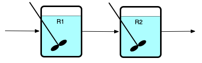
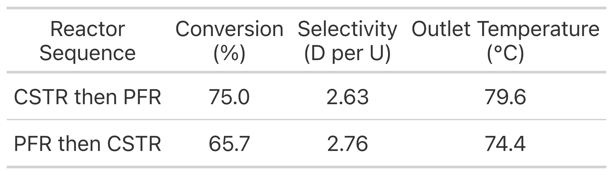
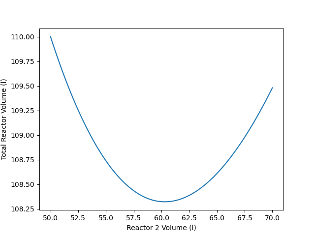
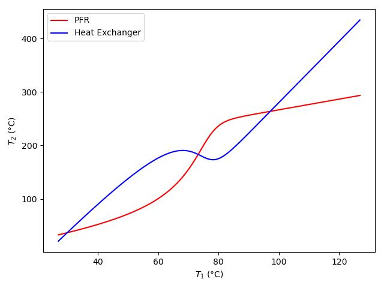
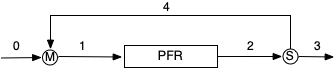

# Reactor Networks {#sec-ch12}

The systems considered up to this point in *Reaction Engineering Basics* consisted of an isolated reactor. In continuous processes, the fluid flows through different kinds of equipment, not just a reactor. This chapter considers the analysis of some simple flow networks that include one or more reactors. It may prove helpful to read the learning objectives in @sec-ch12_learning_objectives before reading the chapter.

## Multiple Reactor Networks {#sec-ch12_multiple_reactors}

A chemical process can use more than one reactor to process a feed stream. The most common configurations of multiple reactors are series networks of reactors and parallel networks of reactors, as illustrated in @fig-reactor_networks. Panel (a) of that figure shows two CSTRs in series where the reactors are labeled R1 and R2. Series networks are not limited to two reactors; there can be any number of reactors as long as the outlet from each one becomes the feed to the next. Series networks of PFRs are equally possible.

::: {#fig-reactor_networks layout-ncol=2 layout-valign="center"}

{#fig-series_reactors width="90%"}

{#fig-parallel_reactors width="90%"}

Schematic representation of CSTRs in series and PFRs in parallel. "R" denotes the reactors, "S" denotes stream splitters and "M" denotes stream mixers.
:::

The (b) panel of @fig-reactor_networks shows two PFRs, labeled R1 and R2, that are connected to form a parallel network. Again, there can be any number of reactors in a parallel network, as long as a single stream is split, and distributed among the reactors, and as long as the outlet streams from all of the reactors are mixed into a single product stream. In the figure, S is used to denote a stream splitter and M is used to denote a stream mixer. Parallel networks can also be created using CSTRs.

Another possibility with series or parallel reactor networks is that the reactors might not be of the same type. For example an engineer could design a CSTR in series with a PFR with either of the two reactors first in the series network. Similarly, a CSTR in parallel with a PFR is also possible.

Reactor networks that are neither series nor parallel are also possible. Such networks are not common in commercial processing. However, [Chapter -@sec-ch13_zoned_model] shows how reactor networks can be used to model a single, non-ideal reactor. In that situation, the reactor network need not be a series or parallel network.

### Qualitative Behavior of Reactor Networks

A *series* network of adiabatic PFRs is equivalent to a single adiabatic PFR with a volume equal to the total volume of the series PFRs. If the individual PFRs are heated or cooled, or if there is heating or cooling between one PFR outlet and the next PFR inlet, the performance of the network will be different from a single PFR with the same total volume.

In a *parallel* network of equally-sized PFRs where the feed is evenly split among the reactors, the temperature and concentration profiles along the length of each reactor are the same as for the other reactors. This assumes that the PFRs are either adiabatic, or they all pass through a single shell within which a perfectly mixed exchange fluid flows. It won't be true if the heat exchange is different in different reactors.

A *series* network of isothermal or adiabatic CSTRs becomes equivalent to a single PFR with the same total volume as the number of CSTRs approaches infinity. A series network of CSTRs is sometimes referred to as a CSTR cascade. @fig-plug_flow showed that because there is no mixing in the axial direction in a PFR, the fluid can be envisioned as small batch reactors that enter the reactor one after the other, with each batch reactor moving from the inlet to the outlet at a velocity equal to the velocity of the fluid flowing in the PFR. Another way to think of this is that the little BSTRs are stationary CSTRs, and the fluid moves from one to the next. Since each CSTR is differentially small, it is easy to understand why an infinite series of CSTRs is equivalent to a PFR.

If each of the CSTRs in a series network are heated or cooled by exchange of heat with a perfectly mixed exchange fluid, the series will not approach the bahavior of a PFR as the number of CSTRs approaches infinity.

In a *parallel* network of equally sized and equally cooled/heated CSTRs, if the feed is divided equally among the reactors, the contents of every reactor will be the same.

Finally, if parallel reactors are used, the mixing streams of unequal conversion should be avoided. Doing so effectively undoes some of the reaction that has taken place because after mixing the effective conversion of the mixed stream will be lower than that in the stream with the higher conversion before mixing.

### Quantitative Analysis of Reactor Networks

It is good practice to label each flow stream in the process and each piece of equipment. Variables representing flow rates, temperatures, pressures, etc. can then be subscripted using the labels to denote the stream or equipment to which the variable applies. Here, only steady-state operation will be considered, and the only equipment in the system other than reactors are stream splitters, stream mixers, and heat exchangers. Quantitative analysis of a reactor network requires writing the reactor design equations for each reactor in the network and writing mole and energy balances for every splitter, mixer and heat eachanger in the network.

The design equations for any one of the reactors in a network are no different from those used in the analysis of an isolated reactor. The design equations make no assumptions about where the feed is coming from or where the effluent is going. Thus, the generation of the reactor design equations for each reactor proceeds as described in [Chapter -@sec-ch5_ideal_reactor_analysis].

#### Stream Splitters and Mixers {#sec-ch12_splitters_mixers}

A stream splitter will have one inlet stream and two or more outlet streams. A steady-state mole balance on reagent $i$ takes the form shown in @eq-splitter_mol_bal where $N_{out}$ denotes the number of outlet streams and "out" indexes those streams. It is important to recognize that the temperatures of all entering and leaving streams are equal. As such, instead of writing energy balances, the temperatures of each of the streams leaving the splitter can simply be set equal to the temperature of the stream entering the splitter, @eq-splitter_energy. Similarly, a splitter does not change concentration (or partial pressure); the concentration (or partial pressure) of reagent $i$ in every outlet flow stream is equal to its concentration (or partial pressure) in the input stream.

$$
0 = \dot{n}_{i,in} - \sum_{N_{out}} \dot{n}_{i,out}
$$ {#eq-splitter_mol_bal}

$$
T_{out} = T_{in} \text{ ; } \quad out = 1...N_{out}
$$ {#eq-splitter_energy}

A stream mixer will have two or more inlet streams and one outlet stream. A steady-state mole balance on reagent $i$ takes the form shown in @eq-mixer_mol_bal where $N_{in}$ denotes the number of outlet streams and "in" indexes those streams. An energy balance takes the form shown in @eq-mixer_energy_bal. It simply assumes that no heat is added or lost, so the net energy gained by the inlet streams as they mix to form the outlet stream is zero. In both equations, $\displaystyle \sum_{in}$ denotes a summation of all of the inlet streams. For liquid flow streams, equivalent energy balances can be written in terms of the volumetric heat capacity or the gravimetric heat capacity, @eq-mixer_energy_volume and @eq-mixer_energy_mass.

$$
0 = \dot{n}_{i,out} - \sum_{N_{in}} \dot{n}_{i,in}
$$ {#eq-mixer_mol_bal}

$$
0 = \sum_i \sum_{in} \left(\dot{n}_{i,in} \int_{T_{in}}^{T_{out}} \hat{C}_{p,i} dT \right)
$$ {#eq-mixer_energy_bal}

$$
0 = \sum_{in} \left(\dot{V}_{in} \int_{T_{in}}^{T_{out}} \breve{C}_p dT \right)
$$ {#eq-mixer_energy_volume}

$$
0 = \sum_{in} \left(\rho \dot{V}_{in} \int_{T_{in}}^{T_{out}} \tilde{C}_p dT \right)
$$ {#eq-mixer_energy_mass}

#### Heat Exchangers {#sec-ch12_heat_exchangers}

Entire books and courses are devoted to heat transfer processes, and there are numerous variations in the design of heat exchangers. The discussion here will be limited to a simple heat exchanger, with two streams that do not mix flowing through it in opposite directions (counter-current flow) as depicted in @fig-heat_exchanger_schematic. The fluids do not mix within the heat exchanger, but heat is transferred from one to the other through a wall that separates them. At all locations within the heat exchanger the same fluid is the hotter one.

{#fig-heat_exchanger_schematic width="40%"}

Denoting the streams as 1 and 2, mole balances take the form shown in Equations [-@eq-heat_exchanger_mol_bal_1] and [-@eq-heat_exchanger_mol_bal_2]. The energy balance, @eq-heat_exchanger_energy_bal, assumes no heat loss, and simply requires that the rate at heat is added to stream "1" must equal the rate at which heat is removed from stream "2." Those heats can be expressed in terms of molar heat capacities, volumetric heat capacities, or gravimetric heat capacities, Equations [-@eq-sensible_heat_molar], [-@eq-sensible_heat_volumetric], and [-@eq-sensible_heat_gravimetric].

$$
0 = \dot{n}_{i,1,in} - \dot{n}_{i,1,out}
$$ {#eq-heat_exchanger_mol_bal_1}

$$
0 = \dot{n}_{i,2,in} - \dot{n}_{i,2,out}
$$ {#eq-heat_exchanger_mol_bal_2}

$$
0 = \dot{Q}_{1} - \dot{Q}_{2}
$$ {#eq-heat_exchanger_energy_bal}

$$
\dot{Q}_{x} = \sum_i \left( \dot{n}_{i,x,in} \int_{T_{x,in}}^{T_{x,out}}\hat{C}_{p,i} dT\right); \qquad x = 1 \text{ or } 2
$$ {#eq-sensible_heat_molar}

$$
\dot{Q}_{x} = \dot{V}_{x,in} \int_{T_{x,in}}^{T_{x,out}} \breve{C}_{p,x} dT; \qquad x = 1 \text{ or } 2
$$ {#eq-sensible_heat_volumetric}

$$
\dot{Q}_{x} = \rho_{x} \dot{V}_{x,in} \int_{T_{x,in}}^{T_{x,out}} \tilde{C}_{p,x} dT; \qquad x = 1 \text{ or } 2
$$ {#eq-sensible_heat_gravimetric}

If the temperatures of only two of the four streams are known, an additional equation for the rate of heat transfer may be needed. The physical design and dimensions of the heat exchanger and the properties of the fluids determine how much heat is transferred from stream 1 to stream 2. A common way to express this mathematically is in the form of expressions for the rate of heat transfer like @eq-heat_exch_rate_log_mean or @eq-heat_exch_rate_arith_mean. The log-mean and arithmetic mean temperature differences appeaing in those equations are defined in @eq-log_mean_temp_diff and @eq-arith_mean_temp_diff. The log-mean temperature diference becomes indeterminate if $\left(T_{1,in} - T_{2,out}\right) = \left( T_{1,out} - T_{2,in} \right)$. In this situation it should be taken to equal either $\left(T_{1,in} - T_{2,out}\right)$ or $\left( T_{1,out} - T_{2,in} \right)$.

$$
\dot{Q}_{x} = U_{LM}A \Delta T_{LM}; \qquad x = 1 \text{ or } 2
$$ {#eq-heat_exch_rate_log_mean}

$$
\dot{Q}_{x} = U_{AM}A \Delta T_{AM}; \qquad x = 1 \text{ or } 2
$$ {#eq-heat_exch_rate_arith_mean}

$$
\Delta T_{LM} = \frac{\left(T_{1,in} - T_{2,out}\right) - \left( T_{1,out} - T_{2,in} \right)}{\ln{\displaystyle\frac{T_{1,in} - T_{2,out}}{T_{1,out} - T_{2,in} }}}
$$ {#eq-log_mean_temp_diff}

$$
\Delta T_{AM} = \frac{\left(T_{1,in} - T_{2,out}\right) + \left(T_{1,out} - T_{2,in}\right)}{2}
$$ {#eq-arith_mean_temp_diff}

Once reactor design equations have been written for every reactor and for each heat exchanger, stream splitter and stream mixer, the resulting set of equations must be solved. The manner in which this is accomplished will depend upon the specific network being analyzed and the information that is known about that network. In some situations, it may be possible to solve the reactor design equations for the reactors and the mole and energy balances for the other equipment sequentially. In other situations the reactor design equations for one reactor may be coupled with the reactor design equations for another reactor or with the mole and energy balances for one or more of the other pieces of equipment. In thise cases, the coupled equations must be solved simultaneously.

In other words, there isn't a single "recipe" for solving the model equations. Once all of the equations have been formulated, they can be inspected to determine whether any of them can be solved independently of the others. If so, that can be done, after which it will be necessary to devise a strategy for solving the remaining equations.

### Use of Reactor Networks

There are different reasons why a reactor network might be used instead of a single reactor. One possibility is expanding the capacity of an existing chemical plant. If a company decides to substantially increase the amount of material they are processing, the existing reactor may not be able to accommodate the increase. Increasing the flow rate to process more reactant will lower the residence time, and that generally will lower the conversion, offsetting the increased flow. It may make sense to continue using the existing reactor and add a second reactor to the process rather than eliminating the existing reactor and replacing it with a single, larger reactor.

In other cases, multiple reactors might be part of the original design. An example is the use of PFRs where it is necessary to heat or cool. It is quite common to use a large number of reactor tubes arranged in parallel, with a single shell surrounding all the tubes to provide heat transfer.

As described in [Chapter -@sec-cstrs_vs_pfrs], when a single CSTR is used, the reaction takes place at the final composition and temperature. When a single PFR is used, the composition and temperature vary continuously from their inlet values to their outlet values. Another reason for using multiple reactors is to change the temperature *vs*. reaction time or composition *vs*. reaction time. As an example, if two PFRs in series are used, each with cooling by heat exchange with a perfectly mixed heat exchange fluid, the temperature *vs*. reaction time will be different from that of a single PFR using the same exchange fluid. Sometimes it is possible to design a reactor network where the temperature *vs*. reaction time and/or composition *vs*. reaction time results in better performance than a single reactor. That is, a reactor network may require a smaller total reactor volume or it may offer better selectivity than a single reactor.

Consider the difference between a single *isothermal* CSTR and two isothermal CSTRs in series. The single CSTR will operate at the final composition. For most reactions, this means that the rate will be small due to low concentration of reactant. When two CSTRs in series are used to convert an equal amount of reactant, the second CSTR will operate at the same final composition where the rate is low. However, the first CSTR will operate at a higher concentration of reactant and a correspondingly higher rate. Because part of the conversion is taking place at a higher rate, the total volume that is required will be smaller than a single CSTR where the rate is always low.

If the reaction is exothermic and the reactor operates adiabatically, then the increase in temperature (and its tendency to increase the rate) often will predominate over the decrease in reactant concentration (and its tendency to decrease the rate). A simple qualitative analysis will show that there will be a critical conversion, and a corresponding critical space time, where the rate reaches a maximum. If one were judicious in selecting the relative volumes of the two reactors in series, the first could be designed so that it operated at the critical space time where the reaction rate was at its maximum value. Then the second CSTR in series would be sized so that the desired overall conversion is achieved.

There are also situations where it might make sense to use two different kinds of reactor in a network. For example, consider an autocatalytic reaction such as cell growth. If one wanted to use a plug flow reactor for cell growth, the feed stream would always need to contain cells and substrate. However, if a small CSTR was installed in series ahead of the PFR, only substrate would need to be supplied in the feed. As long as cells are growing in the CSTR, the substrate would mix with those growing cells, and the feed to the PFR would contain both cells and substrate.

## Thermally Back-Mixed PFRs {#sec-ch12_thermal_backmix_pfr}

In a PFR the composition and temperature vary continuously from the inlet to the outlet. When an exothermic reaction is taking place in an adiabatic PFR, the temperature equals the feed temperature at the inlet and continuously increases until it reaches the outlet temperature at the end of the reactor. In a thermally backmixed PFR, some of the heat released by the reaction is transferred to the feed entering the reactor. This is beneficial because the rate of most reactions increases with temperature.

When a typical exothermic reaction takes place in an adiabatic reactor, either a CSTR or a PFR, two competing effects are present. As the reaction proceeds, the temperature increases (a favorable effect, tending to increase the reaction rate) and the reactant concentration decreases (an unfavorable effect, tending to decrease the reaction rate). In many cases, the temperature effect predominates at lower conversions and the reactant concentration effect predominates at higher conversions. In a PFR, the reactant concentration decreases gradusec-ideal_pfr_eqnsally (favorable behavior since it tends to keep the rate as high as possible), but the temperature also increases gradually (unfavorable behavior since the rate coefficient increases gradually). In a CSTR, the reactant concentration is low (equal to the final value) for the entire time the fluid reacts (unfavorable behavior since it tends to make the rate low), but the temperature is at its highest value throughout the time the fluid reacts (favorable behavior since it tends to make the rate high). Thus, neither a single CSTR nor a single PFR is ideally suited to an exothermic reaction.

In @sec-ch12_multiple_reactors, it was shown that using a cascade of CSTRs makes the CSTRs behave a little more like a PFR. Here, it will be seen that by augmenting a PFR with a heat exchanger as shown in @fig-thermally_backmixed_pfr, it is sometimes possible to impart CSTR-like thermal behavior to a PFR while retaining PFR-like behavior with respect to the composition.

{#fig-thermally_backmixed_pfr width="70%"}

### Qualitative Behavior of Thermally Backmixed PFRs

When a thermally backmixed PFR is used, it is sometimes possible for an exothermic reaction to occur auto-thermally. By adding the heat exchanger, the reaction can reach a high steady state conversion without the need to continually supply heat from another source. There are two compartments in the heat exchanger; the feed flows through one compartment and the product stream from the PFR flows through the other. The two compartments are physically separated by a wall (red), so there is no mass exchanged between the streams. However, it is possible for heat to be conducted through the (red) wall. In this way, as the feed flows through the lower compartment of the heat exchanger, heat is transferred to it from the PFR product stream flowing through the upper compartment. This is similar to what happens thermally in a CSTR where the complete back-mixing in the CSTR immediately heats the feed to the final outlet temperature. Here, though, the feed is being heated, but not diluted with product. The PFR inlet temperature is higher and consequently, the rate at the PFR inlet is larger than it would be without the heat exchanger.

In contrast, the steady state conversion could be much, much lower without the heat exchanger. In particular, consider a situation where the feed, stream 0, is supplied at a temperature where the rate of reaction is very small. If this feed is admitted directly to the reactor, without a heat exchanger, very little reaction will occur and consequently very little heat of reaction will be released. As a result, the temperature will not rise significantly, and so the rate will remain small through the entire reactor. If the same feed is used, but it first passes through a heat exchanger, the feed will enter the reactor at a higher temperature where the rate is high enough to cause some reaction to occur. That, in turn will release more heat so that the rate is appreciable throughout the reactor. Of course, as the reactant is depleted, the rate will eventually decrease. Nonetheless, for a typical exothermic reaction taking place adiabatically, a thermally backmixed PFR like that shown in @fig-thermally_backmixed_pfr offers the best features of both a CSTR and a PFR: the feed is immediately heated, as in a CSTR, while the reactant concentration starts high and decreases gradually, as in a PFR.

### Quantitative Analysis of Thermally Backmixed PFRs

In order to analyze a thermally backmixed PFR, the design equations must be generated for the PFR and the heat exchanger. Here only steady state operation will be considered. The reactor design equations for a steady-state PFR are presented and discussed in Chapters [-@sec-ch5] and [-@sec-ch9] and [Appendix -@sec-apxc_PFR_balances]. The general mole and reacting fluid energy balances are reproduced below. Recall that these equations also can be written using the reactor volume as the dependent variable, and the sensible heat term can be written in terms of the volumetric or gravimetric heat capacity of the reacting fluid as a whole. If the PFR is heated or cooled using a heat exchange fluid, an energy balance on that fluid, @eq-exchange_energy_bal_sensible or @eq-exchange_energy_bal_latent, as appropriate, must be added to the reactor design equations, and if there is pressure drop a momentum balance, @eq-pfr_momentum_balance or @eq-pfr_ergun_eqn, as appropriate, must be added.

$$
\frac{d \dot{n}_i}{d z}  =\frac{\pi D^2}{4}\sum_j \nu_{i,j}r_j
$$

$$
\left(\sum_i \dot{n}_i \hat{C}_{p,i} \right) \frac{d T}{d z} = \pi D U\left( T_{ex} - T  \right) - \frac{\pi D^2}{4}\sum_j r_j \Delta H_j
$$

The design equations for a counter-current heat exchanger like that depicted in @fig-thermally_backmixed_pfr were presented in @sec-ch12_heat_exchangers. In terms of @fig-thermally_backmixed_pfr, stream 1 in the equations is the stream that enters the heat exchanger as stream 0 and leaves as stream 1 and stream 2 enters the heat exchanger as stream 2 and leaves as stream 3. Thus, the mole balances are trivial, and assuming no heat loss from the heat eachanger, the energy balance requires that the heat gained by the feed must equal the heat lost by the stream leaving the reactor as it passes through the heat exchanger. The sensible heats in the energy balance instead can be expressed in terms of the volumetric or gravimetric heat capacity of the reacting fluid as a whole, when appropriate.

$$
0 = \dot{n}_{i,0} - \dot{n}_{i,1}
$$ 

$$
0 = \dot{n}_{i,2} - \dot{n}_{i,3}
$$

$$
\sum_i \left( \dot{n}_{i,0} \int_{T_0}^{T_1}\hat{C}_{p,i} dT\right) = \sum_i \left( \dot{n}_{i,2} \int_{T_3}^{T_2}\hat{C}_{p,i} dT\right)
$$

The rate of heat transfer can be set equal to the rate at which the feed gains heat. Either the arithmetic-mean or logarithmic mean temperature difference and heat transfer coefficient are used, as appropriate. Alternatively, when analyzing a thermally backmixed PFR the cold approach, @eq-cold_approach, is sometimes specified instead of the heat transfer coefficient and area. 

$$
\sum_i \left( \dot{n}_{i,0} \int_{T_0}^{T_1}\hat{C}_{p,i} dT\right) = UA \Delta T
$$

$$
\Delta T_{cold} = T_3 - T_0
$$ {#eq-cold_approach}

A key point associated with the heat exchanger is that the two fluid streams do not mix. It should also be noted that the equations presented here are for a counter-current flow. Many other styles of heat exchanger might be used, in which case a good reference on heat transfer should be consulted. The focus here is on the reactor and reaction, not the details of the heat exchanger.

#### Solving the Thermally Backmixed PFR Design Equations

Most commonly with a system like that shown in @fig-thermally_backmixed_pfr, the composition of the feed, stream 0, is known, and consequently, the composition of stream 1, but not its temperature, is also known. One of the four temperatures will also be known (commonly $T_0$). In many cases, it won’t be possible to solve the PFR design equations independently because $T_1$ will not be known. In that situation, the reactor design equations for the PFR and the mole and energy balances for the heat exchanger are coupled and must be solved simultaneously as described in [Appendix -@sec-apxd_ivodes].

Essentially, the formulation begins with the ATE heat exchanger balances. The critical element of the formulation is that the temperature of stream 1 must be one of the unknowns to be found by solving the heat exchanger balances, and stream 2 must [not]{.underline} be one of the unknowns. When that is the case, the PFR design equations can be solved *within* the function that evaluates the residuals for the heat exchanger balances. Again, see [Appendix -@sec-apxd_ivodes] for a more detailed description.

#### Multiplicity of Thermally Backmixed PFR Steady States

[Chapter -@sec-ch6_multiplicity] showed that for a CSTR with a fixed set of operating parameters there may be more than one steady state. Without going into the mathematical details, when there is backmixing in a reactor, multiple steady states may occur. Put differently, when the input to a reactor can be affected by the output from that reactor, multiple steady states may be observed. In a thermally backmixed PFR, the input and output flow streams exchange energy. Consequently, the inlet temperature of a thermally backmixed PFR temperature is affected by its outlet temperature. All that is to say that multiple steady states are possible in thermally back-mixed PFRs. The discussion following Example [-@sec-ch12_ex6] considers the steady-state multiplicity of thermally backmixed PFRs in greater detail.

## Recycle PFRs {#sec-ch12_recycle_pfr}

As noted above, one of the most important factors when comparing different reactor systems is the way that the composition and temperature vary over the time during which the reaction is taking place. CSTRs and PFRs represent the two extremes. The temperature and composition are constant for the entire time the reaction is taking place in a CSTR, while they vary continuously over the time the reaction is taking place in a PFR.

@sec-ch12_thermal_backmix_pfr showed how, for an exothermic reaction, the variation of the temperature during the time the reaction is taking place in a PFR can be altered by transferring heat from the product stream to the feed stream. If backmixing of both heat and and composition are desired, a recycle prf like that shown in @fig-recycle_pfr can be used.

{#fig-recycle_pfr width="60%"}

### Qualitative Behavior of Recycle PFRs

A recycle PFR consists of a stream mixer, the PFR, and a stream splitter. The fluid stream, 2, leaving the reactor is split into two streams. One of the resulting streams, 3, is the product stream for the process. The other stream, 4, is called the *recycle* stream because it is diverted back to the reactor inlet where it is mixed with the fresh feed to the process, stream 0. The resulting mixed stream, 1, is what enters the PFR. This is similar to a CSTR, except that the fresh feed is only mixed with a fraction of the final product stream. While the composition and temperature of the reacting fluid immediately jump to their outlet values in a CSTR, the composition and temperature of the reacting fluid in a recycle PFR immediately jump part of the way to their outlet values and then progress the rest of the way to their outlet values. In other words, adding recycle to a PFR shifts it's behavior to be more like a CSTR.

The ratio of the flow rate of stream 4 to that of stream 3 in @fig-recycle_pfr is called the *recycle ratio*, $R_R$. Since the stream splitter does not change composition or temperature of the streams, it can be defined in terms of volumetric or molar flow rates as shown in @eq-recycle_ratio. As the recycle ratio approaches infinity, that is as more and more of stream 2 is recycled, a recycle PFR approaches the behavior of a CSTR.

$$
R_R = \frac{\dot{V}_4}{\dot{V}_3} = \frac{\dot{n}_{i,4}}{\dot{n}_{i,3}}
$$ {#eq-recycle_ratio}

Adding thermal backmixing to a PFR shifts it's thermal behavior to be more like a CSTR without affecting its compositional behavior. In contrast, adding recycle to a PFR shifts all of its behavior to be more like a CSTR. So if the behavior of a CSTR is desired, why not just use a CSTR? Why use a recycle PFR? One situation where a recycle PFR would be preferred over a CSTR is when the reactions taking place require a heterogeneous catalyst. Specifically, the catalyst can be loaded into the PFR with the reacting fluid flowing through the resulting packed bed. This avoids the need to devise a way to achieve the perfect mixing required in a CSTR.

Generally speaking CSTR-like behavior, whether provided by an actual CSTR or by a recycle PFR, is desired when the outlet composition and temperature result ih a larger rate or better selectivity than the feed composition and temperature. For example, the rate of an exothermic auto-catalytic reaction in an adiabatic reactor is greater at the outlet conditions where the temperature is larger (larger rate coefficient) and the product concentration is higher (which increases the rate of an auto-catalytic reaction).

In fact, for an exothermic auto-catalytic reaction, a recycle PFR might be preferred over a CSTR. The rate of an auto-catalytic reaction increases with product concentration, but it still must go to zero as the reactant becomes fully consumed. In other words, there is a rate trade-off between high product concentration and low reactant concentration. At very high conversions where the reactant concentration is near zero, the rate in a CSTR will be very small for the entire time the reaction is taking place. In a recycle PFR, the rate at the inlet will be larger than it would be without recycle due to the presence of product at an appreciable concentration and the higher temperature. Then it will decrease as the fluid flows through the PFR, ultimately becoming equal to the rate in a CSTR. Thus, the average rate in the recycle PFR will be greater than the rate in a CSTR, and consequently, the volume of the recycle PFR will be smaller.

### Quantitative Analysis of Recycle PFRs

Three components make-up a recycle PFR: a stream mixer, the PFR, and a stream splitter. In order to model a recycle PFR, design equations are needed for each component. *Reaction Engineering Basics* only considers steady-state recycle PFRs. The reactor design equations for a steady-state PFR are presented and discussed in Chapters [-@sec-ch5] and [-@sec-ch9] and [Appendix -@sec-apxc_PFR_balances].They are reproduced below. Recall that these equations also can be written using the reactor volume as the dependent variable, and the sensible heat term can be written in terms of the volumetric or gravimetric heat capacity of the reacting fluid as a whole. If the PFR is heated or cooled using a heat exchange fluid, the appropriate energy balance on that fluid, @eq-exchange_energy_bal_sensible or @eq-exchange_energy_bal_latent, must be added to the reactor design equations, and if there is pressure drop the appropriate momentum balance, @eq-pfr_momentum_balance or @eq-pfr_ergun_eqn, must be added.

$$
\frac{d \dot{n}_i}{d z}  =\frac{\pi D^2}{4}\sum_j \nu_{i,j}r_j
$$

$$
\left(\sum_i \dot{n}_i \hat{C}_{p,i} \right) \frac{d T}{d z} = \pi D U\left( T_{ex} - T  \right) - \frac{\pi D^2}{4}\sum_j r_j \Delta H_j
$$

Mole and energy balances for stream splitters and stream mixers were presented above in @sec-ch12_splitters_mixers and are reproduced below using the stream notation in @fig-recycle_pfr. For stream splitters, the fact that all streams are at the same temperature is used in lieu of an energy balance. The energy balance for a stream mixer can also be written in terms of volumetric or gravimetric heat capacities of the flowing fluids.

$$
0 = \dot{n}_{i,2} - \dot{n}_{i,3} - \dot{n}_{i,4}
$$

$$
T_2 = T_3 = T_4
$$

$$
0 = \dot{n}_{i,1} - \dot{n}_{i,0} - \dot{n}_{i,4}
$$ 

$$
0 = \sum_i \left( \dot{n}_{i,0} \int_{T_{0}}^{T_{1}} \hat{C}_{p,i} dT + \dot{n}_{i,4} \int_{T_{4}}^{T_{1}} \hat{C}_{p,i} dT  \right) 
$$

When the fluid in a recycle PFR is an incompressible, ideal mixture, balance equations can be written for the volumetric flow rates. Additionally, a balance on the entire process shows that for liquids, streams 0 and 3 have equal volumetric flow rates, and a balance on just the PFR shows that for liquids, streams 1 and 2 have equal volumetric flow rates.

$$
0 = \dot{V}_2 - \dot{V}_3 - \dot{V}_4; \quad \left( \text{incompressible liquids} \right)
$${#eq-splitter_liq_vol_bal}

$$
0 = \dot{V}_1 - \dot{V}_0 - \dot{V}_4; \quad \left( \text{incompressible liquids} \right)
$${#eq-mixer_liq_vol_bal}

$$
\dot{V}_0 = \dot{V}_3; \quad \left( \text{incompressible liquids} \right)
$${#eq-overall_vol_flow_bal_recycle}

$$
\dot{V}_1 = \dot{V}_2; \quad \left( \text{incompressible liquids} \right)
$${#eq-reactor_vol_flow_bal_recycle}

#### Solving the Recycle PFR Design Equations

As is the case for thermally backmixed PFRs, the design equations for a recycle PFR are coupled sets of ATEs (for the stream mixer and the stream splitter) and IVODEs (for the PFR). In some instances it may be possible to solve the IVODEs independently from the ATEs. To do that, the composition and temperature of stream 1 must be known. Most commonly, though, the composition of the feed, stream 0, is known and that of stream 1 is unknown.

[Appendix -@sec-apxd_ivodes] describes how to solve the DAEs for the more common situation where the composition and temperature of stream 0 are known (and not those of stream 1). Doing so is analogous to solving the thermally backmixed PFR design equations. The solution is structured as if only the stream mixer mole and energy balances are being solved. When that is done, the number of unknowns in the ATEs will be larger than the number of ATEs. By including the molar flow rates and temperature of stream 1 among the unknowns to be found by solving ATEs, it becomes possible to solve the PFR design equations within the function that evaluates the ATE residuals.

When the solution is structured in this way, the mole and energy balances on the stream splitter are typically used within the function that evaluates the ATE residuals, and not solved separately. In addition, solving the stream mixer mole and energy balances only yields the molar flow rates and temperature for stream 1. After the stream splitter balances are solved, the results must be used to solve the PFR design equations. That will yield the molar flow rates and temperature for stream 2. Finally, the molar flow rates and temperature for stream 3 can be calculated using the mole and energy balances on the stream splitter. 

#### Multiplicity in Steady-State Recycle PFRs

It was noted above that when the input to a reactor can be affected by the output from that reactor, multiple steady states may be observed. In a recycle PFR, a fraction of the reactor output is mixed into the reactor input, so clearly the input is affected by the output. As such, multiple steady states can occur in recycle PFRs, just as they can in CSTRs and thermally backmixed PFRs. When the inputs and operating parameters for a recycle PFR are fixed and the design equations are being solved to find the reactor outputs, an analysis should be performed to determine whether multiple steady states are possible, and if they are, all of the steady state solutions should be found. Analyses of that type are beyond the scope of *Reaction Engineering Basics*. They are typically included in more advanced books and courses on reaction engineering. Here, to test for and find multiple steady states the model equations will be solved using different initial guesses to see whether different steady-state solutions are obtained.

## Learning Objectives and Examples {#sec-ch12_learning_objectives}

Upon completion of this chapter, readers should

* know the definition and/or defining equation for series/parallel reactors, cascade, mixing point, splitting point, heat exchanger, thermally back-mixed PFR, recycle ratio and recycle PFR.
* understand that
	* as the number of CSTRs connected in series increases, the behavior of the system approaches that of a PFR
    * when there is no heating or cooling between them, two PFRs connected in series are equivalent to a single PFR with the same total volume
    * mixing streams with unequal conversions should be avoided
    * the reactor inlet temperature should always be one of the variables found by numerically solving the heat exchanger balance equations for a thermally back-mixed PFR
    * the reactor inlet molar flow rates and temperature should always be among the variables found by numerically solving the mixing point balance equations for a recycle PFR
    * thermally backmixed and recycle PFRs can have multiple steady states
* be able to
	* select and simplify the mole, energy, and momentum balance equations needed for modeling a system that consists of one or more reactors, splitting points, mixing points, and/or heat exchangers, including thermally backmixed and recycle PFRs.

::: {.callout-important collapse="true"}
## Computer Code for Performing Calculations

Computer code to perform the calculations can be written using a variety of programming languages and environments, and the actual code can be structured in a variety of ways. The examples presented in *REB, The Book* assume a consistent code structure that is described in @sec-ch5_workflow, but other code structures are possible. 

Here, the examples describe one way to structure code and perform the necessary calculations numerically, but they do not provide computer code for doing so. This is intentional so that readers can use whatever programming language and development environment they choose.

For readers who are interested, Python and Matlab codes for the examples that follow are available from [*REB, The Course*](link to page).

:::

### Comparing a CSTR Followed by a PFR to a PFR Followed by a CSTR {#sec-ch12_ex1}

A 350 L adiabatic CSTR and a 350 L adiabatic PFR are going to be connected in series and used to convert reagent A according to irreversible reactions (1) and (2), where D is the desired product and U is an undesired, low-value byproduct. The feed consists of an aqueous stream containing 2.5 mol A L^-1^, flowing at a rate of 100 L min^-1^ at 38 °C. The liquid density may be assumed to be constant. The heat of reaction (1) is -21,500 cal mol^-1^ and that of reaction (2) is -24,000 cal mol^-1^. The heat capacity of the solution is constant and equal to 1.0 cal cm^-3^ K^-1^. The rate expressions for reactions (1) and (2) are given in equations (3), and (4), respectively. The pre-exponential factor for reaction (3) is 1.2 x 10^5^ min^-1^, and the activation energy is 9100 cal mol^-1^. The Arrhenius parameters for reaction (4) are 2.17 x 10^7^ L mol^-1^ min^-1^ and 13,400 cal mol^-1^. Compare the overall conversion of A and selectivity (mol D per mol U) for the configuration with the CSTR first to those for the configuration with the PFR first.

$$
A \rightarrow D \tag{1}
$$
$$
A \rightarrow U \tag{2}
$$

$$
r_1 = k_1 C_A \tag{3}
$$

$$
r_2 = k_2 C_A^2 \tag{4}
$$

---

:::{.callout-tip collapse="true"}
## Click Here to See What an Expert Might be Thinking at this Point

This assignment involves a network of two reactors in series. I'll begin by summarizing the information provided in the assignment narrative. I'll use a subscripted "feed" to denote the feed to the process, and I'll use subscripted "CSTR" and "PFR" to differentiate between the two reactors.

:::

**Assignment Summary**

[Reactions]{.underline}:

$$
A \rightarrow D \tag{1}
$$
$$
A \rightarrow U \tag{2}
$$

[Rate Expressions]{.underline}:

$$
r_1 = k_1 C_A \tag{3}
$$

$$
r_2 = k_2 C_A^2 \tag{4}
$$

[Reactor]{.underline}: Steady-state, liquid-phase, adiabatic CSTR and steady-state, liquid-phase, adiabatic PFR with negligible pressure drop.

[Given Constants]{.underline}:  $V_{CSTR}$ = 350 L, $V_{PFR}$ = 350 L, $C_{A,feed}$ = 2.5 mol L^-1^, $\dot{V}_{feed}$ = 100 L min^-1^, $T_{feed}$ = 38 °C, $\Delta H_1$ = –21,500 cal mol^-1^, $\Delta H_2$ = –24,000 cal mol^-1^, $\breve{C}_p$ = 1.0 cal cm^-3^ K^-1^, $k_{0,1}$ = 1.2 x 10^5^ min^-1^, $E_1$ = 9100 cal mol^-1^, $k_{0,2}$ = 2.17 x 10^7^ L mol^-1^ min^-1^, $E_2$ = 13400 cal mol^-1^.

[Deliverables]{.underline}: $f_A$ and $S_{D/U}$ for (a) the CSTR followed by the PFR, and (b) the PFR followed by the CSTR.

:::{.callout-tip collapse="true"}
## Click Here to See What an Expert Might be Thinking at this Point

I need to write a model function for each reactor in the system. I'll start with the CSTR. The purpose of the CSTR model function is to solve the CSTR design equations for the reactor, so I'll need to generate the design equations. The general form of the steady-state CSTR mole balance is given in @eq-ss_cstr_mole_bal. Here there are two reactions, so the summation expands to two terms.

$$
0 = \dot{n}_{i,in} - \dot{n}_i + V \sum_j \nu_{i,j}r_j \Rightarrow \dot{n}_{i,in} - \dot{n}_{i,out} + V \left( \nu_{i,1}r_1 + \nu_{i,2}r_2\right)
$$

The general form of the steady-state CSTR energy balance is given in equation @eq-ss_cstr_energy_bal. In this system both the rate of heat transfer and the work are equal to zero, and the sensible heat term can be expressed in terms of the volumetric heat capacity given in the assignment narrative. At the same time, the constant heat capacity can be taken outside of the integral which can then be evaluated. Again, the summation over the reactions expands to two terms.

$$
\begin{align}
0 &= \cancelto{0}{\dot{Q}} - \cancelto{0}{\dot{W}} - \cancelto{\dot{V}_{in} \breve{C}_p \left( T_{out} - T_{in} \right)}{\sum_i\dot{n}_{i,in} \int_{T_{in}}^T \hat{C}_{p,i}dT} \\&- \cancelto{V \left( r_1 \Delta H_1 + r_2 \Delta H_2 \right)}{V\sum_j r_j \Delta H_j}
\end{align}
$$ 

The CSTR design equations are ATEs, and there are four of them. That means I can solve the CSTR design equations to find values for four variables. In this assignment, the outlet molar flow rates and the outlet temperature are unknown, so I'll solve the CSTR design equations for them. To do that, I will need the value of every additional unknown the appears in the design equations.

Some of the additional unknowns can be calculated using the known constants given in the assignment narrative and the CSTR model variables. The additional unknowns here are the inlet molar flow rates and the reaction rates. The reaction rates can be calculated using the provided rate expressions, but that introduces the rate coefficients and the concentration of A as additional unknowns. The rate coefficients can be calculated using the Arrhenius expression and the concentration of A can be calculated using its definition. The expression for the concentration introduces the outlet volumetric flow rate as an additional unknown. Since this is a liquid phase system, the volumetric flow rate will be constant and equal to the volumetric feed rate.

That leaves the inlet molar flow rates and the inlet temperature as additional unknowns. These cannot be calculated because in case (a) they will be the feed values, but in case (b) they will be the outlet values from the PFR. These additional uncomputable unknowns will need to be passed to the CSTR model function as arguments. 

I'll solve the design equations numerically by calling an ATE solver. I'll need to provide guesses for the CSTR model variables and a residuals function. I'll simply guess that the outlet molar flow rates equal the inlet molar flow rates. Since the reactions are exothermic, I'll guess that the outlet temperature is 5 K larger than the inlet temperature. The residuals function will be given guesses for the CSTR model variables, but the inlet values are also needed in order to evaluate the residuals. Since the inlet values cannot be passed to the residuals function as arguments, the CSTR model function will need to make them avialable to the residuals function as global variables before calling the ATE solver. Writing the residuals function is then straightforward.

:::

**CSTR Model Function**

[CSTR Model Equations]{.underline}

$$
0 = \dot{n}_{A,in} - \dot{n}_{A,out} + \left( -r_1 - r_2 \right)V_{CSTR} = \epsilon_1 \tag{5}
$$

$$
0 = \dot{n}_{D,in} - \dot{n}_{D,out} + r_1V_{CSTR} = \epsilon_2 \tag{6}
$$

$$
0 = \dot{n}_{U,in} - \dot{n}_{U,out} + r_2 V_{CSTR} = \epsilon_3 \tag{7}
$$

$$
0 = - \dot{V}_0 \breve{C}_p \left( T_{out} - T_{in} \right) - V_{CSTR} \left( r_1 \Delta H_1 + r_2 \Delta H_2 \right) = \epsilon_4 \tag{8}
$$

[CSTR Model Variables]{.underline}: $\dot{n}_{A,out}$, $\dot{n}_{D,out}$, $\dot{n}_{U,out}$ and $T_{out}$.

[Additional Computable Unknowns]{.underline}: $r_1$, $r_2$, $k_1$, $k_2$, $C_A$, and $\dot{V}_{out}$

$$
k_i = k_{0,i} \exp{ \left( \frac{-E_i}{RT_{out}} \right)} \quad i = 1 \text{ and }2 \tag{9}
$$

$$
C_A = \frac{\dot{n}_{A,out}}{\dot{V}_{out}} \tag{10}
$$

$$
\dot{V}_{out} = \dot{V}_{feed} \tag{11}
$$

[Additional Uncomputable Unknowns]{.underline}: $\dot{n}_{A,in}$, $\dot{n}_{D,in}$, $\dot{n}_{U,in}$ and $T_{in}$.

[ATE Solver Inputs]{.underline}

1. Initial guesses for the reactor model variables
$$
\dot{n}_{i,out,guess} = \dot{n}_{i,in} \quad i = A, D, \text{ and } U \tag{12}
$$
$$
T_{out,guess} = T_{in} + 10 \text{ K} \tag{13}
$$

2. Residuals function that
    a. receives guesses for the CSTR model variables
    b. has access to $\dot{n}_{A,in}$, $\dot{n}_{D,in}$, $\dot{n}_{U,in}$ and $T_{in}$ 
    c. calculates the additional unknowns using equations (3), (4), (9), (10), and (11)
    d. evaluates and returns the CSTR residuals using equations (5) - (8)

:::{.callout-tip collapse="true"}
## Click Here to See What an Expert Might be Thinking at this Point

I also need to write a model function for the PFR. Like the CSTR model function, its purpose is to solve the PFR design equations for the reactor. To start, I need to generate the design equations.

The general form of the steady-state PFR mole balance is given in @eq-pfr_ss_mol_balance. Noting that $dV = \frac{\pi D^2}{4}dz$, the equation can be rewritten using the cumulative volume as the independent variable. Again, there are two reactions, so the summation expands to two terms.

$$
\frac{d \dot{n}_i}{d z}  =\frac{\pi D^2}{4}\sum_j \nu_{i,j}r_j \quad \Rightarrow \quad \frac{d \dot{n}_i}{dV} = \nu_{i,1}r_1 + \nu_{i,2}r_2
$$

The general form of the steady-state PFR energy balance is given in @eq-pfr_ss_energy_balance. The energy balance can also be rewritten using the volume as the independent variable. The reactor is adiabatic so the heat transfer term goes to zero. The sensible heat can be written in terms of the volumetric heat capacity, and the summation over the two reactions can be expanded.

$$
\cancelto{\dot{V} \breve{C}_p}{\left(\sum_i \dot{n}_i \hat{C}_{p,i} \right)} \frac{d T}{d z} = \cancelto{0}{\pi D U\left( T_{ex} - T  \right)} - \frac{\pi D^2}{4}\sum_j r_j \Delta H_j
$$

$$
\frac{d T}{dV} = -\frac{r_1 \Delta H_1 + r_2 \Delta H_2}{\dot{V} \breve{C}_p}
$$

The assignment does not mention pressure drop, and it doesn’t provide sufficient information to write a momentum balance for the PFR, so pressure drop is assumed to be negligible. This is a liquid-phase system, so the volumetric flow rates of the three streams are all equal to $\dot{V}_{feed}$. The number of dependent variables in the PFR design equations, four, is equal to the number of IVODEs, so it isn't necessary to eliminate a dependent variable or add an IVODE.

Being IVODEs, the PFR design equations will be solved for the independent and dependent variables. To do that, I will need values for every additional unknown that appears in the design equations. Some can be calculated using the independent and dependent variables and the other constants provided in the assignment narrative. The rates and the rate expressions can be calculated just as they were for the CSTR. The calculation of the concentration of A again uses its defining equation, but the local molar flow rate of A is used, not the outlet value.

I'll solve the design equations numerically using an IVODE solver. I'll need to provide initial values, a stopping criterion, and a derivatives function. I can define $V = 0$ to be the PFR inlet. In that case, the initial values are simply the molar flow rates and the temperature at that point. These are not computable and will need to be passed to the PFR model function as arguments. For case (a) they are the values at the CSTR outlet, and for case (b) they are the feed values. In both cases, I know the total volume of the PFR and can use that as the stopping criterion. The independent and dependent variables will be passed to the derivatives function as arguments, and it does not need any additional input.

:::

**PFR Model Function**

[PFR Model Equations]{.underline}

$$
\frac{d \dot{n}_A}{dV} = -r_1 - r_2 \tag{14}
$$

$$
\frac{d \dot{n}_D}{dV} = r_1 \tag{15}
$$

$$
\frac{d \dot{n}_U}{dV} = r_2 \tag{16}
$$

$$
\frac{d T}{dV} = -\frac{r_1 \Delta H_1 + r_2 \Delta H_2}{\dot{V}_0 \breve{C}_p} \tag{17}
$$

[PFR Model Variables]{.underline}: $\underline{V}$, $\underline{\dot{n}}_A$, $\underline{\dot{n}}_D$, $\underline{\dot{n}}_U$ and $\underline{T}$.

[Additional Computable Unknowns]{.underline}

$$
C_A = \frac{\dot{n}_A}{\dot{V}_{feed}} \tag{18}
$$

[Additional Uncomputable Unknowns]{.underline}: $\dot{n}_{A,in}$, $\dot{n}_{D,in}$, $\dot{n}_{U,in}$ and $T_{in}$.

[IVODE Solver Inputs]{.underline}

1. Initial values of the reactor model variables
$$
V_{initial} = 0 \tag{19}
$$
$$
\dot{n}_{i,initial} = \dot{n}_{i,in} \quad i = A, D, \text{ and } U \tag{20}
$$
$$
T_{initial} = T_{in} \tag{21}
$$

2. Stopping criterion
$$
V = V_{PFR} \tag{22}
$$

3. Derivatives function that
    a. receives the PFR model variables at the start of an integration step
    b. calculates the additional unknowns using equations (3), (4), (9), and (18)
    c. evaluates and returns the PFR model derivatives using equations (14) - (17)

:::{.callout-tip collapse="true"}
## Click Here to See What an Expert Might be Thinking at this Point

The two reactors are the only equipment in the system, so no other model functions are needed. I can proceed to calculate the things I need in order to respond to the requests in the assignment. I'll write a deliverables function to do this. It simply needs to solve the design equations for each of the two cases. In both cases, the feed to the first reactor is known, so the design equations for that reactor can be solved and then outlet values can be used as the inlet values for the second reactor.

:::

**Deliverables Function**

1. Solve the CSTR design equations using the process feed
2. Solve the PFR design equations using the outlet from the CSTR as the inlet
3. Calculate the conversion and final selectivity
$$
f_A = \frac{\dot{n}_{A,feed} - \underline{\dot{n}}_{A,PFR}\big|_{V=V_{PFR}}}{\dot{n}_{A,feed}} \tag{23}
$$
$$
S_{D/U} = \frac{\underline{\dot{n}}_{D,PFR}}{\underline{\dot{n}}_{U,PFR}}\biggr|_{V=V_{PFR}} \tag{24}
$$

4. Solve the PFR design equations using the process feed
5. Solve the CSTR design equations using the outlet from the PFR as the inlet
6. Calculate the conversion and final selectivity
$$
f_A = \frac{\dot{n}_{A,feed} - \dot{n}_{A,out,CSTR}}{\dot{n}_{A,feed}} \tag{25}
$$
$$
S_{D/U} = \frac{\dot{n}_{D,out,CSTR}}{\dot{n}_{U,out,CSTR}} \tag{26}
$$

**Implementation of the Calculations**

1. Make the given constants available wherever they are needed.
2. Declare global variables for quantities that cannot be passed to the CSTR residuals function as arguments.
3. Define the CSTR model, CSTR residuals, PFR model, PFR derivatives, and deliverables functions as described above.
4. Call the deliverables function.

**Results and Discussion**

The calculations were performed as described above. When the CSTR is the first reactor, the conversion is 75%, the selectivity is 2.63 moles of D per mole of U, and the final temperature is 79.6 °C. If the PFR is first, the conversion is 65.7%, the selectivity is 2.76 moles of D per mole of U and the final temperature is 74.4 °C. This trade-off might have been expected on the basis of some qualitative reasoning.

The reactions are exothermic with typical kinetics, so a large rate, and correspondingly high conversion, is favored by high temperature and high reactant concentration. The reactions occur in parallel, and the instantaneous selectivity, $S_{D/U}$, is the ratio of the desired to undesired reaction rates, as given in equation (33). Examination of that equation shows that high selectivity also is favored by high temperature (because $E_2 - E_1$ is a positive number), but by low reactant concentration (due to the $\frac{1}{C_A}$ term).

$$
S_{D/U} = \frac{r_D}{r_U} = \frac{k_{0,1} \exp{\left( \frac{-E_1}{RT_1} \right)}C_A}{k_{0,2} \exp{\left( \frac{-E_2}{RT_1} \right)} C_A^2} = \frac{k_{0,1}}{k_{0,2}} \exp{ \left( \frac{E_2 - E_1}{RT} \right)}\frac{1}{C_A} \tag{33}
$$

The temperature and the composition within the reactors are coupled through the reactor design equations. It isn't possible to change one without affecting the other. When the type of the first reactor is changed, that affects the temperature and composition in both reactors. As such, it isn't surprising that there is a trade-off between conversion and selectivity.

**Deliverables**

The conversion and selectivity for the two reactor configurations are shown in @tbl-ch12_ex1_results.

{#tbl-ch12_ex1_results width="60%"}

### Water-Gas Shift in Series PFRs with Cooling Between the Reactors {#sec-ch12_ex2}

The water-gas shift reaction, equation (1), is exothermic, $\Delta H$ = –9120 cal mol^-1^, and reversible. The equilibrium constant can be approximated using equation (2) with $K_{0,1}$ = 0.132. The heat capacities of CO, H~2~O, CO~2~, H~2~, and inert, I, can be taken to be constant and equal to 29.3, 34.3, 41.3, 29.2, and 40.5 J mol^-1^ K^-1^, respectively. Two packed bed reactors in series are used to process a feed consisting of 1 mol CO h^-1^, 0.359 mol CO~2~ h^-1^, 4.44 mol H~2~ h^-1^, 0.180 mol I h^-1^, and 9.32 mol H~2~O h^-1^ at 26 atm and 445 °C. The volume of the first packed bed is 685 cm^3^, and it is packed with a high-temperature catalyst for which the rate is given by equation (3) with $k_{0,1}$ = 0.0354 mol cm^-3^ min^-1^ atm^-2^ and $E_1$ = 9740 cal mol^-1^. The product stream leaving the first packed bed passes through a heat exchanger. Chilled water at 20 °C flowing at a rate of 1100 g/h enters the other side of the heat exchanger and exits the heat exchanger at 50 °C The volume of the second packed bed is 3950 cm^3^, and the packing is a low-temperature catalyst for which the rate also is given by equation (3), but  with $k_{0,1}$ = 1.77 x 10^-3^ mol cm^-3^ min^-1^ atm^-2^ and $E_1$ = 3690 cal mol^-1^. Pressure drop in the reactors is negligible. What are the overall conversion of CO and the temperature of the product gas leaving the second packed bed reactor?

$$
CO + H_2O \rightleftarrows CO_2 + H_2 \tag{1}
$$

$$
K = K_0 \exp{ \left( \frac{-\Delta H}{RT} \right)} \tag{2}
$$

$$
r = k \left( P_{CO} P_{H_2O} - \frac{P_{CO_2}P_{H_2}}{K} \right) \tag{3}
$$

:::{.callout-note collapse="false"}
## Note

The thermodynamic and kinetic parameters presented in this example are approximations. They should only be used in this assignment and not for any other purpose.

:::

:::{.callout-tip collapse="true"}
## Click Here to See What an Expert Might be Thinking at this Point

This assignment describes two packed bed reactors in series with a heat exchanger between them. I'll sketch the system, labeling the reactors, heat exchanger, and flow streams. I'll use "R" with a number to denote the reactors, "HE" to denote the heat exchanger, and I'll simply number the streams. Then I can use the labels as I summarize the assignment.

:::

**Assignment Summary**

[Reaction]{.underline}

$$
CO + H_2O \rightleftarrows CO_2 + H_2 \tag{1}
$$

[Rate Expression]{.underline}

$$
r = k \left( P_{CO} P_{H_2O} - \frac{P_{CO_2}P_{H_2}}{K} \right) \tag{3}
$$

[Reactor System]{.underline}: Two adiabatic, steady-state PFRs with negligible pressure drop, connected in series with cooling between as shown in @fig-ch12_ex2_schematic.

{#fig-ch12_ex2_schematic width="60%"}

[Given Constants]{.underline}: $\Delta H$ = –9120 cal mol^-1^, $K_0$ = 0.132, $\hat{C}_{p,CO}$ = 29.3 J mol^-1^ K^-1^, $\hat{C}_{p,H_2O}$ = 34.3 J mol^-1^ K^-1^, $\hat{C}_{p,CO_2}$ = 41.3 J mol^-1^ K^-1^, $\hat{C}_{p,H_2}$ = 29.2 J mol^-1^ K^-1^, $\hat{C}_{p,I}$ = 40.5 J mol^-1^ K^-1^, $\dot{n}_{CO,0}$ = 1 mol h^-1^, $\dot{n}_{CO_2,0}$ = 0.359 mol h^-1^, $\dot{n}_{H_2,0}$ = 4.44 mol h^-1^, $\dot{n}_{I,0}$ = 0.180 mol h^-1^, $\dot{n}_{H_2O,0}$ = 9.32 mol h^-1^, $P$ = 26 atm, $T_0$ = 445 °C, $V_{R1}$ = 685 cm^3^, $k_{0,R1}$ = 0.0354 mol cm^-3^ min^-1^ atm^-2^, $E_{R1}$ = 9740 cal mol^-1^, $T_4$ = 20 °C, $\dot{m}_4$ = 1100 g min^-1^, $T_5$ = 50 °C, $V_{R2}$ = 3950 cm^3^, $k_{0,R2}$ = 1.77 x 10^-3^ mol cm^-3^ min^-1^ atm^-2^, and $E_{R2}$ = 3690 cal mol^-1^.

[Deliverables]{.underline}: $f_{CO}$ and $T_3$.

:::{.callout-tip collapse="true"}
## Click Here to See What an Expert Might be Thinking at this Point

This assignment involves two PFRs. I could write model functions for each of them, but I am going to write a single PFR model function and use it for both of them. This choice has several consequences. Somehow I will need to tell the model function what the inlet flow rates and temperature are and what the reactor volume is. I'll also need to tell the derivatives function which pre-exponential factor and which activation energy to use.

To begin, I need to generate reactor design equations. There is neglibible pressure drop, so the mole balances and an energy balance on the reacting gas comprise the reactor design equations. The reactor diameters and lengths are not provided, but by noting that $dV = \frac{\pi D^2}{4}dz$, I can write the design equations using the reactor volume as the independent variable. The general form of the steady-state PFR mole balance is given in @eq-pfr_ss_mol_balance. In this system there is only one reaction taking place, so the sum becomes a single term.

$$
\frac{d \dot{n}_i}{d z}  =\frac{\pi D^2}{4}\sum_j \nu_{i,j}r_j \qquad \Rightarrow \qquad \frac{d \dot{n}_i}{dV}  = \nu_{i,1}r_1
$$

The general form of the steady-state PFR energy balance is given in @eq-pfr_ss_energy_balance. The reactors are adiabatic, so the heat transfer term goes to zero. The summations involving the heat capacities can be expanded, while the summation involving the heat of reaction reduces to a single term. Also, the IVODE can be rearranged in the form of a derivative expression.

$$
\left(\sum_i \dot{n}_i \hat{C}_{p,i} \right) \frac{d T}{d z} = \pi D U\left( T_{ex} - T  \right) - \frac{\pi D^2}{4}\sum_j r_j \Delta H_j
$$

$$
\frac{d T}{dV} = \frac{-r_1 \Delta H_1}{\dot{n}_{CO} \hat{C}_{p,CO} + \dot{n}_{H_2O} \hat{C}_{p,H_2O} + \dot{n}_{CO_2} \hat{C}_{p,CO_2} + \dot{n}_{H_2} \hat{C}_{p,H_2} + \dot{n}_{I} \hat{C}_{p,I}}
$$

When the design equations are IVODEs, the model variables found by solving them are always the independent variable and the dependent variables. Any additional unknowns that appear in the design equations must be calculated or, if that isn't possible, passed to the PFR model function as arguments. That includes the initial values and stopping criterion for solving the IVODEs.

Going through the design equations term-by-term, I see that I'll need to calculate the rate, $r$. To do that I'll need to calculate the partial pressures of the reactants and products, $P_{CO}$, $P_{H_2O}$, $P_{CO_2}$, and $P_{H_2}$, the rate coefficient, $k$, and the equilibrium constant, $K$. I can use the given rate expression to calculate the rate and the Arrhenius expression to calculate the rate coefficient. However, to calculate the rate coefficient I'll need to know the pre-exponential factor and the activation energy. They each have two possible values, so the ones to be used will need to be passed to the model function. The equilibrium constant can be calculated using the given equation (3), and the partial pressures can be calculated using their defining equations.

The initial values and the final volume of the reactor are uncomputable, too. They have two values depending on which reactor is being modeled, so they, too, will need to be passed to the model function as arguments.

The PFR model function will use an IVODE solver to solve the design equations, so in addition to the initial values and stopping criterion, I'll need to write a derivatives function. The PFR model function must make the pre-exponential factor and activation energy available to the derivatives function before calling the solver.

:::

**PFR Model Function**

[PFR Model Equations]{.underline}

$$
\frac{d \dot{n}_{CO}}{dV} = - r \tag{4}
$$

$$
\frac{d \dot{n}_{H_2O}}{dV} = - r \tag{5}
$$

$$
\frac{d \dot{n}_{CO_2}}{dV} = r \tag{6}
$$

$$
\frac{d \dot{n}_{H_2}}{dV} = r \tag{7}
$$

$$
\frac{d \dot{n}_{I}}{dV} = 0 \tag{8}
$$

$$
\frac{d T}{dV} = \frac{-r \Delta H}{\dot{n}_{CO} \hat{C}_{p,CO} + \dot{n}_{H_2O} \hat{C}_{p,H_2O} + \dot{n}_{CO_2} \hat{C}_{p,CO_2} + \dot{n}_{H_2} \hat{C}_{p,H_2} + \dot{n}_{I} \hat{C}_{p,I}} \tag{9}
$$

[PFR Model Variables]{.underline}: $\underline{V}$, $\underline{\dot{n}}_{CO}$, $\underline{\dot{n}}_{H_2O}$, $\underline{\dot{n}}_{CO_2}$, $\underline{\dot{n}}_{H_2}$, $\underline{\dot{n}}_{I}$, and $\underline{T}$.

[Additional Computable Unknowns]{.underline}: $r$, $k$, $K$, $P_{CO}$, $P_{H_2O}$, $P_{CO_2}$, and $P_{H_2}$

$$
k_1 = k_0 \exp{\left( \frac{-E}{RT} \right)} \tag{10}
$$

$$
P_{i} =\frac{\dot{n}_{i}}{\dot{n}_{CO} + \dot{n}_{H_2O} + \dot{n}_{CO_2} + \dot{n}_{H_2} + \dot{n}_{I}}P \qquad 
\begin{align}i = &CO, H_2O, \\&CO_2, \text{ and } H_2 \end{align} \tag{11}
$$

[Additional Uncomputable Unknowns]{.underline}: $k_0$, $E$, $\dot{n}_{CO,in}$, $\dot{n}_{H_2O,in}$, $\dot{n}_{CO_2,in}$, $\dot{n}_{H_2,in}$, $\dot{n}_{I,in}$, $T_{in}$, and $V_{PFR}$.

[IVODE Solver Inputs]{.underline}:

1. Initial values of the reactor model variables
$$
V_{initial}=0 \tag{12}
$$
$$
\dot{n}_{i,initial} = \dot{n}_{i,in} \quad \begin{align} &i = CO, H_2O, CO_2, H_2, \text{ and } I \\ &in = 0 \text{ or } 2 \end{align} \tag{13}
$$
$$
T_{initial} = T_{in} \quad in = 0 \text{ or } 2 \tag{14}
$$

2. Stopping criterion
$$
V_{final} = V_i \quad i = R1 \text{ or } R2 \tag{15}
$$

3. Derivatives function that
	a. receives values of the PFR model variables at the start of an integration step
	b. can access the current values of $k_0$ and $E$
	c. calculates the additional unknowns using equations (2), (3), (10), and (11)
	d. evaluates and returns the PFR design equation derivatives using equations (4) - (9)

:::{.callout-tip collapse="true"}
## Click Here to See What an Expert Might be Thinking at this Point

The only other equipment in the reactor system is a heat exchanger. I could write a heat exchanger model function to solve the heat exchanger mole and energy balances. I would do that if the heat exchanger model equations were coupled with the reactor design equations. Here, however, the PFR design equations for the first reactor can be solved independently. That will provide sufficient information to solve the heat exchanger equations. They can easily be solved analytically, so I won't write a separate function to solve them.

The mole and mass balances are trivial because composition doesn't change as the fluids flow through the two sides of the heat exchanger. What enters in stream 1 exits as stream 2, and what enters as stream 4 exits as stream 5. The energy balance simply requires that the sum of the heats gained by each stream must equal zero. In this case, the heat lost by stream 1 must equal the heat gained by stream 4.

$$
\dot{n}_{i,1} = \dot{n}_{i,2}
$$

$$
\dot{m}_4 = \dot{m}_5
$$

$$
0 = \sum_i \left( \dot{n}_{i,1} \int_{T_1}^{T_2}\hat{C}_{p,i} dT\right) + \dot{m}_4 \int_{T_4}^{T_5} \tilde{C}_{p,H_2O_{(l)}} dT
$$

$$
\begin{align}
0 &= \left( \dot{n}_{CO,1}\hat{C}_{p,CO} + \dot{n}_{H_2O,1}\hat{C}_{p,H_2O} +   \dot{n}_{CO_2,1}\hat{C}_{p,CO_2} + \dot{n}_{H_2,1}\hat{C}_{p,H_2} + \dot{n}_{I,1}\hat{C}_{p,I}  \right)\left(T_2 - T_1\right)\\ 
&+ \dot{m}_4\tilde{C}_{p,H_2O_{(l)}} \left( T_5 - T_4\right)
\end{align}
$$

$$
T_2 = T_1 - \frac{\dot{m}_4\tilde{C}_{p,H_2O_{(l)}} \left( T_5 - T_4\right)}{\sum_i \left( \dot{n}_{i,1}\hat{C}_{p,i}\right)}
$$ 

:::

**Heat Exchanger Model**

[Heat Exchanger Model Equations]{.underline}

$$
\dot{n}_{i,2} = \dot{n}_{i,1} \quad i = CO, H_2O, CO_2, H_2, \text{ and } I \tag{16}
$$

$$
T_2 = T_1 - \frac{\dot{m}_4\tilde{C}_{p,H_2O_{(l)}} \left( T_5 - T_4\right)}{\sum_i \left( \dot{n}_{i,1}\hat{C}_{p,i}\right)} \tag{17}
$$

:::{.callout-tip collapse="true"}
## Click Here to See What an Expert Might be Thinking at this Point

Now that I've generated all of the equations that are needed and model functions for solving them, I need to use them to calculate the things requested in the assignment narrative. I'll write a deliverables function to do that.

:::

**Deliverables Function**

1. Use the PFR model function to solve the design equations for reactor R1 and get the molar flow rates and temperature of stream 1. 
2. Solve the heat exchanger model equations to get the molar flow rates and temperature of stream 2.
3. Use the PFR model function to solve the design equations for reactor R2 and get the molar flow rates and temperature of stream 3.
4. Calculate the conversion

$$
f_{CO} = \frac{\dot{n}_{CO,0} - \dot{n}_{CO,3}}{\dot{n}_{CO,0}} \tag{18}
$$

**Implementation of the Calculations.**

1. Make the given constants available wherever they are needed.
2. Declare global variables for quantities that cannot be passed to the PFR derivatives function as arguments.
3. Define the PFR model, PFR derivatives, and deliverables functions.
4. Call the deliverables function.

**Results and Discussion**

The calculations were performed as described above. The outlet temperature, in stream 3, is 282 °C, and the conversion is 99.4%. A configuration like that shown in @fig-ch12_ex2_schematic is used in commercial water-gas shift systems. There are several catalysts available for the reaction. Some are active and stable at higher temperatures (325 to 500 °C), some at lower temperatures (180 to 250 °C), and some at lower steam to CO ratios. However, none of the catalysts alone are capable of reaching high CO conversion in a single reactor.

The high temperature catalysts offer a greater reaction rate, which reduces the reactor volume. However, the equilibrium constant decreases with increasing temperature. As a consequence, equilibrium prevents the system from reaching high CO conversion in a single reactor. The low temperature catalysts operate at temperatures where equilibrium does not prevent high CO conversion. However, the adiabatic temperature rise that accompanies the reaction limits the conversion. At high conversion in a single reactor, the temperature increases to the maximum that the catalyst can withstand, thereby limiting conversion. In addition, the rates at the lower temperatures are smaller resulting in larger reactor volumes. Catalysts that con operate at lower steam to CO ratios also become limited by the adiabatic temperature rise. Operating at lower steam to CO decreases the equilibrium conversion and it causes the reactor temperature to rise faster.

A system like that depicted in @fig-ch12_ex2_schematic circumvents the problems associated with a single reactor system. Reactor R1 uses a high-temperature catalyst and converts the majority of the CO. Because the temperature is high, the rate is large and that keeps the volume of reactor R1 smaller. However, the high temperature also limits the conversion that is possible. Therefore the product from reactor R1 is cooled and fed to reactor R2 which uses a low-temperature catalyst. While the rate is smaller in reactor R2, equilibrium does not limit the conversion, and because much of the conversion is accomplished in reactor R1, the temperature rise in reactor R2 does not exceed the maximum temperature the catalyst can withstand.

The system examined in this assignment is not optimized. Typically dry feed composition and the final conversion of CO are fixed based upon the intended use of the hydrogen. A multi-dimensional optimization can be performed to find the process parameters that minimize the total volume of the reactors. The optimization variables include the steam to CO ratio in stream 0, the temperature of stream 0, the conversion in reactor R1, and the temperature of stream  2.

### Minimizing the Total Volume of Two CSTRs in Series {#sec-ch12_ex3}

An aqueous solution at 30 °C containing A and B at concentrations of 1.0 and 1.2 M, respectively, is to be fed to two CSTRs in series at a flow rate of 75 L min^-1^. Reaction (1) will occur in the adiabatic reactors with a rate of reaction that is accurately described by equation (2). The rate coefficient exhibits Arrhenius temperature dependence with a pre-exponential factor of 8.72 x 10^5^ L mol^-1^ min^-1^ and an activation energy of 7200 cal mol^-1^. The heat of reaction (1) is -10,700 cal mol^-1^ and may be assumed to be constant. The heat capacityand the density of the solution may be taken to be constants and equal to those of water (1.0 cal g^-1^ K^-1^ and 1.0 g cm^-3^). If 90% of the A needs to be converted, what is the minimum total volume required, and how is it divided between the two reactors?

$$
A + B \rightarrow Y + Z \tag{1}
$$

$$
r_1 = k_1 C_A C_B \tag{2}
$$

---

:::{.callout-tip collapse="true"}
## Click Here to See What an Expert Might be Thinking at this Point

I'll start by summarizing the information provided in the assignment narrative. The reactor system consists of two CSTRs in series. I'll draw a schematic diagram with the reactors and streams labeled. Then I'll use those labels as subscripts on flow rates, temperatures, etc. 

:::

**Assignment Summary**

[Reaction]{.underline}:

$$
A + B \rightarrow Y + Z \tag{1}
$$

$$
r_1 = k_1 C_A C_B \tag{2}
$$

[Rate Expression]{.underline}:

$$
r_1 = k_1 C_A C_B \tag{2}
$$

[Reactor System]{.underline}: Two adiabatic, steady-state CSTRs in series as shown in @fig-ch12_ex3_schematic.

{#fig-ch12_ex3_schematic width="60%"}

[Given Constants]{.underline}: $T_0$ = 30 °C, $C_{A,0}$ = 1.0 mol l^–1^, $C_{B,0}$ = 1.2 mol l^–1^, $\dot{V}_0$ = 75 L min^–1^, $k_{0,1}$ = 8.72 x 10^5^ L mol^–1^ min^–1^, $E_1$ = 7200 cal mol^–1^, $\Delta H_1$ = -10,700 cal mol^–1^, $\tilde{C}_p$ = 1.0 cal g^–1^ K^–1^, $\rho$ = 1.0 g cm^–3^, and $f_A$ = 0.9.

[Deliverables]{.underline}: $V_{total,min}$, $V_{R1,opt}$, and $V_{R2,opt}$.

:::{.callout-tip collapse="true"}
## Click Here to See What an Expert Might be Thinking at this Point

describe reactor to be modeled
generate design equations
identify reactor model variables
identify additional computable unknowns and equations for calculating them (including initial/final values
identify additional uncomputable unknowns and note they will need to be passed as arguments
mention solver type and that need to write residuals or derivatives function anything that must be made available to it

:::

**PFR Model Function**

[PFR Model Equations]{.underline}
[PFR Model Variables]{.underline}:
[Additional Computable Unknowns]{.underline}:
[Additional Uncomputable Unknowns]{.underline}:
[IVODE Solver Inputs]{.underline}:

1. Initial values of the reactor model variables
2. Stopping criterion
3. Derivatives function that
    a. receives values of the PFR model variables at the start of an integration step
    b. can access the current values of $k_0$ and $E$
    c. calculates the additional unknowns using equations (2), (3), (10), and (11)
    d. evaluates and returns the PFR design equation derivatives using equations (4) - (9)

***** repeat for other models or model functions

**Deliverables Function**

1. algorithm
4. Calculate the deliverables

give equations

**Implementation of the Calculations.**

1. Make the given constants available wherever they are needed.
2. Declare global variables for quantities that cannot be passed to the PFR derivatives function as arguments.
3. Define the PFR model, PFR derivatives, and deliverables functions.
4. Call the deliverables function.

**Results and Discussion**

**Summary**

:::{.callout-tip collapse="true"}
## Click Here to See What an Expert Might be Thinking at this Point

This assignment involves two CSTRs operating in series. To begin, I'll sketch the system and label the reactors and flow streams. Then, as I summarize the assignment, I can use the stream number and reactor labels as subscripts on variables to indicate the stream or reactor to which they correspond.

:::

#### Assignment Summary

**Network Schematic**

{#fig-example_15_4_3_schematic width="60%"}

**Given and Known Constants**: $T_0$ = 30 °C, $C_{A,0}$ = 1.0 mol l^-1^, $C_{B,0}$ = 1.2 mol l^-1^, $\dot{V}_0$ = 75 L min^-1^, $k_{0,1}$ = 8.72 x 10^5^ L mol^-1^ min^-1^, $E_1$ = 7200 cal mol^-1^, $\Delta H_1$ = -10,700 cal mol^-1^, $\tilde{C}_p$ = 1.0 cal g^-1^ K^-1^, $\rho$ = 1.0 g cm^-3^, $f_A$ = 0.9, $R$ = 1.987 cal mol^-1^ K^-1^.

**Reactor System**: Two adiabatic, steady-state CSTRs in series

**Quantities of Interest**: $V_{min}$, $V_{R1,opt}$, and $V_{R2,opt}$.

#### Mathematical Formulation of the Solution

:::{.callout-tip collapse="true"}
## Click Here to See What an Expert Might be Thinking at this Point

The only equipment in this system is the two reactors. I'll need to generate the reactor design equations needed to model them. Since they are both steady-state adiabatic CSTRs and are processing the same set of reagents, the design equations needed to model them will be the same and will consist of mole balances on each of the reagents and an energy balance on the reacting fluid. Here I'll use "in" and "out" to label the flow streams entering and leaving the reactor.

The general form of the steady-state CSTR mole balance is given in @eq-cstr_ss_mole_balance, and in this system there is only one reaction occurring. I'll use $V_{Rx}$ to represent the volume of the reactor where $x$ can be either 1 or 2.

$$
0 = \dot{n}_{i,in} - \dot{n}_{i,out} + V_{Rx} \sum_j \nu_{i,j}r_j = \dot{n}_{i,in} - \dot{n}_{i,out} + V_{Rx} \nu_{i,1}r_1
$$

The general form of the steady-state CSTR energy balance is given in @eq-cstr_ss_energy_balance. The reactors in this system are adiabatic ($\dot{Q} = 0$) and do no work ($\dot{W} = 0$). The assignment provides the gravimetric heat capacity of the reacting fluid as a whole, so the term for the sensible heat can be written using that heat capacity. It is constant so it can be taken outside of the integral and the integral can be evaluated. As for the mole balances, there is only one reaction taking place. Both non-zero terms are preceded by minus signs, so I'll multiply both sides of the equation by -1. Finally, the reacting fluid is a liquid and may be assumed to be incompressible, so I'll use $\dot{V}_0$ as the volumetric flow rate since it is the same in all three streams.

$$
0 = \cancelto{0}{\dot{Q}} - \cancelto{0}{\dot{W}} - \cancelto{\rho \dot{V}_0 \tilde{C}_p \left(T_{out} - T_{in} \right)}{\sum_i\dot{n}_{i,in} \int_{T_{in}}^T \hat{C}_{p,i}dT} - V_{Rx} \sum_j r_j \Delta H_j
$$

$$
0 = \rho \dot{V}_0 \tilde{C}_p \left(T_{out} - T_{in} \right) + V_{Rx} r_1 \Delta H_1
$$

All of the reactor design equation above are written in the form of residual expressions in anticipation of solving them numerically. All together there are 10 reactor design equations (five for each reactor), so I can solve them to find the values of 10 unknown quantities. Very often the design equations are solved to find the outlet flow rates and temperature, but here the conversion of A, and hence $\dot{n}_{A,2}$ is known, so instead I'll use the volume of reactor R1 as an unknown.

:::

**Reactor Design Equations**

Mole balance design equations for A, B, Y, and Z in reactor R1 are presented in equations (3) through (6). The energy balance on the reacting fluid in reactor R1 is given in equation (7). The corresponding reactor design equations for reactor R2 are presented in equations (8) - (12). These ten equations can be solved to find the ten unknowns: $\dot{n}_{A,1}$, $\dot{n}_{B,1}$, $\dot{n}_{Y,1}$, $\dot{n}_{Z,1}$, $T_1$ $V_{R1}$, $\dot{n}_{B,2}$, $\dot{n}_{Y,2}$, $\dot{n}_{Z,2}$, $T_2$

$$
0 = \dot{n}_{A,0} - \dot{n}_{A,1} - V_{R1} r_{1,R1} = \epsilon_1 \tag{3}
$$

$$
0 = \dot{n}_{B,0} - \dot{n}_{B,1} - V_{R1} r_{1,R1} = \epsilon_2 \tag{4}
$$

$$
0 = \dot{n}_{Y,0} - \dot{n}_{Y,1} + V_{R1} r_{1,R1} = \epsilon_3 \tag{5}
$$

$$
0 = \dot{n}_{Z,0} - \dot{n}_{Z,1} + V_{R1} r_{1,R1} = \epsilon_4 \tag{6}
$$

$$
0 = \rho \dot{V}_0 \tilde{C}_p \left(T_1 - T_0 \right) + V_{R1} r_{1,R1} \Delta H_1 = \epsilon_5 \tag{7}
$$

$$
0 = \dot{n}_{A,1} - \dot{n}_{A,2} - V_{R2} r_{1,R2} = \epsilon_6 \tag{8}
$$

$$
0 = \dot{n}_{B,1} - \dot{n}_{B,2} - V_{R2} r_{1,R2} = \epsilon_7 \tag{9}
$$

$$
0 = \dot{n}_{Y,1} - \dot{n}_{Y,2} + V_{R2} r_{1,R2} = \epsilon_8 \tag{10}
$$

$$
0 = \dot{n}_{Z,1} - \dot{n}_{Z,2} + V_{R2} r_{1,R2} = \epsilon_9 \tag{11}
$$

$$
0 = \rho \dot{V}_0 \tilde{C}_p \left(T_2 - T_1 \right) + V_{R2} r_{1,R2} \Delta H_1 = \epsilon_{10} \tag{12}
$$

:::{.callout-tip collapse="true"}
## Click Here to See What an Expert Might be Thinking at this Point

In this assignment, the reactor design equations will be solved for $\dot{n}_{A,1}$, $\dot{n}_{B,1}$, $\dot{n}_{Y,1}$, $\dot{n}_{Z,1}$, $T_1$ $V_{R1}$, $\dot{n}_{B,2}$, $\dot{n}_{Y,2}$, $\dot{n}_{Z,2}$, $T_2$. In order to solve the ATEs numerically I'll need to do two things: provide an initial guess for the solution and evaluate the residuals them each time an improved guess is generated.

At that point, guesses for each of the unknowns will be available along with the given and known constants listed in the assighment summary. I will need to calculate any other quantities that appear in the residuals expressions. Examining equations (3) through (12) shows that I'll need to calculate $\dot{n}_{A,2}$, the rate of reaction (1) in each of the two reactors ($r_{1,R1}$ and $r_{1,R2}$) and the volume of reactor R2, $V_{R2}$.

I know the inlet molar flow rate of A and the conversion, so calculating $\dot{n}_{A,2}$ is trivial.

The rate in each reactor can be calculated using equation (2), noting that the rate coefficient and the concentrations are those of the outlet stream from that reactor. The rate coefficient can be calculated using the Arrhenius expression, @eq-arrhenius, and the concentrations using the defining equation for concentration in a flow system, @eq-concentration_open. When calculating the concentrations the volumetric flow rate can be set equal to $\dot{V}_0$ since it is the same in all three flow streams.

I can't write an explicit expression for the volume of reactor R2, but I do know that the total reactor volume must be minimized. So, I can choose a range of values for $V_{R2}$, solve the reactor design equations for each value and choose the value that corresponds to the minimum total reactor volume.

:::

**Ancillary Equations for Evaluating the Residuals**

$$
\dot{n}_{A,2} = \dot{n}_{A,0} \left( 1 - f_A \right) \tag{13}
$$

$$
r_{1,R1} = k_{0,1} \exp{ \left( \frac{-E_1}{RT_1} \right) } \left( \frac{\dot{n}_{A,1}}{\dot{V}_0} \right) \left( \frac{\dot{n}_{B,1}}{\dot{V}_0} \right) \tag{14}
$$

$$
r_{1,R2} = k_{0,1} \exp{ \left( \frac{-E_1}{RT_2} \right) } \left( \frac{\dot{n}_{A,2}}{\dot{V}_0} \right) \left( \frac{\dot{n}_{B,2}}{\dot{V}_0} \right) \tag{15}
$$

$$
V_{R2,opt} = \underset{V_{R2}}{\arg\min}\left( V_{R1} +V_{R2} \right) \tag{16}
$$

:::{.callout-tip collapse="true"}
## Click Here to See What an Expert Might be Thinking at this Point

When I solve the ATEs numerically, I'll also need to provide an initial guess for the solution. To complete this assignment, I'm going to choose a range of values for $V_{R2}$, solve the reactor design equations for each value, and then find the value where the total volume is smallest. Since I'll start with the smallest value of $V_{R2}$ in the range, I expect that most of the conversion will take place in the first reactor. Since I know the overall conversion of A is 90%, I can make good guesses for the outlet molar flow rates from the second reactor. For the temperatures I'll just guess there is a small increase, and for the volume, I'll guess a volume for reactor R1 that's in the middle of the range of values for $V_{R2}$. If I have difficulty converging the calculations, I may need to alter these guesses. Once I solve the reactor design equations for the first value of $V_{R2}$ in the range, I can use the result as the guess for the next value in the range.

:::

**Ancillary Equations for Calculating the Quantities of Interest**

The reactor design equations will be solved using a range of values of $V_{R2}$. This will yield a corresponding value of $V_{R1}$ for each value in the range. The optimum value of $V_{R2}$ will be the one where the total volume is minimized, equation (16). The optimum value of $V_{R1}$ can then be calculated using equation (17).

$$
V_{R1,opt} = V_{min} -  V_{R2,opt} \tag{17}
$$

**Calculations Summary**

1. Substitute given and known constants into all equations.
2. When it is necessary to evaluate the residuals
	a. $\dot{n}_{A,1}$, $\dot{n}_{B,1}$, $\dot{n}_{Y,1}$, $\dot{n}_{Z,1}$, $T_1$ $V_{R1}$, $\dot{n}_{B,2}$, $\dot{n}_{Y,2}$, $\dot{n}_{Z,2}$, $T_2$ will be available together with the constants listed in the assignment summary and a value of $V_{R2}$.
	b. calculate $\dot{n}_{A,2}$, $r_{1,R1}$, and $r_{1,R2}$ using equations (13) - (15).
	c. evaluate the residuals, $\epsilon_1$ through $\epsilon_{10}$ using equations (3) through (12)
3. When it is necessary to calculate the quantities of interest
	a. a range of values of $V_{R2}$ and the corresponding values of $V_{R1}$ will be available.
	b. identify the optimum reactor R2 volume, $V_{R2,opt}$, for which the total volume, $V_{R1}$ + $V_{R2}$, is minimized (equation (16)),
	c. calculate $V_min$ (the sum of the optimum reactor R2 volume and the corresponding reactor R1 volume),
	d. calculate $V_{R1,opt}$ using equation (17).

#### Numerical implementation of the Solution

1. Make the given and known constants available for use in all functions.
2. Make $V_{R2}$ available to all functions
3. Write a residuals function that
	a. receives guess values for $\dot{n}_{A,1}$, $\dot{n}_{B,1}$, $\dot{n}_{Y,1}$, $\dot{n}_{Z,1}$, $T_1$ $V_{R1}$, $\dot{n}_{B,2}$, $\dot{n}_{Y,2}$, $\dot{n}_{Z,2}$, $T_2$,
	b. evaluates and returns the residuals as described in step 2 of the calculations summary.
4. Write a reactor model function that
	a. receives an initial guess for the unknowns, $\dot{n}_{A,1}$, $\dot{n}_{B,1}$, $\dot{n}_{Y,1}$, $\dot{n}_{Z,1}$, $T_1$ $V_{R1}$, $\dot{n}_{B,2}$, $\dot{n}_{Y,2}$, $\dot{n}_{Z,2}$, and $T_2$ as an argument,
	b. gets a set of values of the unknowns that solve the ATEs by calling an ATE solver and passing the following information to it
		i. the initial guess and
		ii. the name of the residuals function from step 2 above,
	d, checks that the solver converged, and
	e. returns the values returned by the ATE solver.
5. Perform the analysis by
	a. defining a range of values of $V_{R2}$
	b. defining an initial guess for the unknowns, $\dot{n}_{A,1}$, $\dot{n}_{B,1}$, $\dot{n}_{Y,1}$, $\dot{n}_{Z,1}$, $T_1$ $V_{R1}$, $\dot{n}_{B,2}$, $\dot{n}_{Y,2}$, $\dot{n}_{Z,2}$, and $T_2$ for the first value of $V_{R2}$ in the range,
	c. for each value of $V_{R2}$ in the range
		i. making that value available to all functions,
		ii. calculating the corresponding value of $V_{R1}$ by calling the reactor model function in step 4 above,
		iii. setting the initial guess equal to the results from step ii.
	d. calculating the optimum volumes of reactors R1 and R2 and the minimum total volume as described in step 3 of the calculations summary.

#### Results and Discussion

The calculations were performed as described above. The optimum volumes of reactors R1 and R2 are r df$value[2] r df$units[2] and r df$value[3] r df$units[3], respectively. The minimum total reactor volume then is r df$value[1] r df$units[1]. fig-example_15_4_3_volume_plot shows the variation in the total reactor volume as the volume of reactor R2 changes.

{#fig-example_15_4_3_volume_plot width="70%"}

It is easy to understand why there is a minimum total volume when two adiabatic CSTRs operate in series with a fixed overall conversion and a fixed feed rate. When an exothermic reaction takes place adiabatically, thermal effects and composition effects oppose each other as the reaction time, or equivalently, the conversion, increases. As a consequence, as the reaction time or the conversion increases, the reaction rate may increase, reach a maximum, and then decrease. (See [Example -@sec-example_9_6_1].)

As long as the final conversion from the two steady-state, adiabatic CSTRs in series is greater than the conversion where the rate is at its maximum, the rate will decrease as the conversion increases. In the present assignment, that means that the rate at 90% overall conversion, $r_{90\%}$, is smaler than the rate at, say, 85% conversion, $r_{85\%}$.

$$
r_{90\%} < r_{85\%}
$$

Now consider the two CSTRs in @fig-example_15_4_3_schematic, and suppose that reactor R1 is vanishingly small. When that is true, the reacting fluid will spend very, very little time in reactor R1. (The time spent in the reactor is the volume divided by the fixed volumetric flow rate, $\dot{V}_0$, and here the volume is nearly zero.) In this situation all of the A must be converted in reactor R2, and it operates at the lowest rate. The reaction time, $\tau_{R2}$ will equal the amount converted in reactor R2, $0.9 \dot{n}_{A,0}$ divided by the rate in reactor R2, and the volume of reactor R2 will equal the product of the reaction time and the fixed volumetric feed rate. Since the volume of reactor R1 is zero, the total volume in this first scenario, $V_{\text{scenario }1}$, is just the volume of reactor R2.

$$
\tau_{R2} = \frac{0.9 \dot{n}_{A,0}}{r_{90\%}} \qquad \Rightarrow \qquad V_{R2} = \dot{V}_0 \frac{0.9 \dot{n}_{A,0}}{r_{90\%}}
$$

$$
V_{\text{scenario }1} = \dot{V}_0 \frac{0.9 \dot{n}_{A,0}}{r_{90\%}}
$$

Next reconsider the two CSTRs in @fig-example_15_4_3_schematic, but suppose that reactor R2 is vanishingly small. By the same reasoning, in this case all of the reaction must take place in reactor R1, and it will operate at the lowest rate. In other words, the reaction time and volume of reactor R1 in this scenario will equal those of reactor R2 in the preceeding scenario.

$$
\tau_{R1} = \frac{0.9 \dot{n}_{A,0}}{r_{90\%}} \qquad \Rightarrow \qquad V_{R1} = \dot{V}_0 \frac{0.9 \dot{n}_{A,0}}{r_{90\%}}
$$

$$
V_{\text{scenario }2} = \dot{V}_0 \frac{0.9 \dot{n}_{A,0}}{r_{90\%}}
$$

Those two scenarios represent the extremes on the spectrum of reactor sizes. In the first scenario reactor R1 accounted for 0% of the total reactor volume, and in the second scenario reactor R1 accounted for 100% of the total reactor volume. Additionally, the total reactor volume is the same for both scenarios.

Finally, consider the situation where reactor R1 operates at 85% overall conversion and reactor R2 operates at 90% overall conversion. Clearly, this scenario is intermediate between secenarions 1 and 2 because reactor R1 accounts for more than 0%, but less than 100%, of the total reactor volume. In this scenario the amount of A converted in reactor R1 is $0.85 \dot{n}_{A,0}$ and the amount converted in reactor R2 is $0.05 \dot{n}_{A,0}$. The volumes of the two reactors can then be added to find the total volume for this scenario.

$$
V_{\text{scenario }3} = V_{R1} +  V_{R2} = \dot{V}_0 \frac{0.85 \dot{n}_{A,0}}{r_{85\%}} + \dot{V}_0 \frac{0.05 \dot{n}_{A,0}}{r_{90\%}}
$$

The expression for the total reactor volume for secenario 1 or secenario 2 can be split into two terms.

$$
V_{\text{scenario }1} = \dot{V}_0 \frac{0.85 \dot{n}_{A,0}}{r_{90\%}} + \dot{V}_0 \frac{0.05 \dot{n}_{A,0}}{r_{90\%}}
$$

Comparing the total volume for scenario 1 to the total volume for secnario 3, the second terms in the expressions are equal. However, the first term in the expression for scenario 3 is smaller than that for scenario 1 because $r_{85\%}$ is larger than $r_{90\%}$.

These three scenarios show that there must be a minimum total reactor volume. That is, starting from the extreme where reactor R1 represents 0% of the total reactor volume and moving to the intermediate scenario results in a decrease in the total volume. Then, upon moving to the other extreme, the total reactor volume increases. Thus, while the intermediate point may not be [the]{.underline} minimum total reactor volume, the fact that it is smaller than either of the extremes shows that there must be a minimum total volume somewhere between the extremes.

It is important to note that the preceding qualitative analysis assumed that the final overall conversion was greater than the conversion where the rate reaches its maximum value. If, instead, the final overall conversion was less than or equal to the conversion where the rate is at its maximum, then the rate at all other overall conversions would be smaller than the rate at the final overall conversion. By the same reasoning as used above, in this case the smallest total reactor volume would correspond to a single CSTR operating at the final overall conversion.

:::{.callout-note collapse="false"}
## Note

As formulated here, the completion of the assignment required the reactor design equations for the two reactors to be solved simultaneously. An alternative approach would be to choose a range of values of $V_{R1}$, calculate the corresponding values of $V_{R1}$ by solving the design equations, and finding the optimum volumes as was done above. With that approach, for each value of  $V_{R1}$, the design equations for reactor R1 could have been solved independently and then, using the results, the design equations for reactor R2 could have been solved.

:::

### Comparing Two Unequally Sized PFRs in Parallel with Equal Flows and Equal Space Times {#sec-ch12_ex4}

A liquid phase process that uses a 60 dm^3^ PFR is going to be shut down so that a second 40 dm^3^
PFR can be added to increase throughput. Space constraints dictate that the second reactor will be
added in parallel with the first. The design calls for processing a feed solution containing 1 mol L^-1^ of A at
60 °C and flowing at a rate of 0.55 dm^3^ min^-1^. The solution density may be assumed to be constant. The
reactors will operate adiabatically, at steady state, and with negligible pressure drop. The reaction is irreversible, and the reaction rate is
given in equation (2) where k~0~ = 2.63 x 10^7^ L mol^-1^ min^-1^ and E = 62 kJ mol^-1^. The heat of reaction and the
heat capacity of the solution may be assumed to be constant and equal to -35 kJ mol^-1^ and 800 J L^-1^ K^-1^,
respectively. Compare the conversion when the feed is split equally between the two reactors to the
conversion when the feed is split so that the space times are equal in the two reactors.

$$
2 A \rightarrow Y + Z \tag{1}
$$

$$
r_1 = k_1 C_A^2 \tag{2}
$$

---

:::{.callout-tip collapse="true"}
## Click Here to See What an Expert Might be Thinking at this Point

This assignment features two PFRs in parallel. I'll begin by making a schematic diagram and labeling the equipment. I'll use R1 and R2 to represent the reactors, S to represent the stream splitter, and M to represent the stream mixer. I'll simply number the flow streams. I can then use the labels as subscripts on variables to indicate the equipment or flow stream to which they correspond.

:::

#### Assignment Summary

**Network Schematic**

{#fig-example_15_4_4_schematic width="70%"}

**Given and Known Constants**: $V_{PFR,1}$ = 60 dm^3^, $V_{PFR,1}$ = 40 dm^3^, $C_{A,0}$ = 1 mol L^-1^, $T_0$ = 60 °C, $\dot{V}_0$ = 0.55 dm^3^ min^-1^, $k_{0}$ = 2.63 x 10^7^ L mol^-1^ min^-1^, $E$ = 62 kJ mol^-1^, $\Delta H_1$ = -35 kJ mol^-1^, $\breve{C}_p$ = 800 J L^-1^ K^-1^, and $R$ = 8.314 J mol^-1^ K^-1^.

**Reactor System**: Two adiabatic, steady-state PFRs in parallel.

**Quantities of Interest**: $f_A$ for $\dot{V}_1 = \dot{V}_1$ and for $\tau_{R1} = \tau_{R2}$.

#### Mathematical Formulation of the Solution

:::{.callout-tip collapse="true"}
## Click Here to See What an Expert Might be Thinking at this Point

This assignment involves a reactor network with two PFRs a stream splitter and a stream mixer. The PFRs are both adiabatic and operate at steady-state with negligible pressure drop. They are processing the same feed, differing only in the volumetric flow rate entering the PFR and the PFR volume. I can generate one set of reactor design equations to model both PFRs. I'll just need to set the inlet volumetric flow rate and the reactor volume to the appropriate values.

The general form of the steady-state PFR mole balance is given in @eq-pfr_ss_mol_balance. For this assignment I don't know the reactor lengths or diameters, only their volumes. However, since they are adiabatic, I can re-write the equations using the reactor volume as the dependent variable. After doing that by noting that $dV = \frac{\pi D^2}{4}dz$, I won't need to know the diameters or lengths. At the same time, I can expand the summation over the reactions. Here it will expand to a single term.

$$
\frac{d \dot{n}_i}{d z}  =\frac{\pi D^2}{4}\sum_j \nu_{i,j}r_j
$$

$$
\frac{d \dot{n}_i}{dV}  = \nu_{i,1}r_1
$$

The general form of the steady-state PFR reacting fluid energy balance is given in equation @eq-pfr_ss_energy_balance. Since the reactors are adiabatic, the heat transfer term goes to zero. After eliminating it, I can again re-write the equation using the reactor volume as the dependent variable. At the same time, I can expand the sum over the reactions, and I can re-write the sensible heat term using the volumetric heat capacity provided in the problem statement. Finally, I can rearrange the equation into the form of a derivative expression.

$$
\cancelto{\dot{V}\breve{C}_p}{\left(\sum_i \dot{n}_i \hat{C}_{p,i} \right)} \frac{d T}{d z} = \cancelto{0}{\pi D U\left( T_{ex} - T  \right)} - \frac{\pi D^2}{4}\cancelto{r_1 \Delta H_1}{\sum_j r_j \Delta H_j}
$$

$$
\frac{dT}{dV} =  \frac{- r_1 \Delta H_1}{\dot{V} \breve{C}_p}
$$

The reacting fluid in this system is a liquid. It can be assumed to be incompressible in which case the volumetric flow rate appearing in the enerby balance will equal the inlet volumetric flow rate. That is, when modeling reactor R1, it will equal $\dot{V}_1$, and when modeling reactor R2, it will equal $\dot{V}_2$

Since there is negligible pressure drop, I don't need to write a momentum balance on the PFR. I'll likely also need mole and energy balances on the stream splitter and the stream mixer. I'm not going to write them at this point, but instead will wait until I need them.

:::

**Reactor Design Equations**

Mole balance design equations on A, Y, and Z for either PFR are presented in equations (3), (4), and (5), and an energy balance on the reacting fluid is given in equation (6).

$$
\frac{d \dot{n}_A}{dV}  = -2r_1 \tag{3}
$$

$$
\frac{d \dot{n}_Y}{dV}  = r_1 \tag{4}
$$

$$
\frac{d \dot{n}_Z}{dV}  = r_1 \tag{5}
$$

$$
\frac{dT}{dV} =  \frac{- r_1 \Delta H_1}{\dot{V} \breve{C}_p} \tag{6}
$$

:::{.callout-tip collapse="true"}
## Click Here to See What an Expert Might be Thinking at this Point

The reactor design equations for each PFR are IVODEs. There are four of them and they contain four dependent variables, so I don't need to add an IVODE or eliminate a dependent variable. Since they are IVODEs, I do need initial values and a stopping criterion, though.

For either reactor, I can define $V=0$ to be the inlet to the reactor, and then I can use the volume of the reactor as the stopping criterion. With this definition, the initial values are simple the values of the dependent variables at the reactor inlet. The feed to the process, stream 0, does not contain Y or Z, and neither will the two streams, 1 and 2, formed by splitting it. Thus for each of the reactor the initial values of the molar flow rates of Y and Z are equal to zero.

:::

**Initial Values and Stopping Criterion**

| Variable | Initial Value | Stopping Criterion |
|:------:|:-------:|:-------:|
| $V$ | $0$ | $V_{PFR,1}$ |
| $\dot{n}_A$ | $\dot{n}_{A,1}$ | |
| $\dot{n}_Y$ | $0$ | |
| $\dot{n}_Z$ | $0$ | |
| $T$ | $T_1$ | |
  
: Initial values and stopping criterion for solving  equations, (3) - (6) for reactor R1. {#tbl-example_15_4_4_initial_values_R1}

| Variable | Initial Value | Stopping Criterion |
|:------:|:-------:|:-------:|
| $V$ | $0$ | $V_{PFR,2}$ |
| $\dot{n}_A$ | $\dot{n}_{A,2}$ | |
| $\dot{n}_Y$ | $0$ | |
| $\dot{n}_Z$ | $0$ | |
| $T$ | $T_2$ | |
  
: Initial values and stopping criterion for solving  equations, (3) - (6) for reactor R2. {#tbl-example_15_4_4_initial_values_R2}

:::{.callout-tip collapse="true"}
## Click Here to See What an Expert Might be Thinking at this Point

In order to solve the IVODEs numerically I'll need to do two things: calculate the values of the derivatives at the start of each integration step and calculate all of the initial and final values in @tbl-example_15_4_4_initial_values_R1 and @tbl-example_15_4_4_initial_values_R2.

At the start of each integration step, the independent variable, $V$, and dependent variables, $\dot{n}_A$, $\dot{n}_Y$, $\dot{n}_Z$, and $T$ will be known, as will the given and known constants listed in the assighment summary. I will need to calculate any other quantities that appear in the IVODE design equations (3) through (6).

Examining those equations I see that I will need to calculate $r_1$ and $\dot{V}$. This is a liquid phase system, so assuming the liquid to be incompressible, the liquid flow rate will be constant. The value of $\dot{V}$ will depend upon which of the two reactors I'm modeling and which of the two cases I'm analyzing. Here I'll just consider the two reactors. If I'm modeling reactor R1, then $\dot{V} = \dot{V}_1$, and if I'm modeling reactor R2, $\dot{V} = \dot{V}_2$.

The rate can be calculated using equation (2), but to do so I first need to calculate the rate coefficient using the Arrhenius expression, @eq-arrhenius, and the concentration of A. The concentration of A is equal to the molar flow rate of A divided by the volumetric flow rate in the reactor being modeled.

$$
k_1 = k_0 \exp{ \left( \frac{-E}{RT} \right)}
$$

$$
C_A = \frac{\dot{n}_A}{\dot{V}}
$$
:::

**Ancillary Equations for Evaluating the Derivatives for Reactor R1**

$$
\dot{V} = \dot{V}_1 \tag{7}
$$

$$
r_1 = k_0 \exp{ \left( \frac{-E}{RT} \right)} \frac{\dot{n}_A^2}{\dot{V}_1} \tag{8}
$$

**Ancillary Equations for Evaluating the Derivatives for Reactor R2**

$$
\dot{V} = \dot{V}_2 \tag{9}
$$

$$
r_1 = k_0 \exp{ \left( \frac{-E}{RT} \right)} \frac{\dot{n}_A^2}{\dot{V}_2} \tag{10}
$$

:::{.callout-tip collapse="true"}
## Click Here to See What an Expert Might be Thinking at this Point

When I solve the IVODEs numerically, I'll also need to calculate the initial and final values in @tbl-example_15_4_4_initial_values_R1 and @tbl-example_15_4_4_initial_values_R2. The volumes of the two reactors are known. The splitter does not change the temperature, so the temperatures of streams 1 and 2 are equal to the temperature of stream 0.

The splitter also does not change the concentration, so the concentration of A in streams 1 and 2 are equal to the concentration of A in stream 0. The molar flow rate in those streams is that concentration times the volumetric flow rate.

For the first case, the volumetric flow rates of streams 1 and 2 are equal. Based on a mass balance on the splitter, the flow rates of streams 1 and 2 must sum to equal the flow rate of stream 0. So, the flow rates of streams 1 and 2 are each equal to one half the flow rate of stream 0. Multiplying by the concentration of A gives the molar flow rates of A for the first case.

$$
\dot{n}_{A,1} = \dot{n}_{A,2} = 0.5 \dot{V}_0 C_{A,0}
$$

For the second case, the space times are equal.

$$
\tau_{R1} = \tau_{R2}
$$

I can substitute the definition of a space time and again make use of the splitter mass balance requirement that the volumetric flow rate of stream 0 must equal the combined flow rates of streams 1 and 2. Rearranging then gives me expressions for the volumetric flow rates.

$$
\frac{V_{PFR,1}}{\dot{V}_1} = \frac{V_{PFR,2}}{\dot{V}_2} = \frac{V_{PFR,2}}{\dot{V}_0 - \dot{V}_1}
$$

$$
\frac{V_{PFR,1}}{V_{PFR,2}}\left( \dot{V}_0 - \dot{V}_1 \right) = \dot{V}_1
$$

$$
\dot{V}_1 = \frac{V_{PFR,1}}{V_{PFR,2}}\frac{\dot{V}_0}{1 + \frac{V_{PFR,1}}{V_{PFR,2}}} = \dot{V}_0 \frac{V_{PFR,1} }{V_{PFR,1} + V_{PFR,2}}
$$

$$
\dot{V}_2 = \dot{V}_0 - \dot{V}_1 = \dot{V}_0 \left( 1 - \frac{V_{PFR,1} }{V_{PFR,1} + V_{PFR,2}} \right)
$$

As before, the molar flow rates of A are simply the concentration of A multiplied by the volumetric flow rate.

$$
\dot{n}_{A,1} = \dot{V}_0 \frac{V_{PFR,1} }{V_{PFR,1} + V_{PFR,2}} C_{A,0}
$$

$$
\dot{n}_{A,2} = \dot{V}_0 \left( 1 - \frac{V_{PFR,1} }{V_{PFR,1} + V_{PFR,2}} \right) C_{A,0}
$$

:::

**Ancillary Equations for Calculating the Initial and Final Values for the Equal Flow Case**

$$
T_1 = T_0 \tag{11}
$$

$$
T_2 = T_0 \tag{12}
$$

$$
\dot{V}_1 = 0.5\dot{V}_0 \tag{13}
$$

$$
\dot{V}_2 = 0.5\dot{V}_0 \tag{14}
$$

$$
\dot{n}_{A,1} = 0.5 \dot{V}_0 C_{A,0} \tag{15}
$$

$$
\dot{n}_{A,2} = 0.5 \dot{V}_0 C_{A,0} \tag{16}
$$

**Ancillary Equations for Calculating the Initial and Final Values for the Equal Space Time Case**

$$
T_1 = T_0 \tag{17}
$$

$$
T_2 = T_0 \tag{18}
$$

$$
\dot{V}_1 = \dot{V}_0 \frac{V_{PFR,1} }{V_{PFR,1} + V_{PFR,2}} \tag{19}
$$

$$
\dot{V}_2 = \dot{V}_0 \left( 1 - \frac{V_{PFR,1} }{V_{PFR,1} + V_{PFR,2}} \right) \tag{20}
$$

$$
\dot{n}_{A,1} = \dot{V}_0 \frac{V_{PFR,1} }{V_{PFR,1} + V_{PFR,2}} C_{A,0} \tag{21}
$$

$$
\dot{n}_{A,2} = \dot{V}_0 \left( 1 - \frac{V_{PFR,1} }{V_{PFR,1} + V_{PFR,2}} \right) C_{A,0} \tag{22}
$$

:::{.callout-tip collapse="true"}
## Click Here to See What an Expert Might be Thinking at this Point

At this point the reactor design equations can be solved numerically for each reactor to get corresponding sets of values of $V$, $\dot{n}_A$, $\dot{n}_Y$, $\dot{n}_Z$, and $T$ spanning the range from their initial (inlet) values to their final (outlet) values. Thus, solving the design equations yields the molar flow rate of A in stream 3 and in stream 4.

The conversion can be calculated using its definition, but to do so the molar flow rate of A in stream 5 must first be calculated. That can be done using a mole balance on the stream mixer for reagent A.

:::

**Ancillary Equations for Calculating the Quantities of Interest**

Solving the reactor design equations for each reactor yields corresponding sets of values $V$, $\dot{n}_A$, $\dot{n}_Y$, $\dot{n}_Z$, and $T$ spanning the range from the reactor inlet to the reactor outlet. The molar flow rate of reagent A at the outlet of reactor R1 is $\dot{n}_{A,3}$, and that for reagent B is $\dot{n}_{A,5}$. With those resu lts, the over all conversion can be calculated.

$$
\dot{n}_{A,5} = \dot{n}_{A,3} + \dot{n}_{A,4} \tag{23}
$$

$$
f_A = \frac{\dot{n}_{A,0} - \dot{n}_{A,5}}{\dot{n}_{A,0}} \tag{24}
$$

**Calculations Summary**

1. Substitute given and known constants into all equations.
	a. if the equal flow case is being analyzed, calculate the temperatures, volumetric flow rates, and molar flow rates of reagent A for streams 1 and 2 using equations (11) - (16).
	b. if the equal space time case is being analyzed, calculate the temperatures, volumetric flow rates, and molar flow rates of reagent A for streams 1 and 2 using equations (17) - (22).
2. When it is necessary to evaluate the derivatives
	a. $V$, $\dot{n}_A$, $\dot{n}_Y$, $\dot{n}_Z$, and $T$ will be available.
	b. calculate $\dot{V}$ and $r_1$ using equations (7) and (8) for reactor R1 or equations (9) and (10) for reactor R2.
	c. calculate the derivatives using equations (3) through (6)
3. When it is necessary to calculate the initial and final values in @tbl-example_15_4_4_initial_values_R1 and @tbl-example_15_4_4_initial_values_R2 all of the values will be known either because they were given or because they were calculated in step 1.
4. When it is necessary to calculate the quantities of interest,
	a. $V$, $\dot{n}_A$, $\dot{n}_Y$, $\dot{n}_Z$, and $T$ spanning the range from the reactor inlet to the reactor outlet.
	b. The molar flow rate of reagent A at the outlet of reactor R1 is $\dot{n}_{A,3}$, and that for reagent B is $\dot{n}_{A,5}$.
	c. calculate $\dot{n}_{A,5}$ using equation (23), then calculate $f_A$ using equation (24).

#### Numerical implementation of the Solution

1. Make the given and known constants available for use in all functions.
2. Define a variable to hold $\dot{V}$ and make it available to all functions.
3. Write a derivatives function that
	a. receives the independent and dependent variables, $V$, $\dot{n}_A$, $\dot{n}_Y$, $\dot{n}_Z$, and $T$, as arguments,
	b. evaluates the derivatives as described in step 2 of the calculations summary, and returns them.
4. Write a reactor model function that
	a. receives the volume of the reactor being modeled as an argument.
	b. calculates the initial and final values in @tbl-example_15_4_4_initial_values_R1 or @tbl-example_15_4_4_initial_values_R2 as described in step 3 of the calculations summary,
	c. gets corresponding sets of values of $V$, $\dot{n}_A$, $\dot{n}_Y$, $\dot{n}_Z$, and $T$, spanning the range from their initial values to their final values by calling an IVODE solver and passing the following information to it
		i. the initial values and stopping criterion in @tbl-example_15_4_4_initial_values_R1 or @tbl-example_15_4_4_initial_values_R2 and
		ii. the name of the derivatives function from step 3 above,
	d, checks that the solver successfully solved the IVODEs, and
	e. returns the values returned by the IVODE solver.
5. Perform the analysis by
	a. setting $\dot{V}$ for reactor R1 and the equal flow case
	b. calling the reactor model function from step 4 above to get corresponding sets of values of $V$, $\dot{n}_A$, $\dot{n}_Y$, $\dot{n}_Z$, and $T$ for reactor R1,
	c. setting $\dot{V}$ for reactor R2 and the equal flow case
	d. calling the reactor model function from step 4 above to get corresponding sets of values of $V$, $\dot{n}_A$, $\dot{n}_Y$, $\dot{n}_Z$, and $T$ for reactor R2,
	e. calculating the quantities of interest as described in step 4 of the calculations summary,
	f. repeating steps 5a through 5e for the equal space time case.

#### Results and Discussion

The calculations were performed as described above. When the flow to the two PFRs is equal, the conversion is r df$value[1] r df$units[1]. When the space times in the two PFRs are equal, the conversion is r df$value[2] r df$units[2]. While the difference in conversions in this example is small, the results nonetheless are consistent with the caveat that mixing stream of unequal conversion should be avoided. 

The reason is easy to understand from a qualitative perspective. For a typical reaction, the rate gets smaller as the conversion increases. As a consequence, each additional increment of conversion requires a larger volume than the increment before it. When two streams of unequal conversion are mixed, the resulting stream will have a conversion intermediate between the two. If the stream with the higher conversion had only been converted to the after-mixing conversion, the reduction in reactor volume would be more than that needed to convert the stream with the lower conversion to the after-mixing conversion. In other words, the after-mixing conversion could have been attained using less total reactor volume.

### Determining the Volume of a Thermally Backmixed PFR for a Specified Conversion. {#sec-ch12_ex5}

Reaction (1) takes place in an adiabatic, steady state PFR using 750 dm^3^ min^-1^ of a constant-density liquid solution containing the reactant at a concentration of 3.8 mol dm^-3^ and a temperature of 25 °C. Pressure drop in the reactor is neglibible. The heat of reaction is -79.8 kJ mol^-1^, and may be assumed to be constant over the range of temperatures where this reactor operates. The heat capacity of the solution is equal to 987 cal L^-1^ K^-1^, independent of composition and temperature. For a conversion of 80%, compare the required PFR volume without thermal backmixing to that with thermal backmixing, assuming a simple counter-current heat exchanger with U~LM~A = 1500 kJ min^-1^ K^-1^. The rate is first order in the concentration of A, the Arrhenius pre-exponential factor is 3.38 x 10^6^ min^-1^, and the activation energy is 50 kJ mol^-1^.

$$
A \rightarrow Z \tag{1}
$$

---

:::{.callout-tip collapse="true"}
## Click Here to See What an Expert Might be Thinking at this Point

I will begin by sketching the reactor system and summarizing the assignment. The system consists of a thermally backmixed PFR like that in @fig-thermally_backmixed_pfr. I can use the stream labels as subscripts on variables to show the stream to which they apply.

:::

#### Assignment Summary

**Reactor System Schematic**:

{#fig-example_16_3_1_schematic width="50%"}

**Given and Known Constants**: $\dot{V}_0$ = 750 dm^3^ min^-1^, $C_{A,0}$ = 3.8 mol dm^-3^, $T_0$ = 25 °C, $\Delta H_1$ = -79.8 kJ mol^-1^, $\breve{C}_p$ = 987 cal L^-1^ K^-1^, $f_A$ = 80%, $U_{LM}A$ = 1500 kJ min^-1^ K^-1^, $k_{0,1}$ = 3.38 x 10^6^ min^-1^, $E_1$ = 50 kJ mol^-1^, $R$ = 8.314 x 10^-3^ kJ mol^-1^ K^-1^.

**Reactor System**: Adiabatic, steady-state PFR with and without thermal backmixing.

**Quantities of Interest**: $V_{PFR}$ with and without thermal backmixing.

#### Mathematical Formulation of the Solution

:::{.callout-tip collapse="true"}
## Click Here to See What an Expert Might be Thinking at this Point

There are two pieces of equipment in the reactor system: the PFR and the heat exchanger. If I'm going to model the system, I'll need to write the reactor design equations for the PFR and for the heat exchanger. I'll start with the PFR design equations. There isn't an exchange fluid to write an energy balance for, and pressure drop is negligible, so the reactor design equations consist of mole balances on each reagent and an energy balance on the reacting fluid. The reactor operates at steady state, so the general form of the mole balance is given in @eq-pfr_ss_mol_balance.

$$
\frac{d \dot{n}_i}{d z}  =\frac{\pi D^2}{4}\sum_j \nu_{i,j}r_j
$$

The assignment asks for the reactor volume, and I don't need the length and diameter separately because there isn't any heat transfer through the wall of the PFR, so I can rewrite the mole balance using the volume as the independent variable. At the same time, I can expand the summation over the reactions to a single term for the one reaction that is taking place.

$$
\frac{d \dot{n}_i}{\frac{\pi D^2}{4}dz}  = \frac{d \dot{n}_i}{dV} = \nu_{i,1}r_1
$$

The general form of the steady-state PFR energy balance is given in @eq-pfr_ss_energy_balance. Here, too, the balance can be rewritten using the volume as the independent variable, and the summation over the reactions can be expanded to a single term for the one reaction that is occurring. The reactor operates adiabatically, so the heat transfer term is equal to zero. The assignment provides the volumetric heat capacity, so the sensible heat term can be written in terms of it. Finally, I can rearrange the equation into the form of a derivative expression.

$$
\cancelto{\dot{V}\breve{C}_p}{\left(\sum_i \dot{n}_i \hat{C}_{p,i} \right)} \frac{dT}{dz} = \cancelto{0}{\pi D U\left( T_{ex} - T  \right)} - \frac{\pi D^2}{4}\sum_j r_j \Delta H_j
$$

$$
\frac{dT}{\frac{\pi D^2}{4}dz} = \frac{dT}{dV} = - \frac{r_1 \Delta H_1}{\dot{V}\breve{C}_p}
$$

:::

**Reactor Design Equations**

Mole balance design equations on A and Z in the PFR are presented in equations (2) and (3), and an energy balance on the reacting fluid is given in equation (4).

$$
\frac{d \dot{n}_A}{dV} = -r_1 \tag{2}
$$

$$
\frac{d \dot{n}_Z}{dV} = r_1 \tag{3}
$$

$$
\frac{dT}{dV} = - \frac{r_1 \Delta H_1}{\dot{V}\breve{C}_p} \tag{4}
$$

:::{.callout-tip collapse="true"}
## Click Here to See What an Expert Might be Thinking at this Point

The PFR reactor design equations are IVODEs, and the number of dependent variables (three: $\dot{n}_A$, $\dot{n}_Z$, and $T$) is equal to the number of equations. That means I don't need to add an equation or eliminate a dependent variable, but I do need to specify initial values and a stopping criterion. Here I can define $V=0$ to be the PFR inlet, in which case the initial values are simply the values of the dependent variables at the reactor inlet.

In this example, the feed does not contain reagent Z, and since there isn't any fluid mixing in the heat exchanger, the molar flow rate of Z in stream 1 will also equal zero. Similarly, the molar flow rate of reagent A in stream 1 will equal its flow rate in stream 0. Knowing that along with the fractional conversion of A, I can calculate the outlet molar flow rate of A and use it as the stopping criterion.

:::

**Initial Values and Stopping Criterion**

| Variable | Initial Value | Stopping Criterion |
|:------:|:-------:|:-------:|
| $V$ | $0$ | |
| $\dot{n}_A$ | $\dot{n}_{A,1}$ | $\dot{n}_{A,2}$ |
| $\dot{n}_Z$ | $0$ | |
| $T$ | $T_1$ | |
  
: Initial values and stopping criterion for solving  equations (2) through (4). {#tbl-example_16_3_1_initial_values}

:::{.callout-tip collapse="true"}
## Click Here to See What an Expert Might be Thinking at this Point

I also need mole and energy balances on the heat exchanger. The mole balances are trivial. I can write an energy balance that requires the heat gained by the feed as it flows from 0 to 1 must equal the heat lost by the converted fluid as it flows 2 to 3 in the schematic. I am given the volumetric heat capacity, so I'll express those energies using it, and I'll write the equation in the form of a resitual expression. I can also note that the reacting fluid is a liquid, so assuming it to be an ideal, incompressible mixture, the volumetric flow rate of streams 0, 1, 2, and 3 are all equal.

$$
\cancel{\dot{V}_0 \breve{C}_p} \left(T_1 - T_0 \right) = \cancel{\dot{V}_0 \breve{C}_p} \left(T_2 - T_3 \right) \qquad \Rightarrow \qquad 0 = \left(T_1 - T_0 \right) - \left(T_2 - T_3 \right)
$$

I am given the heat transfer coefficient, so I can also write an expression for the rate of heat transfer and set it equal to the rate at which heat is transferred to the feed stream, again in the form of a residual expression.

$$
0 =\dot{V}_0 \breve{C}_p \left(T_1 - T_0 \right) - U_{LM}A \Delta T_{LM}
$$

I can substitute the defining equation for a log-mean temperature difference into that equation. However, in this system the volumetric flow rate and the heat capacity are constants. As a consequence $T_3 - T_0$ will be equal to $T_2 - T_1$. (This can be seen by rearranging the energy balance above.) As pointed out in @sec-5_reactor_networks, when this is true, the log-mean temperature difference becomes indeterminate, and should be set equal to either of the two temperature differences.

$$
\frac{\left(T_3 - T_0 \right) - \left(T_2 - T_1 \right)}{\ln \left( \frac{T_3 - T_0}{T_2 - T_1} \right)} \qquad \underset{T_3 - T_0 = T_2 - T_1}{\Rightarrow} \qquad T_3 - T_0
$$

$$
0 = \dot{V}_0 \breve{C}_p \left(T_1 - T_0 \right) - U_{LM}A \left(T_3 - T_0\right)
$$

:::

**Heat Exchanger Design Equations**

$$
\dot{n}_{A,0} = \dot{n}_{A,1} \tag{5}
$$

$$
\dot{n}_{Z,0} = \dot{n}_{Z,1} \tag{6}
$$

$$
\dot{n}_{A,2} = \dot{n}_{A,3} \tag{7}
$$

$$
\dot{n}_{Z,2} = \dot{n}_{Z,3} \tag{8}
$$

$$
0 = \left(T_1 - T_0 \right) - \left(T_2 - T_3 \right) = \epsilon_1 \tag{9}
$$

$$
0 = \dot{V}_0 \breve{C}_p \left(T_1 - T_0 \right) - U_{LM}A \left(T_3 - T_0\right) = \epsilon_2 \tag{10}
$$

:::{.callout-tip collapse="true"}
## Click Here to See What an Expert Might be Thinking at this Point

There are two heat exchanger design equations (9) and (10). That means I can solve them to find two unknown quantities. Examining those equations I see that they contain three unknown quantities: $T_1$, $T_2$, and $T_3$. As described in [Appendix -@sec-apndx_solve_daes],  I will solve the heat exchanger design equations, (9) and (10), for $T_1$ and $T_3$. To do so numerically, I will have to (a) provide an initial guess for those unknowns and (b) evaluate the residuals. At the point where I need to evaluate the residuals, I will have a guess for $T_1$ and $T_3$. So, to evaluate the residuals I'll need to calculate any other unknown quantities that appear in them. In this case, the only other unknown is $T_2$. $T_1$ is one of the initial values I need for solving the PFR design equations, so using the guess for $T_1$, I can solve the PFR design equations to find the outlet temperature, $T_2$.

:::

**Ancillary Equations for Evaluating the Heat Exchanger Residuals**

Solving the PFR design equations, (2) - (4), will yield the molar flow rates of A and Z and the temperature within the PFR.

$$
T_2 = T \big\vert_{V_{PFR}} \tag{11}
$$

:::{.callout-tip collapse="true"}
## Click Here to See What an Expert Might be Thinking at this Point

In order to solve the IVODEs numerically I'll need to do two things: calculate the values of the derivatives at the start of each integration step and calculate all of the initial and final values in @tbl-example_16_3_1_initial_values. At the start of each integration step, the independent variable $V$ and dependent variables $\dot{n}_A$, $\dot{n}_Z$, and $T$ will be known, as will the given and known constants listed in the assignment summary. I will need to calculate any other quantities that appear in the IVODE design equations (2) thorough (4).

Here, the only quantity I'll need to calculate is the rate, $r_1$. I'm told that the reaction is first order in the concentrations of A, so I can write the rate expression.

$$
r_1 = kC_A
$$

Before I can evaluate the rate, I'll need to calculate $k$ and $C_A$. The former I can do with the Arrhenius expression, @eq-arrhenius, and the latter with the definition of concentration for a flow system, @eq-concentration_open. I noted earlier that since the fluid is an incompressible liquid, each of the flow rates is equal to $\dot{V}_0$.

:::

**Ancillary Equations for Evaluating the Derivatives**

$$
r_1 = k_{0,1} \exp{\left( \frac{-E_1}{RT} \right)}\frac{\dot{n_A}}{\dot{V}_0} \tag{12}
$$

:::{.callout-tip collapse="true"}
## Click Here to See What an Expert Might be Thinking at this Point

When I solve the IVODEs numerically, I'll also need to calculate the initial and final values in @tbl-example_16_3_1_initial_values. I will be solving the IVODE from within the function that evaluates the residuals, equations (9) and (10). At that point a value for $T_1$ will be available. The molar flow rate of A in the feed can be calculated using given information, and according to equation (5), that is equal to $\dot{n}_{A,1}$. Knowing the inlet molar flow rate of A, I can then calculate it's outlet molar flow rate from the specified conversion.

:::

**Ancillary Equations for Calculating the Initial and Final Values**

$$
\dot{n}_{A,0} = \dot{V}_0 C_{A,0} = \dot{n}_{A,1} \tag{13}
$$

$$
\dot{n}_{A,2} = \dot{n}_{A,1} \left( 1 - f_A \right) \tag{14}
$$

:::{.callout-tip collapse="true"}
## Click Here to See What an Expert Might be Thinking at this Point

At this point the heat exchanger design equations can be solved numerically for $T_1$ and $T_3$. Using the resulting value of $T_1$, the PFR design equations can be solved numerically to get corresponding sets of values of $V$, $\dot{n}_A$, $\dot{n}_Z$, and $T$ spanning the range from their initial (inlet) values to their final (outlet) values. The outlet value of $V$ is the requested PFR volume.

:::

**Ancillary Equations for Calculating the Quantities of Interest**

Solving the heat exchanger design equations, (9) and (10), yields $T_1$ and $T_3$.Solving the reactor design equations using that value of $T_1$ yields corresponding sets of values of $V$, $\dot{n}_A$, $\dot{n}_Z$, and $T$.  The final value of $V$ is the PFR volume.

**Calculations Summary**

1. Substitute given and known constants into all equations.
2. When it is necessary to evaluate the derivatives
	a. $V$, $\dot{n}_A$, $\dot{n}_Z$, and $T$ will be available.
	b. calculate $r_1$ using equation (12).
	c. evaluate the derivatives, equations (2) - (4).
3. When it is necessary to calculate the initial and final values in @tbl-example_16_3_1_initial_values
	a. $\dot{n}_{A,0}$ is a known constant.
	b. $T_1$ will be available.
	c. calculate $\dot{n}_{A,1}$ and $\dot{n}_{A,2}$ using equations (13) and (14).
4. When it is necessary to evaluate the residuals corresponding to equations (9) and (10).
    a. a guess for $T_1$ and $T_3$ will be available.
    b. solve the PFR design equations using the initial and final values in @tbl-example_16_3_1_initial_values.
	c. calculate $T_2$ using the results in equation (11).
	d. evaluate the residuals, $\epsilon_1$ and $\epsilon_2$, using equations (9) and (10).
5. When it is necessary to calculate the quantities of interest, $V_{PFR}$
	a. corresponding sets of values of $V$, $\dot{n}_A$, $\dot{n}_Z$, and $T$, spanning the range from their initial values to their final values will be available.
	b. the final value of $V$ is $V_{PFR}$.

#### Numerical implementation of the Solution

1. Make the given and known constants available for use in all functions.
2. Write a derivatives function that
	a. receives the independent and dependent variables, $V$, $\dot{n}_A$, $\dot{n}_Z$, and $T$, as arguments, and
	b. evaluates the derivatives as described in step 2 of the calculations summary, and returns them.
3. Write a reactor model function that
	a. receives the value of $T_1$ as an argument
	b. calculates the initial and final values in @tbl-example_16_3_1_initial_values as described in step 3 of the calculations summary,
	c. gets corresponding sets of values of $V$, $\dot{n}_A$, $\dot{n}_Z$, and $T$, spanning the range from their initial values to their final values by calling an IVODE solver and passing the following information to it
		i. the initial values and stopping criterion in @tbl-example_16_3_1_initial_values and
		ii. the name of the derivatives function from step 2 above,
	d. checks that the solver successfully solved the IVODEs, and
	e. returns the values returned by the IVODE solver.
4. Write a residuals function that
	a. receives a guess for $T_1$ and $T_3$,
	b. evaluates the residual as described in step 4 of the calculations summary, and
	c. returns the values of $\epsilon_1$ and $\epsilon_2$.
5. Perform the analysis by
	a. calling the reactor model function from step 3 above, passing $T_0$ as an argument.
		i. the final value of $V$ is the PFR volume without backmixing.
	b. setting an initial guess for $T_1$ and $T_3$
	c. calculating $T_1$ and $T_3$ by calling an ATE solver, passing it the name of the residuals function from step 4 and the initial guess, and checking that the solver converged.
	d. calling the reactor model function from step 3 above, passing the value of $T_1$ from the previous step as an argument.
		i. the final value of $V$ is the PFR volume with backmixing.

#### Results and Discussion

The calculations were performed as described above. Without thermal backmixing the PFR volume is r df$value[1] r df$units[1]. When the PFR is thermally backmixed, its volume is r df$value[3] r df$units[3]. The reason for the difference is easy to understand. The key in either case is the inlet temperature. A higher inlet temperature results in a larger rate coefficient, and therefore a larger rate, near the inlet to the reactor. When the rate is larger, the reacting fluid needs less time in the reactor to reach the final conversion. The time in the reactor is the reactor volume divided by the volumetric flow rate, so when the reacting fluid requires less time in the reactor, the volume is smaller since the volumetric flow rate is constant.

As discussed in @sec-4_continuous_design, the rate may decrease steadily as the fluid passes through the reactor, or it may rise, reach a maximum and then decrease, but in either case, the rate a given distance into the reactor will always be greater if the feed enters at a higher temperature. In this particular system, the outlet temperature from the PFR without backmixing is r df$value[2] r df$units[2] while that from the PFR with backmxing is r df$value[4] r df$units[4].

:::{.callout-note collapse="false"}
## Note

It was noted in this chapter that multiple steady states are possible in thermally backmixed PFRs. In this assignment, it wasn't necessary to worry about that because the design equations were being solved to find a reactor operating parameter, namely the volume. The output here was fixed, and there will only be one volume that results in the specified conversion. 

Multiplicity becomes important when the reactor operating parameters are fixed and the design equations are being solved to find the outlet flows and temperatures. Indeed, if a reactor with the volume found in this assignment was operated as described in this assignment, there is a possibility that more than one conversion might be observed if multiple steady states are possible. If that were true, one of the observed conversions would be the 80% specified in this assignment. Example [-@sec-example_16_3_1] illustrates a situation where this is true and the discussion describes one way to determine whether multiple steady states are possible.

:::

### Conversion in a Thermally Backmixed PFR {#sec-ch12_ex6}

An adiabatic PFR with a volume of 4 m^3^ will be used to process 1.25 mol s^-1^ of an equimolar gas phase mixture of A and B at 300 K and 2.5 atm. This feed will be pre-heated using the product stream from the reactor. The heat of reaction is constant and equal to -8,600 cal mol^-1^. The heat capacity of the gas is constant and equal to 25.8 cal mol^-1^ K^-1^. Pressure drop in the reactor is negligible. The heat transfer area multipled by the heat transfer coefficient U~AM~A = 13.6 cal K^-1^ s^-1^. What will the final conversion equal if reaction (1) takes place with a rate given by equation (2) with the pre-exponential factor equal to 8.12 x 10^2^ s^-1^ and the activation energy equal to 9,500 cal mol^-1^.?

$$
A + B \rightarrow Y + Z \tag{1}
$$

$$
r_1 = k_1 C_A \tag{2}
$$

---

:::{.callout-tip collapse="true"}
## Click Here to See What an Expert Might be Thinking at this Point

The system to be modeled in this assignment is a thermally backmixed PFR. I'll start by sketching the system and labeling the flow streams. Then I will summarize the assignment, using the stream labels as subscripts when appropriate.

:::

#### Assignment Summary

**System Schematic**

{#fig-example_16_3_2_schematic width="50%"}

**Given and Known Constants**: $V_{PFR}$ = 4 m^3^, $\dot{n}_{total,0}$ = 1.25 mol s^-1^, $y_{A,0}$ = 0.5, $y_{B,0}$ = 0.5, $T_0$ = 300 K, $P$ = 2.5 atm, $\Delta H_1$ = -8,600 cal mol^-1^, $\hat{C}_p$ = 25.8 cal mol^-1^ K^-1^, $U_{MA}A$ = 13.6 cal K^-1^ s^-1^, $k_{0,1}$ = 8.12 x 10^2^ s^-1^, $E_1$ = 9,500 cal mol^-1^, $R$ = 1.987 cal mol^-1^ K^-1^ = 8.206 x 10^-5^ m^3^ atm mol^-1^ K^-1^.

**Reactor System**: Adiabatic, thermally backmixed PFR

**Quantities of Interest**: $f_A$

#### Mathematical Formulation of the Solution

:::{.callout-tip collapse="true"}
## Click Here to See What an Expert Might be Thinking at this Point

In order to model this system I'll need design equations for the PFR and for the heat exchanger. The PFR is adiabatic with negligible pressure drop, so I don't need an energy balance on the heat exchange fluid (since there isn't one) or a momentum balance. I do need steady-state PFR mole balances and a steady-state PFR energy balance on the reacting fluid. The general form of the mole balance is given in @eq-pfr_ss_mol_balance. I don't have or need the reactor diameter and length, so I'll rewrite the balance equations using the reactor volume as the independent variable. I'll also expand the summation over the reactions; here there is only one reaction.

$$
\frac{d \dot{n}_i}{dz}  = \frac{\pi D^2}{4}\sum_j \nu_{i,j}r_j
$$

$$
\frac{d \dot{n}_i}{\frac{\pi D^2}{4}dz}  = \frac{d \dot{n}_i}{dV}  = \nu_{i,1}r_1
$$

The general form of the steady-state PFR energy balance is given in @eq-pfr_ss_energy_balance. Here the heat transfer term goes to zero. I'll rewrite it in the form of a derivative expression with the reactor volume as the independent variable and the summations expanded. The heat capacity given in this assignment is the overall molar heat capacity.

$$
\left(\sum_i \dot{n}_i \hat{C}_{p,i} \right) \frac{d T}{d z} = \cancelto{0}{\pi D U\left( T_{ex} - T  \right)} - \frac{\pi D^2}{4}\sum_j r_j \Delta H_j
$$

$$
\frac{d T}{\frac{\pi D^2}{4}dz} = \frac{d T}{dV} = \frac{-r_1 \Delta H_1}{\left( \dot{n}_{A} + \dot{n}_{B} + \dot{n}_{Y} + \dot{n}_{Z} + \right)\hat{C}_p}
$$

:::

**Reactor Design Equations**

PFR mole balance design equations for A, B, Y, and Z are presented in equations (3) through (6), and the energy balance on the reacting fluid is given in equation (7).

$$
\frac{d \dot{n}_A}{dV}  = - r_1 \tag{3}
$$

$$
\frac{d \dot{n}_B}{dV}  = - r_1 \tag{4}
$$

$$
\frac{d \dot{n}_Y}{dV}  = r_1 \tag{5}
$$

$$
\frac{d \dot{n}_Z}{dV}  = r_1 \tag{6}
$$

$$
\frac{d T}{dV} = \frac{-r_1 \Delta H_1}{\left( \dot{n}_{A} + \dot{n}_{B} + \dot{n}_{Y} + \dot{n}_{Z} \right)\hat{C}_p} \tag{7}
$$

:::{.callout-tip collapse="true"}
## Click Here to See What an Expert Might be Thinking at this Point

The PFR design equations are IVODEs. There are five equations and they contain five dependent variables ($\dot{n}_A$,$\dot{n}_B$, $\dot{n}_Y$, $\dot{n}_Z$, and $T$), so they can be solved. In order to do so numerically I'll need initial values and a stopping criterion. I can define $V=0$ as the reactor inlet. In that case the initial values are the values of the dependent variables in stream 1, the reactor inlet. I know the PFR volume, so I can use that as the stopping criterion. The feed only contains A and B, and nothing gets mixed into it before it enters the reactor, so the inlet molar flow rates of Y and Z are zero.

:::

**Initial Values and Stopping Criterion**

| Variable | Initial Value | Stopping Criterion |
|:------:|:-------:|:-------:|
| $V$ | $0$ | $V_{PFR}$ |
| $\dot{n}_A$ | $\dot{n}_{A,1}$ | |
| $\dot{n}_B$ | $\dot{n}_{B,1}$ | |
| $\dot{n}_A$ | $0$ | |
| $\dot{n}_A$ | $0$ | |
| $T$ | $T_1$ | |
  
: Initial values and stopping criterion for solving  equations, (3) - (7). {#tbl-example_16_3_2_initial_values}

:::{.callout-tip collapse="true"}
## Click Here to See What an Expert Might be Thinking at this Point

I also need design equations for the heat exchanger. The mole balances are trivial: the molar flow rates in stream 0 equal those in stream 1 and the molar flow rates in stream 2 equal those in stream 3. The energy balance simply requires the heat gained by stream 0 to equal the heat lost by stream 2. The expression for the rate of heat transfer simply requires the rate at which heat is transferred to equal the rate at which heat is gained by stream 0. The heat capacity is constant, making it easy to evaluate the integrals.

$$
\sum_i \left( \dot{n}_{i,0} \int_{T_0}^{T_1}\hat{C}_{p,i} dT\right) = \sum_i \left( \dot{n}_{i2} \int_{T_3}^{T_2}\hat{C}_{p,i} dT\right)
$$

$$
0 = \left( \dot{n}_{A,0} + \dot{n}_{B,0} + \dot{n}_{Y,0} + \dot{n}_{Z,0} \right)\cancel{\hat{C}_p}\left( T_1 - T_0 \right) - \left( \dot{n}_{A,2} + \dot{n}_{B,2} + \dot{n}_{Y,2} + \dot{n}_{Z,2} \right)\cancel{\hat{C}_p}\left( T_3 - T_2 \right)
$$

The rate of heat transfer can also be set equal to the rate at which the feed gains heat.

$$
\sum_i \left( \dot{n}_{i,0} \int_{T_0}^{T_1}\hat{C}_{p,i} dT\right) = U_{AM}A \Delta T_{AM}
$$ 

$$
0 = \left( \dot{n}_{A,0} + \dot{n}_{B,0} + \dot{n}_{Y,0} + \dot{n}_{Z,0} \right)\hat{C}_p\left( T_1 - T_0 \right) - U_{AM}A \left(\frac{\left(T_3 - T_0\right) + \left(T_2 - T_1\right)}{2}\right)
$$

:::

**Heat Exchanger Design Equations**

$$
0 = \dot{n}_{i,0} - \dot{n}_{i,1}; \qquad i = \text{ A, B, Y, and Z} \tag{8}
$$ 

$$
0 = \dot{n}_{i,2} - \dot{n}_{i,3}; \qquad i = \text{ A, B, Y, and Z} \tag{9}
$$

$$
\begin{align}
0 &= \left( \dot{n}_{A,0} + \dot{n}_{B,0} + \dot{n}_{Y,0} + \dot{n}_{Z,0} \right)\left( T_1 - T_0 \right) \\&- \left( \dot{n}_{A,2} + \dot{n}_{B,2} + \dot{n}_{Y,2} + \dot{n}_{Z,2} \right)\left( T_3 - T_2 \right) = \epsilon_1 
\end{align} \tag{10}
$$ 

$$
\begin{align}
0 &= \left( \dot{n}_{A,0} + \dot{n}_{B,0} + \dot{n}_{Y,0} + \dot{n}_{Z,0} \right)\hat{C}_p\left( T_1 - T_0 \right) \\&- U_{AM}A \left(\frac{\left(T_3 - T_0\right) + \left(T_2 - T_1\right)}{2}\right) = \epsilon_2 
\end{align} \tag{11}
$$

:::{.callout-tip collapse="true"}
## Click Here to See What an Expert Might be Thinking at this Point

There are two heat exchanger design equations (10) and (11). That means I can solve them to find two unknown quantities. Examining those equations I see that they contain three unknown quantities: $T_1$, $T_2$, and $T_3$. As described in [Appendix -@sec-apndx_solve_daes],  I will solve the heat exchanger design equations, (9) and (10), for $T_1$ and $T_3$. To do so numerically, I will have to (a) provide an initial guess for those unknowns and (b) evaluate the residuals. At the point where I need to evaluate the residuals, I will have a guess for $T_1$ and $T_3$. So, to evaluate the residuals I'll need to calculate any other unknown quantities that appear in them. In this case, the only other unknown is $T_2$. $T_1$ is one of the initial values I need for solving the PFR design equations, so using the guess for $T_1$, I can solve the PFR design equations to find the outlet temperature, $T_2$.

:::

**Ancillary Equations for Evaluating the Heat Exchanger Residuals**

Solving the PFR design equations, (3) - (7), will yield the molar flow rates of A, B, Y, and Z and the temperature within the PFR. The outlet temperature is the temperature of stream 2.

$$
T_2 = T \big\vert_{V_{PFR}} \tag{12}
$$

:::{.callout-tip collapse="true"}
## Click Here to See What an Expert Might be Thinking at this Point

The PFR design equations are IVODEs. To solve them numerically I'll need to do two things: calculate the values of the derivatives at the start of each integration step and calculate all of the initial and final values in @tbl-example_16_3_2_initial_values. At the start of each integration step, the independent variable $V$ and dependent variables ($\dot{n}_A$,$\dot{n}_B$, $\dot{n}_Y$, $\dot{n}_Z$, and $T$) will be known, as will the given and known constants listed in the assignment summary. I will need to calculate any other quantities that appear in the IVODEs, equations (3) - (7).

For this assignment, that means I'll need to calculate $r_1$. I can do so using equation (2), but to use that equation I first need to calculate $k_1$ and $C_A$. The rate coefficient can be calculated using the Arrhenius expression, @eq-arrhenius. The reacting fluid is an ideal gas, so I can use the ideal gas law to calculate the concentration of A.

$$
C_A = \frac{\dot{n}_A}{\dot{V}} = \frac{P_A}{RT} = y_A \frac{P}{RT} = \frac{\dot{n}_A}{\dot{n}_{A} + \dot{n}_{B} + \dot{n}_{Y} + \dot{n}_{Z}} \left( \frac{P}{RT} \right)
$$

:::

**Ancillary Equations for Evaluating the Derivatives**

The rate, $r_1$, can be calculated using equation (2).

$$
k_1 = k_{0,1} \exp{\left( \frac{-E_1}{RT} \right)} \tag{13}
$$

$$
C_A = \frac{\dot{n}_A}{\dot{n}_{A} + \dot{n}_{B} + \dot{n}_{Y} + \dot{n}_{Z}} \left( \frac{P}{RT} \right) \tag{14}
$$

:::{.callout-tip collapse="true"}
## Click Here to See What an Expert Might be Thinking at this Point

When I solve the IVODEs numerically, I'll also need to calculate the initial and final values in @tbl-example_16_3_2_initial_values. The molar flow rates of A and B in the feed, stream 0, are given, and according to equation (8) they are equal to the necessary molar flow rate initial values.

The IVODEs will be solved within a function that evaluates the residuals corresponding to the heat exchanger design equations. At that point the temperture of stream 1 will be available. Additionally, the volume of the PFR is known. Thus, it won't be necessary to calculate any of the initial and final values.

So, with the information above, the heat exchanger design equations can be solved numerically for $T_1$ and $T_3$. Once that is done, the resulting value of $T_1$ can be used as an initial value, and the PFR design equations can be solved for sets of corresponding values of $V$, $\dot{n}_A$,$\dot{n}_B$, $\dot{n}_Y$, $\dot{n}_Z$, and $T$ that span the range from their initial to their final values. Since the molar flow rate of A does not change from stream 2 to stream 3, equation (9), the conversion can be calcualted using its defining equation.

:::

**Ancillary Equations for Calculating the Quantities of Interest**

Solving the reactor design equations yields $V$, $\dot{n}_A$,$\dot{n}_B$, $\dot{n}_Y$, $\dot{n}_Z$, and $T$ spanning the range from $V=0$ to $V=V_{PFR}$.

$$
\dot{n}_{A,2} = \dot{n}_A \big\vert_{V=V_{PFR}} \tag{15}
$$

$$
f_A = \frac{\dot{n}_{A,0} - \dot{n}_{A,2}}{\dot{n}_{A,0}} \tag{16}
$$

:::{.callout-tip collapse="true"}
## Click Here to See What an Expert Might be Thinking at this Point

I know that thermally backmixed PFRs can have multiple steady states. In the analysis I'm doing here, the operating parameters are set and I'm calculating the reactor output, specifically the conversion. Under these circumstances, there might be multiple steady states, so I'll need to repeat the calculations using different guesses for $T_1$ and $T_3$ to see whether there is more than one steady state.

:::

It is possible that there are multiple steady-state conversions. Therefore the calculations described here should be repeated using different initial guesses for the heat exchanger design equation unknowns, $T_1$ and $T_3$.

**Calculations Summary**

1. Substitute given and known constants into all equations.
2. When it is necessary to evaluate the derivatives
	a. $V$$, $\dot{n}_A$,$\dot{n}_B$, $\dot{n}_Y$, $\dot{n}_Z$, and $T$ will be available.
	b. calculate $k_1$ and $C_A$ using equations (13) and (14).
	c. calculate $r_1$ using equation (2).
	d. evaluate the derivatives using equations (3) - (7).
3. When it is necessary to calculate the initial and final values in @tbl-example_16_3_2_initial_values
	a. $V_{PFR}$, $\dot{n}_{A,0}$, and $\dot{n}_{B,0}$ are known constants, and $T_1$ will be available.
	b. calculate $\dot{n}_{A,1}$, and $\dot{n}_{B,1}$ using equation (8).
4. When it is necessary to evaluate the heat exchanger design equation residuals
    a. a guess for $T_1$ and $T_3$ will be available for use in all equations.
    b. solve the PFR reactor design equations numerically to get corresponding sets of values of $V$$, $\dot{n}_A$,$\dot{n}_B$, $\dot{n}_Y$, $\dot{n}_Z$, and $T$, spanning the range from their initial values to their final values.
	c. extract $T_2$ using equation (12).
	d. evaluate $\epsilon_1$ and $\epsilon_2$ using equations (10) and (11).
5. When it is necessary to calculate the quantity of interest, $f_A$
	a. corresponding sets of values of $V$, $\dot{n}_A$,$\dot{n}_B$, $\dot{n}_Y$, $\dot{n}_Z$, and $T$, spanning the range from their initial values to their final values will be available.
	b. extract $\dot{n}_{A,2}$ using equation (15).
	c. calculate $f_A$ using equation (16).

#### Numerical implementation of the Solution

1. Make the given and known constants available for use in all functions.
2. Write a derivatives function that
	a. receives the independent and dependent variables, $V$, $\dot{n}_A$,$\dot{n}_B$, $\dot{n}_Y$, $\dot{n}_Z$, and $T$, as arguments,
	b. evaluates the derivatives as described in step 2 of the calculations summary, and returns them.
3. Write a reactor model function that
	a. receives the value of $T_1$ as an argument
	b. calculates the initial and final values in @tbl-example_16_3_2_initial_values as described in step 3 of the calculations summary,
	c. gets corresponding sets of values of $V$, $\dot{n}_A$,$\dot{n}_B$, $\dot{n}_Y$, $\dot{n}_Z$, and $T$, spanning the range from their initial values to their final values by calling an IVODE solver and passing the following information to it
		i. the initial values and stopping criterion in @tbl-example_16_3_2_initial_values and
		ii. the name of the derivatives function from step 2 above,
	d. checks that the solver successfully solved the IVODEs, and
	e. returns the values returned by the IVODE solver.
4. Write a residuals function that
	a. receives a guess for $T_1$ and $T_3$ and makes it available to all functions,
	b. evaluates the residual as described in step 4 of the calculations summary, and
	c. returns the values of $\epsilon_1$ and $\epsilon_2$.
5. Perform the analysis by
	a. calculating $T_1$ and $T_3$ by
		i. setting an initial guess for their values,
		ii. calculating the values of $T_1$ and $T_3$ by
			a. calling an ATE solver, passing the initial guess and the name of the residuals function from step 4
			b. checking that the solver converged
	b. calling the reactor model function from step 2 above to get corresponding sets of values of $V$$, $\dot{n}_A$,$\dot{n}_B$, $\dot{n}_Y$, $\dot{n}_Z$, and $T$, spanning the range from their initial values to their final values,
	c. calculating the conversion as described in step 5 of the calculations summary.

#### Results and Discussion 

The calculations were performed as described above using different initial guesses for $T_1$ and $T_3$. Three steady-state conversions were found: r df$value[2], r df$value[3], and r df$value[4] r df$units[4]. Without thermal backmixing the conversion is r df$value[1] r df$units[1]. The steady state with the lowest conversion is easy to explain. Note that without thermal backmixing the conversion is only r df$value[1] r df$units[1]. This indicates that the lowest conversion results when the startup procedure failed to get the PFR operating at higher temperature. Thus, very little heat is generated by the reaction, and consequently the heating of the feed is almost zero and the conversion is very close to the situation with zero backmixing. A steady state like this might be expected for most thermally backmixed PFRs.

The steady state with the greatest conversion is also easy to understand. Basically, the thermally backmixed PFR is operating as intended. The feed gets sufficiently heated so that the rate at the PFR inlet is significant. The reaction releases heat as the fluid progresses through the reactor and is at a high temperature when it exits. That then allows a significant amount of heat to be transferred to the feed in the heat exchanger.

By analogy to multiplicity in CSTRs, the steady state with the intermediate conversion might be expected to be unstable. At the same time, it would be useful to know whether there are other steady states. One way to find the number of steady states is as follows.

* Select a range of values for $T_1$.
* For each value in that range
	* Calculate $T_2$ by solving the PFR design equations.
	* Calculate $T_2$ using the heat exchanger design equations:
		* Calculate $T_3$ using equation (11), then
		* Calculate $T_2$ using equation (10).
* Plot $T_2$ calculated using the PFR design equations as a function of $T_1$.
* On the same axes, plot $T_2$ calculated using the heat exchanger design equations as a function of $T_1$.
* Points where the two curves intersect are steady states for the thermally backmixed PFR.

@fig-example_16_3_2_multiplicity_plot shows the resulting graph. It shows that for this system and operating conditions there are three steady states. The proper way to determine the stability of these steady states would be to conduct a perturbation analysis. A slightly less proper way would be to perturb the system slightly from each steady state and use a transient analysis to see whether the system returned to the original steady state. Here, however, a non-rigourous argument will be made that the middle ($T_1$ ~ 75 °C) steady state in @fig-example_16_3_2_multiplicity_plot is unstable.

{#fig-example_16_3_2_multiplicity_plot width="70%"}

As a matter of convenience, the steady state with the lowest value of $T_1$ will be referred to as the lower steady state, that with the greatest value of $T_1$ as the upper steady state, and the one with the intermediate value of $T_1$ as the middle steady state. At any value of $T_1$, the blue curve can be thought of as the stream 2 temperature that the heat exchanger requires in order to maintain stream 1 at $T_1$, and the red curve can be thought of as the stream 2 temperature that the PFR is capable of producing.

With that perspective, consider a system operating at either the upper or the lower steady state. If stream 1 is perturbed to a temperature $T_1$ that is greater than its steady state temperature, the PFR cannot produce a stream 2 temperature that is large enough for the heat exchanger to maintain the perturbed stream 1 temperature. Since the stream 2 temperature is not large enough to maintain it, the perturbed stream 1 temperature will decrease until it returns to the original steady state value. In terms of @fig-example_16_3_2_multiplicity_plot, 
if the system is perturbed slightly to the right from the upper or lower steady state, the blue curve is above the red curve, and consequently the PFR does not produce a stream 2 temperature that is high enough for the heat exchanger to maintain the new stream 1 temperature.

Similarly, if a system is operating at either the upper or the lower steady state and the stream 1 temperature is perturbed to a temperature $T_1$ that is less than the steady state value, then PFR will produce a stream 2 temperature greater than what the heat exchanger needs in order to maintain the new temperature. With the stream 2 temperature greater than what is needed, too much heat will be transferred to stream 1, and its temperature will increase until it returns to the original steady state.

Thus, when a system is perturbed in either direction from either the upper or lower steady state, it will return to that steady state. In other words, the upper and lower steady states are stable. By the same reasoning, the middle steady state is unstable. If a system is operating at the middle steady state and the stream 1 temperature is increased slightly, the PFR will produce a stream 2 temperature in excess of what is needed to maintain the new temperature. As a consequence, the temperature of stream 1 will increase, moving it farther from the orginal middle steady state. This will continue until the system reaches the upper steady state. Similarly, if a system is operating at the middle steady state and the stream 1 temperature is decreased slightly, the PFR will produce a stream 2 temperature smaller than what is needed to maintain the new temperature. As a consequence, the temperature of stream 1 will decrease, moving it farther from the orginal middle steady state. This will continue until the system reaches the lower steady state.

### Producing a Chiral Molecule in a Recycle PFR {#sec-ch12_ex7}

In liquid phase reaction (1) the chiral molecule, Z, is produced auto-catalytically according to the rate expression given in equation (2). In the absence of the product, Z, the reaction rate is very small. The heat of reaction is -14 kcal mol^-1^, independent of temperature. The pre-exponential factor is equal to 4.2 x 10^15^ cm^3^ mol^-1^ min^-1^ and the activation energy is 18 kcal mol^-1^. A solvent is used, and the heat capacity of the reacting solution can be taken to equal that of the solvent, 1.3 cal cm^-3^ K^-1^. The density of the liquid may be assumed to be constant. The concentrations of A and Z in the feed to the process are 2 M and 0 M, respectively, and the flow rate is 500 cm^3^ min^-1^ at 300K. An adiabatic recycle PFR with a recycle ratio of 1.3 is used. The reactor diameter is 5 cm and it is 50 cm long. What are the outlet concentrations of A and Z and the outlet temperature from the process?

$$
A \rightarrow Z \tag{1}
$$

$$
r_1 = k_1C_AC_Z \tag{2}
$$

---

:::{.callout-tip collapse="true"}
## Click Here to See What an Expert Might be Thinking at this Point

This assignment involves a recycle PFR. To begin I'll draw a schematic of the system, labeling the equipment and flow streams. Then I'll summarize the assignment using the labels as subscripts when it is necessary to denote the stream or equipment to which a variable applies. 

:::

#### Assignment Summary

**System Schematic**

{#fig-example_17_3_1_schematic width="60$"}

**Reactor Type**: Adiabatic PFR

**Quantities of Interest**: $C_{A,3}$, $C_{Z,3}$, and $T_3$

**Given and Known Constants**: $\Delta H_1$ = -14 kcal mol^-1^, $k_{0,1}$ = 4.2 x 10^15^ cm^3^ mol^-1^ min^-1^, $E_1$ = 18 kcal mol^-1^, $\breve{C}_p$ = 1.3 cal cm^-3^ K^-1^, $C_{A,0}$ = 2 M, $C_{Z,0}$ = 0 M, $\dot{V}_0$ = 500 cm^3^ min^-1^, $T_0$ = 300K, $R_R$ = 1.3, $D$ = 5 cm, $L$ = 50 cm, and $R$ = 1.987 cal mol^-1^ K^-1^.

#### Mathematical Formulation of the Solution

:::{.callout-tip collapse="true"}
## Click Here to See What an Expert Might be Thinking at this Point

I know that in order to complete this assignment I'm going to need to create a mathematical model of the adiabatic PFR. That model will solve the PFR design equations, so I'll begin by generating the reactor design equations needed to model this particular PFR.

One or mole balances are always needed when modeling a reactor. Here I'll just write a mole balance for every reagent present in the system. The general form of the steady-state PFR mole balance is given in @eq-pfr_ss_mol_balance. There is one reaction, so the summation over the reactions becomes a single term.

$$
\frac{d \dot{n}_{i,PFR}}{d z} = \frac{\pi D^2}{4}\sum_j \nu_{i,j}r_j = \frac{\pi D^2}{4}\nu_{i,1}r_1
$$

The PFR is not isothermal. The temperature will vary along its length due to the heat being released by the reaction. That means that an energy balance must also be included among the reactor design equations. The general form of the steady-state PFR energy balance is given in equation @eq-pfr_ss_energy_balance. Here the heat transfer term is zero because the reactor is adiabatic. As above, there is only one reaction. Additionally, the assignment provides a volumetric heat capacity for the reacting liquid, so the sensible heat term can be expressed using that. Finally rearrangement yields the energy balance in the form of a derivative expression, which facilitates numerical solution.

$$
\cancelto{\dot{V}_{PFR} \breve{C}_p}{\left(\sum_i \dot{n}_{i,PFR} \hat{C}_{p,i} \right)} \frac{dT_{PFR}}{dz} = \cancelto{0}{\pi D U\left( T_{ex} - T_{PFR}  \right)} - \frac{\pi D^2}{4}\sum_j r_j \Delta H_j
$$

$$
\frac{dT_{PFR}}{dz} = - \frac{\pi D^2}{4} \frac{r_1 \Delta H_1}{\dot{V}_{PFR} \breve{C}_p}
$$

Being adiabatic, a heat exchange fluid is not used in this reactor, and that means an energy balance on the heat exchange fluid is not needed. The assignment narrative also states that the pressure drop is negligible, so a momentum is not needed either. So, the reactor design equations for the PFR consist of the mole and energy balances above.

:::

**PFR Model**

[Design Equations]{.underline}

$$
\frac{d \dot{n}_{A,PFR}}{d z} = - \frac{\pi D^2}{4}r_1 \tag{3}
$$

$$
\frac{d \dot{n}_{Z,PFR}}{d z} = \frac{\pi D^2}{4}r_1 \tag{4}
$$

$$
\frac{dT_{PFR}}{dz} = - \frac{\pi D^2}{4} \frac{r_1 \Delta H_1}{\dot{V}_{PFR} \breve{C}_p} \tag{5}
$$

:::{.callout-tip collapse="true"}
## Click Here to See What an Expert Might be Thinking at this Point

The PFR design equations are IVODEs. The independent variable is $z$, and dependent variables are $\dot{n}_{A,PFR}$, $\dot{n}_{Z,PFR}$, and $T_{PFR}$. There are three IVODEs and they contain 3 dependent variables, so I can proceed to solve them.

At the point where I need to solve the IVODEs numerically, I will need initial values and a stopping criterion. I can define $z=0$ as the inlet to the PFR, i. e. stream 1. The initial values are then the values of the dependent variables in that stream. I also know the reactor length, so I can use that as the stopping criterion.

I know the reactor length, but I don't know the molar flow rates of A and Z or the temperature for stream 1, and I can't calculate them, so they will need to be provided to the reactor model.

:::

[Initial Values and Stopping Criterion]{.underline}

The initial values and stopping criterion for solving the design equations are given in @tbl-example_17_3_1_initial_values. The reactor length, $L$, is known. **The values of $\dot{n}_{A,1}$, $\dot{n}_{Z,1}$, and $T_1$ will need to be provided at the point where the reactor design equations need to be solved**.

| Variable | Initial Value | Stopping Criterion |
|:------:|:-------:|:-------:|
| $z$ | $0$ | $L$ |
| $\dot{n}_{A,PFR}$ | $\dot{n}_{A,1}$ | |
| $\dot{n}_{Z,PFR}$ | $\dot{n}_{Z,1}$ | |
| $T_{PFR}$ | $T_1$ | |
  
: Initial values and stopping criterion for solving  equations, (3) through (5). {#tbl-example_17_3_1_initial_values}

:::{.callout-tip collapse="true"}
## Click Here to See What an Expert Might be Thinking at this Point

The other thing I will need to provide when I want to solve the IVODEs is a function that evaluates the derivatives appearing in the IVODEs at the start of each integration step. That function will be provided with the current values of the independent and dependent variables, $z$, $\dot{n}_{A,PFR}$, $\dot{n}_{Z,PFR}$, and $T_{PFR}$. The given and known constants listed in the assignment summary will also be available. In order to evaluate the derivatives, any other quantities appearing in equations (3) through (5) will need to be calculated. Looking at those IVODEs, the quantities that are not known are $\dot{V}_{PFR}$ and $r_1$.

Since this is a liquid system, and assumed to be incompressible, the volumetric flow rate will be constant in the PFR.

$$
\dot{V}_1 = \dot{V}_{PFR} = \dot{V}_2
$$

Also, because it is a liquid system, the feed and product flow rates will be equal.

$$
\dot{V}_0 = \dot{V}_3
$$

The definition of the recycle ratio and a balance on the stream splitter provide two more relationships between the volumetric flow rates of streams 2, 3 and 4.

$$
\dot{V}_2 = \dot{V}_3 + \dot{V}_4
$$

$$
\dot{V}_4 = R_R \dot{V}_3
$$

Using those equations, I can calculate $\dot{V}_{PFR}$ as described following this callout.

The rate can be calculated using the rate expression given in equation (2). Before that can be done, the rate coefficient and the concentrations of A and Z must be calculated. The rate coefficient can be calculated using the Arrhenius expression, @eq-arrhenius. The concentrations can be calculated using the defining equation for concentration in a flow system, @eq-concentration_open, making sure to use the volumetric flow rate in the PFR.

:::

[Derivatives Function]{.underline}

Given the values of $z$, $\dot{n}_{A,PFR}$, $\dot{n}_{Z,PFR}$, and $T_{PFR}$ and those listed in the assignment summary the unknown quantities appearing in equations (3) through (5) can be evaluated using the following sequence of calculations. The derivatives can then be evaluated using equations (3) through (5).

$$
\dot{V}_3 = \dot{V}_0
$$

$$
\dot{V}_4 = R_R \dot{V}_3
$$

$$
\dot{V}_2 = \dot{V}_3 + \dot{V}_4
$$

$$
\dot{V}_{PFR} = \dot{V}_2
$$

$$
k_1 = k_{0,1} \exp \left( \frac{-E_1}{RT} \right)
$$

$$
C_A = \frac{\dot{n}_A}{\dot{V}} 
$$

$$
C_Z = \frac{\dot{n}_Z}{\dot{V}} 
$$

$$
r_1 = k_1 C_A C_Z
$$

[Solving the PFR Design Equations]{.underline}

The reactor design equations can be solved by calling an IVODE solver, providing it with the initial values and a function that evaluates the derivatives as described above. The results returned by the solver should be checked to make sure that it successfully solved the IVODEs. Assuming success, the solver will return corresponding sets of values of $z$, $\dot{n}_{A,PFR}$, $\dot{n}_{Z,PFR}$, and $T_{PFR}$ that span the range from the reactor inlet to the reactor outlet.

:::{.callout-tip collapse="true"}
## Click Here to See What an Expert Might be Thinking at this Point

The preceding description shows that I can't solve the PFR design equations independently because I don't have the molar flow rates and temperature for stream 1 to use as initial values. I know that this is typically the case for a recycle PFR, and that I'll need to solve them simultaneously with mole and energy balances on the stream mixer. So I'll need to create a model for the stream mixer. I'll begin by generating mole and energy balances for it.

The stream mixer mole balance simply requires that the molar flow rate of each reagent in stream 1 is equal to the sum of its flow rates in streams 0 and 4. The energy balance for a stream mixer is given in @eq-mixer_energy_bal. It is written in terms of the stream labeling in @fig-example_17_3_1_schematic earlier in this chapter. Here, however, I have a volumetric heat capacity, so I can express the sensible heats using that. At the same time, I can evaluate the integral.

$$
0 = \sum_i \left( \dot{n}_{i,0} \int_{T_{0}}^{T_{1}} \hat{C}_{p,i} dT + \dot{n}_{i,4} \int_{T_{4}}^{T_{1}} \hat{C}_{p,i} dT  \right) 
$$

$$
0 = \dot{V}_0 \breve{C}_p \left( T_1 - T_0 \right) + \dot{V}_4\breve{C}_p \left( T_1 - T_4 \right) 
$$

These equations are already in the form of residual expressions, which facilitates numerical solution.

:::

**Stream Mixer Model**

[Design Equations]{.underline}

$$
0 = \dot{n}_{A,1} - \dot{n}_{A,0} - \dot{n}_{A,4} = \epsilon_1 \tag{6|}
$$ 

$$
0 = \dot{n}_{Z,1} - \dot{n}_{Z,0} - \dot{n}_{Z,4} = \epsilon_2 \tag{7}
$$ 

$$
0 = \dot{V}_0 \breve{C}_p \left( T_1 - T_0 \right) + \dot{V}_4\breve{C}_p \left( T_1 - T_4 \right) = \epsilon_3 \tag{8}
$$

:::{.callout-tip collapse="true"}
## Click Here to See What an Expert Might be Thinking at this Point

The stream mixer balances are coupled ATEs. There are three ATEs, so I can solve them to find three unknowns. For the reasons explained in [Appendix -@sec-apndx_solve_daes], I will solve them for the molar flow rates of A and Z and the temperature of stream 1. 

To solve them numerically I'll need to provide an initial guess for those unknowns, and I'll need to provide a function that evaluates the ATE residuals each time a new guess is generated. That function will be provided with the values of the unknowns, $\dot{n}_{A,1}$, $\dot{n}_{Z,1}$, and $T_1$. The given and known constants listed in the assignment summary will also be available. In order to evaluate the residuals, $\epsilon_1$, $\epsilon_2$, and $\epsilon_3$, every other quantity appearing in equations (6), (7), and (8) will need to be calculated. Looking at those ATEs, the quantities that are not known are $\dot{n}_{A,0}$, $\dot{n}_{Z,0}$, $\dot{n}_{A,4}$, $\dot{n}_{Z,4}$, $\dot{V}_4$, and $T_4$.

I know the volumetric flow rate and the concentrations in stream 0, so I can use them to calculate the molar flow rates of A and Z in stream zero.

$$
\dot{n}_{A,0} = \dot{V}_0 C_{A,0}
$$

$$
\dot{n}_{Z,0} = \dot{V}_0 C_{Z,0}
$$

I already wrote equations for calculating $\dot{V}_4$ when I was formulating the reactor model.

$$
\dot{V}_3 = \dot{V}_0
$$

$$
\dot{V}_4 = R_R \dot{V}_3
$$

I can't write equations to calculate the molar flow rates and temperature for stream 4 directly, but since I have $\dot{n}_{A,1}$, $\dot{n}_{Z,1}$, and $T_1$, I use the PFR reactor model to get $\dot{n}_{A,PFR}$, $\dot{n}_{Z,PFR}$, and $T_{PFR}$. The outlet values are the molar flow rates and temperature for stream 2. Since the temperatures of the streams leaving the splitter are equal to the temperature of the stream entering it, that gives me $T_4$. Then I can use the stream splitter balances to calculate the values for stream 4.

$$
\dot{n}_{A,2} = \dot{n}_{A,PFR} \big \vert_{z=L}
$$

$$
\dot{n}_{Z,2} = \dot{n}_{Z,PFR} \big \vert_{z=L}
$$

$$
T_2 = T_{PFR} \big \vert_{z=L} = T_4
$$

The definition of the recycle ratio can be substituted into the splitter mole balance which can then be solved for the molar flow rate in stream 4.

$$
0 = \dot{n}_{i,2} - \cancelto{\frac{\dot{n}_{i,4}}{R_R}}{\dot{n}_{i,3}} - \dot{n}_{i,4}
$$

$$
\dot{n}_{i,4} = \frac{R_R}{1 + R_R}\dot{n}_{i,2}
$$

:::

**An initial guess for the values of $\dot{n}_{A,1}$, $\dot{n}_{Z,1}$, and $T_1$ will need to be provided at the point where the stream mixer design equations need to be solved.**

[Residuals Function]{.underline}

Given the values of $\dot{n}_{A,1}$, $\dot{n}_{Z,1}$, and $T_1$ and those listed in the assignment summary, the unknown quantities appearing in the residuals expressions, equations (6), (7), and (8), can be evaluated using the following sequence of calculations.

$$
\dot{n}_{A,0} = \dot{V}_0 C_{A,0}
$$

$$
\dot{n}_{Z,0} = \dot{V}_0 C_{Z,0}
$$

$$
\dot{V}_3 = \dot{V}_0
$$

$$
\dot{V}_4 = R_R \dot{V}_3
$$

Solve the PFR design equations for $\dot{n}_{A,PFR}$, $\dot{n}_{Z,PFR}$, and $T_{PFR}$.

$$
\dot{n}_{A,2} = \dot{n}_{A,PFR} \big \vert_{z=L} 
$$

$$
\dot{n}_{Z,2} = \dot{n}_{Z,PFR} \big \vert_{z=L} 
$$

$$
T_4 = T_3 = T_2 = T_{PFR} \big \vert_{z=L} 
$$

$$
\dot{n}_{A,4} = \frac{R_R}{1 + R_R}\dot{n}_{A,2} 
$$

$$
\dot{n}_{Z,4} = \frac{R_R}{1 + R_R}\dot{n}_{Z,2} 
$$

The residuals, $\epsilon_1$, $\epsilon_2$, and $\epsilon_3$, can then be evaluated using equations (6) through (8).

[Solving the Stream Mixer Design Equations]{.underline}

The stream mixer design equations can be solved by calling an ATE solver, providing it with the initial guess for $\dot{n}_{A,1}$, $\dot{n}_{Z,1}$, and $T_1$ and a function that evaluates the residuals as described above. The results returned by the solver should be checked to make sure the solver converged. Assuming it did converge, it will return the values of $\dot{n}_{A,1}$, $\dot{n}_{Z,1}$, and $T_1$.

:::{.callout-tip collapse="true"}
## Click Here to See What an Expert Might be Thinking at this Point

At this point, I can use the stream splitter model to calculate $\dot{n}_{A,1}$, $\dot{n}_{Z,1}$, and $T_1$. With that result, I can use the reactor model to calculate corresponding sets of values of $z$, $\dot{n}_{A,PFR}$, $\dot{n}_{Z,PFR}$, and $T_{PFR}$ that span the range from the reactor inlet to the reactor outlet. The values at the reactor outlet are the values in stream 2. The temperatures of the streams leaving the stream splitter, streams 3 and 4, are equal to the temperature of the stream entering it, stream 2. That gives me the value of one of the quantities of interest, $T_4$.

The molar flow rates of A and Z in stream 4 can be calculated in the same way that they were calculated when evaluating the residuals. 

$$
\dot{n}_{i,4} = \frac{R_R}{1 + R_R}\dot{n}_{i,2}
$$

Then a mole balance on the stream splitter can be used to calculate their flow rates in stream 3.

$$
\dot{n}_{i,3} = \dot{n}_{i,2} - \dot{n}_{i,4}
$$

Their concentrations in stream 3 can be calculated using the defining equation for concentration for a flow system, @eq-concentration_open.

$$
C_{i,3} = \frac{\dot{n}_{i,3}}{\dot{V}_3}
$$

The volumetric flow rate of stream 3 in that equation can be calculated in the same way that it was calculated when evaluating the PFR derivatives.

$$
\dot{V}_3 = \dot{V}_0
$$

With that, all of the quantities of interest will have been calculated.

:::

**Performing the Analysis**

The complete analysis can be performed as follows.

1. Guess the values of $\dot{n}_{A,1}$, $\dot{n}_{Z,1}$, and $T_1$.
2. Use the stream splitter model as described above to calculate $\dot{n}_{A,1}$, $\dot{n}_{Z,1}$, and $T_1$.
3. Provide the results to the PFR model and use it as described above to get corresponding sets of values of $z$, $\dot{n}_{A,PFR}$, $\dot{n}_{Z,PFR}$, and $T_{PFR}$ that span the range from the reactor inlet to the reactor outlet.
4. Perform the following sequence of calculations to find the quantities of interest, $C_{A,3}$, $C_{Z,3}$, and $T_3$.

$$
\dot{n}_{A,2} = \dot{n}_{A,PFR} \big \vert_{z=L} 
$$

$$
\dot{n}_{Z,2} = \dot{n}_{Z,PFR} \big \vert_{z=L} 
$$

$$
T_4 = T_{PFR} \big \vert_{z=L} 
$$

$$
\dot{n}_{A,4} = \frac{R_R}{1 + R_R}\dot{n}_{A,2} 
$$

$$
\dot{n}_{Z,4} = \frac{R_R}{1 + R_R}\dot{n}_{Z,2} 
$$

$$
\dot{n}_{A,3} = \dot{n}_{A,2} - \dot{n}_{A4}
$$

$$
\dot{n}_{Z,3} = \dot{n}_{Z,2} - \dot{n}_{Z4}
$$

$$
\dot{V}_3 = \dot{V}_0
$$

$$
C_{A,3} = \frac{\dot{n}_{A,3}}{\dot{V}_3}
$$

$$
C_{Z,3} = \frac{\dot{n}_{Z,3}}{\dot{V}_3}
$$

#### Numerical implementation of the Solution

Create a computer function and within that function do the following:

1. Make the given and known constants available everywhere within the function.
2. Write a derivatives function that
	a. receives the independent and dependent variables, $z$, $\dot{n}_A$, $\dot{n}_Z$, and $T$, as arguments,
	b. evaluates the derivatives as described above for the PFR model, and
	c. returns the values of $\frac{d\dot{n}_{A,PFR}}{dz}$, $\frac{d\dot{n}_{Z,PFR}}{dz}$, and $\frac{dT_{PFR}}{dz}$.
3. Write a PFR function that
	a. $\dot{n}_{A,1}$, $\dot{n}_{Z,1}$, and $T_1$ as arguments,
	b. solves the PFR reactor design equations as described above for the PFR model, and
	e. returns corresponding sets of values of $z$, $\dot{n}_{A,PFR}$, $\dot{n}_{Z,PFR}$, and $T_{PFR}$.
4. Write a residuals function that
	a. receives $\dot{n}_{A,1}$, $\dot{n}_{Z,1}$, and $T_1$ as arguments,
	b. evaluates the residuals as described above for the stream mixer model, and
	c. returns the values of $\epsilon_1$, $\epsilon_2$, and $\epsilon_3$.
5. Write a stream mixer model function that
	a. receives guesses for $\dot{n}_{A,1}$, $\dot{n}_{Z,1}$, and $T_1$ as arguments,
	b. calculates $\dot{n}_{A,1}$, $\dot{n}_{Z,1}$, and $T_1$ as described above for the stream mixer model, and 
	d. returns the resulting values of $\dot{n}_{A,1}$, $\dot{n}_{Z,1}$, and $T_1$.
6. Write an analysis function that performs the analysis as described above and displays the results.
7. Call the analysis function.

#### Results and Discussion

A computer function was created following the directions in the preceding section to perform the calculations as described above. The concentrations of A and Z in stream 3 are r df$value[4] and r df$value[5] r df$units[4] and its temperature is r df$value[6] r df$units[6]. Notice that there is no Z in the feed to the process, and the rate is proportional to the concentration of Z. If this feed had been processed in a PFR without recycle, no reaction would have taken place. Because the recycle stream contains reagent Z, the rate in the recycle reactor is not equal to zero and a significant amount of A is converted to Z.

Due to the backmixing, it is possible that other steady states exist. The calculations were repeated using different initial guesses, and indeed, two additional steady states were identified. The first is a trivial solution where $C_{A,3} = C_{A,0}$, $C_{Z,3} = C_{Z,0}$, and $T_3 = T_0$. Clearly, in this system the reaction never got started. The feed, containing only reagent A, is mixed with a recycle stream containing only reagent A and fed to the reactor. There isn't any reagent Z present, so reaction occurs. The effluent is at the feed temperature and again contains only reagent A.

The other steady state has an outlet concentration of A equal to r df$value[10] r df$units[10], an outlet concentration of Z equal to r df$value[11] r df$units[11], and an outlet temperature of r df$value[12] r df$units[12]. No attempt was made to determine the stability of the three steady states.

## Symbols Used in @sec-ch12

| Symbol | Meaning |
|:-------|:--------|
| $f_i$ | Fractional conversion of reactant $i$. |
| $in$ | Subscript denoting a flow stream entering a piece of equipment. |
| $k_j$ | Rate coefficient for reaction $j$. |
| $k_{0,j}$ | Arrhenius pre-exponential factor for rate coefficient $k_j$. |
| $\dot{m}$ | Mass flow rate; an additional subscript denotes the flow stream. |
| $\dot{n}_I$ | Molar flow rate of reagent $i$; an additional subscript denotes the flow stream. |
| $out$ | Subscript denoting a flow stream leaving a piece of equipment. |
| $r_j$ | Rate of reaction $j$. |
| $A$ | Heat transfer area. |
| $C_i$ | Concentration of reagent $i$; an additional subscript denotes the flow stream. |
| $\hat{C}_{p,i}$ | Molar heat capacity of reagent $i$. |
| $\tilde{C}_{p,}$ | Gravimetric heat capacity. |
| $\breve{C}_{p,}$ | Volumetric heat capacity. |
| $E_j$ | Arrhenius activation energy for rate coefficient $k_j$. |
| $K_j$ | Equilibrium constant for reaction $j$. |
| $K_{0,j}$ | Pre-exponential factor for equilibrium constant $K_j$ when expressed in the form of the Arrhenius expression. |
| $P$ | Pressure. |
| $P_i$ | Parial pressure of reagent $i$. |
| $\dot{Q}$ | Heat transfer rate; an additional subscript denotes the flow stream. |
| $R$ | Ideal gas constant. |
| $S_{X/Y}$ | Selectivity for reagent X over reagent Y. |
| $T$ | Temperature; an additional subscript denotes the flow stream. |
| $U$ | Heat transfer coefficient; a subscripted "LM" denotes it is based on the log-mean temperature difference, while "AM" denotes arithemetic mean. |
| $V$ | Volume; an additional subscript denotes the equipment. |
| $\dot{V}$ | Volumetric flow rate; an additional subscript denotes the flow stream. |
| $\epsilon$ | Residual; an additional subscript is used to differentiate between multiple residuals. |
| $\rho$ | Density. |
| $\tau$ | Space time; an additional subscript denotes the reactor. |
| $\Delta H_j$ | Heat of reaction $j$. |
| $\Delta T$ | Temperature difference; a subscripted "LM" denotes the log-mean temperature difference, while "AM" denotes arithemetic mean. | 
| $f_i$ | Fractional conversion of reactant $i$. |
| $k_j$ | Rate coefficient for reaction $j$. |
| $k_{0,j}$ | Arrhenius pre-exponential factor for rate coefficient $k_j$. |
| $\dot{n}_I$ | Molar flow rate of reagent $i$; an additional subscript denotes the flow stream. |
| $r_j$ | Rate of reaction $j$. |
| $y_i$ | Gas phase mole fraction of reagent $i$. |
! $z$ | Distance from the inlet of a PFR in the axial direction. |
| $A$ | Heat transfer area. |
| $C_i$ | Concentration of reagent $i$; an additional subscript denotes the flow stream. |
| $\hat{C}_{p,i}$ | Molar heat capacity of reagent $i$. |
| $\tilde{C}_{p,}$ | Gravimetric heat capacity. |
| $\breve{C}_{p,}$ | Volumetric heat capacity. |
| $D$ | PFR diameter. |
| $E_j$ | Arrhenius activation energy for rate coefficient $k_j$. |
| $P$ | Pressure. |
| $P_i$ | Parial pressure of reagent $i$. |
| $R$ | Ideal gas constant. |
| $T$ | Temperature; an additional subscript denotes the flow stream. |
| $U$ | Heat transfer coefficient; an additional subscript denotes the type of temperature difference to be used with it. |
| $V$ | Volume; an additional subscript denotes the equipment. |
| $\dot{V}$ | Volumetric flow rate; an additional subscript denotes the flow stream. |
| $\epsilon$ | Residual; an additional subscript is used to differentiate between multiple residuals. |
| $\nu_{i,j}$ | Stoichiometric coefficient of reagent $i$ in reaction $j$. |
| $\Delta H_j$ | Heat of reaction $j$. |
| $\Delta T$ | Temperature difference in a heat exchanger; an additional denotes the type (e. g. arithmetic mean, log-mean, or cold). |

: {tbl-colwidths="[20,80]"}