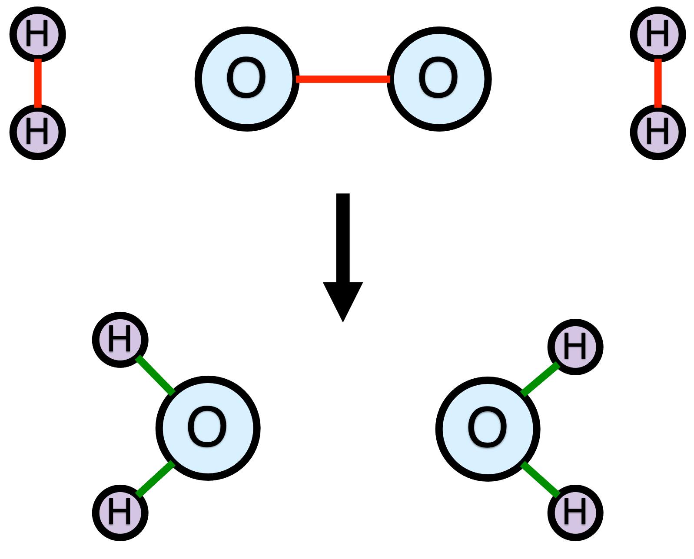

# Reactions and Stoichiometry {#sec-ch2}

This chapter reviews some basic facts and definitions associated with chemical reactions. It also introduces terminology that will be used throughout the book. For many readers it is likely to be a review of things learned in other courses.

## Chemical Reactions {#sec-ch2_chem_rxns}

The word “reaction” can refer to a molecular event wherein chemical bonds break and form. It can also refer to a written expression representing such a process. In most circumstances, these two uses for the word “reaction” don’t cause any confusion. Nonetheless, in this chapter the phrases “reaction event” and “reaction expression” will be used when necessary to avoid confusion. 

A chemical reaction event involves a group of atoms. Before the reaction event occurs, there are bonds between some of the atoms, so that the system consists of one or more molecules and/or free atoms. Collectively, these chemical species are called the reactants. A  reaction is a process wherein at least one chemical bond is broken or formed. As a consequence, after the reaction event occurs, the system consists of a different set of chemical species, known collectively as the products.

The exact same set of atoms are present before and after the reaction event, only the bonding among them changes. As an example, consider @fig-rxn_event_bond_changes. The top of the figure shows two oxygen atoms and four hydrogen atoms that are bonded so as to form the reactants: one O~2~ molecule and two H~2~ molecules. The bottom part of the figure shows the same six atoms after a reaction event. The three bonds colored red broke during the reaction event and the four bonds colored green formed. As a result, the products are two water molecules.

{#fig-rxn_event_bond_changes fig-align="center" width="400"}

It is important to note that reaction events are bi-directional. @fig-rxn_event_bond_changes depicts a reaction event where the O~2~ and H~2~ molecules are the reactants and the H~2~O molecules are the products. A reaction event where two H~2~O molecules are the reactants and one O~2~ and two H~2~ molecules are the products must then be possible. What that means, among other things, is that the identity of the reactants and the identity of the products is context specific. In one situation, two H~2~O molecules might be the reactants with O~2~ and two H~2~ as the products, and in a different situation, O~2~ and two H~2~ might be the reactants and 2 H~2~O, the products.

If all of the bond breaking and forming occurs simultaneously, then the reaction is called an elementary reaction. In an elementary reaction, all of the reactants come very close to each other, and all of the bonds that are going to do so begin to break or form. While this is happening, the system consists of a single species called the activated complex. The lifetime of the activated complex is extremely short. Even as the reactants are forming the activated complex, it is beginning to break apart into the products.

Alternatively, it may appear from a macroscopic perspective that a single reaction event is taking place, but at the molecular level, the bond breaking and forming is not simultaneous. That is, the bond breaking and formation occur sequentially and the process occurs as a sequence of two or more elementary reactions. In each of those sequential elementary reactions, additional species are formed or consumed. These additional species are called intermediates or reactive intermediates. The lifetimes of the intermediates are very short (but considerably longer that that of an activated complex), and the concentrations of the intermediates are very small. If this weren't true, the intermediates would be observed from a macroscopic perspective, and it would not appear that a single reaction event was taking place.

In summary, a chemical reaction is a molecular process involving a group of atoms. Before the reaction, the bonding between the atoms corresponds to a set of species called the reactants. The bonding among the atoms changes during the chemical reaction leading to a different set of species called the products. If all of the bond breaking and forming takes place simultaneously, the reaction is called an elementary reaction. Otherwise it is called a non-elementary reaction or an apparent reaction.

## Reaction Stoichiometry {#sec-ch2_rxn_stoich}

The fact that in an elementary or a non-elementary reaction, the number of atoms and their identities do not change, but the bonding between them does change, forms the basis of chemical reaction stoichiometry. Each time the reaction event occurs, the same number of molecules of each reactant is converted into the same number of molecules of each product. The fixed proportions in which the reactants and products participate are referred to collectively as the stoichiometry of the reaction.

Referring to @fig-rxn_event_bond_changes, in every reaction event, one O~2~ molecule and two H~2~ molecules are converted into two H~2~O molecules. A reaction expression representing that reaction event is shown in @eq-hydrogen_oxidation_reaction. It contains an arrow that points to the right that represents the reaction event. To the left of the arrow the chemical formula for each unique reactant is written. The chemical formulae of the reactants are separated by plus signs, and each is preceded by the number of molecules of that species that participates in the reaction event. If no number precedes a chemical formula, that implies a value of one. The numbers preceding the chemical species, including the implied one's, are called stoichiometric coefficients. The arrow in the reaction expression points to a similar listing of the chemical species that are products of the reaction event.

$$
2 H_2 + O_2 \rightarrow 2 H_2O
$${#eq-hydrogen_oxidation_reaction} 

A number of different styles of arrows can be used when writing reaction expressions. The style of the arrow sometimes has special meaning. For example, two arrows, one above the other and pointing in opposite directions ($\rightleftarrows$), can be used. A double arrow is a reminder that chemical reactions are bidirectional. It sometimes additionally signifies that the reaction is reversible, a concept that will be discussed later in this chapter. When the reaction expression is written as shown in @eq-hydrogen_oxidation_reaction, the conversion of two H~2~ and one O~2~ to two H~2~O is called the forward reaction and the conversion of two H~2~O to two H~2~ and one O~2~ is called the reverse reaction.

Notice that the total number of each type of atom on the left side of the reaction expression is equal to the total number of that type of atom on the right side of the reaction expression. That is, there are four H atoms and two O atoms on each side of the reaction expression. This is a consequence of reaction stoichiometry, and it must be true for every element that appears in a reaction expression. When it is true, the reaction expression is said to be balanced.

In @eq-hydrogen_oxidation_reaction the stoichiometric coefficients of the species equal the number molecules of the species that participate in the reaction event. This is not required. The reaction expression only needs to convey the proportions in which the reagents participate in the reaction event, and not necessarily the exact number of molecules. For example, @eq-h2o_formation_rxn is an equally valid reaction expression for the reaction event in @fig-rxn_event_bond_changes.

$$
H_2 + \frac{1}{2} O_2 \rightarrow H_2O
$${#eq-h2o_formation_rxn}

As previously noted, the numbers that appear in a reaction expression, including the implied ones, are called stoichiometric coefficients. Each unique chemical species that participates in the  reaction event has a corresponding stoichiometric coefficient in the reaction expression. It is important to note that the stoichiometric coefficients are taken from the reaction expression, not the reaction event. In other words, the stoichiometric coefficient of H~2~O in the hydrogen combustion reaction could be either two or one, depending upon which of the two reaction expressions, [Reaction -@eq-hydrogen_oxidation_reaction] or [Reaction -@eq-h2o_formation_rxn], is being used to represent the reaction event.

The lower-case Greek letter, $\nu_{i,j}$, is used in *Reaction Engineering Basics* to represent stoichiometric coefficients. The first subscript, $i$, identifies the chemical species, so $i$ will be a chemical formula. If more than one reaction is taking place, there will be a second subscript, $j$. The subscript $j$ identifies one of the reactions taking place. Typically, when solving problems, the reactions are numbered, in which case $j$ will be a number.

*Reaction Engineering Basics* uses a sign convention for stoichiometric coefficients where $\nu$ for a reactant in the reaction expression is negative, and $\nu$ for a product is positive. (See @sec-apxa for a complete listing of sign conventions and notation used in *Reaction Engineering Basics*.) Thus, the stoichiometric coefficient of H~2~ in [Reaction -@eq-hydrogen_oxidation_reaction] is written as $\nu_{H_2,2.1}$ and is equal to -2. If a species does not appear in the reaction expression for reaction $j$, then its stoichiometric coefficient in reaction $j$ is equal to zero.

### Single Reaction Systems

Consider a closed system that initially contains a mixture of reagents. Let $N_{i,0}$ represent the number of molecules of reagent $i$ in that mixture. Suppose that there is only one reaction, $j$, that can occur, and further suppose that in the reaction expression, the stoichiometric coefficients equal the number of each type of molecule that participates each time reaction event $j$ occurs. If $N_{j,net}$ is the *net* number of times reaction event $j$ has occurred, then the change in the number of molecules of $i$ is equal to $\nu _{i,j} N_{j,net}$. (The sign convention for stoichiometric coefficients ensures that the number of reactant molecules will decrease and the number of product molecules will increase.)

$$
N_i - N_{i,0} = \nu _{i,j} N_{j,net}
$$

In real-world systems, the number of molecules is huge, and it is more convenient to work with moles. Dividing both sides of the equation by Avogadro’s number, $N_{Av}$, and rearranging, gives an expression for the moles of $i$ at any later time, given the number of moles of $i$ at the start of the process.

$$
n_i = n_{i,0} + \nu _{i,j} \frac{N_{j,net}}{N_{Av}}
$$

The net number of reaction events divided by Avogadro's number is called the *true extent of reaction j*, $\Xi_j$, @eq-extent_def. Substitution in the preceding equation yields an expression for the moles of $i$, @eq-moles_abs_extent.

$$
\Xi_j = \frac{N_{j,net}}{N_{Av}}
$$ {#eq-extent_def}

$$
n_i = n_{i,0} + \nu _{i,j} \Xi_j
$$ {#eq-moles_abs_extent}

That was for a closed system. For an open, steady-state system, the change occurs between the point where the moles enter the process and the point where they leave. When talking about material entering and leaving, it makes more sense to use molar flow rates instead of moles. Doing so leads to @eq-molar_flow_abs_extent for the molar flow rate of $i$ leaving an open, steady-state system.

$$
\dot n_i = \dot n_{i,in} + \nu _i \dot \Xi_j
$$ {#eq-molar_flow_abs_extent}

It turns out that @eq-moles_abs_extent and @eq-molar_flow_abs_extent are accurate no matter how the reaction expression is written, as long as it is balanced. That is, the stoichiometric coefficients in the reaction expression do not have to equal the number of each type of molecules that participates in the reaction event, but the reaction expression does have to be properly balanced. When the stoichiometric coefficients do not equal the number of molecules participating in the reaction event, it is preferable to define the apparent extent of reaction, $\xi_j$, as the net number of times the reaction occurs, [as written]{.underline}, and to use the apparent extent of reaction as in [Equations -@eq-moles_apparent_extent] and [-@eq-molar_flow_apparent_extent], instead of the true extent of reaction.

$$
n_i = n_{i,0} + \nu _{i,j} \xi_j
$$ {#eq-moles_apparent_extent}

$$
\dot n_i = \dot n_{i,in} + \nu _i \dot \xi_j
$$ {#eq-molar_flow_apparent_extent}

It is important to understand that the apparent extent of reaction $j$ is defined in terms of the stoichiometric coefficients of the reagents in the reaction expression, and not the molar amounts of the reagents. That is, if @eq-moles_apparent_extent (or @eq-molar_flow_apparent_extent) is written for two different species that participate in the same reaction, $j$, the value of $\xi_j$ is the same in both equations. For this reason, the extent of reaction is very useful for relating the change in the number of moles of one reactant or product to the change in the number of moles of a second reactant or product. 

Finally, both the true extent of reaction and the apparent extent of reaction are an extensive quantities. For closed systems they have units of moles, and for open, steady-state systems they have units of moles per time.

### Multiple Reaction Systems

The use of apparent extents of reactions in multiple reaction systems necessitates identifying a complete, mathematically independent subset of the reactions that are taking place. To understand why, consider [Reactions -@eq-methanation_reaction], [-@eq-wgs_reaction] and [-@eq-alt_methanation_reaction] as an example. Only two of those three reactions are mathematically independent. The third is a linear combination of the others. This can be seen by noting, for example, that the third reaction is the sum of the first two. Put differently, the third reaction is equal to the net effect of the first two reactions occurring sequentially.

$$
CO + 3 H_2 \rightarrow CH_4 + H_2O
$$ {#eq-methanation_reaction}

$$
CO + H_2O \rightarrow CO_2 + H_2
$$ {#eq-wgs_reaction}

$$
2 CO + 2 H_2 \rightarrow CH_4 + CO_2
$$ {#eq-alt_methanation_reaction}

If a system initially contained a mixture of CO and H~2~, and then at some later time it was found to contain CO, H~2~, CH~4~, H~2~O and CO~2~, it would not be possible to know how much of the CH~4~ was produced by [Reaction -@eq-methanation_reaction] and how much was produced by [Reaction -@eq-alt_methanation_reaction]. Similarly, it would not be possible to know how much of the CO~2~ had been produced by [Reaction -@eq-wgs_reaction] and how much was produced by [Reaction -@eq-alt_methanation_reaction].

When the reactions occurring in a system are not mathematically independent, a complete, mathematically independent subset of the reactions captures all of the stoichiometry. A complete mathematically independent subset is a group of reactions, taken from the full set of reactions, wherein (1) none of the reactions in the subset are a linear combination of other reactions in the subset, and (2) each reaction that is not in the subset is a linear combination of the reactions that are in the subset.

Given a set of reactions, the number of mathematically independent reaction can be found by forming the transpose of the stoichiometric coefficient matrix, $\boldsymbol{\nu}^T$, as in @eq-stoich_coeff_matrix. Each row of $\boldsymbol{\nu}^T$ contains the stoichiometric coefficients in one of the reactions, and each column corresponds to one of the reagents present in the system. The number of mathematically independent reactions is equal to the rank of $\boldsymbol{\nu}^T$.

$$
\boldsymbol{\nu}^T = \begin{bmatrix} \nu_{1,1} & \nu_{2,1} & \cdots & \nu_{N_{reagents},1} \\
\nu_{1,2} & \nu_{2,2} & \cdots & \nu_{N_{reagents},2} \\
\vdots & \vdots & \ddots & \vdots \\
\nu_{1,N_{reactions}} & \nu_{2,N_{reactions}} & \cdots & \nu_{N_{reagents},N_{reactions}}
\end{bmatrix}
$$ {#eq-stoich_coeff_matrix}

To generate a complete mathematically independent subset of that set of reactions

1. Create an empty working matrix that only contains the first row of $\boldsymbol{\nu}^T$.
2. Add the next row of $\boldsymbol{\nu}^T$ to the working matrix.
3. Calculate the rank of the working matrix.
    a. If the rank of the working matrix does not equal the number of rows in the working matrix, remove the row that was just added from the working matrix.
    b. If the rank of the working matrix is less than the rank of $\boldsymbol{\nu}^T$, repeat from step 2.
    c. If the rank of the working matrix equals the rank of $\boldsymbol{\nu}^T$, the reactions corresponding to the rows of the working matrix are a complete, mathematically independent subset of the full set of reactions.

For a closed system, the change in the number of moles of any reagent, $i$, is equal to the sum of the apparent extents, $\xi _{j^\prime}$ of the $j^{\prime}$ mathematically independent reactions, each multiplied by the stoichiometric coefficient of reagent $i$ in that reaction. This leads to @eq-moles_apparent_extent_independent for a closed system or to @eq-molar_flow_apparent_extent_independent for an open, steady-state system. Note that [Equations -@eq-moles_apparent_extent_independent] and [-@eq-molar_flow_apparent_extent_independent] reduce to [Equations -@eq-moles_apparent_extent] and [-@eq-molar_flow_apparent_extent] when only one reaction is taking place. 

$$
\begin{align}
n_i &= n_{i,0} + \sum_{j^\prime} \nu_{i,j^\prime} \xi_{j^\prime}
\\&j^\prime \text{ indexes mathematically independent reactions}
\end{align}
$$ {#eq-moles_apparent_extent_independent}

$$
\begin{align}
\dot n_i &= \dot n_{i,in} + \sum_{j^\prime} \nu_{i,j^\prime} \dot \xi_{j^\prime}
\\&j^\prime \text{ indexes mathematically independent reactions}
\end{align}
$$ {#eq-molar_flow_apparent_extent_independent}

The true extent of reaction, $\Xi_j$, has physical significance. It is the number times that molecular reaction event $j$ has occurred, expressed in moles. In contrast, the apparent extent of reaction, $\xi_{j^\prime}$, does not have any physical significance. It is a mathematical construct that is useful for characterizing the composition of a reacting system. In fact, for a given multiple reaction system, there can be more than one complete, mathematically independent subset, and any one of those subsets can be used in @eq-moles_apparent_extent_independent or @eq-molar_flow_apparent_extent_independent. The value of [Equations -@eq-moles_apparent_extent_independent] and [-@eq-molar_flow_apparent_extent_independent] lies in their ability to use stoichiometry to relate changes in the amount of one reagent to changes in the amounts of other reagents.

## Reaction Thermodynamics {#sec-ch2_rxn_thermo}

Two aspects of chemical reaction thermodynamics are considered here. First, as noted above, chemical reactions involve the breaking and forming of chemical bonds. Chemical bonds are a form of stored energy, so when a chemical reaction occurs, energy is extracted from or released to the surroundings. That energy is called the heat of reaction, and thermodynamics provides the means for calculating it.

Second, thermodynamics places a limit on the extent of a reaction. That limit can be quantified in terms of the equilibrium constant for the reaction. Equilibrium "constants" actually vary with temperature, and again, thermodynamics provides the means for calculating them.

### Heats of Reaction

The heat, $\Delta H_j$, of an arbitrary reaction, $j$, is defined as the change in enthalpy when stoichiometric amounts of the reactants in reaction $j$ are completely converted to stoichiometric amounts of the products of the reaction. If heat is released when reaction $j$ occurs, reaction $j$ is said to be an exothermic reaction, and $\Delta H_j$ will be negative. Conversely, if heat is consumed when reaction $j$ occurs, reaction $j$ is said to be an endothermic reaction, and $\Delta H_j$ will be positive.

The units of the heat of reaction are energy per mole. The "mole" in the units is a mole of apparent extent of reaction, as written. That is, if the heat of the reaction, N~2~ + 3 H~2~ $\rightarrow$ 2 NH~3~, is 92 kJ mol^-1^, that means 92 kJ per 1 mole of N~2~ or per 3 moles of H~2~ or per 2 moles of NH~3~. This also means that if the reaction had been written as 1/2 N~2~ + 3/2 H~2~ $\rightarrow$ NH~3~, the heat of reaction would equal 46 kJ mol^-1^. Notice, however, that 46 kJ per one-half mole of N~2~ is the same as 92 kJ per one mole of N~2~. In other words, the numerical value of the heat of reaction changes depending upon the stoichiometric coefficients used to balance the reaction expression, but as must be the case, the amount of heat per mole of any reactant or product is independent of the stoichiometric coefficients.

Typically, the calculation of the heat of reaction proceeds in two steps. First, the standard heat of reaction at 298 K is calculated. Then that result is used to calculate the heat of reaction at any other temperature.

#### The Standard Heat of Reaction at 298 K

The standard heat of formation of reagent $i$ at 298 K, $\Delta H_{f,i}^0 \Bigr\rvert_{T=298K}$, is the heat of the reaction in which one mole of reagent $i$ (in its standard state) is synthesized at 298 K from the elements that it comprises (in their standard states). For many reagents, standard heats of formation at 298 K are tabulated in various handbooks; selected lists often appear in thermodynamics textbooks, too. Tables of this type should indicate the standard state that has been used for reagent $i$ and each of the elements.

The widespread availability of tables containing standard heats of formation is important because the standard heat of any reaction, $j$, at 298 K can be calculated from the standard heats of formation of the reactants and products in it. Specifically, @eq-deltaH-298-form is used to calculate the standard heat of reaction $j$ at 298 K from the standard heats of formation of its reactants and products at 298 K. @eq-deltaH-298-form uses the *Reaction Engineering Basics* sign convention wherein the stoichiometric coefficients of reactants are negative and the stoichiometric coefficients of products are positive.

$$
\Delta H_j^0\Bigr\rvert_{T=298K} = \sum_i \left( \nu_{i,j} \Delta H_{f,i}^0\Bigr\rvert_{T=298K} \right)
$$ {#eq-deltaH-298-form}

An alternative to using standard heats of formation is to use the standard heats of combustion of the reactants and products at 298 K. The standard heat of combustion of reagent $i$ at 298 K, $\Delta H_{c,i}^0 \biggr\rvert_{T=298K}$, is the heat of the reaction in which one mole of species $i$ is completely oxidized by O~2~ at 298 K, usually producing CO~2~ and H~2~O~(l)~, and with all species in their standard states. Standard heats of combustion for many hydrocarbons also are tabulated in handbooks and textbooks.

Standard heats of combustion are particularly convenient for use with hydrocarbons. If reagent $i$ contains elements other than C, O and H, the table providing the value of the standard heat of combustion should indicate the additional combustion products and their standard states. @eq-deltaH-298-comb is used to calculate the standard heat of reaction $j$ at 298 K from the standard heats of combustion of its reactants and products at 298 K.

$$
\Delta H_j^0\Bigr\rvert_{T=298K} = \sum_i \left( -\nu_{i,j} \Delta H_{c,i}^0\Bigr\rvert_{T=298K} \right)
$$ {#eq-deltaH-298-comb}

#### The Standard Heat of Reaction at Temperature T

Heats of reaction at temperatures other than 298 K appear in the equations used for modeling chemical reactors, and for that reason it is important to know how to calculate them. Assuming none of the reactants and products in reaction $j$ undergo a phase change between 298 K and the temperature of interest, $T$, the standard heat of reaction $j$ at temperature, $T$, can be calculated using @eq-deltaH-T. If one of the reagents does undergo a phase change, the latent heat for that phase change would need to be included in the equation, and the sensible heat integral might need to be split into two integrals. The first integral would range from 298 K to the phase-change temperature and would use the heat capacity of the reagent in the lower-temperature phase. The second integral would apply from the phase-change temperature to $T$ and would use the heat capacity of the reagent in the higher-temperature phase. 

$$
\Delta H_j^0 = \Delta H_j^0\Bigr\rvert_{T=298K} + \sum_i \left( \nu_{i,j} \int_{298\text{ K}}^T \hat C_{p,i}dT \right)
$$ {#eq-deltaH-T}

### Equilibrium

When a reaction reaches thermodynamic equilibrium, the composition of the system stops changing. If the reaction has gone essentially to completion when equilibrium is reached, the reaction is said to be irreversible. If an appreciable amount of reactant remains when equilibrium is reached, the reaction is reversible. Knowing the initial composition of a system and the values of the equilibrium constants for a complete mathematically independent subset of the reactions taking place, the equilibrium composition can be calculated.

Calculating equilibrium composition won't be necessary in *Reaction Engineering Basics*, but it is an important skill that a reaction engineer should possess. It can be important in the early stages of designing a reactor system and whenever reaction engineering tasks involve reversible reactions. However, equilibrium constants can also appear in rate expressions that are used when modeling reactors. For this reason it is important to be able to calculate equilibrium constants at any given temperature. The calculation of an equilibrium constant at temperature, $T$, proceeds in four steps.

To calculate the equilibrium constant for reaction $j$, it is first necessary to calculate the standard Gibbs free energy change of reaction $j$ at 298 K, $\Delta G_j^0 \Bigr\rvert_{T=298K}$. For many reagents, $i$, standard Gibbs free energies of formation  at 298 K, $\Delta G_{f,i}^0 \Bigr\rvert_{T=298K}$, are tabulated in various handbooks and textbooks . They can be used to calculate the Gibbs free energy change for reaction $j$ at 298 K using @eq-deltaG-298.

$$
\Delta G_j^0\Bigr\rvert_{T=298K} = \sum_i \left( \nu_{i,j} \Delta G_{f,i}^0\Bigr\rvert_{T=298K} \right)
$$ {#eq-deltaG-298}

Knowing the standard Gibbs free energy of reaction $j$ at 298 K, the equilibrium constant at 298 K for reaction $j$ can be calculated using @eq-K-298.

$$
K_j \Bigr\rvert_{T=298K} = \exp{ \left( \frac{-\Delta G_j^0\Bigr\rvert_{T=298K}}{R(298\text{ K})} \right)}
$$ {#eq-K-298}

To calculate the equilibrium constant at any other temperature, an expression for the standard heat of reaction $j$ as a function of temperature must be generated as described above. Then the equilibrium constant for reaction $j$ at any temperature, $T$, can be calculated using @eq-K_T.

$$
K_j  = K_j \Bigr\rvert_{T=298K} \exp{\left\{ \frac{1}{R} \int_{298K}^T\frac{\Delta H_j^0}{T^2}dT \right\}}
$$ {#eq-K_T}

Finally, if it is assumed that the standard entropy and standard enthaply changes for reaction $j$ are constant, the equilibrium constant at temperature $T$ can be calculated using @eq-eq_K_T_const_delta_G.

$$
K_j = \exp{\left( \frac{-\Delta G_j^0}{RT} \right)} = \exp{\left( \frac{\Delta S_j^0}{R} \right)}\exp{\left( \frac{-\Delta H_j^0}{RT} \right)}
$$ {#eq-eq_K_T_const_delta_G}

## Reaction Progress {#sec-ch2_rxn_progress}

Given an initial mixture of reagents, it is convenient to have a simple way of describing how far a reaction has gone, that is, the reaction progress. The apparent extent of reaction can be used to do so, but because the extent of reaction is an extensive variable, it is not a convenient measure of reaction progress. It is much better suited to calculating the amounts of the reagents.

The conversion, either fractional or as a percent, is the most commonly used measure of reaction progress. Quite simply, the fractional conversion of reactant $i$, denoted as $f_i$, is just the fraction of the starting amount of $i$ that has reacted, and it only applies to reactants. It is an intensive quantity and does not have any units. The defining equations for closed and open, steady state systems are shown in @eq-conversion_def_closed and @eq-conversion_def_open. It doesn’t make sense to talk about how much product was converted, so again, conversion only applies to reactants.

$$
f_i=\frac{n_{i,0}-n_i}{n_{i,0}}
$$ {#eq-conversion_def_closed}

$$
f_i=\frac{\dot{n}_{i,in}-\dot{n}_i}{\dot{n}_{i,in}}
$$ {#eq-conversion_def_open}

If the starting composition is stoichiometric, then the fractional conversion of every reactant will be the same. However, if one reactant is present in excess, its fractional conversion will be smaller than other reactants and will never reach 100%. For this reason, when the starting composition is not stoichiometric, it is preferrable to use the conversion of the limiting reactant. To identify the limiting reactant, consider a non-stoichiometric mixture of reactant molecules. If the forward reaction were to occur a sufficient number of times, one of the reactants would be completely used up while molecules of the other reactants still remained. The reactant that is completely used up is called the *limiting reactant* because the net number of times the forward reaction can occur is limited by the starting number of molecules of that reactant. If more than one reactant would run out simultaneously, any of them can be used as the limiting reactant. If all of them would run out simultaneously, the starting mixture was stoichiometric.

The stoichiometric equivalence of each reactant can be defined as its starting amount divided by the negative of its stoichiometric coefficient. (This will yield a stoichiometric equivalence that is positive since the stoichiometric coefficients of reactants are negative.) The reactant with the smallest stoichiometric equivalence is then the limiting reactant. This criterion is presented in @eq-lim_react_closed for closed systems and in @eq-lim_react_open for open systems, where "lr" denotes limiting reactant and "nlr" denotes non-limiting reactant. If the resulting value is the same for all reactants, that means that the initial composition is a stoichiometric mixture and no reactant is limiting. If a reaction had 3 reactants with two having the same stoichiometric equivalence and the third having a greater value, then either or both of the reactants with the smaller value could be considered to be the limiting reactant.

$$
\frac{n_{lr,0}}{\left| \nu_{lr} \right|} < \frac{n_{nlr,0}}{\left| \nu_{nlr} \right|}
$${#eq-lim_react_closed}

$$
\frac{\dot n_{lr,in}}{\left| \nu_{lr} \right|} < \frac{\dot n_{nlr,in}}{\left| \nu_{nlr} \right|}
$${#eq-lim_react_open}

The conversion of the limiting reactant will range from zero to 100%, assuming the reaction is irreversible. If the reaction is reversible, then even the limiting reactant will have a maximum conversion that is less than 100% because the system will reach equilibrium with measurable amounts of the reactants still remaining.  If it is desired to have a conversion that always ranges from 0 to 100%, the fraction of equilibrium conversion, @eq-frac_of_eq_conversion_closed for a closed system or @eq-frac_of_eq_conversion_open for an open, steady-state system, can be used. The fraction of equilibrium conversion, $g_i$ is just the actual conversion relative to the conversion at equilibrium, so it, too, is an intensive variable.

$$
g_i = \frac{f_i}{f_{i,eq}}= \frac{\frac{n_{i,0} - n_i}{n_{i,0}}}{\frac{n_{i,0} -  n_{i,eq}}{n_{i,0}}} = \frac{n_{i,0} - n_i}{n_{i,0} - n_{i,eq}}
$$ {#eq-frac_of_eq_conversion_closed}

$$
g_i = \frac{\dot n_{i,in} - \dot n_i}{\dot n_{i,in} - \dot n_{i,eq}}
$$ {#eq-frac_of_eq_conversion_open}

The fraction of equilibrium conversion may not be convenient to use. For one thing, in order to use it, you have to do additional calculations to determine what the conversion is at equilibrium. In addition, the conversion at equilibrium changes with temperature which means a change in temperature would change the fraction of equilibrium conversion even if no reaction took place.

The conversion can be used when describing reaction progress of multiple reaction systems, but it must be used in conjunction with additional measures of reaction progress to fully specify the system composition. When using the conversion as a reaction progress variable in a multiple reaction system, it is necessary to specify the reactant it applies to. Furthermore, that reactant must be *initially present* in the system. As an example, again consider [Reactions -@eq-methanation_reaction], [-@eq-wgs_reaction] and [-@eq-alt_methanation_reaction]. H~2~O is a reactant in [Reaction -@eq-wgs_reaction], but it might not initially be present in the system. Initially the system might only contain CO and H~2~. H~2~O would be generated by [Reaction -@eq-methanation_reaction] and then could participate as a reactant in [Reaction -@eq-wgs_reaction]. If one tried to calculate the conversion of H~2~O using @eq-conversion_def_closed, the denominator would equal zero, leading to an infinite conversion. Therefore when multiple reactions are taking place, conversion is only defined for reactants that are initially present.

Yield is a reaction progress variable that specifies the amount of one particular product relative to the starting amount of one particular reactant. There are a few different ways to define yield, making it important to know which definition is being used whenever a yield is specified. When multiple reactions are occurring, it is very often true that some of the products are more desirable or valuable than other products. In some such systems, the desired product, $D$, is produced through a combination of reaction steps where it isn't possible to identify a stoichiometric relationship between $D$ and any one reactant, $i$. Under these circumstances it is common to define the yield as shown in @eq-yield_def_closed for a closed system and in @eq-yield_def_open for an open, steady-state process.

$$
Y_{D/i} = \frac{n_D}{n_{i,0}}
$$ {#eq-yield_def_closed}

$$
Y_{D/i} = \frac{\dot n_D}{\dot n_{i,in}}
$$ {#eq-yield_def_open}

In other reaction systems, the desired product, $D$, is produced from reactant, $i$, in only one reaction, $j$. When this is true, it may be preferable to account for the stoichiometry as shown in @eq-stoich_yield_def_closed and @eq-stoich_yield_def_open. By doing so, the resulting yield can be expressed as a percentage that ranges from 0 to 100% (assuming reaction $j$ is irreversible).

$$
Y^\prime_{D/i} = \frac{\nu_{i,j}}{\nu_{D,j}}\frac{n_D}{n_{i,in}}
$$ {#eq-stoich_yield_def_closed}

$$
Y^\prime_{D/i} = \frac{\nu_{i,j}}{\nu_{D,j}}\frac{\dot n_D}{\dot n_{i,in}}
$$ {#eq-stoich_yield_def_open}

While yield relates the amount of a product to the amount of a reactant, selectivity is a reaction progress variable that relates the amount of one product or group of products to a different product or group of products. If there is one desirable product, $D$, and one undesirable product, $U$, the selectivity for $D$ relative to $U$ can be defined as shown in @eq-selectivity_def_closed and @eq-selectivity_def_open. In other instances the selectivity of interest might involve groups of products.

$$
S_{D/U} = \frac{n_D}{n_U}
$$ {#eq-selectivity_def_closed}

$$
S_{D/U} = \frac{\dot n_D}{\dot n_U}
$$ {#eq-selectivity_def_open}

Both yield and selectivity can be used as overall measures or as instantaneous measures. The overall yield or selectivity is the value at the end of a closed process or at the outlet from an open, steady-state process. In a closed process, the yield or selectivity will typically change over time, and in an open, steady-state process it may vary with position within the reactor. An instantaneous yield or selectivity can be defined for a given time or position within the reactor. The instantaneous yield or selectivity is related to the rates at which the amounts of the reagents are changing and will be defined in a later chapter of this book. 

## Classifying Reactions and Reaction Networks {#sec-ch2_classify_rxns_and_networks}

There are a number of different ways of characterizing or classifying reactions. A few (elementary/non-elementary, reversible/irreversible, and exothermic/endothermic,) have already been mentioned. Molecularity is another way of classifying elementary reactions. If there is only one reactant in a chemical reaction event, that reaction can be referred to as a unimolecular reaction. If there are two reactants, either two of the same molecule or one each of two different molecules, the reaction can be referred to as a bimolecular reaction. A termolecular reaction has three reactant molecules. When a single molecule is the only reactant and there is also a single molecule as the only product, the reaction can additionally be called an intramolecular reaction. In an intramolecular reaction all bond breaking and forming is internal to the single molecule involved in the reaction.

When two or more chemical reactions take place at the same time they are sometimes referred to collectively as a reaction network. When the reactions in a network all have the same reactants, but different products, the network is said to consist of parallel reactions. The general form of parallel reactions is shown in [Reactions -@eq-parallel_rxns]. An example of parallel reactions is the chlorination of toluene, [Reactions -@eq-toluene_chlor]. Toluene and chlorine are the reactants in all of those reactions, but the products differ. The first reaction produces *ortho*-chlorotoluene, the second produces *meta*-chlorotoluene, and the third produces *para*-chlorotoluene.

$$
\begin{aligned}
A \rightarrow Y \\
A \rightarrow Z
\end{aligned}
$${#eq-parallel_rxns}

$$
\begin{aligned}
C_7H_8 + Cl_2 \rightarrow o\mbox{-}C_7H_7Cl + HCl \\
C_7H_8 + Cl_2 \rightarrow m\mbox{-}C_7H_7Cl + HCl \\
C_7H_8 + Cl_2 \rightarrow p\mbox{-}C_7H_7Cl + HCl
\end{aligned}
$${#eq-toluene_chlor}

Some networks consist of series reactions. This means that the reactions occur sequentially, in the sense that the product of one reaction is the reactant in another reaction, as shown in [Reactions -@eq-series_rxns], where D is the product of the first reaction and the reactant in the second reaction. In series reactions, the intermediate product, D in the case of [Reactions -@eq-series_rxns], is often the more valuable, or desired, product, and the final product, U, is less valuable or undesired. An example of series reactions is the dehydrogenation of cyclohexane to benzene, [Reactions -@eq-benzene_dehydrogenation]. Cyclohexadiene is produced in the first reaction and reacts in the second reaction to yield cyclohexene. Then the cyclohexene reacts in the third reaction to produce benzene.

$$
\begin{aligned}
A \rightarrow D \\
D \rightarrow U
\end{aligned}
$${#eq-series_rxns}

$$
\begin{aligned}
C_6H_{12} \rightarrow C_6H_{10} + H_2 \\
C_6H_{10} \rightarrow C_6H_8 + H_2 \\
C_6H_8 \rightarrow C_6H_6 + H_2
\end{aligned}
$${#eq-benzene_dehydrogenation}

A third kind of reaction network involves series-parallel reactions. They are a hybrid of series reaction networks and parallel reaction networks. From the perspective of one reactant, the network appears to consist of series reactions while from the perspective of the other reactant, it appears to consist of parallel reactions. Looking at the general example in [Reactions -@eq-series_parallel], D is a product of the first reaction and it is a reactant in the second reaction. At the same time, B is a reactant in both reactions. So from the perspective of A being converted to D which is subsequently converted to U, it looks like a series reaction network but from B’s perspective it looks like a parallel reaction network. [Reactions -@eq-methylamine_synthesis] show an example of a three-reaction series-parallel network. Methane is converted in parallel, while mono-methylamine, di-methylamine, and tri-methylamine are generated sequentially.

$$
\begin{aligned}
A + B \rightarrow D + Y \\
D + B \rightarrow U + Z
\end{aligned}
$${#eq-series_parallel}

$$
\begin{aligned}
NH_3 + CH_4 \rightarrow NH_2CH_3 + H_2 \\
NH_2CH_3 + CH_4 \rightarrow NH\left(CH_3\right)_2 + H_2 \\
NH\left(CH_3\right)_2 + CH_4 \rightarrow N\left(CH_3\right)_3 + H_2
\end{aligned}
$${#eq-methylamine_synthesis}

Polymerization reactions are another type of reaction network. Whole books and whole courses are devoted to polymerization reactions, so there’s lots more to it than what's presented here. For present purposes, it can be noted that polymerization reactions share some of the characteristics of series-parallel reactions. In a simple example, [Reactions -@eq-polymerization], one reactant participates in parallel. It is called the monomer, and is represented here as M. The difference is that there may be thousands of sequential reactions. As a consequence, there are many, many products, differing in the number of monomer units they were made from. There isn’t one desired product, but often the goal is to produce predominantly products where the value of $n$ falls in a certain range. Ethylene polymerization to produce polyethylene, [Reaction -@eq-polyethylene], is an example of a polymerization reaction. In that reaction, the dangling bonds at the two ends of the polyethylene chain are meant to indicate that the chain would be terminated in some way.

$$
\begin{aligned}
M + M \rightarrow M_2 \\
M + M_2 \rightarrow M_3 \\
\vdots \\
M + M_{n-1} \rightarrow M_n
\end{aligned}
$${#eq-polymerization}

$$
n C_2H_4 \rightarrow \mbox{-}\left(CH_2-CH_2\right)_n\mbox{-}
$${#eq-polyethylene}

## Examples

Some of the examples presented here are a bit contrived in order to illustrate the use of more than one concept from this chapter. The different tasks shown here will be one small part of reactor analyses that are performed in later chapters. The ability to complete these kinds of tasks routinely is an important component of a reaction engineer's skill set.

```{r}
#| echo: false
#| output: false
library(tidyverse)
library(knitr)
library(kableExtra)
library(readxl)
source("code/fmt_tibble_col.R")
source("code/fmt_E_to_10.R")
```

### Balancing a Reaction and Identifying the Limiting Reactant {#sec-ch2_example1}

Carbon monoxide (CO) can be oxidized by molecular oxygen (O~2~) to produce carbon dioxide (CO~2~). If equal volumes of carbon monoxide and air at equal temperature and pressure are mixed and flow into a chemical reactor, which reactant is limiting?

---

```{r}
#| echo: false
#| output: false
df <- read.csv("solutions/ch2_ex1/results.csv")
```

:::{.callout-tip collapse="true"}
## Click Here to see What Might an Expert be Thinking at this Point

The problem asks me to identify the limiting reactant for a flow, or open, system. I know that I'm going to need the stoichiometric coefficients for the two reactants, so I'll start by writing the balanced reaction expression. I can start by writing the reaction with all of the stoichiometric coefficients set to one, and then change them as needed to balance the reaction.

$$
CO + O_2 \xrightarrow{?} CO_2
$$

As written above, there is one carbon atom on each side of the equations, so carbon is balanced. However there are three O atoms on the left and only two on the right, so to balance the equation I either need to add an O on the right or remove one from the left. If I change the coefficient of either CO or CO~2~, that will unbalance the carbon, so the easiest way to balance the oxygen is to place a one-half in front of the O~2~.

:::

The stoichiometry of the reaction is shown in equation (1).

$$
CO + \frac{1}{2} O_2 \rightarrow CO_2 \tag{1}
$$

:::{.callout-tip collapse="true"}
## Click Here to see What Might an Expert be Thinking at this Point

@eq-lim_react_open can be used to identify the limiting reactant for an open, steady-state system. To use it I will need to calculate the inlet molar flow rates of the reactants, CO and O~2~.

The assignment does not give values for any extensive quantities, so I can choose the value of one extensive variable. Here I'll choose the total inlet molar flow rate. Then all I need to do is calculate the inlet mole fractions of CO and O~2~.

The narrative states that equal volumes of CO and air are used, so the volume fractions of CO and air are each 0.5. For ideal gases, the mole fraction equals the volume fraction.

$$
\frac{\dot{V}_i}{\dot{V}_{total}} = \frac{\frac{\dot{n}_iRT}{P}}{\frac{\dot{n}_{total}RT}{P}} = \frac{\dot{n}_i}{\dot{n}_{total}} = y_i
$$

So the molar flow rates of CO and air are each equal to 0.5 times the basis I choose. The molar flow rate of O~2~ is then just 21% of the molar flow rate of air.

:::


[Basis]{.underline}: $\dot{n}_{total,in}$ = 1 mol s^-1^.

According to the problem statement the inlet volumetric flow rates of air and CO are equal, so each of their mole fractions equal 0.5, equations (2) and (3). The inlet molar flow rates of air and CO then can be calculated using equations (4) and (5).

$$
y_{CO,in} = 0.5 \tag{2}
$$

$$
y_{air,in} = 0.5 \tag{3}
$$

$$
\dot{n}_{CO,in} = y_{CO,in} \dot{n}_{total,in} \tag{4}
$$

$$
\dot{n}_{air,in} = y_{air,in} \dot{n}_{total,in} \tag{5}
$$

Assuming that air is 21% O~2~ and 79% other non-reactive gases (predominantly N~2~) allows calculation of the inlet volumetric flow rate of O~2~, equation (6).

$$
\dot{n}_{O_2,in} = 0.21 \dot{n}_{air,in} \tag{6}
$$

Finally, the stoichiometric coefficients in the balanced reaction, equation (1), can be used to calculate the equivalences of CO and O~2~, equations (7) and (8).

$$
CO \left(\text{equiv}\right) = \frac{\dot{n}_{CO,in}}{\left| \nu_{CO} \right|} = \frac{\dot{n}_{CO,in}}{\left| -1 \right|} \tag{7}
$$

$$
 O_2 \left(\text{equiv}\right) = \frac{\dot{n}_{O_2,in}}{\left| \nu_{O_2} \right|} = \frac{\dot{n}_{O_2,in}}{\left|-\frac{1}{2}\right|} \tag{8}
$$

The calculations were performed as described above. The inlet molar flow rates of CO, air, and O~2~ are `r df$value[1]`, `r df$value[2]`, and `r df$value[3]` `r df$units[2]`, respectively. The stoichiometric equivalence of O~2~, (`r df$value[5]`) is smaller than that of CO, (`r df$value[4]`) , so `r df$value[6]` is the limiting reactant.

### Calculating Composition using Apparent Extent of Reaction, Conversion, and Selectivity {#sec-ch2_example2}

A new reactor is being developed with the hope of generating ethylene by the oxidative dehydrogenation of ethane, reaction (1). Reactions (2) and (3) also take place at the operating conditions of 1 atm and 150 °C. The process starts with 90% ethane and 10% air (you may take air to contain 79% N~2~ and 21% O~2~) and ends with a 50% conversion of O~2~ and a selectivity of 3 C~2~H~4~/CO~2~. Calculate the final mole fraction of CO~2~.

$$
2 C_2H_6 + O_2 \leftrightarrows 2 C_2H_4 + 2 H_2O \tag{1}
$$

$$
C_2H_4 + 3 O_2 \leftrightarrows 2 CO_2 + 2 H_2O \tag{2}
$$

$$
2 C_2H_6 + 7 O_2 \leftrightarrows 4 CO_2 + 6 H_2O \tag{3}
$$

---

```{r}
#| echo: false
#| output: false
df <- read.csv("solutions/ch2_ex2/results.csv")
```

:::{.callout-tip collapse="true"}
## Click Here to see What an Expert Might be Thinking at this Point

I know I'm going to need the molar amounts of the reagents at the start of the process, so I'll calculate them first. None of the quantities given in the assignment narrative are extensive, so I can choose a value for one extensive quantity and use it as the basis for my calculations. Here I'll choose the total initial moles. Then all I need to calculate the initial amounts of the reagents are their mole fractions. The mole fraction of ethane is given as 0.9 and that of air as 0.1. The initial amount of O~2~ is 21% of the initial air and N~2~ is 79%.

:::

[Given]{.underline}: $y_{C_2H_6,0}$ = 0.9, $y_{air,0}$ = 0.1, $f_{O_2}$ = 0.5, and $S_{C_2H_4/CO_2}$ = 3.

[Basis]{.underline}: $n_{\text{total},0} = 1 \text{ mol}$.

The initial amounts of C~2~H~6~ and air are equal to their mole fractions times the total moles, equations (4) and (5). The initial amounts of O~2~ and N~2~ then can be calculated using the known composition of air, equations (6) and (7)

$$
n_{C_2H_6,0} = y_{C_2H_6,0} n_{\text{total},0}\tag{4}
$$

$$
n_{air,0} = y_{air,0} n_{\text{total},0} \tag{5}
$$

$$
n_{O_2,0} = 0.21 n_{\text{air},0} \tag{6}
$$

$$
n_{N_2,0} = 0.79 n_{\text{air},0} \tag{7}
$$

:::{.callout-tip collapse="true"}
## Click Here to see What an Expert Might be Thinking at this Point

I know that the apparent extents of reaction can be used to calculate the amounts of the reagents given their starting amounts. I sometimes find it useful in this kind of problem to generate a mole table that lists the initial amounts of the reagents and expressions for their final amounts in terms of the apparent extents of reaction. So I'll generate a mole table next.

In order to do that, I need to identify a set of mathematically independent reactions. I could generate the transpose of the stoichiometric coefficient matrix and use the procedure described in [Section @sec-ch2_rxn_stoich]. Here however, I can see that reactions (1) and (2) must be independent because reaction (2) contains CO~2~ and reaction (1) does not. I can also see that if reaction (1) occurs once and reaction (2) occurs twice, the result is reaction (3), so reaction (3) is not independent.

Having established that reactions (1) and (2) form a complete, mathematically independent subset of the reactions taking place, I can write the expressions for the molar amounts using @eq-moles_apparent_extent_independent.

:::

A mole table for the system is presented in @tbl-reb_2_6_2_mol_tbl.

| Species | Initial Amount | Later Amount |
|:-------:|:------:|:------:|
| C~2~H~6~ | $n_{C_2H_6,0}$ | $n_{C_2H_6,0} - 2 \xi_1$ |
| O~2~ | $n_{O_2,0}$ | $n_{O_2,0} - \xi_1 - 3 \xi_2$ |
| C~2~H~4~ | $n_{C_2H_4,0}$ | $2 \xi_1 - \xi_2$ |
| H~2~O | $n_{H_2O,0}$ | $2 \xi_1 + 2 \xi_2$ |
| CO~2~ | $n_{CO_2,0}$ | $2 \xi_2$ |
| N~2~ | $n_{N_2,0}$ | $n_{N_2,0}$ |
| Total | $n_{\text{total},0}$ | $n_{\text{total},0} + \xi_1$ |

: Mole Table for [Example -@sec-ch2_example2]. {#tbl-reb_2_6_2_mol_tbl tbl-colwidths="[20,40,40]"}

:::{.callout-tip collapse="true"}
## Click Here to see What an Expert Might be Thinking at this Point

I'm going to need to calculate the apparent extents of reaction before I can calculate the final amounts. The assignment narrative provides two reaction progress variables, the conversion of O~2~ and the selectivity for C~2~H~4~ over CO~2~. I know that they are defined in terms of initial and final molar amounts. So if I write their defining equations and then express the molar amounts in terms of the apparent extents of reaction, I can calculate the apparent extents. Once I know the apparent extents of the reactions, I can calculate the final moles of CO~2~ and the final total moles, and from them, the final mole fraction of CO~2~.

:::

[Defining Equations for the Given Reaction Progress Variables]{.underline}:

$$
f_{O_2} = \frac{n_{O_2,0} - n_{O_2}}{n_{O_2,0}} = \frac{\xi_1 + 3 \xi_2}{n_{O_2,0}} \tag{8}
$$

$$
S_{C_2H_4/CO_2} = \frac{n_{C_2H_4}}{n_{CO_2}}  = \frac{2 \xi_1 - \xi_2}{2 \xi_2} \tag{9}
$$

[Calculation of the Final CO~2~ Mole Fraction]{.underline}

Equations (8) and (9) can be solved to find $\xi_1$ and $\xi_2$. The results can then be used to calculate the final CO~2~ mole fraction as shown in equation (10).

$$
y_{CO_2} = \frac{n_{CO_2}}{n_{total}} = \frac{2 \xi_2}{n_{\text{total},0} + \xi_1} \tag{10}
$$

The calculations were performed as described above. Solving equations (8) and (9) gives $\xi_1$ = `r fmt_E_to_10(df$value[5], 3, 5, 2)` `r df$units[5]` and $\xi_2$ = `r fmt_E_to_10(df$value[6], 3, 5, 2)` `r df$units[6]`, but these values only apply for the chosen basis. The final CO~2~ mole fractions is `r signif(df$value[7],3)`, which is valid irrespective of the basis.

### Using Reaction Extent to Relate the Amounts of Two Reagents and Calculating Conversion {#sec-ch2_example3}

Suppose gas-phase reaction (1) was studied in an open, steady-state, isothermal, isobaric system. The flow into the system contained 0.5 mol min^−1^ of N~2~O~5~ and 0.5 mol min^−1^ of N~2~ at 600 K and 5 MPa. 

(a) Write an equation for the outlet moler flow rate of NO~2~ in terms of the outlet molar flow rate of N~2~O~5~.
(b) If the outlet flow contains 30% N~2~, calculate the conversion of N~2~O~5~.

$$
2 N_2O_5 \leftrightarrows 4 NO_2 + O_2 \tag{1}
$$

---

```{r}
#| echo: false
#| output: false
df <- read.csv("solutions/ch2_ex3/results.csv")
```

:::{.callout-tip collapse="true"}
## Click Here to see What an Expert Might be Thinking at this Point

The first part of this assignment asks me to express the amount of one reagent in terms of the amount of another reagent. Expressions for the apparent extent of reaction can be written for each of the two reagents. Since the extent of reaction is the same, the expressions can then be set equal to each other.

:::

(a) An expression for the apparent extent of reaction can be written in terms of the change in the amount of N~2~O~5~, equation (2), and in terms of the change in the amount of NO~2~, equation (3). The extent must be the same in both cases, so setting the expressions equal to each other and rearranging yields the requested expression for the outlet molar flow rate of NO~2~ in terms of the outlet molar flow rate of N~2~O~5~, equation (4).

$$
\dot n_{N_2O_5} = \dot n_{N_2O_5,in} - 2 \dot \xi \quad \Rightarrow \quad \dot{\xi} = \frac{\dot n_{N_2O_5,in} - \dot n_{N_2O_5}}{2} \tag{2}
$$

$$
\dot n_{NO_2} = \cancelto{0}{\dot n_{NO_2,in}} + 4 \dot \xi \quad \Rightarrow \quad \dot{\xi} = \frac{\dot n_{NO_2}}{4} \tag{3}
$$

$$
\frac{\dot n_{N_2O_5,in} - \dot n_{N_2O_5}}{2} = \frac{\dot n_{NO_2}}{4} \quad \Rightarrow \quad \dot n_{NO_2} = 2\left( \dot n_{N_2O_5,in} - \dot n_{N_2O_5} \right) \tag{4}
$$

:::{.callout-tip collapse="true"}
## Click Here to see What an Expert Might be Thinking at this Point

I know that the apparent extent of reaction relates the amounts of reagents through the stoichiometry of the reaction, so here I need to calculate the apparent extent and then use it to calculate the conversion of N~2~O~5~. I'll start by writing expressions for the outlet molar flow rates of the reagents, and adding them to get an expression for the total outlet molar flow rate. I know the final mole fraction of N~2~, so I can use those equations to relate that mole fraction to the apparent extent. Then, knowing the apparent extent I can calculate the outlet N~2~O~5~ flow rate and, with that, the conversion.

:::

(b) Noting that the inlet molar flow rates of NO~2~ and O~2~ are zero, expressions for the outlet molar flow rates of the reagents are given in equations (5) through (8), and by adding them an expression for the total outlet molar flow rate, equation (9), is obtained.

$$
\dot n_{N_2O_5} = \dot n_{N_2O_5,in} - 2 \dot \xi \tag{5}
$$

$$
\dot n_{NO_2} = 4 \dot \xi \tag{6}
$$

$$
\dot n_{O_2} = \dot \xi \tag{7}
$$

$$
\dot n_{N_2} = \dot n_{N_2,in} \tag{8}
$$

$$
\dot n_{total} = \dot n_{total,in} + 3 \dot \xi \tag{9}
$$

The outlet mole fraction of N~2~ can be expressed in terms of the apparent extent of reaction as shown in equation (10). The apparent extent of reaction found by solving that equation can be used to calculate the outlet molar flow rate of N~2~O~5~ according to equation (5), after which the conversion can be found using equation (11).

$$
y_{N_2,\text{out}} = \frac{\dot n_{N_2}}{\dot n_{total}} = \frac{\dot n_{N_2,in}}{\dot n_{total,in} + 3 \dot \xi} \tag{10}
$$

$$
f_{N_2O_5} = \frac{\dot n_{N_2O_5,in} - \dot n_{N_2O_5}}{\dot n_{N_2O_5,in}} \tag{11}
$$

The calculations were performed as described above. The apparent extent of reaction is `r signif(df$value[1],3)` `r df$units[1]`, the outlet molar flow rate of N~2~O~5~ is `r signif(df$value[2],2)` `r df$units[2]`, and the conversion is `r signif(df$value[3],3)` `r df$units[3]`.

### Identifying Mathematically Independent Reactions and Calculating Heat of Reaction and Heat Released {#sec-ch2_example4}

Suppose a system initially contains 1 mole of CH~4~ and 2.5 moles of H~2~O. Reactions (1) through (4) occur at 920 °C with 88% conversion of CH~4~ and a CO yield of 65%. Selected thermodynamic data are presented in @tbl-ch2_example4. Generate the necessary expressions for heats of reaction and use them to calculate the net heat released.

$$
CH_4 + H_2O \rightarrow CO + 3 H_2 \tag{1}
$$

$$
CH_4 + CO_2 \rightarrow 2 CO + 2 H_2 \tag{2}
$$

$$
CH_4 + 2 H_2O \rightarrow CO_2 + 4 H_2 \tag{3}
$$

$$
CO + H_2O \rightarrow CO_2 + H_2 \tag{4}
$$

| $i$ | $\Delta H_{f,i}\big\vert_{T=298K}$ | $\hat{C}_{p,i}$ |
|:-------:|:-------:|:-------:|
| CH~4~ | -17.89 | 4.598 + 1.245 x 10^-2^ T + 2.86 x 10^-6^ T^2^ - 2.703 x 10^-9^ T^3^ |
| H~2~O | -57.8 | 7.701 + 4.595 x 10^-4^ T + 5.521 x 10^-6^ T^2^ - 0.859 x 10^-9^ T^3^ |
| CO | -26.42 | 7.373 - 3.07 x 10^-3^ T + 6.662 x 10^-6^ T^2^ - 3.037 x 10^-9^ T^3^ |
| H~2~ | 0.0 | 6.483 + 2.215 x 10^-3^ T - 3.298 x 10^-6^ T^2^ + 1.826 x 10^-9^ T^3^ |
| CO~2~ | -94.05 | 4.728 + 1.754 x 10^-2^ T - 1.338 x 10^-5^ T^2^ + 4.097 x 10^-9^ T^3^ |

: Ideal gas standard heats of formation^1^ and heat capacities^2^ from @reid_properties_1977. {#tbl-ch2_example4 tbl-colwidths="[10,10,80]"}

^1^ kcal mol^-1^  
^2^ cal mol^-1^ K^-1^ for T in K

---

```{r}
#| echo: false
#| output: false
df <- read.csv("solutions/ch2_ex4/results.csv")
```

:::{.callout-tip collapse="true"}
## Click Here to see What an Expert Might be Thinking at this Point

I am asked to generate expressions for the heats of reaction. I also know that heats of reaction are energy per mole of reaction extent, so I'm going to need to calculate apparent extents of reaction. Apparent extents can only be calculated for a complete mathematically independent subset of the four reactions taking place, so I'll start by determining the number of mathematically independent reactions and identifying an independent subset.

The number of independent reactions is equal to the rank of the transpose of the stoichiometric coefficient matrix. Here I'll let the rows correspond to reactions (1) through (4) and the columns, from left to right, to CH~4~, H~2~O, CO, H~2~, and CO~2~.

$$
\boldsymbol{\nu}^T = \begin{bmatrix}
-1 & -1 & 1 & 3 & 0 \\
-1 & 0 & 2 & 2 & -1 \\
-1 & -2 & 0 & 4 & 1 \\
0 & -1 & -1 & 1 & 1
\end{bmatrix}
$$

Using mathematics software I found that the rank of the transpose of the stoichiometric coefficient matrix is 2. Following the procedure for idenifying a set of independent reactions from [Section -@sec-ch2_rxn_stoich], a working matrix can be formed using the first two rows of $\boldsymbol{\nu}^T$. The rank of that working matrix is also equal to 2, so reactions (1) and (2) are a mathematically independent set, an there is no need to continue searching for additional independent reactions.

The heats of those two reactions at 298K can be calculated using @eq-deltaH-298-form and the heat of formation data in @tbl-ch2_example4. Then the results can be used in @eq-deltaH-T along with the heat capacity data in @tbl-ch2_example4 to generate expressions for the heats of the two mathematically independent reactions.

:::

Only two of the four reactions are mathematically independent, and equations (1) and (2) are one complete mathematically independent subset of those reactions. The standard heats of those independent reactions at 298 K can be calculated using @eq-deltaH-298-form as shown in equations (5) and (6).

$$
\begin{align}
\Delta H_1\big\vert_{T=298K} &= - \Delta H_{f,CH_4}\big\vert_{T=298K} + - \Delta H_{f,H_2O}\big\vert_{T=298K} \\
&+ \Delta H_{f,CO}\big\vert_{T=298K} + 3 \Delta H_{f,H_2}\big\vert_{T=298K}
\end{align} \tag{5}
$$

$$
\begin{align}
\Delta H_2\big\vert_{T=298K} &= - \Delta H_{f,CH_4}\big\vert_{T=298K} - \Delta H_{f,CO_2}\big\vert_{T=298K} \\
&+ 2 \Delta H_{f,CO}\big\vert_{T=298K} + 2 \Delta H_{f,H_2}\big\vert_{T=298K}
\end{align} \tag{6}
$$

The standard heats of those reactions at any other temperature can be calculated using @eq-deltaH-T along with the heat capacity data in @tbl-ch2_example4. For reaction (1) this leads to equation (7), and for reaction (2), equation (8).

$$
\begin{align}
\Delta H_1 &= \Delta H_1\big\vert_{T=298K} - \int_{289K}^T \hat{C}_{p,CH_4}dT - \int_{289K}^T \hat{C}_{p,H_2O}dT \\
& + \int_{289K}^T \hat{C}_{p,CO}dT + 3 \int_{289K}^T \hat{C}_{p,H_2}dT \\
\end{align}
$$

&nbsp;

$$
\begin{align}
\Delta H_1 &= \Delta H_1\big\vert_{T=298K} \\
& - \int_{289K}^T \left( 4.598 + 1.245 x 10^{-2} T + 2.86 x 10^{-6} T^2 - 2.703 x 10^{-9} T^3 \right)dT \\
& - \int_{289K}^T \left(7.701 + 4.595 x 10^{-4} T + 5.521 x 10^{-6} T^2 - 0.859 x 10^{-9} T^3\right)dT \\
& + \int_{289K}^T \left(7.373 - 3.07 x 10^{-3} T + 6.662 x 10^{-6} T^2 - 3.037 x 10_{-9} T^3\right)dT \\
& + 3 \int_{289K}^T \left(6.483 + 2.215 x 10^{-3} T - 3.298 x 10^{-6} T^2 + 1.826 x 10^{-9} T^3\right)dT
\end{align}
$$

&nbsp;

$$
\begin{align}
\Delta H_1 &= \Delta H_1\big\vert_{T=298K} + `r df$value[2]` T `r df$value[3]` T^2 `r df$value[4]` T^3 \\
&+ `r df$value[5]` T^4 
\end{align} \tag{7}
$$

&nbsp;

$$
\begin{align}
\Delta H_2 &= \Delta H_2\big\vert_{T=298K} - \int_{289K}^T \hat{C}_{p,CH_4}dT - \int_{289K}^T \hat{C}_{p,CO_2}dT \\
& + 2 \int_{289K}^T \hat{C}_{p,CO}dT + 2 \int_{289K}^T \hat{C}_{p,H_2}dT \\
\end{align}
$$

&nbsp;

$$
\begin{align}
\Delta H_2 &= \Delta H_2\big\vert_{T=298K} \\
& - \int_{289K}^T \left( 4.598 + 1.245 x 10^{-2} T + 2.86 x 10^{-6} T^2 - 2.703 x 10^{-9} T^3 \right)dT \\
& - \int_{289K}^T \left(4.728 + 1.754 x 10^{-2} T - 1.338 x 10^{-5} T^2 + 4.097 x 10^{-9} T^3\right)dT \\
& + 2 \int_{289K}^T \left(7.373 - 3.07 x 10^{-3} T + 6.662 x 10^{-6} T^2 - 3.037 x 10_{-9} T^3\right)dT \\
& + 2 \int_{289K}^T \left(6.483 + 2.215 x 10^{-3} T - 3.298 x 10^{-6} T^2 + 1.826 x 10^{-9} T^3\right)dT
\end{align}
$$

&nbsp;

$$
\begin{align}
\Delta H_2 &= \Delta H_2\big\vert_{T=298K} + `r df$value[8]` T `r df$value[9]` T^2 + `r df$value[10]` T^3 \\
& `r df$value[11]` T^4 
\end{align} \tag{8}
$$

:::{.callout-tip collapse="true"}
## Click Here to see What an Expert Might be Thinking at this Point

Now I can calculate the heats of reaction using equations (7) and (8). The heat released is the negative of the heat of reaction. To calculate the net heat released by each reaction, the negative of the heat of reaction must be multiplied by the apparent extent of that reaction. The net heat released is then just the sum of the heat released by each reaction.

I am given the conversion and the yield of CO. I can express those quantities in terms of the apparent extents and solve the resulting equations to get the apparent extents of reaction.

:::

The conversion and the yield can be expressed in terms of the apparent extents of reaction as shown in equations (9) and (10).

$$
f_{CH_4} = \frac{n_{CH_4,0} - n_{CH_4}}{n_{CH_4,0}} = \frac{n_{CH_4,0} - \left(n_{CH_4,0} - \xi_1 - \xi_2\right)}{n_{CH_4,0}} = \frac{\xi_1 + \xi_2}{n_{CH_4,0}} \tag{9}
$$

$$
Y_{CO/CH_4} = \frac{n_{CO}}{n_{CH_4,0}} = \frac{\cancelto{0}{n_{CO,0}} + \xi_1 + 2 \xi_2}{n_{CH_4,0}} = \frac{\xi_1 + 2 \xi_2}{n_{CH_4,0}} \tag{10}
$$

Using the given initial moles of CH~4~, CH~4~ conversion and CO yield, equations (9) and (10) can be solved for the apparent extents of reactions (1) and (2). The standard heats of reactions (1) and (2) at 920 °C (1193 K) can be calculated using equations (7) and (8). The net heat released, $\dot{Q}_{released}$ is then given by equation (11)

$$
\dot{Q}_{released} = - \Delta H_1\big\vert_{T=1193K}\xi_1 - \Delta H_2\big\vert_{T=1193K}\xi_2 \tag{11}
$$

The calculations were performed as described above. The standard heats of reactions (1) and (2) at 920 °C are `r signif(df$value[6],3)` and `r signif(df$value[12],3)` `r df$units[12]`, respectively. That is, both reactions are endothermic as written, so heat will be absorbed, not released if reactions (1) and (2) proceed in the forward direction, as written.

In fact, the apparent extents of reactions (1) and (2) are `r signif(df$value[13],3)` and `r signif(df$value[14],3)` `r df$units[14]`, respectively. It is not surprising that the apparent extent of reaction (2) is negative. The system initially contains only CH~4~ and H~2~O, and reaction (1) does not produce any CO~2~.. Since there isn't any CO~2~ present initially, if reactions (1) and (2) were the only reactions taking place, reaction (2) could not take place [as written]{.underline}, it could only proceed in the reverse direction. 

The important point to remember is that all four reaction can occur, but without additional information, their true extents cannot be determined. The apparent extents of reactions (1) and (2) simply convey the net effect of all four reactions. Since reactions (1) and (2) were chosen as the complete set of mathematically independent reactions, the apparent extent of reaction (2) will have to be negative if any CO~2~ is present in the system. In fact, using the apparent extents of reactions (1) and (2), the full composition is found to be `r signif(df$value[16],3)` `r df$units[16]` CH~4~, `r signif(df$value[17],3)`  `r df$units[17]` CO, `r signif(df$value[18],3)` `r df$units[18]` H~2~, `r signif(df$value[19],3)` `r df$units[19]` H~2~O, and `r signif(df$value[20],3)` `r df$units[16]` CO~2~.

The net heat released, calculated using equation (11), is `r signif(df$value[15],3)`  `r df$units[15]`, so as noted above, heat, indeed, is absorbed and not released.

:::{.callout-note collapse="false"}
## Note

If it was possible to calculate the true extents of the four reactions, the heat released by each of the four reactions could be determined, and the net heat released would equal their sum. Later in the book, when we start modeling reactors, we will be able to calculate the net rate of each reaction. Multiplying $-\Delta H$ of each reaction by its rate yields the rate at which that reaction is releasing heat. In other words, when modeling reactors, the heats of [all]{.underline} of the reactions are included, not just a complete mathematically independent subset.

:::

## Symbols Used in @sec-ch2

| Symbol | Meaning |
|:-------|:--------|
| $f_i$ | Fractional conversion of reactant $i$; and additional subscripted $eq$ denotes the conversion at equilibrium. |
| $g_i$ | Fraction of equilibrium conversion of reactant $i$. |
| $i$ | Subscript denoting a fluid phase reagent. |
| $j$ | Subscript than indexes the reactions occurring in the system; an additional prime ($^\prime$) indicates reactions in a mathematically independent subset of the reactions. |
| $lr$ | Subscript denoting a limiting reactant. |
| $n_i$ | Number of moles of reagent $i$; an additional subscripted $0$ denotes the initial number of moles. |
| $\dot{n}_i$ | Molar flow rate reagent $i$; an additional subscripted $in$ denotes the inlet molar flow rate. |
| $nlr$ | Subscript denoting a reactant that is not a limiting reactant. |
| $K_j$ | Equilibrium constant for reaction $j$. |
| $N_{av}$ | Avogadro's number. |
| $N_i$ | Number of molecules of reagent $i$, an additional subscripted $0$ denotes the initial number of molecules. |
| $N_{j,net}$ | Net number of times reaction event $j$ has occurred. |
| $R$ | Ideal gas constant. |
| $S_{D/U}$ | Selectivity for reagent(s) $D$ relative to reagent(s) $U$. |
| $T$ | Temperature. |
| $Y_{D/i}$ | Yield of desired product $D$ from reactant $i$; an additional prime ($^\prime$) indicates the yield adjusted for stoichiometry. |
| $\nu_{i,j}$ | Stoichiometric coefficient of reagent $i$ in reaction $j$; if only one reaction is taking place the index, $j$ is optional. |
| $\boldsymbol{\nu}^T$ | Transpose of the stoichiometric coefficient matrix. |
| $\xi_j$ | Apparent extent of reaction $j$ in a closed system. |
| $\dot{\xi}_j$ | Apparent extent of reaction $j$ in an open, steady-state system. |
| $\Delta G_j$ | Gibbs free energy change for reaction $j$; a superscripted $0$ denotes the reagents are in their standard states. |
| $\Delta G_{f,i}^0$ | Standard Gibbs free energy of formation of reagent $i$. |
| $\Delta H_{c,i}^0$ | Standard heat of combustion of reagent $i$. |
| $\Delta H_{f,i}^0$ | Standard heat of formation of reagent $i$. |
| $\Delta H_j$ | Heat of reaction $j$; a superscripted $0$ denotes the reagents are in their standard states. |
$\Delta S_j$ | Entropy change for reaction $j$; a superscripted $0$ denotes the reagents are in their standard states. |
| $\Xi_j$ | True extent of reaction $j$ in a closed system. |
| $\dot{\Xi}_j$ | True extent of reaction $j$ in an open, steady-state system. |

: {tbl-colwidths="[20,80]"}
