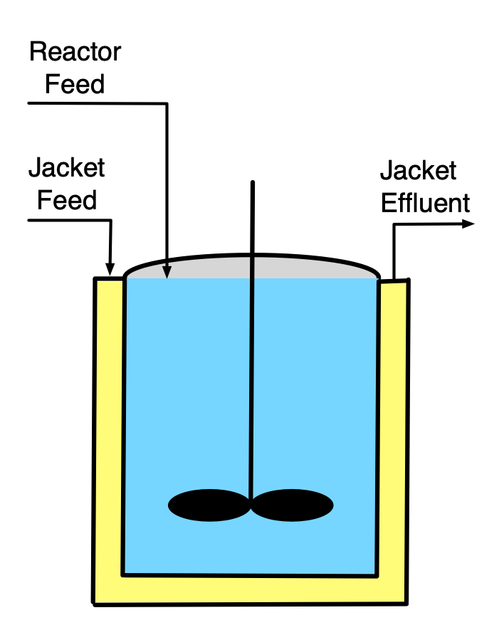
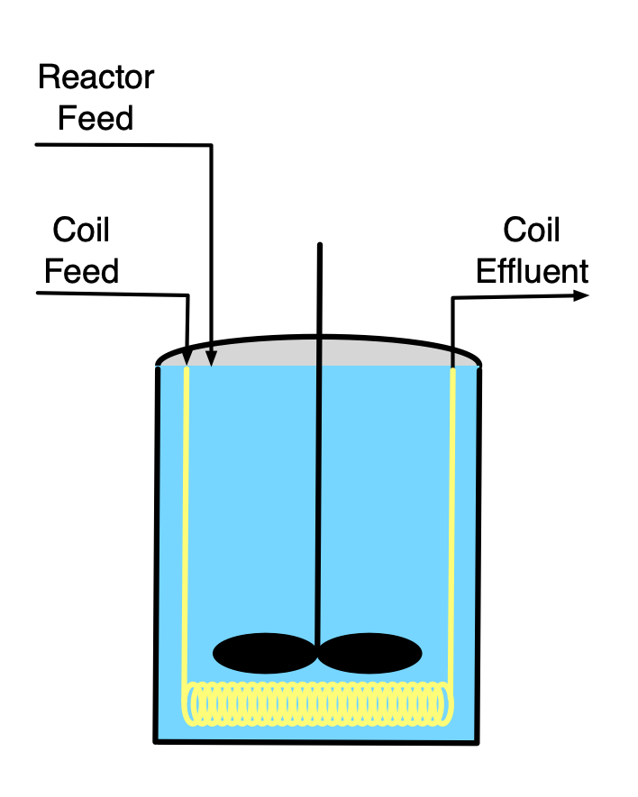
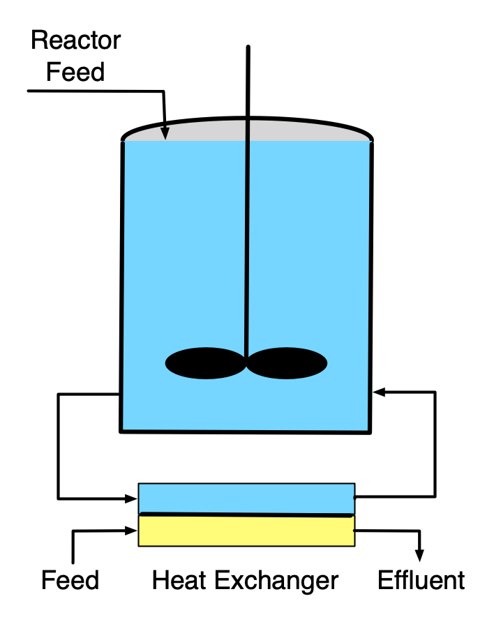
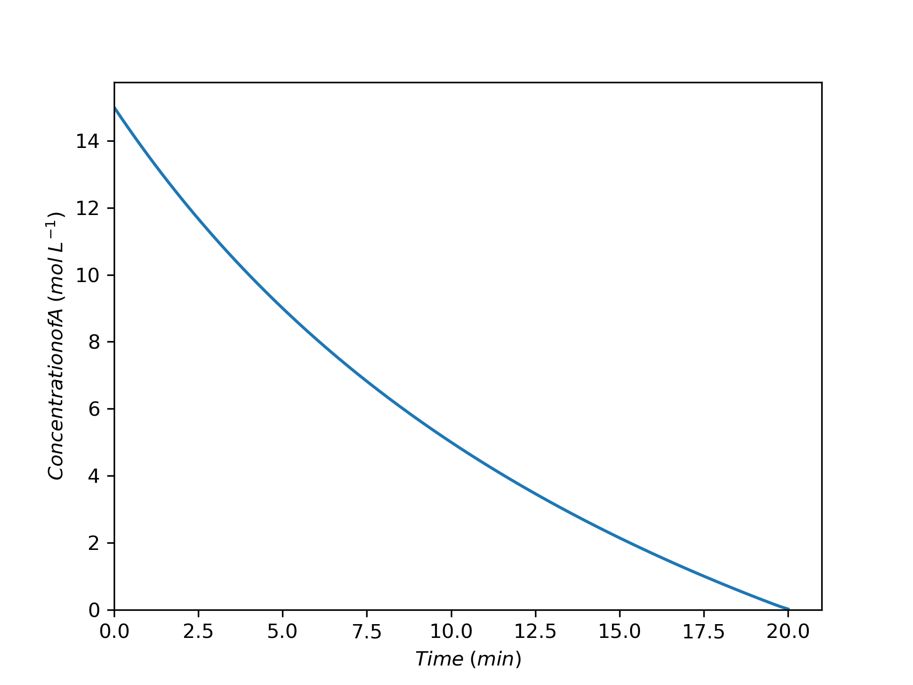
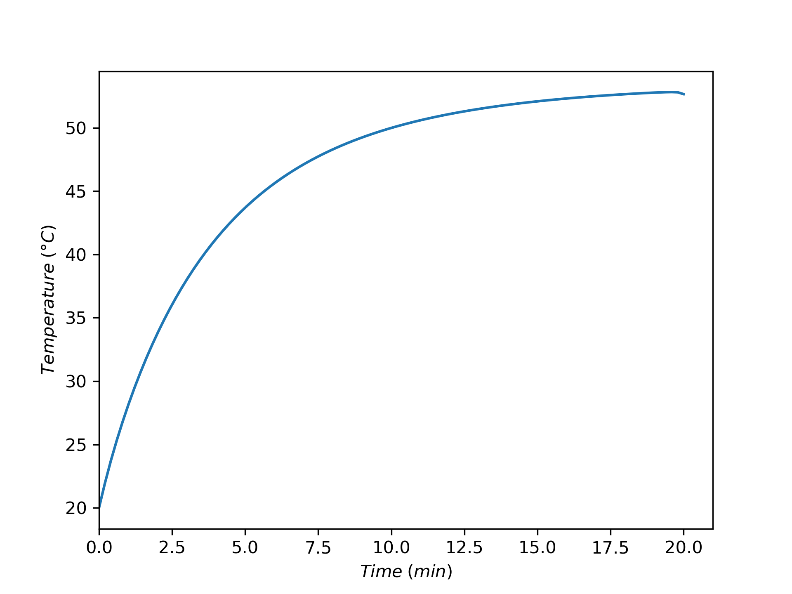
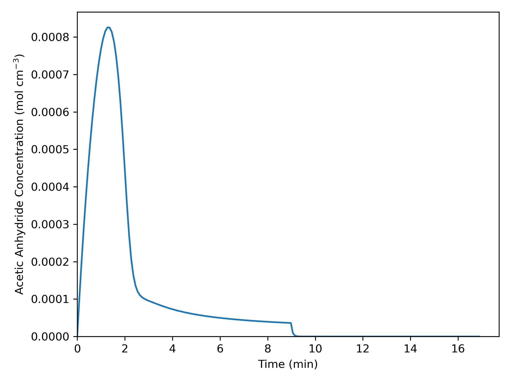
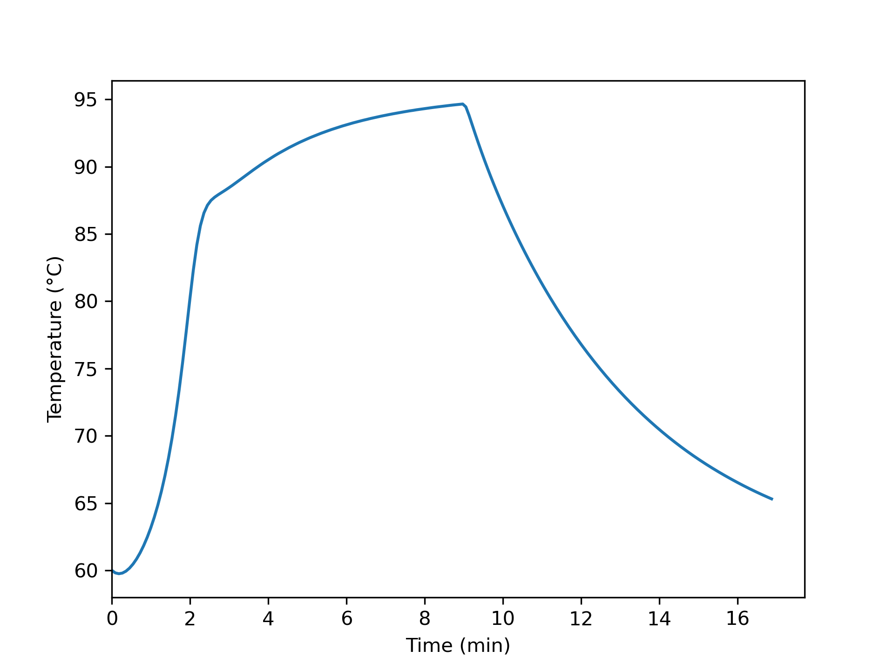

# SBSTR Analysis {#sec-ch8}

[Chapters -@sec-ch6] and -@sec-ch7 examined continuous and batch stirred tank reactors. This chapter introduces semi-batch stirred tank reactors (SBSTRs) and considers their analysis. It may prove helpful to keep the learning objectives in @sec-ch8_learning_objectives in mind while reading it.

## Ideal Semi-Batch Stirred Tank Reactors (SBSTRs)

The primary difference between semi-batch stirred tank reactors (SBSTRs) and BSTRs is that fluid flows into *or* out of an SBSTR while reactions are taking place. This chapter describes operation of semi-batch reactors, examines how flow in or out affects reactor response, and highlights advantages and disadvantages of SBSTRs, particularly as compared to BSTRs. Reactor modeling and analysis are only described and illustrated for SBSTRs where fluid flows *in* during reaction as illustrated schematically in @fig-sbstr_heat_exchange_schematics. Semi-batch reactors of this type are sometimes called fed-batch stirred tank reactors. A common form of semi-batch operation where reacting fluid leaves the reactor involves simple "reactive separation."

::: {#fig-sbstr_heat_exchange_schematics layout-ncol=3 layout-valign="center"}

{width="100%"}

{width="100%"}

{width="100%"}

Schematic representations of a fed-batch stirred tank reactor where heat is exchanged with an external fluid through the walls of (a) a jacket, (b) a submerged coil, and (c) an external heat exchanger.
:::

As for the other stirred tank reactors, the most common form of SBSTR is a cylindrical tank with rigid walls. Nonetheless, any reactor that conforms to the assumptions of an SBSTR can be modeled as one. Those assumptions are exactly the same as for a BSTR except that fluid either flows in or flows out (but not both) while the reaction is taking place. The flow may only occur for part of the time reaction is taking place. In that case the reactor is essentially a BSTR when there isn't any flow.

### Batch-Fed SBSTRs

Two advantages over BSTRs can be realized by adding one reagent to an SBSTR over time. One advantage is control of the rate of heat release. An example is the neutralization of a strong acid using a strong base. Such reactions can have very high rates and be highly exothermic. If all of the reagents are added at once, as in a BSTR, it may not be possible to remove heat fast enough to safely control the temperature. By slowly adding one of the reactants over time, the rate of heat release is limited by the rate of reagent addition and not the rate of reaction. The rate of addition can then be matched to the rate at which heat can be removed. In this way, the temperature can be controlled, allowing the reaction to occur safely.

When two or more reactions take place, semi-batch operation with the addition of one reagent can sometimes be used to control selectivity. This happens when the rates of the desired and undesired reactions exhibit different dependence upon the concentrations of the reactants. To illustrate, consider the parallel reaction of reactants A and B. In a BSTR process, the concentrations of A and B would be largest at the start of processing and would remain comparable throughout processing. Suppose instead, that reagent A is present at full concentration at the start of processing, but that reagent B is added to it over time. In this way, the concentration of A can be kept as large as possible while that of B is as low as possible over the course of processing. If the rate of the desired reaction is more favored by high concentration of A and low concentration of B, then semi-batch processing will result in better selectivity than batch processing.

The instantaneous selectivity defined in @eq-def_inst_select, and shown below, can be very useful in identifying situations where an SBSTR might present an advantage over a BSTR. Continuing with the example mentioned in the preceding paragraph, suppose that the desired reaction is first order in both reagents, A and B, and that the undesired reaction is second order in reagent B. In this situation, the instantaneous selectivity is given by @eq-inst_sel_example. The rightmost expression for the selectivity clearly shows that high concentration of A and low concentration of B result in higher selectivity for the products of the desired reaction over those of the undesired reaction.

$$
S_{D/U,inst} = \frac{\displaystyle \sum _j r_{D,j}}{\displaystyle \sum _j r_{U,j}} = \frac{k_DC_AC_B}{k_UC_B^2} = \frac{k_D}{k_U} \frac{C_A}{C_B}
$$

### Reactive Separation SBSTRs

Generally the descriptor, "reactive separation," applies to a wide range of processes wherein reaction and separation occur simultaneously. A number of different types of reactors fall into the category of reactive separation processes. Membrane reactors and reactive distillation columns are reactive separation devices. For present purposes, the term "reactive separation SBSTR" is limited to a two-phase, stirred-tank reactor, for example a reactor where the reacting fluid is boiling and the resulting vapor is removed during processing.

Reactive separation SBSTRs can offer an advantage when a reversible reaction is taking place. Specifically, if one of the products of the reaction is more volatile than the reactants, higher conversion can result in a reactive separation SBSTR than the conversion that would be realized using a BSTR. When using a BSTR, the maximum possible conversion is that where the reaction is becomes equilibrated. When that conversion is reached, the rate equals zero and no further conversion is possible. In contrast, in a reactive separation SBSTR one of the products of the reaction continually boils off and is removed. As a consequence, at a conversion where the BSTR was equilibrated, the SBSTR is not equilibrated because some of the product has been removed. In this way, a reactive separation SBSTR can reach a greater conversion than is possible in a BSTR.

The modeling and analysis of reactive separation SBSTRs is not considered in *Reaction Engineering Basics.* The presence of two phases, and particularly the presence of an interface between the two phases introduces the possibility that neither of the two phases is perfectly mixed. Put differently, it is often found that there are concentration gradients in the fluids near either or both sides of the interface. If such concentration gradients exist, the rate of mass transfer between the two phases can be affected, and it is necessary to modify the SBSTR design equations. Reacting, multi-phase systems with interfacial gradients are typically studied in more advanced courses on reaction engineering.

### Other Advantages and Disadvantages of SBSTRs

BSTRs and SBSTRs are both non-continuous reactors, so in comparison to continuous reactors, they have the same advantages and disadvantages. Their advantages include versatility (using the same reactor at different times to run different reactions) and flexibility such as the ability to sequentially vary the processing temperature. Their disadvantages are that their operation is labor intensive and they have lower net rates due to turnaround times. Generally SBSTRs and BSTRs are better suited to production of value-added products and not commodity products.

Three possible advantages of SBSTRs over BSTRs have already been mentioned: controling selectivity or temperature using the rate of reagent addition and increasing conversion in reversible reactions by removal of products. When one of these three effects can be used to advantage, an SBSTR is preferred. Arguably, operation of an SBSTR is slightly more involved than that of a BSTR, so without one of those advantages, a BSTR is likely preferred.

## SBSTR Operation

The operation of SBSTRs is very much like that of BSTRs (see @sec-ch7), the exception being that during some stages of the operational protocol, reagents are being added to SBSTRs. Operation of SBSTRs includes turnaround time, thereby allowing the definition of a net rate of production of a product like that for BSTRs, @eq-bstr_net_rate. Very often, processes begin as fed semi-batch processes, but then, when the reactor becomes full, the feed is stopped and they continue as batch processes. In these situations, it is not necessary to write separate BSTR design equations for the second stage of operation. The SBSTR design equations can still be used as long as all of the terms associated with the flow are set to zero.

When a reagent is fed to an SBSTR, the feed rate is often a critical factor. In some SBSTR processes, the feed rate controls the rate of reaction. Early in the process it may be essential to maintain a low feed rate, and thereby a low reaction rate, in order to control temperature rise. As the process progresses, the reaction rate will naturally decrease due to consumption of the reagent initially added to the reactor. This suggests that the feed rate could be increased over time. Alternatively, there may be a point at which the reaction rate is sufficiently low that it no longer needs to be limited by the feed rate and the remaining fed reactant can be added all at once. The net rate may be larger if a variable feed rate is used. This presents a variety of ways to optimize net rate, yield, or selectivity in an isolated SBSTR process.

## SBSTR Design Equations

The ideal SBSTR design equations are derived in [Appendix -@sec-apxc]. The general form of the SBSTR mole balance is presented in @eq-sbstr_mole_bal and the energy balance on the reacting fluid in an SBSTR is given in @eq-sbstr_energy_bal. It is easy to see that if the terms containing molar flow rate are set equal to zero, the BSTR mole and reacting fluid energy balances result. As was noted for the BSTR design equations, care must be taken to use consistent energy units for the $P-V$ terms and the heat terms in the reacting fluid energy balance.  The energy balances for a heat exchange fluid that exchanges only sensible heat, @eq-exchange_energy_bal_sensible, that only exchanges latent heat, @eq-exchange_energy_bal_latent, and that is a condensing vapor maintained at constant pressure, @eq-latent_heat_removing_only_liquid, are also reproduced below.

$$
\frac{dn_i}{dt} = \dot n_{i,in} + V \sum_j \nu_{i,j}r_j
$$ {#eq-sbstr_mole_bal}

$$
\begin{align}
\sum_i \left( n_i \hat C_{p,i}\right)  \frac{dT}{dt} -& V\frac{dP}{dt} - P\frac{dV}{dt} = \dot Q - \dot W -\\& \sum_i \dot n_{i,in} \int_{T_{in}}^T \hat C_{p,i}dT  - V\sum_j r_j \Delta H_j
\end{align}
$$ {#eq-sbstr_energy_bal}

$$
\rho_{ex} V_{ex} \tilde C_{p,ex}\frac{dT_{ex}}{dt} = -\dot Q - \dot m_{ex} \int_{T_{ex,in}}^{T_{ex}} \tilde C_{p,ex}dT
$$

$$
\frac{\rho_{ex} V_{ex} \Delta H_{\text{latent},ex}^0}{M_{ex}} \frac{d \gamma}{dt} = - \dot Q - \gamma \dot m_{ex} \frac{\Delta H_{\text{latent},ex}^0}{M_{ex}}
$$

$$
0 = \dot Q + \dot m_{ex} \frac{\Delta H_{\text{latent},ex}^0}{M_{ex}}
$$

Common simplifications of the SBSTR design equations are similar to those for CSTRs and BSTRs. The sensible heat terms in the energy balance above are written in terms of molar heat capacities. They can also be written in terms of the volumetric or gravimetric heat capacity of the reactiong fluid as a whole.

$$
\left(\sum_i n_i \hat C_{p,i} \right) \frac{dT}{dt}\ \Leftrightarrow\ \rho V \tilde C_p \frac{dT}{dt}\ \Leftrightarrow\ V \breve C_p \frac{dT}{dt}
$$

$$
\sum_i \dot n_{i,in} \int_{T_{in}}^T \hat C_{p,i}dT\ \Leftrightarrow\ \rho \dot V_{in} \int_{T_{in}}^T \tilde C_pdT\ \Leftrightarrow\ \dot V_{in} \int_{T_{in}}^T \breve C_pdT
$$

When the reacting fluid is an ideal gas, it expands to fill the physical volume of the reactor, and the reacting fluid volume, $V$, is constant (assuming rigid reactor walls), and its time derivative is equal to zero. For an incompressible ideal liquid, the time derivative of the reacting fluid volume is equal to the volumetric feed rate, and if the feed rate is constant, that expression can be integrated to get an expression for the reacting fluid volume.

$$
\frac{dV}{dt} = \dot V_{in}
$${#eq-sbstr_dVdt}

$$
V = V_0 + \dot V_{in}t
$${#eq-sbstr_V_vs_t}

When heat is added or removed using a heat exchange fluid, the rate of heat removal can be expressed in terms of the heat transfer coefficient and area. When rate expressions are substituted into the mole and energy balances, they may introduce concentration or, for gases, partial pressures. The instantaneous values of those composition variables are found using their defining equations. It is important to recognize that unlike a BSTR, the fluid volume in the defining equation for concentration will be changing during the time when feed is being added during a liquid-phase reaction.

$$
\dot Q = UA\left( T_{ex} - T \right)
$$

$$
C_i = \frac{n_i}{V}
$$

$$
P_i = \frac{n_iRT}{V}
$$

The general procedure for generating the design equations and the workflow for completing assignment that were presented in @sec-ch5 can be used for the analysis of SBSTRs. For liquid-phase systems, the change in reacting fluid volume will need to be accounted for using either @eq-sbstr_dVdt or @eq-sbstr_V_vs_t. For gases the ideal gas law, @eq-differential_ideal_gas_law, will need to be employed to account for pressure change as was the case for BSTRs. As already noted, if the operational protocol involves stages where fluid is not being added to the reactor, the BSTR stages can be modeled using the SBSTR design equations as long as all terms associated with the flow are set equal to zero. No new numerical methods are needed for the analysis of SBSTRs. The design equations will be IVODEs and may contain additional coupled unknowns as was found in the analysis of BSTRs

## Learning Objectives and Examples {#sec-ch8_learning_objectives}

* know the definition and/or defining equation for SBSTR mole balance and SBSTR energy balance
* understand that
	* the ideal SBSTR model assumes that the reacting fluid is a perfectly mixed, single-phase fluid
    * while reactions are taking place in an SBSTR, reagents flow into or out of the reactor
    * heat exchange fluid may flow through the reactor shell, coil, or external heat exchanger while reactions are taking place 
    * for gas phase systems, the differential form of the ideal gas law for a closed system must be added to the other SBSTR design equations before they can be solved
    * for liquid phase systems an equation accounting for the changing volume of the reacting fluid must be added to the other design equations
* be able to
	* select, modify, and simplify the design equations for modeling a given SBSTR 
	* use the SBSTR design equations, together with any other necessary equations, to complete a reaction engineering assignment involving
        * operational protocols with one or more stages
		* gas or liquid phase reacting systems
		* non-isothermal or adiabatic operation 
		* heat exchange fluids that transfer latent or sensible  heat
		* single or multiple reactions
		* response or optimization  tasks
	* use qualitative analysis to assess and explain results from a quantitative analysis 

Many of the outcomes mentioned above where illustrated for BSTRs in examples in @sec-ch7. Their realization for SBSTRs is analogous. The examples presented here focus on situations where an SBSTR may offer an advantage over a BSTR.

### Response of an SBSTR During Acid Neutralization {#sec-ch8_ex1}

A strong acid, A (15 M), at 20 °C is going to be neutralized using a strong base, B (15 M NaOH), also at 20 °C, equation (1). If the acid and the base were simply mixed together, they would react violently, releasing enough energy to raise their temperature to over 225 °C. Instead, a 10 L SBSTR will be used to neutralize 5.0 L of the acid. The acid will initially be present in the reactor, and the base will be added a rate of 0.25 L min^–1^ until 5 L of the base have been added. The reacting fluid will exchange heat with 2.5 L cooling water in a perfectly mixed shell. Chilled water at 20 °C will enter the shell at a rate of 2.5 L min^–1^. The heat transfer area is 2150 cm^2^ and the heat transfer coefficient is 73 cal cm^–2^ h^–1^ K^–1^. At the time the acid is charged to the reactor, the cooling water temperature within the heat exchanger is 20 °C. The density and heat capacity of the acid solution, base solution, and cooling water can all be taken to be those of water, 1 g cm^–3^ and  1 cal g^–1^ K^–1^. The neutralization reaction, equation (1), is irreversible with a heat of reaction equal to –13.7 kcal mol^–1^. The reaction is first order in both acid and base with a pre-exponential factor of 8.11 x 10^12^ L mol^–1^ s^–1^ and an activation energy of 17.7 kcal mol^–1^, equation (2). The pressure in the reactor will be constant and equal to 1 atm. Plot the acid concentration and the reactor temperature as functions of time while the base is being added.

$$
A + B \rightarrow S + W \tag{1}
$$

$$
r_1 = k_1C_AC_B \tag{2}
$$

---

:::{.callout-tip collapse="true"}
## Click Here to See What an Expert Might be Thinking at this Point

The assignment narrative describes a liquid-phase SBSTR that is cooled using sensible heat from an exchange fluid. Extensive quantities such as the volumes of the fluids are given, so a basis cannot be chosen. The assignment requests graphs versus time. Since the SBSTR design equations are IVODEs with time as the independent variable, solving them once will yield the molar amounts of the reagents and the temperatures versus time, so the equations will only need to be solved once to make the graphs. The assignment is only concerned with the first stage of the operating protocol during which the base is being added to the reactor.

I will begin by constructing a concise summary of the assignment. I will use subscripted zeros to denote initial values and subscripted "in" to denote inlet values. However, I'll use $V_A$ to represent the volume of the acid solution to be processed in one batch and $V_B$ to denote the volume of base per batch.

:::

**Assignment Summary**

[Reaction]{.underline}:

$$
A + B \rightarrow S + W \tag{1}
$$

[Rate Expression]{.underline}:

$$
r_1 = k_1C_AC_B \tag{2}
$$

[Reactor]{.underline}: Non-isothermal SBSTR

[Given Constants]{.underline}: $C_{A,0}$ = 15 M, $T_0$ = 20 °C, $C_{B,in}$ = 15 M, $T_{in}$ = 20 °C, $V$ = 10 L, $V_A$ = 5.0 L, $\dot{V}_{in}$ = 0.25 L min^–1^, $V_B$ = 5 L, $V_{ex}$ = 2.5 L, $T_{ex,in}$ = 20 °C, $\dot{V}_{ex,in}$ = 2.5 L min^–1^, $A_{ex}$ = 2150 cm^2^ , $U$ = 73 cal cm^2^ h^–1^ K^–1^, $T_{ex,0}$ = 20 °C, $\tilde{C}_p$ = $\tilde{C}_{p,ex}$ = 1 g cm^–3^, $\rho$ = $\rho_{ex}$ = 1 cal g^–1^ K^–1^, $\Delta H_1$ = –13.7 kcal mol^–1^, $k_{0,1}$ = 8.11 x 10^12^ L mol^–1^ s^–1^, $E_1$ = 17.7 kcal mol^–1^, and $P$ = 1 atm.
 
[Deliverables]{.underline}: $\underline{C}_A$ and $\underline{T}$ *vs.* $\underline{t}$ as graphs

**Formulation of the Equations**

:::{.callout-tip collapse="true"}
## Click Here to See What an Expert Might be Thinking at this Point

I'll follow the general workflow described in @sec-ch5 to complete this assignment. I know I'm going to need to solve the SBSTR design equations, so I'll start by identifying the balances I need and simplifying them as appropriate for this assignment. Mole balances must always be included among the design equations, and I'll write one for each reagent present in the system. Only one reaction is taking place, so the summation reduces to a single term, and only reagent B flows into the reactor, so $\dot n_{A,in}$ = $\dot n_{S,in}$ = $\dot n_{W,in}$ = 0.

$$
\frac{dn_i}{dt} = \dot n_{i,in} + V \sum_j \nu_{i,j}r_j \Rightarrow \dot n_{i,in} + \nu_{i,1} V r_1
$$

The reactor is not isothermal, so an energy balance on the reaction fluid, @eq-sbstr_energy_balance, must also be included among the reactor design equations. The assignment narrative provides the gravimetric heat capacity of the reacting fluid, so that can be used in the first term in place of the summation over the molar heat capacities. The reacting fluid is an ideal liquid, so the pressure is constant and its time deriviative is equal to zero. Liquid is being added to the reactor, so the reacting fluid volume is not constant and its derivative is not equal to zero. Apart from an agitator which can be assumed to do negligible work, there are no shafts or moving boundaries, so the rate of doing work is zero. The term for the sensible heat gained by the B that is fed to the reactor is expressed in terms of its molar flow rate and heat capacity. This term can be re-written in terms of the mass flow rate and heat capacity, and noting that the heat capacity is constant, it can be taken outside of the integral which then can be evaluated. Finally, there is only one reaction taking place so the final sum reduces to a single term.

$$
\begin{aligned}
\cancelto{\rho V \tilde{C}_p}{\sum_i \left( n_i \hat C_{p,i}\right)}  \frac{dT}{dt} &- \cancelto{0}{V\frac{dP}{dt}} - P\frac{dV}{dt} = \dot Q - \cancelto{0}{\dot W} \\&- \cancelto{\dot{m}_{B,in}\tilde{C}_p \left(T - T_{in}\right)}{\sum_i \dot n_{i,in} \int_{T_{in}}^T \hat C_{p,i}dT}  - \cancelto{Vr_1 \Delta H_1}{V\sum_j r_j \Delta H_j}
\end{aligned}
$$

$$
\rho V \tilde{C}_p \frac{dT}{dt} - P\frac{dV}{dt} = \dot Q - \rho \dot{V}_{in} \tilde{C}_p\left(T - T_{in}\right)  - V r_1 \Delta H_1
$$

The reactor is cooled using a heat exchange fluid that gains sensible heat. The temperature of the exchange fluid is not known and constant, so an energy balance on it, @eq-exchange_energy_bal_sensible, is also needed. Again, because the heat capacity is constant it can be taken outside of the integral, and the integral can be evaluated.

$$
\rho_{ex} V_{ex} \tilde C_{p,ex}\frac{dT_{ex}}{dt} = -\dot Q - \dot m_{ex} \int_{T_{ex,in}}^{T_{ex}} \tilde C_{p,ex}dT = -\dot Q - \dot m_{ex} \tilde C_{p,ex} \left( T_{ex} - T_{ex,in} \right)
$$

For an ideal liquid solution, the rate of change of the fluid volume within the reactor equals the net inlet volumetric flow rate because there is no $Delta V$ of mixing. I have two options for handling the time derivative of the volume. One is to add another design equation.

$$
\frac{dV}{dt} = \dot{V}_{in}
$$

That's the option I'm going to use. The other option is to replace $\frac{dV}{dt}$ in the energy balance with $\dot{V}_{in}$ and then to integrate the differential equation above to get an analytical expression that can be used to calculate $V$ when it is needed.

:::

[Reactor Model Equations]{.underline}

$$
\frac{dn_A}{dt} = - V r_1 \tag{3}
$$

$$
\frac{dn_B}{dt} = \dot n_{B,in} - V r_1 \tag{4}
$$

$$
\frac{dn_S}{dt} =  V r_1 \tag{5}
$$

$$
\frac{dn_W}{dt} =  V r_1 \tag{6}
$$

$$
\rho V \tilde{C}_p \frac{dT}{dt} - P\frac{dV}{dt} = \dot Q - \rho \dot{V}_{in} \tilde{C}_p\left(T - T_{in}\right)  - V r_1 \Delta H_1 \tag{7}
$$

$$
\rho_{ex} V_{ex} \tilde C_{p,ex}\frac{dT_{ex}}{dt} = -\dot Q - \dot m_{ex} \int_{T_{ex,in}}^{T_{ex}} \tilde C_{p,ex}dT = -\dot Q - \dot m_{ex} \tilde C_{p,ex} \left( T_{ex} - T_{ex,in} \right) \tag{8}
$$

$$
\frac{dV}{dt} = \dot{V}_{in} \tag{9}
$$

:::{.callout-tip collapse="true"}
## Click Here to See What an Expert Might be Thinking at this Point

The design equations are IVODEs, so solving them will yield corresponding sets of values of the independent variable, $t$, and the dependent variables, $n_A$, $n_B$, $n_S$, $n_W$, $T$, $T_{ex}$, and $V$. In order to solve them numerically (see @sec-apxd) I'll need to write a derivatives function that receives these quantities at the start of an integration step and returns the corresponding derivatives of the dependent variables with respect to $t$.

Before the derivatives in equations (3) through (8) can be evaluated, any additional unknowns appearing in them must be calculated. Going through those equations variable-by-variable I see that $r_1$, $\dot{n}_{B,in}$, $\dot{Q}$, and $\dot{m}_{ex}$ are unknown. The rate can be calculated using the given rate expression, equation (2), but that introduces $k_1$, $C_A$, and $C_B$ as additional unknowns. The Arrhenius expression can be used to calculate the rate coefficient, and the concentrations can be calculated using the defining equation for concentration.

The inlet molar flow of B can be calculated from the inlet volumetric flow rate and concentration of B. The rate of heat transfer can be calculated using the heat transfer area and coefficient, and the mass flow rate of the exchange fluid from its volumetric flow rate and density.

:::

[Reactor Model Variables]{.underline}: $\underline{t}$, $\underline{n}_A$, $\underline{n}_B$, $\underline{n}_S$, $\underline{n}_W$, $\underline{T}$, $\underline{T}_{ex}$, and $\underline{V}$.

[Additional Computable Unknowns]{.underline}: 

$$
k_1 = k_{0,1}\exp{\left(\frac{-E_1}{RT}\right)} \tag{10}
$$

$$
C_i = \frac{n_i}{V} \qquad i = A \text{ and } B \tag{11}
$$

$$
\dot{n}_{B,in} = \dot{V}_{in} C_{B,in} \tag{12}
$$

$$
\dot{Q} = UA_{ex}\left(T_{ex} - T \right) \tag{13}
$$

$$
\dot{m}_{ex} = \rho \dot{V}_{ex} \tag{14}
$$

:::{.callout-tip collapse="true"}
## Click Here to See What an Expert Might be Thinking at this Point

The derivatives function I provide must return the values of the individual derivatives. To do that, I need to write the design equations in the form of derivative expressions. All but one of them contains a single derivative. I could use linear algebra to calculate the derivatives, but it's easier just to substitute $\dot{V}_{in}$ for the derivative of the volume in the energy balance and then rearrange the two energy balances in the form of derivative expressions.

Since the design equations are IVODEs, in addition to a derivatives function, I'll need to provide initial values and a stopping criterion for solving them numerically. The independent variable is the elapsed time, $t$. I can define $t=0$ as the instant the flow of B into the reactor begins. The initial values are then simply the values of the dependent variables at that time. At that instant, only reagent A is present in the system, so the initial values of the molar amounts of B, S, and W are zero, $T_0$ and $T_{ex,0}$ are given, and the entire volume of acid is present in the reactor. The initial molar amount of A can be calculated from the known initial reacting fluid volume and the initial concentration of A.

When 5 L of the base solution have been added, the feed stops. Assuming the reacting fluid to be an ideal solution, the final volume will then equal the initial volume of acid in the reactor plus the volume of base added to it. This can be used to define the stopping criterion

$$
V_f = V_A + V_B
$$

Solving the design equations will give me sets of values of $t$, $n_A$, $T$, and $V$ spanning the time during which base was being added to the reactor. I can use the definition to calculate the concentration of A, giving me everything I need to make the requested graphs.

:::

[IVODE Solver Inputs]{.underline}: 

1. Initial values of the reactor model variables shown in @tbl-ch8_ex1_initial_values
2. Stopping criterion that $V$ equals the final value shown in @tbl-ch8_ex1_initial_values
3. Derivatives function that 
	a. receives the reactor model variables at the start of an integration step
	b. calculates the additional unknowns using equations (2), and (10) - (14)
	c. evaluates and returns the reactor design equation derivatives using equations (3) - (6), (9), (15), and (16)

$$
\frac{dT}{dt} = \frac{\dot Q - \rho \dot{V}_{in} \tilde{C}_p\left(T - T_{in}\right)  - V r_1 \Delta H_1 + P\dot{V}_{in}}{\rho V \tilde{C}_p} \tag{15}
$$

$$
\frac{dT_{ex}}{dt} = \frac{-\dot Q - \dot m_{ex} \tilde C_p \left( T_{ex} - T_{ex,in} \right)}{\rho V_{ex} \tilde C_p} \tag{16}
$$

| Variable | Initial Value | Stopping Criterion |
|:------:|:-------:|:-------:|
| $t$ | $0$ |  |
| $n_A$ | $n_{A,0} = C_{A,0}V_A$ | |
| $n_B$ | $0$ | |
| $n_S$ | $0$ | |
| $n_W$ | $0$ | |
| $T$ | $T_0$ | |
| $T_{ex}$ | $T_{ex,0}$ | |
| $V$ | $V_0 = V_A$ | $V_f = V_A + V_B$ |
  
: Initial and final values for solving the SBSTR design equations. {#tbl-ch8_ex1_initial_values}

[Deliverables Equations]{.underline}:

$$
\underline{C}_A = \frac{\underline{n}_A}{\underline{V}} \tag{17}
$$

**Implementation of the Calculations**

Computer code to perform the calculations can be written using a variety of programming languages and environments, and the actual code can be structured in a variety of ways. Referring to the preceding assignment summary and formulation of the equations, here are the essential things it must do.

1. Make the given and known constants available wherever they are needed.
2. Define the derivatives function.
3. Define the initial values and stopping criterion.
4. Call an IVODE solver
	a. pass the initial values, stopping criterion and derivatives function as arguments, and
	b. receive corresponding sets of values of the reactor model variables spanning the interval during which base was being added to the reactor.
5. Calculate corresponding values of the concentration of acid during that interval.
6. Generate the requested graphs.

**Results and Discussion**

The design equations were solved as described above. The concentration of acid during the time when base is being added to the reactor is shown in @fig-ch8_ex1_CA_vs_t, and the temperature during that time is shown in @fig-ch8_ex1_T_vs_t. The concentration decreases steadily for two reasons. First, it is being diluted by the added base and second it is reacting with the base. The final concentration of acid is less than 0.02 M.

{#fig-ch8_ex1_CA_vs_t width="70%"}

{#fig-ch8_ex1_T_vs_t width="70%"}

The temperature increases steadily during processing. This indicates that heat is being released by the reaction faster than it is being removed by the external cooling fluid. The assignment narrative noted that if the concentrated acid and base were mixed instantaneously, they would react violently and release sufficient heat to raise the temperature to 225 °C. The heat exchanger would not be able to remove heat that rapidly enough to keep the temperature under control. @fig-ch8_ex1_T_vs_t shows that by operating as an SBSTR and adding the base slowly over time, the temperature can be safely controlled. The final temperature is 52.7 °C.

**Deliverables**

The concentration and temperature profiles during the addition of the base to the SBSTR are shown in @fig-ch8_ex1_CA_vs_t and @fig-ch8_ex1_T_vs_t, respectively. At the instant the addition of the base to the reactor is completed, the concentration of acid is less than 0.02 M and the temperature of the reacting fluid is 52.7 °C

:::{.callout-note collapse="false"}
## Note

The solution presented here assumes that the full heat transfer area is used at all times. Initially the reactor would be approximately half full. If the jacket was the full height of the reactor, that would mean that the reacting fluid was only contacting half of the heat transfer area at the start of the reaction. This would reduce the rate of heat removal by approximately half at the start of the process, leading to a larger temperature increase. As the reactor filled, the reactor would contact a larger and larger fraction of the heat transfer area. Only when the reactor became full, would the reacting fluid contact the entire heat transfer area. An equation for calculating the heat transfer area would need to be added to the ancillary equations for evaluating the energy balances.

:::

### Yield in an SBSTR {#sec-ch8_ex2}

The rate expressions for reactions (1) and (2) are shown in equations (3) and (4). The Arrhenius parameters for these reactions are $k_{0,1}$ = 1.83 x 10^12^ L mol^-1^ h^-1^, $E_1$ = 18.0 kcal mol^-1^, $k_{0,2}$ = 5.08 x 10^13^ L mol^-1^ h^-1^, and $E_2$ = 20.5 kcal mol^-1^,  Reagent D is the desired product while reagent U is undesired. The heats of reactions (1) and (2) are -9000 and -7800 cal mol^-1^, respectively, and solutions of A and B have a heat capacity of 863 cal L^-1^ K^-1^.

A 2 M solution of A and a 0.5 M solution of B, both at 40 °C, are going to be used to produce D in an adiabatic semi-batch reactor operating at 1 atm. The reactor will be charged with 2000 L of the A solution, and 8000 L of the B solution will be added at a constant rate over a period of time. If the total reaction time is always 8 h, compare the overall conversion of B, the selectivity for D over U (final moles of D per final moles of U), and the yield of D from B (final moles of D per total moles of B added to the reactor) if the solution of B is added over the first 1, 3, 5, or 7 hours of operation.

$$
A + B \rightarrow D \tag{1}
$$

$$
2 B \rightarrow U \tag{2}
$$

$$
r_1 = k_1C_AC_B \tag{3}
$$

$$
r_2 = k_2C_B^2 \tag{4}
$$

---

:::{.callout-tip collapse="true"}
## Click Here to See What an Expert Might be Thinking at this Point

The assignment narrative describes the adiabatic operation of a liquid-phase stirred tank reactor. The operational protocol has 2 stages. During the first stage reagent B is added to the reactor, and during the second stage reaction continues in batch mode. The narrative provides extensive quantities, so a basis cannot be chosen. The quantities of interest are the conversion, selectivity and yield for four different stage 1 durations, with the same total process time. As such, the design equations will need to be solved four times, one for each stage 1 duration.

I'll begin by concisely summarizing the assignment using typical notation. I'll use $t_1$ to denote the duration of the first stage and $t_f$ to represent the total duration.

:::

**Assignment Summary**

[Reactions]{.underline}:

$$
A + B \rightarrow D \tag{1}
$$

$$
2 B \rightarrow U \tag{2}
$$

[Rate Expressions]{.underline}:

$$
r_1 = k_1C_AC_B \tag{3}
$$

$$
r_2 = k_2C_B^2 \tag{4}
$$

[Reactor]{.underline}: Adiabatic SBSTR with a 2 stage operational protocol

[Given Constants]{.underline}: $k_{0,1}$ = 1.83 x 10^12^ L mol^-1^ h^-1^, $E_1$ = 18.0 kcal mol^-1^, $k_{0,2}$ = 5.08 x 10^13^ L mol^-1^ h^-1^, $E_2$ = 20.5 kcal mol^-1^, $\Delta H_1$ = -9000 cal mol^-1^, $\Delta H_2$ = -7800 cal mol^-1^, $\breve{C}_p$ = 863 cal L^-1^ K^-1^, $C_{A,0}$ = 2 M, $C_{B,in}$ =  0.5 M, $T_0$ = $T_{in}$ = 40 °C, $P$ = 1 atm, $V_0$ = 2000 L, $V_B$ = 8000 L, $t_f$ = 8 h, and $R$ = 1.987 cal mol^-1^ K^-1^ = 0.08206 L atm mol^-1^ K^-1^.

[Parameter]{.underline}: $t_1 = \left[1, 3, 5, 7 \right]$ h

[Deliverables]{.underline}: $f_B$, $S_{D/U}$, and $Y_{D/B}$ for each value of $t_1$.

**Formulation of the Equations**

:::{.callout-tip collapse="true"}
## Click Here to See What an Expert Might be Thinking at this Point

I'm going to need to solve the SBSTR design equations to complete this assignment, so I'll generate them next. Mole balances are always included in the design equations. I'll write a mole banance for each of the four reagents. The general SBSTR mole balance is given in @eq-sbstr_mol_balance. Two reactions take place in this system, so the summation expands to two terms. The inlet molar flow rates of A, D, and U are all equal to zero. The only difference when there is a second phase of operation is that the inlet molar flow rate of reagent B is also equal to zero.

$$
\frac{dn_i}{dt} = \dot n_{i,in} + V \sum_j \nu_{i,j}r_j \Rightarrow \frac{dn_i}{dt} = \dot n_{i,in} + \nu_{i,1} V r_1 + \nu_{i,2} V r_2
$$

The reactor is not isothermal, so the mole balances cannot be solved independently of an energy balance. The general energy balance for an SBSTR is given in @eq-sbstr_energy_balance. The narrative provides a volumetric heat capacity that applies to solutions of A and B. Presumably this heat capacity is essentially equal to that of the solvent, so it can be used for both the reacting fluid and the feed stream, replacing the summations over molar heat capacities. The heat capacity is constant, so it can be taken outside of the integral, and the resulting trivial integral can be evaluated. The reactor is adiabatic, so $\dot{Q}$ is equal to zero and apart from agitation, no work is being done so $\dot{W}$ is neglibible. The reacting fluid is a liquid, so the pressure is constant and its time derivative is zero. Finally, two reactions are taking place, so the final summation expands to two terms. The only differences when there is a second phase of operation are that the $\frac{dV}{dt}$ term and the inlet volumetric flow rate are equal to zero.

$$
\begin{aligned}
\cancelto{V \breve{C}_p}{\sum_i \left( n_i \hat C_{p,i}\right)}  \frac{dT}{dt} &-V\cancelto{0}{\frac{dP}{dt}} - P\frac{dV}{dt} = \cancelto{0}{\dot Q} - \cancelto{0}{\dot W} \\&- \cancelto{\dot{V}_{in} \breve{C}_p \left( T - T_{in} \right)}{\sum_i \dot n_{i,in} \int_{T_{in}}^T \hat C_{p,i}dT}  - V\cancelto{\left(r_1 \Delta H_1 + r_2 \Delta H_2\right)}{\sum_j r_j \Delta H_j}
\end{aligned}
$$

Being an adiabatic reactor, there isn't an exchange fluid, so an exchange fluid energy balance is not needed. To this point, though, there are five ODE design equations, but they contain six dependent variables. So I either need to eliminate a dependent variable or add a design equation. I'll do the latter. Assuming the reacting fluid is an ideal mixture, the rate of change of the reacting fluid volume will equal the volumetric feed rate.

:::

[Reactor Model Equations]{.underline}

$$
\frac{dn_A}{dt} = -r_1V \tag{5}
$$

$$
\frac{dn_B}{dt} = \dot{n}_{B,in} -\left(r_1 + 2 r_2\right)V \tag{6}
$$

$$
\frac{dn_D}{dt} = r_1V \tag{7}
$$

$$
\frac{dn_U}{dt} = r_2V \tag{8}
$$

$$
V \breve{C}_p \frac{dT}{dt} - P\frac{dV}{dt} = -\dot{V}_{in}\breve{C}_p \left(T - T_{in} \right)  - r_1V \Delta H_1 - r_2V \Delta H_2 \tag{9}
$$

$$
\frac{dV}{dt} = \dot{V}_{in} \tag{10}
$$

:::{.callout-tip collapse="true"}
## Click Here to See What an Expert Might be Thinking at this Point

Being IVODEs, the design equations will be solved to find corresponding sets of values of the independent ($t$) and dependent ($n_A$, $n_B$, $n_D$, $n_U$, $T$, and $V$) variables. To do that any additional unknowns must first be calculated. Reviewing the design equations variable-by-variable, it is seen that the rates, inlet molar flow of B, and inlet volumetric flow rate are additional unknowns.

The rates can be calculated using the rate expressions provided in the assignment narrative. That introduces the rate coefficients and the concentrations of A and B as additional unknowns. The rate coefficients can be computed using the Arrhenius expression and the concentrations using their defining equations. The inlet molar flow rate of B can be calculated from the inlet volumetric flow rate and the inlet concentration of B, and the inlet volumetric flow rate from the volume of B to be added and the time over which it will be added.

The time over which B will be added cannot be computed. It is a parameter that will need to be provided at the time the equations are being solved.

:::

[Reactor Model Variables]{.underline}: $\underline{t}$, $\underline{n}_A$, $\underline{n}_B$, $\underline{n}_D$, $\underline{n}_U$, $\underline{T}$, and $\underline{V}$

[Additional Computable Unknowns]{.underline}:

$$
k_i = k_{0,i} \exp{\left(\frac{-E_i}{RT}\right)} \qquad i = 1 \text{ and } 2 \tag{11}
$$

$$
C_i = \frac{n_i}{V} \qquad i = A \text{ and } B \tag{12}
$$

$$
\dot{n}_{B,in} = \dot{V}_{in}C_{B,in} \tag{13}
$$

$$
\begin{align}
\dot{V}_{in} &= \frac{V_B}{t_1}; \qquad t \le t_1\\
\dot{V}_{in} &= 0; \qquad t > t_1
\end{align} \tag {14}
$$

[Additional Uncomputable Unknown]{.underline}: $t_1$
 
:::{.callout-tip collapse="true"}
## Click Here to See What an Expert Might be Thinking at this Point

The design equations are IVODEs and to solve numerically them I must provide a derivatives function, initial values, and a stopping criterion. Here I'll solve the design equations for each stage separately. I'll repeat the calculations for each of the specified stage 1 durations.

The derivatives function will receive the reactor model variables and must return the derivatives of the dependent variables with respect to the independent variable, $t$. Except for the energy balance, each of the design equations is written as a derivatives expression. To calculate the derivative of the temperature with respect to time, $\dot{V}_{in}$ can be substituted in the energy balance and then it can be solved for $\frac{dT}{dt}$. As long as $\dot{V}_{in}$ is set according to equation (14), the design equations can be used as written for both stages of operation.

I can define $t=0$ to be the time when the flow of reagent B into the reactor begins. The reacting fluid temperature and volume at that time are known. Only reagent A is present in the reactor, and its molar amount can be calculated using the known initial volume and initial concentration of A. The first stage of operation ends when the flow of reagent B ends at $t_{1}$.

The second stage begins immediately. Consequently the initial values are equal to the final values from the first stage, and they will be known after the design equations have been solved for the first stage. The second stage ends after 8 h of operation.

Once the design equations for both stages have been solved, the requested quantities can be calculated using their defining equations. In the calculation of the conversion and yield, the total amount of B added during processing is used.

:::
[IVODE Solver Inputs]{.underline}: 

1. Stage 1
	a. Initial values of the reactor model variables shown in @tbl-ch8_ex2_first_stage_initial_values.
	b. Stopping criterion that $t$ equals the final value shown in @tbl-ch8_ex2_first_stage_initial_values.
	c. Derivatives function that
		i. receives the reactor model variables at the start of an integration step
		ii. calculates the computable additional unknowns using equations (11) - (14)
		iii. evaluates and returns the design equation derivatives using equations (5) - (8), (10), and (15)

$$
\frac{dT}{dt} = \frac{-\dot{V}_{in}\breve{C}_p \left(T - T_{in} \right)  - r_1V \Delta H_1 - r_2V \Delta H_2 + P \dot{V}_{in}}{V \breve{C}_p} \tag{15}
$$

| Variable | Initial Value | Final Value |
|:------:|:-------:|:-------:|
| $t$ | $0$ | $t_1$ |
| $n_A$ | $n_{A,0} = C_{A,0}V_A$ | |
| $n_B$ | 0 | |
| $n_D$ | 0 | |
| $n_U$ | 0 | |
| $T$ | $T_0$ | |
| $V$ | $V_0 = V_A$ | |
  
: Initial and final values of the design equation variables for stage 1 of the operational protocol. {#tbl-ch8_ex2_first_stage_initial_values} 

2. Stage 1
	a. Initial values of the reactor model variables shown in @tbl-ch8_ex2_second_stage_initial_values.
	b. Stopping criterion that $t$ equals the final value shown in @tbl-ch8_ex2_second_stage_initial_values.
	c. Derivatives function that
		i. receives the reactor model variables at the start of an integration step
		ii. calculates the computable additional unknowns using equations (11) - (14)
		iii. evaluates and returns the design equation derivatives using equations (5) - (8), (10), and (15)

| Variable | Initial Value | Final Value |
|:------:|:-------:|:-------:|
| $t$ | $t_1$ | $t_f$ |
| $n_A$ | $n_A\big|_{t_1}$ | |
| $n_B$ | $n_B\big|_{t_1}$ | |
| $n_D$ | $n_D\big|_{t_1}$ | |
| $n_U$ | $n_U\big|_{t_1}$ | |
| $T$ | $T\big|_{t_1}$ | |
| $V$ | $V_A + V_B$ | |
  
: Initial and final values of the design equation variables for stage 2 of the operational protocol. {#tbl-ch8_ex2_second_stage_initial_values}

[Deliverables Equations]{.underline}:

$$
f_B = \frac{V_BC_{B,in} - \underline{n}_B\big|_{t_f}}{V_BC_{B,in}} \tag{16}
$$

$$
S_{D/U} = \frac{\underline{n}_D\big|_{t_f}}{\underline{n}_U\big|_{t_f}} \tag{17}
$$

$$
Y_{D/B} = \frac{\underline{n}_D\big|_{t_f}}{V_BC_{B,in}} \tag{18}
$$

**Implementation of the Calculations**

Computer code to perform the calculations can be written using a variety of programming languages and environments, and the actual code can be structured in a variety of ways. Referring to the preceding assignment summary and formulation of the equations, here are the essential things it must do.

1. Make the given and known constants available wherever they are needed
2. Define the derivatives function.
3. Define the initial values and stopping criterion for the first stage
4. Make the duration of the first stage available to the derivatives function
5. Call an IVODE solver
	a. pass the initial values and stopping criterion for the first stage and the derivatives function as arguments, and
	b. receive the reactor model variables for the first stage.
6. Repeat steps 3 through 5 for the second stage.
7. Calculate the quantities of interest.

**Results and Discussion**

The conversion of B, selectivity for D over U, and yield of D from B for each of the four addition times are shown in @tbl-ch8_ex2_results. The conversion of B decreases as its addition gets spread over longer times. This is reasonable because the later in the process that the B is added, the less time it has to react. Separate calculations show that if the reaction is run in a batch reactor the conversion is 85.7% with a selectivity for D over U of 2.88 and a yield of D from B of 50.6%.

| Stage 1 Duration (h) | Conversion (%) | Selectivity D/U | Yield D-B (%) |
|:------:|:-------:|:-------:|:-------:|
| 1 | 84.3 | 3.17 | 51.7 |
| 3 | 80.6 | 3.75 | 52.6 |
| 5 | 75.4 | 4.39 | 51.8 |
| 7 | 67.6 | 5.33 | 49.2 |
  
: Effect of the duration of stage 1 of the operational protocol on the overall conversion, selectivity, and yield. {#tbl-ch8_ex2_results}

Adding the B to A over time keeps the concentration of A as large as possible at all times and keeps the concentration of B lower than if it was all added at the start. The expression for the instantaneous selectivity for D over U for these reactions, equation (19), suggests that this should result in greater selectivity, and indeed, @tbl-ch8_ex2_results shows that the slower the B is added (i. e. the longer the time during which it is added), the greater the selectivity for D over U.

$$
S_{D/U,inst} = \frac{k_D}{k_U} \frac{C_A}{C_B} \tag{19}
$$

However, while the selectivity is increasing, the conversion of B is decreasing. As a consequence, the yield of D from B is nearly constant at approximately 50%, passing through a weak maximum when B is added over 3 h. The processing time in all cases is the same, 8 h. Hence, the operating costs, are basically the same. The net rate of production of D is essentially the same, too, because the yield of D is effectively constant.

In effect, the same amount of B is converted to D in all four cases, but as the addition time increases, the amount of B converted to U decreases while the amount of unreacted B increases. Comparing batch processing to semi-batch processing where the B is added during the first 7 h of the 8 h process, the same amount of D is produced at the same net rate. The difference is that in semi-batch mode there is more unreacted B while in batch mode there is more undesired U.

Semi-batch processing where the B is added during the first 7 h of the 8 h process has an advantage over batch processing in two scenarios. First, if reagent B is easily and inexpensively separable from the product mixture, not converting it to U, but instead recovering it and re-using it in a subsequent semi-batch run mitigates the low conversion.

The other scenario is when U is a valueless hazardous waste. The disposal of such a waste can add significantly to the cost of the process, thereby decreasing profits. In this scenario, even if the unconverted B cannot be separated and re-used, the cost of wasting reagent B (i. e. low conversion) may be more than offset by significantly lower expenses associated with disposal of U (because less U is generated).

**Deliverables**

@tbl-ch8_ex2_results summarizes the effect of varying the rate of addition of B upon conversion, selectivity and yield. As the rate of addition increases, the conversion increases and the selectivity decreases with the yield remaining approximately constant.

### Minimizing the Reaction Time in an SBSTR {#sec-ch8_ex3}

The hydrolysis of acetic anhydride, reaction (1), can run away thermally in a batch reactor, but this can be prevented using semi-batch operation. Suppose the rate can be described using the rate expression shown in equation (2) where the reaction is first order in acetic anhydride with a pre-exponential factor of 1.192 x 10^15^ min^-1^ and an activation energy of 97,600 J mol^-1^. The heat of reaction may be taken to be constant and equal to -58,615 J mol^-1^.

$$
\left(CH_3CO\right)_2O + H_2O \rightarrow 2 CH_3CO_2H \tag{1}
$$

$$
r_1 = k_1C_{\left(CH_3CO\right)_2O} \tag{2}
$$

The reacting fluid is cooled by water that is fed to the perfectly mixed, 300 cm^3^ reactor jacket at 60 °C and 250 cm^3^ min^-1^. The product of the heat transfer area and the heat transfer coefficient, $UA$, equals 260 cal min^-1^ K^-1^. 

The reactor operates at atmospheric pressure and initially contains an ideal liquid mixture of 67 cm^3^ of water, 283 cm^3^ of acetic acid (the solvent and product) and 0.30 cm^3^ of sulfuric acid at 60 °C. Initially the temperature of the water in the jacket is 60 °C, too. The heat capacity of the fluid in the reactor may be taken to be constant and equal to 2.68 J cm^-3^ K^-1^. A total of 350 cm^3^ of acetic anhydride at 21 °C needs to be processed. To do so, it will be fed to the reactor at a constant volumetric flow rate until all of it has been added, after which the reactor will operate in batch mode until the reacting fluid cools to 65 °C. At no time during processing can the reacting fluid temperature exceed 95 °C. What volumetric feed rate will minimize the processing time, and at that feed rate what will the final conversion of A equal? Plot (a) the temperature of the fluid in the reactor and (b) the concentration of acetic anhydride in the reactor as a function of processing time when that feed rate is used.

You may assume the liquid mixture to be ideal, and that the densities of acetic anhydride, acetic acid, and water are constant and equal to 1.082, 1.0, and 1.049 g cm^-3^, respectively. Their molecular weights are 102, 18, and 60 g mol^-1^, respectively, and the heat capacity of acetic anhydride being added to the reactor can be taken to be 168.2 J mol^-1^ K^-1^.

:::{.callout-note collapse="false"}
## Note

This problem is loosely based upon the work of Haldar and Rao [-@haldar_experimental_1992; -@haldar_experimental_1992-1], but the rate expression was modified and additional assumptions regarding fluid and reactor properties were introduced. This was done to avoid intricate details from obscuring the basic approach to the analysis of a semi-batch reactor. Therefore, the results presented here should not be used for engineering purposes, but rather the original work should be consulted.

:::

---

:::{.callout-tip collapse="true"}
## Click Here to See What an Expert Might be Thinking at this Point

The problem narrative describes an SBSTR that is cooled by transferring sensible heat to cooling water in the reactor jacket. Several extensive quantities are provided, so a basis cannot be chosen. The assignment asks for the volumetric feed rate that will minimize the processing time, subject to a constraint on the maximum temperature. To find that optimum feed rate, I choose a range of values for it, and then solve the design equations for each value in the range. The assignment also asks for the conversion and for plots of reactant concentration and temperature *vs.* time for that optimum feed rate.

I'll begin by summarizing the assignment using typical variables to represent the given and requested quantities. I'll use subscripted 0 to denote initial values, "in" to denote inlet values, and "opt" to denote that optimum value. Later in the analysis, I'll use a vertical bar with a subscripted $dot{V}_{opt"}$ to indicate a set of values of a reactor model variable calculated using the optimum feed rate. That is, for example, $\underline{n}_A\big|_{\dot{V}_{opt}}$ would indicate the set of values of $n_A$ found by solving the design equations using the optimum feed rate.

:::

**Assignment Summary**

To simplify the notation, $A$ represents $\left(CH_3CO\right)_2O$, $W$ represents $H_2O$, and $Z$ represents $CH_3CO_2H$.

[Reaction]{.underline}:

$$
A + W \rightarrow 2 Z \tag{1}
$$

[Rate Expression]{.underline}:

$$
r_1 = k_1C_A \tag{2}
$$

[Reactor]{.underline}:  Cooled SBSTR with a 2 stage operational protocol

[Given Constants]{.underline}: $k_{0,1}$ = 1.192 x 10^15^ min^-1^, $E_1$ =  97,600 J mol^-1^, $\Delta H_1$ = -58,615 J mol^-1^, $V_{ex}$ = 300 cm^3^, $T_{ex,in}$ = 60 °C, $\dot{V}_{ex,in}$ = 250 cm^3^ min^-1^ $UA$ = 260 cal min^-1^ K^-1^, $P$ = 1 atm, $V_{W,0}$ = 67 cm^3^ $V_{Z,0}$ = 283 cm^3^, $V_{H_2SO_4,0}$ = 0.30 cm^3^, $T_0$ = 60 °C, $T_{ex,0}$ = 60 °C, $\breve{C}_p$ =  2.68 J cm^-3^ K^-1^, $V_A$ = 350 cm^3^, $T_{in}$ =  21 °C, $T_f$ = 65 °C, $T_{max}$ = 95 °C, $\rho_A$ = 1.082 g cm^-3^, $\rho_W$ = 1.0 g cm^-3^, $\rho_Z$ = 1.049 g cm^-3^, $M_A$ = 102 g mol^-1^, $M_W$ = 18 g mol^-1^, $M_Z$ = 60 g mol^-1^, $\hat{C}_{p,A}$ = 168.2 J mol^-1^ K^-1^, $\rho_{ex}$ = 1.0 g cm^-3^, and $\tilde{C}_{p,ex}$ = 1 cal g^-1^ K^-1^.
 
[Parameter]{.underline}: $\dot{V}_{A,in}$

[Deliverables]{.underline}: $\dot{V}_{A,opt} = \underset{\dot{V}_{in}}{\arg\min}\left( \underline{t}_f \right)$ and, for $\dot{V}_{A,in} = \dot{V}_{A,pt}$, $f_{A,f}$ and $\underline{T}\big|_{\dot{V}_{opt}}$ and $\underline{C}_A\big|_{\dot{V}_{opt}}$ *vs.* $\underline{t}$ as graphs.

**Formulation of the Equations**

:::{.callout-tip collapse="true"}
## Click Here to See What an Expert Might be Thinking at this Point

This assignment requires the modeling of an isolated SBSTR/BSTR, so I need to generate the reactor design equations for it. Mole balances are always needed when modeling a reactor. The general SBSTR mole balance is given in @eq-sbstr_mol_balance. Only one reaction is taking place, so the summation reduces to a single term, and only reagent A flows into the reactor, so $\dot n_{W,in}$ = $\dot n_{Z,in}$ = 0. I won't write a mole balance for the acid since it does not react, and its molar amount is constant. The only difference in the second stage is that the flow of A into the reactor is also equal to zero, so I can use the same equations to model both stages of the operational protocol.

$$
\frac{dn_i}{dt} = \dot n_{i,in} + V \sum_j \nu_{i,j}r_j \Rightarrow \dot n_{i,in} + \nu_{i,1} V r_1
$$

The reactor is not isothermal, so an energy balance on the reacting fluid, @eq-sbstr_energy_balance, must also be included among the reactor design equations. I am given the volumetric heat capacity of the reacting fluid, so I can replace the summation over the molar heat capacities in the first term. The reacting fluid is a liquid, so the pressure is constant and its time derivative is equal to zero. Assuming the work associated with the agitator to be negligible and noting that there are no other shafts or moving boundaries, $\dot{W}$ is zero. The only reagent flowing into the reactor during operation as an SBSTR is A, so the first summation on the right-hand side of the equation reduces to a single term. Additionally, the heat capacity of A is a constant so it can be taken outside of the integral and the integral can be evaluated. Finally, only one reaction is taking place, so the sum over the reactions reduces to a single term. Again, noting that $\dot{n}_{A,in}$ is zero during the second stage, this one equation can be used to model both stages of the operating protocol.

$$
\begin{aligned}
\cancelto{V \breve{C}_p}{\sum_i \left( n_i \hat C_{p,i}\right)}  \frac{dT}{dt} &- \cancelto{0}{V\frac{dP}{dt}} - P\frac{dV}{dt} = \dot Q - \cancelto{0}{\dot W} \\&- \cancelto{\dot{n}_{A,in}\hat{C}_{p,A} \left(T - T_{in}\right)}{\sum_i \dot n_{i,in} \int_{T_{in}}^T \hat C_{p,i}dT}  - V\cancelto{r_1 \Delta H_1}{\sum_j r_j \Delta H_j}
\end{aligned}
$$

$$
V \breve{C}_p \frac{dT}{dt} - P\frac{dV}{dt} = \dot Q - \dot{n}_{A,in} \hat{C}_{p,A}\left(T - T_{in}\right)  - V r_1 \Delta H_1
$$

The reactor is cooled using water that gains sensible heat, so an energy balance on the exchange fluid, @eq-exchange_energy_bal_sensible, is also needed. Again, because the heat capacity is constant it can be taken outside of the integral and the integral can be evaluated. Dividing both sides of this equation by $\rho_{ex} V_{ex} \tilde C_{p,ex}$ will convert it to the form of a derivative expression.

$$
\rho_{ex} V_{ex} \tilde C_{p,ex}\frac{dT_{ex}}{dt} = -\dot Q - \dot m_{ex} \int_{T_{ex,in}}^{T_{ex}} \tilde C_{p,ex}dT = -\dot Q - \dot m_{ex} \tilde C_{p,ex} \left( T_{ex} - T_{ex,in} \right)
$$

I have five IVODE design equations that contain six dependent variables, so I either need to add an ODE or eliminate a dependent variable. Since the liquid is an ideal mixture, the change in the reacting fluid volume will equal the volumetric flow rate into the reactor, giving me the ODE I need.

$$
\frac{dV}{dt} = \dot{V}_{in}
$$

If I substitute this equation into the reacting fluid energy balance, I can solve the latter for the time deriviatve of the temperature. That will put all of the design equations in the form of derivative expressions in preparation for solving them numerically.

:::

[Reactor Model Equations]{.underline}

$$
\frac{dn_A}{dt} = \dot n_{A,in} - V r_1 \tag{3}
$$

$$
\frac{dn_W}{dt} = - V r_1 \tag{4}
$$

$$
\frac{dn_Z}{dt} = 2 V r_1 \tag{5}
$$

$$
V \breve{C}_p \frac{dT}{dt} - P\frac{dV}{dt} = \dot Q - \dot{n}_{A,in} \hat{C}_{p,A}\left(T - T_{in}\right)  - V r_1 \Delta H_1 \tag{6}
$$

$$
\frac{dT}{dt} = \frac{\dot Q - \dot{n}_{A,in} \hat{C}_{p,A}\left(T - T_{in}\right)  - V r_1 \Delta H_1 + P\dot{V}_{in}}{V \breve{C}_p} \tag{7}
$$

$$
\frac{dV}{dt} = \dot{V}_{in} \tag{8}
$$

:::{.callout-tip collapse="true"}
## Click Here to See What an Expert Might be Thinking at this Point

Since the design equations are IVODEs, they will be solved numerically to find corresponding sets of values of the independent and dependent variables. In order to do that, I will need to write a derivatives function that receives those variables at the start of an integration step and returns the corresponding derivatives. Before the derivatives can be evaluated, any additional unknowns must be calculated. Looking a the design equations for the reactor, it can be seen that the rate, inlet molar flow of reagent A, rate of heat transfer, and coolant mass flow rate need to be calculated.

The rate can be calculated using the provided rate expression, but that introduces the rate coefficient and the concentration of A as additional unknowns. The former can be calculated using the Arrhenius expression, and the latter using the defining equation for concentration. The inlet molar flow rate of A can be calculated from the volumetric feed rate, the density of A and its molecular weight. However, the volumetric flow rate can not be calculated. Instead, a range of values for it will be chosen and the current value will need to be provide at the time the design equations are solved. The rate of heat transfer can be calculated using the given heat transfer coefficient and area, and the mass flow rate of the coolant from its density and volumetric flow rate.

:::

[Reactor Model Variables]{.underline}: $\underline{t}$, $\underline{n}_A$, $\underline{n}_W$, $\underline{n}_Z$, $\underline{T}$, $\underline{T}_{ex}$, and $\underline{V}$.

[Additional Computable Unknowns]{.underline}: $r_1$, $k_1$, $C_A$, $\dot{Q}$, $\dot{m}_{ex}$, $\dot{V}_{in}$, and $\dot{n}_{A,in}$.

$$
k_1 = k_{0,1} \exp{\left( \frac{-E_1}{RT}  \right)} \tag{9}
$$

$$
C_A = \frac{n_A}{V} \tag{10}
$$

$$
\dot{Q} = UA\left(T - T_{ex} \right) \tag{11}
$$

$$
\dot{m}_{ex} = \dot{V}_{ex} \rho_{ex} \tag{12}
$$

$$
\dot{n}_{A,in} = \frac{\dot{V}_{in} \rho_A}{M_A} \tag{13}
$$

$$
\begin{align}
\dot{V}_{in} &= \dot{V}_{A,in} \qquad &0 \le t \le t_1\\
\dot{V}_{in} &= 0 \qquad &t > t_1
\end{align} \tag{14}
$$

[Additional Uncomputable Unknown]{.underline}: $\dot{V}_{A,in}$

$$
\underline{\dot{V}}_{A,in} = \left[38, \cdots, 40\right] \text{ cm}^3 \text{ min}^{-1} \tag{15}
$$

:::{.callout-tip collapse="true"}
## Click Here to See What an Expert Might be Thinking at this Point

In addition to a derivatives function, to solve the IVODE design equations I'll need to provide initial values and a stopping criterion. These will be different for the two stages of the operational protocol. I can define $t=0$ to be the instant that acetic anhydride begins to flow into the reactor. The initial values for the first stage are the values of the dependent variables at that time. Here, there isn't any A present, so it's initial value is zero. The the initial molar amounts of W and Z can be calculated from their initial volumes, densities and molecular weights. The initial temperatures and the initial reacting fluid volume are known. The first stage of operation ends when all of the A has been added to the reactor. I can designate that as $t_1$, noting that it will equal the total volume of A to be added divided by the inlet volumetric flow rate.

If the temperature is below $T_f$ at the end of the first stage, there is not second stage. More likely, the temperature will be above $T_f$ at the end of the first stage, in which case the second stage of operation begins immediately. The initial values for the second stage are simply equal to the final values from the first stage. The second stage ends when the temperature reaches $T_f$.

The calculation of the quantities of interest will require several steps. I'll choose a range of values of $\dot{V}_{A,in}$ that hopefully spans the value that minimizes the processing time. For each value I'll solve the design equations and check that the temperature did not exceed the specified maximum. (If it did, I'll set the processing time for that volumetric feed rate to infinity.) If the temperature constraint was satisfied, the processing time for that feed rate will be saved.

After solving the design equations for every value in the range of feed rates, the one where the processing time was smallest will be identified, making sure it is within the initially chosen range and not one of its endpoints. The design equations will then be solved using the feed rate that minimizes the processing time, and the results will be used to calculate the conversion and generate the plots.

:::
[IVODE Solver Inputs]{.underline}: 

1. Stage 1
	a. Initial values of the reactor model variables shown in @tbl-ch8_ex3_stage_1_initial_values.
	b. Stopping criterion that $t$ equals the final value shown in @tbl-ch8_ex3_stage_1_initial_values.
	c. Derivatives function that
		i. receives the reactor model variables at the start of an integration setp.
		ii. calculates the computable additional unknowns using equations (9) through (14)
		iii. evaluates and returns the design equation derivatives, equations (3) through (8).

| Variable | Initial Value | Stopping Criterion |
|:------:|:-------:|:-------:|
| $t$ | $0$ | $t_1 = \frac{V_A}{\dot{V}_{in}}$ |
| $n_A$ | $0$ | |
| $n_W$ | $n_{W,0} = \frac{V_{W,0}\rho_W}{M_W}$ | |
| $n_Z$ | $n_{Z,0} = \frac{V_{Z,0}\rho_Z}{M_z}$ | |
| $T$ | $T_0$ | |
| $T_{ex}$ | $T_{ex,0}$ | |
| $V$ | $V_0 = V_{W,0} + V_{Z,0} + V_{acid,0}$ | |
  
: Initial and final values for the first stage of operation. {#tbl-ch8_ex3_stage_1_initial_values}

2. Stage 2
	a. Initial values of the reactor model variables shown in @tbl-ch8_ex3_stage_2_initial_values.
	b. Stopping criterion that $T$ equals the final value shown in @tbl-ch8_ex3_stage_2_initial_values.
	c. Derivatives function that
		i. receives the reactor model variables at the start of an integration setp.
		ii. calculates the computable additional unknowns using equations (9) through (14)
		iii. evaluates and returns the design equation derivatives, equations (3) through (8).

| Variable | Initial Value | Stopping Criterion |
|:------:|:-------:|:-------:|
| $t$ | $t_1$ |  |
| $n_A$ | $n_A\big|_{t_1}$ |  |
| $n_W$ | $n_W\big|_{t_1}$ | |
| $n_Z$ | $n_Z\big|_{t_1}$ | |
| $T$ | $T\big|_{t_1}$ | $T_f$ |
| $T_{ex}$ | $T_{ex}\big|_{t_1}$ | |
| $V$ | $V\big|_{t_1}$ | |
  
: Initial and final values for the first stage of operation. {#tbl-ch8_ex3_stage_2_initial_values}

[Deliverables Equations]{.underline}:

$$
\forall \dot{V}_{A,in,n} \in \underline{\dot{V}}_{A,in} \quad \begin{pmatrix}
t_{f,n} = \underline{t}\big|_{T=T_f} & \max{\underline{T}} \le T_{max}\\
t_{f,n} = \infty & \max{\underline{T}} > T_{max}
\end{pmatrix} \tag{16}
$$

$$
\dot{V}_{A,opt} = \underset{\dot{V}_{A,in}}{\arg\min}\left( \underline{t}_f \right) \tag{17}
$$

$$
t_{opt} = \underset{\dot{V}_{A,in}}{\min}\left( \underline{t}_f \right) \tag{18}
$$

$$
f_{A,f} = \frac{\frac{\rho_A V_A}{M_A} - \left(\underline{n}_A\big|_{\dot{V}_{opt}}\right)\biggr|_{t_{opt}}}{\frac{\rho_A V_A}{M_A}} \tag{19}
$$

$$
\underline{C}_A\big|_{\dot{V}_{opt}} = \frac{\underline{n}_A\big|_{\dot{V}_{opt}}}{\underline{V}\big|_{\dot{V}_{opt}}} \tag{20}
$$

**Implementation of the Calculations**

Computer code to perform the calculations can be written using a variety of programming languages and environments, and the actual code can be structured in a variety of ways. Referring to the preceding assignment summary and formulation of the equations, here are the essential things it must do.

1. Make the given and known constants available wherever they are needed
2. Define the derivatives function.
3. Define a range of values of the volumetric feed rate
4. For each value in the defined range
	a. Define the initial values and stopping criterion for the first stage
	b. Make the current value of the feed rate available to the derivatives function
	c. Call an IVODE solver
		i. pass the initial values and stopping criterion for the first stage and the derivatives function as arguments, and
		ii. receive the reactor model variables for the first stage.
	d. Repeat steps 3 through 5 for the second stage.
	e. Check that the temperature constraint was satisfied
	f. Save the processing time
5. Find the volumetric feed rate where the processing time was smallest.
6. Solve the design equation using that optimum volumetric flow rate.
7. Calculate the conversion and generate the requested graphs.

**Results and Discussion**

The optimization results are shown in @tbl-ch8_ex3_results. The acetic anhydride concentration profile is shown in @fig-ch8_ex3_C_vs_t, and the temperature profile is shown in @fig-ch8_ex3_T_vs_t. A feed rate of 39 cm^3^ min^–1^ results in the minimum processing time, 16.9 min, that meets the temperature constraint. At the end of  processing, the conversion of acetic anhydride is 100%.

| Item | Value | Units |
|:------:|:-------:|:-------:|
| Minimum Total Processing Time | 16.9 | min |
| Semi-Batch Processing Time | 9.0 | min |
| Optimum Feed Rate | 39.0 | cm^3^ min^-1^ |
| Maximum Temperature | 94.7 | °C |
| Maximum Cooling Water Temperature | 77.6 | °C |
| Acetic Anhydride Conversion | 100.0 | % |
  
: Initial and final values for the first stage of operation. {#tbl-ch8_ex3_results}

{#fig-ch8_ex3_C_vs_t width="70%"}

{#fig-ch8_ex3_T_vs_t width="70%"}

@fig-ch8_ex3_T_vs_t shows that the reacting fluid temperature just reaches 95 °C at the end of semi-batch processing. If the acetic anhydride was fed any faster, the temperature would exceed the specified maximum. Lowering the feed rate would increase the processing time. @tbl-ch8_ex3_results shows that the cooling water reaches a maximum temperature of 77.6 °C.

The shapes of the profiles are consistent with a qualitative analysis of the process. During semi-batch processing two factors are at work with respect to the reactant concentration and three factors are at work with respect to the temperature. The flow into the reactor tends to increase the reactant concentration while the reaction tends to decrease it. @fig-ch8_ex3_C_vs_t shows that the concentration rises steadily until it passes through a maximum. Prior to the maximum, the feed is adding A faster than the reaction is consuming it. After the maximum, the opposite is true. Of course increasing the concentration tends to increase the rate and decreasing it tends to decrease the rate. Once the feed stops, at 9 min, the concentration quickly drops to zero.

As for temperature, the cold feed and the cooling water remove heat and tend to lower the temperature while the reaction releases the heat of reaction. @fig-ch8_ex3_T_vs_t shows that initially the temperature drops very slightly. This is a result of the cold feed; heat generation is negligible because the reactant concentration is near zero making the rate very small. As the concentration of A increases the rate increases, which, in turn, increases the amount of heat being released in the system. At about the point where the concentration reaches its maximum, the temperature rise slows. This occurs because the decreasing concentration reduces the rate thereby lowering the heat being released by the reaction. Finally, at 9 min, after all of the A has been added, the rate goes to zero and heat is no longer being released into the system. From that point forward, the temperature drops as heat is removed by the cooling water.

**Deliverables**

A volumetric feed rate of 39 cm^3^ min^–1^ yields the smallest processing time (9 min) that satisfies the maximum temperature constraint. With that feed rate, 100% of the acetic anhydride is converted. The acetic acid concentration and temperature profiles for that volumetric feed rate are shown in @fig-ch8_ex3_C_vs_t and @fig-ch8_ex3_T_vs_t.

## Symbols Used in @sec-ch8

| Symbol | Meaning |
|:-------|:--------|
| $i$ | index denoting a reagent. |
| $k_j$ | rate coefficient for reaction $j$. |
| $\dot{m}_{ex}$ | mass flow rate of the heat exchange fluid. |
| $n_i$ | molar amount of reagent $i$; an additional subscripted $0$ indicates the molar amount at time zero. |
| $\dot{n}_{i,in}$ | net molar flow rate of reagent $i$ into the SBSTR. |
| $r_{i,j}$ | rate of generation of reagent $i$ via reaction $j$. |
| $t$ | elapsed time. |
| $A$ | heat transfer area. |
| $C_i$ | molar concentration of reagent $i$. |
| $\hat{C}_{p,i}$ | molar, constant-pressure heat capacity of reagent $i$ |
| $\tilde{C}_{p,ex}$ | mass-specific, constant-pressure heat capacity of the heat exchange fluid. |
| $\breve{C}_p$ | volume-specific, constant-pressure heat capacity of the reacting fluid, additional subscripts denote fluids other than the reacting fluid. |
| $M_{ex}$ | molecular weight of the heat exchange fluid. |
| $P$ | pressure of the reacting fluid, a subscripted $i$ denotes the partial pressure of reagent $i$. |
| $\dot{Q}$ | rate of heat transfer *to* the reacting fluid, additional subscripts distinguish between different sources of the heat. |
| $R$ | ideal gas constant. |
| $S_{D/U,inst}$ | instantaneous selectivity for reagent D over reagent U. |
| $T$ | temperature, no subscript denotes the reacting fluid, a subscripted $ex$ denotes the heat exchange fluid, an additional subscripted $0$ denotes an initial temperature, $in$ an inlet temperature and $f$ a final temperature. |
| $U$ | heat transfer coefficient. |
| $V$ | volume of reacting fluid in the reactor; an additional subscripted $0$ indicates the volume at time zero. |
| $\dot{V}_{in}$ | volumetric flow rate into the reactor. |
| $\dot{W}$ | rate at which the reacting fluid performs work on its surroundings. |
| %\gamma$ | fraction of the heat exchange fluid that undergoes phase change. |
| $\nu_{i,j}$ | stoichiometric coefficient of reagent $i$ in reaction $j$. |
| $\rho$ | density, no subscript denotes the reacting fluid, a subscripted $ex$ denotes the heat exchange fluid. |
| $\Delta H_j$ | heat of reaction $j$. |

: {tbl-colwidths="[20,80]"}